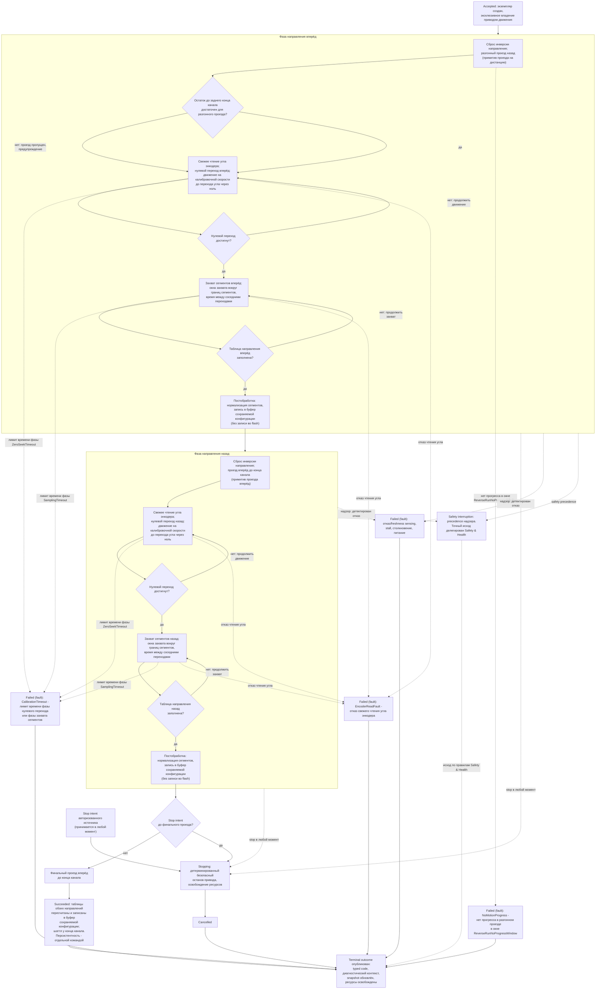

# Алгоритмическая документация операции Calibrate (V3)

Статус: подготовлено по issue [«Алгоритмическая документация: Calibrate»](https://github.com/Driadix/ShuttleControllerV3/issues/40) карты [«Спроектировать спецификацию и план прошивки контроллера V3»](https://github.com/Driadix/ShuttleControllerV3/issues/1). Окончательное утверждение ревизий выполняется на gate `G1 Behavioral Contract`.

Формат документа задан [«Формат алгоритмической документации операций V3»](./algorithmic-documentation-format-v3.md): 12-раздельный каркас, трёхслойное разделение содержание/evidence/структура, narrative на русском языке без формул и чисел, идентификаторы на английском. Общая рамка admission, ownership, надзора, прерываний и публикации outcomes задана [«Глобальной алгоритмической документацией работы шаттла V3»](./global-algorithmic-documentation-v3.md); lifecycle, identity, admission и idempotency заданы [«Общим semantic contract операций V3»](./semantic-contract-v3.md).

Evidence: [Capability Evidence Slices каталога операций V3](./research/v3-capability-evidence-slices.md), раздел «Calibrate (CMD_CALIBRATE = 0x16)» группы «Home / Calibrate / Evacuate», разделы «Общие entry points и dispatch skeleton», «Дополнительные зафиксированные аномалии/мёртвый код (по scope)», «Парсер: MSG_CMD_SIMPLE vs MSG_CMD_WITH_ARG для CMD_HOME/CMD_CALIBRATE» и «Сводные unknowns и validation obligations» (U04, U07); канонический snapshot V1 - `Driadix/ShuttleController@708d090`. Далее ссылки вида «bundle, …» указывают на этот документ.

## 1. Identity и назначение

`Calibrate` - root operation type каталога V3 (решение [«Определить каталог и базовые инварианты операций V3»](https://github.com/Driadix/ShuttleControllerV3/issues/9)). Допустимая роль экземпляра - root; child-роль контракт типа не предусматривает.

Доменная цель - перекалибровать сегментные таблицы позиционного энкодера для обоих направлений движения шаттла: таблица каждого направления пересчитывается по фактическому ходу привода, результат помещается в буферы сохраняемой конфигурации (запись во flash отдельной командой персистентности, не входит в операцию). Калибровка компенсирует неравномерность сегментов магнитного энкодера при интеграции пройденного пути (модель позиционирования, раздел 10).

Структура V1 - две последовательные фазы, по одной на направление: фаза калибровки направления вперёд начинается разгонным проездом назад и завершается захватом сегментов при движении вперёд; фаза калибровки направления назад начинается проездом вперёд до конца канала и завершается захватом сегментов при движении назад. Двухфазная структура F+R сохраняется (раздел 11). После обеих фаз выполняется финальный проезд вперёд до конца канала.

Отношение к другим документам: admission-скелет, stop propagation, fault semantics, link-loss рамка и публикация outcomes не повторяются здесь, а применяются по глобальному документу и semantic contract; документ фиксирует только доменный алгоритм `Calibrate` и его тип-специфичные paths, условия и исходы. Примитивы проезда (`moove_Distance_R`, `moove_Forward`) разделяют с операциями `MoveDistance` и `Home`; их доменная семантика фиксируется документами этих операций и разделом 10.

## 2. Admission и условия входа

Запрос поступает от `Control Client` в пределах выданных полномочий; `Safety Authority` и `Service Client` этот тип не запрашивают. Envelope, epoch fencing, idempotency и конфликтная семантика - по semantic contract.

Параметры: тип параметров не имеет - «без параметров». V1 принимал как простой пакет команды, так и пакет с аргументом, молчаливо игнорируя аргумент (bundle, Calibrate - Admission/preconditions; Парсер); молчаливое игнорирование в V3 не переносится (раздел 11).

Системные preconditions (по глобальному документу): provisioning gate, fault-state gate, наличие в канале (для `Calibrate` внеканальное исполнение не разрешено - команда не входит в exempt-список), эксклюзивность (одна активная Exclusive Control Activity; приём только из idle-состояния по `isShuttleIdle()`). Отрицательный результат - `Rejected` со стабильным rejection code, экземпляр не создаётся.

Условия, проверяемые только in-situ после принятия (дают runtime outcome, а не `Rejected`):

- стартовый порог разгонного проезда: остаток расстояния до заднего конца канала не менее минимального стартового порога (условие `ReverseRunStartGuard`, класс configured). При провале V1 пропускает разгонный проезд с предупреждением и продолжает калибровку с текущей позиции (warn-and-continue, разделы 3, 5); валидность калибровки при пропущенном проезде - unknown U04;
- успешность свежих чтений угла энкодера на каждой подфазе (отказ - fault-путь `EncoderReadFault`, раздел 5);
- разрешение старта движения по freshness направленного sensing на каждом старте привода (условие `MotionFreshnessPermit`; глобальный документ, раздел 8).

Согласованность с semantic contract: admission атомарен, повторная проверка принятия после положительного ACK исключена (решение [«Специфицировать общий semantic contract операций V3»](https://github.com/Driadix/ShuttleControllerV3/issues/13)); занятость единственного активного экземпляра выражается `ResourceConflict`; idempotency - по ключу `(controllerEpoch, authorityId, requestId)`; контракт типа не содержит policy-параметров (MaxIterations и progress counters не вводятся).

## 3. Normal path

1. **Принятие.** Admission пройден, экземпляр в `Accepted`, положительный ACK выдан. Root получает эксклюзивное владение приводом движения; лифтер в операции не используется (исключение - V1 fault-путь разгонного проезда, раздел 5). Телеметрическое состояние - `STATE_CALIBRATE` на время исполнения.
2. **Начало фазы направления вперёд.** Сбрасывается инверсия направления (V1-дефект без восстановления - раздел 11). Выполняется разгонный проезд назад на разгонную дистанцию (примитив проезда на дистанцию, условие `ReverseRunDistance`): если остаток до заднего конца канала меньше стартового порога `ReverseRunStartGuard`, проезд пропускается с предупреждением, и калибровка продолжается с текущей позиции. В проезде действует окно отсутствия прогресса `ReverseRunNoProgressWindow` - при его истечении fault-путь `NoMotionProgress`.
3. **Свежее чтение угла.** Читается угол энкодера; отказ чтения - fault-путь `EncoderReadFault`.
4. **Нулевой переход вперёд.** Привод стартует вперёд (с разрешением `MotionFreshnessPermit`) и движется на калибровочной скорости до перехода угла через ноль (раздел 4). На итерациях повторно подаётся калибровочная скорость с периодом поддержания `CalibrationSpeedKeepAlive` и выполняется свежее чтение угла с минимальным периодом `EncoderReadMinPeriod`; отказ чтения - `EncoderReadFault`. Превышение лимита времени фазы `ZeroSeekTimeout` - fault-путь `CalibrationTimeout`.
5. **Захват сегментов вперёд.** В цикле захвата (раздел 4) движущийся привод проходит границы сегментов таблицы направления вперёд; каждый сегмент захватывается, когда угол попадает в окно захвата `SegmentCaptureWindow` вокруг его границы, и записывается время между соседними переходами. Цикл длится до заполнения таблицы; превышение лимита времени фазы `SamplingTimeout` - fault-путь `CalibrationTimeout`; отказ чтения угла - `EncoderReadFault`.
6. **Постобработка фазы вперёд.** Захваченные времена нормализуются в длины сегментов и записываются в таблицу направления вперёд и в буфер сохраняемой конфигурации (без записи во flash). Смысл нормализующей формулы - unknown U04.
7. **Фаза направления назад.** Сбрасывается инверсия направления (та же V1-особенность). Выполняется проезд вперёд до конца канала (примитив проезда вперёд); abort-проверка проезда содержит мёртвую ветку V1 (раздел 11).
8. **Свежее чтение угла и нулевой переход назад.** Читается угол; отказ - `EncoderReadFault`. Привод стартует назад и движется на калибровочной скорости до перехода угла через ноль с теми же условиями фаз, что и в шаге 4 (`ZeroSeekTimeout`).
9. **Захват сегментов назад.** Сегменты таблицы направления назад захватываются в обратном порядке границ с тем же окном захвата `SegmentCaptureWindow` и теми же условиями фаз (`SamplingTimeout`, отказ чтения угла).
10. **Постобработка фазы назад.** Захваченные времена нормализуются и записываются в таблицу направления назад и в буфер сохраняемой конфигурации.
11. **Финальный проезд.** При отсутствии прерывания выполняется финальный проезд вперёд до конца канала; позиция шаттла переустанавливается у передней стены (семантика примитива проезда вперёд, документ `Home`). Экземпляр завершает алгоритм `Succeeded`.
12. **Завершение.** Ресурсы и делегирования освобождены, terminal outcome опубликован, snapshot обновлён. Платформа готова к новому запросу.

Инвариант соблюдается: `Succeeded` публикуется только при пересчитанных таблицах обоих направлений, записанных в буферы сохраняемой конфигурации, и шаттле у конца канала после финального проезда. Останов до завершения любым путём даёт соответствующий ненулевой исход (в V1 прерывание не различалось от успеха по статусу - раздел 11, change).

Наблюдаемое ограничение персистентности: результат операции живёт в буферах сохраняемой конфигурации и runtime-массивах; сохранение во flash выполняется отдельной командой персистентности (`PersistConfiguration`) и только в покое. Восстановление калибровки из flash после перезагрузки в V1 закомментировано - после reboot позиционирование использует дефолтные значения (unknown U04, разделы 5, 6, 8, 11).

## 4. Ожидания и повторения

Операция не содержит ожиданий внешних событий канальной логистики: калибровка не взаимодействует с паллетами и внешними акторами, все длительные активности - condition-driven циклы движения.

Длительные активности и их явные условия:

- **Разгонный проезд назад** (примитив проезда на дистанцию): вход - старт привода назад; выход - разгонная дистанция пройдена либо прервано (конец канала вмешался, окно отсутствия прогресса `ReverseRunNoProgressWindow`, stop, fault, надзор).
- **Цикл нулевого перехода** (по одному на фазу): вход - старт привода на калибровочной скорости в направлении фазы; выход - угол пересёк ноль (normal), лимит времени фазы `ZeroSeekTimeout` истёк (fault), отказ чтения угла (fault), stop либо надзор. Повторная подача калибровочной скорости с периодом `CalibrationSpeedKeepAlive` и свежее чтение угла с минимальным периодом `EncoderReadMinPeriod` выполняются на каждой итерации.
- **Цикл захвата сегментов** (по одному на фазу): вход - нулевой переход достигнут; выход - таблица направления заполнена (normal), лимит времени фазы `SamplingTimeout` истёк (fault), отказ чтения угла (fault), stop либо надзор. На каждой итерации выдерживается пауза захвата `SamplingIterationPause` (в V1 блокирующая - раздел 11, change-предложение), повторно подаётся калибровочная скорость и читается угол.

Warn-and-continue поведение: пропуск разгонного проезда при недостаточном остатке до заднего конца канала - предупреждение `ReverseRunStartGuard` и продолжение калибровки с текущей позиции (observable event; валидность результата - unknown U04, раздел 5). V1-циклы захвата не содержали явной проверки прерывания - stop/fault во время захвата обрабатывались косвенно через кооперативный системный сервис и проявлялись на следующей фазе (раздел 11, change-предложение).

## 5. Прерывания

Рамка stop/fault/safety precedence - глобальный документ, раздел 5; здесь зафиксированы тип-специфичные paths.

### Stop

Stop принимается в любой момент после принятия экземпляра и переводит его в `Stopping`: детерминированный безопасный останов привода движения, освобождение ресурсов, исход `Cancelled`. Точки приёма stop в V1: кооперативный системный сервис на каждой итерации всех циклов; явные abort-проверки в разгонном проезде и циклах нулевого перехода останавливают привод и завершают подфазу; циклы захвата проверок не содержали (пункт выше) - останов срабатывал на следующей фазе или финальном проезде. После stop финальный проезд не исполняется; таблицы остаются частичными, snapshot несёт фактическое состояние и частичный результат. V1 после stop возвращался в IDLE со статусом останова, не различимым от штатного завершения; в V3 stop даёт `Cancelled` (раздел 11, change).

### Fault

Fault - детектированный внутренний отказ; экземпляр завершается `Failed` с кодом класса `fault` и диагностическим контекстом. Тип-специфичные детектируемые условия:

- `CalibrationTimeout` - превышение лимита времени фазы нулевого перехода (`ZeroSeekTimeout`) или фазы захвата сегментов (`SamplingTimeout`) в любой из фаз; V1 выставляет `FAULT_MOVE_TIMEOUT`, останавливает привод и завершает подфазу.
- `NoMotionProgress` - отсутствие приращения позиции в течение окна `ReverseRunNoProgressWindow` в разгонном проезде (watchdog примитива проезда на дистанцию; документ `MoveDistance`). V1-путь дополнительно принудительно опускал лифтер - операция смены состояния платформы как побочный эффект fault является safe reaction; disposition - change (предложение) до подтверждения `Safety & Health`, по паттерну документа `MoveDistance` (раздел 5).
- `EncoderReadFault` - отказ свежего чтения угла энкодера в любой подфазе: V1 останавливает привод и завершает подфазу, отказ latch-ится как `FAULT_AS5600`. В фазе вперёд отказ на старте оставлял статус команды не изменённым, и V1 продолжал диспетчеризацию следующих фаз (пункт ниже).
- Отказ или потеря freshness направленного sensing на стартах привода (`MotionFreshnessPermit`) и во время движения, stall привода, столкновение, питание ниже порога - сквозные paths надзора (глобальный документ, раздел 5).

V1-диспетчер не проверял fault/stop между фазами: при fault в фазе вперёд фаза назад и финальный проезд всё равно вызывались и немедленно abort-ились своими проверками; промежуточные вызовы старта привода при активном fault успевали поднять флаг движения до следующей abort-проверки (bundle, Calibrate - Stop/fault/abort). К итоговому останову V1 сходился, но фазы исполнялись без пользы. Нормативное поведение V3 - проверка fault/stop между фазами до старта следующей (раздел 11, change-предложение).

### Domain-condition

V1 не содержит терминальных domain-condition путей в `Calibrate`: ни одно наблюдаемое состояние мира не завершает операцию отдельным исходом. Наблюдаемое состояние, влияющее на результат: недостаточный остаток до заднего конца канала на старте разгонного проезда - V1 продолжает с предупреждением (`ReverseRunStartGuard`), и валидность калибровки в этом случае из source не устанавливается. Требования к среде калибровки (пустой канал, отсутствие груза) также не фиксированы - blocking unknown U04 (владелец - владелец, стадия закрытия - gate контракта Calibrate). Классификация пропущенного разгонного проезда (domain-condition либо продолжение с предупреждением) - предложение change, решение владельца на gate контракта Calibrate (раздел 11).

### Safety interruption

Точки safety-прерывания операции: permit-проверки freshness направленного sensing перед каждым стартом привода; надзор во время всех движений (потеря freshness, столкновение, stall, питание). Граница с fault-путями - по глобальному документу: детектированный надзором отказ завершает экземпляр fault-исходом (выше); safety interruption наступает, когда Safety Authority применяет precedence к operation intents и при необходимости инициирует авторизованные safety operations. Точный исход прерванного экземпляра делегирован `Safety & Health` и здесь не выдумывается.

### Link-loss

`Calibrate` - автономная операция; назначенная link-loss policy - `continue`: после потери инициатора экземпляр продолжает исполнение до собственного terminal outcome (V1 baseline: автономное исполнение не зависит от наличия связи; глобальный документ, раздел 5).

## 6. Recovery и состояние после прерывания

Возобновление всегда явное - новый запрос; generic pause/resume операции не свойственен.

- **После `Cancelled` (stop):** шаттл остановлен в промежуточной позиции, привод остановлен, ресурсы освобождены; таблицы калибровки частичны (смесь старых и вновь захваченных сегментов в runtime-массивах, буферы сохраняемой конфигурации не завершены). Snapshot отражает фактическое состояние. Продолжение - новым запросом `Calibrate` либо иной операцией с учётом фактической позиции.
- **После `Failed` (fault):** fault удерживается (latched semantics); платформа допускает только override/service-действия; recovery через `ClearFault` с baseline-условиями снятия (квалифицированное восстановление sensing/шины и физическая неподвижность) по глобальному документу. Частичные массивы калибровки остаются в runtime до следующего старта; после перезагрузки контроллера позиционирование использует дефолтные значения, поскольку восстановление калибровки из flash в V1 закомментировано (unknown U04, раздел 11). Прерванная операция не возобновляется.
- **После `Failed` (domain-condition):** не применимо - терминальные domain-condition пути отсутствуют (раздел 5); физическое состояние после warn-and-continue продолжения сохраняется, snapshot несёт observable event пропуска разгонного проезда.
- **После safety interruption:** состояние и исход по правилам `Safety & Health`.

## 7. Terminal outcomes и наблюдаемые результаты

Принятый экземпляр завершается одним из terminal states; `Rejected` относится только к запросу.

| Исход | Класс | Наблюдаемое условие |
| --- | --- | --- |
| `Succeeded` | - | таблицы обоих направлений пересчитаны и записаны в буферы сохраняемой конфигурации; шаттл у конца канала после финального проезда; результат во flash не сохранён (наблюдаемое ограничение персистентности) |
| `Cancelled` | stop | принят stop, детерминированный безопасный останов привода завершён; таблицы частичны |
| `Failed` | `fault` | `CalibrationTimeout`, `NoMotionProgress`, `EncoderReadFault`, отказ/freshness направленного sensing, stall, столкновение, питание ниже порога |

Domain-condition исходы отсутствуют (раздел 5).

Outcome содержит стабильный typed code и минимальный диагностический контекст: текущая фаза (направление вперёд/назад), стадия подфазы (нулевой переход или захват сегментов), свидетельства sensing на момент исхода, состояние таблиц. Таксономия typed codes и назначение severity фиксируются `External Semantic & Transport Contracts` и `Observability & Diagnostics`; имена условий выше - observation-based имена, принятые этим документом.

Внешняя видимость - по semantic contract: положительный ACK при принятии, terminal outcome при завершении, query snapshot как authoritative read-модель. Observable events: принятие, старт каждой фазы, завершение каждой фазы, предупреждение о пропуске разгонного проезда, terminal outcome; телеметрическое состояние `STATE_CALIBRATE` на время исполнения. V1-каденции телеметрии и mapping состояний зафиксированы в evidence как baseline budgets `Observability & Diagnostics`.

## 8. Timing conditions

Унаследованные timing-условия V1 для `Calibrate`. Количественные значения остаются в evidence; новые количественные значения документ не вводит. Каждый anchor - полный путь V1 из bundle с пояснением раздела.

| Условие | Класс | Anchor | Disposition |
| --- | --- | --- | --- |
| `ZeroSeekTimeout` - лимит времени фазы нулевого перехода до fault `CalibrationTimeout` (обе фазы) | configured | Cntrl_V2/Cntrl_V2.ino:L7272; Cntrl_V2/Cntrl_V2.ino:L7387 (bundle, Calibrate - Timing conditions) | preserve как fault-граница фазы |
| `SamplingTimeout` - лимит времени фазы захвата сегментов до fault `CalibrationTimeout` (обе фазы) | configured | Cntrl_V2/Cntrl_V2.ino:L7300; Cntrl_V2/Cntrl_V2.ino:L7415 (bundle, Calibrate - Timing conditions) | preserve как fault-граница фазы |
| `ReverseRunNoProgressWindow` - окно отсутствия прогресса в разгонном проезде до fault `NoMotionProgress` | configured | Cntrl_V2/Cntrl_V2.ino:L5182-L5189 (bundle, Calibrate - Timing conditions; примитив проезда на дистанцию) | preserve концепцию; принудительное опускание лифтера в fault-пути - change (предложение) до подтверждения `Safety & Health` |
| `SamplingIterationPause` - пауза итерации захвата сегментов | configured | Cntrl_V2/Cntrl_V2.ino:L7306; Cntrl_V2/Cntrl_V2.ino:L7421 (bundle, Calibrate - Timing conditions) | change (предложение): кооперативное ожидание при сохранении окна захвата - решение владельца на gate контракта Calibrate |
| `CalibrationSpeedKeepAlive` - период повторной подачи калибровочной скорости | configured | Cntrl_V2/Cntrl_V2.ino:L7278; Cntrl_V2/Cntrl_V2.ino:L7307; Cntrl_V2/Cntrl_V2.ino:L7392; Cntrl_V2/Cntrl_V2.ino:L7422 (bundle, Calibrate - Timing conditions) | preserve |
| `EncoderReadMinPeriod` - минимальный период свежего чтения угла в цикле нулевого перехода | configured | Cntrl_V2/Cntrl_V2.ino:L7283-L7291; Cntrl_V2/Cntrl_V2.ino:L7397-L7405 (bundle, Calibrate - Timing conditions) | preserve |
| `PhaseStartPause` - пауза перед стартом фазы вперёд | configured | Cntrl_V2/Cntrl_V2.ino:L7355 (bundle, Calibrate - Timing conditions) | preserve как tuning-политику |
| `ReverseRunDistance` - разгонная дистанция проезда назад с редукцией на выбег | configured | Cntrl_V2/Cntrl_V2.ino:L7363; Cntrl_V2/Cntrl_V2.ino:L5027-L5028 (bundle, Calibrate - Шаги и переходы; Timing conditions) | preserve как tuning-политику примитива |
| `ReverseRunStartGuard` - минимальный остаток до заднего конца канала для старта разгонного проезда | configured | Cntrl_V2/Cntrl_V2.ino:L5007-L5011 (bundle, Calibrate - Timing conditions; примитив проезда на дистанцию) | preserve как warn-and-continue V1; валидность калибровки при пропуске - unknown U04 |
| `SegmentCaptureWindow` - окно захвата сегмента вокруг его границы | configured | Cntrl_V2/Cntrl_V2.ino:L7317; Cntrl_V2/Cntrl_V2.ino:L7432 (bundle, Calibrate - Timing conditions) | preserve |
| `SegmentTableModel` - модель таблицы: число сегментов на направление, размер сегмента в единицах угла, порядок захвата (прямой и обратный) | configured | Cntrl_V2/Cntrl_V2.ino:L7413; Cntrl_V2/Cntrl_V2.ino:L7432; Cntrl_V2/Cntrl_V2.ino:L7298; Cntrl_V2/Cntrl_V2.ino:L7317; Cntrl_V2/Cntrl_V2.ino:L569-L574 (bundle, Calibrate - Шаги и переходы; Timing conditions) | preserve; согласовано с моделью позиционирования (`set_Position`) |
| `CalibrationSpeed` - логическая скорость фаз нулевого перехода и захвата | configured | Cntrl_V2/Cntrl_V2.ino:L7260; Cntrl_V2/Cntrl_V2.ino:L7375 (bundle, Calibrate - Timing conditions) | preserve; фактический выход зависит от конфигурации скоростей (bundle, Calibrate - Шаги и переходы) |

Unknowns:

- **U04** (блокирующий для этого документа): персистентность калибровки - почему восстановление encoder-массивов из flash закомментировано (`Cntrl_V2/Cntrl_V2.ino:L7612-L7615`), баг или намеренное решение; смысл нормализующей формулы; требования к среде калибровки (пустой канал, груз). Класс влияния - external semantics + safety (точность позиционирования). Владелец - владелец; стадия закрытия - gate контракта Calibrate; условие пересмотра - замена датчика позиционирования в V3.
- **U07** (поведение поддерживаемых профилей): фактические runtime-значения конфигурации эксплуатируемых устройств, включая калибровки. Владелец - владелец и полевые данные; стадия закрытия - до декомпозиции профильных требований. Настоящий документ U07 не блокирует: профильных ветвлений операция не имеет (раздел 9).
- **U01** (физические единицы контракта приводов, включая скорость движения): владелец - владелец и документация приводов. Настоящий документ U01 не блокирует: количественные значения остаются в evidence; стадия закрытия - контракты actuation.

## 9. Профильные варианты

Не применимо с основанием: алгоритм `Calibrate` не имеет профильных вариантов. В `calibrate_Encoder_F`, `calibrate_Encoder_R`, разгонном проезде и диспетчере ветвлений по профилю нет (bundle, Calibrate - Профильные варианты; «Профильные варианты 800/1000/1200 - сводка»: движение и калибровка профильных ветвлений не имеют). Длина шаттла участвует только в пересчёте длины канала у стены в примитиве проезда на дистанцию, одинаково для всех профилей (bundle, Calibrate - Профильные варианты). Валидация профиля как набора механических параметров - `Configuration & Calibration` (unknown U07, владелец - владелец и полевые данные).

## 10. Composition boundaries

По V1 baseline операция несоставная: suboperations отсутствуют, доменный алгоритм исполняется одним экземпляром. Фазы калибровки (вперёд и назад) не являются самостоятельными операциями, а подфазами единого алгоритма: структура F+R сохраняется как доменный порядок (раздел 11).

- **Primitives** (не имеют собственной operation identity и lifecycle): разгонный проезд назад на дистанцию (`moove_Distance_R` - примитив проезда на дистанцию, общий с `MoveDistance`), проезд вперёд до конца канала (`moove_Forward` - примитив проезда вперёд, общий с `Home`), шаги старта привода и выдачи скорости (`motor_Start_Forward`/`motor_Start_Reverse`, `motor_Speed`), шаг останова привода (`motor_Stop`), свежее чтение угла энкодера, обслуживания sensing (расстояния, позиция).
- **Ресурсы:** root владеет приводом движения эксклюзивно до завершения; лифтер не используется (V1 fault-путь разгонного проезда с принудительным опусканием лифтера зафиксирован в разделе 5 как предложение до `Safety & Health`). Sensing предоставляется как сервис платформы. Делегирование не применяется - child-экземпляров нет.
- Выражение фаз движения через operation type `Move` как suboperation является решением будущего type graph и настоящим документом не предписывается (паттерн документа `MoveDistance`, раздел 10).

## 11. V1 dispositions и evidence

Evidence anchors - bundle, разделы «Calibrate (CMD_CALIBRATE = 0x16)», «Дополнительные зафиксированные аномалии/мёртвый код (по scope)», «Парсер: MSG_CMD_SIMPLE vs MSG_CMD_WITH_ARG для CMD_HOME/CMD_CALIBRATE», «Сводные unknowns и validation obligations»; канонический snapshot V1 `Driadix/ShuttleController@708d090`. Каждый anchor - полный путь V1 из bundle с пояснением раздела. Изменения без решения владельца помечены «предложение change - решение владельца на gate контракта Calibrate».

| Поведение V1 | Evidence | Disposition | Основание |
| --- | --- | --- | --- |
| Двухфазная структура F+R: фаза калибровки направления вперёд (разгонный проезд назад, нулевой переход и захват сегментов вперёд), затем фаза направления назад (проезд вперёд до конца канала, нулевой переход и захват сегментов назад) | Cntrl_V2/Cntrl_V2.ino:L3298-L3307; Cntrl_V2/Cntrl_V2.ino:L7342-L7455; Cntrl_V2/Cntrl_V2.ino:L7229-L7339 (bundle, Calibrate - Entry points и call sites; Шаги и переходы) | preserve: двухфазная структура и сегментная модель сохраняются | метаправило baseline; модель согласована с позиционированием (`set_Position`) |
| Сегментная таблица: массив на каждое направление, дефолтные значения, окна захвата вокруг границ сегментов, время между соседними переходами | Cntrl_V2/Cntrl_V2.ino:L569-L574; Cntrl_V2/Cntrl_V2.ino:L7413-L7441; Cntrl_V2/Cntrl_V2.ino:L7298-L7326 (bundle, Calibrate - Шаги и переходы; Observable outcomes) | preserve концепцию | baseline; `SegmentTableModel` (раздел 8) |
| Принудительный сброс инверсии в начале обеих фаз без восстановления после операции | Cntrl_V2/Cntrl_V2.ino:L7356-L7359; Cntrl_V2/Cntrl_V2.ino:L7238-L7241 (bundle, Calibrate - Шаги и переходы; Observable outcomes; «Сводные unknowns» - дельта 6) | change (предложение): явная политика ориентации при калибровке с восстановлением предшествующего состояния - решение владельца на gate контракта Calibrate | зафиксированный дефект (утечка инверсии) не переносится как нормативное поведение (глобальный документ, раздел 11) |
| Лимиты времени фаз как fault-границы: нулевой переход и захват сегментов (обе фазы) до `FAULT_MOVE_TIMEOUT` | Cntrl_V2/Cntrl_V2.ino:L7272; Cntrl_V2/Cntrl_V2.ino:L7387; Cntrl_V2/Cntrl_V2.ino:L7300; Cntrl_V2/Cntrl_V2.ino:L7415 (bundle, Calibrate - Timing conditions; Stop/fault/abort) | preserve как fault-границы фаз: `CalibrationTimeout` | классификация fault (формат, issue [«Зафиксировать формат и acceptance criteria алгоритмической документации V3»](https://github.com/Driadix/ShuttleControllerV3/issues/15)) |
| No-progress watchdog разгонного проезда: нет прогресса в окне - fault, останов, принудительное опускание лифтера | Cntrl_V2/Cntrl_V2.ino:L5182-L5189 (bundle, Calibrate - Timing conditions; примитив проезда на дистанцию) | preserve концепцию fault `NoMotionProgress`; change (предложение): принудительное опускание лифтера как safe reaction требует подтверждения `Safety & Health` | паттерн документа `MoveDistance` (раздел 5); глобальный документ, разделы 5 и 11 |
| Разгонный проезд назад: разгонная дистанция с редукцией на выбег; стартовый guard пропускает проезд с предупреждением при малом остатке до заднего конца канала | Cntrl_V2/Cntrl_V2.ino:L7363; Cntrl_V2/Cntrl_V2.ino:L5007-L5011; Cntrl_V2/Cntrl_V2.ino:L5027-L5028 (bundle, Calibrate - Шаги и переходы; Timing conditions) | preserve проезд и guard как warn-and-continue V1; валидность калибровки при пропуске - unknown U04; классификация пропуска (domain-condition либо продолжение с предупреждением) - предложение change - решение владельца на gate контракта Calibrate | трёхслойное разделение формата; U04 |
| Нулевой переход: движение на калибровочной скорости до перехода угла через ноль, повторная подача скорости с периодом поддержания, свежее чтение угла с минимальным периодом | Cntrl_V2/Cntrl_V2.ino:L7374-L7405; Cntrl_V2/Cntrl_V2.ino:L7259-L7291 (bundle, Calibrate - Шаги и переходы) | preserve концепцию | baseline |
| Захват сегментов: окна захвата вокруг границ, запись времени между переходами, накопление суммы, заполнение таблицы | Cntrl_V2/Cntrl_V2.ino:L7413-L7441; Cntrl_V2/Cntrl_V2.ino:L7298-L7326 (bundle, Calibrate - Шаги и переходы) | preserve концепцию; блокирующая пауза итерации - отдельная строка ниже | baseline |
| Блокирующая пауза на каждой итерации захвата | Cntrl_V2/Cntrl_V2.ino:L7306; Cntrl_V2/Cntrl_V2.ino:L7421 (bundle, Calibrate - Timing conditions; Дополнительные аномалии п. 5) | change (предложение): кооперативное ожидание при сохранении окна захвата - решение владельца на gate контракта Calibrate | неблокирующий execution shape (решение issue 1; semantic contract - baseline сохраняется) |
| Отсутствие явной проверки прерывания в циклах захвата: stop/fault обрабатываются косвенно через системный сервис и проявляются на следующей фазе | Cntrl_V2/Cntrl_V2.ino:L7298-L7326; Cntrl_V2/Cntrl_V2.ino:L7413-L7441 (bundle, Дополнительные аномалии п. 5) | change (предложение): явные проверки stop/fault в циклах захвата - решение владельца на gate контракта Calibrate | глобальный документ, раздел 5 (stop принимается в любой момент) |
| Диспетчер без проверок fault/stop между фазами: при fault в фазе вперёд фаза назад и финальный проезд вызываются и abort-ятся своими проверками; промежуточные старты привода при активном fault поднимают флаг движения | Cntrl_V2/Cntrl_V2.ino:L3298-L3307 (bundle, Calibrate - Stop/fault/abort) | change (предложение): проверка fault/stop между фазами до старта следующей - решение владельца на gate контракта Calibrate | глобальный документ, разделы 5-6 |
| Отказ свежего чтения угла энкодера: останов привода, latch `FAULT_AS5600`; в фазе вперёд статус команды не изменяется и диспетчер продолжает фазы | Cntrl_V2/Cntrl_V2.ino:L7369-L7373; Cntrl_V2/Cntrl_V2.ino:L7232-L7236; Cntrl_V2/Cntrl_V2.ino:L7312-L7316; Cntrl_V2/Cntrl_V2.ino:L7427-L7431 (bundle, Calibrate - Шаги и переходы; Stop/fault/abort) | preserve как fault `EncoderReadFault`; продолжение диспетчера - по строке выше (change) | формат: неисправность сенсора при положительных признаках отказа - fault |
| Нормализация захваченных времён в длины сегментов и запись в буферы сохраняемой конфигурации; смысл формулы из source не устанавливается | Cntrl_V2/Cntrl_V2.ino:L7444-L7454; Cntrl_V2/Cntrl_V2.ino:L7330-L7338 (bundle, Calibrate - Шаги и переходы; Сохранение результата) | preserve концепцию записи; смысл нормализующей формулы - unknown U04 | трёхслойное разделение формата; U04 |
| Автосохранения во flash нет: результат живёт в буферах `eepromData`; персистентность только через `CMD_SAVE_EEPROM`, запись выполняется в покое | Cntrl_V2/Cntrl_V2.ino:L2788-L2793; Cntrl_V2/Cntrl_V2.ino:L1811-L1815; Cntrl_V2/Cntrl_V2.ino:L7485-L7560 (bundle, Calibrate - Сохранение результата) | change (предложение): персистентность калибровки end-to-end - решение владельца на gate контракта Calibrate; `CMD_SAVE_EEPROM` - сервисная операция `PersistConfiguration` | каталог (issue 9); U04 |
| Восстановление encoder-массивов из flash закомментировано; после reboot позиционирование использует дефолтные значения; ToF-калибровка при этом восстанавливается | Cntrl_V2/Cntrl_V2.ino:L7612-L7615; Cntrl_V2/Cntrl_V2.ino:L569-L574 (bundle, Calibrate - Сохранение результата; Дополнительные аномалии п. 1; «Сводные unknowns» - дельта 5) | unknown (блокирующий U04): баг или намеренное решение; до решения владельца нормативное поведение не фиксируется | «Сводные unknowns» - U04; стадия закрытия - gate контракта Calibrate |
| Финальный проезд вперёд до конца канала при отсутствии прерывания; позиция переустанавливается у передней стены | Cntrl_V2/Cntrl_V2.ino:L3303-L3306; Cntrl_V2/Cntrl_V2.ino:L5246-L5257 (bundle, Calibrate - Шаги и переходы; Observable outcomes) | preserve | baseline; семантика примитива проезда вперёд - документ `Home` |
| Stop во время калибровки: V1 завершает цикл со статусом останова и переходом в IDLE, не различимым от штатного завершения | Cntrl_V2/Cntrl_V2.ino:L3298-L3307; Cntrl_V2/Cntrl_V2.ino:L1902-L1907 (bundle, Calibrate - Stop/fault/abort; Observable outcomes) | change: stop даёт `Cancelled` с частичным результатом | semantic contract - lifecycle `Stopping -> Cancelled` |
| Мёртвая ветка сброса инверсии в abort-пути проезда вперёд фазы назад | Cntrl_V2/Cntrl_V2.ino:L7248-L7250 (bundle, Дополнительные аномалии п. 2) | exclude: мёртвый код не переносится | зафиксированные дефекты V1 не переносятся как нормативное поведение (глобальный документ, раздел 11) |
| Приём пакета с аргументом с молчаливым игнорированием аргумента | Cntrl_V2/Cntrl_V2.ino:L2857-L2864 (bundle, Calibrate - Admission/preconditions; Парсер) | change: тип без параметров; молчаливое игнорирование не переносится | semantic contract - типизированные `parameters` |
| Admission: supported-список, provisioning gate, fault-state gate, требование нахождения в канале (не exempt), приём только из idle | Cntrl_V2/Cntrl_V2.ino:L8368; Cntrl_V2/Cntrl_V2.ino:L2819-L2853; Cntrl_V2/Cntrl_V2.ino:L8462 (bundle, Calibrate - Admission/preconditions; «Общие entry points и dispatch skeleton») | preserve | глобальный документ, раздел 2; semantic contract - атомарный admission |
| Телеметрическое состояние `STATE_CALIBRATE` при приёмке и исполнении | Cntrl_V2/Cntrl_V2.ino:L8260-L8261; Cntrl_V2/ShuttleProtocol.h:L165 (bundle, Calibrate - Entry points и call sites; Observable outcomes) | preserve как baseline budgets | глобальный документ, раздел 7 |

## 12. Диаграмма

Обязательная Mermaid-блок-схема алгоритма `Calibrate`. Источник diagram-as-code: [diagrams/src/calibrate-flow.mmd](../diagrams/src/calibrate-flow.mmd).

Narrative и диаграмма согласованы: каждое ветвление и ожидание narrative (пропуск разгонного проезда с предупреждением, no-progress окно разгонного проезда, замкнутые циклы нулевого перехода и захвата сегментов в каждой фазе с лимитами времени, отказ чтения угла, постобработка и запись в буфер без записи во flash, проверка прерывания перед финальным проездом, финальный проезд до конца канала, сквозные fault-пути надзора, stop в любой момент, safety precedence, публикация outcome) присутствует на диаграмме, и каждая ветвь диаграммы описана в разделах 2-7. Точность V1 по диспетчеру между фазами (вызов следующей фазы при активном fault с немедленным abort-ом) отражена в разделе 11 как change-предложение и на диаграмме представлена нормативным ветвлением проверки прерывания перед финальным проездом.

## Ревью

- Ревьюер: независимая сессия (субагент), сверка по первоисточнику V1 и evidence bundle
- Вердикт: APPROVED
- Дата: 2026-08-06
- Результат: readiness checklist 10/10, blocking findings отсутствуют
