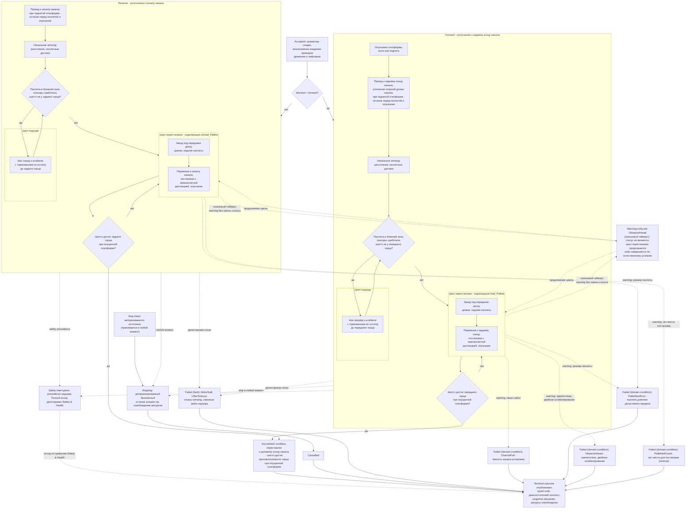

# Алгоритмическая документация операции CompactPallets (V3)

Статус: подготовлено по issue [«Алгоритмическая документация: CompactPallets»](https://github.com/Driadix/ShuttleControllerV3/issues/37) карты [«Спроектировать спецификацию и план прошивки контроллера V3»](https://github.com/Driadix/ShuttleControllerV3/issues/1). Окончательное утверждение ревизий выполняется на gate `G1 Behavioral Contract`.

Формат документа задан [«Формат алгоритмической документации операций V3»](./algorithmic-documentation-format-v3.md): 12-раздельный каркас, трёхслойное разделение содержание/evidence/структура, narrative на русском языке без формул и чисел, идентификаторы на английском. Общая рамка admission, ownership, надзора, прерываний и публикации outcomes задана [«Глобальной алгоритмической документацией работы шаттла V3»](./global-algorithmic-documentation-v3.md); lifecycle, identity, admission и idempotency заданы [«Общим semantic contract операций V3»](./semantic-contract-v3.md).

Evidence: [Capability Evidence Slices каталога операций V3](https://github.com/Driadix/ShuttleControllerV3/blob/research/v3-capability-evidence-slices/docs/research/v3-capability-evidence-slices.md) (ветка `research/v3-capability-evidence-slices`), разделы «1. CompactPallets Forward (CMD_COMPACT_F = 0x25)» и «2. CompactPallets Reverse (CMD_COMPACT_R = 0x26)» группы «CompactPallets (F/R), CountPallets, Demo», а также разделы «Общие entry points и dispatch skeleton», «Профильные варианты 800/1000/1200 - сводка» и «Сводка мёртвого кода и ordering-багов группы»; канонический snapshot V1 - `Driadix/ShuttleController@708d090`. Далее ссылки вида «bundle, …» указывают на этот документ.

## 1. Identity и назначение

`CompactPallets` - root operation type каталога V3 (решение [«Определить каталог и базовые инварианты операций V3»](https://github.com/Driadix/ShuttleControllerV3/issues/9)). Допустимая роль экземпляра - root; child-роль контракт типа не предусматривает: V1 исполняет операцию только автономно из AUTO_EXEC, вложенных вызовов нет, из ручной сессии тип недостижим (bundle, «0.4»).

Доменная цель - уплотнить штабель паллет в канале к целевому концу канала: многократно взять крайнюю паллету штабеля и переставить её глубже к целевому концу, пока шаттл не дойдёт до противоположного торца канала - штабель исчерпан и собран у целевого конца с выдерживанием межпаллетной дистанции.

V1 реализовывал тип двумя зеркальными командами по направлению - `CMD_COMPACT_F` (уплотнение к заднему концу канала) и `CMD_COMPACT_R` (уплотнение к началу канала); V3 описывает его единым типом с параметром направления, по образцу унификации `MoveDistance` параметром направления (issue [«Алгоритмическая документация: MoveDistance»](https://github.com/Driadix/ShuttleControllerV3/issues/30)). Направление определяет целевой конец канала и подоперацию перестановки: `forward` - уплотнение к заднему концу канала через подоперацию `load_Pallete`; `reverse` - уплотнение к началу канала через подоперацию `unload_Pallete` (bundle, «1» и «2» - Шаги и переходы).

Отношение к другим документам: admission-скелет, stop propagation, fault semantics, link-loss рамка и публикация outcomes не повторяются здесь, а применяются по глобальному документу и semantic contract; документ фиксирует только доменный алгоритм `CompactPallets` и его тип-специфичные paths, условия и исходы. Шаги движения и лифтера, исполняемые в составе операции, детализируют документы примитивов (`MoveDistance`, `LiftTo`) и подопераций перестановки (раздел 10).

## 2. Admission и условия входа

Запрос поступает от `Control Client` в пределах выданных полномочий; `Safety Authority` и `Service Client` этот тип не запрашивают. Envelope, epoch fencing, idempotency и конфликтная семантика - по semantic contract.

Параметры:

- `direction` - направление уплотнения: `forward` или `reverse`. Значения вне перечисления отклоняются на admission. V1 передавал направление выбором команды и не имел аргументов (MSG_CMD_SIMPLE, bundle, «0.3»); в V3 параметр типизирован, транспортное кодирование фиксируют `External Semantic & Transport Contracts` (раздел 11).

Системные preconditions (по глобальному документу): provisioning gate, fault-state gate, наличие в канале (для `CompactPallets` внеканальное исполнение не разрешено; V1 проверяет канал дважды - на admission и повторно при старте из IDLE, bundle, «0.3»-«0.4»), эксклюзивность (одна активная Exclusive Control Activity; V1 - `isShuttleIdle()` в `canAcceptCommandNow`, bundle, «0.3»). Отрицательный результат - `Rejected` со стабильным rejection code, экземпляр не создаётся; в V1-терминах - ACK_REJECTED/ACK_BAD_ENVIRONMENT/ACK_ERROR_STATE/ACK_BUSY, в V3 - typed rejection codes. Занятый ресурс даёт `ResourceConflict` по semantic contract.

Условия, проверяемые только in-situ после принятия (дают runtime outcome, а не `Rejected`): все доменные условия операции - наблюдение паллеты и её досок, ёмкость канала, размер паллеты, препятствие, наличие места постановки, доезд до торца канала - проверяются по ходу исполнения (разделы 3-5). Специфичных admission-условий, кроме перечисленных системных, тип не имеет; в частности, пустой канал не отклоняется на admission - поведение при отсутствии паллет определяется warning-путями подопераций (раздел 5, раздел 11).

Повторная проверка принятия после уже отправленного положительного ACK, существовавшая в V1, исключена: admission атомарен (решение [«Специфицировать общий semantic contract операций V3»](https://github.com/Driadix/ShuttleControllerV3/issues/13)).

## 3. Normal path

Шаги описаны для `direction = forward` (уплотнение к заднему концу канала); различия `reverse` указаны в каждом шаге.

1. **Принятие.** Admission пройден, экземпляр в `Accepted`, положительный ACK выдан. Root получает эксклюзивное владение приводом движения и лифтером; подоперации перестановки получают делегированный набор (раздел 10).
2. **Подготовка платформы (forward).** Если платформа не опущена, выполняется опускание (bundle, «1» - Шаги и переходы, шаг 2). Для `reverse` этот шаг отсутствует: опускание при необходимости выполняет примитив проезда (шаг 3).
3. **Проезд к целевому концу канала.** `forward`: проезд к заднему концу канала; при движении к заднему торцу уточняется опорная длина канала (bundle, «1», шаг 3). `reverse`: проезд к началу канала (bundle, «2», шаг 2). Если платформа поднята, примитив проезда вместо полного проезда выполняет останов перед ближайшей паллетой и опускание платформы (bundle, «1»-«2», Шаги и переходы; примитивы `moove_Forward`/`moove_Reverse`).
4. **Проверка прерываний после проезда.** Ранний выход по stop/fault сохраняет статус прерывания без принудительной перезаписи (bundle, «1»-«2», Stop/fault/abort).
5. **Начальное sensing.** Обслуживаются расстояния до концов канала и паллет, наблюдается состояние паллетных датчиков (bundle, «1», шаг 4; «2», шаг 3).
6. **Цикл подхода.** Дискретные шаги движения к штабелю (раздел 4): `forward` - шаги вперёд от заднего конца канала, `reverse` - шаги назад от начала канала; после каждого шага скорость ограничивается по остатку расстояния до противоположного торца канала. Цикл исполняется, пока паллета наблюдается в ближней зоне паллетного ToF, сработал хотя бы один паллетный сенсор и противоположный торец не достигнут.
7. **Цикл перестановки.** Повторяющаяся перестановка паллет (раздел 4): подоперация `load_Pallete` (`forward`) или `unload_Pallete` (`reverse`) подъезжает к крайней паллете штабеля, заезжает под переднюю доску, выполняет дожим под доску, поднимает паллету, перевозит её к целевому концу канала и ставит в зону постановки с выдерживанием межпаллетной дистанции до ранее поставленных паллет, после чего опускает платформу и обновляет учёт последней поставленной паллеты (bundle, «1»-«2», Подоперации). На каждой итерации увеличивается счётчик переносов (V1-факт: инкремент выполняется до проверки результата подоперации - раздел 11); для `reverse` дополнительно фиксируется якорь позиции, используемый скоростным проездом подхода следующей итерации (bundle, «2», шаг 5). Внутри подоперации возможно завершение по warning-путям (раздел 5) и перезапись статуса команды исполнителем (V1-факт, раздел 11).
8. **Завершение цикла.** Цикл перестановки завершается, когда шаттл достиг противоположного торца канала при опущенной платформе: штабель исчерпан, переставлять больше нечего (bundle, «1», шаг 6; «2», шаг 5). Для `reverse` сброс якоря позиции после цикла в V1 выполняет ветка dispatch (раздел 11).
9. **Завершение.** Привод находится в остановленном состоянии после последнего доменного шага; публикуется terminal outcome `Succeeded`, ресурсы и делегирования освобождены, snapshot обновлён. Платформа готова к новому запросу.

Инвариант соблюдается: `Succeeded` публикуется только при достижении шаттлом противоположного торца канала при опущенной платформе - штабель переставлен к целевому концу; завершение любым иным путём (stop, fault, warning-путь подоперации) даёт соответствующий ненулевой исход.

## 4. Ожидания и повторения

Операция не содержит ожиданий внешних событий канальной логистики: она не ждёт оператора или конвейер, а переставляет уже находящиеся в канале паллеты. Длительные активности внутри `Running` - два condition-driven цикла с явными условиями входа и выхода.

**Цикл подхода** (дискретные шаги к штабелю):

- вход (`forward`): паллета наблюдается в ближней зоне паллетного forward-ToF, сработал хотя бы один из четырёх паллетных сенсоров, шаттл не достиг переднего торца канала; для `reverse` зеркально: паллетный reverse-ToF в ближней зоне, сенсоры активны, шаттл не достиг заднего торца канала;
- тело: короткий шаг движения к штабелю (вперёд для `forward`, назад для `reverse`); после шага скорость ограничивается по остатку до противоположного торца канала с капом текущей скорости привода;
- выход: паллета вышла из ближней зоны паллетного ToF, либо паллетные сенсоры освободились, либо достигнут противоположный торец канала (bundle, «1»-«2», Шаги и переходы).

**Цикл перестановки** (перестановка штабеля к целевому концу):

- вход: цикл подхода завершён, подоперация перестановки готова исполняться; цикл повторяется, пока не достигнуто условие завершения;
- тело: подоперация перестановки (`load_Pallete`/`unload_Pallete`) - подъезд к крайней паллете, заезд под переднюю доску, дожим, подъём, перевозка к целевому концу, постановка с межпаллетной дистанцией, опускание, обновление учёта; счётчик переносов; проверка условия завершения; проверка прерываний; для `reverse` - фиксация якоря позиции;
- выход: шаттл достиг противоположного торца канала при опущенной платформе (normal), либо принят stop, либо детектирован отказ, либо подоперация завершила итерацию warning-путём (раздел 5) (bundle, «1»-«2», Шаги и переходы; Stop/fault/abort).

Warn-and-continue поведения: warning-события подопераций (ChannelFull, PalletSizeError, ObstacleAhead, PalletNotFound) не являются отдельными исходами V1 и не переводят платформу в ERROR; завершение операции по факту такого события классифицируется в разделе 5. Один из warning-путей - поисковый таймаут подъезда к доскам - не меняет статус команды: цикл перестановки продолжается и завершается либо по естественному условию, либо повторным warning-ом до stop/fault (V1-факт, раздел 11).

## 5. Прерывания

Рамка stop/fault/safety precedence - глобальный документ, раздел 5; здесь зафиксированы тип-специфичные paths.

### Stop

Stop принимается в любой момент: `SystemYield()` исполняется на каждой итерации обоих циклов и внутри подопераций и примитивов движения; остановка привода при stop выполняется уже в `SystemYield`, циклы наблюдают прерывание через `shouldAbortLoop()` (bundle, «1»-«2», Stop/fault/abort). Тип-специфичные abort-выходы:

- после проезда к целевому концу канала - возврат без изменения статуса (статус stop сохраняется);
- в циклах подхода и перестановки - остановка привода, принудительный статус останова и возврат;
- внутри подопераций - `preserveManualStopOnAbort`: статус ручного останова сохраняется, иначе выставляется статус останова.

V1 abort-пути лифтерных примитивов не выдают останов лифтерного привода (bundle, «Сквозные замечания» п. 7; документ `LiftTo`, раздел 5) - дефект не переносится: нормативный безопасный останов охватывает все actuator-ы экземпляра (глобальный документ, раздел 11). При включённом fifoLifo abort-путь дожима и warning-пути подоперации `unload_Pallete` (длина паллеты, «нет места впереди») не возвращают координатную инверсию (утечка `inverse`, раздел 11) - в V3 исключается.

Исход - `Cancelled`; шаттл останавливается в промежуточной позиции, возможно, с поднятой или частично переставленной паллетой; snapshot отражает фактическое состояние.

### Fault

Fault - детектированный внутренний отказ; экземпляр завершается `Failed` с кодом класса `fault` и диагностическим контекстом. Любой активный fault делает `shouldAbortLoop()` истинным, циклы завершаются abort-путём, платформа переходит в ERROR-состояние (bundle, «1»-«2», Stop/fault/abort). Тип-специфичные детектируемые условия:

- `MotorStall` - отсутствие изменения позиции при commanded движении в течение окна stall-детекта (условие `StallDetectWindow`, класс configured; детектируется `blink_Work` на итерациях циклов и внутри примитивов);
- `LifterTimeout` - концевик хода лифтера не достигнут за отведённое время (лифтерные примитивы подопераций перестановки; документ `LiftTo`);
- отказы ToF-sensing через `get_Distance` и надзор freshness направленного sensing (примитивы движения);
- отказы позиционного sensing и no-progress таймаут примитивов движения (шаги подхода, перехваты паллеты) - по документу `MoveDistance`;
- питание ниже порога, столкновение - сквозные paths надзора (глобальный документ, раздел 5).

V1 fault-путь no-progress примитива движения принудительно опускает лифтер; операция смены состояния платформы как побочный эффект fault является safe reaction - предложение до подтверждения `Safety & Health` (глобальный документ, разделы 5 и 11). Fault не выбирается алгоритмом, а детектируется надзором.

### Domain-condition

Domain-condition - наблюдаемое состояние мира, делающее цель недостижимой; исход `Failed` с кодом класса `domain-condition`, severity warning level по коду. Все тип-специфичные доменные условия возникают внутри подопераций перестановки и завершают операцию через статус останова (warnings не являются faults и не переводят платформу в ERROR; bundle, «1»-«2», Stop/fault/abort):

- `ChannelFull` - учёт ёмкости канала в подоперации `load_Pallete`: позиция последней поставленной паллеты пересекает границу ёмкости канала - канал забит, перестановка невозможна; warning и завершение операции. Проверка живёт в компакт/long/demo-вызовах; в одиночной загрузке недостижима (факт delta, раздел 11).
- `PalletSizeError` - паллета длиннее допустимого предела при отсутствии обнаружения задней доски (нестандартный размер); warning, выезд вперёд и завершение операции. Для `reverse` этот путь дополнительно несёт утечку координатной инверсии при fifoLifo (раздел 11).
- `ObstacleAhead` - два наблюдаемых варианта: (а) поисковый таймаут подъезда к доскам паллеты либо препятствие вблизи - warning без смены статуса команды: цикл перестановки продолжается, завершение по естественному условию либо повторный warning до stop/fault; (б) признак двойного штабелирования - паллета в зоне с занятой постановочной позицией, оцениваемой через межпаллетную дистанцию: warning и завершение операции.
- `PalletNotFound` (`reverse`) - нет места для постановки паллеты у начала канала: зона постановки занята/недостаточна; warning, выезд вперёд и завершение операции. Имя V1 не соответствует наблюдению (паллета обнаружена, места для постановки нет) - семантическое несоответствие, change-предложение (раздел 11).

Порядок проверок в цикле перестановки: условие естественного завершения проверяется раньше abort-проверки, поэтому при совпадении warning-завершения подоперации с достижением противоположного торца при опущенной платформе V1 выходит по естественному условию, а warning остаётся наблюдаемым событием; классификация такого совпадения в V3 - решение владельца (раздел 11).

Пустой канал: отдельного исхода у операции нет; подоперация проходит по warning-путям (поисковый таймаут) либо по путям своих warning-завершений, точное завершение операции из evidence не устанавливается (bundle, «1»-«2», Unknowns); исход - unknown (раздел 11). Предложение - явный исход пустого канала (раздел 11).

Неисправность сенсора при положительных признаках отказа является fault-путём, а не domain-condition.

### Safety interruption

Точки safety-прерывания операции: permit-проверки freshness направленного sensing перед стартами движения (примитивы движения подопераций), надзор во время движения (потеря freshness, столкновение, stall, питание, перегрузка лифтера по правилам `Safety & Health`). Граница с fault-путями - по глобальному документу: детектированный надзором отказ завершает экземпляр fault-исходом (выше); safety interruption наступает, когда Safety Authority применяет precedence к operation intents и при необходимости инициирует авторизованные safety operations. Точный исход прерванного экземпляра делегирован `Safety & Health` и здесь не выдумывается.

### Link-loss

`CompactPallets` - автономная операция; назначенная link-loss policy - `continue`: после потери инициатора экземпляр продолжает исполнение до собственного terminal outcome (V1 baseline: автономное исполнение не зависит от наличия связи; глобальный документ, раздел 5).

## 6. Recovery и состояние после прерывания

Возобновление всегда явное - новый запрос; generic pause/resume операции не свойственен.

- **После `Cancelled` (stop):** шаттл остановлен в промежуточной позиции, привод остановлен, ресурсы освобождены; возможно, паллета поднята либо находится в процессе перевозки - snapshot отражает фактическое состояние (позиция, паллеты, платформа). Продолжение - новым запросом с учётом фактического состояния штабеля.
- **После `Failed` (fault):** fault удерживается (latched semantics); платформа допускает только override/service-действия; recovery через `ClearFault` с baseline-условиями снятия (квалифицированное восстановление sensing/шины и физическая неподвижность) по глобальному документу. Прерванная операция не возобновляется.
- **После `Failed` (domain-condition):** физическое состояние сохраняется: штабель частично переставлен, шаттл в канале; snapshot несёт код и диагностический контекст. Продолжение - явным новым запросом с учётом фактического состояния. При включённом fifoLifo после `PalletSizeError`, abort-выхода дожима или warning-выхода «нет места впереди» подоперации `unload_Pallete` V1 оставляет координатную инверсию включённой (утечка `inverse`, раздел 11): перед продолжением работ требуется восстановление кадра координат; в V3 дефект исключается.
- **После safety interruption:** состояние и исход по правилам `Safety & Health`.

## 7. Terminal outcomes и наблюдаемые результаты

Принятый экземпляр завершается одним из terminal states; `Rejected` относится только к запросу.

| Исход | Класс | Наблюдаемое условие |
| --- | --- | --- |
| `Succeeded` | - | шаттл достиг противоположного торца канала при опущенной платформе; штабель переставлен к целевому концу канала |
| `Cancelled` | stop | принят stop, детерминированный безопасный останов actuator-ов завершён |
| `Failed` | `fault` | `MotorStall`, `LifterTimeout`, отказы ToF- и позиционного sensing, no-progress примитивов движения, питание ниже порога, столкновение и иные сквозные paths надзора |
| `Failed` | `domain-condition` | `ChannelFull`, `PalletSizeError`, `ObstacleAhead`, `PalletNotFound` |

Outcome содержит стабильный typed code и минимальный диагностический контекст: направление уплотнения, позиция шаттла, расстояния до концов канала и паллет, состояние платформы, warning-код (для domain-condition), счётчики переносов и загрузок/выгрузок. Таксономия typed codes и назначение severity фиксируются `External Semantic & Transport Contracts` и `Observability & Diagnostics`; имена условий выше - observation-based имена, принятые этим документом.

Внешняя видимость - по semantic contract: положительный ACK при принятии, terminal outcome при завершении, query snapshot как authoritative read-модель. Observable events: принятие, старт операции, каждая выполненная перестановка (счётчик переносов), warning-события подопераций, достижение противоположного торца, terminal outcome. Телеметрия: состояние `STATE_COMPACT` публикуется во время исполнения (bundle, «0.4»-«0.6»); счётчик переносов транслируется в stats-пакете (bundle, «1»-«2», Observable outcomes).

Семантика счётчика переносов как наблюдаемого результата: в V1 инкремент выполняется после каждого вызова подоперации перестановки, включая неудачные, поэтому счётчик завышается при прерванных циклах (bundle, «1»-«2», Observable outcomes); disposition - раздел 11. V1-каденции телеметрии и mapping состояний зафиксированы в evidence как baseline budgets `Observability & Diagnostics`.

## 8. Timing conditions

Унаследованные timing-условия V1 для `CompactPallets`. Количественные значения остаются в evidence; новые количественные значения документ не вводит. Anchors даны полным путём V1 и пояснением раздела bundle.

| Условие | Класс | Anchor | Disposition |
| --- | --- | --- | --- |
| `PalletNearZoneForward` - ближняя зона паллеты в цикле подхода (forward), порог паллетного forward-ToF | configured | Cntrl_V2/Cntrl_V2.ino:L6149 (bundle, «1. CompactPallets Forward» - Timing conditions) | preserve |
| `FrontEndGuardForward` - guard переднего торца в подходе (forward), остаток до переднего торца с поправкой канала | configured | Cntrl_V2/Cntrl_V2.ino:L6150 (bundle, «1» - Timing conditions) | preserve |
| `ApproachStepForward` - шаг подхода (forward): дистанция шага и пределы скорости примитива | configured | Cntrl_V2/Cntrl_V2.ino:L6153 (bundle, «1» - Timing conditions) | preserve как tuning-политику |
| `ApproachBrakingForward` - торможение в подходе (forward): скорость по остатку до переднего торца с капом текущей скорости | configured | Cntrl_V2/Cntrl_V2.ino:L6162-L6165 (bundle, «1» - Timing conditions) | preserve как tuning-политику |
| `CompactCompletionForward` - условие завершения (forward): остаток до переднего торца и опущенная платформа | configured | Cntrl_V2/Cntrl_V2.ino:L6173-L6174 (bundle, «1» - Timing conditions) | preserve; основание инварианта `Succeeded` (раздел 3) |
| `PalletNearZoneReverse` - ближняя зона паллеты в цикле подхода (reverse), порог паллетного reverse-ToF | configured | Cntrl_V2/Cntrl_V2.ino:L6195 (bundle, «2. CompactPallets Reverse» - Timing conditions) | preserve |
| `ReverseEndGuardReverse` - guard заднего торца в подходе (reverse), остаток до заднего торца с поправкой канала | configured | Cntrl_V2/Cntrl_V2.ino:L6196 (bundle, «2» - Timing conditions) | preserve |
| `ApproachStepReverse` - шаг подхода (reverse): дистанция шага и пределы скорости примитива | configured | Cntrl_V2/Cntrl_V2.ino:L6199 (bundle, «2» - Timing conditions) | preserve как tuning-политику |
| `ApproachBrakingReverse` - торможение в подходе (reverse): скорость по остатку до заднего торца с капом текущей скорости | configured | Cntrl_V2/Cntrl_V2.ino:L6208-L6211 (bundle, «2» - Timing conditions) | preserve как tuning-политику |
| `CompactCompletionReverse` - условие завершения (reverse): остаток до заднего торца и опущенная платформа | configured | Cntrl_V2/Cntrl_V2.ino:L6220-L6221 (bundle, «2» - Timing conditions) | preserve; основание инварианта `Succeeded` (раздел 3) |
| `PlacementDistanceForward` - дистанция постановки паллеты (forward): формула с межпаллетной дистанцией, поправкой канала и профильной поправкой | configured | Cntrl_V2/Cntrl_V2.ino:L4626-L4629 (bundle, «1» - Подоперация load_Pallete) | preserve как tuning-политику; межпаллетная дистанция - доменное понятие |
| `PlacementDistanceReverse` - дистанция постановки паллеты (reverse): формула с межпаллетной дистанцией, поправкой канала и профильной поправкой | configured | Cntrl_V2/Cntrl_V2.ino:L4396-L4399 (bundle, «2» - Подоперация unload_Pallete) | preserve как tuning-политику; межпаллетная дистанция - доменное понятие |
| `UnderBoardEntryForward` - заезд под переднюю доску (forward): дистанция заезда по профилю | configured | Cntrl_V2/Cntrl_V2.ino:L5724-L5726 (bundle, «1» - Подоперация; Профильные варианты) | preserve как tuning-политику |
| `UnderBoardEntryReverse` - заезд под переднюю доску (reverse): дистанция заезда по профилю и остатку канала | configured | Cntrl_V2/Cntrl_V2.ino:L5382-L5387 (bundle, «2» - Подоперация; Профильные варианты) | preserve как tuning-политику |
| `BoardPressForward` - дожим под доску (forward): число шагов дожима по профилю и задержка шага | configured | Cntrl_V2/Cntrl_V2.ino:L5733-L5766 (bundle, «1» - Подоперация) | preserve как tuning-политику |
| `BoardPressReverse` - дожим под доску (reverse): число шагов дожима по профилю и задержка шага | configured | Cntrl_V2/Cntrl_V2.ino:L5393-L5416 (bundle, «2» - Подоперация) | preserve как tuning-политику |
| `PalletSearchTimeoutForward` - таймаут поиска паллеты/доски (forward): окно поиска и порог препятствия | configured | Cntrl_V2/Cntrl_V2.ino:L5802-L5808 (bundle, «1» - Подоперация) | preserve значение; семантика исхода - change (раздел 11) |
| `PalletSearchTimeoutReverse` - таймаут поиска паллеты/доски (reverse): окно поиска и порог препятствия | configured | Cntrl_V2/Cntrl_V2.ino:L5453-L5462 (bundle, «2» - Подоперация) | preserve значение; семантика исхода - change (раздел 11) |
| `DoubleStackZone` - признак двойного штабелирования (forward): остаток до переднего торца и межпаллетная дистанция | configured | Cntrl_V2/Cntrl_V2.ino:L5814-L5821 (bundle, «1» - Подоперация) | preserve как доменное условие с tuning-значениями |
| `PlacementRoomThreshold` - порог «некуда везти» (reverse): паллетный forward-ToF зоны постановки | configured | Cntrl_V2/Cntrl_V2.ino:L5478 (bundle, «2» - Подоперация) | preserve значение; семантика исхода - change (раздел 11) |
| `PalletRecaptureForward` - дистанции перехвата паллеты после подъёма (forward) | configured | Cntrl_V2/Cntrl_V2.ino:L5862-L5866 (bundle, «1» - Подоперация; Профильные варианты) | preserve как tuning-политику |
| `PalletRecaptureReverse` - дистанции перехвата паллеты после подъёма (reverse) | configured | Cntrl_V2/Cntrl_V2.ino:L5495-L5499 (bundle, «2» - Подоперация; Профильные варианты) | preserve как tuning-политику |
| `SpeedCommandInterval` - минимальный интервал между записями скорости приводу | configured | Cntrl_V2/Cntrl_V2.ino:L2090 (bundle, «3. Примитивы движения» - motor_Speed) | preserve |
| `BlinkQuantum` - квант blink_Work (LED, CAN-drain, stall-детект) | configured | Cntrl_V2/Cntrl_V2.ino:L584, L4054 (bundle, «1» - Timing conditions) | preserve |
| `StallDetectWindow` - окно отсутствия изменения позиции до fault `MotorStall` | configured | Cntrl_V2/Cntrl_V2.ino:L4078 (bundle, «1» - Timing conditions) | preserve |

Unknowns:

- **U07** (фактические runtime-значения конфигурации эксплуатируемых устройств, включая `maxSpeed`, `chnlOffset`/`mprOffset`, `interPalleteDistance`, калибровки): владелец - владелец и полевые данные; стадия закрытия - до декомпозиции профильных требований. Настоящий документ U07 не блокирует: количественные значения остаются в evidence, документ содержит только именованные условия.
- Решение о выезде после уплотнения (живой паттерн `LONG_LOAD` либо исключение) и явный исход пустого канала - решения владельца на gate контракта `CompactPallets` (раздел 11).

## 9. Профильные варианты

Алгоритмический каркас `CompactPallets` идентичен для профилей 800, 1000 и 1200: проезд к целевому концу, подход, цикл перестановки и условие завершения от профиля не зависят. Профильные различия находятся внутри подопераций перестановки (bundle, «1»-«2», Профильные варианты; «Профильные варианты 800/1000/1200 - сводка»):

- заезд под переднюю доску: базовое значение для всех профилей, увеличенное для профиля 1200; в подоперации `unload_Pallete` дополнительно уменьшенное значение для профиля 800 при коротком остатке канала до заднего торца;
- дожим под доску: число шагов дожима уменьшается для профиля 1200;
- перехват паллеты после подъёма: три значения по профилям 800/1000/1200;
- поправка дистанции постановки: применяется для профилей 1000 и 1200;
- предел длины паллеты: растёт с профилем (длина шаттла минус запас).

Количественные значения перечисленных ветвлений - раздел 8 и evidence; закомментированные профильные поправки предела длины паллеты являются мёртвыми комментариями (раздел 11). Валидация профиля как набора механических параметров - `Configuration & Calibration` (unknown U07, владелец - владелец и полевые данные).

## 10. Composition boundaries

Операция составная: доменный алгоритм исполняется одним экземпляром, перестановка паллет делегируется подоперациям.

- **Suboperations:** `load_Pallete` (для `forward`) и `unload_Pallete` (для `reverse`) - шаги перестановки паллеты; в V3 - child-экземпляры по разрешённым рёбрам статического type graph с делегированным набором ресурсов (semantic contract; паттерн роли child в документе `LiftTo`, раздел 10). Внутри подопераций: подъезд к паллете, заезд под переднюю доску, дожим, подъём, перевозка к целевому концу, постановка с межпаллетной дистанцией, опускание, обновление учёта последней поставленной паллеты; подоперации несут собственные warning-пути (`ChannelFull`, `PalletSizeError`, `ObstacleAhead`, `PalletNotFound`), классифицированные в разделе 5.
- **Primitives** (не имеют собственной operation identity и lifecycle): шаги движения - проезды `moove_Forward`/`moove_Reverse` к концам канала, шаги подхода и перехваты `moove_Distance_F/R`, подъезды `moove_Before_Pallete_F/R`, остановы `stop_Before_Pallete_F/R`; шаги лифтера `lifter_Up`/`lifter_Down` (в V3 - child-экземпляры `LiftTo`); sensing - `get_Distance` (ToF), `detect_Pallete` (паллетные датчики), позиционное sensing; индикация и надзор - `blink_Work`, `blink_Warning`; координатная инверсия `fifoLifo_Inverse` (V1-механизм подоперации `unload_Pallete`, раздел 11).
- **Ресурсы:** root владеет приводом движения и лифтером эксклюзивно до завершения; подоперации получают делегированный набор и не приобретают ресурсы за пределами delegation. `CompactPallets` как подоперация других типов не используется (root only).
- `fifoLifo` не влияет на выбор направления уплотнения: режим FIFO/LIFO в V1 реализован только как инверсия кадра координат внутри подоперации `unload_Pallete` (bundle, «5. Взаимодействие с inverse/FIFO/LIFO»); ownership кадра координат в V3 - платформа (раздел 11).

## 11. V1 dispositions и evidence

Evidence anchors - bundle, разделы «1. CompactPallets Forward», «2. CompactPallets Reverse», «0. Общий контекст группы», «5. Взаимодействие с inverse/FIFO/LIFO», «6. Сводка мёртвого кода и ordering-багов группы», «Дельты относительно системного индекса (impact set)»; канонический snapshot V1 `Driadix/ShuttleController@708d090`. Anchors даны полным путём V1 и пояснением раздела bundle. Предложения без решения владельца помечены «предложение change - решение владельца на gate контракта CompactPallets» и решениями не являются.

| Поведение V1 | Evidence | Disposition | Основание |
| --- | --- | --- | --- |
| Две зеркальные команды `CMD_COMPACT_F = 0x25`/`CMD_COMPACT_R = 0x26` без параметра, направление выбором команды | Cntrl_V2/ShuttleProtocol.h:L111-L112 (bundle, «0.1») | change: единый тип `CompactPallets` с типизированным параметром `direction` (`forward`/`reverse`), значения вне перечисления отклоняются на admission | каталог (issue [«Определить каталог и базовые инварианты операций V3»](https://github.com/Driadix/ShuttleControllerV3/issues/9)); паттерн единого типа с параметром (issue [«Алгоритмическая документация: MoveDistance»](https://github.com/Driadix/ShuttleControllerV3/issues/30)); semantic contract - атомарный admission |
| Мёртвый выезд `moove_Forward()` после уплотнения в обеих ветках dispatch: статус останова присваивается до проверки условия, выезд недостижим | Cntrl_V2/Cntrl_V2.ino:L3335-L3336, Cntrl_V2/Cntrl_V2.ino:L3345-L3346 (bundle, «0.5»; «6», п. 1-2) | change (предложение): в V3 решить, нужен ли выезд после уплотнения; при сохранении - корректный порядок как в живом паттерне `LONG_LOAD` (Cntrl_V2/Cntrl_V2.ino:L3354-L3356) | предложение change - решение владельца на gate контракта CompactPallets; зафиксированный дефект не переносится как нормативное поведение (глобальный документ, раздел 11) |
| Недостижимый хвост `pallete_Compacting_R()`: сброс якоря позиции после цикла, из которого нет выхода кроме return | Cntrl_V2/Cntrl_V2.ino:L6230-L6231 (bundle, «2»; «6», п. 3) | exclude (предложение): сброс якоря реально выполняет ветка dispatch (Cntrl_V2/Cntrl_V2.ino:L3343) | предложение exclude - решение владельца на gate контракта CompactPallets; мёртвый код не переносится |
| Инкремент счётчика переносов до проверки результата подоперации: учитываются и неудачные вызовы, счётчик завышается при прерванных циклах | Cntrl_V2/Cntrl_V2.ino:L6172, Cntrl_V2/Cntrl_V2.ino:L6219 (bundle, «1»-«2», Observable outcomes) | change (предложение): учитывать только успешные переносы; семантика счётчика - наблюдаемый результат (раздел 7) | предложение change - решение владельца на gate контракта CompactPallets |
| Перезапись статуса команды исполнителем в циклах подхода и перестановки | Cntrl_V2/Cntrl_V2.ino:L6160, L6181, L6213, L6228 (bundle, «1»-«2», Шаги и переходы) | change (предложение): lifecycle команды не перезаписывается исполнителем | semantic contract (жизненный цикл экземпляра); предложение change - решение владельца на gate контракта CompactPallets |
| Утечка координатной инверсии на трёх путях подоперации `unload_Pallete` при fifoLifo: abort дожима, `WARN_PALLET_SIZE_ERROR` и «нет места впереди» не возвращают `inverse`, последующие движения исполняются в инвертированном кадре | Cntrl_V2/Cntrl_V2.ino:L5410-L5415, Cntrl_V2/Cntrl_V2.ino:L5432-L5441, Cntrl_V2/Cntrl_V2.ino:L5477-L5485 (bundle, «2»; «6», п. 5 - bundle фиксирует два пути, третий подтверждён по первоисточнику) | change (предложение): идемпотентный возврат кадра координат в V3 либо исключение переключения инверсии на подоперацию | зафиксированный дефект не переносится (глобальный документ, раздел 11); предложение change - решение владельца на gate контракта CompactPallets |
| Симметричный возврат fifoLifo-инверсии на большинстве выходов `unload_Pallete`; `fifoLifo` не влияет на выбор направления уплотнения | Cntrl_V2/Cntrl_V2.ino:L5332-L5333, Cntrl_V2/Cntrl_V2.ino:L5657-L5658 (bundle, «2», Подоперация; «5») | preserve механизм; ownership кадра координат - платформа | baseline; трёхслойное разделение формата |
| `WARN_CHANNEL_FULL`: проверка ёмкости канала по учёту последней поставленной паллеты; проверка жива в compact/long/demo-вызовах и недостижима в одиночной загрузке из-за обнуления учёта при приёме команды | Cntrl_V2/Cntrl_V2.ino:L5671-L5677, Cntrl_V2/Cntrl_V2.ino:L1845 (bundle, «1», Подоперация; «Дельты относительно системного индекса», п. 1) | preserve как domain-condition `ChannelFull` (warning-level severity) | классификация paths формата (issue [«Зафиксировать формат и acceptance criteria алгоритмической документации V3»](https://github.com/Driadix/ShuttleControllerV3/issues/15)); evidence delta |
| `WARN_PALLET_SIZE_ERROR`: паллета длиннее допустимого предела при отсутствии задней доски; выезд вперёд и завершение; в reverse - без возврата fifoLifo-инверсии | Cntrl_V2/Cntrl_V2.ino:L5773-L5784 (forward), Cntrl_V2/Cntrl_V2.ino:L5432-L5441 (reverse) (bundle, «1»-«2», Подоперации) | change (предложение): явный исход domain-condition `PalletSizeError`; в reverse - совместно с восстановлением fifoLifo (строка выше) | классификация формата; предложение change - решение владельца на gate контракта CompactPallets |
| `WARN_OBSTACLE_AHEAD` (поисковый таймаут подъезда к доскам): warning без смены статуса команды; цикл перестановки продолжается, завершение по естественному условию либо повторный warning до stop/fault | Cntrl_V2/Cntrl_V2.ino:L5802-L5808 (forward), Cntrl_V2/Cntrl_V2.ino:L5453-L5462 (reverse) (bundle, «1»-«2», Подоперации) | change (предложение): явный исход domain-condition `ObstacleAhead`; неоднозначность V1 не переносится | классификация формата; инвариант `Succeeded ⇔ цель достигнута`; предложение change - решение владельца на gate контракта CompactPallets |
| `WARN_OBSTACLE_AHEAD` (двойное штабелирование): признак занятости зоны постановки, оцениваемой через межпаллетную дистанцию; завершение | Cntrl_V2/Cntrl_V2.ino:L5814-L5821 (bundle, «1», Подоперация) | preserve как доменное условие; исход domain-condition `ObstacleAhead` | межпаллетная дистанция - доменное понятие; классификация формата |
| `WARN_PALLET_NOT_FOUND` («некуда везти»): нет места для постановки паллеты у начала канала; выезд вперёд и завершение; имя V1 не соответствует наблюдению (паллета обнаружена, места нет) | Cntrl_V2/Cntrl_V2.ino:L5477-L5485 (bundle, «2», Подоперация) | change (предложение): код по наблюдению; определить для компакта, является ли отсутствие места постановки достижением цели | предложение change - решение владельца на gate контракта CompactPallets; семантическое несоответствие зафиксировано в evidence (U09-паттерн unload-группы) |
| Ядро операции: уплотнение к целевому концу канала через подоперации `load_Pallete`/`unload_Pallete`, подход дискретными шагами, завершение при достижении противоположного торца при опущенной платформе | Cntrl_V2/Cntrl_V2.ino:L6138-L6183, Cntrl_V2/Cntrl_V2.ino:L6186-L6232 (bundle, «1»-«2», Шаги и переходы) | preserve | baseline (метаправило формата) |
| Межпаллетная дистанция в формуле дистанции постановки паллеты | Cntrl_V2/Cntrl_V2.ino:L4626-L4629 (forward), Cntrl_V2/Cntrl_V2.ino:L4396-L4399 (reverse) (bundle, «1»-«2», Подоперации) | preserve как tuning-политику | evidence; трёхслойное разделение формата |
| Профильные ветвления подопераций: заезд под переднюю доску, дожим, перехват, поправка дистанции постановки, предел длины паллеты | Cntrl_V2/Cntrl_V2.ino:L5724-L5726, L5737-L5743, L5862-L5866, L4627, L5769 (forward/load); Cntrl_V2/Cntrl_V2.ino:L5382-L5387, L5395-L5402, L5495-L5499, L4397 (reverse/unload) (bundle, «1»-«2», Профильные варианты; «Профильные варианты 800/1000/1200 - сводка») | preserve как tuning-политику | evidence; значения пересматриваются с NFR/HIL |
| Закомментированные профильные поправки предела длины паллеты | Cntrl_V2/Cntrl_V2.ino:L5770-L5772, Cntrl_V2/Cntrl_V2.ino:L5429-L5431 (bundle, «6», п. 9) | exclude (мёртвые комментарии) | evidence, «Сводка мёртвого кода» |
| Проезд к целевому концу канала с уточнением опорной длины канала у заднего торца (forward) | Cntrl_V2/Cntrl_V2.ino:L6143, Cntrl_V2/Cntrl_V2.ino:L5309-L5316 (bundle, «1», Шаги и переходы) | preserve | baseline; семантика координат - документ `MoveDistance` |
| Проезд при поднятой платформе: останов перед ближайшей паллетой и опускание платформы вместо полного проезда | Cntrl_V2/Cntrl_V2.ino:L5202-L5207 (moove_Forward), Cntrl_V2/Cntrl_V2.ino:L5272-L5277 (moove_Reverse) (bundle, «1»-«2», Шаги и переходы) | preserve | baseline |
| Пустой канал: отдельного исхода нет; подоперация проходит по warning-путям, операция завершается по естественному условию (доезд до противоположного торца при опущенной платформе) | Cntrl_V2/Cntrl_V2.ino:L6167-L6182 (bundle, «1»-«2», Unknowns) | unknown (предложение): определить явный исход пустого канала (Succeeded с warning-событием либо domain-condition) | предложение change - решение владельца на gate контракта CompactPallets |
| Warnings не переводят платформу в ERROR (warnings != faults); warning-завершения проходят через статус останова | Cntrl_V2/Cntrl_V2.ino:L5674, L5780, L5807, L5820, L5481 (bundle, «1»-«2», Stop/fault/abort) | preserve классификацию warnings vs faults; исходы - domain-condition | глобальный документ, раздел 5; классификация формата |
| Совпадение warning-завершения подоперации с естественным условием завершения: условие завершения проверяется раньше abort-проверки, V1 выходит по естественному условию, warning остаётся наблюдаемым событием | Cntrl_V2/Cntrl_V2.ino:L6173-L6180 (bundle, «1», Шаги и переходы) | change (предложение): определить классификацию совпадения в V3 | предложение change - решение владельца на gate контракта CompactPallets |
| Телеметрия: состояние `STATE_COMPACT` во время исполнения, счётчики в stats-пакете | Cntrl_V2/Cntrl_V2.ino:L1843, L8243-L8245, L8931; Cntrl_V2/ShuttleProtocol.h:L145-L164, L275, L277 (bundle, «0.4»-«0.6»; «1»-«2», Observable outcomes) | preserve как baseline budgets `Observability & Diagnostics` | глобальный документ, раздел 7 |
| Счётчики переносов подопераций: `loadCounter`/`unloadCounter` на успешный перенос | Cntrl_V2/Cntrl_V2.ino:L5938, Cntrl_V2/Cntrl_V2.ino:L5656 (bundle, «1»-«2», Observable outcomes) | preserve как наблюдаемые результаты | baseline |

## 12. Диаграмма

Обязательная Mermaid-блок-схема алгоритма `CompactPallets`. Источник diagram-as-code: [diagrams/src/compact-pallets-flow.mmd](../diagrams/src/compact-pallets-flow.mmd).

Narrative и диаграмма согласованы: каждое ветвление и ожидание narrative (ветвление направления, подготовка платформы и проезд к целевому концу, начальное sensing, цикл подхода с шагом и торможением в обоих направлениях, цикл перестановки через подоперации, условие естественного завершения, warning-завершения `ChannelFull`/`PalletSizeError`/`ObstacleAhead`/`PalletNotFound`, warn-and-continue поискового таймаута с продолжением цикла, stop, fault по детектированному надзором отказу, safety precedence, публикация outcome) присутствует на диаграмме, и каждая ветвь диаграммы описана в разделах 2-7.

## Ревью

- Ревьюер: независимая сессия (субагент), сверка по первоисточнику V1 и evidence bundle
- Вердикт: APPROVED
- Дата: 2026-08-06
- Результат: readiness checklist 10/10, blocking findings отсутствуют (повторное ревью после устранения замечаний по диаграмме и пустому каналу)
