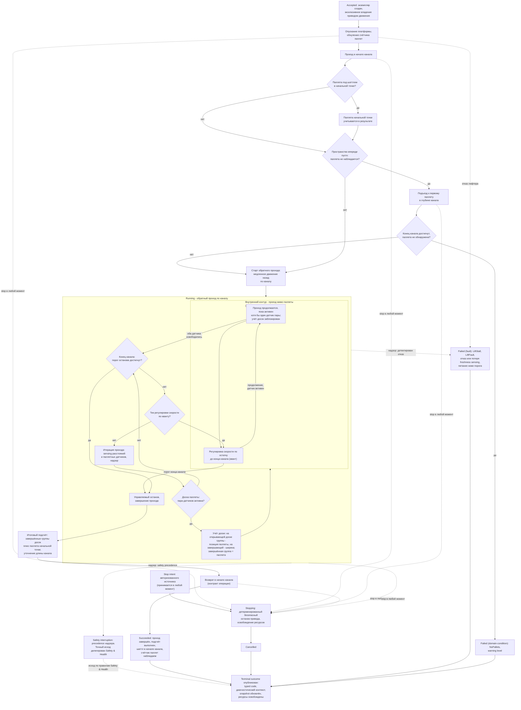

# Алгоритмическая документация операции CountPallets (V3)

Статус: подготовлено по issue [«Алгоритмическая документация: CountPallets»](https://github.com/Driadix/ShuttleControllerV3/issues/38) карты [«Спроектировать спецификацию и план прошивки контроллера V3»](https://github.com/Driadix/ShuttleControllerV3/issues/1). Окончательное утверждение ревизий выполняется на gate `G1 Behavioral Contract`.

Формат документа задан [«Формат алгоритмической документации операций V3»](./algorithmic-documentation-format-v3.md): 12-раздельный каркас, трёхслойное разделение содержание/evidence/структура, narrative на русском языке без формул и чисел, идентификаторы на английском. Общая рамка admission, ownership, надзора, прерываний и публикации outcomes задана [«Глобальной алгоритмической документацией работы шаттла V3»](./global-algorithmic-documentation-v3.md); lifecycle, identity, admission и idempotency заданы [«Общим semantic contract операций V3»](./semantic-contract-v3.md).

Evidence: [Capability Evidence Slices каталога операций V3](./research/v3-capability-evidence-slices.md), раздел «3. CountPallets (CMD_COUNT_PALLETS = 0x27)» группы «CompactPallets (F/R), CountPallets, Demo» и разделы «Общие entry points и dispatch skeleton», «Профильные варианты 800/1000/1200 - сводка»; канонический snapshot V1 - `Driadix/ShuttleController@708d090`. Далее ссылки вида «bundle, …» указывают на этот документ.

## 1. Identity и назначение

`CountPallets` - root operation type каталога V3 (решение [«Определить каталог и базовые инварианты операций V3»](https://github.com/Driadix/ShuttleControllerV3/issues/9)). Допустимая роль экземпляра - root; child-роль контракт типа не предусматривает: V1 исполняет операцию только автономно из AUTO_EXEC, вложенные вызовы отсутствуют, из ручной сессии тип недостижим (bundle, «0.4»).

Доменная цель - выполнить медленный обратный проход шаттла по каналу от начала к концу, посчитать паллеты по их доскам паллетными датчиками и вернуть шаттл в начало канала. Результат операции - количество паллет, наблюдаемое в телеметрии и логе (bundle, «0.6»; «3. CountPallets» - Observable outcomes).

Отношение к другим документам: admission-скелет, stop propagation, fault semantics, link-loss рамка и публикация outcomes не повторяются здесь, а применяются по глобальному документу и semantic contract; документ фиксирует только доменный алгоритм `CountPallets` и его тип-специфичные paths, условия и исходы.

## 2. Admission и условия входа

Запрос поступает от `Control Client` в пределах выданных полномочий; `Safety Authority` и `Service Client` этот тип не запрашивают. Envelope, epoch fencing, idempotency и конфликтная семантика - по semantic contract.

Параметры: контракт типа параметров не имеет - запрос без параметров (V1 принимал команду как MSG_CMD_SIMPLE, bundle, «3. CountPallets» - Admission/preconditions). Любые параметры вне типа отклоняются на admission.

Системные preconditions (по глобальному документу): provisioning gate, fault-state gate, наличие в канале (внеканальное исполнение не разрешено), эксклюзивность (одна активная Exclusive Control Activity; V1 - `isShuttleIdle()` в `canAcceptCommandNow`, bundle, «0.3»). Отрицательный результат - `Rejected` со стабильным rejection code, экземпляр не создаётся; в V1-терминах - ACK_REJECTED/ACK_BAD_ENVIRONMENT/ACK_ERROR_STATE/ACK_BUSY, в V3 - typed rejection codes. Занятый ресурс даёт `ResourceConflict` по semantic contract.

Условия, проверяемые только in-situ после принятия (дают runtime outcome, а не `Rejected`):

- успешное опускание платформы на входе (шаг примитива лифтера; отказ - fault-путь, раздел 5);
- наблюдение паллеты в начальной точке канала: если пара паллетных датчиков активна в начальной точке, паллета учитывается в результате (влияет на итоговый счёт, раздел 3);
- пустое пространство впереди по каналу: если паллета не наблюдается впереди, выполняется подъезд к первому паллету в глубине канала (раздел 3);
- достижение конца канала при подъезде без обнаружения паллеты: проход не начинается, исход - domain-condition `NoPallets` (раздел 5).

Повторная проверка принятия после уже отправленного положительного ACK, существовавшая в V1, исключена: admission атомарен (решение [«Специфицировать общий semantic contract операций V3»](https://github.com/Driadix/ShuttleControllerV3/issues/13)).

## 3. Normal path

1. **Принятие.** Admission пройден, экземпляр в `Accepted`, положительный ACK выдан. Root получает эксклюзивное владение приводом движения; лифтер используется однократно на входе (шаг опускания платформы).
2. **Подготовка.** Платформа опускается; счётчик паллет обнуляется.
3. **Позиционирование.** Шаттл проезжает в начало канала; по прибытии наблюдается состояние паллетных датчиков.
4. **Начальная точка.** Если в начальной точке под шаттлом стоит паллета (активна любая из двух пар паллетных датчиков - forward или reverse, по наблюдению), она учитывается в результате подсчёта.
5. **Подъезд к первому паллету.** Если пространство впереди по каналу пустое и паллета не наблюдается, выполняется подъезд в глубину канала движением назад. Если при подъезде достигнут конец канала, а паллета так и не обнаружена, обратный проход не начинается: исход - domain-condition `NoPallets` (раздел 5). Возврат в начало канала после раннего выхода исполняется (V1-эпилог dispatch, раздел 6).
6. **Старт прохода.** Начинается обратный проход по каналу: медленное движение назад от начала канала к его концу.
7. **Проход с подсчётом досок.** Экземпляр в `Running`: цикл прохода (раздел 4). Доска паллеты детектируется парой паллетных датчиков направления прохода. Доски группируются: на доске, открывающей группу, фиксируется позиция паллеты; на завершающей доске группы фиксируется ширина паллеты; каждая завершённая группа досок соответствует одной паллете (эвристика группы, класс configured, раздел 8).
8. **Защита от двойного счёта.** Пока активен хотя бы один датчик пары, проход продолжается без новых учётов (внутренний контур, раздел 4); учёт следующей доски возможен только после освобождения обоих датчиков.
9. **Регулировка скорости.** По мере приближения к концу канала скорость прохода снижается по остатку расстояния до конца канала; у порога конца канала выполняется управляемый останов и проход завершается.
10. **Итоговый подсчёт.** Результат формируется из завершённых групп досок и паллеты начальной точки; длина канала уточняется по фактической позиции останова.
11. **Возврат.** Шаттл возвращается в начало канала (контракт операции, раздел 11) и останавливается.
12. **Завершение.** Ресурсы освобождены, terminal outcome `Succeeded` опубликован; счётчик паллет наблюдаем в телеметрии и логе.

Инвариант соблюдается: `Succeeded` публикуется только после завершённого прохода до конца канала, выполненного подсчёта и возврата шаттла в начало канала; прерывание прохода любым путём либо недостижимость подсчёта дают соответствующий ненулевой исход.

## 4. Ожидания и повторения

Операция не содержит ожиданий внешних событий канальной логистики: она не ждёт оператора или конвейер, а исполняет один проход по уже находящимся в канале паллетам. Condition-driven повторений (как в long-операциях) нет; единственный проход начинается после подъезда к первому паллету либо сразу, если паллета наблюдается.

Длительные активности внутри `Running` с явными условиями входа и выхода:

- **Цикл обратного прохода.** Вход: старт прохода (медленное движение назад) после подъезда. Выход: достигнут порог конца канала (normal), принят stop, детектирован отказ либо сработал надзор. На каждой итерации: обслуживание sensing (расстояния, паллетные датчики), проверки stop и надзора, периодический тик регулировки скорости (условие `SpeedAdjustPeriod`, класс configured, раздел 8).
- **Внутренний контур защиты от двойного счёта.** Вход: доска паллеты детектирована парой датчиков направления прохода. Выход: оба датчика пары освободились (паллета пройдена) либо достигнут порог конца канала, либо принят stop, либо детектирован отказ. Внутри контура проход продолжается, скорость регулируется тем же периодическим тиком; учёт досок заблокирован до освобождения обоих датчиков.

Warn-and-continue поведения отсутствуют: все наблюдаемые условия операции либо продолжаются в normal path, либо завершают экземпляр классифицированным исходом.

## 5. Прерывания

Рамка stop/fault/safety precedence - глобальный документ, раздел 5; здесь зафиксированы тип-специфичные paths.

### Stop

Stop принимается в любой момент после принятия экземпляра - во время проезда в начало канала, подъезда, обратного прохода и возврата - и переводит его в `Stopping`: детерминированный безопасный останов привода движения, освобождение ресурсов, исход `Cancelled`. Позиция на момент останова сохраняется в snapshot; частичный проход остаётся фактическим состоянием, счётчик паллет - частичным результатом наблюдения.

V1-факт асимметрии abort-путей одной функции: внешний контур прохода при abort принудительно фиксирует штатный stop (ручной stop затирается), внутренний контур сохраняет ручной stop (bundle, «3. CountPallets» - Stop/fault/abort). Асимметрия зафиксирована в разделе 11 как change-предложение; в V3 применяется единая семантика stop propagation по semantic contract.

V1 проверял прерывание также на границах шагов - после проезда в начало канала и после подъезда к первому паллету - с завершением функции без дополнительных команд приводу (bundle, «3. CountPallets» - Шаги и переходы). В V3 это выражается общей семантикой `Stopping`.

### Fault

Fault - детектированный внутренний отказ; экземпляр завершается `Failed` с кодом класса `fault` и диагностическим контекстом. Тип-специфичные детектируемые условия:

- `LiftStall` - stall привода движения, детектируемый обслуживанием blink_Work (нет приращения позиции при commanded движении; V1 - FAULT_MOTOR_STALL из `blink_Work`, bundle, «3. CountPallets» - Stop/fault/abort и ресурсные эффекты). Fault выставляется надзором операции, а не выбирается алгоритмом.
- Отказ или потеря freshness направленного sensing (ToF): провал freshness-разрешения при старте движения в примитивах и принудительный останов при движении (V1 - cross-cutting через `get_Distance`/safety, bundle, «3. CountPallets» - Stop/fault/abort). Классификация конкретного сенсорного кода - `Safety & Health`.
- `LiftFault` - отказ лифтера на входном шаге опускания платформы (V1 - FAULT_LIFTER_TIMEOUT из `lifter_Down`, bundle, «3. CountPallets» - Stop/fault/abort).
- Столкновение, stall привода, питание ниже порога - сквозные paths надзора (глобальный документ, раздел 5).

Собственных setWarning/setFault у операции нет: warnings и faults возможны только из подфункций и cross-cutting сервисов (bundle, «3. CountPallets» - Stop/fault/abort). Любой active fault делает abort истинным и переводит платформу в health-degraded состояние по глобальному документу.

### Domain-condition

Domain-condition - наблюдаемое состояние мира, делающее цель недостижимой; исход `Failed` с кодом класса `domain-condition`, severity warning level по коду.

- `NoPallets` - подъезд к первому паллету достиг конца канала, а паллета так и не обнаружена: паллет в канале нет (по наблюдению), обратный проход не начинается, счёт невозможен. В V1 ранний выход завершался тихо - останов и возврат без явного исхода, счётчик оставался нулевым, dispatch логировал нулевой результат (bundle, «3. CountPallets» - Шаги и переходы, шаг 4). По инварианту формата тихий выход превращён в именованный исход (раздел 11, disposition change); возврат в начало канала после раннего выхода исполняется (V1-эпилог dispatch, раздел 6).

Иных domain-condition paths операция не имеет: прерывание прохода по состоянию мира (паллеты стоят вплотную) не специфицировано и зафиксировано как unknown с владельцем (раздел 8).

Неисправность сенсора при положительных признаках отказа является fault-путём, а не domain-condition.

### Safety interruption

Точки safety-прерывания операции: freshness направленного sensing перед стартом движения (в примитивах старта привода), надзор во время прохода (потеря freshness, столкновение, stall, питание). Граница с fault-путями - по глобальному документу: детектированный надзором отказ завершает экземпляр fault-исходом (выше); safety interruption наступает, когда Safety Authority применяет precedence к operation intents и при необходимости инициирует авторизованные safety operations. Точный исход прерванного экземпляра делегирован `Safety & Health` и здесь не выдумывается.

### Link-loss

`CountPallets` - автономная операция; назначенная link-loss policy - `continue`: после потери инициатора экземпляр продолжает исполнение до собственного terminal outcome (V1 baseline: автономное исполнение не зависит от наличия связи; глобальный документ, раздел 5).

## 6. Recovery и состояние после прерывания

Возобновление всегда явное - новый запрос; generic pause/resume операции не свойственен.

- **После `Cancelled` (stop):** шаттл остановлен в канале в позиции останова, привод остановлен, ресурсы освобождены; счётчик паллет содержит частичный результат наблюдения; snapshot отражает фактическое положение. Продолжение - новым запросом `CountPallets` с учётом фактического состояния канала.
- **После `Failed` (fault):** fault удерживается (latched semantics); платформа допускает только override/service-действия; recovery через `ClearFault` с baseline-условиями снятия (квалифицированное восстановление sensing/шины и физическая неподвижность) по глобальному документу. Прерванная операция не возобновляется.
- **После `Failed` (domain-condition `NoPallets`):** физическое состояние сохраняется: шаттл возвращается в начало канала (V1-эпилог возврата исполняется и после раннего выхода, bundle, «3. CountPallets» - Dispatch-эпилог), привод остановлен; snapshot несёт код и диагностический контекст. Продолжение - явным новым запросом (например, повторный подсчёт после загрузки канала).
- **После safety interruption:** состояние и исход по правилам `Safety & Health`.

## 7. Terminal outcomes и наблюдаемые результаты

Принятый экземпляр завершается одним из terminal states; `Rejected` относится только к запросу.

| Исход | Класс | Наблюдаемое условие |
| --- | --- | --- |
| `Succeeded` | - | обратный проход завершён до конца канала, итоговый подсчёт выполнен, шаттл возвращён в начало канала, счётчик паллет наблюдаем |
| `Cancelled` | stop | принят stop, детерминированный безопасный останов привода завершён |
| `Failed` | `fault` | `LiftStall`, `LiftFault`, отказ/freshness направленного sensing, столкновение, питание ниже порога |
| `Failed` | `domain-condition` | `NoPallets`: подъезд к первому паллету достиг конца канала, паллеты не обнаружены; warning-level severity |

Outcome содержит стабильный typed code и минимальный диагностический контекст: число учтённых досок, позиции досок, свидетельства расстояний и паллетных датчиков на момент исхода. Таксономия typed codes и назначение severity фиксируются `External Semantic & Transport Contracts` и `Observability & Diagnostics`; имена условий выше - observation-based имена, принятые этим документом.

Внешняя видимость - по semantic contract: положительный ACK при принятии, terminal outcome при завершении, query snapshot как authoritative read-модель. Observable events: принятие, старт прохода, детект доски (диагностический лог), достижение конца канала, итоговый подсчёт, возврат в начало канала, terminal outcome.

Наблюдаемые результаты:

- `palleteCount` - итоговое количество паллет: транслируется в каждом пакете телеметрии и логируется по завершении (bundle, «3. CountPallets» - Observable outcomes; «0.6»). Назначение в V3 - результат операции.
- `palletePosition` - позиции паллет по открывающим доскам групп; в V1 запись без проверки границы массива и читателей нет (раздел 11, change/unknown U06).
- `lifetimePalletsDetected` - lifetime-счётчик обнаруженных паллет, при перезапуске операции не сбрасывается.
- Длина канала уточняется по фактической позиции останова (влияет на последующие операции).
- Во время исполнения состояние операции наблюдаемо в телеметрии (`STATE_COUNT_PALLETS` в V1-mapping, bundle, «0.4»).

## 8. Timing conditions

Унаследованные timing-условия V1 для `CountPallets`. Количественные значения остаются в evidence; новые количественные значения документ не вводит.

| Условие | Класс | Anchor | Disposition |
| --- | --- | --- | --- |
| `CountPassSpeed` - базовая скорость обратного прохода | configured | Cntrl_V2/Cntrl_V2.ino:L6033, Cntrl_V2/Cntrl_V2.ino:L6098-L6105, Cntrl_V2/Cntrl_V2.ino:L6110-L6129 (bundle, CountPallets - Timing conditions) | preserve |
| `ApproachGapThreshold` - признак пустого пространства впереди по каналу | configured | Cntrl_V2/Cntrl_V2.ino:L6019 (bundle, CountPallets - Timing conditions) | preserve |
| `NoPalletsThreshold` - порог раннего выхода при подъезде (достигнут конец канала, паллета не обнаружена) | configured | Cntrl_V2/Cntrl_V2.ino:L6024 (bundle, CountPallets - Timing conditions) | preserve; исход при срабатывании классифицирован как domain-condition `NoPallets` (раздел 5) |
| `SpeedAdjustPeriod` - квант регулировки скорости в обоих контурах прохода | configured | Cntrl_V2/Cntrl_V2.ino:L6087, Cntrl_V2/Cntrl_V2.ino:L6110 (bundle, CountPallets - Timing conditions) | preserve |
| `SlowdownZone` - зона плавного торможения по остатку до конца канала | configured | Cntrl_V2/Cntrl_V2.ino:L6090-L6091 (bundle, CountPallets - Timing conditions) | preserve |
| `CrawlSpeed` - скорость доезда вблизи конца канала | configured | Cntrl_V2/Cntrl_V2.ino:L6092-L6093 (bundle, CountPallets - Timing conditions) | preserve |
| `ChannelEndStopThreshold` - порог останова у конца канала с учётом канала-смещения | configured | Cntrl_V2/Cntrl_V2.ino:L6094-L6096 (bundle, CountPallets - Timing conditions) | preserve |
| `BoardsPerPalletHeuristic` - эвристика «завершённая группа досок = паллета»: условие записи позиции на открывающей доске группы и финальный пересчёт по завершённым группам | configured | Cntrl_V2/Cntrl_V2.ino:L6060, Cntrl_V2/Cntrl_V2.ino:L6131 (bundle, CountPallets - Timing conditions) | unknown (U06): подтвердить допустимость у заказчика; при сохранении - задокументировать; предложение change - решение владельца на gate контракта CountPallets |

Unknowns:

- **U06** (блокирующий): физический смысл эвристики «завершённая группа досок = паллета» и её надёжность для нестандартных паллет; назначение массива позиций паллет (запись без проверки границы, читателей нет). Владелец - владелец; стадия закрытия - gate контракта CountPallets (issue [«Алгоритмическая документация: CountPallets»](https://github.com/Driadix/ShuttleControllerV3/issues/38)); условие пересмотра - изменение механики паллет/каналов. Настоящий документ U06 не блокирует: количественные значения остаются в evidence, документ их не содержит; наблюдаемый результат операции (счётчик паллет) сохраняется в обоих вариантах решения.
- **U07** (сквозной): фактические runtime-значения конфигурации на эксплуатируемых устройствах (распределение профилей 800/1000/1200, канал-смещение, пределы скорости). Владелец - владелец и полевые данные; стадия - до декомпозиции профильных требований. Настоящий документ U07 не блокирует (раздел 9).
- Поведение при паллетах, стоящих вплотную (зазор меньше межпаллетной дистанции): внутренний контур анти-двойного счёта должен их разделить, но граница не специфицирована (bundle, «3. CountPallets» - Unknowns). Владелец - владелец; пересмотр совместно с U06 на gate контракта CountPallets.

## 9. Профильные варианты

Алгоритм `CountPallets` идентичен для профилей 800, 1000 и 1200: профильных ветвлений в самой функции нет (bundle, «3. CountPallets» - Профильные варианты; «Профильные варианты 800/1000/1200 - сводка»). Длина шаттла входит косвенно: в уточнение длины канала по фактической позиции останова (bundle, «3. CountPallets» - Шаги и переходы, шаг 10) и через конфигурационные величины канал-смещения и предела скорости (U07). Валидация профиля как набора механических параметров - `Configuration & Calibration` (unknown U07, владелец - владелец и полевые данные).

## 10. Composition boundaries

По V1 baseline операция несоставная: suboperations отсутствуют, доменный алгоритм исполняется одним экземпляром. `CountPallets` не вызывает load/unload-подоперации (в отличие от compact/demo/long) и сам не вложен ни в какую операцию; из ручной сессии тип недостижим (bundle, «0.4», «3. CountPallets» - Entry points и call sites).

- **Primitives** (не имеют собственной operation identity и lifecycle): шаги старта направления и выдачи скорости привода (включая ramp и тик регулировки), шаг управляемого останова привода, шаг опускания платформы (лифтер-примитив, однократно на входе), итерации sensing (расстояния, паллетные датчики), шаг детекта доски парой датчиков.
- **Ресурсы:** root эксклюзивно владеет приводом движения до завершения; лифтер используется один раз на входе (опускание платформы) и далее в операции не участвует; sensing предоставляется как сервис платформы. Делегирование не применяется - child-экземпляров нет.
- Выражение шага опускания платформы через operation type `LiftTo` как child и фазы движения через `Move` является решением будущего type graph и настоящим документом не предписывается (по образцу документа `MoveDistance`, раздел 10).

## 11. V1 dispositions и evidence

Evidence anchors - bundle, разделы «3. CountPallets», «0. Общий контекст группы», «Общие entry points и dispatch skeleton»; канонический snapshot V1 `Driadix/ShuttleController@708d090`. Изменения без решения владельца помечены как предложения на gate контракта CountPallets; решения владельца по блокирующему unknown U06 ожидаются на этом gate.

| Поведение V1 | Evidence | Disposition | Основание |
| --- | --- | --- | --- |
| Эвристика «завершённая группа досок = паллета»: инкрементальный счётчик используется только как индекс позиций и перезаписывается финальным пересчётом по завершённым группам | Cntrl_V2/Cntrl_V2.ino:L6060-L6067, Cntrl_V2/Cntrl_V2.ino:L6131-L6134 (bundle, CountPallets - Шаги и переходы, шаг 10; Сводка мёртвого кода п. 8) | change/unknown: подтвердить допустимость эвристики у заказчика; при сохранении - задокументировать | блокирующий unknown U06; предложение change - решение владельца на gate контракта CountPallets (issue [«Алгоритмическая документация: CountPallets»](https://github.com/Driadix/ShuttleControllerV3/issues/38)) |
| Запись позиций паллет без проверки границы массива фиксированного размера | Cntrl_V2/Cntrl_V2.ino:L6065-L6066 (bundle, CountPallets - Observable outcomes; Сводка мёртвого кода п. 4) | change: обязательная граница массива | зафиксированные дефекты V1 не переносятся как нормативное поведение (глобальный документ, раздел 11); предложение change - решение владельца на gate контракта CountPallets |
| Назначение массива позиций паллет (единственная запись, читателей нет) | Cntrl_V2/Cntrl_V2.ino:L6065-L6066 (bundle, CountPallets - Unknowns) | unknown: нужна ли позиция паллет в V3 | unknown U06; владелец - владелец; стадия закрытия - gate контракта CountPallets |
| Асимметрия abort-путей: внешний контур принудительно фиксирует штатный stop (ручной stop затирается), внутренний контур сохраняет ручной stop | Cntrl_V2/Cntrl_V2.ino:L6043-L6047, Cntrl_V2/Cntrl_V2.ino:L6079-L6083 (bundle, CountPallets - Stop/fault/abort) | change: единая семантика сохранения ручного stop | stop propagation - semantic contract и глобальный документ, раздел 5; предложение change - решение владельца на gate контракта CountPallets |
| Фиктивные промежуточные присваивания команды в dispatch ради лог-контекста | Cntrl_V2/Cntrl_V2.ino:L3316-L3320 (bundle, CountPallets - Dispatch-эпилог; Сводка мёртвого кода п. 6) | change: лог-контекст не требует фиктивной смены команды | предложение change - решение владельца на gate контракта CountPallets |
| Ранний выход «пустой канал» без явного исхода: тихое завершение с нулевым счётчиком | Cntrl_V2/Cntrl_V2.ino:L6024-L6027 (bundle, CountPallets - Шаги и переходы, шаг 4) | change: именованный исход domain-condition `NoPallets` | инвариант `Succeeded ⇔ цель достигнута` и классификация paths (формат, issue [«Зафиксировать формат и acceptance criteria алгоритмической документации V3»](https://github.com/Driadix/ShuttleControllerV3/issues/15)); отсутствие «пустых» Succeeded |
| Возврат в начало канала после подсчёта | Cntrl_V2/Cntrl_V2.ino:L3321-L3323 (bundle, CountPallets - Dispatch-эпилог; Disposition proposals) | preserve | контракт операции; метаправило preserve по умолчанию (формат) |
| Скоростной профиль прохода: базовая скорость, зоны снижения, порог останова у конца канала | Cntrl_V2/Cntrl_V2.ino:L6032-L6033, Cntrl_V2/Cntrl_V2.ino:L6089-L6098, Cntrl_V2/Cntrl_V2.ino:L6108-L6125 (bundle, CountPallets - Timing conditions) | preserve как tuning-политику; количественные значения остаются в evidence | трёхслойное разделение формата; ревизия значений - NFR/HIL |
| Детект доски парой паллетных датчиков направления прохода с внутренним контуром анти-двойного счёта | Cntrl_V2/Cntrl_V2.ino:L6051-L6054, Cntrl_V2/Cntrl_V2.ino:L6075-L6086 (bundle, CountPallets - Шаги и переходы, шаги 7-8) | preserve | baseline; функциональное ядро подсчёта |
| Учёт паллеты в начальной точке канала | Cntrl_V2/Cntrl_V2.ino:L6011-L6013 (bundle, CountPallets - Шаги и переходы, шаг 3) | preserve | baseline |
| Обнуление счётчика паллет на входе; lifetime-счётчик обнаруженных паллет не сбрасывается | Cntrl_V2/Cntrl_V2.ino:L6007, Cntrl_V2/Cntrl_V2.ino:L6067 (bundle, CountPallets - Observable outcomes) | preserve | baseline |
| Уточнение длины канала по фактической позиции останова | Cntrl_V2/Cntrl_V2.ino:L6131-L6134 (bundle, CountPallets - Observable outcomes) | preserve; явная привязка к профилю длины - `Configuration & Calibration` | baseline (ср. документ `MoveDistance`, раздел 11) |
| Счётчик паллет в каждом пакете телеметрии и в логе по завершении | Cntrl_V2/Cntrl_V2.ino:L3319, Cntrl_V2/Cntrl_V2.ino:L8834 (bundle, CountPallets - Observable outcomes; «0.6 send_Cmd, ACK, телеметрия») | preserve | baseline budgets `Observability & Diagnostics` (глобальный документ, раздел 7) |
| Отсутствие входного телеметрийного снапшота в dispatch-ветке (в отличие от соседних операций) | Cntrl_V2/Cntrl_V2.ino:L3313-L3315 (bundle, «0.5 Dispatch в run_Cmd()»; CountPallets - Dispatch-эпилог) | preserve как baseline каденции телеметрии | глобальный документ, раздел 7; унификация каденций - вход `Observability & Diagnostics` |
| Приём команды без параметров (MSG_CMD_SIMPLE) | Cntrl_V2/Cntrl_V2.ino:L8376, Cntrl_V2/ShuttleProtocol.h:L113 (bundle, «0.1/0.2»; CountPallets - Admission/preconditions) | preserve: тип без параметров | каталог (issue [«Определить каталог и базовые инварианты операций V3»](https://github.com/Driadix/ShuttleControllerV3/issues/9)); semantic contract - пустой объект parameters допустим |

## 12. Диаграмма

Обязательная Mermaid-блок-схема алгоритма `CountPallets`. Источник diagram-as-code: [diagrams/src/count-pallets-flow.mmd](../diagrams/src/count-pallets-flow.mmd).

Narrative и диаграмма согласованы: каждое ветвление и ожидание narrative (паллета в начальной точке, пустое пространство впереди, подъезд к первому паллету, исход NoPallets при достижении конца канала без паллет, старт обратного прохода, цикл прохода с детектом досок парой датчиков, внутренний контур анти-двойного счёта с выходом по освобождению обоих датчиков, порог конца канала в обоих контурах, тик регулировки скорости, итоговый подсчёт и уточнение длины канала, возврат в начало канала, stop в любой момент, fault-пути надзора и лифтера, safety precedence, публикация outcome) присутствует на диаграмме, и каждая ветвь диаграммы описана в разделах 2-7.

## Ревью

- Ревьюер: независимая сессия (субагент), сверка по первоисточнику V1 и evidence bundle
- Вердикт: APPROVED
- Дата: 2026-08-06
- Результат: readiness checklist 10/10, blocking findings отсутствуют
