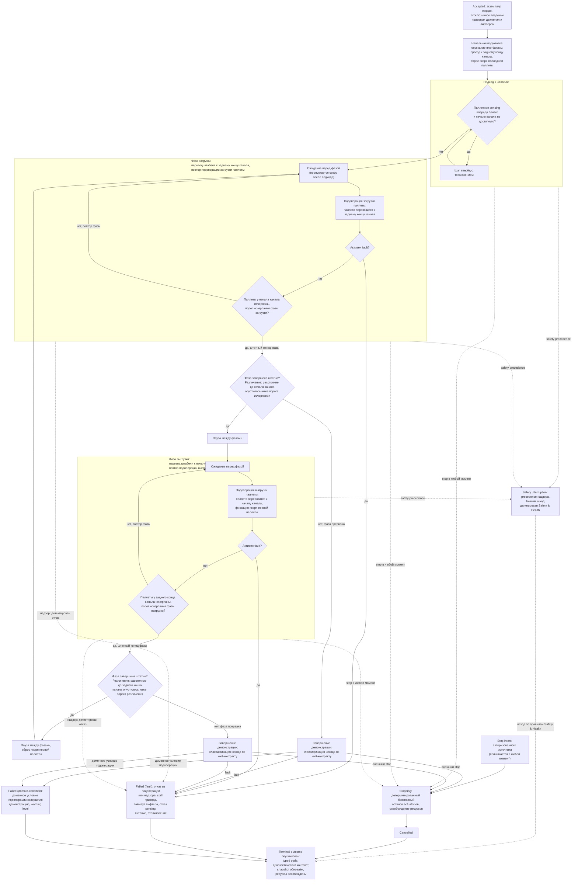

# Алгоритмическая документация операции Demo (V3)

Статус: подготовлено по issue [«Алгоритмическая документация: Demo»](https://github.com/Driadix/ShuttleControllerV3/issues/41) карты [«Спроектировать спецификацию и план прошивки контроллера V3»](https://github.com/Driadix/ShuttleControllerV3/issues/1). Окончательное утверждение ревизий выполняется на gate `G1 Behavioral Contract`.

Формат документа задан [«Формат алгоритмической документации операций V3»](./algorithmic-documentation-format-v3.md): 12-раздельный каркас, трёхслойное разделение содержание/evidence/структура, narrative на русском языке без формул и чисел, идентификаторы на английском. Общая рамка admission, ownership, надзора, прерываний и публикации outcomes задана [«Глобальной алгоритмической документацией работы шаттла V3»](./global-algorithmic-documentation-v3.md); lifecycle, identity, admission и idempotency заданы [«Общим semantic contract операций V3»](./semantic-contract-v3.md).

Evidence: [Capability Evidence Slices каталога операций V3](https://github.com/Driadix/ShuttleControllerV3/blob/research/v3-capability-evidence-slices/docs/research/v3-capability-evidence-slices.md) (ветка `research/v3-capability-evidence-slices`), раздел «4. Demo (CMD_DEMO = 0x06)» и разделы «0. Общий контекст группы», «1. CompactPallets Forward», «2. CompactPallets Reverse», «5. Взаимодействие с inverse/FIFO/LIFO», «6. Сводка мёртвого кода и ordering-багов группы» группы «CompactPallets (F/R), CountPallets, Demo», а также сводка unknowns (неблокирующие unknowns и assumptions); канонический snapshot V1 - `Driadix/ShuttleController@708d090`. Далее ссылки вида «bundle, …» указывают на этот документ.

## 1. Identity и назначение

`Demo` - root operation type каталога V3 (решение [«Определить каталог и базовые инварианты операций V3»](https://github.com/Driadix/ShuttleControllerV3/issues/9)). Допустимая роль экземпляра - root; child-роль контракт типа не предусматривает: демонстрация запускается только как самостоятельная операция, а сама владеет подоперациями загрузки и выгрузки паллет (раздел 10).

Доменная цель - демонстрационный режим работы шаттла: челночный цикл перевозки всего штабеля паллет между концами канала. Фаза загрузки переводит все паллеты к заднему концу канала, затем следует пауза; фаза выгрузки переводит все паллеты обратно к началу канала, снова пауза, и цикл повторяется. Демонстрация не имеет естественного завершения: внешний цикл исполняется до появления внешнего stop intent либо детектированного отказа - это зафиксировано как контракт операции (разделы 5, 7); явный exit-контракт для V3 (условие завершения демонстрации и классификация прерванных фаз) решением владельца не установлен и зафиксирован как предложение change (раздел 11). По сводке unknowns bundle демонстрационный режим на нормативные контракты не влияет.

Отношение к другим документам: admission-скелет, stop propagation, fault semantics, link-loss рамка и публикация outcomes не повторяются здесь, а применяются по глобальному документу и semantic contract; документ фиксирует доменный алгоритм `Demo`, его тип-специфичные paths, условия и исходы, а также композицию с подоперациями `LoadPallet`/`UnloadPallet` (раздел 10). Доменные данные: начало канала, задний конец канала, штабель паллет, порог исчерпания фазы, порог различения конца фазы, ожидание перед фазой, пауза между фазами, якорь первой паллеты, якорь последней паллеты.

## 2. Admission и условия входа

Запрос поступает от `Control Client` в пределах выданных полномочий; `Safety Authority` и `Service Client` демонстрационный режим не запрашивают (автономная продуктовая активность). Envelope, epoch fencing, idempotency и конфликтная семантика - по semantic contract.

Параметры: без параметров. V1 команда не имеет аргументов (`CMD_DEMO` из блока «Lifecycle & State», обрабатывается как команда без параметра; bundle, «0. Общий контекст группы», «4. Demo» - Entry points и call sites).

Системные preconditions (по глобальному документу): provisioning gate (непривязанный шаттл демо-режим не принимает), fault-state gate (при активном fault демо-команда отклоняется до recovery), наличие в канале (демо-команда не входит в exempt-набор `isOutOfChannelExemptCommand` - канальная работа исполняется только в канале), эксклюзивность (одна активная Exclusive Control Activity; для демо-команды действует общее правило занятости `isShuttleIdle`). Отрицательный результат - `Rejected` со стабильным rejection code: `ACK_BAD_ENVIRONMENT` (отсутствие provisioning либо шаттл вне канала), `ACK_ERROR_STATE` (активный fault), `ACK_BUSY` (занятость); `ACK_REJECTED` для демо-команды не применим - команда входит в supported-список (bundle, «0. Общий контекст группы» - 0.2, 0.3).

В V1 admission выполнялся в два приёма: проверки processPacket при приёме кадра и повторная проверка канала тройным опросом при старте из IDLE с отбрасыванием уже подтверждённой команды (`status = 0`, WARN_NOT_IN_CHANNEL). По решению issue [«Специфицировать общий semantic contract операций V3»](https://github.com/Driadix/ShuttleControllerV3/issues/13) admission атомарен, повторная проверка после положительного ACK исключена; V1-факт зафиксирован в разделе 11 с disposition change (глобальный документ, раздел 11).

Условия, проверяемые только in-situ после принятия (дают runtime outcome, а не `Rejected`): тип-специфичных предварительных проверок нет; условия подхода и концов фаз являются условиями циклов внутри `Running` (раздел 4). Демо-команда недостижима из ручной сессии: в `CoreOpMode::MANUAL` приём блокируется правилом занятости, а MANUAL-ветка dispatch не содержит демонстрационной ветки (bundle, «0. Общий контекст группы» - 0.4); по решению каталога ручное управление реализуется lease `Manual Control Session`, демонстрация относится к автономным операциям (issue 9, issue [«Определить system context и таксономию возможностей V3»](https://github.com/Driadix/ShuttleControllerV3/issues/2)).

## 3. Normal path

1. **Принятие.** Admission пройден, экземпляр в `Accepted`, положительный ACK выдан. Root получает эксклюзивное владение приводом движения и лифтером на всю длительность демонстрации; признак штабеля (якорь последней паллеты) в V1 сбрасывается при приёмке (bundle, «0. Общий контекст группы» - 0.4).
2. **Начальная подготовка.** Платформа опускается (если не опущена), шаттл проезжает к заднему концу канала, якорь последней паллеты сбрасывается (bundle, «4. Demo» - Шаги и переходы, шаги 1-2).
3. **Подход к штабелю.** Condition-driven цикл подъезда: пока паллетное sensing впереди близко и начало канала не достигнуто, шаттл делает шаги вперёд с торможением по остатку до начала канала. Цикл завершается, когда паллетное sensing впереди перестаёт быть близким либо шаттл достигает начала канала; после цикла включается признак первого прохода, по которому первое ожидание перед фазой загрузки пропускается (bundle, «4. Demo» - Шаги и переходы, шаг 2).
4. **Цикл демонстрации.** Внешний цикл операции (по контракту не имеющий естественного завершения) компонуется фазами:
   - **Фаза загрузки.** Ожидание перед фазой; повтор подоперации загрузки паллеты: шаттл забирает паллету и перевозит её к заднему концу канала. Фаза завершается штатно, когда паллеты у начала канала исчерпаны - признак: расстояние до начала канала достигло порога исчерпания фазы загрузки. Каждое повторение создаёт новое исполнение подоперации (bundle, «4. Demo» - Шаги и переходы, шаги 4-5).
   - **Развилка после фазы загрузки.** Если после выхода из фазы расстояние до начала канала осталось выше порога различения - фаза была прервана внешним stop либо доменным условием подоперации, демонстрация завершается (раздел 5). Если фаза завершилась штатно - пауза между фазами и переход к фазе выгрузки (bundle, шаг 5).
   - **Фаза выгрузки.** Ожидание перед фазой; повтор подоперации выгрузки паллеты: шаттл забирает паллету у заднего конца канала и перевозит её к началу канала; после каждого переноса фиксируется якорь первой паллеты. Фаза завершается штатно, когда паллеты у заднего конца канала исчерпаны - признак: расстояние до заднего конца канала достигло порога исчерпания фазы выгрузки (bundle, шаги 7-8).
   - **Развилка после фазы выгрузки.** Если после выхода из фазы расстояние до заднего конца канала осталось выше порога различения (внешний stop прервал фазу до исчерпания паллет) либо активен fault - демонстрация завершается. Иначе - сброс якоря первой паллеты, пауза между фазами и переход к фазе загрузки (bundle, шаг 8).
5. **Завершение.** По внешнему stop - `Cancelled`; по fault - `Failed` класса fault; по доменному условию подоперации - `Failed` класса domain-condition (классификация - в рамках exit-контракта, раздел 11). Ресурсы освобождаются, terminal outcome публикуется, snapshot обновляется.

Инвариант `Succeeded ⇔ доменная цель достигнута` соблюдается: baseline не содержит условия штатного завершения демонстрации, поэтому `Succeeded` в нормативном поведении недостижим; демонстрация завершается только прерыванием (раздел 7). Мёртвые ветви V1 в narrative не изображаются: в самом теле `demo_Mode()` мёртвых ветвей нет, дефекты группы относятся к dispatch-ветке (отсутствие `send_Cmd`) и подоперациям (раздел 11).

## 4. Ожидания и повторения

Операция построена на ожиданиях и condition-driven повторениях; все они находятся внутри `Running` с явными условиями входа и выхода.

- **Цикл демонстрации** (внешний бесконечный цикл): вход - после завершения подхода; выход - по stop intent, по активному fault либо через развилку после фазы при нештатном её завершении (доменное условие подоперации). Число итераций заранее не известно; `MaxIterations` не вводится (семантический контракт, отложенные поля).
- **Фаза загрузки** (condition-driven повторение подоперации загрузки паллеты): вход - после подхода либо после паузы; выход - исчерпание паллет у начала канала (порог исчерпания фазы), внешний stop, fault, доменное условие подоперации. Каждое повторение - новое исполнение подоперации.
- **Фаза выгрузки** (condition-driven повторение подоперации выгрузки паллеты): вход - после паузы; выход - исчерпание паллет у заднего конца канала (порог исчерпания фазы), внешний stop, fault, доменное условие подоперации.
- **Ожидание перед фазой**: вход - начало очередного повторения фазы (кроме первого прохода после подхода); выход - истечение отведённого ожидания либо abort. В течение ожидания обслуживаются sensing и индикация.
- **Пауза между фазами**: вход - штатное завершение фазы; выход - истечение отведённой паузы либо abort. В течение паузы обслуживаются sensing и индикация.

Warn-and-continue поведения на уровне операции отсутствуют: предупреждения подопераций завершают текущую фазу через stop-признак и могут завершить демонстрацию через развилку (раздел 5, domain-condition); это не является продолжением работы с предупреждением.

## 5. Прерывания

Рамка stop/fault/safety precedence - глобальный документ, раздел 5; здесь зафиксированы тип-специфичные paths.

### Stop

Stop принимается в любой момент после принятия экземпляра - во время подхода, в ожиданиях, в фазах - и переводит экземпляр в `Stopping`: детерминированный безопасный останов actuator-ов (привод движения и лифтер), освобождение ресурсов, исход `Cancelled`. В V1 stop-команда обрабатывается в `SystemYield` на каждой итерации циклов и ожиданий; останов привода выполняется уже в самом `SystemYield`, после чего цикл операции завершается через abort-проверку `shouldAbortLoop` (bundle, «Общие entry points и dispatch skeleton»; «4. Demo» - Stop/fault/abort). В отличие от подопераций, собственные abort-ветки `demo_Mode` принудительно перезаписывают `CMD_STOP_MANUAL` на `CMD_STOP` и не используют `preserveManualStopOnAbort` (факт; предложение change в разделе 11). Нормативный безопасный останов в V3 охватывает все actuator-ы экземпляра; snapshot отражает фактическое состояние на момент останова.

### Fault

Fault - детектированный внутренний отказ; экземпляр завершается `Failed` с кодом класса `fault` и диагностическим контекстом. `demo_Mode` не вызывает setFault/setWarning сама: fault-исходы возможны только из подопераций и сквозного надзора (bundle, «4. Demo» - Stop/fault/abort). Детектируемые условия:

- `StallDetected` - stall привода по отсутствию прогресса (V1 `FAULT_MOTOR_STALL` через `blink_Work`).
- `LiftTravelTimeout` - таймаут хода лифтера внутри подопераций (V1 `FAULT_LIFTER_TIMEOUT`).
- Отказ или потеря freshness направленного sensing (ToF-faults канала и паллетные, V1 `FAULT_TOF_CH_F/CH_R/PAL_F/PAL_R`); отказ позиционного sensing (V1 `FAULT_AS5600`).
- Сквозные paths надзора: питание ниже порога (V1 `FAULT_LOW_BATTERY`), столкновение (V1 `FAULT_BUMPER_*`).

Любой активный fault через `isErrorActive` завершает текущую фазу и демонстрацию; `loop()` переводит платформу в `CoreOpMode::ERROR` с принудительным остановом (bundle, «Общие entry points и dispatch skeleton»; глобальный документ, раздел 5). V1 latch-семантика сохраняется: fault удерживается до явного recovery.

### Domain-condition

Domain-condition - наблюдаемое состояние мира, делающее достижение цели фазы/демонстрации невозможным; исход `Failed` с кодом класса `domain-condition`, severity warning level по коду. Доменные условия приходят только из подопераций: `ChannelFull` (канал заполнен, V1 `WARN_CHANNEL_FULL`), `PalletSizeError` (недопустимый размер паллеты, V1 `WARN_PALLET_SIZE_ERROR`), `ObstacleAhead` (препятствие впереди, V1 `WARN_OBSTACLE_AHEAD`), `PalletNotFound` (паллета не обнаружена, V1 `WARN_PALLET_NOT_FOUND`). Предупреждение подоперации завершает текущую фазу через stop-признак внутри подоперации; демонстрация при этом может завершиться через развилку после фазы, если расстояние до соответствующего конца канала не соответствует штатному окончанию фазы (bundle, «4. Demo» - Stop/fault/abort). В V1 такой выход молчаливый (return без исхода); в V3 прерванная фаза классифицируется явно - `Failed` класса domain-condition с кодом по наблюдению, в рамках exit-контракта (раздел 11, предложение change). Неисправность сенсора при положительных признаках отказа является fault-путём, а не domain-condition.

Поведение при пустом канале (фаза загрузки не находит ни одной паллеты) из source однозначно не устанавливается: подоперация идёт по своим warning-путям, а исход демонстрации зависит от геометрии; зафиксировано как unknown с владельцем (раздел 8, 11). По сводке unknowns bundle демонстрационный режим на нормативные контракты не влияет.

### Safety interruption

Точки safety-прерывания операции: permit-проверки и надзор во время движения привода и лифтера во всех фазах и подходах (потеря freshness направленного sensing, столкновение, питание ниже порога, перегрузка лифтера по правилам `Safety & Health`). Граница с fault-путями - по глобальному документу: детектированный надзором отказ завершает экземпляр fault-исходом (выше); safety interruption наступает, когда Safety Authority применяет precedence к operation intents. Точный исход прерванного экземпляра делегирован `Safety & Health` и здесь не выдумывается.

### Link-loss

`Demo` - автономная операция; назначенная link-loss policy - `continue`: после потери инициатора экземпляр продолжает исполнение до собственного terminal outcome (V1 baseline: автономное исполнение не зависит от наличия связи; глобальный документ, раздел 5).

## 6. Recovery и состояние после прерывания

Возобновление всегда явное - новый запрос; generic pause/resume операции не свойственен. Особенность демонстрационного режима: штатного завершения нет, поэтому любое продолжение означает новый запрос, а состояние штабеля после прерывания - частично перенесённый между концами канала.

- **После `Cancelled` (stop):** шаттл остановлен в точке прерывания фазы, actuator-ы остановлены, ресурсы освобождены; snapshot отражает фактическое физическое состояние (позиция, состояние платформы, счётчики). Продолжение - новым запросом с учётом фактического состояния штабеля.
- **После `Failed` (fault):** fault удерживается (latched semantics); платформа допускает только override/service-действия; recovery через `ClearFault` с baseline-условиями снятия (квалифицированное восстановление sensing/шины и физическая неподвижность) по глобальному документу. Прерванная операция не возобновляется.
- **После `Failed` (domain-condition):** физическое состояние сохраняется: штабель частично перенесён, шаттл в позиции прерывания фазы; snapshot несёт код и диагностический контекст. Продолжение - явным новым запросом (повтор демонстрации либо иная канальная операция) с учётом фактического состояния.
- **После safety interruption:** состояние и исход по правилам `Safety & Health`.

## 7. Terminal outcomes и наблюдаемые результаты

Принятый экземпляр завершается одним из terminal states; `Rejected` относится только к запросу.

| Исход | Класс | Наблюдаемое условие |
| --- | --- | --- |
| `Succeeded` | - | в baseline не предусмотрен: операция не имеет естественного завершения, цель - непрерывная демонстрация; достижимость `Succeeded` - предмет exit-контракта (раздел 11) |
| `Cancelled` | stop | внешний stop intent в любой точке цикла; детерминированный безопасный останов actuator-ов |
| `Failed` | `fault` | `StallDetected`, `LiftTravelTimeout`, отказ/freshness направленного sensing, отказ позиционного sensing, питание ниже порога, столкновение (из подопераций и надзора) |
| `Failed` | `domain-condition` | доменное условие подоперации завершило демонстрацию: `ChannelFull`, `PalletSizeError`, `ObstacleAhead`, `PalletNotFound`; warning level по коду; классификация - в рамках exit-контракта |

Outcome содержит стабильный typed code и минимальный диагностический контекст: фаза на момент исхода, позиция шаттла, расстояния до концов канала, исход последней подоперации, счётчики переносов, состояние fault/warning. Таксономия typed codes и назначение severity фиксируются `External Semantic & Transport Contracts` и `Observability & Diagnostics`; имена условий выше - observation-based имена, принятые этим документом, связь с V1-именами - в разделе 11.

Внешняя видимость - по semantic contract: положительный ACK при принятии, terminal outcome при завершении, query snapshot как authoritative read-модель. Observable events: принятие, старт демонстрационного режима, переходы между фазами, предупреждения подопераций, terminal outcome. Во время исполнения телеметрия несёт состояние `STATE_DEMO` (bundle, «0. Общий контекст группы» - 0.4); счётчики переносов `loadCounter`/`unloadCounter` растут с каждым переносом, `compactCounter` не растёт (bundle, «4. Demo» - Observable outcomes); якорь первой паллеты пишется в фазе выгрузки и сбрасывается после фазы и в dispatch. V1-каденции телеметрии и mapping состояний зафиксированы в evidence как baseline budgets `Observability & Diagnostics`.

## 8. Timing conditions

Унаследованные timing-условия V1 для `Demo`. Количественные значения остаются в evidence; новые количественные значения документ не вводит.

| Условие | Класс | Anchor | Disposition |
| --- | --- | --- | --- |
| `DemoApproachZone` - зона подхода: паллетное sensing впереди близко | configured | Cntrl_V2/Cntrl_V2.ino:L6704-L6707 (bundle, compact-count-demo - 4. Demo - Timing conditions) | preserve |
| `DemoApproachEndGuard` - охрана начала канала при подходе | configured | Cntrl_V2/Cntrl_V2.ino:L6704-L6707 (bundle, compact-count-demo - 4. Demo - Timing conditions) | preserve |
| `DemoApproachStep` - шаг подхода вперёд и торможение | configured | Cntrl_V2/Cntrl_V2.ino:L6704-L6707 (bundle, compact-count-demo - 4. Demo - Timing conditions) | preserve как tuning-политику; значения пересматриваются с NFR/HIL |
| `DemoPrePhaseWait` - ожидание перед фазой (пропуск на первом проходе после подхода) | configured | Cntrl_V2/Cntrl_V2.ino:L6733-L6744, Cntrl_V2/Cntrl_V2.ino:L6783-L6794 (bundle, compact-count-demo - 4. Demo - Timing conditions) | preserve |
| `DemoInterPhasePause` - пауза между фазами | configured | Cntrl_V2/Cntrl_V2.ino:L6764-L6776, Cntrl_V2/Cntrl_V2.ino:L6817-L6829 (bundle, compact-count-demo - 4. Demo - Timing conditions) | preserve |
| `DemoLoadPhaseEnd` - порог исчерпания фазы загрузки (паллеты у начала канала кончились) | configured | Cntrl_V2/Cntrl_V2.ino:L6752-L6753 (bundle, compact-count-demo - 4. Demo - Timing conditions) | preserve |
| `DemoUnloadPhaseEnd` - порог исчерпания фазы выгрузки (паллеты у заднего конца канала кончились) | configured | Cntrl_V2/Cntrl_V2.ino:L6802-L6803 (bundle, compact-count-demo - 4. Demo - Timing conditions) | preserve |
| `DemoStopVsNaturalEnd` - различение внешнего stop и штатного конца фазы по расстоянию до соответствующего конца канала | configured | Cntrl_V2/Cntrl_V2.ino:L6755-L6761, Cntrl_V2/Cntrl_V2.ino:L6806-L6814 (bundle, compact-count-demo - 4. Demo - Timing conditions, Шаги и переходы) | preserve механизм различения; классификация прерванного исхода - в составе exit-контракта (предложение change, раздел 11) |
| `DemoPauseDoubleYield` - двойной вызов `SystemYield` в паузах | configured | Cntrl_V2/Cntrl_V2.ino:L6766-L6767, Cntrl_V2/Cntrl_V2.ino:L6819-L6820 (bundle, compact-count-demo - 4. Demo - Timing conditions, Unknowns) | unknown: назначение не устанавливается; косметический факт, на нормативные контракты не влияет; закрытие - владелец, gate контракта Demo |
| `LoadObstacleSearchTimeout` - таймаут поиска паллеты в подоперации загрузки (V1 `WARN_OBSTACLE_AHEAD`) | configured | Cntrl_V2/Cntrl_V2.ino:L5802-L5808 (bundle, compact-count-demo - 1. CompactPallets Forward - Timing conditions) | preserve; делегировано документу LoadPallet |
| `UnloadObstacleSearchTimeout` - таймаут поиска паллеты в подоперации выгрузки | configured | Cntrl_V2/Cntrl_V2.ino:L5453-L5462 (bundle, compact-count-demo - 2. CompactPallets Reverse - Timing conditions) | preserve; делегировано документу UnloadPallet |
| `PalletEngageDistance` - заезд под паллету (профильные значения) | configured | Cntrl_V2/Cntrl_V2.ino:L5724-L5726 (bundle, compact-count-demo - 1. CompactPallets Forward - Timing conditions), Cntrl_V2/Cntrl_V2.ino:L5382-L5387 (bundle, compact-count-demo - 2. CompactPallets Reverse - Timing conditions) | preserve как tuning-политику; делегировано документам подопераций |
| `PalletJamProfile` - дожим под доской паллеты | configured | Cntrl_V2/Cntrl_V2.ino:L5733-L5766 (bundle, compact-count-demo - 1. CompactPallets Forward - Шаги и переходы), Cntrl_V2/Cntrl_V2.ino:L5393-L5403 (bundle, compact-count-demo - 2. CompactPallets Reverse - Шаги и переходы) | preserve как tuning-политику; делегировано документам подопераций |
| `PalletPlacementDistance` - дистанция постановки паллеты с учётом межпаллетной дистанции | configured | Cntrl_V2/Cntrl_V2.ino:L4626-L4629 (bundle, compact-count-demo - 1. CompactPallets Forward - Подоперация load_Pallete), Cntrl_V2/Cntrl_V2.ino:L4396-L4399 (bundle, compact-count-demo - 2. CompactPallets Reverse - Подоперация unload_Pallete) | preserve; делегировано документам подопераций |
| `MotorStallDetectWindow` - окно stall-детекта привода (V1 `FAULT_MOTOR_STALL`) | configured | Cntrl_V2/Cntrl_V2.ino:L4078-L4085 (bundle, compact-count-demo - 1. CompactPallets Forward - Timing conditions) | preserve; fault-исход - глобальный документ, раздел 5 |
| `LiftTravelTimeout` - максимум времени хода лифтера (V1 `FAULT_LIFTER_TIMEOUT`) | configured | Cntrl_V2/Cntrl_V2.ino:L2412-L2419 (подъём), Cntrl_V2/Cntrl_V2.ino:L2501-L2506 (опускание) (bundle, группа «MoveDistance + LiftTo…» - 2. LiftTo - Timing conditions) | preserve; делегировано документу LiftTo |
| `MotorSpeedThrottle` - минимальный интервал между записями скорости приводу | configured | Cntrl_V2/Cntrl_V2.ino:L2090-L2092 (bundle, группа «MoveDistance + LiftTo…» - 3. Примитивы движения) | preserve (shared primitive) |
| `BlinkQuantum` - квант обслуживания индикации и CAN-drain (`blink_Work`) | configured | Cntrl_V2/Cntrl_V2.ino:L584, Cntrl_V2/Cntrl_V2.ino:L4054 (bundle, compact-count-demo - 1. CompactPallets Forward - Timing conditions) | preserve (shared primitive) |

Unknowns:

- **U01** (физические единицы контракта приводов): настоящий документ не блокирует - количественные значения и единицы остаются в evidence; стадия закрытия U01 - контракты actuation (MoveDistance/LiftTo).
- **U07** (фактические runtime-значения конфигурации, включая распределение профилей): настоящий документ не блокирует; профильные значения демонстрации наследуются от подопераций (раздел 9).
- Поведение демонстрации при пустом канале: из source однозначно не устанавливается, исход зависит от warning-путей подопераций и геометрии; неблокирующий, демонстрационный режим на нормативные контракты не влияет (bundle, «4. Demo» - Unknowns; сводка unknowns, неблокирующие). Владелец - владелец, стадия закрытия - gate контракта Demo.
- Назначение двойного `SystemYield` в паузах (`DemoPauseDoubleYield`): см. строку таблицы; владелец - владелец, стадия закрытия - gate контракта Demo.

## 9. Профильные варианты

Собственных профильных ветвлений демонстрация не имеет: алгоритм цикла одинаков для профилей 800, 1000 и 1200 (bundle, «4. Demo» - Профильные варианты). Профильные различия наследуются от подопераций загрузки/выгрузки паллет: заезд под паллету, дожим под доской, перехват паллеты, поправки дистанции постановки и межпаллетная дистанция (bundle, «1. CompactPallets Forward», «2. CompactPallets Reverse» - Профильные варианты). Валидация профиля как набора механических параметров - `Configuration & Calibration` (unknown U07, владелец - владелец и полевые данные); демонстрационный режим это не затрагивает.

## 10. Composition boundaries

`Demo` - составная операция: доменный цикл исполняется root-экземпляром, а переносы паллет делегируются подоперациям загрузки и выгрузки паллет (bundle, «4. Demo» - Entry points и call sites). По V1 baseline `load_Pallete`/`unload_Pallete` являются вызовами внутри `demo_Mode`; в V3 они становятся child-экземплярами operation types `LoadPallet`/`UnloadPallet` по разрешённым рёбрам статического type graph с делегированным набором ресурсов (semantic contract, раздел «Root, suboperation и primitive»; глобальный документ, раздел 10). Конкретный набор разрешённых parent-типов фиксирует статический type graph; настоящий документ фиксирует, что фазы демонстрации делегируют переносы подоперациям и чередуют их.

- **Suboperations:** фаза загрузки повторяет подоперацию `LoadPallet` (перенос паллеты к заднему концу канала); фаза выгрузки повторяет подоперацию `UnloadPallet` (перенос паллеты к началу канала, фиксация якоря первой паллеты). Каждое повторение создаёт новое исполнение подоперации; заранее известное число итераций не требуется, `MaxIterations` не вводится. Исходы подопераций вносят вклад в исход демонстрации по правилам композиции: fault подоперации - fault демонстрации; доменное условие подоперации завершает фазу и может завершить демонстрацию (раздел 5).
- **Primitives** (не имеют собственной operation identity и lifecycle): шаги движения привода и его остановы, шаги подъёма и опускания лифтера, детектирование паллет, обслуживания sensing и индикации, тики `SystemYield`-обслуживания.
- **Ресурсы:** root эксклюзивно владеет приводом движения и лифтером на всю длительность демонстрации; подоперации получают делегированный набор и не приобретают ресурсы за пределами delegation; после отзыва delegation child не продолжает доменный шаг.
- Демонстрация наследует от подопераций переключение кадра координат (fifo/LIFO-инверсию направления); зафиксированная утечка инверсии на двух error-путях `unload_Pallete` затрагивает и демо-фазу выгрузки, устранение - в контракте `UnloadPallet` (раздел 11).

## 11. V1 dispositions и evidence

Evidence anchors - bundle, разделы «0. Общий контекст группы», «4. Demo», «1. CompactPallets Forward», «2. CompactPallets Reverse», «5. Взаимодействие с inverse/FIFO/LIFO», «6. Сводка мёртвого кода», группа «MoveDistance + LiftTo…» и сводка unknowns; канонический snapshot V1 `Driadix/ShuttleController@708d090`. Решения владельца по предложениям, помеченным «предложение change», на gate контракта `Demo` не приняты; disposition не выдумывается.

| Поведение V1 | Evidence | Disposition | Основание |
| --- | --- | --- | --- |
| Внешний бесконечный цикл демонстрации без естественного завершения; единственные выходы - stop, fault, доменное условие подоперации через развилки | Cntrl_V2/Cntrl_V2.ino:L6720-L6728 (bundle, compact-count-demo - 4. Demo - Шаги и переходы) | preserve (демонстрационная семантика); предложение change - явный exit-контракт для V3 (условие завершения демонстрации и классификация прерванных фаз) | предложение change - решение владельца на gate контракта Demo; инвариант `Succeeded ⇔ цель достигнута` формата (issue [«Зафиксировать формат и acceptance criteria алгоритмической документации V3»](https://github.com/Driadix/ShuttleControllerV3/issues/15)) |
| Различение внешнего stop и штатного конца фазы по расстоянию до соответствующего конца канала | Cntrl_V2/Cntrl_V2.ino:L6755-L6761, Cntrl_V2/Cntrl_V2.ino:L6806-L6814 (bundle, compact-count-demo - 4. Demo - Шаги и переходы) | preserve механизма различения; классификация прерванного исхода - в составе exit-контракта | предложение change - решение владельца на gate контракта Demo |
| Dispatch-ветка DEMO без `send_Cmd` - единственная ветка каталога без телеметрийного снапшота | Cntrl_V2/Cntrl_V2.ino:L3308-L3312 (bundle, compact-count-demo - 0.5; 6. Сводка мёртвого кода, п. 7) | предложение change - унифицировать телеметрийные снапшоты | предложение change - решение владельца на gate контракта Demo |
| Затирание `CMD_STOP_MANUAL` в abort-ветках `demo_Mode` (принудительное `status = CMD_STOP`); `preserveManualStopOnAbort` демо-режим не использует | Cntrl_V2/Cntrl_V2.ino:L6723-L6728, Cntrl_V2/Cntrl_V2.ino:L6736-L6741, Cntrl_V2/Cntrl_V2.ino:L6768-L6773, Cntrl_V2/Cntrl_V2.ino:L6786-L6791, Cntrl_V2/Cntrl_V2.ino:L6821-L6826 (bundle, compact-count-demo - 4. Demo - Stop/fault/abort) | предложение change - единая семантика preserveManualStopOnAbort | предложение change - решение владельца на gate контракта Demo |
| Якорь первой паллеты пишется в фазе выгрузки, сбрасывается после фазы и в dispatch | Cntrl_V2/Cntrl_V2.ino:L6796, Cntrl_V2/Cntrl_V2.ino:L6805, Cntrl_V2/Cntrl_V2.ino:L3311 (bundle, compact-count-demo - 4. Demo - Observable outcomes; Unknowns) | unknown: нужно ли позиционирование якоря первой паллеты демонстрации в V3 (в V1 используется скоростным проездом подопераций) | предложение change - решение владельца на gate контракта Demo |
| Двойной `SystemYield` в паузах между фазами | Cntrl_V2/Cntrl_V2.ino:L6766-L6767, Cntrl_V2/Cntrl_V2.ino:L6819-L6820 (bundle, compact-count-demo - 4. Demo - Timing conditions, Unknowns) | unknown: назначение не устанавливается; косметический факт, на нормативные контракты не влияет | предложение change - решение владельца на gate контракта Demo |
| Начальная подготовка: опускание платформы, проезд к заднему концу канала, сброс якоря последней паллеты | Cntrl_V2/Cntrl_V2.ino:L6695-L6700 (bundle, compact-count-demo - 4. Demo - Шаги и переходы) | preserve | baseline |
| Подход к штабелю шагами вперёд с торможением; в отличие от compact-подходов, без условия паллетных сенсоров | Cntrl_V2/Cntrl_V2.ino:L6704-L6719 (bundle, compact-count-demo - 4. Demo - Шаги и переходы) | preserve | baseline (демонстрационная семантика) |
| Штатные концы фаз: загрузка - при исчерпании паллет у начала канала; выгрузка - при исчерпании паллет у заднего конца канала | Cntrl_V2/Cntrl_V2.ino:L6752-L6753, Cntrl_V2/Cntrl_V2.ino:L6802-L6803 (bundle, compact-count-demo - 4. Demo - Шаги и переходы) | preserve | baseline |
| Ожидания перед фазами и паузы между фазами с обслуживанием sensing и индикации | Cntrl_V2/Cntrl_V2.ino:L6733-L6744, Cntrl_V2/Cntrl_V2.ino:L6764-L6776, Cntrl_V2/Cntrl_V2.ino:L6783-L6794, Cntrl_V2/Cntrl_V2.ino:L6817-L6829 (bundle, compact-count-demo - 4. Demo - Шаги и переходы, Timing conditions) | preserve | baseline |
| `demo_Mode` не вызывает setFault/setWarning; fault-исходы возможны только из подопераций и сквозного надзора | Cntrl_V2/Cntrl_V2.ino:L6746-L6753, Cntrl_V2/Cntrl_V2.ino:L6795-L6803 (bundle, compact-count-demo - 4. Demo - Stop/fault/abort) | preserve; классификация исходов - по правилам формата и надзора | глобальный документ, раздел 5; формат, классификация paths |
| Предупреждения подопераций (`WARN_CHANNEL_FULL`, `WARN_PALLET_SIZE_ERROR`, `WARN_OBSTACLE_AHEAD`, `WARN_PALLET_NOT_FOUND`) завершают фазу через stop-признак и могут завершить демонстрацию через развилки; в V1 выход молчаливый | Cntrl_V2/Cntrl_V2.ino:L5671-L5677 (WARN_CHANNEL_FULL), Cntrl_V2/Cntrl_V2.ino:L5773-L5784, Cntrl_V2/Cntrl_V2.ino:L5432-L5441 (WARN_PALLET_SIZE_ERROR), Cntrl_V2/Cntrl_V2.ino:L5802-L5808, Cntrl_V2/Cntrl_V2.ino:L5453-L5462 (WARN_OBSTACLE_AHEAD), Cntrl_V2/Cntrl_V2.ino:L5477-L5485 (WARN_PALLET_NOT_FOUND) (bundle, compact-count-demo - 1. CompactPallets Forward, 2. CompactPallets Reverse - подоперации; 4. Demo - Stop/fault/abort) | предложение change - явная классификация как `Failed` класса domain-condition с кодом по наблюдению (`ChannelFull`, `PalletSizeError`, `ObstacleAhead`, `PalletNotFound`) в рамках exit-контракта | предложение change - решение владельца на gate контракта Demo; формат, правило 6 (domain-condition) |
| Счётчики переносов `loadCounter`/`unloadCounter` растут с каждым переносом; `compactCounter` в демонстрации не растёт | Cntrl_V2/Cntrl_V2.ino:L5938, Cntrl_V2/Cntrl_V2.ino:L5656 (bundle, compact-count-demo - 4. Demo - Observable outcomes) | preserve как наблюдаемые результаты | baseline; глобальный документ, раздел 7 (budgets Observability) |
| Telemetry mapping при приёмке: `CMD_DEMO` -> `STATE_DEMO` | Cntrl_V2/Cntrl_V2.ino:L8246-L8247, Cntrl_V2/ShuttleProtocol.h:L93 (bundle, compact-count-demo - 0.4) | preserve как baseline budgets `Observability & Diagnostics` | глобальный документ, раздел 7 |
| Admission-скелет демо-команды: supported-список, provisioning gate, fault-state gate, in-channel проверка (не exempt), занятость `isShuttleIdle` | Cntrl_V2/Cntrl_V2.ino:L8351-L8384, Cntrl_V2/Cntrl_V2.ino:L2819-L2851, Cntrl_V2/Cntrl_V2.ino:L8430-L8465 (bundle, compact-count-demo - 0.2, 0.3) | preserve в семантике; форма отказов - typed rejection codes | semantic contract; решение issue [«Определить system context и таксономию возможностей V3»](https://github.com/Driadix/ShuttleControllerV3/issues/2) |
| Повторная проверка канала тройным опросом при старте из IDLE с отбрасыванием команды после ACK | Cntrl_V2/Cntrl_V2.ino:L1829-L1839 (bundle, compact-count-demo - 0.4) | change: атомарный admission без post-ACK re-check | решение issue [«Специфицировать общий semantic contract операций V3»](https://github.com/Driadix/ShuttleControllerV3/issues/13); глобальный документ, раздел 11 |
| Демо-команда недостижима из ручной сессии: приём блокируется, MANUAL-ветка dispatch не содержит демонстрации | Cntrl_V2/Cntrl_V2.ino:L1990-L2010, Cntrl_V2/Cntrl_V2.ino:L8430-L8465 (bundle, compact-count-demo - 0.4) | preserve: тип автономный, не manual intent | решение каталога (issue [«Определить каталог и базовые инварианты операций V3»](https://github.com/Driadix/ShuttleControllerV3/issues/9)); Manual Control Session (issue [«Определить system context и таксономию возможностей V3»](https://github.com/Driadix/ShuttleControllerV3/issues/2)) |
| Демонстрация наследует переключение кадра координат (fifo/LIFO) из подопераций; утечка инверсии на двух error-путях `unload_Pallete` затрагивает фазу выгрузки | Cntrl_V2/Cntrl_V2.ino:L5410-L5415, Cntrl_V2/Cntrl_V2.ino:L5432-L5441 (bundle, compact-count-demo - 2. CompactPallets Reverse - Stop/fault/abort, утечка inverse; 5. Взаимодействие с inverse/FIFO/LIFO) | предложение change - гарантировать идемпотентный возврат кадра координат в контракте `UnloadPallet`; демо-режим наследует решение | предложение change - решение владельца на gate контракта UnloadPallet; зафиксированные дефекты V1 не переносятся как нормативное поведение (глобальный документ, раздел 11) |
| Поведение при пустом канале из source не устанавливается | bundle, compact-count-demo - 4. Demo - Unknowns; сводка unknowns, неблокирующие unknowns | unknown: закрытие владельцем до gate контракта Demo; демонстрационный режим на нормативные контракты не влияет | предложение change - решение владельца на gate контракта Demo |

## 12. Диаграмма

Обязательная Mermaid-блок-схема алгоритма `Demo`. Источник diagram-as-code: [diagrams/src/demo-flow.mmd](../diagrams/src/demo-flow.mmd).

Narrative и диаграмма согласованы: каждое ветвление и ожидание narrative (принятие и владение ресурсами, начальная подготовка, цикл подхода с условиями входа и выхода, фаза загрузки с ожиданием, подоперацией, проверкой fault и порогом исчерпания, развилка различения штатного конца фазы и прерывания, пауза между фазами, фаза выгрузки с якорем первой паллеты и порогом исчерпания, её развилка и пауза, возврат к фазе загрузки, завершение по внешнему stop, fault, доменному условию подоперации, safety precedence, публикация terminal outcome) присутствует на диаграмме, и каждая ветвь диаграммы описана в разделах 2-7. Ветвь `Succeeded` отсутствует по построению: baseline не содержит штатного завершения демонстрации (раздел 7), достижимость `Succeeded` связана с решением об exit-контракте (раздел 11).

## Ревью

- Ревьюер: независимая сессия (субагент), сверка по первоисточнику V1 и evidence bundle
- Вердикт: APPROVED
- Дата: 2026-08-06
- Результат: readiness checklist 10/10, blocking findings отсутствуют (повторное ревью после устранения замечания по диаграмме)
