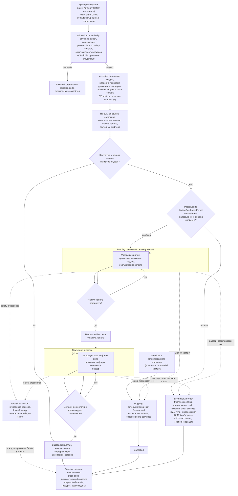

# Алгоритмическая документация операции Evacuate (V3)

Статус: подготовлено по issue [«Алгоритмическая документация: Evacuate»](https://github.com/Driadix/ShuttleControllerV3/issues/42) карты [«Спроектировать спецификацию и план прошивки контроллера V3»](https://github.com/Driadix/ShuttleControllerV3/issues/1). Окончательное утверждение ревизий выполняется на gate `G1 Behavioral Contract`.

Формат документа задан [«Формат алгоритмической документации операций V3»](./algorithmic-documentation-format-v3.md): 12-раздельный каркас, трёхслойное разделение содержание/evidence/структура, narrative на русском языке без формул и чисел, идентификаторы на английском. Общая рамка admission, ownership, надзора, прерываний и публикации outcomes задана [«Глобальной алгоритмической документацией работы шаттла V3»](./global-algorithmic-documentation-v3.md); lifecycle, identity, admission и idempotency заданы [«Общим semantic contract операций V3»](./semantic-contract-v3.md).

Evidence: [Capability Evidence Slices каталога операций V3](./research/v3-capability-evidence-slices.md), раздел «Группа: Home / Calibrate / Evacuate», подраздел «Evacuate (CMD_EVACUATE_ON = 0x28) - ОСОБЫЙ СЛУЧАЙ», а также «Общие entry points и dispatch skeleton» и «Профильные варианты 800/1000/1200 - сводка»; канонический snapshot V1 - `Driadix/ShuttleController@708d090`. Далее ссылки вида «bundle, …» указывают на этот документ.

**Особый статус документа.** В V1 у `Evacuate` нет production-алгоритма: подтверждено строго по source, что V1 содержит только объявления enum-значений `CMD_EVACUATE_ON = 0x28` (Cntrl_V2/ShuttleProtocol.h:L114) и `STATE_EVACUATE = 5` (Cntrl_V2/ShuttleProtocol.h:L152), команда не входит в supported-список и отвергается с `ACK_REJECTED` (Cntrl_V2/Cntrl_V2.ino:L2782-L2786), call sites отсутствуют. Поэтому настоящий документ фиксирует (а) V1-факт как disposition (разделы 1 и 11, блокирующий unknown U05) и (б) согласованный проект V3-поведения отдельно, как того требует приёмка тикета [#29](https://github.com/Driadix/ShuttleControllerV3/issues/29) карты: «зафиксировать это как disposition и отдельно описать согласованный V3 behavior». Все элементы V3-поведения, не выводимые из evidence, помечены «V3 addition, решение владельца на gate контракта Evacuate» либо «предложение change - решение владельца на gate контракта Evacuate» и не являются решённой спецификацией до подтверждения владельцем на gate `G1 Behavioral Contract`.

## 1. Identity и назначение

`Evacuate` - root operation type каталога V3 (решение [«Определить каталог и базовые инварианты операций V3»](https://github.com/Driadix/ShuttleControllerV3/issues/9): каталог включает `Evacuate` среди root operation types; глобальный документ, раздел 1).

**V1-факт (enum-only).** V1 не реализует операцию: production-код содержит ровно два вхождения «evacuate» - объявления `CMD_EVACUATE_ON = 0x28` (Cntrl_V2/ShuttleProtocol.h:L114, блок "0x20 Block: Auto Operations") и `STATE_EVACUATE = 5` (Cntrl_V2/ShuttleProtocol.h:L152, enum `ShuttleState`). Команда отсутствует в `isSupportedCommand()` (Cntrl_V2/Cntrl_V2.ino:L8351-L8384), кадр с cmdType `0x28` отвергается на admission с `ACK_REJECTED` (Cntrl_V2/Cntrl_V2.ino:L2782-L2786), ни одного call site нет ни в `Cntrl_V2.ino`, ни в остальных production-файлах; `STATE_EVACUATE` вне объявления не используется, telemetry-пакет evacuate-полей не содержит (bundle, «Evacuate - ОСОБЫЙ СЛУЧАЙ», пункты (a)-(e)). Семантика операции из V1 не выводится - блокирующий unknown U05 (bundle, unknowns.md): содержание новой V3-операции определяется не V1, а решением владельца на gate контракта Evacuate.

**Доменная цель V3 (V3 addition, решение владельца на gate контракта Evacuate).** Привести шаттл к началу канала и безопасному останову с опущенным лифтером. Обоснование замысла: глобальный документ, раздел 6 фиксирует для safety interruption: «при эвакуации шаттл достигает начала канала и безопасного останова, лифтер опущен»; роль `Safety Authority` (CONTEXT.md) уполномочена «инициировать авторизованные safety operations, включая эвакуацию шаттла»; глобальный документ, раздел 5 перечисляет `Evacuate` среди авторизованных safety operations, инициируемых Safety Authority как отдельный root instance с причиной запуска и trace context (не child прерванной операции).

Допустимая роль экземпляра - root (V3 addition, решение владельца на gate контракта Evacuate): `Evacuate` инициируется как отдельный root instance и не является child прерванной операции (глобальный документ, раздел 5). child-роль контракт типа не предусматривает (предложение).

Отношение к другим документам: admission-скелет, stop propagation, fault semantics, link-loss рамка и публикация outcomes не повторяются здесь, а применяются по глобальному документу и semantic contract; документ фиксирует только доменный алгоритм `Evacuate`, его тип-специфичные paths, условия и исходы - как согласованный проект V3-поведения, ожидающий решения владельца.

## 2. Admission и условия входа

Запрос операции поступает от `Safety Authority` (внутренний источник firmware; запрос несёт причину запуска и trace context по глобальному документу, раздел 5) и от `Control Client` в пределах выданных полномочий (каталог, issue 9; bundle, сводные unknowns - U05: «источники запуска Safety Authority и Control Client по issue 9»). Это V3 addition, решение владельца на gate контракта Evacuate: точный набор авторизованных источников и полномочий зафиксирует владелец вместе с закрытием U05. Envelope, epoch fencing, idempotency и конфликтная семантика - по semantic contract; для внутренних запросов Safety Authority firmware подставляет текущий `controllerEpoch` (глобальный документ, раздел 2).

Параметры: без параметров (V3 addition, решение владельца на gate контракта Evacuate). Контракт типа не вводит полей `parameters`; причина запуска и trace context передаются как диагностический контекст запроса, а не как параметры операции (глобальный документ, раздел 5).

Системные preconditions (по глобальному документу, раздел 2) применяются к операции с исключениями, определяемыми authority и safety contract (V3 addition, решение владельца на gate контракта Evacuate):

- **Fault state**: предложение - запросы Safety Authority принимаются и при активном fault (эвакуация является safety-действием и может требоваться из health-degraded состояния); точное правило взаимодействия с fault-state gate - предложение change, решение владельца на gate контракта Evacuate.
- **In-channel**: предложение - проверка физического наличия в канале для эвакуации может обходиться по safety contract (доменная цель «начало канала» не требует исполнения вне канала, но условие входа не может быть жёстче safety-потребности); обход оформляется как исключение по authority и подтверждается `Safety & Health`. Предложение change - решение владельца на gate контракта Evacuate.
- **Provisioning**: предложение - для safety-инициированной эвакуации действует правило, согласованное со `Safety & Health`; для Control Client - по общему правилу provisioning gate. Предложение change - решение владельца на gate контракта Evacuate.
- **Эксклюзивность**: операция владеет эксклюзивным набором ресурсов (привод движения, лифтер) по semantic contract; при safety-инициированном запуске Safety Authority применяет safety precedence к operation intents (глобальный документ, раздел 5; semantic contract, раздел «Cancellation и stop propagation»), точные правила конфликта обычного cancel и safety action фиксируются в safety model (`Safety & Health`) и здесь не выдумываются.

Отрицательный результат admission - `Rejected` со стабильным rejection code, экземпляр не создаётся, частичных резервирований нет (semantic contract). Повторная проверка принятия после положительного ACK исключена: admission атомарен (решение [«Специфицировать общий semantic contract операций V3»](https://github.com/Driadix/ShuttleControllerV3/issues/13)).

Условия, проверяемые только in-situ после принятия (дают runtime outcome, а не `Rejected`):

- разрешение старта движения по freshness направленного sensing (условие `MotionFreshnessPermit`; глобальный документ, разделы 3 и 8) - применяется как системное условие надзора (V3 addition, решение владельца на gate контракта Evacuate);
- состояние шаттла на момент старта (позиция, состояние лифтера) проверяется in-situ и определяет объём actuation (раздел 3) (V3 addition, решение владельца на gate контракта Evacuate).

## 3. Normal path

Шаги раздела - согласованный проект V3-поведения: V1-алгоритма нет (раздел 1), каждый шаг является V3 addition и вступает в силу решением владельца на gate контракта Evacuate.

1. **Принятие.** Admission пройден, экземпляр в `Accepted`, положительный ACK выдан authority запроса (для внутреннего Safety Authority - уведомление в пределах внутреннего контракта). Root получает эксклюзивное владение приводом движения и лифтером.
2. **Начальная оценка состояния.** По sensing-сервисам определяется фактическое состояние: позиция шаттла относительно начала канала и состояние лифтера. Если шаттл уже находится у начала канала и лифтер опущен - доменная цель уже достигнута, экземпляр завершает алгоритм `Succeeded` без actuation (по инварианту раздела 7; аналог раннего выхода `LiftTo`, документ `LiftTo`, раздел 3).
3. **Разрешение старта движения.** Проверяется freshness направленного sensing для движения к началу канала (условие `MotionFreshnessPermit`). Провал разрешения - fault-путь по надзору (раздел 5); привод при этом не стартует.
4. **Движение к началу канала.** Экземпляр в `Running`: цикл движения к началу канала (раздел 4) на примитивах движения с непрерывным надзором. Направление движения - к началу канала; скорость и торможение - по политике движения под надзором (примитивы движения, bundle, «3. Примитивы движения»).
5. **Безопасный останов у начала канала.** При достижении начала канала выдаётся управляемый останов привода движения. Достижение начала канала - доменное условие по позиционному sensing (именованное доменное понятие «начало канала»; количественный порог не вводится - см. раздел 8).
6. **Опускание лифтера.** Исполняется ход лифтера вниз на примитиве лифтера до опущенного состояния, наблюдаемого концевиком; при уже опущенном лифтере шаг пропускается (состояние подтверждается sensing). По завершении - управляемый останов лифтерного привода.
7. **Завершение.** Ресурсы освобождены, terminal outcome `Succeeded` опубликован, snapshot обновлён: шаттл у начала канала, лифтер опущен, приводы остановлены. Платформа готова к новым запросам.

Инвариант соблюдается: `Succeeded` публикуется только при шаттле у начала канала с опущенным лифтером и безопасным остановом (включая случай «уже в целевом состоянии»); останов до цели любым путём даёт соответствующий ненулевой исход.

## 4. Ожидания и повторения

Раздел описывает только V3-проект (V3 addition, решение владельца на gate контракта Evacuate): в V1 ожиданий операции нет, так как алгоритма нет (раздел 1).

Операция не содержит ожиданий внешних событий канальной логистики и condition-driven повторений: это одиночное приведение шаттла в целевое состояние. Длительные активности - два цикла внутри `Running` с явными условиями:

- **Цикл движения к началу канала**: вход - разрешение `MotionFreshnessPermit` пройдено, привод движения запущен; выход - начало канала достигнуто (normal), детектирован отказ, сработал надзор либо принят stop.
- **Цикл опускания лифтера**: вход - безопасный останов выполнен, лифтер не в опущенном состоянии; выход - опущенное состояние подтверждено концевиком (normal), детектирован отказ, сработал надзор либо принят stop.

Warn-and-continue поведения в проекте не заявлены (предложение): все наблюдаемые условия либо продолжаются в normal path, либо завершают экземпляр классифицированным исходом. Любое добавление warn-поведений - решение владельца на gate контракта Evacuate.

## 5. Прерывания

Рамка stop/fault/safety precedence - глобальный документ, раздел 5; здесь зафиксированы тип-специфичные paths проекта V3. V1-путей прерывания операции нет (алгоритма нет); все paths ниже - V3 addition, решение владельца на gate контракта Evacuate, кроме сквозных правил надзора, применяемых по глобальному документу.

### Stop

Stop принимается в любой момент после принятия экземпляра и переводит его в `Stopping`: детерминированный безопасный останов всех actuator-ов экземпляра (привод движения, лифтер), освобождение ресурсов, исход `Cancelled`. Позиция и состояние лифтера на момент останова сохраняются в snapshot; частичное продвижение остаётся фактическим состоянием. Для safety-инициированного экземпляра конфликт обычного cancel и safety action разрешается по safety model (`Safety & Health`) с сохранением identity и traceability текущего instance (semantic contract, раздел «Cancellation и stop propagation»); точный исход в этом документе не выдумывается.

### Fault

Fault - детектированный внутренний отказ; экземпляр завершается `Failed` с кодом класса `fault` и диагностическим контекстом. Сквозные детектируемые условия надзора (глобальный документ, раздел 5): потеря freshness направленного sensing во время движения, столкновение, stall привода, питание ниже порога, отказ sensing. Тип-специфичные наблюдаемые условия проекта (предложения change - решение владельца на gate контракта Evacuate):

- `NoMotionProgress` - отсутствие приращения позиции в отведённом окне при commanded движении к началу канала (по образцу no-progress детектирования `MoveDistance`, документ `MoveDistance`, раздел 5);
- `LiftTravelTimeout` - опущенное состояние не достигнуто в отведённое время хода лифтера (по образцу `LiftTo`, документ `LiftTo`, раздел 5);
- `PositionReadFault` - отказ чтения позиционного sensing при старте и во время движения.

Классификация конкретного события как fault, его код и recovery-правила уточняются `Safety & Health`; V1 baseline latched-fault semantics сохраняется: fault удерживается до явного recovery (глобальный документ, раздел 5). Fault не выбирается алгоритмом, а детектируется надзором.

### Domain-condition

«Не применимо» по evidence: V1-алгоритма нет, наблюдаемых состояний мира, делающих цель эвакуации недостижимой без внутреннего отказа, evidence не содержит и не может содержать. В V3-проекте доменные условия не заявлены (предложение); любое добавление domain-condition пути (например, недостижимость начала канала по состоянию мира) - решение владельца на gate контракта Evacuate.

### Safety interruption

Точки safety-прерывания операции: permit-проверка freshness направленного sensing перед стартом движения; надзор во время движения и хода лифтера (потеря freshness, столкновение, питание ниже порога, перегрузка лифтера - по правилам `Safety & Health`). Граница с fault-путями - по глобальному документу: детектированный надзором отказ завершает экземпляр fault-исходом (выше); safety interruption наступает, когда Safety Authority применяет precedence к operation intents. Сама операция является авторизованной safety operation (глобальный документ, раздел 5); safety precedence во время её исполнения применяется по правилам `Safety & Health` (делегировано). Точный исход прерванного экземпляра делегирован `Safety & Health` и здесь не выдумывается.

Смежный V1-контекст: единственное поведение V1, совпадающее по замыслу с эвакуацией, - inline-последовательность при низком заряде (опустить лифтер, вернуться к началу, установить fault и останов), зафиксированная в системном индексе (раздел «Faults, warnings и recovery») с disposition change (предложение до подтверждения gate Safety & Health) в глобальном документе, раздел 11: «алгоритм Evacuate в решении issue 9 совпадает с V1-последовательностью и исполняется Safety Authority как safety-triggered root operation с precedence; battery threshold и точные predicates - Safety & Health». Настоящий документ не переносит её как нормативное поведение `Evacuate` без решения владельца; battery threshold в контракт типа не входит (предложение).

### Link-loss

`Evacuate` - автономная операция; назначенная link-loss policy - `continue` (предложение, решение владельца на gate контракта Evacuate): после потери внешнего инициатора экземпляр продолжает исполнение до собственного terminal outcome (V1 baseline: автономное исполнение не зависит от наличия связи; глобальный документ, раздел 5). Для safety-инициированных запусков инициатор внутренний (firmware), link-loss к нему не применим.

## 6. Recovery и состояние после прерывания

Возобновление всегда явное - новый запрос; generic pause/resume операции не свойственен (глобальный документ, раздел 6).

- **После `Cancelled` (stop):** шаттл остановлен в фактической позиции, actuator-ы остановлены, ресурсы освобождены; snapshot отражает фактическое физическое состояние (позиция, состояние лифтера). Продолжение - новым запросом.
- **После `Failed` (fault):** fault удерживается (latched semantics); платформа допускает только override/service-действия; recovery через `ClearFault` с baseline-условиями снятия (квалифицированное восстановление sensing/шины и физическая неподвижность) по глобальному документу. Прерванная операция не возобновляется.
- **После `Failed` (domain-condition):** не применимо - domain-condition paths отсутствуют (раздел 5).
- **После safety interruption:** состояние и исход по правилам `Safety & Health`; при эвакуации целевое состояние - начало канала, безопасный останов, опущенный лифтер (глобальный документ, раздел 6).
- **После reboot:** по semantic contract активные операции не переживают reboot; выдан новый `controllerEpoch`; snapshot явно сообщает новый epoch.

## 7. Terminal outcomes и наблюдаемые результаты

Принятый экземпляр завершается одним из terminal states; `Rejected` относится только к запросу. Исходы и их наблюдаемые условия - проект V3 (V3 addition, решение владельца на gate контракта Evacuate):

| Исход | Класс | Наблюдаемое условие |
| --- | --- | --- |
| `Succeeded` | - | шаттл у начала канала, лифтер опущен, безопасный останов выполнен (включая случай «уже в целевом состоянии» без actuation) |
| `Cancelled` | stop | принят stop, детерминированный безопасный останов всех actuator-ов завершён |
| `Failed` | `fault` | потеря freshness направленного sensing, столкновение, stall привода, питание ниже порога, отказ sensing; предложения типа: `NoMotionProgress`, `LiftTravelTimeout`, `PositionReadFault` |

Domain-condition исходы не заявлены (раздел 5).

Outcome содержит стабильный typed code и минимальный диагностический контекст: причина запуска и trace context (для safety-инициированных запусков - по глобальному документу, раздел 5), позиция на момент исхода, состояние лифтера, свидетельства sensing. Таксономия typed codes и назначение severity фиксируются `External Semantic & Transport Contracts` и `Observability & Diagnostics`; имена условий выше - observation-based имена, принятые этим документом как предложения.

Внешняя видимость - по semantic contract: положительный ACK при принятии, terminal outcome при завершении, query snapshot как authoritative read-модель. Observable events проекта: принятие, старт движения, достижение начала канала, безопасный останов, опускание лифтера, terminal outcome. V1 observable events отсутствуют: единственные V1-факты - enum-объявления и `ACK_REJECTED` на запрос, telemetry-пакет V1 evacuate-полей не содержит (bundle, «Evacuate - ОСОБЫЙ СЛУЧАЙ», пункты (d), (e)); baseline budgets `Observability & Diagnostics` для этой операции не формируются до решения владельца.

## 8. Timing conditions

«Не применимо» по evidence. V1 не содержит timing-условий операции: production-алгоритма `Evacuate` нет, единственные V1-факты - enum-объявления `CMD_EVACUATE_ON = 0x28` (Cntrl_V2/ShuttleProtocol.h:L114), `STATE_EVACUATE = 5` (Cntrl_V2/ShuttleProtocol.h:L152) и путь отвержения с `ACK_REJECTED` (Cntrl_V2/Cntrl_V2.ino:L2782-L2786). Системные timing-условия надзора (freshness направленного sensing, детектирование stall, каденции sensing) применяются к операции по глобальному документу, раздел 8, но не являются тип-специфичными условиями `Evacuate`. Новые количественные условия (время хода лифтера, окна no-progress, порог «начало канала») в этот документ не вводятся: их введение - решение владельца на gate контракта Evacuate (закрытие U05).

## 9. Профильные варианты

«Не применимо» по evidence. Профильных различий 800/1000/1200 для `Evacuate` evidence не содержит: в V1 профильные ветвления существуют только в load/unload-функциях и сводке «Профильные варианты 800/1000/1200 - сводка» (движение, лифтер, калибровка, home профильных ветвлений не имеют), а evacuate-алгоритма нет вовсе. V3-проект профильных различий не заявляет (предложение); появление профильной зависимости - решение владельца на gate контракта Evacuate. Валидация профиля как набора механических параметров - `Configuration & Calibration` (unknown U07, владелец - владелец и полевые данные, стадия закрытия - до декомпозиции профильных требований; bundle, сводные unknowns).

## 10. Composition boundaries

Раздел описывает V3-проект (V3 addition, решение владельца на gate контракта Evacuate): в V1 композиции нет, так как операции нет.

По проекту операция несоставная: suboperations отсутствуют (предложение), доменный алгоритм исполняется одним root-экземпляром.

- **Primitives** (не имеют собственной operation identity и lifecycle; bundle, «Общие entry points и dispatch skeleton» - shared primitives): шаги старта привода движения и выдачи скорости (включая ramp), шаг управляемого останова привода, итерация цикла движения (надзор, обслуживание sensing), шаг хода лифтера вниз с контролем концевика и управляемым остановом лифтерного привода, обслуживания sensing (ToF-расстояния, позиция, концевики).
- **Ресурсы:** root владеет эксклюзивно приводом движения и лифтером до завершения; sensing предоставляется как сервис платформы (глобальный документ, раздел 3). Делегирование не применяется - child-экземпляров нет (предложение).
- Выражение фазы движения или фазы опускания лифтера через operation types `Move`/`LiftTo` как suboperations является решением будущего type graph (документ `MoveDistance`, раздел 10; документ `LiftTo`, раздел 10) и настоящим документом не предписывается (предложение: остаётся на примитивах).

## 11. V1 dispositions и evidence

Evidence anchors - bundle, подраздел «Evacuate (CMD_EVACUATE_ON = 0x28) - ОСОБЫЙ СЛУЧАЙ» (пункты (a)-(e), вывод и disposition proposals), «Общие entry points и dispatch skeleton», «Профильные варианты 800/1000/1200 - сводка»; канонический snapshot V1 `Driadix/ShuttleController@708d090`. V1-факт зафиксирован как disposition по приёмке тикета [#29](https://github.com/Driadix/ShuttleControllerV3/issues/29); решения по disposition и по V3-поведению принимает владелец на gate контракта Evacuate (закрытие U05).

| Поведение V1 | Evidence | Disposition | Основание |
| --- | --- | --- | --- |
| Объявление `CMD_EVACUATE_ON = 0x28` в `enum CmdType`, блок "0x20 Block: Auto Operations" | Cntrl_V2/ShuttleProtocol.h:L114 (bundle, «Evacuate - ОСОБЫЙ СЛУЧАЙ», пункт 1) | preserve только как факт протокола: код зарезервирован; переиспользование кода в V3 - решение владельца (wire-совместимость с V1/V7 не требуется по решению карты, bundle, «Связь с каноническими cross-cutting evidence items»), при переиспользовании ожидание клиентами `ACK_REJECTED` не сохраняется | предложение bundle (disposition proposals); решение владельца на gate контракта Evacuate |
| Объявление `STATE_EVACUATE = 5` в `enum ShuttleState` | Cntrl_V2/ShuttleProtocol.h:L152 (bundle, «Evacuate - ОСОБЫЙ СЛУЧАЙ», пункт 2) | preserve только как факт протокола; состояние в V3-схеме telemetry не переносится без решения владельца | предложение bundle; решение владельца на gate контракта Evacuate |
| Отсутствие в supported-списке: `isSupportedCommand()` перечисляет CMD_STOP..CMD_FIRMWARE_UPDATE, `default: return false` | Cntrl_V2/Cntrl_V2.ino:L8351-L8384 (кейсы; default на L8381-L8382) (bundle, «Evacuate - ОСОБЫЙ СЛУЧАЙ», пункт (b)) | preserve: команда не поддержана в V1 | подтверждено bundle (git grep по всем production-файлам `Cntrl_V2/`) |
| Путь отвержения кадра с cmdType `0x28`: `if (!isSupportedCommand(reqCmd))` -> `sendCommandAck(..., ACK_REJECTED, ...)` + `return NO_NEW_CMD`; `status`/`currentOperation` не изменяются, дальше парсера команда не проходит | Cntrl_V2/Cntrl_V2.ino:L2782-L2786 (bundle, «Evacuate - ОСОБЫЙ СЛУЧАЙ», пункт (d)) | preserve: единственный production-путь V1, связанный с командой | подтверждено bundle; чтение диапазона проверено по source |
| Код `ACK_REJECTED = 1` («Generic rejection (reserved)») в перечислении ACK-кодов | Cntrl_V2/ShuttleProtocol.h:L136-L143 (значение на L139) (bundle, «Общие факты»; «Evacuate - ОСОБЫЙ СЛУЧАЙ», пункт (d)) | preserve как протокольный факт | bundle, «Общие факты» |
| `STATE_EVACUATE` не используется нигде вне объявления; `mapCmdToOperation()` кейса для `0x28` не имеет (default -> `STATE_IDLE`), функция недостижима для команды из-за отвержения | Cntrl_V2/Cntrl_V2.ino:L8229-L8269 (bundle, «Evacuate - ОСОБЫЙ СЛУЧАЙ», пункт (e)) | preserve: зарезервированные идентификаторы без реализации (мёртвый код) | подтверждено bundle (grep по `Cntrl_V2.ino`) |
| Telemetry-пакет не содержит evacuate-полей | Cntrl_V2/Cntrl_V2.ino:L8821-L8850 (bundle, «Evacuate - ОСОБЫЙ СЛУЧАЙ», пункт (e)) | preserve как факт; baseline budgets `Observability & Diagnostics` для операции не формируются до решения владельца | подтверждено bundle |
| Отсутствие call sites: ровно два вхождения «evacuate» во всех production-файлах (enum-объявления), вызовов нет | Cntrl_V2/ShuttleProtocol.h:L114, Cntrl_V2/ShuttleProtocol.h:L152 (единственные вхождения; git grep по `Cntrl_V2/`) | preserve: production behavior отсутствует | bundle, «Evacuate - ОСОБЫЙ СЛУЧАЙ», вывод и пункт (c) |
| Семантика `Evacuate` из V1 не выводится; новая capability специфицируется с нуля | bundle, «Evacuate - Disposition proposals» (unknown/owner-decision) | unknown/owner-decision: V3-операция - новая capability (не preserve); проект поведения - разделы 2-7 и 10 настоящего документа | блокирующий unknown U05 (владелец, gate контракта Evacuate); каталог (issue 9); глобальный документ, разделы 5, 6 и 11 |

## 12. Диаграмма

Обязательная Mermaid-блок-схема алгоритма `Evacuate`. Источник diagram-as-code: [diagrams/src/evacuate-flow.mmd](../diagrams/src/evacuate-flow.mmd).

Narrative и диаграмма согласованы: каждое ветвление и ожидание narrative (триггер эвакуации, admission по authority с отклонением, случай «уже у начала канала с опущенным лифтером», разрешение freshness, замкнутый цикл движения к началу канала, безопасный останов, замкнутый цикл опускания лифтера с подтверждением концевиком, stop в любой момент, fault по детектированному надзором отказу, safety precedence, публикация outcome) присутствует на диаграмме, и каждая ветвь диаграммы описана в разделах 2-7.

## Ревью

- Ревьюер: независимая сессия (субагент), сверка по первоисточнику V1 и evidence bundle
- Вердикт: APPROVED
- Дата: 2026-08-06
- Результат: readiness checklist 10/10, blocking findings отсутствуют
