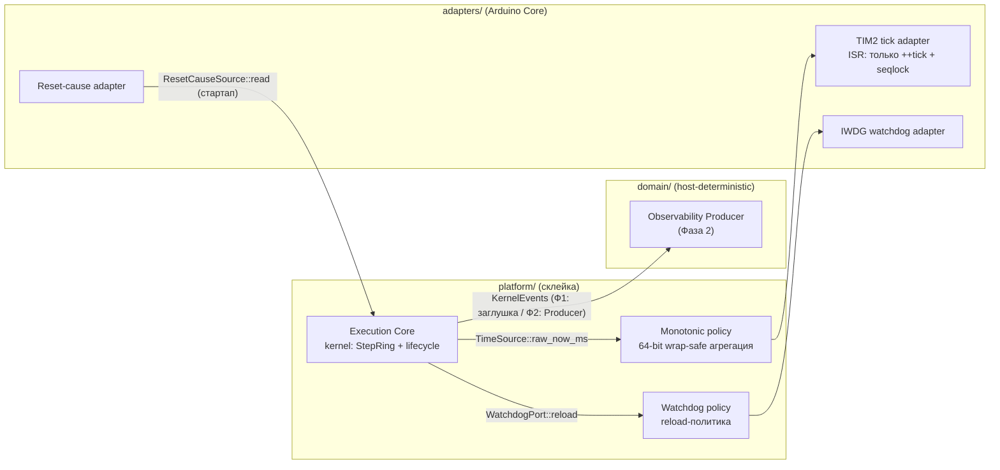
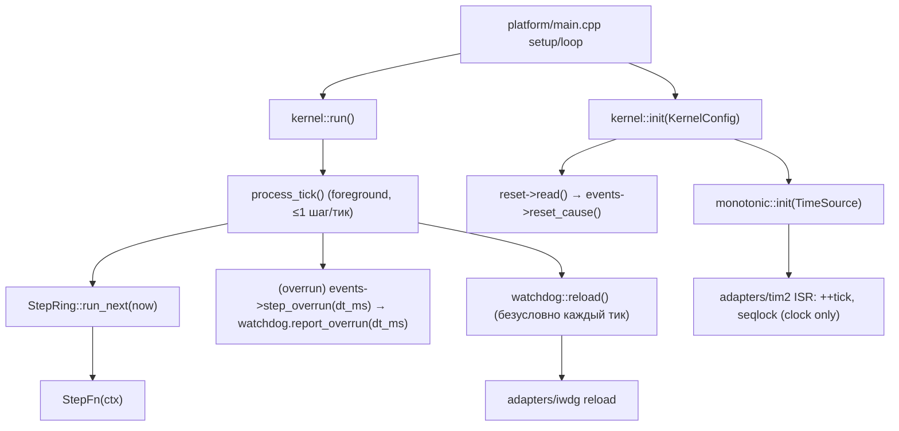
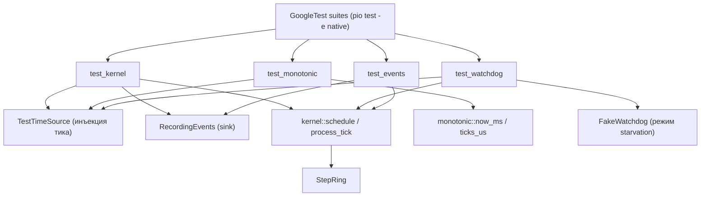

# Дизайн execution foundation V3 (execution core, monotonic, watchdog)

Статус: **design-артефакт для тикета [«Спроектировать execution foundation V3 (core, monotonic, watchdog) с shape of code и call graph»](https://github.com/Driadix/ShuttleControllerV3/issues/85)**. Вход в реализацию тикета [«Реализовать execution, monotonic time и watchdog foundation»](https://github.com/Driadix/ShuttleControllerV3/issues/70) (Фаза 1, один vertical PR).

Этот документ задаёт повторяемый shape of code для последующих вертикальных слайсов карты [«Реализовать и выпустить firmware-платформу контроллера V3»](https://github.com/Driadix/ShuttleControllerV3/issues/58): структура дизайн-артефакта (место в архитектуре → модели данных → трансформации → зависимости/контракты → shape of code → псевдокод → call stack → тесты с call graph) применяется к каждому следующему модулю.

Дизайн наследует утверждённые решения и **не пересматривает** их: #10 (cooperative scheduler с bounded steps), #54 (slice evidence, host-only), #43 (границы, single-writer, watchdog-формула), #45 (safety-модель, watchdog-инварианты), #48 (бюджеты C1-C6, T_step, watchdog-окно), #51 (coding profile R1-R8, dependency rules, структура domain/adapters/platform). Численные бюджеты — из `docs/quality-attributes-and-budgets-v3.md`; термины — канонические из `CONTEXT.md`.

Решения владельца (2026-08-13, гриллинг #85):

1. **Утилизация slice-кода - гибрид**: public API и инструментация переписываются в production-форме (без `namespace slice`, без observable-хуков в API ядра); проверенные структуры (StepRing, бюджетные проверки, read-twice/seqlock monotonic) эволюционируют как есть.
2. **Эмиссия событий ядра - порт `KernelEvents`**: core эмитит typed-события через узкий порт; в Фазе 1 - заглушка (diagnostic sink), в Фазе 2 - Observability Producer (#72). Core не владеет счётчиками (#43 §4).

**Ключевое архитектурное правило (production, наследует slice): ISR исполняет только продвижение часов.** TIM2 ISR инкрементирует 64-bit tick и публикует seqlock-снапшот CYCCNT; никакой kernel-работы, `run_due`, watchdog reload или policy в ISR нет (R2, #43 §3.2). Вся bounded-работа и reload происходят в foreground-loop. Публичный метод ядра называется `process_tick()`, а не `on_tick()` — чтобы исключить ложное прочтение «ISR-хук» (в slice-коде `kernel::on_tick()` исполнялся из `run()` в foreground, комментарий API был неточен; production-дизайн фиксирует границу явно).

---

## 1. Место в архитектуре



| Элемент | Компонент (#43 §2) | Владение | Примечание |
| --- | --- | --- | --- |
| Execution core | platform | scheduler, bounded steps, lifecycle, watchdog reload-политика, стартап | единственный владелец планирования (#43 §4 Watchdog: reload - обязанность execution core) |
| Monotonic | platform (политика) + adapters (TIM2) | 64-bit wrap-safe время; TIM2-инициализация и ISR - адаптер | «Monotonic clock - порт execution core (tick source)» (#43 §4); Arduino API только в адаптере (#51 §5) |
| Watchdog | platform (политика) + adapters (IWDG) | reload-политика у core, hardware у HAL | health-агрегация - Safety Authority (#43 §4) |
| KernelEvents | domain-порт (исходящий) | реализует Observability Producer (Ф2) / заглушка (Ф1) | счётчики ведёт Producer (#43 §4: «компоненты эмитят события, счётчики ведёт Producer») |

**Граница модуля (#70)**: execution core + monotonic + watchdog + их порты и стартап-порядок. НЕ входят: Safety Authority health-FSM (свой модуль #71), адаптеры CAN/I2C/UART/flash (свои слайсы), Observability Producer (#72). Execution core предоставляет только планирование/время/watchdog и события ядра.

**ISR-граница (инвариант дизайна)**: единственный ISR в scope #70 - TIM2 clock ISR (адаптер), и он исполняет ровно две операции: `++g_now_ms` и seqlock-публикацию CYCCNT. Всё остальное - foreground. События ядра (overrun/gap/rejected) эмитятся из foreground `process_tick()`; из ISR не эмитится ничего (порт KernelEvents вызывается только из foreground, без прерываний — single-writer, R2).

## 2. Модели данных

Все типы - fixed-width (`stdint`, R3), без динамической аллокации (R1), bounded (R4).

### 2.1 Step, ordering guarantee и результаты schedule

```cpp
// domain-независимый тип, живёт в platform/execution_core.h
using StepFn = void (*)(void* ctx);   // R1: без std::function

struct Step {
    StepFn fn = nullptr;
    void* ctx = nullptr;
    std::uint32_t deadline_ms = 0;    // absolute, от monotonic; окно [now, now + StepBudgetMs] (контракт ниже)
};

// Typed результат schedule: потеря информации недопустима (R5 - типизированные outcomes)
enum class ScheduleResult : std::uint8_t {
    Ok = 0,
    QueueFull = 1,        // очередь шагов полна (obs #7)
    DeadlineOutOfWindow = 2, // deadline вне [now, now + StepBudgetMs]
};

// Bounded ring (эволюция slice coop::StepRing - проверена host-тестами #54)
// Ordering guarantee (фиксируется здесь; slice-поведение, не новый дизайн):
//   1. FIFO: шаги выполняются строго в порядке schedule (времени вставки).
//   2. deadline_ms - метка «не раньше» (release time), НЕ приоритет и НЕ переупорядочивание.
//   3. Blocking head: пока head не due (now < head.deadline_ms), очередь ждёт -
//      шаги за ним НЕ выполняются. Дедлайн обязан быть в окне [now, now + StepBudgetMs],
//      поэтому блокировка головы ограничена T_step (10 ms / 10 тиков).
//   4. DeadlineOutOfWindow отклоняется на schedule: тихого успеха с невалидным дедлайном нет.
//
// Wrap-safe сравнение дедлайна (INV-MONOTONIC): поле uint32 хранит absolute-метку,
// сравнение модулярное: static_cast<int32_t>(now_u32 - deadline_ms) < 0 => not due.
// Та же модулярная арифметика в kernel::schedule: delta = int32(deadline_ms - now_u32),
// валидно окно [0, StepBudgetMs]; stale (delta < 0) → DeadlineOutOfWindow (R5: нет тихого успеха).
// Корректно, пока окно дедлайна ≤ 2^31 ms (у нас ≤ T_step); 64-bit поле не нужно (RAM-бюджет #10).
//
// Dispatch contract (production hardening, отличие от slice):
//   Slice выполнял ВСЕ due-шаги за один проход (до 64 × 10 ms = 640 ms) и reload
//   только после прохода - это нарушало «reload на каждой границе шага» и
//   T_check_jitter/T_arb ≤ 1 шаг. Production: ОДИН bounded step за тик (1 ms);
//   reload после каждого шага; возврат к time-check/arbitration после шага.
//   Очередь дренируется ≤ 1 шаг/тик: полные 64 шага за ≤ 64 ms (bounded, #48 §8 jitter ≤ 1 шаг;
//   combined load #8: сумма CPU-cost шагов тика ≤ T_step - выполняется тривиально).
class StepRing {
  public:
    struct StepRunResult {
        bool executed = false;
        std::uint32_t step_ms = 0;    // измеренная длительность шага (ms); 0, если не executed
    };

    // Выполняет не более одного due-шага. reload - обязанность вызывающего
    // (process_tick reload-ит сразу после каждого шага, INV-WATCHDOG-ARMED).
    // Эмиссию событий и report_overrun выполняет kernel (владелец портов), не ring:
    // ring - чистый контейнер без зависимостей от domain/ports.h (R6).
    StepRunResult run_next(std::uint64_t now);
    // deadline_ms - ABSOLUTE (хранится как есть; отличие от slice: slice хранил now+delta).
    // Окно [now, now + StepBudgetMs] валидирует kernel::schedule перед вызовом; ring - capacity.
    ScheduleResult schedule(StepFn fn, void* ctx, std::uint32_t deadline_ms);
    bool empty() const;
    std::uint32_t count() const;
  private:
    Step m_steps[MaxSteps];   // MaxSteps = 64 (#54 L7, #48 §4)
    std::uint32_t m_head = 0;
    std::uint32_t m_count = 0;
};
```

**Repeat/cancel policy (scope #70)**: повторный `schedule` того же `(fn, ctx)` создаёт отдельное вхождение очереди — вызывающий отвечает за дублирование; дедупликации нет. Отмена запланированного шага — **non-goal** #70 (шаги run-to-completion, планировщик без cancel); потребность в cancel из future-слайсов — отдельное решение, не молчаливое расширение этого контракта.

### 2.2 Monotonic время

```cpp
// platform/monotonic.h - политика (чистый C++), target-источник - adapters/tim2
namespace v3::monotonic {
    void init(TimeSource& src);           // подключает адаптер-источник
    std::uint64_t now_ms();               // wrap-safe, монотонно неубывающее (INV-MONOTONIC)
    std::uint64_t ticks_us();             // высокое разрешение (DWT CYCCNT, seqlock)
}
```

- Target: TIM2 (32-bit, 1 ms) ISR инкрементирует 64-bit счётчик; DWT CYCCNT расширяется до 64-bit через seqlock (эволюция slice `monotonic.cpp`: read-twice + seqlock + PRIMASK-critical read64 - все три фикса B1/M4 сохранены). ISR выполняет только это.
- Host: виртуальные инъекции `test_advance_ms` живут в **тестовой** реализации TimeSource, не в production API (гибридное решение).
- 64-bit чтения на 32-bit ядре: seqlock (не только read-twice - review B1: read-twice недостаточно).

### 2.3 Watchdog-политика

```cpp
// platform/watchdog_policy.h
namespace v3::watchdog {
    void init(WatchdogPort& hw);          // IWDG 10 s конфигурация (адаптер)
    void reload();                        // вызывается только execution core, только из foreground (INV-WATCHDOG-ARMED)
    void note_flash_window();             // между последовательными flash-операциями (#48 §3)
    void report_overrun(std::uint32_t step_ms);  // шаг > T_step: F5 starvation-моделирование
                                                 // (эволюция slice watchdog::report_overrun)
}
```

- Окно 10 s (V1 keep, #48 §3); бюджет reload на fast-конец LSI (6.8 s): `W_flash(4.013 s) + margin < 6.8 s`; два flash-окна подряд (≈ 8 s) > 6.8 s ⇒ обязательный reload между ними.
- reload на границе каждого bounded шага + в idle-loop, всегда из foreground (#43 §4, #48 §3). Из ISR reload не вызывается.

### 2.4 KernelEvents (порт, решение владельца)

```cpp
// domain/ports.h - исходящий порт ядра (foreground-only вызовы)
struct KernelEvents {
    virtual void step_overrun(std::uint32_t step_ms) = 0;   // шаг > T_step (obs #8)
    virtual void scheduler_gap(std::uint64_t gap_ms) = 0;   // вход process_tick отложен > 2×StepBudgetMs (20 ms); flash-окно НЕ через gap (§3.1)
    virtual void schedule_rejected() = 0;                   // очередь шагов полна (obs #7)
    virtual void reset_cause(ResetCause cause) = 0;         // стартап: crash-запись через reboot (#49 §13)
};
```

Фаза 1: заглушка (no-op / diagnostic UART sink). Фаза 2: реализация Observability Producer (#72) - счётчики, события, traces. Интерфейс стабилен между фазами. Контракт порта: вызовы только из foreground-контекста ядра, без вложенности (никаких вызовов из ISR), без блокировок (never-block, #43 §6).

## 3. Трансформации

### 3.1 Поток тика (главный цикл, foreground)

```
main loop (run, никогда не возвращается):
  last_processed = now()
  loop:
    # target: WFI; wake на любой ISR (TIM2 продвинул clock) и re-check
    wait until now() > last_processed
    last_processed = now()
    process_tick()

process_tick():                      # foreground-only; НЕ ISR; максимум один шаг за тик
  now = time->now_ms()
  gap = now - last_tick              # в терминах продвижения тика, см. ниже
  if gap > 2 * T_step: events->scheduler_gap(gap)   # вход отложен > 20 ms (2×T_step)
  last_tick = now
  if not ring.empty():
    r = ring.run_next(now)           # не более ОДНОГО due-шага (dispatch contract §2.1);
                                     # blocked head (не-due) - ничего не выполняется (≤ T_step)
    if r.executed and r.step_ms > T_step:
      events->step_overrun(r.step_ms)   # наблюдаемое нарушение бюджета (obs #8)
      watchdog.report_overrun(r.step_ms)  # F5-путь (эмиссия - у kernel, владельца портов, не у ring)
  watchdog.reload()                  # безусловно на каждом тике: покрывает границу шага,
                                     # idle и blocked head (INV-WATCHDOG-ARMED, #43 §4, #48 §3)

TIM2 ISR (adapters/tim2):                        # единственный ISR #70; R2
  ++g_now_ms                                     # 64-bit tick
  seqlock_publish(cycles64, prev_cyccnt)         # CYCCNT wrap-safe расширение
  # больше ничего: без policy, без run_due, без reload, без событий
```

Семантика `scheduler_gap`: нормальный вход `process_tick` - каждый тик (gap = 1 ms);
после полнобюджетного шага (≤ 10 ms) вход раздвигается до ~10-11 ms, поэтому порог
`> 2 * T_step` (20 ms) исключает ложные события на границе (полнобюджетный шаг - легален).
Flash-окно (W_flash ≈ 4 s) НЕ проявляется через `scheduler_gap`: при flash-stall
TIM2 ISR отложен, потерянные тики не продвигают `g_now_ms` (продвижение не монотонно
по wall-clock). Flash-влияние на исполняемый шаг детектится через `step_overrun(dt ≈ W_flash)`;
flash в idle-состоянии не наблюдаем без wall-clock источника (см. §10 Unknowns).

### 3.2 Bounded step (run_next, foreground, один шаг за тик)

```
run_next(now) -> StepRunResult:
  if count == 0: return {executed: false, step_ms: 0}
  step = head()
  if static_cast<int32_t>(now_u32 - step.deadline_ms) < 0:   # модулярное сравнение (wrap-safe, §2.1)
    return {executed: false, step_ms: 0}                     # blocking head: not due → очередь ждёт (≤ T_step, §2.1)
  t0 = ticks_us()
  step.fn(step.ctx)                              # run-to-completion, без вытеснения
  dt_ms = (ticks_us() - t0) / 1000               # µs → ms (slice-единицы, не повторять slice-bug сравнения µs с ms)
  advance head, count--
  return {executed: true, step_ms: dt_ms}

# kernel::process_tick - владелец портов, эмиссия здесь, не в ring (§2.1):
  r = ring.run_next(now)
  if r.executed and r.step_ms > T_step:
    events->step_overrun(r.step_ms)              # наблюдаемое нарушение бюджета (obs #8)
    watchdog.report_overrun(r.step_ms)           # F5-путь: starvation моделируется
```

Reload-семантика: `process_tick` reload-ит безусловно после каждого тика, поэтому каждый выполненный шаг завершается reload'ом на границе следующего шага/тика (INV-WATCHDOG-ARMED). При шаге длительностью до T_step = 10 ms окно 6.8 s не может быть пропущено: максимум 1 шаг/тик, reload каждые 1 ms.

### 3.3 Событийный поток (исходящий, foreground)

```
step overrun / scheduler gap / schedule reject / reset-cause
  → KernelEvents (порт, foreground)
    → Ф1: diagnostic sink (UART/GPIO/no-op)
    → Ф2: Observability Producer → queues → Transport (#72)
```

## 4. Зависимости и контракты

### 4.1 Dependency-матрица (внутрь, #43/#51)

| Модуль | Зависит от | НЕ зависит от |
| --- | --- | --- |
| `platform/execution_core.h/.cpp` | `platform/monotonic.h`, `platform/watchdog_policy.h`, `domain/ports.h` (KernelEvents, TimeSource) | Arduino Core, адаптеров |
| `platform/monotonic.h/.cpp` | `domain/ports.h` (TimeSource - интерфейс адаптера) | Arduino Core (policy-leg) |
| `platform/watchdog_policy.h/.cpp` | `domain/ports.h` (WatchdogPort) | Arduino Core |
| `adapters/tim2*` | Arduino Core (`HardwareTimer`), реализует `TimeSource` | domain |
| `adapters/iwdg*` | Arduino Core (`IWatchdog`), реализует `WatchdogPort` | domain |
| `adapters/reset_cause*` | HAL (RCC/backup), реализует источник `ResetCause` | domain |

Enforcement: include-lint (#51 §5.2) запрещает Arduino/RTOS-заголовки в `domain/` и `platform/` policy-leg; native-сборка домена без framework.

### 4.2 Порты (domain/ports.h, production-форма)

```cpp
// TimeSource - target-источник тика, реализует adapters/tim2
struct TimeSource {
    virtual void init_tick() = 0;             // TIM2 1 ms, DWT enable (adapter)
    virtual std::uint64_t raw_now_ms() = 0;   // 64-bit агрегированный tick (adapter ведёт 64-bit)
    virtual std::uint64_t raw_ticks_us() = 0; // CYCCNT-производная, wrap-safe
};

// WatchdogPort - hardware, реализует adapters/iwdg
struct WatchdogPort {
    virtual void init(std::uint32_t window_us) = 0;  // IWDG 10 s
    virtual void reload() = 0;
};

// ResetCause - hardware, реализует adapters/reset_cause
enum class ResetCause : std::uint8_t { PowerOn, Watchdog, Software, External, Unknown };
struct ResetCauseSource {
    virtual ResetCause read() = 0;            // вызывается execution core на стартапе (foreground)
};
```

### 4.3 Инварианты (наследуются, не пересматриваются)

| Инвариант | Источник | Проверка |
| --- | --- | --- |
| Каждый domain/adapter шаг ≤ T_step (10 ms) | #48 §4 | run_next бюджетная проверка + KernelEvents::step_overrun |
| MaxSteps = 64, очередь bounded | #54 L7 | ring capacity + schedule_rejected |
| Watchdog reload на границе шага и в idle | #43 §4, #48 §3 | host-тест F5 + L4 |
| IWDG армируется до любых flash-операций (Boot journal-scan) | #49 §8.2 | стартап-порядок §6 + review |
| reload между flash-операциями | #48 §3 | host-тест (два окна подряд) |
| Monotonic wrap-safe, NTP-immune | #48 §9, #43 §4 | host property-тесты (#54 #9) |
| Никакой динамической аллокации | #51 R1 | include-lint, clang-tidy, review |
| ISR исполняет только продвижение часов; policy - foreground | #43 §3.2, R2 | review-checklist + host-тест «ISR-эмиссии нет» |
| Стартап: Ready ≤ 5 s (INV-STARTUP-GATE) | #48 §9 | L4 (совместно со Safety Authority) |

## 5. Shape of code

### 5.1 Program layout

```
platform/
  execution_core.h        # public API kernel: init/run/process_tick/schedule + Step/StepFn/MaxSteps/StepBudgetMs
  execution_core.cpp      # lifecycle, process_tick, стартап (reset-cause → KernelEvents)
  coop_core.h             # StepRing (эволюция slice)
  monotonic.h/.cpp        # 64-bit политика, seqlock (эволюция slice monotonic.cpp)
  watchdog_policy.h/.cpp  # reload-политика (эволюция slice watchdog_policy.cpp)
  main.cpp                # Arduino setup/loop: wires adapters → kernel::init(KernelConfig)
domain/
  ports.h                 # + KernelEvents, TimeSource, WatchdogPort, ResetCause/ResetCauseSource
adapters/
  tim2_clock.*            # TimeSource (TIM2 1 ms + DWT CYCCNT); ISR: только clock
  iwdg_watchdog.*         # WatchdogPort (IWatchdog, 10 s)
  reset_cause.*           # ResetCauseSource (RCC/backup registers)
tests/
  test_kernel/            # bounded steps, порядок, overload, gap, ISR-граница
  test_monotonic/         # wrap, backward jump, seqlock
  test_watchdog/          # starvation F5, reload между flash-окнами
  test_events/            # recording KernelEvents sink
```

### 5.2 Public API (production-форма)

```cpp
namespace v3 {
namespace kernel {

struct KernelConfig {
    TimeSource*              time;      // domain/ports.h; обязателен (адаптер tim2)
    WatchdogPort*            hw;        // domain/ports.h; обязателен (адаптер iwdg)
    KernelEvents*            events;    // domain/ports.h; обязателен (Ф1: заглушка, Ф2: Producer)
    ResetCauseSource*        reset;     // domain/ports.h; обязателен (адаптер reset_cause)
};

void init(const KernelConfig& cfg);       // стартап (foreground): reset-cause → events->reset_cause; порядок #43 §5
void run();                               // никогда не возвращается (target); foreground-loop
void process_tick();                      // foreground-only: обработка одного тика (host-инъекция и target-цикл);
                                          // НЕ ISR-хук: из ISR не вызывается, policy в ISR запрещена (R2)

// Scheduling (foreground); typed outcome (R5)
ScheduleResult schedule(StepFn fn, void* ctx, std::uint32_t deadline_ms);  // QueueFull (obs #7) | DeadlineOutOfWindow | Ok

// Константы (bounded budgets, #48 §4, #54)
constexpr std::uint32_t MaxSteps = 64;
constexpr std::uint32_t StepBudgetMs = 10;

} // namespace kernel
} // namespace v3
```

Изменения против slice: `namespace slice::kernel` → `v3::kernel`; `kernel::on_tick()` переименован в `process_tick()` с явным контрактом «foreground-only, не ISR»; публичные observable-хуки (`max_step_duration_ms`, `idle_ticks`, `max_scheduler_gap_ms`) удалены из API - события идут через `KernelEvents`; `test_set_time_ms`/`test_advance_ms` убраны из production - инъекции через тестовую реализацию `TimeSource`; `register_force_stop_handler` удалён (cooperative - канал force-stop через воронку Safety Authority, #43 §4).

### 5.3 Типичный call stack (target, Serving)

```
TIM2_IRQHandler (ISR)                        # adapters/tim2: ++64-bit tick, seqlock publish
  └─ ровно это; никакой policy, run_next, reload, событий (R2, #43 §3.2)
loop() → kernel::run()
  └─ process_tick()
     ├─ ring.run_next(now)                   # максимум один due-шаг за тик (dispatch contract §2.1)
     │  └─ StepFn (domain step)
     │     ├─ Safety Authority tick (свой модуль #71)
     │     ├─ adapter drain (CAN/I2C/UART - свои слайсы)
     │     └─ monotonic::now_ms() (доменные таймауты)
     ├─ (если overrun) events->step_overrun(dt_ms); watchdog.report_overrun(dt_ms)  # эмиссия у kernel
     └─ watchdog.reload()                    # безусловно каждый тик (INV-WATCHDOG-ARMED)
```

Итог по R2: доменные шаги, планирование, watchdog-политика и эмиссия событий находятся строго в foreground; ISR (#70) только продвигает часы.

## 6. Light-визуализации (псевдокод)

```cpp
// schedule - bounded insert (R1: no allocation); foreground; typed outcome (R5)
// deadline_ms - АБСОЛЮТНАЯ метка monotonic (§2.1, release-time), НЕ delta:
// окно [now, now + StepBudgetMs]; модулярный forward-интервал (wrap-safe, INV-MONOTONIC)
ScheduleResult schedule(StepFn fn, void* ctx, uint32_t deadline_ms) {
    uint64_t now = time->now_ms();
    int32_t delta = static_cast<int32_t>(deadline_ms - static_cast<uint32_t>(now));
    if (delta < 0 || delta > static_cast<int32_t>(StepBudgetMs)) {
        return ScheduleResult::DeadlineOutOfWindow;   // stale (deadline в прошлом) или вне окна
    }
    if (ring.count() >= MaxSteps) { events->schedule_rejected(); return ScheduleResult::QueueFull; }
    return ring.schedule(fn, ctx, deadline_ms);       // ring хранит absolute deadline как есть
}

// process_tick - foreground-only, вызывается из run() (target) и тестами (host);
// максимум один bounded step за тик (dispatch contract §2.1)
void process_tick() {
    if (!initialized) return;
    uint64_t now = time->now_ms();
    uint64_t gap = now >= last_tick ? now - last_tick : 0;      // NTP-скок: clamp (INV-MONOTONIC)
    if (gap > 2 * StepBudgetMs) events->scheduler_gap(gap);     // вход отложен > 20 ms (2×T_step); полнобюджетный шаг (≤10 ms) - не событие
    last_tick = now;
    if (!ring.empty()) {
        StepRing::StepRunResult r = ring.run_next(now);         // один due-шаг; blocked head - не выполняется (≤ T_step)
        if (r.executed && r.step_ms > StepBudgetMs) {
            events->step_overrun(r.step_ms);                    // эмиссия у kernel (владельца портов), не у ring
            watchdog.report_overrun(r.step_ms);                 // F5-путь: starvation моделируется
        }
    }
    watchdog.reload();           // безусловно каждый тик: граница шага + idle + blocked head (INV-WATCHDOG-ARMED)
}

// init - стартап-порядок (#43 §5): адаптеры → Sensing grace → Ready (совместно с Safety Authority)
void init(const KernelConfig& cfg) {
    cfg.reset->read() → events->reset_cause(cause);              // crash-запись через reboot (#49 §13)
    monotonic::init(*cfg.time);
    watchdog::init(*cfg.hw);                                     // IWDG армируется до любых flash-операций (#49 §8.2)
    ring = {};
    last_tick = now_ms();
    initialized = true;
}

// target ISR (adapters/tim2) - единственный ISR scope #70; R2
void tim2_isr() {
    ++g_now_ms;
    seqlock_publish(cycles64, cyccnt);                           // и больше ничего
}
```

## 7. Тесты с call graph

### 7.1 Production call graph



### 7.2 Test call graph (host, deterministic)



### 7.3 Тест-кейсы (L2 host; L4 - target-лега #70 acceptance)

| # | Suite | Проверяемый контракт | Метод/oracle | Среда |
| --- | --- | --- | --- | --- |
| T1 | test_kernel | Каждый шаг ≤ T_step; overrun → KernelEvents::step_overrun | шаг, продвигающий TestTimeSource на > T_step внутри исполнения (host-шаги меряют ~0 µs - без продвижения overrun не сработает), assert events | host |
| T2 | test_kernel | FIFO-порядок + «не раньше»: шаги выполняются в порядке schedule; blocked head (deadline в будущем) останавливает очередь, последующие шаги не выполняются до due | шаги с разными deadline, инъекция времени, assert порядка и блокировки | host |
| T3 | test_kernel | Один шаг за тик: N due-шагов выполняются за N тиков (dispatch contract §2.1) | schedule N=5, 5× process_tick(), assert 1 шаг/тик | host |
| T4 | test_kernel | MaxSteps=64; 65-й schedule → QueueFull + schedule_rejected | заполнение ring, assert | host |
| T5 | test_kernel | DeadlineOutOfWindow: stale (deadline < now) и out-of-window (now + T_step + 1) отклоняются; граница now + T_step и wrap uint32 (now близко к 2^32) валидны | schedule(absolute deadline) с инъекцией now у границ, assert результат + очередь | host |
| T6 | test_kernel | Idle reload: пустая очередь → watchdog.reload вызван каждый тик | FakeWatchdog::reload_count | host |
| T7 | test_kernel | scheduler_gap при входе process_tick отложенном > 2×T_step (20 ms); полнобюджетный шаг (≤ T_step) НЕ даёт события | time jump на > 2×T_step и на ровно T_step, assert events | host |
| T8 | test_monotonic | wrap-safe: 64-bit перенос не ломает now_ms | инъекция больших значений | host |
| T9 | test_monotonic | Backward jump (NTP) → clamp, монотонность не нарушена (INV-MONOTONIC) | test_advance_ms(-X) | host |
| T10 | test_monotonic | seqlock: torn-чтение детектируется (B1-фикс) | конкурентная инъекция (host-симуляция ISR) | host |
| T11 | test_watchdog | F5: reload остановлен → starved в модели окна 6.8-18.8 s | FakeWatchdog, time advance | host |
| T12 | test_watchdog | reload между двумя flash-окнами подряд (W_flash 4 s × 2 > 6.8 s) | note_flash_window + reload-check | host |
| T13 | test_events | RecordingEvents фиксирует step_overrun/scheduler_gap/schedule_rejected/reset_cause | прямое эмитирование | host |
| T14 | test_kernel | Стартап: ResetCause прочитан → reset_cause-событие первым | FakeResetCause + init + assert order | host |
| T15 | test_kernel | ISR-граница: tim2 TU не вызывает kernel/watchdog/events (нет эмиссии и reload из ISR-пути) | include-lint (#51 §5.2) + nm-проверка символов tim2_clock.o (нет ссылок на kernel/watchdog) | host |
| T16 | target | Bounded steps под combined load на L4 (obs #8) | L4 сценарий (#52 §6.3, observed maxima) | L4 |

Свойства (RapidCheck, #52 property): для любого порядка schedule/deadline ≤ MaxSteps - инварианты bounded (count ≤ MaxSteps, шаги не теряются, переполнение наблюдаемо, ≤ 1 шаг за тик).

## 8. Vertical slice граница (#70)

Один vertical PR: production execution core + monotonic + watchdog + KernelEvents порт + заглушка. Наблюдаемый контракт: bounded steps и watchdog-политика на host (T1-T15 host) и L4 smoke (T16) - именно это закрывает gate 1→2 (#68: bounded steps под combined load). Observability Producer не реализуется (#72); диагностика - через KernelEvents-заглушку и reset-cause.

## 9. Трассировка obligations

| Obligation (#43 §8 / #48 §11) | Закрытие в #70 |
| --- | --- |
| #5 watchdog под combined load | T11, T12 host + L5 acceptance #4 (#70: watchdog не ресетит под combined load) |
| #8 bounded steps | T1-T3, T7, T15, T16 |
| #9 NTP-скачок не ломает monotonic | T9 |
| #10 RAM/stack/CPU margin | target build: link map, `.su`, high-water + L4 CPU-load (DWT CYCCNT занятость foreground за окно 1 s, test-прошивка; CPU ≤ 70% #48 §8) |
| #49 §13 reset-cause счётчики | KernelEvents::reset_cause + T14 |

## 10. Assumptions / Unknowns / Confidence

- **Fact**: slice StepRing/бюджетные проверки/seqlock проверены host-тестами (#54) - эволюционируют без переписывания (решение владельца).
- **Fact**: IWDG 10 s, аппаратный диапазон 6.8-18.8 s (LSI 47/17 kHz), reload между flash-операциями обязателен (#48 §3).
- **Fact**: slice `kernel::on_tick()` исполнялся из foreground `run()`; TIM2 ISR продвигал только часы. Production-дизайн закрепляет эту границу в имени API (`process_tick`) и контракте порта.
- **Assumption**: `v3::` - неймспейс production-кода (замена `slice::`); альтернатива (имя проекта) - механическая правка без impact на контракты.
- **Unknown**: точные длительности target-шагов и ISR-латентность - L4-измерения (#70 acceptance), не проектируются аналитически.
- **Unknown**: flash-окно в idle-состоянии не наблюдаем через KernelEvents (нет wall-clock источника; при flash-stall ISR отложен и продвижение `g_now_ms` не монотонно по wall-clock). Детект flash на исполняемом шаге - через `step_overrun`; idle-flash - кандидат для Observability (Ф2, #72) с отдельным источником времени, вне scope #70.
- **Unknown**: реализация KernelEvents-заглушки в Фазе 1 (UART vs no-op) - решается на имплементации #70, не влияет на контракт порта.

## 11. Условия пересмотра

- Измеренный шаг > T_step под combined load на L4 (T16) - пересмотр бюджетов/планирования (gate 1→2, #68).
- Очередь шагов исчерпывается в production-сценарии чаще, чем на slice-loads - пересмотр MaxSteps.
- Нарушение INV-WATCHDOG-ARMED на L4 - пересмотр reload-политики (impact #45/#48).
- Потребность в прерываемом critical path (hybrid, issue 10) на target-evidence - пересмотр execution architecture, не эволюция этого модуля.

## 12. Ссылки

- Тикет #85 (этот дизайн), #70 (реализация), #58 (карта), #54 (slice), #68 (gate 1→2).
- `docs/implementation-plan-v3.md` (Фаза 1, модульная карта §3), `docs/software-architecture-boundaries-v3.md` (#43), `docs/quality-attributes-and-budgets-v3.md` (#48), `docs/safety-model-v3.md` (#45), `docs/engineering-and-release-baseline-v3.md` (#51), `docs/verification-strategy-v3.md` (#52), `docs/observability-architecture-v3.md` (#49).
- Slice-код: `platform/execution_core.h`, `platform/coop_core.h`, `platform/monotonic.*`, `platform/watchdog_policy.*`, `domain/ports.h` (эволюция).
