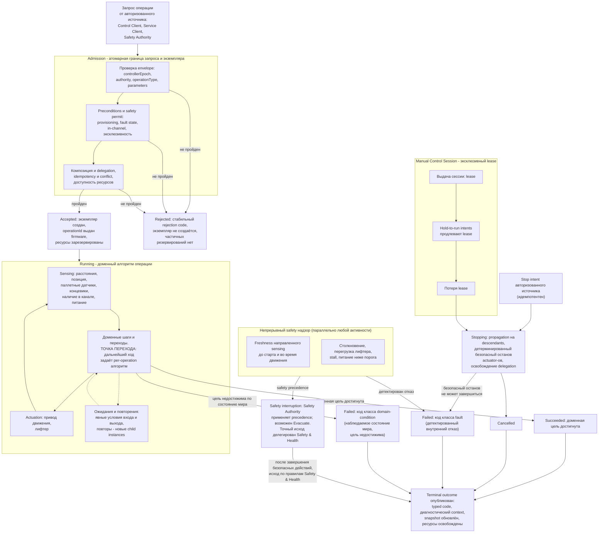

# Глобальная алгоритмическая документация работы шаттла V3

Статус: подготовлено по issue [«Подготовить глобальную алгоритмическую документацию работы шаттла V3»](https://github.com/Driadix/ShuttleControllerV3/issues/16) карты [«Спроектировать спецификацию и план прошивки контроллера V3»](https://github.com/Driadix/ShuttleControllerV3/issues/1). Окончательное утверждение ревизий выполняется на gate `G1 Behavioral Contract`.

Формат документа задан [«Формат алгоритмической документации операций V3»](./algorithmic-documentation-format-v3.md): 12-раздельный каркас применяется здесь на системном уровне, трёхслойное разделение содержание/evidence/структура соблюдено, narrative ведётся на русском языке без формул и чисел, идентификаторы - на английском.

## 1. Identity и назначение

Документ фиксирует сквозной высокоуровневый алгоритм работы шаттла V3 от принятия запроса операции до terminal outcome: общую последовательность admission, epoch и authority, resource ownership, operation composition, sensing и actuation, safety precedence, stop/fault handling, link-loss, telemetry и terminal outcomes. Документ не описывает реализацию, execution engine, wire format или внутренние подсистемы.

Доменная цель шаттла как системы - автономное выполнение канальных работ по запросу авторизованных источников: погрузка и выгрузка паллет, уплотнение и подсчёт паллет, перемещение на дистанцию и позиционирование лифтера, возврат к началу канала, калибровка, демонстрационный режим и эвакуация.

Каталог root operations: `MoveDistance`, `LiftTo`, `LoadPallet`, `UnloadPallet`, `LongLoad`, `LongUnload`, `LongUnloadQuantity`, `CompactPallets`, `CountPallets`, `Home`, `Calibrate`, `Demo`, `Evacuate`. Роли `root`/`child`, состав suboperations и primitives каждого типа задают per-operation документы (см. раздел 10).

Метаправило baseline: доменная логика production V1 сохраняется как behavioral baseline; execution shape меняется на неблокирующий, функциональный и алгоритмический результат переносится 1:1 с точкой расширения для будущих параметров и policy extensions. Disposition по умолчанию - preserve, пока отдельным решением владельца не утверждены change, exclude или unknown.

Отношение к другим документам пакета:

- общий lifecycle, identity, admission, idempotency, ownership и visibility задаёт [«Общий semantic contract операций V3»](./semantic-contract-v3.md); документ не повторяет его правила, а применяет их;
- таксономия ролей, Exclusive Control Activity, оси lifecycle и термины заданы [CONTEXT.md](../CONTEXT.md) и решением [«Определить system context и таксономию возможностей V3»](https://github.com/Driadix/ShuttleControllerV3/issues/2);
- правила прерываний, recovery и таксономия typed codes относятся к будущим `Safety & Health` и `External Semantic & Transport Contracts`; документ помечает точки делегирования и не выдумывает их правил;
- behavior каждой root operation описывают отдельные per-operation документы; данный документ задаёт общую рамку и точки перехода к ним.

## 2. Admission и условия входа

Запрос операции поступает от авторизованного источника: `Control Client`, `Service Client` или `Safety Authority` (внутренний источник firmware). Транспортные endpoints - радио, дисплей, сетевой bridge - не заменяют authority и предоставляют роли только в пределах выданных полномочий; запросы внутренних safety-источников используют текущий epoch, подставляемый firmware.

Запрос несёт обязательный envelope: `requestId` в пределах `(controllerEpoch, authorityId)`, точный `controllerEpoch`, выданный этим контроллером, `authority`, `operationType`, `parameters` и `parentOperationId` для child-запросов. Запрос с отсутствующим или отличающимся epoch отклоняется до создания экземпляра; после reboot старый epoch не принимается.

Admission является атомарной границей между запросом и экземпляром и последовательно проверяет: envelope, epoch, authority и права operation type; схему и значения `parameters`; preconditions и safety permit; допустимость parent/child композиции и delegation; idempotency/conflict semantics; доступность и эксклюзивность ресурсов; затем создаёт экземпляр и фиксирует начальный lifecycle `Accepted`. Отрицательный результат - `Rejected` со стабильным rejection code - не создаёт экземпляра и не оставляет частичных резервирований.

Системные preconditions, унаследованные от V1 как baseline:

- **Provisioning**: непривязанный шаттл допускает только stop/reset-класс действий; рабочие операции доступны после provisioning. Provisioning status является независимой осью lifecycle.
- **Fault state**: при активном fault проходят только override/service-действия (останов, сброс ошибки, сохранение конфигурации, диагностика); рабочие операции отклоняются до recovery.
- **In-channel**: рабочие канальные операции требуют физического наличия шаттла в канале по датчику; действия, не зависящие от канала (останов, сервис, lift-действия по baseline), исполняются вне канала.
- **Эксклюзивность**: в один момент активна одна Exclusive Control Activity - материальная/движительная операция, manual session или mutating maintenance operation; новый запрос при занятой активности отклоняется. Queries, subscriptions и read-only диагностика обслуживаются параллельно в пределах budgets; safety supervision приоритетна всегда.

`Rejected` описывается только здесь: в lifecycle принятого экземпляра он не появляется.

V1 различал admission по transport endpoint (дисплей и радио имели несимметричные правила). V3 устраняет это различие на semantic уровне: admission определяется authority-ролью и operation type contract, а различия каналов остаются в transport profiles (решение issue 2). Повторная проверка принятия после уже отправленного положительного ACK, существовавшая в V1, исключена: admission атомарен (решение issue 13).

## 3. Normal path

Сквозной нормальный поток от принятия запроса до `Succeeded`:

1. **Принятие.** Admission пройден; положительный ACK содержит `requestId`, `controllerEpoch`, `operationId`, `operationType`, `parentOperationId` (или null для root) и состояние `Accepted`. Экземпляр видим его authority.
2. **Resource ownership.** Root-операция получает эксклюзивное владение требуемым набором actuator-ресурсов (привод движения, лифтер) до положительного ACK. Suboperations получают только делегированный parent набор и не приобретают ресурсы за пределами delegation. Sensing предоставляется операции как сервис платформы: расстояния до концов канала и паллет, текущая позиция, паллетные датчики, концевики лифтера, наличие в канале, питание.
3. **Исполнение доменного алгоритма.** Экземпляр находится в `Running`: цикл sensing - доменный шаг - actuation с явными переходами. Доменные шаги, условия переходов и порядок действий задаёт алгоритм конкретного operation type. **Точка перехода:** здесь глобальный поток передаётся per-operation документу (раздел 10); далее глобальный уровень фиксирует только общую рамку: ожидания и повторения внутри `Running` (раздел 4), непрерывный safety надзор (раздел 5) и доступность stop.
4. **Sensing.** Непрерывно обслуживаются расстояния до концов канала и паллет, позиция и направление, детектирование досок паллеты, концевики лифтера, наличие в канале, состояние питания и ток лифтера. Свежесть направленного sensing проверяется до старта движения и во время движения.
5. **Actuation.** Привод движения исполняет разгон, держание скорости и торможение; лифтер исполняет подъём и опускание с контролем концевиков и тока. Индикация и звуковая сигнализация отражают состояние платформы и используются в service/fault-контекстах.
6. **Достижение доменной цели.** Когда доменная цель операции достигнута, экземпляр завершает алгоритм, освобождает ресурсы и делегирования, публикует `Succeeded` и обновляет snapshot. Инвариант: `Succeeded` ⇔ доменная цель достигнута; «пустых» `Succeeded` нет.
7. **Готовность.** Платформа возвращается в состояние готовности принимать новые запросы; завершение или повторение алгоритма не требует заранее известного общего числа экземпляров.

Для составных операций parent остаётся активным, пока его suboperations безопасно не завершены; outcome каждого child вносит вклад в outcome parent по правилам композиции operation type.

## 4. Ожидания и повторения

Все ожидания находятся внутри `Running` и имеют явные условия входа и выхода. Системные классы ожиданий:

- **Ожидание внешнего события канальной логистики** - например, освобождение места впереди при выгрузке или появление паллеты при long-погрузке: операция периодически проверяет условие sensing, выдерживает паузу между проверками и продолжает при наступлении условия. Условия и их V1-anchors фиксируют per-operation документы.
- **Ожидание физического завершения действия** - достижение позиции, завершение движения лифтера у концевика: ожидание ведётся по sensing-условию с таймаутным условием защиты.
- **Удержание manual intent** - Manual Control Session выдаётся lifecycle-действием (не операцией) как эксклюзивный lease; в сессии движение продолжается, пока свежие hold-to-run intents продлевают lease; прекращение удержания или истечение lease завершает движение контролируемым остановом.

Повторения являются condition-driven: long-операции повторяют циклы погрузки/выгрузки до условия остановки (заполнение канала, достижение заднего конца канала, stop, fault), подсчёт выполняет проходы до исчерпания обнаруживаемых паллет, демонстрационный режим повторяет цикл, пока не остановлен. Каждое повторение создаёт новые child instances; заранее известное число итераций не требуется и `MaxIterations` не вводится.

Warn-and-continue поведения описываются как waiting/normal с observable event: предупреждение (например, о нестандартном размере паллеты или о препятствии) не является отдельным исходом и не прерывает `Running`, если алгоритм операции продолжает достижение цели.

## 5. Прерывания и link-loss

Каждый path, завершающий операцию, классифицирован по правилам формата. Safety надзор активен параллельно любой активности, включая manual session.

### Stop

Stop является control intent над существующим `operationId`, а не новой операцией; повторный stop идемпотентен. Принятый stop переводит root в `Stopping` и распространяется на все активные descendants; parent остаётся `Stopping`, пока descendants безопасно завершены и делегированные ресурсы освобождены; child не продолжает доменный шаг после отзыва delegation. Детерминированный безопасный останов прекращает движение и actuation экземпляра, после чего экземпляр завершается `Cancelled`. Потеря lease Manual Control Session действует как stop для активности сессии: движение завершается детерминированным контролируемым остановом.

V1 baseline: останов принимается в любой момент и немедленно прекращает подачу скорости на привод; циклы операций наблюдают stop через проверку прерывания и завершаются. V3 сохраняет семантику и делает безопасный останов полным: останов охватывает все actuator-ы экземпляра (в V1 отдельные abort-пути лифтера не выдавали останов лифтера - факт зафиксирован в evidence, раздел 11). Если детерминированный безопасный останов не может завершиться, `Stopping` переходит в `Failed` по правилам semantic contract; причина классифицируется как fault.

### Fault

Fault - детектированный внутренний отказ: столкновение (bumper), отказ или stale sensing, timeout или перегрузка лифтера по току, stall привода, питание ниже порога, нарушение инварианта. Fault не выбирается алгоритмом, а детектируется надзором. Экземпляр завершается `Failed` с кодом класса `fault` и диагностическим context; платформа фиксирует fault и переходит в health-degraded состояние, в котором доступны только override/service-действия до recovery. Классификация конкретного события как fault, его код и recovery-правила уточняются `Safety & Health`; V1 baseline latched-fault semantics сохраняется: fault удерживается до явного recovery, а не снимается таймаутом.

### Domain-condition

Domain-condition - наблюдаемое состояние мира, делающее цель недостижимой: паллета не обнаружена, нет места, недопустимый размер. Экземпляр завершается `Failed` с кодом класса `domain-condition`; severity такого кода - warning level и назначается по коду, а не по классу outcome. Неисправность сенсора при положительных признаках отказа является fault-путём, а не domain-condition. Коды именуются по наблюдению. Конкретные domain-condition пути каждой операции фиксируют per-operation документы.

### Safety interruption

Точки safety-прерывания в глобальном потоке: permit-проверка перед стартом движения (freshness направленного sensing, отсутствие активного fault); надзор во время движения (потеря freshness, столкновение, питание ниже порога, перегрузка лифтера). При срабатывании Safety Authority применяет safety precedence к operation intents, прерывает текущую активность и при необходимости инициирует авторизованные safety operations - в том числе `Evacuate` как отдельный root instance с причиной запуска и trace context (не child прерванной операции). Точный исход прерванной операции делегирован `Safety & Health` и в этом документе не выдумывается.

### Link-loss

Поведение при потере инициатора задаётся per-operation link-loss policy: `continue`, `controlled_stop` или `fail_safe_completion`; политика является частью type contract. V1 baseline: автономные операции не зависят от наличия связи и продолжаются после её потери; ручное управление всегда прекращается по lease. Соответственно автономные операции сохраняют `continue` как baseline; Manual Control Session завершается контролируемым остановом при потере lease. Назначение политики каждой операции фиксируют per-operation документы; точные transport-условия потери ссылки - `External Semantic & Transport Contracts`.

## 6. Recovery и состояние после прерывания

Возобновление всегда явное - новый запрос или отдельная операция; generic pause/resume операциям не свойственен.

- **После `Cancelled` (stop, потеря lease):** шаттл остановлен, actuator-ы остановлены, ресурсы освобождены, snapshot отражает фактическое физическое состояние (позиция, паллеты, лифтер). Новая работа начинается новым запросом.
- **После `Failed` (fault):** fault удерживается; платформа допускает только override/service-действия. Recovery выполняется сервисной операцией сброса ошибки (`ClearFault`); baseline-условия снятия fault: квалифицированное восстановление sensing/шины и физическая неподвижность. Прерванная операция не возобновляется; после recovery создаётся новый запрос.
- **После `Failed` (domain-condition):** физическое состояние сохраняется (например, шаттл в канале с частично выполненной работой); snapshot несёт код и контекст; продолжение - явным новым запросом с учётом фактического состояния.
- **После safety interruption:** состояние и исход по правилам `Safety & Health`; при эвакуации шаттл достигает начала канала и безопасного останова, лифтер опущен.
- **После reboot:** выдаётся новый `controllerEpoch`; idempotency ledger через reboot не сохраняется; активные операции не переживают reboot; snapshot явно сообщает новый epoch, identity другого epoch не считается активной. Reset-причины и lifetime-статистика наблюдаются через диагностику.

## 7. Terminal outcomes и наблюдаемые результаты

Принятый экземпляр завершается одним из terminal states: `Succeeded`, `Cancelled`, `Failed`; `Rejected` относится к запросу. Lifecycle переходы: `Accepted -> Running -> Succeeded`, `Running -> Stopping -> Cancelled`, `Running -> Failed`, `Stopping -> Failed` (если безопасный останов не может завершиться). Terminal outcome не изменяется повторной доставкой запроса.

Outcome содержит стабильный typed code и минимальный диагностический context; полная таксономия кодов и назначение severity фиксируются `External Semantic & Transport Contracts` и `Observability & Diagnostics`. Инвариант `Succeeded ⇔ доменная цель достигнута` соблюдается для всех типов операций.

Внешняя видимость: authority получает положительный ACK при принятии и terminal outcome при завершении; query snapshot является authoritative read-моделью текущего состояния; events/subscriptions являются bounded delivery mechanism и не заменяют reconciliation через query после потери доставки. Child instance видим parent и может раскрываться внешнему клиенту как диагностическая часть root; child не является независимо управляемым root. Primitive не имеет внешней identity.

Наблюдаемые результаты платформы - telemetry, события переходов, логи и traces - публикуются в пределах budgets, задаваемых `Observability & Diagnostics`; V1-каденции публикации и состав пакетов зафиксированы в evidence как baseline для этих budgets.

## 8. Timing conditions

Унаследованные системные timing-условия V1. Количественные значения остаются в evidence; здесь условия именуются и получают класс, anchor и disposition.

| Условие | Класс | Anchor | Disposition |
| --- | --- | --- | --- |
| Idle-lease Manual Control Session | configured | bundle, раздел «Ручные непрерывные движения»; индекс, раздел «Timing, freshness и scheduling assumptions» | change: обобщён в lease-модель Manual Control Session (решение issue 2); baseline-значение сохранено |
| Hold-to-run watchdog радио manual-движения | configured | bundle, раздел «Ручные непрерывные движения» | change: обобщён в lease для всех hold-to-run intents; асимметрия дисплей/радио устранена (решение issue 2) |
| Freshness направленного sensing до старта и во время движения | configured | индекс, разделы «Faults, warnings и recovery», «Timing, freshness и scheduling assumptions»; bundle, раздел «Distance-обслуживание в loop() как источник distance[]» | preserve: safety gate движения |
| Endstop-защита лифтера | configured | bundle, раздел «2. LiftTo» | preserve: детализирует документ LiftTo |
| Детектирование stall привода | configured | bundle, раздел «Общие entry points и dispatch skeleton» (shared primitives) | preserve: основа fault-детектирования |
| Таймаут поиска паллеты/досок | configured | индекс, раздел «Timing, freshness и scheduling assumptions»; bundle, раздел «Группа: LongLoad / LongUnload / LongUnloadQuantity» | preserve с validation: риск невалидного конфигурационного деления зафиксирован в evidence, закрытие - в per-operation документах |
| Пауза ожидания доставки при выгрузке | configured | bundle, разделы «Группа: LoadPallet / UnloadPallet», «Группа: LongLoad / LongUnload / LongUnloadQuantity» | preserve; семантика ожидания - unknown U09, закрытие владельцем до gate unload-группы |
| Сброс незавершённого кадра транспорта | configured | индекс, раздел «Внешний I/O-контракт» | preserve на уровне transport profile; контракт - `External Semantic & Transport Contracts` |
| Каденции публикации telemetry/sensors/stats | configured | индекс, разделы «Timing, freshness и scheduling assumptions», «Telemetry, logging, metrics и update behavior» | preserve как baseline budgets `Observability & Diagnostics` |
| Интервалы round-robin sensing и quiet-guard общей шины | configured | bundle, раздел «Distance-обслуживание в loop() как источник distance[]» | preserve как baseline sensing-сервиса; количественные бюджеты - NFR |

Новых количественных значений документ не вводит. Unknowns без владельца не создаются: все перечисленные unknowns имеют владельца и стадию закрытия в evidence bundle.

## 9. Профильные варианты

Глобальный поток идентичен для профилей 800, 1000 и 1200: admission, lifecycle, ownership, надзор и исходы от профиля не зависят. Профиль является валидируемым набором механических параметров и инвариантов поддерживаемого варианта шаттла; профильные различия находятся внутри per-operation алгоритмов: останов перед паллетой, заезд под паллету, board-delay, recapture-дистанция и требования к парам паллетных датчиков. Состав различий фиксирует bundle, раздел «Профильные варианты 800/1000/1200 - сводка», и per-operation документы.

V1 принимал произвольную длину без проверки набора значений; фактическое распределение эксплуатируемых установок по профилям неизвестно (unknown U07, владелец - владелец и полевые данные). V3 вводит валидацию профиля как часть Configuration & Calibration; точка добавления будущих профилей является явной, неизвестные варианты сейчас не проектируются.

## 10. Composition boundaries и точки перехода

Состав операций на глобальном уровне:

- **Root operation instance** создаётся из принятого внешнего или внутреннего запроса и владеет полным эксклюзивным набором ресурсов. Каталог root-типов - раздел 1.
- **Suboperation** - экземпляр, которым владеет составная операция по разрешённому ребру статического type graph (конечен и ацикличен); получает делегированные ресурсы. `Move`, `Lift`, detection и pallet steps являются типами операций, способными быть root или child в зависимости от контекста экземпляра.
- **Primitive** - неделимое действие без собственной operation identity и lifecycle: шаги разгона и торможения привода, одиночные обслуживания sensing, выдача команд actuator-ам. Primitives не видны внешне.

**Точки перехода к per-operation алгоритмам:** шаг 3 normal path (раздел 3) разворачивается в один из 13 per-operation документов карты - по одному на каждый root operation type каталога. Глобальный документ задаёт рамку до и после этой точки: admission и ownership до неё, надзор, прерывания, recovery и публикацию outcome вокруг неё.

Ресурсное делегирование: child не приобретает ресурсы за пределами делегированного parent набора; после отзыва delegation child не продолжает доменный шаг. Повторяемые condition-driven действия создают новые child instances без заранее известного общего числа.

## 11. V1 dispositions и evidence

Системные поведения V1 и их disposition. Evidence: [Capability Evidence Slices каталога операций V3](https://github.com/Driadix/ShuttleControllerV3/blob/research/v3-capability-evidence-slices/docs/research/v3-capability-evidence-slices.md) (ветка `research/v3-capability-evidence-slices`) и [Системный индекс свидетельств production-кода V1](https://github.com/Driadix/ShuttleControllerV3/blob/research/v1-system-evidence/docs/research/v1-system-evidence-index.md) (ветка `research/v1-system-evidence`); канонический snapshot V1 - `Driadix/ShuttleController@708d090`.

| Поведение | Evidence | Disposition | Основание |
| --- | --- | --- | --- |
| Admission-скелет: supported-список, provisioning gate, fault-state gate, in-channel проверка с exempt-набором, эксклюзивность | bundle, «Общие entry points и dispatch skeleton»; индекс, «Жизненный цикл и глобальные состояния» | preserve в семантике; форма отказов меняется на typed rejection codes | semantic contract; решение issue 2 |
| Stop как внешний control intent, идемпотентный, принимаемый в любой момент | bundle, «Общие entry points и dispatch skeleton» | preserve | semantic contract, раздел «Cancellation и stop propagation» |
| Latched faults и error-состояние с доступом только override/service-действий | индекс, «Faults, warnings и recovery» | preserve в семантике; структурная переработка - `Safety & Health` | решение issue 2: health condition как независимая ось |
| Manual session: вход/выход, hold-to-run, idle-lease, радио-hold watchdog, асимметрия дисплей/радио | bundle, «Ручные непрерывные движения»; индекс, «Timing, freshness и scheduling assumptions» | change | Manual Control Session как эксклюзивный lease (решение issue 2, CONTEXT.md) |
| Low-battery inline-последовательность: опустить лифтер, вернуться к началу, установить fault и останов | индекс, «Faults, warnings и recovery»; «Shared state и пересекающиеся ответственности» | change (предложение до подтверждения gate Safety & Health) | алгоритм Evacuate в решении issue 9 совпадает с V1-последовательностью и исполняется Safety Authority как safety-triggered root operation с precedence; battery threshold и точные predicates - `Safety & Health` |
| Evacuate | bundle, «Evacuate (CMD_EVACUATE_ON = 0x28) - ОСОБЫЙ СЛУЧАЙ» | новая capability (не preserve) | решение issue 9; V1 enum-only, unknown U05 |
| `CMD_LOG_MODE` | индекс, «Внешне адресуемые операции» | exclude | решение issue 9: production-поведение отсутствует |
| Сервисные команды: reset, reset-error, save-config, get-config, firmware update | индекс, «Внешне адресуемые операции»; bundle | preserve intent | классифицированы как lifecycle/service-операции `RestartController`, `ClearFault`, `PersistConfiguration`, `UpdateFirmware` и queries (решение issue 9); контракты - отдельные items |
| Повторная проверка принятия после положительного ACK с возможным отбрасыванием команды | bundle, «Общие entry points и dispatch skeleton»; «Неблокирующие unknowns и assumptions» | change | атомарный admission без post-ACK re-check (решение issue 13) |
| Firmware update принимается только от дисплея и только в неподвижном состоянии | индекс, «Внешний I/O-контракт»; «Faults, warnings и recovery» | unknown (предложение): disposition установит item `Update & Recovery` | набор Update Authority и каналы обновления вне scope этого документа |
| Зафиксированные дефекты V1: неудержанная инверсия на abort-путях unload, отсутствие останова лифтера на abort-путях ramp, двойное представление command/lifecycle состояния, недостижимые ветки dispatch | bundle, «Сквозные замечания»; «Дельты относительно системного индекса (impact set)» | зафиксированы в evidence; disposition устанавливается per-operation документами и gates | дефекты не переносятся в V3 как нормативное поведение; нормативный безопасный останов охватывает все actuator-ы (semantic contract) |

Предложения disposition, не подтверждённые решениями владельца выше по таблице, остаются предложениями до G1.

## 12. Диаграмма

Обязательная Mermaid-блок-схема глобального потока. Источник diagram-as-code: [diagrams/src/global-operation-flow.mmd](../diagrams/src/global-operation-flow.mmd).

Narrative и диаграмма согласованы: каждое ветвление и ожидание narrative (admission-отказы, normal path, ожидания, stop/fault/domain-condition/safety interruption, lease-потеря, публикация outcome) присутствует на диаграмме, и каждая ветвь диаграммы описана в разделах 2-7. Link-loss не имеет отдельного узла диаграммы по построению: для manual-активности он выражен ветвью потери lease, для автономных операций делегирован per-operation link-loss policy (раздел 5).
