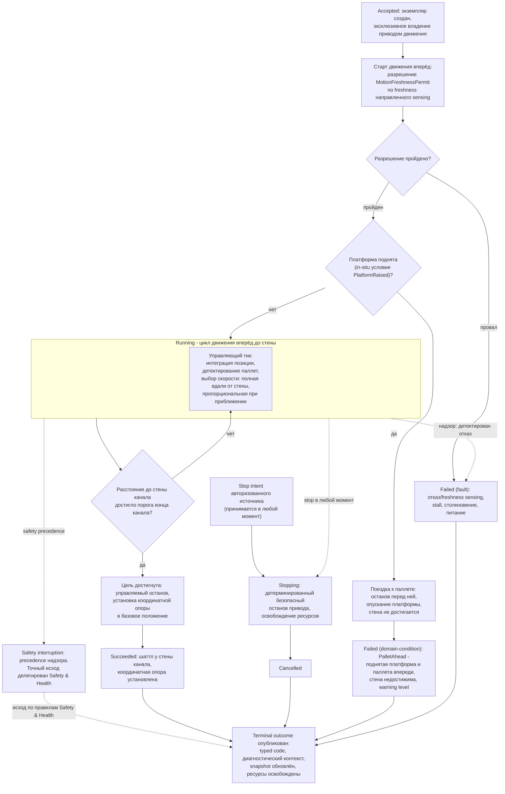

# Алгоритмическая документация операции Home (V3)

Статус: подготовлено по issue [«Алгоритмическая документация: Home»](https://github.com/Driadix/ShuttleControllerV3/issues/39) карты [«Спроектировать спецификацию и план прошивки контроллера V3»](https://github.com/Driadix/ShuttleControllerV3/issues/1). Окончательное утверждение ревизий выполняется на gate `G1 Behavioral Contract`.

Формат документа задан [«Формат алгоритмической документации операций V3»](./algorithmic-documentation-format-v3.md): 12-раздельный каркас, трёхслойное разделение содержание/evidence/структура, narrative на русском языке без формул и чисел, идентификаторы на английском. Общая рамка admission, ownership, надзора, прерываний и публикации outcomes задана [«Глобальной алгоритмической документацией работы шаттла V3»](./global-algorithmic-documentation-v3.md); lifecycle, identity, admission и idempotency заданы [«Общим semantic contract операций V3»](./semantic-contract-v3.md).

Evidence: [Capability Evidence Slices каталога операций V3](./research/v3-capability-evidence-slices.md), раздел «Home (CMD_HOME = 0x07)» группы «Home / Calibrate / Evacuate», разделы «Общие entry points и dispatch skeleton», «Парсер: MSG_CMD_SIMPLE vs MSG_CMD_WITH_ARG для CMD_HOME/CMD_CALIBRATE» и «Дополнительные зафиксированные аномалии/мёртвый код (по scope)»; канонический snapshot V1 - `Driadix/ShuttleController@708d090`. Далее ссылки вида «bundle, …» указывают на этот документ.

## 1. Identity и назначение

`Home` - root operation type каталога V3 (решение [«Определить каталог и базовые инварианты операций V3»](https://github.com/Driadix/ShuttleControllerV3/issues/9)). Допустимая роль экземпляра - root; child-роль контракт типа не предусматривает: составные операции каталога не используют возврат к началу канала как подшаг.

Доменная цель - вернуть шаттл в базовое положение у переднего конца канала: проехать вперёд до стены канала и установить координатную опору в базовое положение. V1 реализовывал тип одной командой `CMD_HOME` без параметров; отдельного homing-алгоритма, концевого выключателя или reference-сенсора нет - операция исполняется тем же примитивом движения, что и любая поездка вперёд (bundle, «Home» - Entry points и call sites).

Семантика «home» для клиента (какой конец канала является домом, что означает базовая координатная опора) в V1 не определена: это blocking unknown U03 с владельцем и стадией закрытия «gate контракта Home» (раздел 8). Настоящий документ фиксирует поведение V1 как механику движения; определение доменной семантики - решение владельца, документ его не выдумывает.

Отношение к другим документам: admission-скелет, stop propagation, fault semantics, link-loss рамка и публикация outcomes не повторяются здесь, а применяются по глобальному документу и semantic contract; документ фиксирует только доменный алгоритм `Home` и его тип-специфичные paths, условия и исходы.

## 2. Admission и условия входа

Запрос поступает от `Control Client` в пределах выданных полномочий; `Safety Authority` и `Service Client` этот тип не запрашивают (эвакуация исполняется отдельным root-типом `Evacuate`). Envelope, epoch fencing, idempotency и конфликтная семантика - по semantic contract.

Параметры: у типа параметров нет. V1 принимал команду в обоих форматах сообщения - простом и с аргументом - и молча игнорировал аргумент (bundle, «Парсер: MSG_CMD_SIMPLE vs MSG_CMD_WITH_ARG»); V3 сохраняет «без параметров» как контракт типа, транспортное кодирование и валидацию формата кадра фиксируют `External Semantic & Transport Contracts` (V1 не валидировал длину payload под тип сообщения - наблюдение зафиксировано, раздел 11).

Системные preconditions (по глобальному документу, раздел 2): provisioning gate, fault-state gate, наличие в канале (для `Home` внеканальное исполнение не разрешено: команда не входит в exempt-список действий, исполняемых вне канала), эксклюзивность. Приём допускается только в состоянии покоя шаттла: V1 принимал `CMD_HOME` только при остановленной платформе и отвергал как занятый, в том числе при активной ручной сессии (bundle, «Home» - Admission/preconditions; «Отличие CMD_HOME от CMD_MOVE_RIGHT_MAN»). В V3 это выражается эксклюзивностью Exclusive Control Activity и `ResourceConflict` semantic contract. Отрицательный результат - `Rejected` со стабильным rejection code, экземпляр не создаётся.

Условия, проверяемые только in-situ после принятия (дают runtime outcome, а не `Rejected`):

- разрешение старта движения по freshness направленного sensing (условие `MotionFreshnessPermit`; глобальный документ, раздел 8): провал - fault-путь (раздел 5);
- состояние платформы на старте движения: поднятая платформа переводит операцию на поездку к паллете впереди с остановом перед ней, опусканием платформы и завершением без достижения стены (условие `PlatformRaised`, разделы 3 и 5).

Повторная проверка принятия после уже отправленного положительного ACK (в V1 - повторный тройной опрос наличия в канале при старте из IDLE), существовавшая в V1, исключена: admission атомарен (решение [«Специфицировать общий semantic contract операций V3»](https://github.com/Driadix/ShuttleControllerV3/issues/13)).

## 3. Normal path

1. **Принятие.** Admission пройден, экземпляр в `Accepted`, положительный ACK выдан. Root получает эксклюзивное владение приводом движения; лифтерный привод в операции используется только на пути in-situ условия (шаг 3).
2. **Старт исполнения.** Экземпляр переходит в `Running`, telemetry-состояние отражает `Home`; выдаётся разрешение старта `MotionFreshnessPermit` по freshness направленного sensing для направления вперёд. Провал разрешения - fault-путь (раздел 5); привод при этом не стартует.
3. **Проверка состояния платформы.** Если платформа поднята (условие `PlatformRaised`), операция не едет к стене: выполняется поездка к паллете впереди, останов перед ней, опускание платформы (если не принят stop) и завершение движения без достижения стены - исход по разделу 5 (domain-condition `PalletAhead`).
4. **Движение.** Экземпляр в `Running`: цикл движения вперёд (раздел 4). На каждом управляющем тике позиция интегрируется по позиционному sensing, паллетные датчики обслуживаются, скорость выбирается по расстоянию до стены: полная скорость вдали от стены, ограниченная скорость при приближении (условие `HomeApproachSpeedProfile`).
5. **Стена достигнута.** Расстояние до стены канала достигло порога конца канала с учётом канального смещения (условие `HomeWallThreshold`) - выдаётся управляемый останов привода, координатная опора устанавливается в базовое положение (условие `HomeReferencePosition`). Если шаттл уже находится у стены на момент старта, условие выполняется на первом управляющем тике и операция завершается: цель уже достигнута.
6. **Завершение.** Экземпляр завершает алгоритм `Succeeded`: шаттл у стены канала, координатная опора установлена. Ресурсы освобождены, terminal outcome опубликован, snapshot обновлён. Платформа готова к новому запросу.

Инвариант соблюдается: `Succeeded` публикуется только при достижении стены канала и установке координатной опоры; останов до стены любым путём даёт соответствующий ненулевой исход. V1 сообщал успех и в случае поднятой платформы (шаг 3) - тихий успех при недостигнутой цели; изменение классификации зафиксировано в разделе 11.

## 4. Ожидания и повторения

Операция не содержит ожиданий внешних событий канальной логистики и condition-driven повторений: это одиночная поездка к стене канала.

Единственная длительная активность - цикл движения вперёд внутри `Running` с явными условиями:

- вход: разрешение старта `MotionFreshnessPermit` пройдено, условие `PlatformRaised` не активировало путь `PalletAhead`, привод запущен;
- выход: расстояние до стены достигло порога конца канала (normal), принят stop, детектирован отказ либо сработал надзор.

Общего deadline у операции нет: длительность цикла ограничена только надзорными путями (freshness направленного sensing, детектирование stall привода, столкновение, питание ниже порога); необходимость общего watchdog операции - change-предложение (разделы 5, 8 и 11).

Warn-and-continue поведения отсутствуют: все наблюдаемые условия операции либо продолжаются в normal path, либо завершают экземпляр классифицированным исходом. Выхода по препятствию внутри цикла нет: детектирование паллет обслуживается, но не прерывает движение; защита от столкновения обеспечивается надзором (раздел 5).

## 5. Прерывания

Рамка stop/fault/safety precedence - глобальный документ, раздел 5; здесь зафиксированы тип-специфичные paths.

### Stop

Stop принимается в любой момент после принятия экземпляра и переводит его в `Stopping`: детерминированный безопасный останов привода движения, освобождение ресурсов, исход `Cancelled`. V1 останавливал мотор немедленно при приёме stop в исполнительном цикле и завершал поездку через проверку прерывания; повторная проверка прерывания внутри цикла не выдавала повторного останова, полагаясь на уже выполненный останов (bundle, «Дополнительные зафиксированные аномалии/мёртвый код (по scope)» п. 4). V3 сохраняет семантику гарантированного останова: нормативный безопасный останов охватывает все пути завершения (глобальный документ, разделы 5 и 11). Позиция на момент останова сохраняется в snapshot; координатная опора не устанавливается - шаттл остаётся в промежуточном положении.

### Fault

Fault - детектированный внутренний отказ; экземпляр завершается `Failed` с кодом класса `fault` и диагностическим контекстом. Тип-специфичные детектируемые условия:

- провал разрешения `MotionFreshnessPermit` на старте: отказ или отсутствие свежих измерений направленного sensing переднего направления latch-ится как fault, движение не начинается;
- потеря freshness направленного sensing во время движения: принудительный останов привода по active motion safety (fault по правилам надзора);
- детектирование stall привода: отсутствие изменения позиции при commanded движении в течение отведённого окна (shared primitive);
- столкновение (bumper), питание ниже порога - сквозные paths надзора (глобальный документ, раздел 5).

В отличие от дистанционных операций, у `Home` нет no-progress watchdog самого цикла: окно отсутствия прогресса внутри поездки не проверяется (раздел 11); отсутствие прогресса детектируется только через stall-детектирование shared primitive. Классификация конкретного события как fault, его код и recovery-правила уточняются `Safety & Health`.

### Domain-condition

`PalletAhead` - поднятая платформа и паллета впереди: стена канала недостижима. Наблюдаемое условие: при поднятой платформе операция выполняет поездку к паллете, останавливается перед ней, опускает платформу и завершается, не достигнув стены. V1 сообщал об этом как об успехе; по инварианту `Succeeded ⇔ доменная цель достигнута` стена не достигнута, поэтому исход классифицируется как `Failed` класса `domain-condition` с severity warning level по коду. Классификация является change-предложением: семантика завершения при поднятой платформе с точки зрения клиента - часть blocking unknown U03, решение владельца - на gate контракта Home; если решением владельца доменная цель будет определена как «безопасный возврат с опущенной платформой», этот путь может стать нормальным завершением (разделы 8 и 11).

Неисправность сенсора при положительных признаках отказа является fault-путём, а не domain-condition.

### Safety interruption

Точки safety-прерывания операции: permit-проверка freshness направленного sensing перед стартом движения; надзор во время движения (потеря freshness, столкновение, stall, питание). Граница с fault-путями - по глобальному документу: детектированный надзором отказ завершает экземпляр fault-исходом (выше); safety interruption наступает, когда Safety Authority применяет precedence к operation intents. Точный исход прерванного экземпляра делегирован `Safety & Health` и здесь не выдумывается.

### Link-loss

`Home` - автономная операция; назначенная link-loss policy - `continue`: после потери инициатора экземпляр продолжает исполнение до собственного terminal outcome (V1 baseline: автономное исполнение не зависит от наличия связи; глобальный документ, раздел 5).

## 6. Recovery и состояние после прерывания

Возобновление всегда явное - новый запрос; generic pause/resume операции не свойственен.

- **После `Cancelled` (stop):** шаттл остановлен в промежуточной позиции, привод остановлен, ресурсы освобождены; координатная опора не устанавливалась, позиция отражает фактическое интегрированное положение; snapshot несёт его. Продолжение - новым запросом с учётом фактической позиции.
- **После `Failed` (fault):** fault удерживается (latched semantics); платформа допускает только override/service-действия; recovery через `ClearFault` с baseline-условиями снятия (квалифицированное восстановление sensing/шины и физическая неподвижность) по глобальному документу. Прерванная операция не возобновляется.
- **После `Failed` (domain-condition `PalletAhead`):** физическое состояние сохраняется: шаттл перед паллетой, платформа опущена; snapshot несёт код и диагностический контекст. Продолжение - явным новым запросом (повтор `Home` либо иная канальная операция) с учётом фактического состояния.
- **После safety interruption:** состояние и исход по правилам `Safety & Health`.

## 7. Terminal outcomes и наблюдаемые результаты

Принятый экземпляр завершается одним из terminal states; `Rejected` относится только к запросу.

| Исход | Класс | Наблюдаемое условие |
| --- | --- | --- |
| `Succeeded` | - | шаттл у стены канала, координатная опора установлена в базовое положение |
| `Cancelled` | stop | принят stop, детерминированный безопасный останов привода завершён; опора не установлена |
| `Failed` | `fault` | провал разрешения freshness направленного sensing на старте; потеря freshness в движении; stall; столкновение; питание ниже порога |
| `Failed` | `domain-condition` | `PalletAhead`: поднятая платформа и паллета впереди; останов перед паллетой, платформа опущена, стена не достигнута; warning level |

Outcome содержит стабильный typed code и минимальный диагностический контекст: направление (вперёд), расстояние до стены и позиция на момент исхода, состояние платформы, свидетельства sensing. Таксономия typed codes и назначение severity фиксируются `External Semantic & Transport Contracts` и `Observability & Diagnostics`; имена условий выше - observation-based имена, принятые этим документом.

Внешняя видимость - по semantic contract: положительный ACK при принятии, terminal outcome при завершении, query snapshot как authoritative read-модель. Observable events: принятие (один положительный ACK, отдельных ACK начала и конца нет - только display-telemetry по V1 baseline), старт движения, достижение стены, terminal outcome. V1-каденции телеметрии и mapping состояния `STATE_HOME` зафиксированы в evidence как baseline budgets `Observability & Diagnostics`.

## 8. Timing conditions

Унаследованные timing-условия V1 для `Home`. Количественные значения остаются в evidence; новые количественные значения документ не вводит.

| Условие | Класс | Anchor | Disposition |
| --- | --- | --- | --- |
| `HomeControlTickPeriod` - период управляющего тика цикла движения (позиция, паллетные датчики, выбор скорости) | configured | Cntrl_V2/Cntrl_V2.ino:L5224 (bundle, «Home» - Timing conditions) | preserve |
| `HomeFullSpeedDistance` - расстояние до стены, на котором держится полная скорость | configured | Cntrl_V2/Cntrl_V2.ino:L5230-L5233 (bundle, «Home» - Шаги и переходы) | preserve |
| `HomeApproachSpeedProfile` - пропорциональный профиль скорости при приближении к стене с ограничениями | configured | Cntrl_V2/Cntrl_V2.ino:L5234-L5242 (bundle, «Home» - Шаги и переходы) | preserve как tuning-политику; значения пересматриваются с NFR/HIL |
| `HomeWallThreshold` - порог конца канала с учётом канального смещения | configured | Cntrl_V2/Cntrl_V2.ino:L5246 (bundle, «Home» - Timing conditions) | preserve |
| `HomeReferencePosition` - константа базовой координатной опоры, устанавливаемая у стены | configured | Cntrl_V2/Cntrl_V2.ino:L5254 (bundle, «Home» - Timing conditions) | change (предложение): обоснованный референс либо исключение - решение владельца на gate контракта Home |
| `HomeNoDeadline` - отсутствие общего deadline операции; цикл движения без временной границы | inferred | Cntrl_V2/Cntrl_V2.ino:L5213 (bundle, «Home» - Timing conditions: цикл движения без общего deadline) | change (предложение): оценить общий watchdog операции - решение владельца на gate контракта Home |

Unknowns:

- **U03** (семантика Home: какой конец канала является «домом» для клиента; смысл принудительной базовой координатной опоры; нужна ли V3 отдельная homing-семантика - в V1 это простая поездка вперёд до стены без reference-сенсора): blocking unknown, класс влияния - external semantics, владелец - владелец, стадия закрытия - gate контракта Home, условие пересмотра - появление reference-сенсора на PCB. Настоящий документ фиксирует механику движения V1 и не выдумывает доменную семантику; до закрытия U03 доменная цель определена в терминах наблюдаемой механики (раздел 1).
- **U07** (фактические runtime-значения конфигурации на эксплуатируемых устройствах, включая канальное смещение и распределение профилей): владелец - владелец и полевые данные, стадия закрытия - до декомпозиции профильных требований (раздел 9).
- Формат кадра с неверной длиной payload под тип сообщения в V1 не валидировался; последствия для разбора не устанавливаются (наблюдение по source, неблокирующий unknown, раздел 11). Владелец - владелец; закрытие - контракт транспорта `External Semantic & Transport Contracts`.

## 9. Профильные варианты

Профильные различия к операции не применимы («не применимо»): алгоритм `Home` идентичен для профилей 800, 1000 и 1200, профильных ветвлений в операции нет (bundle, «Home» - Профильные варианты: различий нет; ветвлений по длине шаттла в примитиве движения, ветке `CMD_HOME` и на пути приёма нет; «Профильные варианты 800/1000/1200 - сводка»: движение/лифтер/калибровка/home профильных ветвлений не имеют). Канальное смещение входит как конфигурационный параметр порога стены (раздел 8). Валидация профиля как набора механических параметров - `Configuration & Calibration` (unknown U07, владелец - владелец и полевые данные).

## 10. Composition boundaries

По V1 baseline операция несоставная: suboperations отсутствуют, доменный алгоритм исполняется одним экземпляром.

- **Primitives** (не имеют собственной operation identity и lifecycle): шаг старта привода и выдачи скорости (включая ramp), шаг управляемого останова привода, тик интеграции позиции, обслуживание детектирования паллет, обслуживания sensing. Поездка вперёд исполняется общим примитивом движения, разделяемым с другими операциями каталога и ручными hold-движениями V1 (bundle, «Home» - Entry points и call sites); в V3 это общий primitive, а не suboperation.
- **Ресурсы:** root владеет приводом движения эксклюзивно до завершения. Лифтерный привод используется только на пути `PalletAhead` (опускание платформы) и задействуется как primitive шага опускания; на остальных путях лифтер не используется. Делегирование не применяется - child-экземпляров нет.
- Выражение фазы движения через operation type `Move` как suboperation является решением будущего type graph и настоящим документом не предписывается.

## 11. V1 dispositions и evidence

Evidence anchors - bundle, разделы «Home (CMD_HOME = 0x07)», «Общие entry points и dispatch skeleton», «Парсер: MSG_CMD_SIMPLE vs MSG_CMD_WITH_ARG для CMD_HOME/CMD_CALIBRATE», «Дополнительные зафиксированные аномалии/мёртвый код (по scope)»; канонический snapshot V1 `Driadix/ShuttleController@708d090`. Предложения без решения владельца помечены «предложение change - решение владельца на gate контракта Home» и решениями не являются.

| Поведение V1 | Evidence | Disposition | Основание |
| --- | --- | --- | --- |
| `CMD_HOME` исполняется как простая поездка вперёд до стены общим примитивом движения; отдельного homing-алгоритма и reference-сенсора нет | Cntrl_V2/Cntrl_V2.ino:L3391-L3395 (bundle, «Home» - Entry points и call sites); Cntrl_V2/Cntrl_V2.ino:L5197-L5265 (bundle, «Home» - Шаги и переходы) | preserve механики движения; семантика «home» (какой конец канала, какой референс) - blocking unknown U03 | метаправило baseline (формат, issue [«Зафиксировать формат и acceptance criteria алгоритмической документации V3»](https://github.com/Driadix/ShuttleControllerV3/issues/15)); U03 (unknowns.md) |
| Принудительная установка координатной опоры в константу при достижении стены | Cntrl_V2/Cntrl_V2.ino:L5254 (bundle, «Home» - Шаги и переходы; Timing conditions) | change (предложение): обоснованный референс либо исключение - решение владельца на gate контракта Home | U03; «предложение change - решение владельца на gate контракта Home» |
| Поднятая платформа: поездка к паллете, останов перед ней, опускание платформы и завершение без стены; V1 сообщает успех | Cntrl_V2/Cntrl_V2.ino:L5202-L5208 (bundle, «Home» - Шаги и переходы; Unknowns) | change (предложение): path `PalletAhead` класса domain-condition вместо тихого успеха - решение владельца на gate контракта Home | инвариант `Succeeded ⇔ цель достигнута` (формат, issue 15); семантика lifterUp-завершения - часть U03 |
| Команда без параметров; пакет с аргументом принимается с игнорированием аргумента | Cntrl_V2/ShuttleProtocol.h:L61-L62; Cntrl_V2/Cntrl_V2.ino:L2779-L2780, L2857-L2864 (bundle, «Парсер: MSG_CMD_SIMPLE vs MSG_CMD_WITH_ARG») | preserve: тип без параметров | baseline; трёхслойное разделение формата |
| Admission-скелет: supported-список, provisioning gate, fault-state gate, in-channel проверка без exempt, приём только из состояния покоя, ACK-коды | Cntrl_V2/Cntrl_V2.ino:L8351-L8384 (кейс L8361), L2819-L2828, L2832-L2841, L2843-L2853, L8425-L8428, L8430-L8462 (bundle, «Home» - Admission/preconditions) | preserve в семантике; форма - typed rejection codes и `ResourceConflict` | semantic contract (issue [«Специфицировать общий semantic contract операций V3»](https://github.com/Driadix/ShuttleControllerV3/issues/13)); решение issue [«Определить system context и таксономию возможностей V3»](https://github.com/Driadix/ShuttleControllerV3/issues/2) |
| Повторная проверка in-channel при старте из IDLE после положительного ACK (тройное чтение с паузами) | Cntrl_V2/Cntrl_V2.ino:L1829-L1833, L1835-L1841 (bundle, «Home» - Admission/preconditions п. 6) | change: атомарный admission без post-ACK re-check | решение issue 13 |
| Скоростной профиль: полная скорость вдали от стены, пропорциональная с ограничениями при приближении, управляемый останов у стены | Cntrl_V2/Cntrl_V2.ino:L5230-L5233, L5246-L5257 (bundle, «Home» - Шаги и переходы) | preserve как tuning-политику; значения остаются в evidence | трёхслойное разделение формата (issue 15) |
| Отсутствие общего deadline операции: цикл движения без временной границы | Cntrl_V2/Cntrl_V2.ino:L5213 (bundle, «Home» - Timing conditions) | change (предложение): оценить общий watchdog операции - решение владельца на gate контракта Home | «предложение change - решение владельца на gate контракта Home» |
| ToF freshness gate на старте движения вперёд и принудительный останов при потере freshness в движении | Cntrl_V2/Cntrl_V2.ino:L5200, L2239-L2247, L3536-L3553 (bundle, «Home» - Entry points и call sites; «3. Примитивы движения»); «5. Distance-обслуживание в loop() как источник distance[]» | preserve | глобальный документ, разделы 5 и 8 |
| Выхода по препятствию внутри цикла нет: детектирование паллет не прерывает движение; защита - надзор (ToF force-stop, bumper) | Cntrl_V2/Cntrl_V2.ino:L5213, L5246-L5257 (bundle, «Home» - Шаги и переходы: цикл движения и его выходы) | preserve: защита от столкновения - надзорные пути | глобальный документ, раздел 5 |
| Вторая проверка прерывания в цикле не выдаёт повторный останов, полагаясь на останов в исполнительном цикле или в ERROR-режиме | Cntrl_V2/Cntrl_V2.ino:L5259-L5260 (bundle, «Дополнительные зафиксированные аномалии/мёртвый код (по scope)» п. 4) | preserve семантику гарантированного останова; форма - нормативный безопасный останов `Stopping` | глобальный документ, разделы 5 и 11 |
| `Home` недостижим в ручной сессии (отвергается как занятый); общая физика с ручными hold-движениями, различия в телеметрии и admission | Cntrl_V2/Cntrl_V2.ino:L3391-L3395, L8425-L8428 (bundle, «Home» - Отличие CMD_HOME от CMD_MOVE_RIGHT_MAN) | preserve: `Home` - автономная операция; ручные hold-движения - lease `Manual Control Session` вне контракта типа | решение issue 2; каталог (issue [«Определить каталог и базовые инварианты операций V3»](https://github.com/Driadix/ShuttleControllerV3/issues/9)) |
| Telemetry mapping `STATE_HOME` при приёмке; telemetry только на display | Cntrl_V2/Cntrl_V2.ino:L8258-L8259 (bundle, «Home» - Observable outcomes); Cntrl_V2/ShuttleProtocol.h:L164 | preserve как baseline budgets `Observability & Diagnostics` | глобальный документ, раздел 7 |
| Парсер не валидирует длину payload под тип сообщения; кадр с неверной длиной достигает разбора | Cntrl_V2/ShuttleProtocol.h:L553-L557; Cntrl_V2/Cntrl_V2.ino:L2779-L2780 (bundle, «Парсер: MSG_CMD_SIMPLE vs MSG_CMD_WITH_ARG») | unknown (неблокирующий): валидация формата кадра - `External Semantic & Transport Contracts`; владелец - владелец | правило unknowns (issue [«Правила работы с evidence и unknowns»](https://github.com/Driadix/ShuttleControllerV3/issues/6)) |

## 12. Диаграмма

Обязательная Mermaid-блок-схема алгоритма `Home`. Источник diagram-as-code: [diagrams/src/home-flow.mmd](../diagrams/src/home-flow.mmd).

Narrative и диаграмма согласованы: каждое ветвление и ожидание narrative (разрешение freshness на старте, in-situ условие поднятой платформы с поездкой к паллете и опусканием платформы, цикл движения вперёд, достижение порога стены с установкой координатной опоры, stop, fault по детектированному надзором отказу, safety precedence, публикация outcome) присутствует на диаграмме, и каждая ветвь диаграммы описана в разделах 2-7.

## Ревью

- Ревьюер: независимая сессия (субагент), сверка по первоисточнику V1 и evidence bundle
- Вердикт: APPROVED
- Дата: 2026-08-06
- Результат: readiness checklist 10/10, blocking findings отсутствуют
