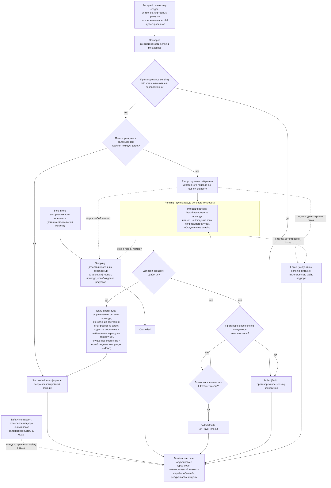

# Алгоритмическая документация операции LiftTo (V3)

Статус: подготовлено по issue [«Алгоритмическая документация: LiftTo»](https://github.com/Driadix/ShuttleControllerV3/issues/31) карты [«Спроектировать спецификацию и план прошивки контроллера V3»](https://github.com/Driadix/ShuttleControllerV3/issues/1). Окончательное утверждение ревизий выполняется на gate `G1 Behavioral Contract`.

Формат документа задан [«Формат алгоритмической документации операций V3»](./algorithmic-documentation-format-v3.md): 12-раздельный каркас, трёхслойное разделение содержание/evidence/структура, narrative на русском языке без формул и чисел, идентификаторы на английском. Общая рамка admission, ownership, надзора, прерываний и публикации outcomes задана [«Глобальной алгоритмической документацией работы шаттла V3»](./global-algorithmic-documentation-v3.md); lifecycle, identity, admission и idempotency заданы [«Общим semantic contract операций V3»](./semantic-contract-v3.md).

Evidence: [Capability Evidence Slices каталога операций V3](https://github.com/Driadix/ShuttleControllerV3/blob/research/v3-capability-evidence-slices/docs/research/v3-capability-evidence-slices.md) (ветка `research/v3-capability-evidence-slices`), раздел «2. LiftTo (CMD_LIFT_UP = 0x14, CMD_LIFT_DOWN = 0x15)» группы «MoveDistance + LiftTo и motion/lifter примитивы», разделы «Общие entry points и dispatch skeleton» и «Сквозные замечания»; канонический snapshot V1 - `Driadix/ShuttleController@708d090`. Далее ссылки вида «bundle, …» указывают на этот документ.

## 1. Identity и назначение

`LiftTo` - operation type каталога V3 (решение [«Определить каталог и базовые инварианты операций V3»](https://github.com/Driadix/ShuttleControllerV3/issues/9)). Допустимые роли экземпляра - root и child (suboperation); роль определяется контекстом экземпляра (каталог, issue 9). Root-экземпляр создаётся из принятого внешнего запроса и проходит внешний admission с ACK и эксклюзивным резервированием ресурсов; child-экземпляр создаётся parent-операцией по разрешённому ребру статического type graph, получает делегированное владение лифтерным приводом и сообщает terminal outcome вверх parent-у (semantic contract). Доменный алгоритм и физический ход идентичны в обеих ролях; различия лежат в admission, resource ownership и видимости исходов (разделы 2, 7, 10).

Доменная цель - позиционировать подъёмную платформу шаттла в запрошенной крайней позиции: `up` или `down`. Крайние позиции наблюдаются концевиками хода лифтера; промежуточное позиционирование неизменяемая PCB не предоставляет. V1 реализовывал тип двумя зеркальными командами `CMD_LIFT_UP`/`CMD_LIFT_DOWN`; V3 описывает его единым типом с параметром `target`, по образцу унификации `MoveDistance` параметром направления (issue [«Алгоритмическая документация: MoveDistance»](https://github.com/Driadix/ShuttleControllerV3/issues/30)).

Отношение к другим документам: admission-скелет, stop propagation, fault semantics, link-loss рамка и публикация outcomes не повторяются здесь, а применяются по глобальному документу и semantic contract; документ фиксирует только доменный алгоритм `LiftTo` и его тип-специфичные paths, условия и исходы.

## 2. Admission и условия входа

В роли root запрос поступает от `Control Client` в пределах выданных полномочий; `Safety Authority` и `Service Client` root-роль этого типа не запрашивают (опускание лифтера в safety-сценариях выполняется алгоритмом `Evacuate`). Envelope, epoch fencing, idempotency и конфликтная семантика - по semantic contract.

В роли child запрос создаётся parent-операцией, владеющей шагом подъёма (погрузка, выгрузка, long-операции, компакция и иные составные типы), несёт `parentOperationId`, ссылающийся на активный parent с валидным delegation, и проходит admission по границе композиции: проверка допустимости parent/child-ребра и делегированных ресурсов. Child не приобретает ресурсы за пределами delegation и не является независимо управляемым root для внешнего клиента; конкретный набор допустимых parent-типов фиксирует статический type graph и документы составных операций, этот документ его не предписывает.

Параметры:

- `target` - запрошенная крайняя позиция платформы: `up` или `down`. Значения вне перечисления отклоняются на admission. V1 передавал цель выбором команды, а пакет с аргументом принимал с игнорированием аргумента; в V3 параметр типизирован, транспортное кодирование фиксируют `External Semantic & Transport Contracts`.

Системные preconditions (по глобальному документу): provisioning gate, fault-state gate, эксклюзивность (одна активная Exclusive Control Activity) - применяются к root-запросу; для child-запроса эксклюзивность обеспечивается parent-ом через delegation. Проверка наличия в канале к lift-действиям не применяется: подъём и опускание исполняются вне канала по baseline (глобальный документ, раздел 2; bundle, «Сквозные замечания» п. 9). Отрицательный результат - `Rejected` со стабильным rejection code, экземпляр не создаётся.

Условия, проверяемые только in-situ после принятия (дают runtime outcome, а не `Rejected`):

- консистентность sensing концевиков: противоречивое состояние (оба концевика активны одновременно) даёт fault-путь `EndstopContradiction` (раздел 5);
- платформа уже находится в запрошенной крайней позиции: экземпляр завершается `Succeeded` без actuation - цель уже достигнута (раздел 3).

V1 исполнял подъём и опускание также внутри ручной сессии (ветка MANUAL). В V3 ручное управление реализуется эксклюзивным lease `Manual Control Session` с hold-to-run intents (решение [«Определить system context и таксономию возможностей V3»](https://github.com/Driadix/ShuttleControllerV3/issues/2)); по решению каталога (issue 9) `CMD_LIFT_UP`/`CMD_LIFT_DOWN` в manual context классифицированы как manual intents и в контракт типа `LiftTo` не входят. Повторная проверка принятия после уже отправленного положительного ACK, существовавшая в V1, исключена: admission атомарен (решение [«Специфицировать общий semantic contract операций V3»](https://github.com/Driadix/ShuttleControllerV3/issues/13)).

## 3. Normal path

Шаги описаны для `target = up`; `target = down` симметричен по знаку actuation, целевому концевику и обновлению состояния платформы (различия указаны в шаге 7).

1. **Принятие.** Admission пройден, экземпляр в `Accepted`. Для root положительный ACK выдан authority запроса; для child принятие сообщается parent-контексту. Экземпляр получает владение лифтерным приводом: root - эксклюзивным резервированием, child - делегированным набором от parent (semantic contract); привод движения в операции не используется.
2. **Проверка консистентности sensing.** Sensing концевиков проверяется на противоречивость. Противоречивое состояние - fault-путь `EndstopContradiction` (раздел 5).
3. **Проверка позиции.** Если платформа уже находится в запрошенной крайней позиции (целевой концевик активен, противоположный отпущен), экземпляр завершает алгоритм `Succeeded`: цель уже достигнута, actuation не начинается.
4. **Разгон.** Лифтерный привод разгоняется ступенчатым ramp до полной скорости в направлении цели. На каждом шаге ramp принимаются проверки stop и надзора.
5. **Ход.** Экземпляр в `Running`: цикл хода до срабатывания целевого концевика (раздел 4). На каждой итерации выдаётся heartbeat-команда полной скорости приводу, проверяются stop и надзор, наблюдается ток привода (только `target = up`), обслуживается sensing.
6. **Цель достигнута.** Целевой концевик сработал - выдаётся управляемый останов лифтерного привода.
7. **Обновление состояния платформы.** Для `target = up`: фиксируется поднятое состояние платформы; наблюдение тока завершается, превышение порога перегрузки фиксируется как observable event. Для `target = down`: фиксируется опущенное состояние платформы и освобождается состояние load.
8. **Завершение.** Ресурсы освобождены, terminal outcome `Succeeded` опубликован, snapshot обновлён. Платформа готова к новому запросу.

Инвариант соблюдается: `Succeeded` публикуется только при платформе в запрошенной крайней позиции (включая случай «уже в позиции»); любой останов до цели даёт соответствующий ненулевой исход.

## 4. Ожидания и повторения

Операция не содержит ожиданий внешних событий канальной логистики и condition-driven повторений: это одиночное перемещение платформы до крайней позиции.

Единственная длительная активность - цикл хода внутри `Running` с явными условиями:

- вход: ramp завершён, лифтерный привод исполняет ход к цели;
- выход: целевой концевик сработал (normal), детектирован отказ, принят stop либо сработал надзор.

Warn-and-continue поведения отсутствуют: все наблюдаемые условия операции либо продолжаются в normal path (наблюдение тока), либо завершают экземпляр классифицированным исходом.

## 5. Прерывания

Рамка stop/fault/safety precedence - глобальный документ, раздел 5; здесь зафиксированы тип-специфичные paths.

### Stop

Stop принимается в любой момент после принятия экземпляра - во время ramp и во время хода - и переводит его в `Stopping`: детерминированный безопасный останов лифтерного привода, освобождение ресурсов, исход `Cancelled`. Child-экземпляр получает stop напрямую либо через распространение stop от parent и не продолжает доменный шаг после отзыва delegation. Нормативный безопасный останов охватывает все actuator-ы экземпляра: в V1 abort-пути лифтера не выдавали останов привода (bundle, «Сквозные замечания» п. 7); дефект не переносится (глобальный документ, раздел 11). Платформа остаётся в промежуточном положении; snapshot отражает фактическое состояние.

### Fault

Fault - детектированный внутренний отказ; экземпляр завершается `Failed` с кодом класса `fault` и диагностическим контекстом. Тип-специфичные детектируемые условия:

- `LiftTravelTimeout` - целевой концевик не сработан в течение отведённого времени хода (условие `LiftTravelTimeout`, класс configured). Концевики являются единственным источником завершения хода; timeout детектирует как механический отказ, так и отказ концевика. Fault выставляется надзором операции, а не выбирается алгоритмом.
- `EndstopContradiction` - оба концевика активны одновременно: положительный признак отказа sensing, нарушающий инвариант позиции. Детектируется при проверке консистентности и во время хода. В V1 состояние не детектировалось и проявлялось артефактами исполнения (bundle, раздел «2. LiftTo» - Unknowns); классификация как fault следует правилу формата о неисправности сенсора при положительных признаках отказа и списку нарушений инварианта глобального документа (раздел 5).
- Отказ sensing, обслуживаемого платформой (ToF-сенсоры опрашиваются в цикле хода и способны latch-ить fault), питание ниже порога, stall - сквозные paths надзора (глобальный документ, раздел 5). Сами концевики на отказ не опрашиваются: их отказ проявляется через `LiftTravelTimeout` (baseline-концепция preserve).
- Перегрузка лифтера по току является детектируемым условием по рамке глобального документа (раздел 5); V1 фиксировал перегрузку только как наблюдение (счётчик). Правила эскалации, порог и код делегированы `Safety & Health`; до их решения документ фиксирует перегрузку как observable event в normal path (раздел 3, шаг 7).

V1 обновлял флаг состояния платформы в эпилоге даже после timeout-завершения (bundle, раздел «2. LiftTo» - Unknowns). В V3 fault не изменяет флаги состояния платформы: snapshot отражает фактическое состояние, подтверждённое успешным достижением цели (раздел 11, disposition change).

### Domain-condition

Domain-condition paths отсутствуют: наблюдаемых состояний мира, делающих цель недостижимой без внутреннего отказа, операция не имеет. Недостижение крайней позиции детектируется как `LiftTravelTimeout` (fault), а не как domain-condition. Раздел классифицирован как «не применимо» с этим основанием.

### Safety interruption

Точки safety-прерывания операции: надзор во время ramp и хода (отказ sensing, питание, перегрузка по правилам `Safety & Health`). Граница с fault-путями - по глобальному документу: детектированный надзором отказ завершает экземпляр fault-исходом (выше); safety interruption наступает, когда Safety Authority применяет precedence к operation intents и при необходимости инициирует авторизованные safety operations. Точный исход прерванного экземпляра делегирован `Safety & Health` и здесь не выдумывается.

### Link-loss

`LiftTo` - автономная операция; назначенная link-loss policy - `continue`: после потери инициатора экземпляр продолжает исполнение до собственного terminal outcome (V1 baseline: автономное исполнение не зависит от наличия связи; глобальный документ, раздел 5). Для child-экземпляров поведение при потере внешнего инициатора определяется parent-операцией и правилами композиции.

## 6. Recovery и состояние после прерывания

Возобновление всегда явное - новый запрос; generic pause/resume операции не свойственен.

- **После `Cancelled` (stop):** лифтерный привод остановлен, платформа в промежуточном положении, ресурсы освобождены; snapshot отражает фактическое состояние платформы. Продолжение - новым запросом `LiftTo` к нужной позиции либо иной операцией с учётом фактического состояния.
- **После `Failed` (fault):** fault удерживается (latched semantics); платформа допускает только override/service-действия; recovery через `ClearFault` с baseline-условиями снятия (квалифицированное восстановление sensing/шины и физическая неподвижность) по глобальному документу. Флаги состояния платформы fault-исходом не изменяются: snapshot несёт последнее подтверждённое состояние и диагностический контекст исхода. Прерванная операция не возобновляется.
- **После `Failed` (domain-condition):** не применимо - domain-condition paths отсутствуют (раздел 5).
- **После safety interruption:** состояние и исход по правилам `Safety & Health`.

## 7. Terminal outcomes и наблюдаемые результаты

Принятый экземпляр завершается одним из terminal states; `Rejected` относится только к запросу.

| Исход | Класс | Наблюдаемое условие |
| --- | --- | --- |
| `Succeeded` | - | платформа в запрошенной крайней позиции, включая случай «уже в позиции»; управляемый останов привода выполнен |
| `Cancelled` | stop | принят stop, детерминированный безопасный останов лифтерного привода завершён |
| `Failed` | `fault` | `LiftTravelTimeout`, `EndstopContradiction`, отказ sensing, питание ниже порога и иные сквозные paths надзора; перегрузка по току - по правилам `Safety & Health` |

Domain-condition исходы отсутствуют (раздел 5).

Outcome содержит стабильный typed code и минимальный диагностический контекст: `target`, состояние концевиков на момент исхода, свидетельства sensing и наблюдения тока (для `target = up`). Таксономия typed codes и назначение severity фиксируются `External Semantic & Transport Contracts` и `Observability & Diagnostics`; имена условий выше - observation-based имена, принятые этим документом.

Внешняя видимость - по semantic contract: положительный ACK при принятии root-экземпляра, terminal outcome при завершении, query snapshot как authoritative read-модель. Child-экземпляр видим parent-операции и может раскрываться внешнему клиенту как диагностическая часть root snapshot/event; terminal outcome child вносит вклад в outcome parent по правилам композиции operation type. Observable events: принятие, старт ramp, достижение позиции, перегрузка (для `target = up`), terminal outcome. Состояние платформы (поднята/опущена) наблюдается в snapshot и влияет на политику последующих операций движения (документ `MoveDistance`). V1-каденции телеметрии и mapping состояний `STATE_LIFT_UP`/`STATE_LIFT_DOWN` зафиксированы в evidence как baseline budgets `Observability & Diagnostics`.

## 8. Timing conditions

Унаследованные timing-условия V1 для `LiftTo`. Количественные значения остаются в evidence; новые количественные значения документ не вводит.

| Условие | Класс | Anchor | Disposition |
| --- | --- | --- | --- |
| `LiftEndstopProtection` - концевики как единственный источник завершения хода | configured | bundle, «2. LiftTo» - Шаги и переходы; глобальный документ, раздел 8 | preserve: детализация делегирована глобальным документом настоящему документу |
| `LiftTravelTimeout` - максимум времени хода до fault `LiftTravelTimeout` | configured | bundle, «2. LiftTo» - Timing conditions | preserve концепцию |
| `LiftRampProfile` - число шагов и шаг наращивания скорости ramp | configured | bundle, «2. LiftTo» - Timing conditions | preserve как tuning-политику; значения пересматриваются с NFR/HIL |
| `LiftRampStepInterval` - интервал между ступенями ramp | configured | bundle, «2. LiftTo» - Timing conditions | preserve |
| `LiftLoopPause` - пауза цикла хода между heartbeat-командами приводу | configured | bundle, «2. LiftTo» - Timing conditions | preserve |
| `LiftCurrentSampleWarmup` - прогрев выборки тока до учёта максимумов и сумм | configured | bundle, «2. LiftTo» - Timing conditions | preserve концепцию наблюдения тока |
| `LiftOverloadThreshold` - порог фиксации перегрузки по току | configured | bundle, «2. LiftTo» - Timing conditions | preserve как наблюдение; эскалация, порог и код - `Safety & Health` |

Unknowns:

- **U01** (физические единицы контракта приводов, включая единицы скорости лифтера, тока и порога перегрузки): владелец - владелец и документация приводов. Настоящий документ U01 не блокирует: документ не содержит количественных значений и единиц, они остаются в evidence; стадия закрытия U01 - контракты actuation для `MoveDistance`/`LiftTo`.
- Назначение дополнительной записи кадра полной скорости в эпилоге подъёма V1 (bundle, «2. LiftTo» - Unknowns): владелец - владелец; закрытие не требуется для V3, поскольку поведение исключено как артефакт (раздел 11); пересмотр exclusion при появлении свидетельств замысла.

## 9. Профильные варианты

Алгоритм `LiftTo` идентичен для профилей 800, 1000 и 1200: профильных ветвлений в операции нет (bundle, «2. LiftTo» - Профильные варианты; «Профильные варианты 800/1000/1200 - сводка»: лифтер профильных ветвлений не имеет). Конфигурационный параметр скорости лифтера V1 в логике не использовался (раздел 11).

## 10. Composition boundaries

По V1 baseline операция несоставная: suboperations у неё нет, доменный алгоритм исполняется одним экземпляром. Сам тип играет обе роли - root и child (suboperation) составных операций; роль определяется контекстом экземпляра (каталог, issue 9).

- **Primitives** (не имеют собственной operation identity и lifecycle): шаг ступенчатого разгона привода (ramp), шаг управляемого останова привода, итерация цикла хода (heartbeat-команда, надзор, обслуживание sensing), наблюдение тока привода.
- **Ресурсы:** в роли root экземпляр эксклюзивно владеет лифтерным приводом до завершения; в роли child получает лифтерный привод делегированием от parent и не приобретает ресурсы за пределами delegation. Привод движения не используется. Sensing (концевики, ToF, ток привода) предоставляется как сервис платформы.
- V1-вызовы `lifter_Up`/`lifter_Down` как подшаги составных операций (load/unload, long-операции, компакция и другие call sites) становятся в V3 child-экземплярами `LiftTo` с делегированными ресурсами (bundle, «2. LiftTo» - Entry points и call sites, другие вызывающие). Разрешённые parent-типы фиксирует статический type graph.

## 11. V1 dispositions и evidence

Evidence anchors - bundle, разделы «2. LiftTo», «Общие entry points и dispatch skeleton», «Сквозные замечания»; канонический snapshot V1 `Driadix/ShuttleController@708d090`. Решения, помеченные «решение владельца в этом тикете», приняты при подготовке документа по issue [«Алгоритмическая документация: LiftTo»](https://github.com/Driadix/ShuttleControllerV3/issues/31).

| Поведение V1 | Evidence | Disposition | Основание |
| --- | --- | --- | --- |
| Две зеркальные команды `CMD_LIFT_UP`/`CMD_LIFT_DOWN` без параметра; пакет с аргументом принимается с игнорированием аргумента | bundle, Entry points и call sites; Admission/preconditions | change: единый тип `LiftTo` с типизированным параметром `target` (`up`/`down`), значения вне перечисления отклоняются на admission | каталог (issue [«Определить каталог и базовые инварианты операций V3»](https://github.com/Driadix/ShuttleControllerV3/issues/9)); паттерн единого типа с параметром (issue [«Алгоритмическая документация: MoveDistance»](https://github.com/Driadix/ShuttleControllerV3/issues/30)); semantic contract - атомарный admission |
| Подъём/опускание внутри ручной сессии (ветка MANUAL) | bundle, Entry points и call sites (MANUAL-путь) | change: не входит в контракт типа; lift в manual context - manual intents внутри lease `Manual Control Session` | решение каталога (issue 9); lease-модель (issue [«Определить system context и таксономию возможностей V3»](https://github.com/Driadix/ShuttleControllerV3/issues/2)) |
| Подшаги `lifter_Up`/`lifter_Down` внутри составных операций V1 (load/unload, long-операции, компакция, прочие call sites) | bundle, Entry points и call sites (другие вызывающие) | change: шаг подъёма исполняется child-экземпляром `LiftTo` с делегированными ресурсами; роль определяется контекстом экземпляра | каталог (issue 9): роли root/child для lift-шага; semantic contract - suboperation и delegation |
| Ранний выход без actuation, если платформа уже в запрошенной крайней позиции | bundle, Admission/preconditions | preserve: немедленный `Succeeded` - цель уже достигнута | инвариант `Succeeded ⇔ цель достигнута` (формат, issue [«Зафиксировать формат и acceptance criteria алгоритмической документации V3»](https://github.com/Driadix/ShuttleControllerV3/issues/15)) |
| Концевики как единственный источник завершения хода; timeout хода до fault | bundle, Шаги и переходы; Timing conditions | preserve концепцию | baseline; `LiftEndstopProtection` (глобальный документ, раздел 8) |
| Abort-пути не выдают останов лифтерному приводу | bundle, Stop/fault/abort; «Сквозные замечания» п. 7 | change: детерминированный безопасный останов охватывает лифтерный привод | зафиксированный дефект не переносится как нормативное поведение (глобальный документ, раздел 11); semantic contract |
| Обновление флага состояния платформы в эпилоге после timeout-завершения | bundle, Stop/fault/abort; Unknowns | change: fault не изменяет флаги состояния платформы; snapshot отражает фактическое состояние | глобальный документ, раздел 6 (snapshot отражает фактическое физическое состояние); решение владельца в этом тикете |
| Дополнительная запись кадра полной скорости в эпилоге подъёма; асимметрия эпилогов up/down | bundle, Шаги и переходы; «Сквозные замечания» п. 5 | exclude: артефакт без устанавливаемого замысла; в V3 не переносится | решение владельца в этом тикете; unknown зафиксирован в разделе 8 |
| Наблюдение тока только при подъёме; счётчик перегрузок и clamp наблюдения | bundle, Шаги и переходы п. 5; Observable outcomes | preserve как наблюдение; эскалация перегрузки в fault - по рамке глобального документа, правила делегированы `Safety & Health` | глобальный документ, раздел 5; трёхслойное разделение формата |
| Деление при усреднении тока без guard (возможное деление на ноль) | bundle, Unknowns; «Сквозные замечания» п. 5 | change: дефект не переносится; нормативное поведение V3 такого вычисления не содержит | зафиксированные дефекты V1 не переносятся как нормативное поведение (глобальный документ, раздел 11) |
| Мёртвый конфигурационный параметр скорости лифтера (сохраняется, не используется) | bundle, Профильные варианты; «Сквозные замечания» п. 3 | exclude из контракта типа | решение владельца в этом тикете; потребность в конфигурируемой скорости лифтера - вход `Configuration & Calibration`, не baseline |
| Lift исполняется вне канала (exempt из in-channel проверки) | bundle, Admission/preconditions; «Сквозные замечания» п. 9 | preserve | глобальный документ, раздел 2: действия, не зависящие от канала |
| Строгое busy-правило admission lift-команд | bundle, Entry points и call sites | preserve семантику через эксклюзивность semantic contract | semantic contract (занятый ресурс - `ResourceConflict`) |
| Telemetry mapping `STATE_LIFT_UP`/`STATE_LIFT_DOWN` при приёмке | bundle, Observable outcomes | preserve как baseline budgets `Observability & Diagnostics` | глобальный документ, раздел 7 |
| Счётчики ходов up/down, счётчик перегрузок; освобождение load при опускании | bundle, Observable outcomes | preserve как наблюдаемые результаты; освобождение load при `target = down` - preserve | baseline |
| Поднятое состояние платформы влияет на последующее движение | bundle, Observable outcomes | preserve: состояние платформы в snapshot влияет на политику движения | документ `MoveDistance` (escape у цели, мягкий разгон/торможение) |

## 12. Диаграмма

Обязательная Mermaid-блок-схема алгоритма `LiftTo`. Источник diagram-as-code: [diagrams/src/lift-to-flow.mmd](../diagrams/src/lift-to-flow.mmd).

Narrative и диаграмма согласованы: каждое ветвление и ожидание narrative (проверка консистентности, случай «уже в позиции», ramp, цикл хода, достижение цели, противоречивое sensing на старте и в ходе, timeout хода, сквозные fault-пути надзора, stop, safety precedence, публикация outcome) присутствует на диаграмме, и каждая ветвь диаграммы описана в разделах 2-7.
