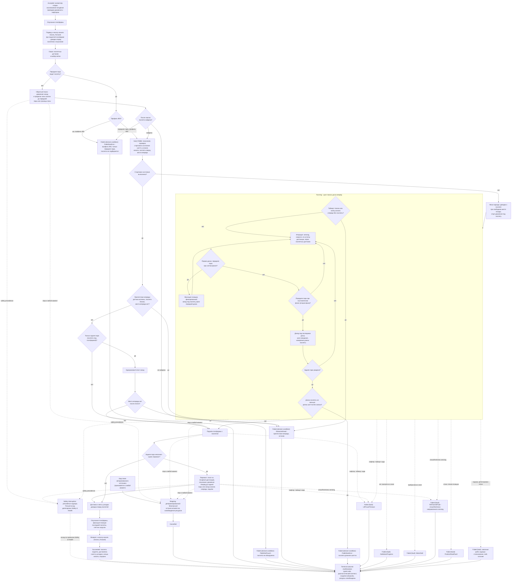

# Алгоритмическая документация операции LoadPallet (V3)

Статус: подготовлено по issue [«Алгоритмическая документация: LoadPallet»](https://github.com/Driadix/ShuttleControllerV3/issues/32) карты [«Спроектировать спецификацию и план прошивки контроллера V3»](https://github.com/Driadix/ShuttleControllerV3/issues/1). Окончательное утверждение ревизий выполняется на gate `G1 Behavioral Contract`.

Формат документа задан [«Формат алгоритмической документации операций V3»](./algorithmic-documentation-format-v3.md): 12-раздельный каркас, трёхслойное разделение содержание/evidence/структура, narrative на русском языке без формул и чисел, идентификаторы на английском. Общая рамка admission, ownership, надзора, прерываний и публикации outcomes задана [«Глобальной алгоритмической документацией работы шаттла V3»](./global-algorithmic-documentation-v3.md); lifecycle, identity, admission и idempotency заданы [«Общим semantic contract операций V3»](./semantic-contract-v3.md).

Evidence: [Capability Evidence Slices каталога операций V3](./research/v3-capability-evidence-slices.md), раздел «LoadPallet (CMD_LOAD = 0x20)» группы «LoadPallet / UnloadPallet»; канонический snapshot V1 - `Driadix/ShuttleController@708d090`. Далее ссылки вида «bundle, …» указывают на этот документ.

## 1. Identity и назначение

`LoadPallet` - root operation type каталога V3 (решение [«Определить каталог и базовые инварианты операций V3»](https://github.com/Driadix/ShuttleControllerV3/issues/9)). Допустимая роль экземпляра - root; child-роль контракт типа не предусматривает: составные операции используют разделяемую подоперацию `load_Pallete`, а не тип `LoadPallet` (раздел 10).

Доменная цель - подобрать паллету в канале (у начала канала либо найденную обратным поиском), поднять её, перевезти к месту укладки в конце канала и опустить. Операция исполняет полный цикл: подвод к началу канала, поиск паллеты, подбор, перехват при неполном подъёме, доставку к месту укладки и возврат к началу канала.

Отношение к другим документам: admission-скелет, stop propagation, fault semantics, link-loss рамка и публикация outcomes не повторяются здесь, а применяются по глобальному документу и semantic contract; документ фиксирует только доменный алгоритм `LoadPallet` и его тип-специфичные paths, условия и исходы. Движение и лифтер используют примитивы, специфицированные документами `MoveDistance` и `LiftTo`; зеркальная операция группы - `UnloadPallet`; разделяемую подоперацию `load_Pallete` используют также `CompactPallets`, `LongLoad` и `Demo` (раздел 10).

## 2. Admission и условия входа

Запрос поступает от `Control Client` в пределах выданных полномочий; `Safety Authority` и `Service Client` этот тип не запрашивают. Envelope, epoch fencing, idempotency и конфликтная семантика - по semantic contract.

Параметры: операция не имеет параметров - команда без аргумента (`CMD_LOAD = 0x20`; bundle, LoadPallet - Entry points и call sites).

Системные preconditions (по глобальному документу, раздел 2): provisioning gate (непривязанный шаттл допускает только stop/reset-класс действий; `LoadPallet` не входит в exempt-набор, bundle, общие entry points и dispatch skeleton), fault-state gate (при активном fault рабочие операции отклоняются), наличие в канале (`LoadPallet` не входит в exempt-список out-of-channel команд: подбор паллеты вне канала не исполняется, bundle, общие entry points и dispatch skeleton), эксклюзивность (одна активная Exclusive Control Activity). Отрицательный результат - `Rejected` со стабильным rejection code, экземпляр не создаётся.

V1 повторно проверял наличие в канале при старте из IDLE тройным чтением датчика канала и отбрасывал команду с `WARN_NOT_IN_CHANNEL` при провале (bundle, общие entry points и dispatch skeleton, п. 8). В V3 admission атомарен: in-channel является precondition и проверяется до положительного ACK; post-ACK повторная проверка не переносится (решение [«Специфицировать общий semantic contract операций V3»](https://github.com/Driadix/ShuttleControllerV3/issues/13)).

Условия, проверяемые только in-situ после принятия (дают runtime outcome, а не `Rejected`):

- наличие и распознавание паллеты паллетными датчиками: отсутствие после поиска даёт domain-condition `PalletNotFound` (раздел 5);
- соответствие размера паллеты профилю: нестандартный размер даёт `PalletSizeError` (раздел 5);
- свободное место впереди при подборе: препятствие в зоне подбора даёт `ObstacleAhead` (раздел 5);
- разрешение старта движения по freshness направленного sensing (условие `MotionFreshnessPermit`; глобальный документ, раздел 8) - перед каждым стартом движения;
- успешное чтение позиционного sensing для фиксированных перемещений (условие `PositionReadAtStart`).

Факт V1, влияющий на вход: признак позиции последней паллеты обнуляется при приёме команды в IDLE (bundle, дельты относительно системного индекса, п. 1), поэтому защита «канал забит» для одиночной загрузки недостижима; это зафиксировано в разделе 11 как предложение change, а не как живой path (раздел 5, `ChannelFull`).

V1 исполнял загрузку также внутри ручной сессии (ветка MANUAL; bundle, LoadPallet - Entry points и call sites). В V3 ручное управление реализуется эксклюзивным lease `Manual Control Session` с hold-to-run intents (решение [«Определить system context и таксономию возможностей V3»](https://github.com/Driadix/ShuttleControllerV3/issues/2)); дискретная команда загрузки в контракт типа входит только как root-запрос (раздел 11).

## 3. Normal path

1. **Принятие.** Admission пройден, экземпляр в `Accepted`, положительный ACK выдан. Root получает эксклюзивное владение приводом движения и лифтерным приводом.
2. **Опускание платформы.** Лифтер опускает платформу перед началом работ (bundle, LoadPallet - Шаги и переходы, шаг 1).
3. **Подвод к началу канала.** Привод движется вперёд до начала канала; останов выполняется по порогу конца канала, в зоне перед началом канала - медленный подъезд на низкой скорости (bundle, LoadPallet - Шаги и переходы, шаг 2; примитив `moove_Forward`, bundle, «3. Примитивы движения»). Позиция начала канала фиксируется при останове. Если платформа поднята, подвод вместо движения выполняет доводку перед паллетом и опускание платформы (bundle, «3. Примитивы движения» - moove_Forward).
4. **Опрос паллетных датчиков и выбор ветви.** У начала канала опрашиваются паллетные датчики (bundle, LoadPallet - Шаги и переходы, шаг 3): передняя пара видит паллету при профиле не 800 либо все четыре датчика - выполняется подбор паллеты (подоперация `load_Pallete`); передняя пара при профиле 800 - `PalletSizeError` (warning с observable event; V1-поведение неоднозначно, раздел 11); иначе - обратный поиск.
5. **Обратный поиск.** Привод движется назад от начала канала на малой скорости в пределах зоны поиска, пока передняя пара не увидит паллету либо не будет достигнута граница зоны (bundle, LoadPallet - Шаги и переходы, шаг 4). Таймаута поиск не имеет (разделы 8 и 11). Stop в поиске - останов и завершение.
6. **Повторный выбор после поиска.** После поиска выбор повторяется (bundle, LoadPallet - Шаги и переходы, шаг 5): паллета найдена - подбор с поправкой позиции; передняя пара при профиле 800 - `PalletSizeError`; ничего не найдено - `PalletNotFound` (паллета не обнаружена).
7. **Подбор паллеты.** Подоперация подбора: опускание платформы, стартовая поправка позиции у начала канала, проверка стартового состояния - шаттл у начала канала, паллета на платформе, свободное место впереди (bundle, LoadPallet - Шаги и переходы, шаг 6). Проверка «канал не забит» в этом месте для одиночной загрузки недостижима (раздел 11).
8. **Фаза подхода.** Если стартовое состояние не выполнено: при свободном месте позади выполняется доводка к паллете; движение под паллету стартует при достаточном остатке до конца канала (bundle, LoadPallet - Шаги и переходы, шаги 6-7).
9. **Цикл поиска досок вперёд.** Экземпляр в `Running`: цикл движения под паллету с поиском досок (раздел 4). На каждой итерации - sensing, выбор скорости по остатку дистанции, опрос паллетных датчиков. При появлении передней пары при снятом флаге передней доски: фиксация позиции и фиксированный заезд под паллету (дистанция заезда зависит от профиля), флаг передней доски выставляется (bundle, LoadPallet - Шаги и переходы, шаг 7). При передней паре при выставленном флаге - доезд под последнюю доску: серия коротких шагов ожидания с измерением длины паллеты; ранний выход при появлении задней пары. После доезда - останов и проверка длины паллеты: если задняя доска не увидена за длину шаттла и длина паллеты не меньше длины шаттла без запаса - `PalletSizeError` (паллета длиннее шаттла). Таймаут поиска либо конец канала спереди без распознанной паллеты - `ObstacleAhead`.
10. **Альтернативные стартовые ветви.** Если паллета уже сверху: препятствие впереди (датчики активны, паллета близко, места впереди нет) - `ObstacleAhead` с остановом; только задняя пара - одноразовый откат назад и повторная проверка места впереди (нет места - `ObstacleAhead`; есть - подъём); передняя пара - подъём без поиска (bundle, LoadPallet - Шаги и переходы, шаг 8).
11. **Подъём.** Лифтер поднимает платформу с паллетой (bundle, LoadPallet - Шаги и переходы, шаг 9).
12. **Перехват.** Если после подъёма задняя пара датчиков неполная - перехват: откат на recapture-дистанцию (по профилю), опускание, движение вперёд до полной задней пары либо конца канала спереди, останов, подъём (bundle, LoadPallet - Шаги и переходы, шаг 10). Достижение конца канала спереди при перехвате останавливает движение; перехват остаётся неполным, а операция продолжает доставку и завершение (раздел 11, предложение).
13. **Доставка к месту укладки.** Привод движется назад и выполняет доводку перед паллетой на месте укладки (bundle, LoadPallet - Шаги и переходы, шаг 11).
14. **Опускание и bookkeeping.** Лифтер опускает платформу; фиксируются признак и позиция последней паллеты; увеличивается счётчик загрузок (bundle, LoadPallet - Шаги и переходы, шаг 12).
15. **Возврат и завершение.** Привод возвращается к началу канала; экземпляр завершает алгоритм `Succeeded`; ресурсы освобождены, terminal outcome опубликован, snapshot обновлён (bundle, LoadPallet - Шаги и переходы, шаг 13; Observable outcomes).

Инвариант соблюдается: `Succeeded` публикуется только при поднятой, доставленной к месту укладки и опущенной паллете; тихие успехи V1 при невыполненном подборе (warning-ветви без return) в V3 не переносятся - они классифицируются как domain-condition исходы (разделы 5 и 11, предложения).

## 4. Ожидания и повторения

Операция не содержит ожиданий внешних событий канальной логистики: подбор, перевозка и укладка выполняются по собственным sensing-условиям (ожидание освобождения места впереди, свойственное выгрузке, у загрузки отсутствует).

Condition-driven циклы внутри `Running` с явными условиями входа и выхода:

- **Цикл поиска досок вперёд.** Вход: старт движения под паллету. Выход: доезд под последнюю доску завершён (движение остановлено), конец канала спереди при распознанной паллете, либо классифицированный исход (`PalletSizeError`, `ObstacleAhead`), либо stop/fault.
- **Доезд под последнюю доску (board-delay).** Вход: передняя пара видит доску при выставленном флаге передней доски. Выход: задняя пара увидена (ранний выход), серия шагов ожидания исчерпана, stop.
- **Обратный поиск.** Вход: передняя пара не видит паллету у начала канала. Выход: передняя пара появилась, достигнута граница зоны поиска, stop.
- **Перехват.** Вход: задняя пара неполная после подъёма. Выход: полная задняя пара, конец канала спереди, stop.

Warn-and-continue поведение V1 - `PalletSizeError` при профиле 800: warning с observable event, операция продолжается и завершается по факту без подбора паллеты. Поведение неоднозначно (warning-ветвь без return); в V3 предлагается классифицированный исход (раздел 11, предложение).

## 5. Прерывания

Рамка stop/fault/safety precedence - глобальный документ, раздел 5; здесь зафиксированы тип-специфичные paths.

### Stop

Stop принимается в любой момент после принятия экземпляра - во всех циклах движения и лифтера - и переводит его в `Stopping`: детерминированный безопасный останов actuator-ов экземпляра, освобождение ресурсов, исход `Cancelled`. Abort-ветви циклов останавливают привод движения и фиксируют stop-статус; в V1 abort внутри подъёма/опускания не выдавал останов лифтерному приводу - дефект не переносится: нормативный безопасный останов охватывает лифтер (раздел 11). Паллета может остаться частично на платформе; snapshot отражает фактическое состояние.

### Fault

Fault - детектированный внутренний отказ; экземпляр завершается `Failed` с кодом класса `fault` и диагностическим контекстом. Тип-специфичные детектируемые условия:

- `LiftTravelTimeout` - концевик лифтера не сработан в течение отведённого времени хода (условие `LifterTravelTimeout`; детализация - документ `LiftTo`).
- `NoMotionProgress` - нет приращения позиции в течение отведённого окна при commanded движении в фиксированных перемещениях (V1 no-progress watchdog; условие `MoveNoProgressWindow`). V1 дополнительно принудительно опускал платформу в этом fault-пути; смена состояния платформы как побочный эффект fault - предложение до подтверждения `Safety & Health` (раздел 11).
- `MotorStall` - отсутствие движения при commanded движении в течение окна детектирования пробуксовки (условие `StallDetectWindow`).
- `TofChannelFault` - отказ или потеря freshness направленного sensing: на старте движения fault latch-ится и привод не стартует; во время движения - принудительный останов (V1 force-stop по активной motion-safety). Тихий отказ старта (приводной флаг не выставляется, вызывающий код результат не проверяет) приводит к прокрутке циклов до таймаута или внешнего stop; детектирование такого отказа - предложение change (раздел 11).
- `PositionReadFault` - отказ чтения позиционного sensing при старте фиксированного перемещения (V1 - тихий return) и во время движения (V1 - останов без декларированного исхода); в V3 детектированный отказ даёт `Failed` класса `fault` (раздел 11, предложение).
- Столкновение, stall привода, питание ниже порога - сквозные paths надзора (глобальный документ, раздел 5).

### Domain-condition

Domain-condition - наблюдаемое состояние мира, делающее цель недостижимой; исход `Failed` с кодом класса `domain-condition`, severity warning level по коду. V1 выражал все четыре условия warnings с observable event и продолжением/завершением по факту; поскольку warning-ветви не давали однозначного исхода, в V3 предлагается классифицированный исход (раздел 11):

- `PalletSizeError` - нестандартный размер паллеты: (а) профиль 800, только передняя пара датчиков видит паллету (требуются обе пары); (б) длина паллеты не меньше длины шаттла без запаса при не увиденной задней доске. В V1 обе ветви warning; ветвь (б) сопровождается остановом и возвратом к началу канала, ветвь (а) - продолжением к завершению без подбора.
- `PalletNotFound` - после обратного поиска паллета не обнаружена (V1: warning и завершение без подбора).
- `ObstacleAhead` - препятствие впереди в зоне подбора: датчики активны, паллета близко, места впереди нет; либо таймаут поиска; либо конец канала спереди без распознанной паллеты; либо отсутствие места впереди после одноразового отката.
- `ChannelFull` - канал забит (V1 `WARN_CHANNEL_FULL`). Для одиночной загрузки проверка недостижима: признак позиции последней паллеты обнуляется при приёме команды; защита срабатывает только в повторных вызовах подоперации из составных операций. В narrative и на диаграмме ветвь как живая не изображается; необходимость защиты «канал забит» для одиночной загрузки - предложение change, решение владельца на gate контракта LoadPallet (раздел 11).

Неисправность сенсора при положительных признаках отказа является fault-путём, а не domain-condition.

### Safety interruption

Точки safety-прерывания операции: permit-проверка freshness направленного sensing перед каждым стартом движения; надзор во время движения (потеря freshness, столкновение, stall, питание). Граница с fault-путями - по глобальному документу, раздел 5: детектированный надзором отказ завершает экземпляр fault-исходом (выше); safety interruption наступает, когда Safety Authority применяет precedence к operation intents и при необходимости инициирует авторизованные safety operations. Точный исход прерванного экземпляра делегирован `Safety & Health` и здесь не выдумывается.

### Link-loss

`LoadPallet` - автономная операция; назначенная link-loss policy - `continue`: после потери инициатора экземпляр продолжает исполнение до собственного terminal outcome (V1 baseline: автономное исполнение не зависит от наличия связи; глобальный документ, раздел 5).

## 6. Recovery и состояние после прерывания

Возобновление всегда явное - новый запрос; generic pause/resume операции не свойственен.

- **После `Cancelled` (stop):** actuator-ы остановлены, ресурсы освобождены, шаттл в промежуточной позиции; паллета может находиться частично на платформе; snapshot отражает фактическое состояние. Продолжение - новым запросом с учётом фактического состояния.
- **После `Failed` (fault):** fault удерживается (latched semantics); платформа допускает только override/service-действия; recovery через `ClearFault` с baseline-условиями снятия (квалифицированное восстановление sensing/шины и физическая неподвижность) по глобальному документу. Прерванная операция не возобновляется.
- **После `Failed` (domain-condition):** физическое состояние сохраняется: шаттл у начала канала либо у места укладки, паллета не подобрана либо подобрана частично (неполный перехват); V1 в warning-ветвях возвращался к началу канала; snapshot несёт код и диагностический контекст. Продолжение - явным новым запросом.
- **После safety interruption:** состояние и исход по правилам `Safety & Health`.

## 7. Terminal outcomes и наблюдаемые результаты

Принятый экземпляр завершается одним из terminal states; `Rejected` относится только к запросу.

| Исход | Класс | Наблюдаемое условие |
| --- | --- | --- |
| `Succeeded` | - | паллета поднята, доставлена к месту укладки и опущена; возврат к началу канала |
| `Cancelled` | stop | принят stop, детерминированный безопасный останов actuator-ов завершён |
| `Failed` | `fault` | `LiftTravelTimeout`, `NoMotionProgress`, `MotorStall`, `TofChannelFault`, `PositionReadFault`, сквозные paths надзора |
| `Failed` | `domain-condition` | `PalletSizeError`, `PalletNotFound`, `ObstacleAhead`; `ChannelFull` - для одиночной загрузки предложение (ветвь в V1 недостижима, раздел 11) |

Outcome содержит стабильный typed code и минимальный диагностический контекст: фаза операции на момент исхода, позиция, показания паллетных датчиков, состояние платформы. Таксономия typed codes и назначение severity фиксируются `External Semantic & Transport Contracts` и `Observability & Diagnostics`; имена условий выше - observation-based имена, принятые этим документом.

Внешняя видимость - по semantic contract: положительный ACK при принятии, terminal outcome при завершении, query snapshot как authoritative read-модель. Observable events: принятие, старт подвода, обнаружение паллеты, подъём, перехват, укладка, возврат, terminal outcome. V1-каденции телеметрии и mapping `STATE_LOAD` зафиксированы в evidence как baseline budgets `Observability & Diagnostics`.

## 8. Timing conditions

Унаследованные timing-условия V1 для `LoadPallet`. Количественные значения остаются в evidence; новые количественные значения документ не вводит.

| Условие | Класс | Anchor | Disposition |
| --- | --- | --- | --- |
| `PalletPickupDistance` - дистанция заезда под паллету после первой доски | configured | `Cntrl_V2/Cntrl_V2.ino:L5724-L5726` (bundle, LoadPallet - Timing conditions) | preserve как verified production tuning; значения пересматриваются с NFR/HIL |
| `BoardDelaySteps` - число шагов доезда под последнюю доску | configured | `Cntrl_V2/Cntrl_V2.ino:L5734-L5744` (bundle, LoadPallet - Timing conditions) | preserve формулу; change (предложение): clamp при maxSpeed выше порога (uint8_t-заворот maxbb) - предложение change, решение владельца на gate контракта LoadPallet |
| `BoardDelayStepInterval` - длительность шага доезда | configured | `Cntrl_V2/Cntrl_V2.ino:L5748` (bundle, LoadPallet - Timing conditions) | preserve |
| `PalletSearchTimeout` - полный таймаут поиска паллеты вперёд | configured (формула) | `Cntrl_V2/Cntrl_V2.ino:L5802` (bundle, LoadPallet - Timing conditions) | preserve концепцию; change (предложение): защита от нулевого maxSpeed (деление на ноль) - предложение change, решение владельца на gate контракта LoadPallet |
| `SearchPaceInterval` - период пересчёта скорости в поиске | configured | `Cntrl_V2/Cntrl_V2.ino:L5786` (bundle, LoadPallet - Timing conditions) | preserve |
| `ReverseSearchZone` - граница зоны обратного поиска от начала канала | configured | `Cntrl_V2/Cntrl_V2.ino:L5961` (bundle, LoadPallet - Timing conditions) | preserve |
| `ReverseSearchTimeout` - таймаут обратного поиска: в V1 отсутствует | факт отсутствия | `Cntrl_V2/Cntrl_V2.ino:L5959-L5980` (bundle, LoadPallet - Шаги и переходы, шаг 4; Stop/fault/abort) | change (предложение): watchdog выхода - предложение change, решение владельца на gate контракта LoadPallet |
| `RecaptureDistance` - дистанция перехвата после подъёма | configured | `Cntrl_V2/Cntrl_V2.ino:L5864-L5869` (bundle, LoadPallet - Timing conditions) | preserve |
| `ChannelEndThreshold` - порог конца канала; медленный подъезд при загрузке, фиксация позиции начала канала | configured | `Cntrl_V2/Cntrl_V2.ino:L5246-L5256` (bundle, LoadPallet - Timing conditions) | preserve |
| `StartOffsetNearChannelEnd` - стартовая поправка позиции у начала канала | configured | `Cntrl_V2/Cntrl_V2.ino:L5678-L5680` (bundle, LoadPallet - Шаги и переходы, шаг 6) | preserve |
| `ApproachSpaceThreshold` - порог свободного места позади для фазы подхода | configured | `Cntrl_V2/Cntrl_V2.ino:L5687-L5690` (bundle, LoadPallet - Шаги и переходы, шаг 6) | preserve |
| `LifterTravelTimeout` - максимум времени хода лифтера до fault | configured | `Cntrl_V2/Cntrl_V2.ino:L1646`, `Cntrl_V2/Cntrl_V2.ino:L2501` (bundle, LoadPallet - Timing conditions; детализация в документе LiftTo) | preserve концепцию |
| `PalletSensorDebounce` - антидребезг паллетных датчиков | configured | `Cntrl_V2/Cntrl_V2.ino:L3442-L3462` (bundle, LoadPallet - Timing conditions) | preserve |
| `SpeedCommandThrottle` - минимальный интервал между записями скорости приводу | configured | `Cntrl_V2/Cntrl_V2.ino:L2090-L2092` (bundle, LoadPallet - Timing conditions) | preserve |
| `MoveNoProgressWindow` - окно отсутствия прогресса до fault в фиксированных перемещениях | configured | `Cntrl_V2/Cntrl_V2.ino:L4982-L4989` (bundle, LoadPallet - Timing conditions; документ MoveDistance) | preserve концепцию |
| `StallDetectWindow` - окно детектирования пробуксовки | configured | `Cntrl_V2/Cntrl_V2.ino:L4078-L4085` (bundle, LoadPallet - Timing conditions) | preserve |
| `DistanceOverrunCorrection` - компенсация выбега в фиксированных перемещениях | configured | `Cntrl_V2/Cntrl_V2.ino:L4830-L4833` (bundle, LoadPallet - Timing conditions) | preserve как tuning-политику |
| `FinalApproachCorrection` - формула доводки перед паллетой | configured | `Cntrl_V2/Cntrl_V2.ino:L4626-L4630` (bundle, LoadPallet - Timing conditions) | preserve как tuning-политику |
| `ApproachMeasurementStabilization` - стабилизация замера дистанции перед доводкой | configured | `Cntrl_V2/Cntrl_V2.ino:L4564-L4579` (bundle, LoadPallet - Timing conditions) | preserve |
| `MinimumApproachGap` - минимальная дистанция при доводке | configured | `Cntrl_V2/Cntrl_V2.ino:L4526-L4529` (bundle, LoadPallet - Timing conditions) | preserve |
| `WarningDisplayDuration` - длительность индикации warning | configured | `Cntrl_V2/Cntrl_V2.ino:L550-L553` (bundle, LoadPallet - Observable outcomes) | preserve |

Unknowns:

- **U07** (фактические runtime-значения конфигурации на эксплуатируемых устройствах: распределение профилей, maxSpeed, chnlOffset/mprOffset, interPalleteDistance и калибровки): владелец - владелец и полевые данные; стадия закрытия - до декомпозиции профильных требований (unknowns bundle); применение к настоящему документу - на gate контракта LoadPallet. U07 не блокирует документ: количественные значения остаются в evidence, документ ссылается на них именованными условиями.
- Неблокирующие: физический смысл и калибровка констант дистанции заезда, порога свободного места, множителя доводки из source не устанавливаются - зафиксированы как verified production tuning с пересмотром вместе с HIL-валидацией (unknowns bundle, неблокирующие unknowns). Переполнение счётчика времени после длительного аптайма - сквозной паттерн V1, validation obligation для NFR availability (unknowns bundle).

## 9. Профильные варианты

Алгоритм `LoadPallet` различается по профилям 800, 1000 и 1200 (bundle, LoadPallet - Профильные варианты; «Профильные варианты 800/1000/1200 - сводка»):

- дистанция заезда под паллету: базовая для всех профилей, увеличенная для 1200; укороченный вариант для 800 в V1 закомментирован (раздел 11);
- дистанция перехвата: базовая, увеличенная для 1000 и ещё больше для 1200 (bundle, LoadPallet - Timing conditions, `RecaptureDistance`);
- число шагов доезда под последнюю доску: базовая формула, для 1200 уменьшенное (bundle, LoadPallet - Timing conditions, `BoardDelaySteps`);
- профиль 800: при одиночной загрузке требуются обе пары паллетных датчиков; только передняя пара даёт `PalletSizeError` и подбор не выполняется. Для 1000/1200 достаточно передней пары (bundle, LoadPallet - Шаги и переходы, шаги 3 и 5);
- поправка доводки перед паллетой применяется только для 1000/1200 (bundle, LoadPallet - Профильные варианты);
- запас длины паллеты одинаков для всех профилей; профильные поправки в V1 закомментированы (раздел 11).

Валидация профиля как набора механических параметров - `Configuration & Calibration` (unknown U07, раздел 8).

## 10. Composition boundaries

`LoadPallet` - составная операция: доменный алгоритм исполняется одним root-экземпляром, а шаг подбора выносится в подоперацию `load_Pallete`.

- **Suboperation:** `load_Pallete` - разделяемый шаг подбора паллеты, который в V3 становится подоперацией (child instance) с делегированным набором ресурсов; разрешённые parent-типы фиксирует статический type graph (V1 call sites: одиночная загрузка, компакция, long-загрузка, демонстрационный режим - bundle, LoadPallet - Entry points и call sites). Внутри подоперации выделяются фазы подхода, поиска досок, подъёма, перехвата и доставки.
- **Primitives** (не имеют собственной operation identity и lifecycle): движения `moove_Forward` (подвод и возврат к началу канала), `moove_Distance_F/R` (фиксированные перемещения: заезд, откат, перехват), доводки `moove_Before_Pallete_F` и `stop_Before_Pallete_R` (подход к паллете и останов перед местом укладки), шаги лифтера `lifter_Up`/`lifter_Down`/`lifter_Stop`, опрос паллетных датчиков `detect_Pallete`, тики sensing и интеграции позиции.
- **Ресурсы:** root эксклюзивно владеет приводом движения и лифтерным приводом до завершения; подоперация получает делегированный набор от parent и не приобретает ресурсы за пределами delegation (semantic contract, раздел «Root, suboperation и primitive»). Sensing (паллетные датчики, ToF, концевики, позиция) предоставляется как сервис платформы.
- Эксклюзивность привода движения: во время всей операции активна одна Exclusive Control Activity; параллельные mutating запросы отклоняются (`ResourceConflict` по semantic contract).

## 11. V1 dispositions и evidence

Evidence anchors - bundle, разделы «LoadPallet (CMD_LOAD = 0x20)», «Общие entry points и dispatch skeleton», «3. Примитивы движения», «Профильные варианты 800/1000/1200 - сводка», «Дельты относительно системного индекса», «Явно зафиксированные аномалии»; канонический snapshot V1 `Driadix/ShuttleController@708d090`. Все anchors ниже даны полным путём V1 и пояснением раздела bundle. Предложения, не подтверждённые решением владельца, помечены «предложение change - решение владельца на gate контракта LoadPallet»; preserve по умолчанию по метаправилу формата.

| Поведение V1 | Evidence | Disposition | Основание |
| --- | --- | --- | --- |
| Команда `CMD_LOAD = 0x20` без аргумента; авто-путь: опускание, одиночная загрузка, `status = CMD_STOP` | `Cntrl_V2/ShuttleProtocol.h:L106`; `Cntrl_V2/Cntrl_V2.ino:L3265-L3272` (bundle, LoadPallet - Entry points и call sites) | preserve структуру исполнения; типизированных параметров нет | каталог (issue [«Определить каталог и базовые инварианты операций V3»](https://github.com/Driadix/ShuttleControllerV3/issues/9)) |
| Обнуление признака позиции последней паллеты при приёме команды в IDLE; проверка «канал не забит» для одиночной загрузки недостижима | `Cntrl_V2/Cntrl_V2.ino:L1845` (bundle, Дельты относительно системного индекса, п. 1); `Cntrl_V2/Cntrl_V2.ino:L5671-L5677` (bundle, LoadPallet - Admission/preconditions) | preserve факт V1; change (предложение): защита «канал забит» для одиночной загрузки | метаправило preserve; предложение change - решение владельца на gate контракта LoadPallet |
| `WARN_CHANNEL_FULL` + `CMD_STOP` внутри подоперации; срабатывает только при повторных вызовах из компакции/long-загрузки/демо | `Cntrl_V2/Cntrl_V2.ino:L5671-L5677` (bundle, LoadPallet - Admission/preconditions) | preserve для составных вызовов; в narrative одиночной загрузки ветвь не изображается как живая | baseline; мёртвый код не переносится как нормативное поведение (глобальный документ, раздел 11) |
| Обратный поиск без таймаута: при тихом отказе старта привода цикл не выходит без внешнего stop/fault | `Cntrl_V2/Cntrl_V2.ino:L5959-L5980` (bundle, LoadPallet - Шаги и переходы, шаг 4); `Cntrl_V2/Cntrl_V2.ino:L2252-L2255` (bundle, LoadPallet - Stop/fault/abort); аномалии, п. 3 | change (предложение): watchdog выхода обратного поиска | предложение change - решение владельца на gate контракта LoadPallet |
| Профиль 800: при одиночной загрузке требуются обе пары датчиков; только передняя пара - `WARN_PALLET_SIZE_ERROR` без остановки и без return | `Cntrl_V2/Cntrl_V2.ino:L5949-L5956`, `Cntrl_V2/Cntrl_V2.ino:L5987-L5991` (bundle, LoadPallet - Шаги и переходы, шаги 3 и 5; Профильные варианты) | preserve требование обеих пар; change (предложение): неоднозначный исход warning-ветви (проваливание к финальному возврату без подбора) классифицируется как `PalletSizeError` | инвариант `Succeeded ⇔ цель достигнута` (формат, issue [«Зафиксировать формат и acceptance criteria алгоритмической документации V3»](https://github.com/Driadix/ShuttleControllerV3/issues/15)); предложение change - решение владельца на gate контракта LoadPallet |
| Warning-ветви профиля 800 без return: управление проваливается к финальному возврату к началу канала, операция завершается `CMD_STOP` без подбора | `Cntrl_V2/Cntrl_V2.ino:L5952-L5956`, `Cntrl_V2/Cntrl_V2.ino:L5999` (bundle, LoadPallet - Stop/fault/abort) | change (предложение): классифицированный исход вместо тихого успеха | инвариант `Succeeded ⇔ цель достигнута`; предложение change - решение владельца на gate контракта LoadPallet |
| `WARN_PALLET_NOT_FOUND` после обратного поиска, лог «Single load fail» | `Cntrl_V2/Cntrl_V2.ino:L5995-L5997` (bundle, LoadPallet - Observable outcomes) | change (предложение): `PalletNotFound` как `Failed` класса `domain-condition` | инвариант и классификация paths формата; предложение change - решение владельца на gate контракта LoadPallet |
| `WARN_OBSTACLE_AHEAD` в трёх точках подоперации: препятствие впереди, отсутствие места после отката, таймаут поиска | `Cntrl_V2/Cntrl_V2.ino:L5807`, `Cntrl_V2/Cntrl_V2.ino:L5820`, `Cntrl_V2/Cntrl_V2.ino:L5847` (bundle, LoadPallet - Observable outcomes; Шаги и переходы, шаги 7-8) | change (предложение): `ObstacleAhead` как `Failed` класса `domain-condition` | инвариант и классификация paths формата; предложение change - решение владельца на gate контракта LoadPallet |
| Длина паллеты не меньше длины шаттла без запаса: `WARN_PALLET_SIZE_ERROR`, останов, возврат к началу канала, `CMD_STOP` | `Cntrl_V2/Cntrl_V2.ino:L5775-L5783` (bundle, LoadPallet - Шаги и переходы, шаг 7; Observable outcomes) | change (предложение): `PalletSizeError` как `Failed` класса `domain-condition` | инвариант `Succeeded ⇔ цель достигнута`; предложение change - решение владельца на gate контракта LoadPallet |
| Таймаут поиска формулой `2000000 / maxSpeed`; деление на ноль при нулевом maxSpeed (конфигурация пишется без валидации) | `Cntrl_V2/Cntrl_V2.ino:L5802`, `Cntrl_V2/Cntrl_V2.ino:L2955-L2961` (bundle, аномалии, п. 1) | change (предложение): валидация конфигурации maxSpeed либо защита от деления на ноль | зафиксированный дефект не переносится как нормативное поведение (глобальный документ, раздел 11); предложение change - решение владельца на gate контракта LoadPallet |
| uint8_t-заворот числа шагов доезда при maxSpeed выше порога (до 253 шагов) | `Cntrl_V2/Cntrl_V2.ino:L5734` (bundle, аномалии, п. 2) | change (предложение): clamp значения | зафиксированный дефект не переносится; предложение change - решение владельца на gate контракта LoadPallet |
| Дистанция заезда под паллету: базовая, увеличенная для 1200 | `Cntrl_V2/Cntrl_V2.ino:L5724-L5726` (bundle, LoadPallet - Timing conditions; Профильные варианты) | preserve как verified production tuning | baseline; пересмотр - с HIL-валидацией и решением по профилям |
| Дистанции перехвата: базовые значения по профилям | `Cntrl_V2/Cntrl_V2.ino:L5864-L5869` (bundle, LoadPallet - Timing conditions) | preserve | baseline |
| Конец канала спереди при перехвате: останов и завершение без полного перехвата | `Cntrl_V2/Cntrl_V2.ino:L5885-L5892` (bundle, LoadPallet - Шаги и переходы, шаг 10) | change (предложение): классифицировать невыполненный перехват как исход, а не как тихий успех | инвариант `Succeeded ⇔ цель достигнута`; предложение change - решение владельца на gate контракта LoadPallet |
| Останов у начала канала: медленный подъезд при загрузке, фиксация позиции начала канала | `Cntrl_V2/Cntrl_V2.ino:L5246-L5256` (bundle, LoadPallet - Timing conditions) | preserve: доменное понятие «начало канала» | baseline; доменные данные - narrative и диаграмма |
| Подвод при поднятой платформе: доводка перед паллетом и опускание | `Cntrl_V2/Cntrl_V2.ino:L5202-L5208` (bundle, «3. Примитивы движения» - moove_Forward) | preserve | baseline |
| Схема «подход - заезд по первой доске - доезд под последнюю доску - подъём - перехват - доставка - опускание» | `Cntrl_V2/Cntrl_V2.ino:L5687-L5690`, `Cntrl_V2/Cntrl_V2.ino:L5720-L5731`, `Cntrl_V2/Cntrl_V2.ino:L5745-L5768`, `Cntrl_V2/Cntrl_V2.ino:L5859`, `Cntrl_V2/Cntrl_V2.ino:L5861-L5922`, `Cntrl_V2/Cntrl_V2.ino:L5924`, `Cntrl_V2/Cntrl_V2.ino:L5928-L5933` (bundle, LoadPallet - Шаги и переходы) | preserve: наблюдаемое продуктовое поведение | bundle, LoadPallet - Disposition proposals |
| `FAULT_LIFTER_TIMEOUT` по таймауту хода лифтера | `Cntrl_V2/Cntrl_V2.ino:L2412-L2419`, `Cntrl_V2/Cntrl_V2.ino:L2501-L2508` (bundle, LoadPallet - Stop/fault/abort) | preserve концепцию; детализирует документ `LiftTo` | baseline; глобальный документ, раздел 8 |
| Abort внутри подъёма/опускания не выдаёт останов лифтерному приводу | `Cntrl_V2/Cntrl_V2.ino:L2388-L2392`, `Cntrl_V2/Cntrl_V2.ino:L2407-L2411` (bundle, LoadPallet - Stop/fault/abort) | change (предложение): нормативный безопасный останов охватывает лифтерный привод | зафиксированный дефект не переносится (глобальный документ, раздел 11); semantic contract |
| `FAULT_MOVE_TIMEOUT` в фиксированных перемещениях с принудительным опусканием платформы | `Cntrl_V2/Cntrl_V2.ino:L4982-L4989` (bundle, LoadPallet - Stop/fault/abort; документ MoveDistance) | preserve концепцию fault `NoMotionProgress`; change (предложение): принудительное опускание как safe reaction - подтверждение `Safety & Health` | паттерн предложений до gate Safety & Health (глобальный документ, раздел 11) |
| `FAULT_MOTOR_STALL` по окну отсутствия движения | `Cntrl_V2/Cntrl_V2.ino:L4078-L4085` (bundle, LoadPallet - Stop/fault/abort) | preserve: сквозной path надзора | глобальный документ, раздел 5 |
| ToF freshness gate при старте движения и force-stop в движении | `Cntrl_V2/Cntrl_V2.ino:L2239-L2258`, `Cntrl_V2/Cntrl_V2.ino:L3536-L3553`, `Cntrl_V2/Cntrl_V2.ino:L3555-L3571` (bundle, LoadPallet - Stop/fault/abort; «3. Примитивы движения») | preserve | глобальный документ, раздел 8 |
| Тихий отказ старта привода: приводной флаг не выставляется, вызывающий код результат не проверяет, циклы крутятся до таймаута или stop | `Cntrl_V2/Cntrl_V2.ino:L2239-L2258` (bundle, аномалии, п. 4) | change (предложение): fault-детектирование старта движения | зафиксированный дефект не переносится; предложение change - решение владельца на gate контракта LoadPallet |
| Отказ чтения позиционного sensing: тихий return при старте, останов без декларированного исхода в движении | `Cntrl_V2/Cntrl_V2.ino:L4813-L4816`, `Cntrl_V2/Cntrl_V2.ino:L4852-L4857` (bundle, LoadPallet - Stop/fault/abort) | change (предложение): явный fault-исход `PositionReadFault` | паттерн документа `MoveDistance`; предложение change - решение владельца на gate контракта LoadPallet |
| Повторная проверка принятия после положительного ACK с возможным отбрасыванием | `Cntrl_V2/Cntrl_V2.ino:L2871`, `Cntrl_V2/Cntrl_V2.ino:L6977`, `Cntrl_V2/Cntrl_V2.ino:L7008` (bundle, аномалии, п. 8; общие entry points и dispatch skeleton) | change: атомарный admission без post-ACK re-check | решение issue [«Специфицировать общий semantic contract операций V3»](https://github.com/Driadix/ShuttleControllerV3/issues/13) |
| Ручной путь загрузки внутри ручной сессии | `Cntrl_V2/Cntrl_V2.ino:L1991-L1995` (bundle, LoadPallet - Entry points и call sites) | change: не входит в контракт типа; ручное управление - lease `Manual Control Session` | решение issue [«Определить system context и таксономию возможностей V3»](https://github.com/Driadix/ShuttleControllerV3/issues/2) и каталога (issue 9) |
| Bookkeeping: признак и позиция последней паллеты, счётчик загрузок | `Cntrl_V2/Cntrl_V2.ino:L5928-L5938` (bundle, LoadPallet - Observable outcomes) | preserve как наблюдаемые результаты | baseline |
| Счётчик паллет и массив позиций паллет загрузкой не обновляются | `Cntrl_V2/Cntrl_V2.ino:L8834` (bundle, LoadPallet - Observable outcomes) | preserve | baseline |
| Telemetry mapping `STATE_LOAD` при приёмке | `Cntrl_V2/Cntrl_V2.ino:L8233-L8234` (bundle, LoadPallet - Entry points и call sites) | preserve как baseline budgets `Observability & Diagnostics` | глобальный документ, раздел 7 |
| Закомментированные профильные блоки: укороченный заезд для 800, поправки запаса длины | `Cntrl_V2/Cntrl_V2.ino:L5728`, `Cntrl_V2/Cntrl_V2.ino:L5772-L5774` (bundle, аномалии, п. 6; LoadPallet - Disposition proposals) | exclude (предложение): мёртвый код не переносится | зафиксированные дефекты V1 (глобальный документ, раздел 11); предложение exclude - решение владельца на gate контракта LoadPallet |

## 12. Диаграмма

Обязательная Mermaid-блок-схема алгоритма `LoadPallet`. Источник diagram-as-code: [diagrams/src/load-pallet-flow.mmd](../diagrams/src/load-pallet-flow.mmd).

Narrative и диаграмма согласованы: каждое ветвление и ожидание narrative (опрос датчиков и выбор ветви, профиль 800, обратный поиск и его результат, проверка стартового состояния, препятствие впереди, ветвь задней пары с одноразовым откатом, ветвь передней пары, цикл поиска досок с фазами первой доски и доезда под последнюю доску, проверка длины паллеты, конец канала спереди и таймаут поиска, подъём, перехват, доставка, опускание и bookkeeping, возврат к началу канала, stop, fault-пути лифтера, движения и sensing, safety precedence, публикация outcome) присутствует на диаграмме, и каждая ветвь диаграммы описана в разделах 2-7. Ветвь «канал забит» на диаграмме отсутствует по построению: для одиночной загрузки она недостижима в V1 и вынесена в раздел 11 как предложение change.

## Ревью

- Ревьюер: независимая сессия (субагент), сверка по первоисточнику V1 и evidence bundle
- Вердикт: APPROVED
- Дата: 2026-08-06
- Результат: readiness checklist 10/10, blocking findings отсутствуют
