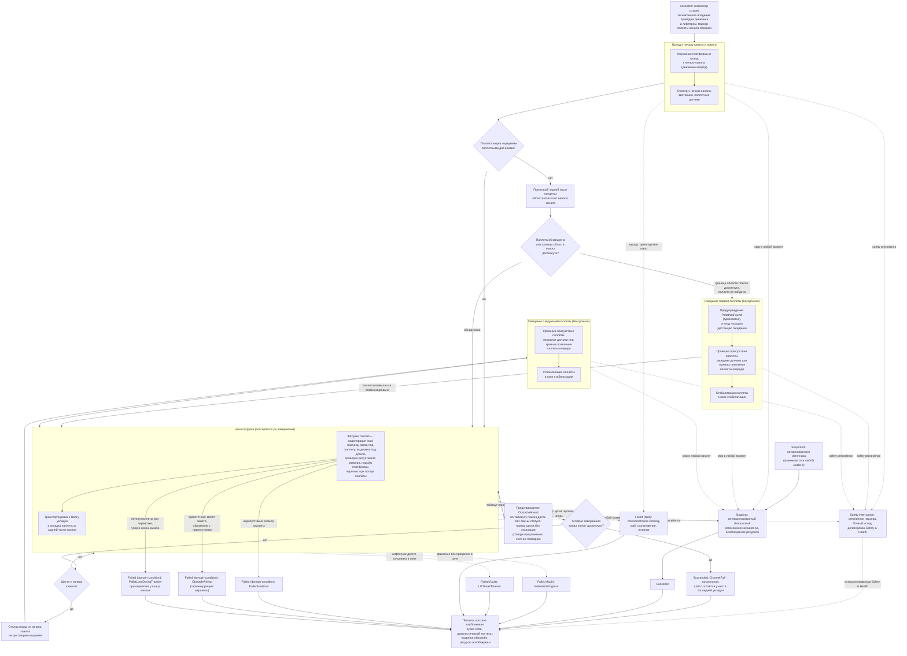

# Алгоритмическая документация операции LongLoad (V3)

Статус: подготовлено по issue [«Алгоритмическая документация: LongLoad»](https://github.com/Driadix/ShuttleControllerV3/issues/34) карты [«Спроектировать спецификацию и план прошивки контроллера V3»](https://github.com/Driadix/ShuttleControllerV3/issues/1). Окончательное утверждение ревизий выполняется на gate `G1 Behavioral Contract`.

Формат документа задан [«Формат алгоритмической документации операций V3»](./algorithmic-documentation-format-v3.md): 12-раздельный каркас, трёхслойное разделение содержание/evidence/структура, narrative на русском языке без формул и чисел, идентификаторы - на английском. Общая рамка admission, ownership, надзора, прерываний и публикации outcomes задана [«Глобальной алгоритмической документацией работы шаттла V3»](./global-algorithmic-documentation-v3.md); lifecycle, identity, admission и idempotency заданы [«Общим semantic contract операций V3»](./semantic-contract-v3.md).

Evidence: [Capability Evidence Slices каталога операций V3](./research/v3-capability-evidence-slices.md), раздел «Группа: LongLoad / LongUnload / LongUnloadQuantity» - секции «LongLoad (CMD_LONG_LOAD = 0x22)», «Условия остановки циклов (ключевой инвариант)», «Флаг longWork», «FIFO/LIFO»; канонический snapshot V1 - `Driadix/ShuttleController@708d090`. Далее ссылки вида «bundle, …» указывают на этот документ.

## 1. Identity и назначение

`LongLoad` - root operation type каталога V3 (решение [«Определить каталог и базовые инварианты операций V3»](https://github.com/Driadix/ShuttleControllerV3/issues/9)). Допустимая роль экземпляра - root; child-роль контракт типа не предусматривает (в отличие от `LiftTo`): доменный алгоритм выполняется одним экземпляром, погрузочный шаг реализуется подоперацией (раздел 10).

Доменная цель - непрерывная погрузка: многократно забирать паллеты у начала канала (подаваемые оператором/погрузчиком) и укладывать их в задней части канала, пока канал не заполнится. Заполнение канала - единственное штатное условие завершения; отсутствие паллеты в точке приёма операцию не завершает (ключевой инвариант, раздел 4).

Отношение к другим документам: admission-скелет, stop propagation, fault semantics, link-loss рамка и публикация outcomes не повторяются здесь, а применяются по глобальному документу и semantic contract; документ фиксирует только доменный алгоритм `LongLoad` и его тип-специфичные paths, условия и исходы. Подоперация погрузки, исполняющая захват, подъём и укладку паллеты, описывается составным документом `LoadPallet`; шаги лифтера в V3 исполняются child-экземплярами `LiftTo` (документ `LiftTo`, раздел 10).

## 2. Admission и условия входа

Запрос поступает от `Control Client` в пределах выданных полномочий; `Safety Authority` и `Service Client` этот тип не запрашивают. Envelope, epoch fencing, idempotency и конфликтная семантика - по semantic contract.

Параметры:

- отсутствуют. V1 команда `CMD_LONG_LOAD` - простая команда без аргумента (bundle, LongLoad - Entry points и call sites); типизированных параметров контракт типа не вводит.

Системные preconditions (по глобальному документу): provisioning gate, fault-state gate, наличие в канале (для `LongLoad` внеканальное исполнение не разрешено - команда не входит в exempt-список внеканальных), эксклюзивность (одна активная Exclusive Control Activity; для `LongLoad` действует базовое правило свободного шаттла - статус не занят). Отрицательный результат - `Rejected` со стабильным rejection code, экземпляр не создаётся. V1-коды отказов приёма, сохраняющие смысл в V3 как typed rejection codes: `ACK_REJECTED` (тип не поддерживается), `ACK_BAD_ENVIRONMENT` (непривязанный шаттл или шаттл вне канала), `ACK_ERROR_STATE` (активный fault), `ACK_BUSY` (занятая активность).

При принятии экземпляр получает эксклюзивное владение приводом движения и лифтером (V1-аналог: резервирование статусом команды; bundle, LongLoad - Entry points и call sites). V1 при приёме команды сбрасывал маркер полноты канала (последняя уложенная позиция обнуляется); в V3 это состояние экземпляра, устанавливаемое при создании (раздел 11).

Условия, проверяемые только in-situ после принятия (дают runtime outcome, а не `Rejected`):

- разрешение старта движения по freshness направленного sensing при каждом запуске привода (условие `MotionFreshnessPermit`; глобальный документ, раздел 8) - проверяется встроенными примитивами движения на каждом шаге с приводом;
- стартовый контроль наличия в канале при выезде к началу (V1 тройной контроль канала при старте из IDLE; атомарный admission исключает post-ACK перепроверку, раздел 11).

V1 диспетчеризовал `CMD_LONG_LOAD` также из ручного режима. В V3 ручное управление реализуется эксклюзивным lease `Manual Control Session` c hold-to-run intents (решение [«Определить system context и таксономию возможностей V3»](https://github.com/Driadix/ShuttleControllerV3/issues/2)); длительная автопогрузка как дискретный шаг ручной сессии не входит в контракт типа `LongLoad` (раздел 11). Повторная проверка принятия после уже отправленного положительного ACK, существовавшая в V1, исключена: admission атомарен (решение [«Специфицировать общий semantic contract операций V3»](https://github.com/Driadix/ShuttleControllerV3/issues/13)).

## 3. Normal path

1. **Принятие.** Admission пройден, экземпляр в `Accepted`, положительный ACK выдан. Root получает эксклюзивное владение приводом движения и лифтером; маркер полноты канала экземпляра установлен в «канал не полон».
2. **Подготовка и выезд к началу канала.** Платформа опускается, шаттл движением вперёд выезжает к началу канала (bundle, LongLoad - Шаги и переходы п. 2-3).
3. **Осмотр точки приёма.** В начале канала выполняются измерения дистанции и опрос паллетных датчиков. Если передние датчики видят паллету - шаттл сразу переходит к циклу погрузки (шаг 5).
4. **Поиск паллеты.** Если паллета не видна, выполняется поисковый задний ход в пределах области поиска от начала канала. Если паллета в области поиска не обнаружена (достигнута граница области), выдаётся предупреждение о ненахождении паллеты (однократно), шаттл отъезжает назад на дистанцию ожидания и входит в ожидание первой паллеты (раздел 4): появление паллеты детектируется передними датчиками либо признаком появления паллеты впереди, после чего паллета выдерживается в окне стабилизации и шаттл переходит к циклу погрузки.
5. **Цикл погрузки.** Повторяемый condition-driven цикл (раздел 4): подоперация загрузки паллеты - подъезд к паллете, заезд под неё с выдержкой под доской, контроль допустимого размера паллеты, подъём платформы, перехват паллеты при потере паллетных датчиков, транспортировка в заднюю часть канала и укладка у места укладки (bundle, LongLoad - Шаги и переходы п. 8, 12).
6. **Проверка полноты канала.** После каждой укладки проверяется условие «канал полон»: позиция последней уложенной паллеты не позволяет продолжать укладку. При достижении условия - единственное штатное завершение операции (шаг 8).
7. **Подготовка следующего захвата.** Если канал не полон: если шаттл оказался у начала канала, он отъезжает назад на дистанцию ожидания и входит в ожидание следующей паллеты (раздел 4); если шаттл остался в глубине канала, ожидание пропускается и следующий цикл погрузки начинается сразу (bundle, LongLoad - Шаги и переходы п. 10-11).
8. **Завершение.** Условие «канал полон» достигнуто: шаттл остаётся у места последней укладки, движение вперёд к началу канала не выполняется (bundle, LongLoad - Шаги и переходы п. 13). Экземпляр завершает алгоритм `Succeeded` с исходом `ChannelFull` (раздел 7). Ресурсы освобождаются, terminal outcome опубликован, snapshot обновлён.

Инвариант соблюдается: `Succeeded` публикуется только при заполненном канале (доменная цель достигнута); завершение любым другим путём даёт соответствующий ненулевой исход. V1-неразличимость штатного завершения и останова (одинаковый статус) в V3 устранена типизированным исходом (раздел 11, change-предложение).

## 4. Ожидания и повторения

Операция содержит два бессрочных ожидания внешнего события канальной логистики (появление паллеты в точке приёма) и одно condition-driven повторение (цикл погрузки). Все ожидания находятся внутри `Running` и имеют явные условия входа и выхода.

- **Ожидание первой паллеты.** Вход: поисковый задний ход не обнаружил паллету в области поиска; выдано предупреждение о ненахождении паллеты (однократно, observable event; при повторных циклах ожидания предупреждение не повторяется), шаттл отъехал на дистанцию ожидания. Выход: появление паллеты, детектируемое парой передних паллетных датчиков либо признаком появления паллеты по дистанции впереди. Таймаута у ожидания нет: отсутствие паллеты не завершает операцию (ключевой инвариант; bundle, «Условия остановки циклов» п. 1). После детекции паллета выдерживается в окне стабилизации, затем шаттл переходит к циклу погрузки.
- **Ожидание следующей паллеты.** Вход: укладка выполнена, канал не полон, шаттл у начала канала, выполнен отъезд назад на дистанцию ожидания. Выход: те же признаки появления паллеты с тем же окном стабилизации; затем цикл погрузки повторяется. Таймаута нет.
- **Цикл погрузки (повторение).** Вход: паллета присутствует в точке приёма (после осмотра, поиска или ожидания). Повторяется до условия «канал полон» либо прерывания. После каждой итерации: проверка полноты канала; при незаполненном канале и шаттле у начала канала - отъезд и ожидание следующей паллеты, при шаттле в глубине канала - немедленный повтор захвата (без ожидания). Каждое повторение создаёт новый экземпляр подоперации загрузки; заранее известное число итераций не требуется, `MaxIterations` не вводится (семантический контракт).

Warn-and-continue поведение: таймаут поиска досок в подоперации загрузки выдаёт предупреждение о препятствии без изменения статуса - шаттл либо отъезжает и ждёт следующую паллету, либо сразу повторяет загрузку; операция остаётся в `Running`, предупреждение является observable event, а не исходом. Неограниченные повторы без эскалации зафиксированы как risk с change-предложением (разделы 5, 11). Внутри длительных ожиданий V1 не публиковал периодическую telemetry (только на входе/выходе операции); изменение предложено (раздел 11).

## 5. Прерывания

Рамка stop/fault/safety precedence - глобальный документ, раздел 5; здесь зафиксированы тип-специфичные paths.

### Stop

Stop принимается в любой момент после принятия экземпляра - в выезде, поиске, обоих ожиданиях и в цикле погрузки - и переводит его в `Stopping`: детерминированный безопасный останов всех actuator-ов экземпляра (привод движения и лифтер), освобождение ресурсов, исход `Cancelled`. Шаттл остаётся на месте прерывания; snapshot отражает фактическое состояние (позиция, паллеты, платформа).

V1-аберрации, не переносимые в V3: ручной stop в V1 перезаписывался статусом штатного останова в диспетчере, различие терялось, а при сохранённом ручном stop предпринималась попытка выезда вперёд с кратковременным включением привода до первой проверки прерывания (bundle, LongLoad - Stop/fault/abort; «Явно зафиксированные аномалии» п. 6, 9; раздел 11). В V3 stop является различимым control intent: движение после stop не выполняется, manual stop не теряется.

### Fault

Fault - детектированный внутренний отказ; экземпляр завершается `Failed` с кодом класса `fault` и диагностическим контекстом. Тип-специфичные детектируемые условия:

- `NoMotionProgress` - нет приращения позиции в течение отведённого окна при commanded движении в примитивах движения (V1 no-progress watchdog `FAULT_MOVE_TIMEOUT`; условие `MotionNoProgressWindow`, класс configured).
- `LiftTravelTimeout` - платформа не достигла концевика в течение отведённого времени хода лифтера (условие `LifterTravelWindow`, класс configured; V1 `FAULT_LIFTER_TIMEOUT`).
- Отказ или потеря freshness направленного sensing: провал разрешения на старте движения и принудительный останов при движении (V1 force-stop по активной motion-safety) - fault по правилам надзора; классификация конкретного сенсорного кода - `Safety & Health`.
- Столкновение, stall привода, питание ниже порога - сквозные paths надзора (глобальный документ, раздел 5).

Локальные терминальные пути подоперации загрузки, завершающие цикл через смену статуса на останов (в V1 неотличимы от останова; в V3 - различимые typed outcomes, разделы 7 и 11): недопустимый размер паллеты (V1 `WARN_PALLET_SIZE_ERROR`), препятствие (V1 `WARN_OBSTACLE_AHEAD` в терминирующих вариантах), потеря паллеты при перевозке с упором в конец канала. Их классификация - в подразделе domain-condition ниже по правилам формата (наблюдаемые состояния мира) с оговоркой: неисправность сенсора при положительных признаках отказа является fault-путём.

### Domain-condition

Domain-condition - наблюдаемое состояние мира, делающее цель (данную итерацию погрузки) недостижимой; исход `Failed` с кодом класса `domain-condition`, severity warning level по коду.

- `PalletSizeError` - недопустимый размер паллеты: шаттл проехал свою длину под паллетой, не увидев её заднюю доску (V1 `WARN_PALLET_SIZE_ERROR` + останов цикла). Недопустимый размер - пример domain-condition формата.
- `ObstacleAhead` - препятствие, делающее захват невозможным: занятое место позади шаттла либо сближение с препятствием впереди (V1 `WARN_OBSTACLE_AHEAD` + останов цикла в терминирующих вариантах). Нетерминирующий вариант того же предупреждения (таймаут поиска досок без смены статуса) - warn-and-continue поведение раздела 4, не исход.
- `PalletLossDuringTransfer` - потеря паллеты при перевозке: паллетные датчики не восстановили паллету после перехвата, шаттл упёрся в конец канала (V1 останов цикла). В V1-перехват с восстановлением паллеты является нормальной частью цикла погрузки; терминален только неуспешный исход.

«Отсутствие паллеты» domain-condition-исходом НЕ является: по ключевому инварианту операция не завершается от отсутствия паллеты (раздел 4; bundle, «Условия остановки циклов» п. 1, 2).

### Safety interruption

Точки safety-прерывания операции: permit-проверка freshness направленного sensing перед каждым стартом движения; надзор во время движения (потеря freshness, столкновение, stall, питание). Граница с fault-путями - по глобальному документу: детектированный надзором отказ завершает экземпляр fault-исходом (выше); safety interruption наступает, когда Safety Authority применяет precedence к operation intents и при необходимости инициирует авторизованные safety operations. Точный исход прерванного экземпляра делегирован `Safety & Health` и здесь не выдумывается.

### Link-loss

`LongLoad` - автономная операция; назначенная link-loss policy - `continue`: после потери инициатора экземпляр продолжает исполнение до собственного terminal outcome (V1 baseline: автономное исполнение не зависит от наличия связи; глобальный документ, раздел 5).

## 6. Recovery и состояние после прерывания

Возобновление всегда явное - новый запрос; generic pause/resume операции не свойственен.

- **После `Cancelled` (stop):** шаттл остановлен в месте прерывания, actuator-ы остановлены, ресурсы освобождены; паллета, захваченная к моменту останова, остаётся физическим состоянием (на платформе либо в канале); snapshot отражает фактическое состояние (позиция, паллеты, платформа). Продолжение - новым запросом с учётом фактического состояния.
- **После `Failed` (fault):** fault удерживается (latched semantics); платформа допускает только override/service-действия; recovery через `ClearFault` с baseline-условиями снятия (квалифицированное восстановление sensing/шины и физическая неподвижность) по глобальному документу. Прерванная операция не возобновляется; повторная погрузка - новым запросом.
- **После `Failed` (domain-condition):** физическое состояние сохраняется: шаттл в канале с частично выполненной работой, паллета, вызвавшая условие, у начала либо на платформе; snapshot несёт код и диагностический контекст. Продолжение - явным новым запросом с учётом фактического состояния (например, повтор с заменой недопустимой паллеты).
- **После safety interruption:** состояние и исход по правилам `Safety & Health`.

## 7. Terminal outcomes и наблюдаемые результаты

Принятый экземпляр завершается одним из terminal states; `Rejected` относится только к запросу.

| Исход | Класс | Наблюдаемое условие |
| --- | --- | --- |
| `Succeeded` | - | `ChannelFull`: условие «канал полон» достигнуто после укладки; шаттл остаётся у места последней укладки, движение вперёд не выполняется |
| `Cancelled` | stop | принят stop (включая manual stop), детерминированный безопасный останов actuator-ов завершён |
| `Failed` | `fault` | `NoMotionProgress`, `LiftTravelTimeout`, отказ/freshness направленного sensing, stall, столкновение, питание ниже порога |
| `Failed` | `domain-condition` | `PalletSizeError`, `ObstacleAhead` (терминирующие варианты), `PalletLossDuringTransfer` |

Outcome содержит стабильный typed code и минимальный диагностический контекст: позицию последней укладки и маркер полноты канала, дистанции и показания паллетных датчиков на момент исхода, состояние платформы. Таксономия typed codes и назначение severity фиксируются `External Semantic & Transport Contracts` и `Observability & Diagnostics`; имена условий выше - observation-based имена, принятые этим документом (для `ChannelFull`, `PalletSizeError`, `ObstacleAhead` сохранена связь с V1-именами предупреждений, раздел 11).

Внешняя видимость - по semantic contract: положительный ACK при принятии, terminal outcome при завершении, query snapshot как authoritative read-модель. Observable events: принятие, выезд к началу, предупреждение о ненахождении паллеты (однократно), предупреждение о препятствии (warn-and-continue), каждая уложенная паллета (счётчик погрузок), достижение полноты канала, terminal outcome. V1-каденции телеметрии: публикация только на входе и выходе операции, внутрицикловой периодической рассылки нет; внутрицикловое состояние наблюдается по snapshot и событиям. Счётчики и статистика (число уложенных паллет, пройденная дистанция) - по baseline budgets `Observability & Diagnostics`. `palleteCount` и `firstPalletePosition` операцией не изменяются; признак полноты канала сбрасывается при создании экземпляра (раздел 2).

## 8. Timing conditions

Унаследованные timing-условия V1 для `LongLoad`. Количественные значения остаются в evidence; новые количественные значения документ не вводит. Anchors в формате `Cntrl_V2/...` указывают на канонический snapshot V1 `Driadix/ShuttleController@708d090` и совпадают с anchors bundle.

| Условие | Класс | Anchor | Disposition |
| --- | --- | --- | --- |
| `ControlTickPeriod` - период управляющего тика выезда к началу канала (позиция/скорость) | configured | Cntrl_V2/Cntrl_V2.ino:L5225-L5263 (bundle, LongLoad - Timing conditions) | preserve |
| `SpeedCommandInterval` - минимальный интервал между записями скорости приводу | configured | Cntrl_V2/Cntrl_V2.ino:L2090-L2092 (bundle, LongLoad - Timing conditions) | preserve |
| `SearchTickPeriod` - период обновления позиции/скорости в поисковом заднем ходе | configured | Cntrl_V2/Cntrl_V2.ino:L6263-L6267 (bundle, LongLoad - Timing conditions) | preserve |
| `PalletSearchBoundary` - граница области поиска паллеты от начала канала | configured | Cntrl_V2/Cntrl_V2.ino:L6250 (bundle, LongLoad - Timing conditions) | preserve |
| `InitialWaitRetreatDistance` - отъезд назад при первичном ожидании паллеты | configured | Cntrl_V2/Cntrl_V2.ino:L6275 (bundle, LongLoad - Timing conditions) | preserve: дистанция ожидания |
| `CycleRetreatDistance` - отъезд назад от начала канала между циклами погрузки | configured | Cntrl_V2/Cntrl_V2.ino:L6326-L6328 (bundle, LongLoad - Timing conditions) | preserve: дистанция ожидания |
| `PalletStabilizationWindow` - окно стабилизации после детекции паллеты перед загрузкой | configured | Cntrl_V2/Cntrl_V2.ino:L6293-L6303 и Cntrl_V2/Cntrl_V2.ino:L6349-L6358 (bundle, LongLoad - Timing conditions) | preserve |
| `PalletDeliveryWait` - бессрочное ожидание появления паллеты (отсутствие таймаута) | configured (отсутствие таймаута) | Cntrl_V2/Cntrl_V2.ino:L6279-L6306 и Cntrl_V2/Cntrl_V2.ino:L6335-L6361 (bundle, LongLoad - Timing conditions) | preserve: заявленный инвариант каталога V3 |
| `BoardHoldWait` - выдержка «доезда под доску» в загрузке (кратность шага выдержки) | configured | Cntrl_V2/Cntrl_V2.ino:L5746-L5768 (bundle, LongLoad - Timing conditions) | preserve |
| `BoardSearchTimeout` - таймаут поиска досок паллеты | inferred (формула в source) | Cntrl_V2/Cntrl_V2.ino:L5802-L5809 (bundle, LongLoad - Timing conditions) | preserve с validation: риск неограниченных повторов без эскалации зафиксирован (раздел 11, change-предложение) |
| `PalletAppearDistance` - признак появления паллеты по дистанции вперёд | configured | Cntrl_V2/Cntrl_V2.ino:L6289 и Cntrl_V2/Cntrl_V2.ino:L6346-L6348 (bundle, LongLoad - Timing conditions) | preserve |
| `ChannelStartThreshold` - порог «шаттл у начала канала» | configured | Cntrl_V2/Cntrl_V2.ino:L5246 и Cntrl_V2/Cntrl_V2.ino:L6323-L6324 (bundle, LongLoad - Timing conditions) | preserve |
| `WallCreepDistance` - порог прижатия к стене перед остановкой при выезде | configured | Cntrl_V2/Cntrl_V2.ino:L5248 (bundle, LongLoad - Timing conditions) | preserve; необходимость creep в V3 - unknown (владелец - владелец, стадия закрытия - gate контракта LongLoad; раздел 11) |
| `LoadingStartCondition` - «шаттл в начале канала с паллетой сверху и местом впереди» | configured | Cntrl_V2/Cntrl_V2.ino:L5682-L5684 (bundle, LongLoad - Timing conditions) | preserve |
| `StackingSpotBusy` - занятость места позади шаттла | configured | Cntrl_V2/Cntrl_V2.ino:L5816-L5822 (bundle, LongLoad - Timing conditions) | preserve |
| `ChannelFullCondition` - условие «канал полон» по позиции последней укладки | configured | Cntrl_V2/Cntrl_V2.ino:L5671-L5677 и Cntrl_V2/Cntrl_V2.ino:L6314-L6320 (bundle, LongLoad - Timing conditions) | preserve как условие завершения; тихий статус V1 - change (раздел 11) |
| `LifterTravelWindow` - максимум времени хода лифтера | configured | Cntrl_V2/Cntrl_V2.ino:L2412-L2417 и Cntrl_V2/Cntrl_V2.ino:L2501-L2506 (bundle, LongLoad - Timing conditions) | preserve |
| `MotionNoProgressWindow` - окно отсутствия прогресса движения | configured | Cntrl_V2/Cntrl_V2.ino:L5177-L5181 и Cntrl_V2/Cntrl_V2.ino:L5182-L5189 (bundle, LongLoad - Timing conditions) | preserve |
| `WarningAutoExpiry` - авто-истечение предупреждений | configured | Cntrl_V2/Cntrl_V2.ino:L6273-L6274 (bundle, LongLoad - Timing conditions) | preserve |

Unknowns:

- **U08** (использует ли LongLoad fifoLifo-инверсию; в V1 вызовов инверсии в `long_Load` нет, LIFO-погрузка возможна только через reverse-конфигурацию шаттла): владелец - владелец; стадия закрытия - gate контракта `LongLoad` (раздел 11). Настоящий документ U08 не блокирует: алгоритм описан по фактическому V1-поведению без инверсии.
- **U07** (фактические runtime-значения конфигурации на эксплуатируемых устройствах, включая распределение профилей): владелец - владелец и полевые данные; стадия закрытия - до декомпозиции профильных требований (глобальный документ, раздел 9).
- `waitTime` (пауза доставки, используемая unload-группой) в `LongLoad` не используется - не применяется.

## 9. Профильные варианты

Алгоритм `LongLoad` для профилей 800, 1000 и 1200 различается в точках механики погрузки (bundle, LongLoad - Профильные варианты 800/1000/1200):

- заезд под паллету: базовая дистанция, для профиля 1200 - увеличенная; профильная правка для 800 закомментирована в V1 (мёртвый код, раздел 11);
- выдержка под доской: число выдержек зависит от профиля и от близости к началу канала (для 1200 - уменьшено);
- контроль допустимой длины паллеты: привязан к длине шаттла; профильные вычеты закомментированы в V1 (мёртвый код, раздел 11);
- дистанция перехвата паллеты при потере датчиков: минимальная для профиля 800, средняя для 1000, максимальная для 1200;
- останов перед паллетой в подоперации загрузки: для профилей 1000 и 1200 дистанция останова уменьшена, для 800 - без изменения.

Общий поток (выезд, ожидания, завершение, прерывания) от профиля не зависит. Длина шаттла конфигурируется без валидации набора значений (unknown U07); валидация профиля как набора механических параметров - `Configuration & Calibration`.

## 10. Composition boundaries

По V1 baseline операция составная: погрузочный шаг исполняется подоперацией загрузки паллеты, вызываемой на каждой итерации цикла.

- **Suboperation:** подоперация загрузки паллеты (`load_Pallete` в V1) - экземпляр, которым владеет `LongLoad`, получает делегированные ресурсы (привод движения, лифтер) и сообщает terminal outcome вверх parent-у; создаётся заново на каждой итерации цикла погрузки без заранее известного общего числа (семантический контракт). Доменный алгоритм подоперации описывает составной документ `LoadPallet`. V1-шаги лифтера внутри подоперации в V3 исполняются child-экземплярами `LiftTo` (документ `LiftTo`, раздел 10).
- **Primitives** (не имеют собственной operation identity и lifecycle): движение вперёд к началу канала, движение на дистанцию (отъезды), движение с поиском паллеты, шаги старта/скорости/останова привода, тики интеграции позиции, опрос паллетных датчиков, обслуживания sensing.
- **Ресурсы:** root эксклюзивно владеет приводом движения и лифтером до завершения; подоперация получает делегированный набор и не приобретает ресурсы за пределами delegation. Sensing (дистанции до концов канала и паллет, паллетные датчики, концевики лифтера) предоставляется как сервис платформы.
- Выражение выезда к началу канала через отдельный operation type является решением будущего type graph и настоящим документом не предписывается.

## 11. V1 dispositions и evidence

Evidence anchors - bundle, раздел «Группа: LongLoad / LongUnload / LongUnloadQuantity» (секции LongLoad, «Условия остановки циклов (ключевой инвариант)», «Флаг longWork», «FIFO/LIFO», «Явно зафиксированные аномалии»); канонический snapshot V1 `Driadix/ShuttleController@708d090`. Решения владельца по change-предложениям не выдуманы: не подтверждённые решениями предложения помечены «предложение change - решение владельца на gate контракта LongLoad».

| Поведение V1 | Evidence | Disposition | Основание |
| --- | --- | --- | --- |
| Dispatch LONG_LOAD: опускание платформы, исполнение `long_Load`, выезд вперёд только при статусе, отличном от останова, финальный останов | Cntrl_V2/Cntrl_V2.ino:L3349-L3358 (bundle, LongLoad - Entry points и call sites) | preserve доменный поток: выезд вперёд после завершения не выполняется ни при штатном завершении, ни при прерывании | baseline |
| Штатное завершение «канал полон»: предупреждение о полноте канала, статус обнуляется; единственный штатный выход из цикла | Cntrl_V2/Cntrl_V2.ino:L6314-L6320 (bundle, LongLoad - Шаги и переходы; «Условия остановки циклов» п. 2) | preserve как единственный normal выход; change (предложение): различимый typed outcome `ChannelFull` вместо неразличимого статуса - решение владельца на gate контракта LongLoad | ключевой инвариант; статус обнуления неотличим от останова (CMD_STOP = 0x00, Cntrl_V2/ShuttleProtocol.h:L87) |
| Бессрочные ожидания паллеты: выход только по появлению паллеты или прерыванию; предупреждение о ненахождении паллеты однократно при первичном ненахождении | Cntrl_V2/Cntrl_V2.ino:L6279-L6306 и Cntrl_V2/Cntrl_V2.ino:L6335-L6361 (bundle, LongLoad - «Условия остановки циклов» п. 1; Шаги и переходы) | preserve: заявленный инвариант каталога V3 - long-операции не завершаются от отсутствия паллеты | ключевой инвариант (bundle, «Условия остановки циклов») |
| Окно стабилизации после детекции паллеты перед загрузкой | Cntrl_V2/Cntrl_V2.ino:L6293-L6303 и Cntrl_V2/Cntrl_V2.ino:L6349-L6358 (bundle, LongLoad - Timing conditions) | preserve | baseline |
| Отъезды назад на дистанции ожидания (первичный и между циклами) | Cntrl_V2/Cntrl_V2.ino:L6276-L6277 и Cntrl_V2/Cntrl_V2.ino:L6326-L6328 (bundle, LongLoad - Шаги и переходы) | preserve: дистанция ожидания | baseline |
| Детекция появления паллеты парой передних датчиков либо признаком по дистанции вперёд | Cntrl_V2/Cntrl_V2.ino:L6290-L6292 и Cntrl_V2/Cntrl_V2.ino:L6346-L6348 (bundle, LongLoad - Шаги и переходы; «Общая геометрия и соглашения») | preserve | baseline |
| Таймаут поиска досок: предупреждение о препятствии без смены статуса - неограниченные повторы загрузки без эскалации | Cntrl_V2/Cntrl_V2.ino:L5802-L5809 (bundle, LongLoad - Stop/fault/abort; «Условия остановки циклов» п. 5; «Явно зафиксированные аномалии» п. 8) | change (предложение): счётчик повторов с эскалацией в fault - решение владельца на gate контракта LongLoad | V1-поведение не завершает операцию; риск бесконечного цикла |
| Предупреждение о препятствии со сменой статуса (занятое место у начала, сближение с препятствием) - терминирующие варианты | Cntrl_V2/Cntrl_V2.ino:L5816-L5822 и Cntrl_V2/Cntrl_V2.ino:L5844-L5849 (bundle, LongLoad - Stop/fault/abort) | change (предложение): typed outcome `ObstacleAhead` класса domain-condition - решение владельца на gate контракта LongLoad | классификация paths формата (issue [«Зафиксировать формат и acceptance criteria алгоритмической документации V3»](https://github.com/Driadix/ShuttleControllerV3/issues/15)) |
| Недопустимый размер паллеты: предупреждение об ошибке размера и останов цикла | Cntrl_V2/Cntrl_V2.ino:L5780-L5783 (bundle, LongLoad - Stop/fault/abort) | change (предложение): typed outcome `PalletSizeError` класса domain-condition - решение владельца на gate контракта LongLoad | формат: недопустимый размер - domain-condition |
| Потеря паллеты при перевозке: упор в конец канала без восстановления - останов цикла | Cntrl_V2/Cntrl_V2.ino:L5887-L5892 (bundle, LongLoad - Stop/fault/abort) | change (предложение): typed outcome `PalletLossDuringTransfer` класса domain-condition - решение владельца на gate контракта LongLoad | классификация paths формата |
| Ручной stop перезаписывается статусом останова в диспетчере; при сохранённом ручном stop предпринимается попытка выезда с кратковременным включением привода | Cntrl_V2/Cntrl_V2.ino:L3354-L3356 (bundle, LongLoad - Stop/fault/abort; «Явно зафиксированные аномалии» п. 6, 9) | change: stop является различимым control intent; движение после stop не выполняется | зафиксированные дефекты V1 не переносятся как нормативное поведение (глобальный документ, раздел 11); semantic contract |
| Флаг `longWork` операцией `CMD_LONG_LOAD` не устанавливается (асимметрия с long unload); ветка `longWork` в подоперации загрузки недостижима | Cntrl_V2/Cntrl_V2.ino:L3349-L3358 и Cntrl_V2/Cntrl_V2.ino:L5928-L5933 (bundle, LongLoad - «Флаг longWork») | change (предложение): явный контракт «кто опускает платформу в цикле» либо удаление флага - решение владельца на gate контракта LongLoad | мёртвая логика V1 (недостижима при текущем dispatch) |
| fifoLifo-инверсия в `long_Load` не используется (вызовов нет); LIFO-погрузка возможна только через reverse-конфигурацию шаттла | Cntrl_V2/Cntrl_V2.ino:L6235-L6363 (bundle, LongLoad - «FIFO/LIFO») | unknown U08: является ли LIFO-загрузка intended - решение владельца на gate контракта LongLoad | блокирующий unknown (bundle, unknowns) |
| Отсутствие периодической telemetry внутри цикла (публикация только на входе/выходе операции) | Cntrl_V2/Cntrl_V2.ino:L3351-L3357 (bundle, LongLoad - Observable outcomes) | change (предложение): периодическая публикация состояния при длительных ожиданиях - решение владельца на gate контракта LongLoad | наблюдаемость длительной операции |
| Сброс маркера полноты канала при приёме команды | Cntrl_V2/Cntrl_V2.ino:L1845-L1845 (bundle, LongLoad - Entry points и call sites) | preserve: состояние экземпляра при создании | baseline |
| Ручной режим диспетчеризует `CMD_LONG_LOAD` | Cntrl_V2/Cntrl_V2.ino:L2001-L2005 (bundle, LongLoad - Entry points и call sites) | change: не входит в контракт типа; ручное управление - lease `Manual Control Session` с hold-to-run intents | решение issue [«Определить system context и таксономию возможностей V3»](https://github.com/Driadix/ShuttleControllerV3/issues/2); каталог (issue 9) |
| Повторная проверка принятия после положительного ACK (тройной контроль канала при старте из IDLE) | Cntrl_V2/Cntrl_V2.ino:L1828-L1840 (bundle, LongLoad - Admission/preconditions; «Общие entry points и dispatch skeleton») | change: атомарный admission без post-ACK re-check | решение issue [«Специфицировать общий semantic contract операций V3»](https://github.com/Driadix/ShuttleControllerV3/issues/13) |
| Закомментированные профильные ветки (правка заезда для 800, вычеты допустимой длины) | Cntrl_V2/Cntrl_V2.ino:L5728-L5728 и Cntrl_V2/Cntrl_V2.ino:L5772-L5774 (bundle, LongLoad - Профильные варианты) | exclude: мёртвый код | зафиксированные дефекты V1 не переносятся как нормативное поведение (глобальный документ, раздел 11) |
| Creep-прижатие к стене перед остановкой при выезде к началу | Cntrl_V2/Cntrl_V2.ino:L5249-L5250 (bundle, LongLoad - Профильные варианты; Unknowns) | preserve; необходимость в V3 - unknown с владельцем | baseline; unknown фиксируется до подтверждения на железе |
| Счётчик уложенных паллет и статистика пройденной дистанции | Cntrl_V2/Cntrl_V2.ino:L5938-L5938 (bundle, LongLoad - Observable outcomes) | preserve как наблюдаемые результаты | baseline budgets `Observability & Diagnostics` |

Предложения disposition, не подтверждённые решениями владельца выше по таблице, остаются предложениями до gate `G1 Behavioral Contract`; по каждому отмеченному «предложение change - решение владельца на gate контракта LongLoad» решение принимается владельцем до утверждения контракта.

## 12. Диаграмма

Обязательная Mermaid-блок-схема алгоритма `LongLoad`. Источник diagram-as-code: [diagrams/src/long-load-flow.mmd](../diagrams/src/long-load-flow.mmd).

Narrative и диаграмма согласованы: каждое ветвление и ожидание narrative (принятие и владение ресурсами, выезд к началу канала, осмотр, видимость паллеты передними датчиками, поисковый задний ход с границей области поиска, первичное ожидание паллеты с предупреждением, отъездом, бессрочным ожиданием и стабилизацией, цикл погрузки с подоперацией загрузки и укладкой, условие «канал полон», отъезд от начала канала и ожидание следующей паллеты, немедленный повтор цикла в глубине канала, warn-and-continue повтор без эскалации, терминирующие domain-condition пути размера, препятствия и потери паллеты, stop, fault-пути движения и лифтера, сквозные fault-пути надзора, safety precedence, публикация outcome) присутствует на диаграмме, и каждая ветвь диаграммы описана в разделах 2-7.

## Ревью

- Ревьюер: независимая сессия (субагент), сверка по первоисточнику V1 и evidence bundle
- Вердикт: APPROVED
- Дата: 2026-08-06
- Результат: readiness checklist 10/10, blocking findings отсутствуют
