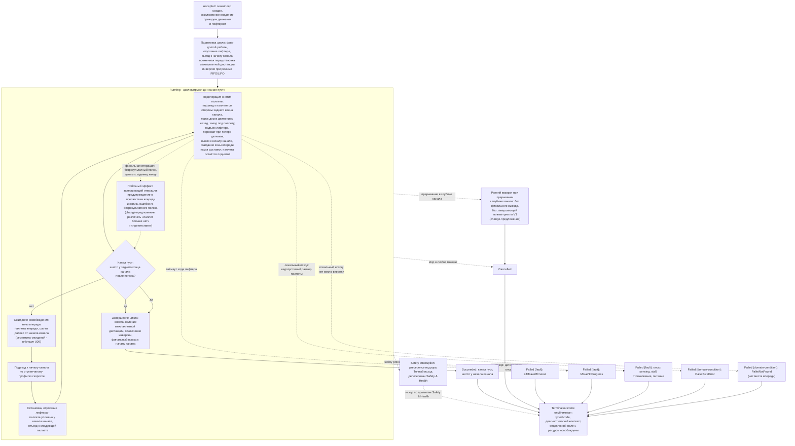

# Алгоритмическая документация операции LongUnload (V3)

Статус: подготовлено по issue [«Алгоритмическая документация: LongUnload»](https://github.com/Driadix/ShuttleControllerV3/issues/35) карты [«Спроектировать спецификацию и план прошивки контроллера V3»](https://github.com/Driadix/ShuttleControllerV3/issues/1). Окончательное утверждение ревизий выполняется на gate `G1 Behavioral Contract`.

Формат документа задан [«Формат алгоритмической документации операций V3»](./algorithmic-documentation-format-v3.md): 12-раздельный каркас, трёхслойное разделение содержание/evidence/структура, narrative на русском языке без формул и чисел, идентификаторы на английском. Общая рамка admission, ownership, надзора, прерываний и публикации outcomes задана [«Глобальной алгоритмической документацией работы шаттла V3»](./global-algorithmic-documentation-v3.md); lifecycle, identity, admission и idempotency заданы [«Общим semantic contract операций V3»](./semantic-contract-v3.md).

Evidence: [Capability Evidence Slices каталога операций V3](https://github.com/Driadix/ShuttleControllerV3/blob/research/v3-capability-evidence-slices/docs/research/v3-capability-evidence-slices.md) (ветка `research/v3-capability-evidence-slices`), раздел «LongUnload (CMD_LONG_UNLOAD = 0x23)» группы «LongLoad / LongUnload / LongUnloadQuantity», а также разделы «Флаг longWork», «FIFO/LIFO», «Условия остановки циклов (ключевой инвариант)» и «Явно зафиксированные мёртвый код / ordering-баги» той же группы и раздел «Общие entry points и dispatch skeleton»; канонический snapshot V1 - `Driadix/ShuttleController@708d090`. Далее ссылки вида «bundle, ...» указывают на этот документ.

## 1. Identity и назначение

`LongUnload` - root operation type каталога V3 (решение [«Определить каталог и базовые инварианты операций V3»](https://github.com/Driadix/ShuttleControllerV3/issues/9)). Допустимая роль экземпляра - root; child-роль контракт типа не предусматривает: операция исполняется из внешнего запроса, а субоперации порождает сама (раздел 10).

Доменная цель - непрерывная выгрузка канала: многократно снимать паллеты, каждый раз добираясь до паллеты со стороны заднего конца канала, и переносить снятую паллету к началу канала, укладывая её у начала, пока канал не опустеет. Операция повторяет цикл снятия и укладки до тех пор, пока физическое состояние канала не покажет, что паллет больше нет; заранее известное число паллет не требуется и `MaxIterations` не вводится.

Ключевой инвариант: операция завершается по состоянию «канал пуст», которое наблюдается как достижение шаттлом заднего конца канала после безрезультатного поиска паллеты (условие `ChannelEmptyRearEnd`, раздел 8). Отсутствие паллеты проявляется как «дожим» шаттла к заднему концу во время поиска досок, а не как отдельный штатный выход «паллета не найдена»: в V1 отдельного нормального завершения по отсутствию паллеты нет (bundle, «Условия остановки циклов», пункты 3 и 6). Побочный эффект завершающей итерации - предупреждение о препятствии впереди и запись ошибки из финального поиска досок; в V3 это наблюдается как часть нормального завершения, а не как fault (разделы 5, 11).

Отношение к другим документам: admission-скелет, stop propagation, fault semantics, link-loss рамка и публикация outcomes не повторяются здесь, а применяются по глобальному документу и semantic contract; документ фиксирует только доменный алгоритм `LongUnload` и его тип-специфичные paths, условия и исходы. Шаг снятия и переноса одной паллеты делегируется подоперации `unload_Pallete`, общей с одиночной выгрузкой и с `LongUnloadQuantity` (раздел 10).

## 2. Admission и условия входа

Запрос поступает от `Control Client` в пределах выданных полномочий; `Safety Authority` и `Service Client` этот тип не запрашивают. Envelope, epoch fencing, idempotency и конфликтная семантика - по semantic contract.

Параметры: операция не несёт аргументов (V1 - команда `CMD_LONG_UNLOAD` без аргумента; `Cntrl_V2/ShuttleProtocol.h:L109`). Типизированных параметров контракт типа не вводит.

Системные preconditions (по глобальному документу, раздел 2): provisioning gate, fault-state gate, наличие в канале (для `LongUnload` внеканальное исполнение не разрешено - команда не входит в exempt-список in-channel проверки), эксклюзивность (одна активная Exclusive Control Activity). В V1 занятость отсекается через `canAcceptCommandNow` с fallback `isShuttleIdle()` (bundle, «Общие entry points и dispatch skeleton», пункт 6): требуется остановленное состояние шаттла. Отрицательный результат - `Rejected` со стабильным rejection code, экземпляр не создаётся.

При приёмке запроса V1 сбрасывал признак последней паллеты (bundle, раздел «Общие entry points и dispatch skeleton», пункт 8); этот сброс входит в V3 как подготовка доменного состояния на admission (признак канала-полного/позиции последней укладки для последующих проверок отсутствует на старте).

Согласованность с semantic contract:

- атомарный admission: V1-паттерн повторной проверки принятия после положительного ACK не переносится (решение [«Специфицировать общий semantic contract операций V3»](https://github.com/Driadix/ShuttleControllerV3/issues/13); глобальный документ, раздел 11);
- idempotency/conflict по `(controllerEpoch, authorityId, requestId)` и `ResourceConflict` при занятой активности применяются по semantic contract;
- экземпляр создаётся только после успешного admission; `Rejected` в lifecycle принятого экземпляра не появляется.

Условия, проверяемые только in-situ после принятия (дают runtime outcome, а не `Rejected`):

- стартовый gate freshness направленного sensing при первом движении (условие `MotionFreshnessPermit`; глобальный документ, раздел 8) - провал даёт fault-путь;
- настройка режима FIFO/LIFO: при включённом режиме операция инвертирует физическое направление движения и маппинг сенсоров на время работы (раздел 5, «FIFO/LIFO»);
- состояние канала на старте: подготовительный выезд к началу канала выполняется как доменный шаг normal path, а не как admission-проверка.

## 3. Normal path

Именованные доменные данные narrative: начало канала, задний конец канала, зона паллет (передняя и задняя), межпаллетная дистанция укладки, дистанция отъезда между циклами, пауза доставки, зона впереди (место укладки у начала канала).

1. **Принятие.** Admission пройден, экземпляр в `Accepted`, положительный ACK выдан authority. Root получает эксклюзивное владение приводом движения и лифтером; sensing предоставляется как сервис платформы.
2. **Подготовка к циклу.** Активируется режим долгой выгрузки: флаг долгой работы поднят (лифтер на время перевозки несёт паллету поднятой - раздел 6), лифтер опускается, выполняется подготовительный выезд к началу канала. На время операции межпаллетная дистанция переустанавливается на фиксированное значение (временный override, восстановление в конце; документированное поведение, разделы 8, 11). При включённом режиме FIFO/LIFO выполняется инверсия направления и сенсоров (раздел 5, «FIFO/LIFO»).
3. **Цикл выгрузки** (condition-driven, раздел 4). Каждая итерация:
   а. **Снятие паллеты** - подоперация `unload_Pallete` (раздел 10): подъезд к паллете со стороны заднего конца канала, поиск досок движением назад, заезд под паллету по передней и задней доске с выдержками под доской, контроль длины паллеты, подъём лифтера с паллетой, перехват при потере прослеживания передних датчиков (короткий выезд вперёд и возврат назад до повторного захвата либо до заднего конца канала), вывоз паллеты к началу канала: движение к месту укладки, ожидание свободы зоны впереди, пауза доставки, ступенчатый подъезд к началу канала. Из-за флага долгой работы опускание паллеты в подоперации пропускается: паллета остаётся на поднятом лифтере (раздел 6).
   б. **Проверка цели.** После снятия проверяется состояние канала: если шаттл после поиска досок дошёл до заднего конца канала (наблюдение: дистанция до заднего конца канала ниже порога `ChannelEmptyRearEnd`, признаков ошибок нет) - канал пуст, цикл завершается (шаг 4). Признак «паллета не найдена» не является отдельным штатным выходом: отсутствие паллеты наблюдается как дожим к заднему концу канала во время поиска.
   c. Если канал не пуст: ожидание освобождения зоны впереди - пока паллетный датчик видит паллету впереди (прежняя укладка ещё не забрана конвейером/погрузчиком) и шаттл далеко от начала канала (условие `RearEndApproachWait`). Таймаута нет; семантика ожиданий доставки - unknown U09 (разделы 5, 8).
   d. **Подъезд к началу канала**: если шаттл ещё далеко от начала канала, цикл движения по ступенчатому профилю скорости до ближнего порога у начала канала.
   e. **Укладка и отъезд**: остановка привода, опускание лифтера (паллета, оставленная подоперацией поднятой, укладывается у начала канала), отъезд назад на дистанцию отъезда к следующей паллете; цикл повторяется с шага а.
4. **Завершение: финальный выезд.** Цикл вышел по «канал пуст». Восстанавливается межпаллетная дистанция; при режиме FIFO/LIFO инверсия выключается. Выполняется финальный выезд к началу канала, остановка, экземпляр завершает алгоритм `Succeeded`.
5. **Публикация.** Ресурсы и делегирования освобождены, terminal outcome опубликован, snapshot обновлён (позиция у начала канала, лифтер опущен). Платформа готова к новому запросу.

Инвариант соблюдается: `Succeeded` публикуется только при достигнутой доменной цели - канал пуст и финальный выезд к началу канала завершён. Останов до достижения цели любым путём даёт соответствующий ненулевой исход (раздел 5). Если финальный выезд прерван stop-ом, экземпляр завершается `Cancelled`, а не `Succeeded`.

## 4. Ожидания и повторения

Длительные активности внутри `Running` с явными условиями входа и выхода:

- **Цикл выгрузки** (condition-driven повторение): вход - после подготовки и подготовительного выезда к началу канала; каждая итерация создаёт один вызов подоперации снятия паллеты и при необходимости движения ожидания, подъезда и отъезда; выход - условие «канал пуст» (раздел 3, шаг 3б), а также в любой момент stop, детектированный отказ или срабатывание надзора. Число итераций заранее неизвестно; `MaxIterations` не вводится.
- **Подоперация снятия паллеты**: вход - шаттл у начала канала либо после отъезда от предыдущей укладки; выход - паллета снята и перенесена к началу канала (оставаясь поднятой), либо локальный исход подоперации (раздел 5), либо прерывание. Детали поиска, перехвата и вывоза задаются документом подоперации/одиночной выгрузки; настоящий документ фиксирует только решения цикла над ней.
- **Ожидание освобождения зоны впереди**: вход - после снятия паллеты, когда паллетный датчик видит паллету впереди и шаттл далеко от начала канала (условие `RearEndApproachWait`); выход - зона впереди свободна либо шаттл оказался близко к началу канала. Таймаута нет; семантика ожиданий доставки - unknown U09 (раздел 8). В V1 ожидание прерывается проверкой прерывания цикла с остановкой привода.
- **Пауза доставки**: ожидание с выдержкой времени перед вывозом паллеты к началу канала (условие `DeliveryPause`); вход - после освобождения зоны впереди, выход - по истечении паузы либо по прерыванию. Входит в подоперацию снятия.
- **Подъезд к началу канала**: condition-driven цикл движения от порога начала подъезда до ближнего порога у начала канала со ступенчатым профилем скорости (условия `StartApproachThreshold`, `ApproachSpeedProfile`); выход - достижение ближнего порога, прерывание либо сближение с препятствием впереди (остановка вывоза).
- **Поиск досок в подоперации**: condition-driven движение назад по задней зоне канала с профилем скорости по дистанции до заднего конца (условие `BoardSearchTimeout`); выход - обнаружение доски (передней либо задней), дожим до заднего конца канала (признак «паллет больше нет», входит в условие «канал пуст»), прерывание.

Warn-and-continue поведения: предупреждение о препятствии впереди по таймауту поиска досок (без изменения статуса операции) не прерывает `Running`: на завершающей итерации оно становится побочным эффектом штатного завершения «канал пуст», на нефинальных итерациях цикл повторяет поиск. Observable event фиксируется, статус не меняется (разделы 5, 11).

## 5. Прерывания

Рамка stop/fault/safety precedence - глобальный документ, раздел 5; здесь зафиксированы тип-специфичные paths.

### Stop

Stop принимается в любой момент после принятия экземпляра - во время подготовки, в подоперации, в ожиданиях, на подъезде, на отъезде и в финальном выезде - и переводит его в `Stopping`: детерминированный безопасный останов привода движения, лифтер по правилам безопасного останова, освобождение ресурсов, исход `Cancelled`. Нормативный безопасный останов охватывает все actuator-ы экземпляра: в V1 abort-пути лифтера не выдавали останов лифтерного привода (bundle, «Сквозные замечания» п. 7; глобальный документ, раздел 11); дефект не переносится.

Тип-специфичные особенности stop-семантики V1:

- **Ранний возврат**: если цикл остановлен в глубине канала (шаттл далеко от начала канала) либо активен fault, V1 возвращал управление без финального выезда и без завершающей телеметрии (bundle, LongUnload - Stop/fault/abort, «Ранний return dispatch»). В V3 это наблюдается как `Cancelled` с усечённой публикацией телеметрии; предложение change - публиковать terminal outcome в любом случае (раздел 11).
- **Потеря ручного останова**: различие между stop и manual stop терялось - сохранённый ручной останов перезаписывался при финальном выезде dispatch-а, а ранний возврат его не распознавал. V3 различает оба класса control intent; дефект V1 зафиксирован как change-предложение (раздел 11).
- **Прерывание в подоперации**: при прерывании в ожиданиях и движениях подоперации V1 останавливал привод и возвращался в цикл; часть abort-путей подоперации при режиме FIFO/LIFO не восстанавливала инверсию (утечка состояния, раздел 11). V3 восстанавливает конфигурационное состояние на всех путях прерывания.

Состояние в момент останова сохраняется в snapshot: шаттл может находиться с поднятой паллетой, с уложенной паллетой у начала канала, в глубине канала или у заднего конца; частичная выгрузка остаётся фактическим состоянием.

### Fault

Fault - детектированный внутренний отказ; экземпляр завершается `Failed` с кодом класса `fault` и диагностическим контекстом. Тип-специфичные детектируемые условия:

- `LiftTravelTimeout` - таймаут хода лифтера при подъёме/опускании (включая укладку у начала канала; общее условие лифтера, детализируется документом `LiftTo`).
- `MoveNoProgress` - отсутствие приращения позиции в отведённом окне при командованном движении (общее условие движения, детализируется документом `MoveDistance`; в этой операции наблюдается на отъезде и подъездах). Выставляется надзором операции, а не выбирается алгоритмом.
- Отказ или потеря freshness направленного sensing при движении (force-stop при невалидном канальном сенсоре направления) и провал gate на старте движения - fault по правилам надзора; классификация конкретного сенсорного кода - `Safety & Health`.
- Столкновение, stall привода, питание ниже порога, перегрузка лифтера по правилам `Safety & Health` - сквозные paths надзора (глобальный документ, раздел 5).

Локальные исходы подоперации, завершающие операцию в V1 сменой статуса на stop, в V3 классифицируются как domain-condition (ниже), а не как fault: неисправность сенсора при положительных признаках отказа остаётся fault-путём.

### Domain-condition

Domain-condition - наблюдаемое состояние мира, делающее цель недостижимой; исход `Failed` с кодом класса `domain-condition`, severity warning level по коду. Коды именуются по V1-соответствиям (раздел 11):

- `PalletSizeError` - снятая паллета имеет недопустимый размер (длина превышает норму профиля): канал не может быть выгружен штатным циклом на этой паллете. В V1 - `WARN_PALLET_SIZE_ERROR` с поворотом к началу канала и остановкой.
- `PalletNotFound` - при снятии паллеты нет места впереди, куда её везти (зона укладки у начала канала недоступна): перенос не может быть выполнен. В V1 - `WARN_PALLET_NOT_FOUND`; семантическое несоответствие имени наблюдаемому условию («нет места впереди» сообщается как «паллета не найдена») зафиксировано в unknown U09 (раздел 8).
- Побочный `ObstacleAhead` на завершающей итерации (предупреждение о препятствии впереди по таймауту поиска досок) не является отдельным исходом: он наблюдается как часть нормального завершения «канал пуст»; предложение change - различать «паллет больше нет» и «препятствие впереди» (раздел 11).

Отсутствие паллеты как отдельный domain-condition исход отсутствует: операция не завершается «паллета не найдена», а дожимает до заднего конца канала - это и есть условие «канал пуст» (раздел 3; bundle, «Условия остановки циклов», пункт 3).

### Safety interruption

Точки safety-прерывания операции: gate freshness направленного sensing при старте движения (подготовка, подъезд, отъезд, выезд); надзор во время движения и хода лифтера (потеря freshness, столкновение, stall, питание, перегрузка лифтера); bumper и переходные cross-cutting пути. При срабатывании Safety Authority применяет precedence к operation intents и при необходимости инициирует авторизованные safety operations (в том числе `Evacuate` как отдельный root instance). Точный исход прерванного экземпляра делегирован `Safety & Health` и здесь не выдумывается.

### Link-loss

`LongUnload` - автономная операция; назначенная link-loss policy - `continue`: после потери инициатора экземпляр продолжает исполнение до собственного terminal outcome (V1 baseline: автономное исполнение не зависит от наличия связи; глобальный документ, раздел 5).

## 6. Recovery и состояние после прерывания

Возобновление всегда явное - новый запрос; generic pause/resume операции не свойственен.

- **После `Cancelled` (stop/manual stop):** шаттл остановлен в фактическом положении (паллета поднята либо уложена, лифтер в фактическом состоянии), привод и лифтер остановлены, ресурсы освобождены; snapshot несёт фактическое состояние. Продолжение - новым запросом `LongUnload` для оставшихся паллет либо иной операцией с учётом фактического состояния; частичная выгрузка остаётся физической реальностью.
- **После `Cancelled` (прерывание в глубине канала):** шаттл останавливается в глубине канала без финального выезда; V1 не публиковал завершающую телеметрию на этом пути (раздел 11, предложение change). В V3 публикация terminal outcome обязательна; возобновление - новым запросом.
- **После `Failed` (fault):** fault удерживается (latched semantics); платформа допускает только override/service-действия; recovery через `ClearFault` с baseline-условиями снятия (квалифицированное восстановление sensing/шины и физическая неподвижность) по глобальному документу, раздел 6. Прерванная операция не возобновляется.
- **После `Failed` (domain-condition):** физическое состояние сохраняется: паллета на лифтере либо у начала канала, частично выгруженный канал; snapshot несёт код и диагностический контекст. Продолжение - явным новым запросом с учётом фактического состояния (например, устранить препятствие либо снять проблемную паллету и повторить).
- **После safety interruption:** состояние и исход по правилам `Safety & Health`; при эвакуации шаттл достигает начала канала, лифтер опущен (глобальный документ, раздел 6).
- **Состояние конфигурации после прерывания:** временный override межпаллетной дистанции и инверсия FIFO/LIFO в V1 восстанавливались на большинстве abort-путей, но три пути подоперации при режиме FIFO/LIFO возвращались без восстановления (утечка `inverse`: abort дожима, warning-путь длины паллеты и warning-путь «нет места впереди»; раздел 11). V3 требует восстановления на всех путях прерывания; snapshot отражает фактическое конфигурационное состояние.

## 7. Terminal outcomes и наблюдаемые результаты

Принятый экземпляр завершается одним из terminal states; `Rejected` относится только к запросу.

| Исход | Класс | Наблюдаемое условие |
| --- | --- | --- |
| `Succeeded` | - | канал пуст: шаттл после безрезультатного поиска досок дошёл до заднего конца канала, финальный выезд к началу канала завершён |
| `Cancelled` | stop | принят stop (включая manual stop по lease-семантике V3); детерминированный безопасный останов привода и лифтера завершён; прерывание в глубине канала - без финального выезда |
| `Failed` | `fault` | `LiftTravelTimeout`, `MoveNoProgress`, отказ/потеря freshness направленного sensing, stall, столкновение, питание ниже порога, перегрузка лифтера по правилам `Safety & Health` |
| `Failed` | `domain-condition` | `PalletSizeError` (недопустимый размер паллеты), `PalletNotFound` (нет места впереди для снятой паллеты; именование по V1, семантика - U09) |

Outcome содержит стабильный typed code и минимальный диагностический контекст: фаза остановки (паллета поднята/уложена), позиция в канале, зона, свидетельства sensing (дистанции канала и паллетные), счётчик снятых паллет, применяемый режим FIFO/LIFO. Таксономия typed codes и назначение severity фиксируются `External Semantic & Transport Contracts` и `Observability & Diagnostics`; имена условий выше - observation-based имена, принятые этим документом.

Внешняя видимость - по semantic contract: положительный ACK при принятии, terminal outcome при завершении, query snapshot как authoritative read-модель. Observable events: принятие, старт подготовки, снятие очередной паллеты (по счётчику), укладка у начала канала, финальный выезд, terminal outcome; события предупреждений (`ObstacleAhead` на завершающей итерации и иные) публикуются как observable events и не прерывают `Running`. V1-наблюдаемые: счётчик снятых паллет увеличивается за каждую снятую паллету; состояние `STATE_LONG_UNLOAD` в телеметрии; кадры телеметрии только на входе/выходе операции (внутрицикловой рассылки в безаргументном варианте нет - предложение change, раздел 11); bookkeeping позиции последней паллеты после каждой укладки; `endOfChannel` может быть установлен в перехвате - сброса при старте длинных операций в V1 нет (раздел 11).

## 8. Timing conditions

Унаследованные timing-условия V1 для `LongUnload`. Количественные значения остаются в evidence; новые количественные значения документ не вводит. Каждый anchor - полный путь V1 по каноническому snapshot с пояснением раздела bundle.

| Условие | Класс | Anchor | Disposition |
| --- | --- | --- | --- |
| `InterPalleteDistanceOverrideUnload` - временный override межпаллетной дистанции на время цикла выгрузки (установка и восстановление) | configured | `Cntrl_V2/Cntrl_V2.ino:L6368-L6369` и `Cntrl_V2/Cntrl_V2.ino:L6451` (bundle, LongUnload - Timing conditions) | preserve: документированное поведение разреживания укладки |
| `ChannelEmptyRearEnd` - порог «канал пуст»: шаттл у заднего конца канала | configured | `Cntrl_V2/Cntrl_V2.ino:L6389-L6394` (bundle, LongUnload - Timing conditions; Условия остановки циклов, пункт 3) | preserve: ключевой инвариант завершения |
| `RearEndApproachWait` - пороги ожидания освобождения зоны впереди (паллетный датчик видит паллету впереди и шаттл далеко от начала канала) | configured | `Cntrl_V2/Cntrl_V2.ino:L6402-L6417` (bundle, LongUnload - Timing conditions) | preserve; семантика ожиданий доставки - unknown U09 |
| `StartApproachThreshold` - пороги начала подъезда к началу канала | configured | `Cntrl_V2/Cntrl_V2.ino:L6418-L6446` (bundle, LongUnload - Timing conditions) | preserve |
| `ApproachSpeedProfile` - ступени скорости подъезда к началу канала по дистанции | configured | `Cntrl_V2/Cntrl_V2.ino:L6437-L6442` (bundle, LongUnload - Timing conditions) | preserve как tuning-политика |
| `InterCycleRetreat` - дистанция отъезда назад между циклами (длина шаттла с добавкой) | configured | `Cntrl_V2/Cntrl_V2.ino:L6447-L6449` (bundle, LongUnload - Timing conditions) | preserve как доменный шаг; значение - tuning |
| `PalletApproachStartDist` - порог начала подъезда к паллете в подоперации | configured | `Cntrl_V2/Cntrl_V2.ino:L5345-L5349` (bundle, LongUnload - Timing conditions) | preserve |
| `BoardSearchFixedLap` - фиксированный проезд после передней доски (профильные значения 800/1000/1200) | configured | `Cntrl_V2/Cntrl_V2.ino:L5378-L5389` (bundle, LongUnload - Timing conditions; Профильные варианты) | preserve как tuning |
| `BoardDwellCount` - число выдержек под задней доской (база и профильные правки) | configured | `Cntrl_V2/Cntrl_V2.ino:L5392-L5426` (bundle, LongUnload - Timing conditions) | preserve как tuning |
| `BoardSearchTimeout` - таймаут поиска задней доски (формула от maxSpeed) | inferred | `Cntrl_V2/Cntrl_V2.ino:L5453-L5462` (bundle, LongUnload - Timing conditions) | preserve концепцию; безрезультатный поиск даёт `ObstacleAhead` без смены статуса - предложение change (раздел 11) |
| `RearEndSearchStop` - дожим до заднего конца канала при поиске (признак «паллет больше нет») | configured | `Cntrl_V2/Cntrl_V2.ino:L5453-L5462` (bundle, LongUnload - Timing conditions) | preserve: вход условия «канал пуст» |
| `NoDropZoneGate` - порог «нет места впереди» в подоперации | configured | `Cntrl_V2/Cntrl_V2.ino:L5476-L5485` (bundle, LongUnload - Timing conditions) | preserve; именование по V1 `WARN_PALLET_NOT_FOUND`, семантическое несоответствие - unknown U09 |
| `PstnCaptureDistance` - порог фиксации позиции для bookkeeping последней паллеты | configured | `Cntrl_V2/Cntrl_V2.ino:L5487-L5490` (bundle, LongUnload - Timing conditions) | preserve |
| `RecaptureDistanceProfile` - дистанции перехвата по профилю | configured | `Cntrl_V2/Cntrl_V2.ino:L5493-L5497` (bundle, LongUnload - Timing conditions; Профильные варианты) | preserve |
| `CarryZoneFreeGate` - порог ожидания свободы зоны при вывозе (без таймаута) | configured | `Cntrl_V2/Cntrl_V2.ino:L5561-L5572` (bundle, LongUnload - Timing conditions) | preserve; семантика ожиданий доставки - unknown U09 |
| `DeliveryPause` - пауза доставки перед вывозом к началу канала (параметризуемая) | configured | `Cntrl_V2/Cntrl_V2.ino:L5575-L5590` (bundle, LongUnload - Timing conditions) | preserve |
| `CarryStopNearFront` - останов вывоза при сближении с препятствием впереди | configured | `Cntrl_V2/Cntrl_V2.ino:L5613-L5626` (bundle, LongUnload - Timing conditions) | preserve |
| `EarlyReturnDistance` - порог раннего возврата dispatch по дистанции до начала канала | configured | `Cntrl_V2/Cntrl_V2.ino:L3367-L3369` (bundle, LongUnload - Entry points и call sites) | preserve как baseline; несогласованность порога с порогами подъезда - предложение change (раздел 11) |
| `LiftTravelTimeout` - таймаут хода лифтера | configured | `Cntrl_V2/Cntrl_V2.ino:L2412-L2417` и `Cntrl_V2/Cntrl_V2.ino:L2501-L2506` (bundle, LongUnload - Stop/fault/abort) | preserve; детализирует документ `LiftTo` |
| `MoveNoProgressWindow` - окно отсутствия прогресса движения | configured | `Cntrl_V2/Cntrl_V2.ino:L5182-L5189` и `Cntrl_V2/Cntrl_V2.ino:L5177-L5181` (bundle, LongUnload - Stop/fault/abort) | preserve; детализирует документ `MoveDistance` |
| `MotorStopCarryMode` - специальный профиль останова при выезде с поднятой паллетой | configured | `Cntrl_V2/Cntrl_V2.ino:L2288-L2316` (bundle, LongUnload - Resource effects) | preserve; физическое подтверждение паттерна - unknown U10 |

Unknowns:

- **U09** (семантика ожиданий доставки unload-группы: ожидания зоны впереди `Cntrl_V2/Cntrl_V2.ino:L6402-L6417`, ожидания свободы зоны при вывозе `Cntrl_V2/Cntrl_V2.ino:L5561-L5572`, пауза доставки `Cntrl_V2/Cntrl_V2.ino:L5575-L5590`, ситуация «нет места впереди» сообщается как `WARN_PALLET_NOT_FOUND` - семантическое несоответствие): владелец - владелец; стадия закрытия - gate контрактов unload-группы; блокирующий, влияет на внешнюю семантику пути `PalletNotFound` (раздел 5). Документ не разрешает U09: поведение V1 описано как есть, классификация пути зафиксирована.
- **U07** (фактические runtime-значения конфигурации: распределение профилей, maxSpeed, chnlOffset, interPalleteDistance, waitTime; владелец - владелец и полевые данные; стадия закрытия - до декомпозиции профильных требований; глобальный документ, раздел 9): настоящий документ U07 не блокирует - операция не имеет профильных ветвлений алгоритма, значения тюнинга остаются в evidence, валидация профиля - `Configuration & Calibration`.
- **U10** (назначение специального паттерна останова при выезде с грузом - повторные нулевые кадры скорости; владелец - HIL-испытание; стадия закрытия - gate hardware-in-the-loop): preserve до подтверждения на железе (раздел 11).
- **Двойной конфигурационный флаг FIFO/LIFO** (fifoLifo + inverse с одним физическим эффектом и асимметричным пересчётом координаты, `Cntrl_V2/Cntrl_V2.ino:L4037-L4049`): не блокирует нормативную спецификацию (поведение в long-цикле установлено из source); предложение унификации - решение владельца на gate контракта LongUnload (раздел 11).

## 9. Профильные варианты

Доменный алгоритм `LongUnload` не имеет профильных ветвлений на уровне цикла; профильные значения сосредоточены в подоперации снятия паллеты и в геометрии канала (bundle, LongUnload - Профильные варианты; «Профильные варианты 800/1000/1200 - сводка»):

- фиксированный проезд после передней доски: базовое значение для всех профилей, отдельное значение для 1200; для 800 у заднего конца канала используется отдельное значение (активная профильная ветка, в отличие от load-пути);
- число выдержек под задней доской: база с правками по профилю 1200 и по близости к заднему концу канала; в unload-пути база отличается от load-пути;
- контроль длины паллеты: норма длины из длины шаттла; профильные вычеты закомментированы в V1 (мёртвый код, раздел 11);
- дистанции перехвата: три значения по профилям 800/1000/1200;
- поправка остановки перед паллетой для 1000/1200 при вывозе.

Дистанция укладки вычисляется из позиции последней паллеты и межпаллетной дистанции (временный override) и зависит от профиля через длину шаттла. Закомментированные профильные правки не переносятся как нормативное поведение (раздел 11). Валидация профиля как набора механических параметров - `Configuration & Calibration` (unknown U07, владелец - владелец и полевые данные).

## 10. Composition boundaries

По V1 baseline операция составная: она владеет подоперацией снятия паллеты и вызывает примитивы движения и лифтера.

- **Suboperation**: `unload_Pallete` - подоперация, общая с одиночной выгрузкой `UnloadPallet` и с `LongUnloadQuantity` (bundle, LongUnload - Entry points и call sites; общие подфункции группы). В `LongUnload` она создаётся циклом как child: шаг снятия и переноса одной паллеты, делегированный из цикла; результат цикла определяется собственным sensing-условием родителя («канал пуст»), а не исходом child. Отличие от одиночной выгрузки зафиксировано контрактом долгой работы: опускание паллеты законтрактовано родителю - child оставляет паллету поднятой, укладка выполняется явным шагом родителя между снятиями (раздел 6, «Флаг longWork»).
- **Primitives** (не имеют собственной operation identity и lifecycle): примитивы движения - выезд к началу канала, отъезд на дистанцию между циклами, ступенчатые подъезды, управляемый останов привода со специальным профилем для поднятой паллеты; примитивы лифтера - подъём, опускание, останов с контролем концевиков и таймаута; детекция досок и паллет (паллетные датчики с debounce); обслуживание дистанций и freshness направленного sensing (сервис платформы); примитивы надзора (stall, ToF-safety, bumper).
- **Ресурсы:** root эксклюзивно владеет приводом движения и лифтером до завершения; child-подоперация получает делегированный набор (движение и лифтер в рамках своего шага) и не приобретает ресурсы за пределами delegation; после отзыва delegation child не продолжает доменный шаг (semantic contract). Sensing предоставляется как сервис платформы.
- **FIFO/LIFO**: механизм инверсии физического направления и маппинга сенсоров исполняется на уровне родительского цикла (включение/выключение вокруг операции и вокруг каждого снятия), не является отдельной suboperation.

## 11. V1 dispositions и evidence

Evidence anchors - bundle, разделы «LongUnload (CMD_LONG_UNLOAD = 0x23)», «Флаг longWork», «FIFO/LIFO», «Условия остановки циклов (ключевой инвариант)», «Явно зафиксированные мёртвый код / ordering-баги»; канонический snapshot V1 `Driadix/ShuttleController@708d090`. Предложения, помеченные «предложение change - решение владельца на gate контракта LongUnload», решениями владельца не подтверждены и остаются предложениями до G1.

| Поведение V1 | Evidence | Disposition | Основание |
| --- | --- | --- | --- |
| Dispatch-структура `CMD_LONG_UNLOAD = 0x23`: флаг долгой работы, опускание лифтера, выезд к началу канала, цикл выгрузки, финальный выезд, `send_Cmd` | `Cntrl_V2/Cntrl_V2.ino:L3359-L3373` (bundle, LongUnload - Entry points и call sites) | preserve: корневая структура непрерывной выгрузки | каталог (issue [«Определить каталог и базовые инварианты операций V3»](https://github.com/Driadix/ShuttleControllerV3/issues/9)); инвариант длинных операций |
| Завершение по «канал пуст»: шаттл у заднего конца канала после безрезультатного поиска; отдельного выхода «паллета не найдена» нет | `Cntrl_V2/Cntrl_V2.ino:L6389-L6394` (bundle, Условия остановки циклов, пункт 3) | preserve: ключевой инвариант завершения | bundle, Условия остановки циклов, пункты 3, 6; инвариант `Succeeded` (формат, issue [«Зафиксировать формат и acceptance criteria алгоритмической документации V3»](https://github.com/Driadix/ShuttleControllerV3/issues/15)) |
| Финальный выезд к началу канала после завершения цикла | `Cntrl_V2/Cntrl_V2.ino:L3369-L3372` (bundle, LongUnload - Entry points и call sites) | preserve: доменный шаг «шаттл у начала канала»; прерывание выезда - `Cancelled` | semantic contract lifecycle; инвариант `Succeeded` |
| Ранний возврат после цикла без финального выезда и без завершающей телеметрии (stop в глубине канала либо active fault) | `Cntrl_V2/Cntrl_V2.ino:L3367-L3368` (bundle, LongUnload - Stop/fault/abort) | change (предложение): terminal outcome публикуется в любом случае; V1-усечение телеметрии не переносится | предложение change - решение владельца на gate контракта LongUnload; semantic contract (публикация terminal outcome) |
| Порог раннего возврата не согласован с порогами подъезда к началу канала (без учёта смещения канала) | `Cntrl_V2/Cntrl_V2.ino:L3367` (bundle, LongUnload - Stop/fault/abort) | change (предложение): единая система порогов | предложение change - решение владельца на gate контракта LongUnload |
| Потеря manual stop: сохранённый `CMD_STOP_MANUAL` перезаписывается финальным выездом, ранний возврат его не распознаёт | `Cntrl_V2/Cntrl_V2.ino:L3359-L3373` и `Cntrl_V2/Cntrl_V2.ino:L3367-L3368` (bundle, LongUnload - Stop/fault/abort; Явно зафиксированные, пункт 6) | change (предложение): stop и manual stop различаются по lease-семантике V3 | предложение change - решение владельца на gate контракта LongUnload; lease-модель (issue [«Определить system context и таксономию возможностей V3»](https://github.com/Driadix/ShuttleControllerV3/issues/2)) |
| Побочный `WARN_OBSTACLE_AHEAD` + `LOG_ERROR` на завершающей итерации (безрезультатный поиск досок) | `Cntrl_V2/Cntrl_V2.ino:L5453-L5462` (bundle, LongUnload - Observable outcomes) | change (предложение): различать «паллет больше нет» и «препятствие впереди»; штатное завершение не несёт ложного препятствия | предложение change - решение владельца на gate контракта LongUnload |
| `WARN_OBSTACLE_AHEAD` по таймауту поиска без смены статуса - повтор поиска без эскалации | `Cntrl_V2/Cntrl_V2.ino:L5453-L5462` (bundle, Условия остановки циклов, пункт 5; Явно зафиксированные, пункт 8) | change (предложение): счётчик повторов/эскалация на длительном безрезультатном поиске | предложение change - решение владельца на gate контракта LongUnload |
| `WARN_PALLET_SIZE_ERROR` при недопустимой длине паллеты: поворот к началу канала, остановка | `Cntrl_V2/Cntrl_V2.ino:L5428-L5441` (bundle, LongUnload - Stop/fault/abort) | change: domain-condition `PalletSizeError`, `Failed` класса domain-condition, warning-level severity | формат, классификация «недопустимый размер»; предложение change - решение владельца на gate контракта LongUnload |
| `WARN_PALLET_NOT_FOUND` при «нет места впереди»: опускание лифтера, движение к началу канала, остановка | `Cntrl_V2/Cntrl_V2.ino:L5476-L5485` (bundle, LongUnload - Stop/fault/abort) | change: domain-condition `PalletNotFound` (семантическое несоответствие имени - unknown U09) | формат, классификация «нет места»; предложение change - решение владельца на gate контракта LongUnload |
| Временный override межпаллетной дистанции на время цикла с восстановлением в конце | `Cntrl_V2/Cntrl_V2.ino:L6368-L6369` и `Cntrl_V2/Cntrl_V2.ino:L6451` (bundle, LongUnload - Шаги и переходы) | preserve: документированное поведение разреживания укладки | baseline; условие `InterPalleteDistanceOverrideUnload` (раздел 8) |
| Флаг долгой работы: паллета остаётся поднятой после вывоза, опускание делегировано циклу родителя | `Cntrl_V2/Cntrl_V2.ino:L3362`, `Cntrl_V2/Cntrl_V2.ino:L3366` (dispatch) и `Cntrl_V2/Cntrl_V2.ino:L5642-L5643`, `Cntrl_V2/Cntrl_V2.ino:L6447-L6449` (контракт) (bundle, Флаг longWork) | preserve: договорная деталь механизма длинной выгрузки «кто опускает лифт» | bundle, Флаг longWork (фактическая роль флага) |
| Асимметрия флага долгой работы (unload ставит, load нет) и мёртвая ветка в load-подоперации | `Cntrl_V2/Cntrl_V2.ino:L3362-L3366` против `Cntrl_V2/Cntrl_V2.ino:L3349-L3358` (bundle, Флаг longWork) | change (предложение): явный контракт «кто опускает лифт в long-цикле» либо удаление флага | предложение change - решение владельца на gate контракта LongUnload |
| Поддержка FIFO/LIFO: инверсия на время операции и вокруг каждого снятия; физически развёрнутый конец канала | `Cntrl_V2/Cntrl_V2.ino:L6371-L6372`, `Cntrl_V2/Cntrl_V2.ino:L6384-L6388`, `Cntrl_V2/Cntrl_V2.ino:L6452-L6453` (bundle, FIFO/LIFO) | preserve: направление long-операции FIFO/LIFO | bundle, FIFO/LIFO - Disposition proposals |
| Двойной конфигурационный флаг fifoLifo + inverse с одним физическим эффектом и асимметричным пересчётом координаты | `Cntrl_V2/Cntrl_V2.ino:L4037-L4049` (bundle, FIFO/LIFO) | change (предложение): единый признак с симметричным пересчётом | bundle, FIFO/LIFO - Disposition proposals; предложение change - решение владельца на gate контракта LongUnload |
| Утечка инверсии при режиме FIFO/LIFO на трёх выходах подоперации: abort дожима, warning-путь длины паллеты и warning-путь «нет места впереди»; последующие движения физически инвертированы | `Cntrl_V2/Cntrl_V2.ino:L5410-L5415`, `Cntrl_V2/Cntrl_V2.ino:L5432-L5441`, `Cntrl_V2/Cntrl_V2.ino:L5477-L5485` (bundle, Явно зафиксированные, пункт 12 - bundle фиксирует два пути, третий подтверждён по первоисточнику) | change (предложение): восстановление инверсии на всех путях прерывания | зафиксированная аномалия (bundle, пункт 12) и сверка с первоисточником; предложение change - решение владельца на gate контракта LongUnload |
| `endOfChannel` не сбрасывается при старте длинных операций | `Cntrl_V2/Cntrl_V2.ino:L4791`, `Cntrl_V2/Cntrl_V2.ino:L5316`, `Cntrl_V2/Cntrl_V2.ino:L5524` (bundle, Явно зафиксированные, пункт 11) | change (предложение): сброс состояния при старте операции | предложение change - решение владельца на gate контракта LongUnload |
| Специальный профиль останова при выезде с поднятой паллетой (укороченная рампа и повторные нулевые кадры) | `Cntrl_V2/Cntrl_V2.ino:L2288-L2316` (bundle, LongUnload - Resource effects) | preserve; unknown U10 (владелец - HIL-испытание) | глобальный документ, раздел 8; физическое подтверждение паттерна - gate hardware-in-the-loop |
| Профильные значения подоперации: активная ветка 800 у заднего конца, закомментированные правки | `Cntrl_V2/Cntrl_V2.ino:L5382-L5386` (активная) и `Cntrl_V2/Cntrl_V2.ino:L5429-L5431` (закомментирована) (bundle, LongUnload - Профильные варианты; Явно зафиксированные, пункт 5) | preserve для активных веток как tuning; exclude для закомментированного мёртвого кода | активные ветки - verified production tuning; мёртвый код не переносится (глобальный документ, раздел 11) |
| Телеметрия только на входе/выходе операции, без внутрицикловой рассылки | `Cntrl_V2/Cntrl_V2.ino:L3361` и `Cntrl_V2/Cntrl_V2.ino:L3372` (bundle, LongUnload - Observable outcomes) | change (предложение): периодическая рассылка в длинных ожиданиях | предложение change - решение владельца на gate контракта LongUnload; бюджеты - `Observability & Diagnostics` |

## 12. Диаграмма

Обязательная Mermaid-блок-схема алгоритма `LongUnload`. Источник diagram-as-code: [diagrams/src/long-unload-flow.mmd](../diagrams/src/long-unload-flow.mmd).

Narrative и диаграмма согласованы: каждое ветвление и ожидание narrative (подготовка цикла, подоперация снятия, проверка «канал пуст», ожидание освобождения зоны впереди, подъезд к началу канала, укладка и отъезд, побочный эффект завершающей итерации, финальный выезд, локальные исходы `PalletSizeError` и `PalletNotFound`, таймаут лифтера, отсутствие прогресса, stop и ранний возврат, сквозные fault-пути надзора, safety precedence, публикация outcome) присутствует на диаграмме, и каждая ветвь диаграммы описана в разделах 2-7.

## Ревью

- Ревьюер: независимая сессия (субагент), сверка по первоисточнику V1 и evidence bundle
- Вердикт: APPROVED
- Дата: 2026-08-06
- Результат: readiness checklist 10/10, blocking findings отсутствуют (повторное ревью после уточнения путей утечки инверсии до трёх)
