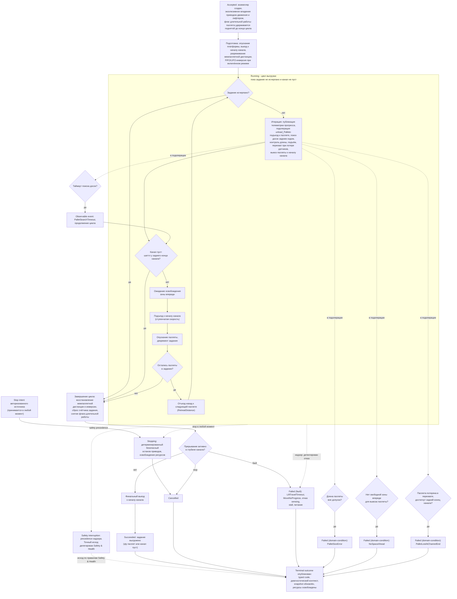

# Алгоритмическая документация операции LongUnloadQuantity (V3)

Статус: подготовлено по issue [«Алгоритмическая документация: LongUnloadQuantity»](https://github.com/Driadix/ShuttleControllerV3/issues/36) карты [«Спроектировать спецификацию и план прошивки контроллера V3»](https://github.com/Driadix/ShuttleControllerV3/issues/1). Окончательное утверждение ревизий выполняется на gate `G1 Behavioral Contract`.

Формат документа задан [«Формат алгоритмической документации операций V3»](./algorithmic-documentation-format-v3.md): 12-раздельный каркас, трёхслойное разделение содержание/evidence/структура, narrative на русском языке без формул и чисел, идентификаторы на английском. Общая рамка admission, ownership, надзора, прерываний и публикации outcomes задана [«Глобальной алгоритмической документацией работы шаттла V3»](./global-algorithmic-documentation-v3.md); lifecycle, identity, admission и idempotency заданы [«Общим semantic contract операций V3»](./semantic-contract-v3.md).

Evidence: [Capability Evidence Slices каталога операций V3](./research/v3-capability-evidence-slices.md), раздел «LongUnloadQuantity (CMD_LONG_UNLOAD_QTY = 0x24)» и разделы «Флаг longWork», «FIFO/LIFO», «Условия остановки циклов» группы «LongLoad / LongUnload / LongUnloadQuantity»; канонический snapshot V1 - `Driadix/ShuttleController@708d090`. Далее ссылки вида «bundle, …» указывают на этот документ.

## 1. Identity и назначение

`LongUnloadQuantity` - root operation type каталога V3 (решение [«Определить каталог и базовые инварианты операций V3»](https://github.com/Driadix/ShuttleControllerV3/issues/9)). Допустимая роль экземпляра - root; child-роль контракт типа не предусматривает: длинная выгрузка инициируется внешним запросом, а не композицией parent-операции.

Доменная цель - выгрузить из канала заданное количество паллет, доставляя каждую к началу канала; задание завершается досрочно, если канал стал пуст раньше, чем количество исчерпано. V1 реализовывал тип командой `CMD_LONG_UNLOAD_QTY` с байтовым аргументом количества; безаргументный вариант той же механики (`CMD_LONG_UNLOAD`) описан отдельным документом операции `LongUnload`, общая подоперация снятия и вывоза одной паллеты (`unload_Pallete`) разделяется обоими типами.

Отношение к другим документам: admission-скелет, stop propagation, fault semantics, link-loss рамка и публикация outcomes не повторяются здесь, а применяются по глобальному документу и semantic contract; документ фиксирует только доменный алгоритм `LongUnloadQuantity`, его тип-специфичные paths, условия и исходы.

## 2. Admission и условия входа

Запрос поступает от `Control Client` в пределах выданных полномочий; `Safety Authority` и `Service Client` этот тип не запрашивают. Envelope, epoch fencing, idempotency и конфликтная семантика - по semantic contract.

Параметры:

- `qty` - количество паллет к выгрузке: целое беззнаковое значение в диапазоне от нуля до верхней границы байтовой представимости, унаследованной от V1. V1 принимал аргумент без валидации, усечением до восьми бит (раздел 11); нормативные правила для нулевого значения и для значения, превышающего число паллет в канале, - предложение change (раздел 11). Нулевое значение в V1 порождает холостой прогон с финальным выездом к началу канала (раздел 3).

Системные preconditions (по глобальному документу): provisioning gate, fault-state gate, наличие в канале (для `LongUnloadQuantity` внеканальное исполнение не разрешено), эксклюзивность (одна активная Exclusive Control Activity). Занятость даёт `ResourceConflict`/`ACK_BUSY`-семантику по admission. Отрицательный результат - `Rejected` со стабильным rejection code, экземпляр не создаётся.

Тип-специфичные условия входа:

- команда обязана нести пакет аргумента (`MSG_CMD_WITH_ARG`); в V1 проверки типа сообщения нет: команда, пришедшая без аргумента, использует значение параметра от предыдущего запроса (раздел 11, предложение change);
- в режиме `MANUAL` команда не диспетчеризуется и отклоняется по занятости: в V1 ветки ручного режима для `CMD_LONG_UNLOAD_QTY` нет, в отличие от `LongLoad`/`LongUnload` (раздел 11, предложение change: зафиксировать как ограничение либо добавить ветку).

Условия, проверяемые только in-situ после принятия (дают runtime outcome, а не `Rejected`): пустой канал (шаттл у заднего конца канала) - досрочное успешное завершение задания; доменные условия недостижимости цели (длина паллеты вне допуска, отсутствие свободной зоны для вывоза, потеря паллеты при перехвате) - исходы раздела 5.

V1 повторно проверял занятость после уже отправленного положительного ACK; в V3 admission атомарен, повторная проверка исключена (решение [«Специфицировать общий semantic contract операций V3»](https://github.com/Driadix/ShuttleControllerV3/issues/13)).

## 3. Normal path

1. **Принятие.** Admission пройден, экземпляр в `Accepted`, положительный ACK выдан; параметр `qty` зафиксирован значением запроса. Root получает эксклюзивное владение приводом движения и лифтером; sensing предоставляется как сервис платформы. Признак «канал полон» сбрасывается, telemetry-состояние операции устанавливается (`STATE_LONG_UNLOAD_QTY`).
2. **Подготовка цикла.** Устанавливается флаг длительной работы: после вывоза паллета удерживается поднятой до конца цикла, а не опускается в подоперации. Платформа опускается, шаттл выезжает к началу канала.
3. **Настройка контекста выгрузки.** Межпаллетная дистанция временно разреживается на время операции (восстанавливается в финале). При включённом режиме FIFO/LIFO выполняется инверсия направления и сенсоров: выгрузка идёт с противоположного конца канала, порядок снятия меняется на LIFO.
4. **Цикл выгрузки** (раздел 4): пока задание не исчерпано и канал не пуст, на каждой итерации:
   - публикуется телеметрия прогресса итерации (наблюдаемый прогресс; в V1 - три публикации за итерацию, раздел 11);
   - подоперация `unload_Pallete` снимает одну паллету: подъезд к паллете, поиск досок задним ходом с фиксированным проездом после передней доски и выдержками под доской, контроль длины паллеты, подъём платформы, перехват паллеты при потере передних датчиков, вывоз паллеты к началу канала с ожиданием свободной зоны и паузой доставки;
   - проверяется условие «канал пуст»: шаттл у заднего конца канала - задание завершается досрочно, остаток количества отбрасывается;
   - при продолжающемся задании: ожидание освобождения зоны впереди, подъезд к началу канала, опускание паллеты, декремент счётчика задания;
   - отъезд назад к следующей паллете, если задание ещё не исчерпано; после последней паллеты отъезда нет.
5. **Завершение цикла.** Межпаллетная дистанция и инверсия восстанавливаются; счётчик задания сбрасывается; флаг длительной работы снимается.
6. **Эпилог.** Если по завершении цикла активно прерывание (stop или fault) в глубине канала, экземпляр завершается без финального выезда (раздел 5). Иначе выполняется финальный выезд к началу канала, публикуется финальная телеметрия и `Succeeded`.
7. **Завершение.** Ресурсы и делегирования освобождены, terminal outcome опубликован, snapshot обновлён. Платформа готова к новому запросу.

Инвариант соблюдается: `Succeeded` публикуется только при выгруженном задании (запрошенное количество паллет либо канал пуст) с финальным выездом к началу канала; любой останов до завершения задания даёт соответствующий ненулевой исход.

## 4. Ожидания и повторения

Повторение операции является condition-driven: цикл выгрузки исполняется, пока задание не исчерпано и канал не пуст. Условия цикла:

- вход: подготовка и настройка контекста завершены, количество задания положительно, канал не пуст;
- выход: количество задания исчерпано (normal), канал пуст (досрочное нормальное завершение), stop/fault (прерывание).

Ожидания внутри `Running` и их условия:

- **Ожидание освобождения зоны впереди** (после снятия паллеты, перед подъездом к началу канала): вход - зона впереди занята; выход - зона свободна по sensing. Ожидание в V1 бессрочное, без общего таймаута; семантика доставки (кто и когда забирает паллету) - blocking unknown U09 (раздел 8).
- **Подъезд к началу канала**: condition-driven движение со ступенчатой скоростью; вход - остаток до начала канала больше порога начала; выход - остаток достиг порога начала канала.
- **Внутри подоперации**: ожидание свободной зоны перед вывозом паллеты; пауза доставки перед финальным выездом к началу канала; останов при сближении с препятствием впереди при вывозе. Семантика этих ожиданий - unknown U09.
- **Warn-and-continue**: таймаут поиска досок паллеты выдаёт предупреждение без смены статуса и без завершения операции; цикл продолжается, и обычно следующая проверка фиксирует пустой канал. V1 не ограничивает число повторов (раздел 11, предложение change: счётчик повторов/эскалация).

## 5. Прерывания

Рамка stop/fault/safety precedence - глобальный документ, раздел 5; здесь зафиксированы тип-специфичные paths.

### Stop

Stop принимается в любой момент после принятия экземпляра через обслуживание команд в точках ожидания и переводит его в `Stopping`: детерминированный безопасный останов приводов, восстановление контекста (межпаллетная дистанция, инверсия), освобождение ресурсов, исход `Cancelled`. Позиция и состояние паллеты на момент останова сохраняются в snapshot; частично выполненная выгрузка остаётся фактическим состоянием.

V1-дефекты пути останова зафиксированы в разделе 11 и в V3 не переносятся: различие manual stop / stop теряется (сохранённый `CMD_STOP_MANUAL` перезаписывается `CMD_STOP` в финальном выезде dispatch, а ранний выход его не распознаёт, порождая попытку выезда с немедленным самопрерыванием); ранний выход по stop не публикует финальную телеметрию.

### Fault

Fault - детектированный внутренний отказ; экземпляр завершается `Failed` с кодом класса `fault` и диагностическим контекстом. Тип-специфичные детектируемые условия:

- `LiftTravelTimeout` - целевой концевик лифтера не сработан в течение отведённого времени хода (таймаут лифтера; общий примитив, документ `LiftTo`). V1 ставит fault лифтера и завершает операцию.
- `MoveNoProgress` - отсутствие приращения позиции в отведённом окне при commanded движении (no-progress watchdog движения). V1 ставит fault движения; принудительное опускание лифтера в fault-пути зафиксировано как предложение до `Safety & Health` (глобальный документ, разделы 5 и 11).
- Отказ или потеря freshness направленного sensing (ToF): fault при старте движения и принудительный экстренный останов при движении; отказ позиционного и паллетного sensing, stall привода, питание ниже порога, столкновение - сквозные paths надзора (глобальный документ, раздел 5).

Любой активный fault перехватывается проверками прерывания циклов и завершает операцию; V1 abort-пути подоперации при режиме FIFO/LIFO в двух местах не восстанавливают инверсию (утечка, раздел 11) - дефект не переносится.

### Domain-condition

Domain-condition - наблюдаемое состояние мира, делающее цель недостижимой; исход `Failed` с кодом класса `domain-condition`, severity warning level по коду.

- `PalletSizeError` - длина паллеты превышает допустимую для шаттла величину. V1: `WARN_PALLET_SIZE_ERROR` + завершение операции.
- `NoSpaceAhead` - после поиска досок свободной зоны впереди для вывоза паллеты нет. V1 сообщает этот случай кодом `WARN_PALLET_NOT_FOUND` (семантическое несоответствие имени условию, unknown U09) и завершает операцию.
- `PalletLostAtChannelEnd` - паллета потеряна при перехвате: передние датчики не восстановили захват до достижения заднего конца канала. V1: завершение с признаком конца канала.
- Пустой канал при незавершённом задании доменным отказом НЕ является: «выгрузить заданное количество или до конца канала, что раньше» - заявленная семантика типа, досрочное достижение цели (раздел 3).

Неисправность сенсора при положительных признаках отказа является fault-путём, а не domain-condition.

### Safety interruption

Точки safety-прерывания операции: permit-проверка freshness направленного sensing перед каждым стартом движения; надзор во время движения (потеря freshness, столкновение, stall, питание, перегрузка лифтера по правилам `Safety & Health`). Граница с fault-путями - по глобальному документу: детектированный надзором отказ завершает экземпляр fault-исходом (выше); safety interruption наступает, когда Safety Authority применяет precedence к operation intents и при необходимости инициирует авторизованные safety operations. Точный исход прерванного экземпляра делегирован `Safety & Health` и здесь не выдумывается.

### Link-loss

`LongUnloadQuantity` - автономная операция; назначенная link-loss policy - `continue`: после потери инициатора экземпляр продолжает исполнение до собственного terminal outcome (V1 baseline: автономное исполнение не зависит от наличия связи; глобальный документ, раздел 5).

## 6. Recovery и состояние после прерывания

Возобновление всегда явное - новый запрос; generic pause/resume операции не свойственен.

- **После `Cancelled` (stop):** приводы остановлены, ресурсы освобождены, контекст выгрузки восстановлен; паллета может оставаться на поднятой платформе (флаг длительной работы) либо быть опущенной - snapshot отражает фактическое состояние. Продолжение - новым запросом (в т.ч. с уменьшенным `qty`) с учётом фактического состояния канала.
- **После `Failed` (fault):** fault удерживается (latched semantics); платформа допускает только override/service-действия; recovery через `ClearFault` с baseline-условиями снятия (квалифицированное восстановление sensing/шины и физическая неподвижность) по глобальному документу. Прерванная операция не возобновляется.
- **После `Failed` (domain-condition):** физическое состояние сохраняется: шаттл в канале с частично выполненной выгрузкой, паллета на платформе или в канале; snapshot несёт код и диагностический контекст. Продолжение - явным новым запросом с учётом фактического состояния.
- **После safety interruption:** состояние и исход по правилам `Safety & Health`.

## 7. Terminal outcomes и наблюдаемые результаты

Принятый экземпляр завершается одним из terminal states; `Rejected` относится только к запросу.

| Исход | Класс | Наблюдаемое условие |
| --- | --- | --- |
| `Succeeded` | - | задание выгружено: запрошенное количество паллет либо канал пуст; финальный выезд к началу канала выполнен. Нулевое задание (`qty` = 0) завершается без итераций: доменная цель достигнута на принятии, выполняется финальный выезд (V1-холостой прогон; альтернатива - отклонение на admission - предложение change, раздел 11, решение владельца на gate контракта LongUnloadQuantity) |
| `Cancelled` | stop | принят stop, детерминированный безопасный останов завершён (в т.ч. ранний выход без финального выезда) |
| `Failed` | `fault` | `LiftTravelTimeout`, `MoveNoProgress`, отказ/потеря freshness sensing, stall, столкновение, питание ниже порога |
| `Failed` | `domain-condition` | `PalletSizeError`, `NoSpaceAhead`, `PalletLostAtChannelEnd` |

Outcome содержит стабильный typed code и минимальный диагностический контекст: `qty`, фактически выгруженное количество (счётчик подоперации), причина завершения (исчерпание задания либо пустой канал), позиция, свидетельства sensing и warnings на момент исхода. Таксономия typed codes и назначение severity фиксируются `External Semantic & Transport Contracts` и `Observability & Diagnostics`; имена условий выше - observation-based имена, принятые этим документом.

Внешняя видимость - по semantic contract: положительный ACK при принятии, terminal outcome при завершении, query snapshot как authoritative read-модель. Observable events: принятие, телеметрия каждой итерации цикла (наблюдаемый прогресс; V1-каденция трёх публикаций за итерацию сохраняется как baseline budgets), предупреждения (коды V1), счётчик выгруженных паллет, финальная публикация, terminal outcome. Остаток задания в V1 не публикуется (мёртвый bookkeeping, раздел 11). V1-каденции телеметрии и mapping состояний зафиксированы в evidence как baseline budgets `Observability & Diagnostics`.

## 8. Timing conditions

Унаследованные timing-условия V1 для `LongUnloadQuantity`. Количественные значения остаются в evidence; новые количественные значения документ не вводит.

| Условие | Класс | Anchor | Disposition |
| --- | --- | --- | --- |
| `ChannelEmptyThreshold` - остаток до заднего конца канала, при котором канал считается пустым (завершение цикла) | configured | Cntrl_V2/Cntrl_V2.ino:L6484-6489 (bundle, LongUnloadQuantity - Шаги и переходы; Условия остановки циклов) | preserve |
| `InterPalleteDistanceOverride` - временное разреживание межпаллетной дистанции на время операции; восстановление в финале | configured | Cntrl_V2/Cntrl_V2.ino:L6459-6460, Cntrl_V2/Cntrl_V2.ino:L6553-6555 (bundle, LongUnloadQuantity - Шаги и переходы) | preserve |
| `RetreatDistance` - дистанция отъезда назад к следующей паллете (связана с длиной шаттла); отъезд выполняется только при остатке задания | configured | Cntrl_V2/Cntrl_V2.ino:L6550-6551 (bundle, LongUnloadQuantity - Шаги и переходы) | preserve |
| `ZoneFreeThreshold` - условие «зона впереди свободна» перед подъездом к началу канала; ожидание бессрочное | configured | Cntrl_V2/Cntrl_V2.ino:L6499-6542 (bundle, LongUnloadQuantity - Шаги и переходы; то же условие в LongUnload Cntrl_V2/Cntrl_V2.ino:L6402-6417) | preserve; семантика ожидания - unknown U09 |
| `ApproachLoop` - цикл подъезда к началу канала: порог входа, порог выхода, ступени скорости, период управляющего тика | configured | Cntrl_V2/Cntrl_V2.ino:L6418-6446 (bundle, LongUnload - Timing conditions; в QTY-варианте тот же блок, bundle, LongUnloadQuantity - Шаги и переходы Cntrl_V2/Cntrl_V2.ino:L6499-6542) | preserve как tuning-политику; значения пересматриваются с NFR/HIL |
| `PalletApproachThreshold` - порог «нужен подъезд к паллете» перед поиском досок | configured | Cntrl_V2/Cntrl_V2.ino:L5345-5349 (bundle, LongUnload - Шаги и переходы) | preserve |
| `BoardSearchTimeout` - таймаут поиска досок паллеты (формула от скорости) | inferred | Cntrl_V2/Cntrl_V2.ino:L5453-5462 (bundle, LongUnload - Timing conditions) | preserve как warn-and-continue; эскалация повторов - предложение change (раздел 11) |
| `RearChannelContactThreshold` - порог упора в задний конец канала при поиске досок | configured | Cntrl_V2/Cntrl_V2.ino:L5453-5462 (bundle, LongUnload - Timing conditions) | preserve |
| `FixedPassDistance` - фиксированный проезд после передней доски | configured | Cntrl_V2/Cntrl_V2.ino:L5382-5386 (bundle, LongUnload - Профильные варианты) | preserve; профильные значения - unknown U07 |
| `BoardHoldCount` - число выдержек под доской паллеты | configured | Cntrl_V2/Cntrl_V2.ino:L5392-5402 (bundle, LongUnload - Профильные варианты) | preserve как tuning-политику |
| `PalletLengthLimit` - предел длины паллеты для контроля размера | configured | Cntrl_V2/Cntrl_V2.ino:L5428-5441 (bundle, LongUnload - Шаги и переходы) | preserve |
| `CarryWaitZoneFree` - ожидание свободной зоны перед вывозом паллеты к началу канала | configured | Cntrl_V2/Cntrl_V2.ino:L5561-5572 (bundle, LongUnload - Timing conditions) | preserve; семантика ожидания - unknown U09 |
| `WaitTimeBeforeCarry` - пауза доставки перед финальным выездом к началу канала | configured | Cntrl_V2/Cntrl_V2.ino:L5575-5590 (bundle, LongUnload - Timing conditions) | preserve; семантика ожидания - unknown U09 |
| `CarryStopProximity` - условие останова при сближении с препятствием впереди при вывозе | configured | Cntrl_V2/Cntrl_V2.ino:L5613-5614 (bundle, LongUnload - Timing conditions) | preserve |
| `EarlyReturnThreshold` - порог «в глубине канала» для раннего выхода dispatch без финального выезда; несогласован с порогами конца канала | configured | Cntrl_V2/Cntrl_V2.ino:L3384-3385 (bundle, LongUnloadQuantity - Шаги и переходы) | change: согласовать с порогами конца канала (предложение) |
| `LiftTravelTimeout` - максимум времени хода лифтера до fault | configured | Cntrl_V2/Cntrl_V2.ino:L2412-2417 (bundle, LongLoad - Timing conditions; общий примитив лифтера) | preserve; детализация - документ `LiftTo` |
| `MoveNoProgressWindow` - окно отсутствия прогресса движения до fault | configured | Cntrl_V2/Cntrl_V2.ino:L5182-5189 (bundle, LongLoad - Timing conditions; общий примитив движения) | preserve |
| `WarningAutoExpiry` - авто-истечение warning | configured | Cntrl_V2/Cntrl_V2.ino:L550-553 (bundle, LongLoad - Timing conditions) | preserve |

Unknowns:

- **U09** (семантика ожиданий доставки unload: бессрочные ожидания освобождения зоны, пороги зоны/препятствия, пауза доставки; ситуация «нет места впереди» сообщается кодом, семантически означающим «паллета не найдена»): владелец - владелец; стадия закрытия - gate контрактов unload-группы (включая контракт `LongUnloadQuantity`). Настоящий документ U09 не блокирует по содержанию условий (они preserve-перечислены выше), но нормативная семантика ожиданий и имя кода зависят от его закрытия.
- **U07** (фактические runtime-значения конфигурации на эксплуатируемых устройствах: распределение профилей, межпаллетные дистанции, паузы доставки, калибровки): владелец - владелец и полевые данные; стадия закрытия - до декомпозиции профильных требований. Влияет на подтверждение профильных значений раздела 9.
- **U10** (назначение расширенного стоп-паттерна привода при выезде с паллетой - повторные нулевые кадры без обслуживания системы): владелец - HIL-испытание; стадия закрытия - gate hardware-in-the-loop. Касается вывозных движений с поднятой платформой подоперации.

## 9. Профильные варианты

Алгоритм `LongUnloadQuantity` профильных ветвлений в самом цикле не имеет; профильные различия наследуются общей подоперацией `unload_Pallete` и идентичны документу `LongUnload` (bundle, LongUnloadQuantity - Профильные варианты; LongUnload - Профильные варианты):

- фиксированный проезд после передней доски: базовое значение; увеличенное для профиля 1200; уменьшенное для профиля 800 у заднего конца канала (активная ветка);
- число выдержек под доской: базовая формула от скорости с поправками у заднего конца и для профиля 1200;
- предел длины паллеты: от длины шаттла, профильные вычеты закомментированы (мёртвый код, раздел 11);
- дистанция перехвата паллеты: базовое значение, увеличенные для профилей 1000 и 1200;
- остановка перед паллетой: поправка для профилей 1000 и 1200.

Дистанция отъезда назад между итерациями привязана к длине шаттла конфигурационно. Длина шаттла конфигурируется без валидации набора значений; фактическое распределение эксплуатируемых установок по профилям неизвестно (unknown U07, владелец - владелец и полевые данные). Валидация профиля как набора механических параметров - `Configuration & Calibration`.

## 10. Composition boundaries

По V1 baseline операция составная на уровне подоперации: снятие и вывоз одной паллеты исполняется подоперацией `unload_Pallete`, разделяемой с одиночной выгрузкой и длинной выгрузкой.

- **Suboperation:** `unload_Pallete` (подъезд к паллете, поиск досок, контроль длины, подъём, перехват, вывоз к началу канала) - в V3 child-экземпляр с делегированными ресурсами по разрешённому ребру статического type graph; шаги подъёма и опускания платформы внутри неё - child-экземпляры `LiftTo` (документ `LiftTo`, раздел 10); снятие паллеты подразумевает паллетные sensing-условия и завершается возвратом к началу канала.
- **Primitives** (не имеют собственной operation identity и lifecycle): выезд к началу канала и финальный выезд (`moove_Forward`), отъезд назад на дистанцию отъезда (`moove_Distance_R`), подъезд к началу канала, подъезд к паллете и вывоз (`moove_Before_Pallete_F/R`), ступени скорости и остановы привода, поиск досок и перехват (паллетные датчики), обслуживания sensing (дистанции, позиция).
- **Ресурсы:** root эксклюзивно владеет приводом движения и лифтером до завершения; подоперация получает делегированный набор и не приобретает ресурсы за пределами delegation; sensing предоставляется как сервис платформы.
- **Контекст операции:** FIFO/LIFO-инверсия направления и сенсоров включается один раз перед циклом, отключается после и дополнительно переключается вокруг каждого вызова подоперации; временное разреживание межпаллетной дистанции действует только в пределах операции. Формальное оформление этих контекстных настроек (параметр операции или делегирование) - вход будущего type graph, настоящим документом не предписывается.

## 11. V1 dispositions и evidence

Evidence anchors - bundle, разделы «LongUnloadQuantity (CMD_LONG_UNLOAD_QTY = 0x24)», «LongUnload», «Флаг longWork», «FIFO/LIFO», «Условия остановки циклов», «Явно зафиксированные мёртвый код / ordering-баги»; канонический snapshot V1 `Driadix/ShuttleController@708d090`. Предложения, не подтверждённые решением владельца, помечены «предложение change - решение владельца на gate контракта LongUnloadQuantity» и остаются предложениями до G1.

| Поведение V1 | Evidence | Disposition | Основание |
| --- | --- | --- | --- |
| Аргумент `qty`: trunc-ия int32 -> uint8 без валидации; нулевое значение даёт холостой прогон с финальным выездом; значение больше числа паллет завершается по пустому каналу | Cntrl_V2/Cntrl_V2.ino:L2857-2863 (bundle, LongUnloadQuantity - Entry points и call sites; Unknowns) | change: типизированный параметр `qty` с валидацией; явные нормативные правила для нулевого значения и значения, превышающего доступное | предложение change - решение владельца на gate контракта LongUnloadQuantity |
| Команда без пакета аргумента (`MSG_CMD_SIMPLE`) использует значение параметра от предыдущего запроса (проверки типа сообщения нет) | Cntrl_V2/Cntrl_V2.ino:L2857-2863 (bundle, LongUnloadQuantity - Admission/preconditions) | change: валидация типа сообщения; отсутствие аргумента отклоняется на admission | предложение change - решение владельца на gate контракта LongUnloadQuantity |
| Семантика «выгрузить заданное количество или до конца канала, что раньше»; цикл не завершается от отсутствия паллеты | Cntrl_V2/Cntrl_V2.ino:L6457-6556, Cntrl_V2/Cntrl_V2.ino:L6484-6489 (bundle, LongUnloadQuantity - Шаги и переходы; Условия остановки циклов) | preserve | инвариант каталога «останов при заполнении/конце канала, не при отсутствии паллеты» (bundle, Условия остановки циклов) |
| Периодическая телеметрия цикла: три публикации на итерацию - единственный long-вариант с внутрицикловой рассылкой | Cntrl_V2/Cntrl_V2.ino:L6475-6476, Cntrl_V2/Cntrl_V2.ino:L6497-6498, Cntrl_V2/Cntrl_V2.ino:L6548-6549 (bundle, LongUnloadQuantity - Observable outcomes) | preserve как наблюдаемый прогресс; каденции - baseline budgets | глобальный документ, раздел 7; трёхслойное разделение формата |
| Декремент `UPQuant` нигде не читается кроме dispatch - мёртвый bookkeeping, остаток задания не публикуется | Cntrl_V2/Cntrl_V2.ino:L6544-6547, Cntrl_V2/Cntrl_V2.ino:L8820-8840 (bundle, LongUnloadQuantity - Observable outcomes; мёртвый код п. 4) | change: либо удалить, либо публиковать остаток задания в telemetry | предложение change - решение владельца на gate контракта LongUnloadQuantity |
| No-op `status = CMD_LONG_UNLOAD_QTY;` в dispatch (статус уже таков) | Cntrl_V2/Cntrl_V2.ino:L3374-3390 (bundle, LongUnloadQuantity - Entry points; мёртвый код п. 1) | change: убрать | предложение change - решение владельца на gate контракта LongUnloadQuantity |
| Команда недоступна в MANUAL-режиме: ветки ручного диспетчера нет, отклонение по занятости | Cntrl_V2/Cntrl_V2.ino:L1991-2010, Cntrl_V2/Cntrl_V2.ino:L8456-8462 (bundle, LongUnloadQuantity - Entry points и Admission/preconditions) | change: зафиксировать как ограничение либо добавить ручную ветку | предложение change - решение владельца на gate контракта LongUnloadQuantity |
| Флаг `longWork` удерживает паллету поднятой до конца цикла; опускание перенесено в конец итерации; асимметрия с long load и мёртвая ветка в load-подоперации | Cntrl_V2/Cntrl_V2.ino:L3374-3390, Cntrl_V2/Cntrl_V2.ino:L5642-5643, Cntrl_V2/Cntrl_V2.ino:L6544-6547 (bundle, Флаг longWork) | preserve механику удержания; асимметрия и мёртвая ветка - change: явный контракт «кто опускает лифт в long-цикле» либо удаление флага | предложение change - решение владельца на gate контракта LongUnloadQuantity; мёртвый код не переносится (глобальный документ, раздел 11) |
| Отъезд назад к следующей паллете между итерациями; после последней паллеты отъезда нет | Cntrl_V2/Cntrl_V2.ino:L6550-6551 (bundle, LongUnloadQuantity - Шаги и переходы) | preserve | baseline |
| Финальный выезд к началу канала после завершения задания | Cntrl_V2/Cntrl_V2.ino:L3386-3389 (bundle, LongUnloadQuantity - Шаги и переходы) | preserve | baseline |
| Сброс счётчика задания (`UPQuant = 0`) в dispatch | Cntrl_V2/Cntrl_V2.ino:L3374-3390 (bundle, LongUnloadQuantity - Шаги и переходы) | preserve как гарантия чистого состояния параметра между запросами | baseline |
| Длина паллеты вне допуска: `WARN_PALLET_SIZE_ERROR` + завершение операции | Cntrl_V2/Cntrl_V2.ino:L5428-5441 (bundle, LongUnload - Шаги и переходы; Условия остановки циклов п. 4) | change: `Failed` класса `domain-condition`, код `PalletSizeError`, warning-level severity | инвариант `Succeeded` и классификация paths формата (issue [«Зафиксировать формат и acceptance criteria алгоритмической документации V3»](https://github.com/Driadix/ShuttleControllerV3/issues/15)); предложение change - решение владельца на gate контракта LongUnloadQuantity |
| «Нет места впереди» после поиска: `WARN_PALLET_NOT_FOUND` + завершение; имя warning семантически не соответствует условию | Cntrl_V2/Cntrl_V2.ino:L5476-5485 (bundle, LongUnload - Шаги и переходы; Unknowns U09) | change: `Failed` класса `domain-condition`, код `NoSpaceAhead`; переименование кода при закрытии U09 | unknown U09 (владелец - владелец, стадия закрытия - gate контрактов unload-группы); классификация paths формата (issue 15); предложение change - решение владельца на gate контракта LongUnloadQuantity |
| Таймаут поиска досок: `WARN_OBSTACLE_AHEAD` без смены статуса, повтор подоперации без эскалации | Cntrl_V2/Cntrl_V2.ino:L5453-5462 (bundle, LongUnload - Шаги и переходы; Условия остановки циклов п. 5) | preserve warn-and-continue с observable event; change (предложение): счётчик повторов/эскалация | глобальный документ, раздел 4 (warn-and-continue); предложение change - решение владельца на gate контракта LongUnloadQuantity |
| Потеря паллеты в перехвате у заднего конца канала: завершение с признаком конца канала | Cntrl_V2/Cntrl_V2.ino:L5518-5525 (bundle, LongUnload - Шаги и переходы) | change: `Failed` класса `domain-condition`, код `PalletLostAtChannelEnd` | классификация paths формата (issue 15); предложение change - решение владельца на gate контракта LongUnloadQuantity |
| Ранний выход dispatch: stop/fault в глубине канала - без финального выезда и без финальной телеметрии; `CMD_STOP_MANUAL` не распознаётся и перезаписывается `CMD_STOP` в финальном выезде | Cntrl_V2/Cntrl_V2.ino:L3384-3389 (bundle, LongUnloadQuantity - Stop/fault/abort; мёртвый код п. 6-7) | change: различие manual stop / stop сохраняется; публикация terminal outcome на всех путях | зафиксированные дефекты V1 не переносятся (глобальный документ, раздел 11); semantic contract (issue 13) |
| FIFO/LIFO-инверсия вокруг цикла и вокруг каждого вызова подоперации; двойной конфигурационный флаг с одним физическим эффектом и асимметричный пересчёт позиции | Cntrl_V2/Cntrl_V2.ino:L6462-6463, Cntrl_V2/Cntrl_V2.ino:L6477-6481, Cntrl_V2/Cntrl_V2.ino:L6554-6555, Cntrl_V2/Cntrl_V2.ino:L4037-4049 (bundle, FIFO/LIFO) | preserve поддержку режима FIFO/LIFO как направления long-выгрузки; унификация двойного флага - change (предложение) | baseline; предложение change - решение владельца на gate контракта LongUnloadQuantity |
| Утечка инверсии на двух abort-путях подоперации при режиме FIFO/LIFO - последующие движения физически инвертированы | Cntrl_V2/Cntrl_V2.ino:L5410-5415, Cntrl_V2/Cntrl_V2.ino:L5432-5441 (bundle, LongUnload - Stop/fault/abort; мёртвый код п. 12) | change: инверсия восстанавливается на всех путях; дефект не переносится | зафиксированные дефекты V1 не переносятся как нормативное поведение (глобальный документ, раздел 11) |
| Счётчик выгруженных паллет (`unloadCounter`) за каждую снятую паллету | Cntrl_V2/Cntrl_V2.ino:L5654-5658 (bundle, LongUnloadQuantity - Observable outcomes: счётчик `.ino:5656`) | preserve как наблюдаемый результат | baseline |
| Telemetry-состояние `STATE_LONG_UNLOAD_QTY` при приёмке | Cntrl_V2/Cntrl_V2.ino:L8241-8242, Cntrl_V2/ShuttleProtocol.h:L159 (bundle, LongUnloadQuantity - Entry points и Observable outcomes: состояния `.h:157-159`) | preserve как baseline budgets `Observability & Diagnostics` | глобальный документ, раздел 7 |
| Закомментированные профильные ветки контроля длины паллеты | Cntrl_V2/Cntrl_V2.ino:L5429-5431 (bundle, LongUnload - Профильные варианты; мёртвый код п. 5) | exclude: мёртвый код | зафиксированные дефекты V1 не переносятся (глобальный документ, раздел 11) |

## 12. Диаграмма

Обязательная Mermaid-блок-схема алгоритма `LongUnloadQuantity`. Источник diagram-as-code: [diagrams/src/long-unload-quantity-flow.mmd](../diagrams/src/long-unload-quantity-flow.mmd).

Narrative и диаграмма согласованы: каждое ветвление и ожидание narrative (подготовка цикла с удержанием паллеты и настройкой контекста, цикл выгрузки с телеметрией итераций и подоперацией снятия, досрочное завершение по пустому каналу, исчерпание задания, ожидание освобождения зоны, подъезд к началу канала, опускание паллеты и декремент задания, отъезд к следующей паллете при остатке задания, warn-and-continue таймаута поиска досок, domain-condition пути `PalletSizeError`/`NoSpaceAhead`/`PalletLostAtChannelEnd`, stop, fault, safety precedence, эпилог с ранним выходом и финальным выездом, публикация outcome) присутствует на диаграмме, и каждая ветвь диаграммы описана в разделах 2-7.

## Ревью

- Ревьюер: независимая сессия (субагент), сверка по первоисточнику V1 и evidence bundle
- Вердикт: APPROVED
- Дата: 2026-08-06
- Результат: readiness checklist 10/10, blocking findings отсутствуют
