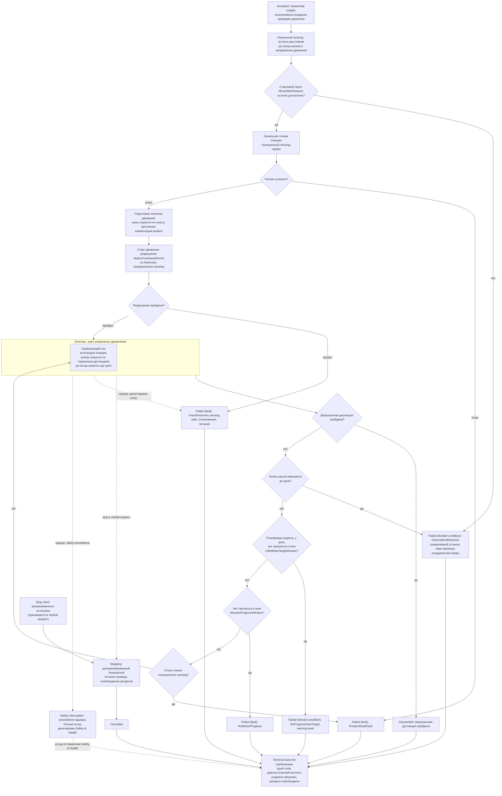

# Алгоритмическая документация операции MoveDistance (V3)

Статус: подготовлено по issue [«Алгоритмическая документация: MoveDistance»](https://github.com/Driadix/ShuttleControllerV3/issues/30) карты [«Спроектировать спецификацию и план прошивки контроллера V3»](https://github.com/Driadix/ShuttleControllerV3/issues/1). Окончательное утверждение ревизий выполняется на gate `G1 Behavioral Contract`.

Формат документа задан [«Формат алгоритмической документации операций V3»](./algorithmic-documentation-format-v3.md): 12-раздельный каркас, трёхслойное разделение содержание/evidence/структура, narrative на русском языке без формул и чисел, идентификаторы на английском. Общая рамка admission, ownership, надзора, прерываний и публикации outcomes задана [«Глобальной алгоритмической документацией работы шаттла V3»](./global-algorithmic-documentation-v3.md); lifecycle, identity, admission и idempotency заданы [«Общим semantic contract операций V3»](./semantic-contract-v3.md).

Evidence: [Capability Evidence Slices каталога операций V3](https://github.com/Driadix/ShuttleControllerV3/blob/research/v3-capability-evidence-slices/docs/research/v3-capability-evidence-slices.md) (ветка `research/v3-capability-evidence-slices`), раздел «1. MoveDistance (CMD_MOVE_DIST_F = 0x13, CMD_MOVE_DIST_R = 0x12)» и разделы группы «MoveDistance + LiftTo и motion/lifter примитивы»; канонический snapshot V1 - `Driadix/ShuttleController@708d090`. Далее ссылки вида «bundle, …» указывают на этот документ.

## 1. Identity и назначение

`MoveDistance` - root operation type каталога V3 (решение [«Определить каталог и базовые инварианты операций V3»](https://github.com/Driadix/ShuttleControllerV3/issues/9)). Допустимая роль экземпляра - root; child-роль контракт типа не предусматривает.

Доменная цель - переместить шаттл в канале на запрошенную дистанцию в заданном направлении (`forward`/`reverse`). V1 реализовывал тип двумя зеркальными командами по направлению; V3 описывает его единым типом с параметром направления, асимметрии V1 зафиксированы в evidence и унифицированы (раздел 11).

Отношение к другим документам: admission-скелет, stop propagation, fault semantics, link-loss рамка и публикация outcomes не повторяются здесь, а применяются по глобальному документу и semantic contract; документ фиксирует только доменный алгоритм `MoveDistance` и его тип-специфичные paths, условия и исходы.

## 2. Admission и условия входа

Запрос поступает от `Control Client` в пределах выданных полномочий; `Safety Authority` и `Service Client` этот тип не запрашивают. Envelope, epoch fencing, idempotency и конфликтная семантика - по semantic contract.

Параметры:

- `direction` - направление движения, `forward` или `reverse`.
- `distance` - запрошенная дистанция: целое число в миллиметрах, допустимый диапазон от минимального положительного значения до верхней границы, унаследованной от представимости параметра в V1. Значения вне диапазона, нулевые и отрицательные отклоняются на admission. Решение владельца по блокирующему unknown U02 принято в issue [«Алгоритмическая документация: MoveDistance»](https://github.com/Driadix/ShuttleControllerV3/issues/30); пересмотр - при появлении валидации геометрии канала в `Configuration & Calibration` или изменении транспортного кодирования аргументов.

Системные preconditions (по глобальному документу): provisioning gate, fault-state gate, наличие в канале (для `MoveDistance` внеканальное исполнение не разрешено), эксклюзивность (одна активная Exclusive Control Activity). Отрицательный результат - `Rejected` со стабильным rejection code, экземпляр не создаётся.

Условия, проверяемые только in-situ после принятия (дают runtime outcome, а не `Rejected`):

- стартовый порог: остаток расстояния до конца канала в направлении движения не менее минимального стартового порога (условие `MoveStartDistance`, класс configured, anchor: bundle, раздел «1. MoveDistance» - Admission/preconditions);
- успешное начальное чтение позиционного sensing (условие `PositionReadAtStart`);
- разрешение старта движения по freshness направленного sensing (условие `MotionFreshnessPermit`; глобальный документ, раздел 8).

V1 принимал `MoveDistance` также как дискретный manual step внутри ручной сессии. В V3 ручное управление реализуется эксклюзивным lease `Manual Control Session` c hold-to-run intents (решение [«Определить system context и таксономию возможностей V3»](https://github.com/Driadix/ShuttleControllerV3/issues/2)); дискретный manual step не входит в контракт типа `MoveDistance` и в baseline не переносится. Повторная проверка принятия после уже отправленного положительного ACK, существовавшая в V1, исключена: admission атомарен (решение [«Специфицировать общий semantic contract операций V3»](https://github.com/Driadix/ShuttleControllerV3/issues/13)).

## 3. Normal path

1. **Принятие.** Admission пройден, экземпляр в `Accepted`, положительный ACK выдан. Root получает эксклюзивное владение приводом движения; лифтер в операции не используется.
2. **Начальный sensing.** Измеряется остаток расстояния до конца канала в направлении движения. Если остаток меньше стартового порога `MoveStartDistance`, движение не начинается; исход - по разделу 5 (domain-condition `ChannelEndReached`).
3. **Начальное чтение позиции.** Позиционный sensing-сервис даёт стартовую позицию. Неуспешное чтение - fault-путь `PositionReadFault` (раздел 5).
4. **Подготовка политики движения.** Пределы скорости ограничиваются по классу запрошенной дистанции; запрошенная дистанция уменьшается на величину компенсации выбега. Количественные значения - tuning из evidence (раздел 8), на доменный шаг не влияют.
5. **Старт движения.** Выдаётся разрешение старта `MotionFreshnessPermit` по freshness направленного sensing для выбранного направления. Провал разрешения - fault-путь (раздел 5); привод при этом не стартует.
6. **Движение.** Экземпляр в `Running`: цикл управления движением (раздел 4). На каждом управляющем тике позиция интегрируется по позиционному sensing, скорость выбирается по тормозным дистанциям: полная скорость, пока остаток до конца канала и остаток запрошенной дистанции не меньше тормозной дистанции для допустимого предела скорости; ограничение скорости остатком до конца канала, когда он меньше тормозной дистанции; торможение при подходе к цели; удержание минимальной скорости вблизи цели.
7. **Цель достигнута.** Запрошенная дистанция пройдена - выдаётся управляемый останов привода. Экземпляр завершает алгоритм `Succeeded`.
8. **Завершение.** Ресурсы и делегирования освобождены, terminal outcome опубликован, snapshot обновлён. Платформа готова к новому запросу.

Инвариант соблюдается: `Succeeded` публикуется только при пройденной запрошенной дистанции; останов до цели любым путём даёт соответствующий ненулевой исход.

## 4. Ожидания и повторения

Операция не содержит ожиданий внешних событий канальной логистики и condition-driven повторений: это одиночное перемещение на запрошенную дистанцию.

Единственная длительная активность - цикл управления движением внутри `Running` с явными условиями:

- вход: разрешение старта `MotionFreshnessPermit` пройдено, привод запущен;
- выход: запрошенная дистанция пройдена (normal), конец канала вмешался, детектирован отказ, сработал надзор либо принят stop.

Warn-and-continue поведения отсутствуют: все наблюдаемые условия операции либо продолжаются в normal path, либо завершают экземпляр классифицированным исходом.

## 5. Прерывания

Рамка stop/fault/safety precedence - глобальный документ, раздел 5; здесь зафиксированы тип-специфичные paths.

### Stop

Stop принимается в любой момент после принятия экземпляра и переводит его в `Stopping`: детерминированный безопасный останов привода движения, освобождение ресурсов, исход `Cancelled`. Позиция на момент останова сохраняется в snapshot; частичный проезд остаётся фактическим состоянием.

### Fault

Fault - детектированный внутренний отказ; экземпляр завершается `Failed` с кодом класса `fault` и диагностическим контекстом. Тип-специфичные детектируемые условия:

- `NoMotionProgress` - нет приращения позиции в течение отведённого окна при commanded движении (V1 no-progress watchdog; условие `MoveNoProgressWindow`, класс configured). Fault выставляется надзором операции, а не выбирается алгоритмом.
- `PositionReadFault` - отказ чтения позиционного sensing: при старте и во время движения. В V1 fault сенсора позиции latch-ится на обоих путях общим хелпером чтения (при движении - с принудительным остановом привода), однако сама функция операции при отказе в движении не декларировала исход и завершалась как при штатном останове; ошибка проявлялась только на следующей итерации исполнительного цикла. В V3 не переносится отсутствие явного исхода операции: детектированный отказ даёт `Failed` класса `fault` (раздел 11, disposition change).
- Отказ или потеря freshness направленного sensing: провал разрешения на старте и принудительный останов при движении (V1 force-stop по активной motion-safety) - fault по правилам надзора; классификация конкретного сенсорного кода - `Safety & Health`.
- Столкновение, stall привода, питание ниже порога - сквозные paths надзора (глобальный документ, раздел 5).

V1 в fault-пути no-progress дополнительно принудительно опускал лифтер. Операция смены состояния платформы как побочный эффект fault является safe reaction; disposition - change (предложение) до подтверждения `Safety & Health`; до этого подтверждения документ фиксирует только сам fault-исход.

### Domain-condition

Domain-condition - наблюдаемое состояние мира, делающее цель недостижимой; исход `Failed` с кодом класса `domain-condition`, severity warning level по коду.

- `ChannelEndReached` - конец канала делает запрошенную дистанцию недостижимой. Проявляется в двух точках: (а) до старта движения, если остаток до конца канала меньше стартового порога `MoveStartDistance`; (б) во время движения, когда остаток до конца канала достигает порога конца канала (условие `ChannelEndThreshold`, класс configured; V1 проверяет его раньше условий достижения цели, и при совпадении приоритет у конца канала). В точке (б) выполняется управляемый останов и пере-привязка координатной опоры для данного направления (раздел 11, disposition preserve).
- `NoProgressNearTarget` - платформа поднята, остаток запрошенной дистанции меньше порога «у цели», и приращение позиции отсутствует в течение отведённого окна (условие `LiftedNearTargetWindow`, класс configured). Наблюдаемое условие: движение у цели физически не завершается при поднятой платформе. Решение владельца: сохранить как отдельный domain-condition path с warning-level severity; цель не достигнута, поэтому `Succeeded` исключён инвариантом, а latched fault не выставляется, чтобы не создавать операционное трение на потенциально штатном финальном доезде. Пересмотр - при HIL-данных, показывающих механический отказ как фактическую причину кейса, либо при требовании WMS к fault-семантике.

Неисправность сенсора при положительных признаках отказа является fault-путём, а не domain-condition.

### Safety interruption

Точки safety-прерывания операции: permit-проверка freshness направленного sensing перед стартом движения; надзор во время движения (потеря freshness, столкновение, stall, питание). Граница с fault-путями - по глобальному документу: детектированный надзором отказ завершает экземпляр fault-исходом (выше); safety interruption наступает, когда Safety Authority применяет precedence к operation intents и при необходимости инициирует авторизованные safety operations. Точный исход прерванного экземпляра делегирован `Safety & Health` и здесь не выдумывается.

### Link-loss

`MoveDistance` - автономная операция; назначенная link-loss policy - `continue`: после потери инициатора экземпляр продолжает исполнение до собственного terminal outcome (V1 baseline: автономное исполнение не зависит от наличия связи; глобальный документ, раздел 5).

## 6. Recovery и состояние после прерывания

Возобновление всегда явное - новый запрос; generic pause/resume операции не свойственен.

- **После `Cancelled` (stop):** шаттл остановлен в промежуточной позиции, привод остановлен, ресурсы освобождены; позиция отражает фактическое интегрированное положение, snapshot несёт его. Продолжение - новым запросом с учётом фактической позиции.
- **После `Failed` (fault):** fault удерживается (latched semantics); платформа допускает только override/service-действия; recovery через `ClearFault` с baseline-условиями снятия (квалифицированное восстановление sensing/шины и физическая неподвижность) по глобальному документу. Прерванная операция не возобновляется. V1-нюанс принудительного опускания лифтера в fault-пути зафиксирован в разделе 5 как предложение до `Safety & Health`.
- **После `Failed` (domain-condition):** физическое состояние сохраняется: шаттл у конца канала либо у цели, привод остановлен; snapshot несёт код и диагностический контекст. Продолжение - явным новым запросом (например, движение в обратном направлении либо повтор с корректировкой дистанции).
- **После safety interruption:** состояние и исход по правилам `Safety & Health`.

## 7. Terminal outcomes и наблюдаемые результаты

Принятый экземпляр завершается одним из terminal states; `Rejected` относится только к запросу.

| Исход | Класс | Наблюдаемое условие |
| --- | --- | --- |
| `Succeeded` | - | запрошенная дистанция пройдена, управляемый останов выполнен |
| `Cancelled` | stop | принят stop, детерминированный безопасный останов завершён |
| `Failed` | `fault` | `NoMotionProgress`, `PositionReadFault`, отказ/freshness направленного sensing, stall, столкновение, питание ниже порога |
| `Failed` | `domain-condition` | `ChannelEndReached`, `NoProgressNearTarget` |

Outcome содержит стабильный typed code и минимальный диагностический контекст: направление, запрошенную и фактически пройденную дистанцию, позицию, свидетельства sensing на момент исхода. Таксономия typed codes и назначение severity фиксируются `External Semantic & Transport Contracts` и `Observability & Diagnostics`; имена условий выше - observation-based имена, принятые этим документом.

Внешняя видимость - по semantic contract: положительный ACK при принятии, terminal outcome при завершении, query snapshot как authoritative read-модель. Observable events: принятие, старт движения, останов, terminal outcome. V1-каденции телеметрии и mapping состояний зафиксированы в evidence как baseline budgets `Observability & Diagnostics`.

## 8. Timing conditions

Унаследованные timing-условия V1 для `MoveDistance`. Количественные значения остаются в evidence; новые количественные значения документ не вводит.

| Условие | Класс | Anchor | Disposition |
| --- | --- | --- | --- |
| `ControlTickPeriod` - период управляющего тика цикла движения (позиция/скорость) | configured | bundle, «1. MoveDistance» - Timing conditions | preserve |
| `SpeedCommandInterval` - минимальный интервал между записями скорости приводу | configured | bundle, «3. Примитивы движения» - motor_Speed | preserve |
| `MoveNoProgressWindow` - окно отсутствия прогресса до fault `NoMotionProgress` | configured | bundle, «1. MoveDistance» - Timing conditions | preserve |
| `LiftedNearTargetWindow` и порог «у цели» - окно и порог для domain-condition `NoProgressNearTarget` | configured | bundle, «1. MoveDistance» - Timing conditions | change: спец-выход V1 сохранён как отдельный domain-condition path вместо тихого успеха (решение владельца в issue [«Алгоритмическая документация: MoveDistance»](https://github.com/Driadix/ShuttleControllerV3/issues/30)) |
| `MoveStartDistance` - минимальный остаток до конца канала для старта | configured | bundle, «1. MoveDistance» - Admission/preconditions | preserve; исход при провале классифицирован как domain-condition (раздел 5) |
| `ChannelEndThreshold` - порог конца канала с учётом канала-смещения | configured | bundle, «1. MoveDistance» - Timing conditions | preserve |
| `SpeedCapsByDistance` - капы пределов скорости по классам запрошенной дистанции | configured | bundle, «1. MoveDistance» - Timing conditions | preserve как tuning-политика; значения пересматриваются с NFR/HIL |
| `OverrunCompensation` - компенсация выбега уменьшением запрошенной дистанции | configured | bundle, «1. MoveDistance» - Timing conditions | preserve как tuning-политика |
| `BrakingMargin` - тормозная дистанция как произведение скорости на множитель | inferred | bundle, «1. MoveDistance» - Timing conditions | preserve концепцию; физическая размерность - unknown U01 |
| `AngleWrapThreshold` - порог различения wrap-направлений при интеграции угла | configured | bundle, «1. MoveDistance» - Timing conditions | preserve концепцию |
| `PositionCalibrationSectors` - калибровочные коэффициенты секторов интеграции позиции | configured | bundle, «1. MoveDistance» - Шаги и переходы, шаг 7 | preserve концепцию; применимость при смене сенсора позиции - вход Software Architecture |

Unknowns:

- **U01** (физические единицы контракта приводов, включая множитель тормозной дистанции): владелец - владелец и документация приводов. Настоящий документ U01 не блокирует: документ не содержит количественных значений и единиц, они остаются в evidence; стадия закрытия U01 - контракты actuation для `MoveDistance`/`LiftTo`.
- **U02** (размерность и диапазон параметра `distance`): закрыт решением владельца в issue [«Алгоритмическая документация: MoveDistance»](https://github.com/Driadix/ShuttleControllerV3/issues/30) - миллиметры, целое, диапазон от минимального положительного значения до унаследованной верхней границы представимости; остальное отклоняется на admission.

## 9. Профильные варианты

Алгоритм `MoveDistance` идентичен для профилей 800, 1000 и 1200: профильных ветвлений в операции нет (bundle, «1. MoveDistance» - Профильные варианты; «Профильные варианты 800/1000/1200 - сводка»: движение профильных ветвлений не имеет). Длина шаттла входит косвенно как конфигурационный параметр геометрии канала при пере-привязке координатной опоры у конца канала в направлении `reverse`. Валидация профиля как набора механических параметров - `Configuration & Calibration` (unknown U07, владелец - владелец и полевые данные).

## 10. Composition boundaries

По V1 baseline операция несоставная: suboperations отсутствуют, доменный алгоритм исполняется одним экземпляром.

- **Primitives** (не имеют собственной operation identity и lifecycle): шаги старта привода и выдачи скорости (включая ramp), шаг управляемого останова привода, тик интеграции позиции, обслуживания sensing.
- **Ресурсы:** root владеет приводом движения эксклюзивно до завершения; лифтер не используется (V1 fault-путь принудительного опускания лифтера зафиксирован в разделе 5 как предложение). Делегирование не применяется - child-экземпляров нет.
- Выражение фазы движения через operation type `Move` как suboperation является решением будущего type graph и настоящим документом не предписывается.

## 11. V1 dispositions и evidence

Evidence anchors - bundle, разделы «1. MoveDistance», «3. Примитивы движения», «5. Distance-обслуживание в loop()», «Сквозные замечания»; канонический snapshot V1 `Driadix/ShuttleController@708d090`. Решения владельца, принятые в issue [«Алгоритмическая документация: MoveDistance»](https://github.com/Driadix/ShuttleControllerV3/issues/30), помечены ниже.

| Поведение V1 | Evidence | Disposition | Основание |
| --- | --- | --- | --- |
| Аргумент trunc-ится int32 -> uint16 без валидации; отрицательные и сверхбольшие значения дают неопределённое поведение | bundle, Admission/preconditions; «Сквозные замечания» п. 8 | change: типизированный параметр `distance` (миллиметры), валидация диапазона, отклонение на admission | решение владельца по U02 в issue [«Алгоритмическая документация: MoveDistance»](https://github.com/Driadix/ShuttleControllerV3/issues/30); semantic contract - атомарный admission |
| Тихий «успех», когда конец канала вмешался до полной дистанции (при старте и в движении) | bundle, шаги 1 и 8 normal path | change: `Failed` класса `domain-condition`, код `ChannelEndReached` | инвариант `Succeeded ⇔ цель достигнута` и классификация paths формата (issue [«Зафиксировать формат и acceptance criteria алгоритмической документации V3»](https://github.com/Driadix/ShuttleControllerV3/issues/15)); semantic contract (issue [«Специфицировать общий semantic contract операций V3»](https://github.com/Driadix/ShuttleControllerV3/issues/13)) |
| Lifted near-target escape: останов без fault при поднятой платформе у цели без прогресса, операция рапортует успех | bundle, шаги 9 и Timing conditions | change: отдельный domain-condition path `NoProgressNearTarget`, warning-level severity | решение владельца в issue [«Алгоритмическая документация: MoveDistance»](https://github.com/Driadix/ShuttleControllerV3/issues/30); инвариант исключает `Succeeded` |
| No-progress watchdog: нет прогресса в отведённом окне - fault, останов, принудительное опускание лифтера | bundle, шаг 9 | preserve концепцию fault `NoMotionProgress`; change (предложение): принудительное опускание лифтера как safe reaction требует подтверждения `Safety & Health` | глобальный документ, разделы 5 и 11 (паттерн предложений до gate Safety & Health) |
| Отказ чтения позиционного sensing в движении: fault latch-ится общим хелпером, но функция операции не декларирует исход и завершается как при штатном останове | bundle, шаг 6; «Сквозные замечания» | change: детектированный отказ даёт `Failed` класса `fault` (`PositionReadFault`) с явным исходом операции | semantic contract; формат, классификация fault |
| Отказ чтения позиционного sensing при старте - latch fault | bundle, шаг 2 | preserve | fault semantics semantic contract |
| ToF freshness gate на старте и force-stop при движении | bundle, шаги 4, 5; «3. Примитивы движения» | preserve | глобальный документ, раздел 8 (freshness направленного sensing) |
| Капы пределов скорости по классам дистанции, компенсация выбега, множитель тормозной дистанции | bundle, шаги 3, 8; Timing conditions | preserve как tuning-политику; количественные значения остаются в evidence | трёхслойное разделение формата; ревизия значений - NFR/HIL |
| Ordering-баг F: клампизация пределов скорости до dist-капов (в R порядок корректный) | bundle, «Сквозные замечания» п. 1 | change: единый порядок для обоих направлений | зафиксированные дефекты V1 не переносятся как нормативное поведение (глобальный документ, раздел 11) |
| Асимметрии F/R: разные нижние пороги предела скорости, разные условия приращения (`diff != 0` vs `diff > 0`) | bundle, «Сквозные замечания» п. 2 | change: единое правило для типа с параметром направления; значения - tuning в evidence | единый тип `MoveDistance` с параметром направления (каталог, issue [«Определить каталог и базовые инварианты операций V3»](https://github.com/Driadix/ShuttleControllerV3/issues/9)) |
| Конец канала F обнуляет координатную опору; R пересчитывает длину канала от текущей позиции | bundle, Observable outcomes | preserve семантику пере-привязки координатной опоры у конца канала | baseline; явная привязка к профилю длины - `Configuration & Calibration` |
| Интеграция пройденного пути по угловому сенсору с секторной калибровкой | bundle, шаг 7 | preserve концепцию; выбор сенсора позиции - вход Software Architecture | трёхслойное разделение формата |
| Дискретный manual step внутри ручной сессии | bundle, Entry points (MANUAL-ветка) | change: не входит в контракт типа; ручное управление - lease `Manual Control Session` с hold-to-run intents | решение issue [«Определить system context и таксономию возможностей V3»](https://github.com/Driadix/ShuttleControllerV3/issues/2) |
| Повторная проверка принятия после положительного ACK с возможным отбрасыванием | bundle, «Общие entry points и dispatch skeleton» п. 7; «Неблокирующие unknowns и assumptions» | change: атомарный admission без post-ACK re-check | решение issue [«Специфицировать общий semantic contract операций V3»](https://github.com/Driadix/ShuttleControllerV3/issues/13) |

## 12. Диаграмма

Обязательная Mermaid-блок-схема алгоритма `MoveDistance`. Источник diagram-as-code: [diagrams/src/move-distance-flow.mmd](../diagrams/src/move-distance-flow.mmd).

Narrative и диаграмма согласованы: каждое ветвление и ожидание narrative (стартовый порог, чтение позиции, разрешение старта, цикл управления, достижение цели, конец канала, оба no-progress пути, отказ позиционного sensing, fault по детектированному надзором отказу, stop, safety precedence, публикация outcome) присутствует на диаграмме, и каждая ветвь диаграммы описана в разделах 2-7.
