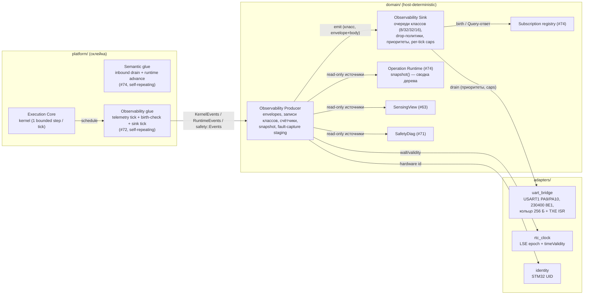
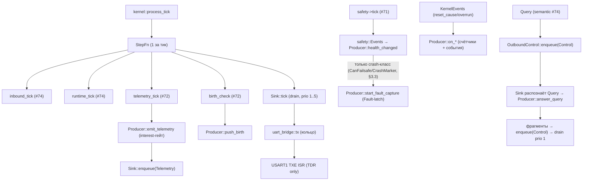
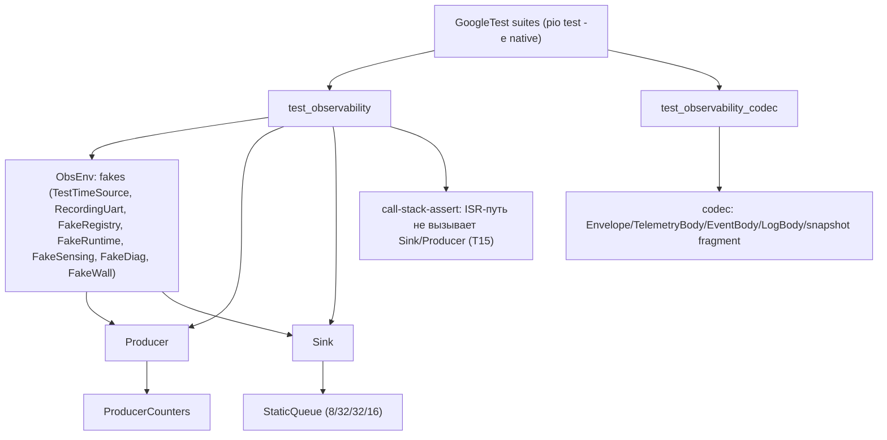

# Дизайн observability и UART sink V3 (Observability Producer + Sink)

Статус: **design-артефакт для тикета [«Реализовать observability и UART sink»](https://github.com/Driadix/ShuttleControllerV3/issues/72)** (Фаза 2, один vertical PR по правилу карты [«Реализовать и выпустить firmware-платформу контроллера V3»](https://github.com/Driadix/ShuttleControllerV3/issues/58)).

Этот документ задаёт повторяемый shape of code по методу владельца (место в архитектуре → модели данных → трансформации → зависимости/контракты → shape of code → light-визуализации → типы/сигнатуры → program layout → call stack → тесты с call graph), применяя структуру эталона `docs/execution-foundation-design-v3.md` (#85) и `docs/operation-runtime-design-v3.md` (#74).

Дизайн наследует утверждённые решения и **не пересматривает** их: архитектура наблюдаемости [«Спроектировать архитектуру наблюдаемости V3»](https://github.com/Driadix/ShuttleControllerV3/issues/49) (`docs/observability-architecture-v3.md`, Approved, ревизия `9b431a7`, PR #78), #47 (wire: envelope, registry, subscriptions, snapshot-фрагменты), #43 (границы, классы, drop-политики, никогда-не-блокирующий TX), #45 (safety-события, fault-коды), #46 (окна), #48 (ёмкости очередей, UART-бюджеты), #51 (R1-R8, dependency rules), #13 (semantic contract), #54/#52 (verification pyramid, obligations). Численные бюджеты — из `docs/quality-attributes-and-budgets-v3.md`; термины — канонические из `CONTEXT.md`. Slice-код и #74/#63/#70/#71 production-код — эволюционные источники.

## §0 Решения владельца (2026-08-14, HITL-брифинг #72)

1. **UART включён в frozen baseline (Semantic change build flags, #51 §4)**: снять `-D NO_HW_SERIAL` и `-D HAL_UART_MODULE_DISABLED`. Собственный TX-адаптер `adapters/uart_bridge.*` на USART1 (PA9 TX / PA10 RX, **230400 8E1** — единственный UART-контракт network_bridge на стенде, runner #65; V1 display path, XT22): кольцевой буфер **256 Б** + TXE-прерывание, никогда не блокирует (obligation #12, #43 §6; ISR пишет только регистр TDR из кольца — R2). HardwareSerial не используется (собственный драйвер: полный контроль над never-block и буфером; STM32duino Serial1 буфер 64 Б не вмещает MTU-кадр целиком).
2. **Размещение**: Observability Producer (envelopes, записи классов, счётчики, snapshot-сборка, fault-capture staging) и Sink-политика (очереди классов, drop-политики, приоритеты, per-tick caps, birth) — **domain** (host-deterministic, R6, include-lint чист); HAL-часть (USART1, кольцо, ISR) — **adapters** (единственное место Arduino/HAL, #51 §5). Slice-порты `slice::ObservabilityPort` и `slice::UartPort` удаляются (clean cutover, #85 решение 1); их место занимают `v3::UartPort` + `v3::OutboundControl` (Sink) + `v3::RuntimeEvents`/`v3::KernelEvents`/`safety::Events` (Producer) — порты уже объявлены в `domain/ports.h` (#74/#71/#70).
3. **Wall-clock в #72**: вводится порт `v3::WallClockSource` (read-only: epoch sec + timeValidity) и адаптер чтения RTC (LSE). SetWallClock (мутация) — Service-класс, вне #72 (#75/#76). До первой синхронизации `timeValidity = Unsynced` — wall-поле в записях 0 и явно невалидно (архитектура §3: «не эмитировать убедительное время»).
4. **Состав #72** (по тикету): envelopes + class queues + drop-политики/счётчики + snapshot (Query-ответ, birth, re-sync клиентом) + subscriptions-facing producer API (push гейтится подпиской) + fault-capture (RAM staging, supersede, фрагментация) + UART TX-планирование. **Вне scope**: flash-журнал диагностики (Persistence, #76), transport handshake/session (transport #75), SetWallClock (Service, #75/#76), `V3_DEV_TIMELINE` (compile-time флаг, default off — hook зарезервирован, не включается), radio-профиль (вне v1.0.0, #66).
5. **Identity в snapshot** (A6): hardware id — из STM32 UID (чтение в адаптере identity, малый bounded код); firmware version / build id / serial — **placeholder** до release-инфраструктуры и provisioning (#76) — поля в документе зарезервированы и помечены «не наполняется до #76».

---

## 1. Место в архитектуре



| Элемент | Компонент (#43 §2) | Владение | Примечание |
| --- | --- | --- | --- |
| Observability Producer | Observability (item 8, #49) | domain | envelopes, записи классов, счётчики (единственный владелец, #43 §4), snapshot-сборка, fault-capture staging; реализует KernelEvents/RuntimeEvents/safety::Events |
| Observability Sink | Observability (#49 §4: очереди классов, TX-планирование, механическое enforcement) | domain-политика + adapters (HAL) | очереди 8/32/32/16 (#48 §6), drop-политики #43 §6, приоритеты/caps #49 §10, birth; реализует v3::OutboundControl |
| Subscription registry | Semantic Contract & Admission (control plane) | domain (#74) | интерес для push-гейта: `interest()`, `birth_pending()` |
| UART TX | Transport / Sink (адаптер) | adapters | USART1 230400 8E1, кольцо 256 Б + TXE ISR; никогда не блокирует (#43 §6, #54 #12) |
| Wall-clock | HAL RTC (адаптер) | adapters | read-only; SetWallClock — Service (#75/#76) |
| Fault-capture staging | Observability Producer | domain | 512 Б статический буфер (#49 §2.5), supersede |

**Граница модуля (#72)**: Producer + Sink-политика + glue (observability tick) + UART TX-адаптер + RTC-чтение + identity-чтение. НЕ входят: flash-журнал (#76), transport (#75), SetWallClock (#75/#76), dev-timeline (off).

**ISR-граница (инвариант дизайна)**: в scope #72 единственный новый ISR — USART1 TXE (адаптер), и он исполняет ровно одну операцию: перемещение следующего байта из TX-кольца в регистр TDR; при пустом кольце — отключает TXE-прерывание. Никакой политики, счётчиков, событий или эмиссии из ISR (R2, #43 §3.2). События/drop-счётчики — из foreground (Sink tick).

## 2. Модели данных

Все типы — fixed-width (`stdint`, R3), без динамической аллокации (R1), bounded (R4), типизированные outcomes (R5). Wire-layout — канонический canonical frame (#47 §4.1, `domain/codec.h`): sync `0xE3 0x10` + header 8 Б + payload + CRC-16/CCITT-FALSE, MTU 128 / payload ≤ 116.

### 2.1 Envelope (все записи всех классов)

```cpp
// domain/codec.h — аддитивное расширение contract core (#47 §2, §8.2)
// Wire: payload записи начинается с envelope (фиксированный per-class layout).
enum class TimeValidity : std::uint8_t {
    Unsynced = 0,  // RTC не инициализирован / backup-domain потерян: wall отсутствует (0)
    RtcOnly = 1,   // RTC идёт (LSE), синхронизации в этой эпохе не было
    Synced = 2,    // SetWallClock получен в текущей эпохе (Service, вне #72)
};

#pragma pack(push, 1)
struct Envelope {
    // LSB-first упаковка битовых полей (R7: явный контракт, wire = LE как весь кадр).
    // class_id: 3 бита — QueueClass 0..6 (Control..Traces); #49 §2.1 говорит «2 бита
    // значимы», но QueueClass::Events=4 (0b100) требует 3 бита — расширение аддитивно,
    // wire-совместимо (u8 поле, 5 старших бит резерв/0).
    std::uint8_t  class_id : 3;      // codec::QueueClass: Control..Traces (0..6)
    std::uint8_t  time_validity : 2; // TimeValidity
    std::uint8_t  reserved : 3;      // 0
    std::uint32_t controller_epoch;  // fencing boundary (#13); меняется на reboot
    std::uint32_t monotonic_tick;    // ms от boot; единственный авторитет порядка (#43, #48 §9)
    std::uint8_t  seq;               // rolling per-class; детекция потерь (mod 256)
    std::uint32_t wall_time;         // epoch sec; валиден только при time_validity != Unsynced
    // Два wire-layout'а (фиксированный per-class, не динамический):
    //   telemetry: 10 Б (envelope без wall_time — порядок = tick, #49 §2.1 «~9 Б»)
    //   events/logs/traces: 14 Б (с wall_time; при Unsynced wall_time = 0 + time_validity)
    // Правило кодека: telemetry читает/пишет 10 Б, остальные классы — 14 Б.
};
#pragma pack(pop)
```

- `monotonic_tick` — серийный счётчик; сравнение/разности по модулю 2^32 (unsigned delta < 2^31 ms ⇒ «позже»; wrap-safe, паттерн V1 AlertManager signed-diff, #49 §2.1). Клиентский порядок: `(controllerEpoch, tick)`.
- `seq` — rolling u8 per-class; gap-детекция mod 256; разность > 128 — неоднозначно (следующая запись supersedes). **Пропуск seq в telemetry — норма (drop-oldest, свежесть), re-sync по telemetry-гэпам не выполняется никогда** (#49 §2.2).
- Drop-политики класса применяются Sink-ом; каждый drop → счётчик + событие (#43 §6).

### 2.2 Записи классов (тело после envelope)

```cpp
// telemetry (drop-oldest, свежесть #49 §2.2): периодическое состояние
#pragma pack(push, 1)
struct TelemetryBody {
    std::uint8_t  op_state;          // текущая operation/состояние (runtime snapshot)
    std::uint32_t position_mm;       // позиция шаттла (placeholder 0 до Фазы 3 motion)
    std::uint16_t speed_mm_s;        // скорость (placeholder 0 до Фазы 3)
    std::uint8_t  health;            // SafetyHealth (#45)
    std::uint16_t fault_mask;        // wire-коды #47 §16.4 (реестр §2.5)
    std::uint16_t warning_mask;      // wire-коды #47 §16.4
    std::uint8_t  battery_charge;    // placeholder 0 до BMS-адаптера
    std::uint16_t battery_voltage_mv;// placeholder 0 до BMS-адаптера
    std::uint16_t pallet_count;      // placeholder 0 до Фазы 3
    std::uint8_t  state_flags;       // lifterUp/motorStart/motorReverse/CHANNEL/inverse (резерв)
};  // 18 Б (packed: 1+4+2+1+2+2+1+2+2+1); каденция — подписка/дефолт (bridge 300 мс, #49 §9)

// events (drop-newest, резерв ёмкости #43 §6): дискретные типизированные происшествия
struct EventBody {
    std::uint16_t event_id;      // реестр §2.5 (#49 §5): 0x01xx..0x08xx
    std::uint8_t  severity;      // info/warning/error/fatal
    std::uint8_t  ctx_kind;      // типизированный контекст: operationId/faultCode/dropCounter/rejectCode/updateStage…
    std::uint32_t ctx_value;     // bounded значение контекста
    std::uint32_t ctx_value2;    // второй bounded параметр (напр. operationId + typeId)
};  // 12 Б

// logs (drop-newest, резерв ёмкости): человекочитаемая диагностика
struct LogBody {
    std::uint8_t level;          // DEBUG/INFO/WARN/ERROR/FATAL
    std::uint8_t module_id;      // <= 16 модулей (#49 §2.4)
    std::uint8_t text[80];       // <= 80 Б после envelope; обрезка без chunk-сплита (MAJOR-2)
};  // 82 Б; максимальная запись 14 + 82 = 96 Б <= MTU, per-tick cap 128 Б (bridge) (#49 §10)

// traces (drop-oldest; reserved-флаг для fault-correlated, #47 §8.2)
struct TraceBodyHeader {
    std::uint8_t  kind;          // 0 = fault_capture (production), 1 = dev_timeline (compile-off)
    std::uint16_t trigger_event_id;
    std::uint32_t trigger_tick;  // monotonic момент latch
    std::uint32_t payload_len;   // длина тела захвата (<= 512 Б; > MTU фрагментируется)
};
#pragma pack(pop)
```

**Fault-capture тело** (kind=0, staging 512 Б, #49 §2.5): `trigger_event_id + trigger_tick + reset_cause (u8) + хвост колец + фрагмент snapshot (health/window/epoch/…).` **Бюджет хвоста (зафиксирован, ≤ 512 Б суммарно)**: 8 последних events полными записями (14+12 = 26 Б каждая = 208 Б) + 8 последних logs в **компактной форме** (envelope 14 Б + level/module_id 2 Б + текст, обрезанный до 16 Б = 32 Б каждая = 256 Б) + trigger-заголовок 11 Б + reset_cause 1 Б + snapshot-фрагмент ≤ 36 Б → **итого ≤ 512 Б** (208+256+11+1+36 = 512). Текст логов в хвосте обрезается до 16 Б на запись (без chunk-сплита); полная запись лога (80 Б текста) хранится в кольце как есть — обрезка только при копии в staging. Сборка — в резервном staging-буфере Producer (512 Б, статический RAM, #48 §8 +512 Б), неподвластен drop-политикам классов. Второй фолт при незаписанном pending-захвате: новая запись supersedes, старая — drop + счётчик `traceCaptureSuperseded` (событие). Доставка: фрагментами как snapshot (`fragmentIndex`/`fragmentCount`), drain несколько тиков под per-tick cap 128 Б (bridge), приоритет traces (4).

### 2.3 Snapshot-документ (≤ 456 Б, #49 §2.6)

```cpp
// Авторитетный документ состояния; version u32 монотонно +1 на изменение.
// Доставка фрагментами <= MTU: payload = { fragmentIndex u8, fragmentCount u8, chunk[] }.
// Физика фрагмента: payload <= 116 Б (#47 §4.1) минус 2 Б индексов = chunk <= 114 Б;
// bridge-ответ = 4 фрагмента (#49 §10) => документ bounded <= 456 Б (4 x 114), что
// согласуется с #49 §2.6 (документ <= 512 Б) — лимит 456 жёстче и физически достижим.
// Fencing: version + controllerEpoch; старые версии отбрасываются (AWS Shadow-паттерн).
struct SnapshotSections {            // суммарно <= 456 Б
    std::uint32_t version;
    std::uint32_t controller_epoch;
    std::uint32_t wall_time;         // + time_validity
    std::uint8_t  time_validity;
    std::uint8_t  window;            // PlatformWindow
    std::uint8_t  health;            // SafetyHealth
    std::uint8_t  fault;             // SafetyFault (вне Fault — None)
    std::uint8_t  degraded_class;    // DegradedClass
    std::uint8_t  provisioning;      // ProvisioningStatus
    // Shuttle profile (#59): supported[3] u16, qualified u16, configured u16,
    //   active u16, status u8 — статус из provisioning (#76), в #72 — stub
    std::uint8_t  profile[12];
    // Identity (A6): fw_version u32 (placeholder 0 до release), build_id u32
    //   (placeholder), hardware_id u32 (STM32 UID), serial u32 (placeholder до #76)
    std::uint8_t  identity[16];
    // Операции: count u8 + до 8 экземпляров {op_id u32, type u16, state u8, activity u8}
    std::uint8_t  ops[8 * 8];
    // Sensing: 5 датчиков {raw u32, age u32, state u8} = 45 Б
    std::uint8_t  sensing[45];
    // Actuator commanded (SafetyDiag.current_intent), battery (резерв)
    std::uint8_t  actuator[8];
    std::uint8_t  battery[8];
    std::uint16_t fault_mask;        // #47 §16.4
    std::uint16_t warning_mask;      // #47 §16.4
    // Счётчики (§2.4) — компактный срез
    std::uint8_t  counters[64];
};
```

**Отдача snapshot'а**: (а) Query-ответ (приоритет Control/Service, §10; bridge ≤ 456 Б = 4 фрагмента); (б) birth на (re)subscribe (гейтится подпиской, в `maxBytesPerTick`); (в) re-sync — только по запросу клиента после gap-детекта в events/logs/traces (не telemetry). Контроллер никогда не пушит snapshot самопроизвольно сверх birth.

### 2.4 Счётчики (Observability Producer — единственный владелец, #43 §4)

```cpp
struct ProducerCounters {                       // bounded, u16/u32
    std::uint32_t uptime_s;                     // sysUpTime-паттерн (RFC 2863)
    std::uint32_t reset_by_category[5];         // ResetCause histogram
    std::uint32_t last_boot_cause;              // ResetCause + persisted marker (Q5 A)
    std::uint16_t drop_telemetry, drop_events, drop_logs, drop_traces;  // per-class
    std::uint16_t high_water_telemetry, high_water_events, high_water_logs, high_water_traces;
    std::uint16_t trace_capture_superseded;
    std::uint16_t admission_rejects[22];        // per RejectCode (bounded таблица, #49 §6)
    std::uint16_t subscription_drops;           // суммарный slow-consumer drop (registry.drops())
};
// Инкременты — на границе bounded шага (foreground), single-writer.
```

Агрегация: компоненты эмитят события; Producer инкрементирует (фикс V1: никакого `__disable_irq` + CRC на каждый bump — инкремент в шаге, эмиссия в том же шаге).

### 2.5 Реестр событий и fault/warning mask

Диапазоны `eventId` — #49 §5 (0x01xx Fault/Warning, 0x02xx Health, 0x03xx Окно, 0x04xx Admission, 0x05xx Queue/Overload, 0x06xx Операции, 0x07xx Update, 0x08xx Boot/Reset); конкретные значения назначаются аддитивно (registry-контракт #47, item 6). Wire-коды fault/warning (#47 §16.4) — в #72 аддитивный домен→bit маппинг:

| Bit (fault_mask) | Источник | Bit (warning_mask) | Источник |
| --- | --- | --- | --- |
| 0x0001 DegradedTimeout | SafetyFault | 0x0001 SensingDegraded | DegradedClass::Sensing |
| 0x0002 DirectionalToF | SafetyFault (резерв, Ф2+) | 0x0002 CanErrorPassive | CanErrorState::ErrorPassive |
| 0x0004 CanFailsafe | SafetyFault | 0x0004 Overtemp | DegradedClass::Overtemp |
| 0x0008 CrashMarker | SafetyFault | 0x0008 BmsStale | DegradedClass::BmsStale |

## 3. Трансформации

### 3.1 Поток эмиссии (событие → очередь → TX)

```text
KernelEvents / RuntimeEvents / safety::Events (foreground, владельцы модулей)
  → Producer::on_*: envelope (classId, epoch, tick, seq, wall/validity) + body
  → Sink::enqueue(QueueClass, frame): очередь класса (bounded)
      - полна → политика класса (drop-oldest / drop-newest), Sink репортит
        Producer::note_class_drop → счётчик + событие 0x05xx (single-writer, #43 §4)
  → Observability glue: sink tick (каждый тик, self-repeating)
  → Sink::tick(): drain по приоритетам (1 Control/Service, 2 events, 3 logs, 4 traces, 5 telemetry),
    per-class caps 128 Б/тик + суммарно <= 230 Б/тик (bridge), запись в UartPort;
    TX-кольцо полное → DEFER (кадр остаётся, следующий тик; НЕ блокировать)
  → adapters/uart_bridge: кольцо 256 Б (полное — Sink DEFER-ит кадр до следующего тика, §3.4)
  → TXE ISR: байт из кольца в TDR (и только это)
```

Пуш-гейт: telemetry/streams эмитятся только при `subscription::Registry::interest(cls)` (≥ 1 активная подписка или profile default: bridge — telemetry 300 мс + events всегда; #49 §9). Producer опрашивает registry в glue-шаге.

### 3.2 Snapshot (Query / birth / re-sync)

```text
Query-кадр (Control, msg_type=Query) — semantic::handle_query (#74) форвардит в
  OutboundControl::enqueue(Control, frame) [существующий код, m_out]
  → Sink: распознаёт Query (Control, Query) — НЕ отправляет наружу, а вызывает
    Producer::answer_query(sections_mask)
  → Producer: собирает документ (version = ++doc_version, epoch, секции по mask, <= 456 Б)
  → фрагментация <= MTU: {fragmentIndex, fragmentCount, chunk[]}, <= 4 фрагмента (bridge, #49 §10)
  → enqueue(Control, фрагменты) → drain приоритет 1
birth: glue tick видит registry.birth_pending(authority) → Producer::push_birth()
  (полный документ, в maxBytesPerTick подписки) → birth_sent()
re-sync: клиент шлёт Query после gap — тот же путь (Query).

Wire-кодирование фрагментов (T16, #47 §18 #11 «no hidden semantics»):
  header: msg_family = Family::Observability (6), msg_type = MsgObservability::SnapshotFragment,
  queue_class = Control (ответ на Query / birth — приоритет 1) или Traces (fault-capture
  фрагменты — приоритет 4); payload = { fragmentIndex u8, fragmentCount u8, chunk[] }.
```

### 3.3 Fault-capture (latch → staging → фрагментированная доставка)

```text
Триггер (foreground) — ТОЛЬКО crash-класс (#49 §8.2): explicit-reset фолты (bumper/
  столкновение, stall, move-timeout), watchdog reset, HardFault, update Failed/rollback,
  reboot-циклы; в #72 источники: reset_cause (стартап) | crash_marker_pending |
  safety::Events health→Fault ТОЛЬКО для не-auto-clear fault-классов
  (CanFailsafe=3, CrashMarker=4; #45 §5: авто-сбрасываемые DegradedTimeout/
  DirectionalToF — НЕ латчат захват: RAM + счётчик, #49 §8.2).
  → Producer::start_fault_capture(trigger_event_id, trigger_tick):
      если pending не записан → supersede: новая запись замещает, старая drop +
        traceCaptureSuperseded (событие 0x05xx + счётчик)
      staging 512 Б: хвост 8 events (полные) + 8 logs (компактно, текст <= 16 Б),
        фрагмент snapshot, reset_cause, trigger — суммарно <= 512 Б (§2.2)
  → тело traces (kind=0) → фрагментация (как snapshot) → drain приоритет 4,
    per-tick cap 128 Б (несколько тиков)
```

### 3.4 TX-планирование (Sink::tick, никогда не блокирует)

```text
sink_tick (self-repeating, каждый тик):
  budget = линк-бюджет TX (bridge 230 Б/тик; #48 §7: бюджет 230 Б/тик RX+TX —
    в #72 RX-путь USART1 НЕ активен (не дренируется до транспорта #75), поэтому
    весь бюджет доступен TX; при появлении RX (#75) TX резервирует долю —
    условие пересмотра §11)
  spent[класс] = 0                                  # per-class per-tick cap (#49 §10)
  для приоритетов 1..5 (Control/Service → events → logs → traces → telemetry):
    пока budget > 0 и очередь класса не пуста:
      кадр = peek(класс)                    # не удаляем до решения
      если spent[класс] + len(кадр) > cap[класс]:   # per-class cap 128 Б (bridge)
          break                               # DEFER: голова остаётся в очереди,
                                              #   дренится следующим тиком (никаких
                                              #   drop на drain — политика класса
                                              #   применяется только на enqueue)
      если len(кадр) > budget:                # DEFER: линк-бюджет тика исчерпан
          break                               #   (суммарно <= 230 Б/тик, #48 §7)
      если uart->tx_bytes_available() < len(кадр):
          break                               # DEFER: TX-кольцо полное — никогда
                                              #   не ждём, кадр ждёт тик (#43 §6)
      pop(класс); uart->tx(кадр); budget -= len(кадр); spent[класс] += len(кадр)
  producer->flush_pending_drop()              # coalesced drop-событие (0x05xx),
                                              #   только когда Events-очередь имеет ёмкость
```

Drop-семантика (важно): **на drain никаких drop не происходит** — не поместившийся в
cap/budget/кольцо кадр остаётся в очереди (defer-on-backpressure, #49 §10). Drop
применяется ТОЛЬКО на enqueue (переполнение очереди класса: drop-oldest /
drop-newest, #43 §6) и считается Producer-ом (single-writer). Событие о drop
(0x05xx) эмитится COALESCEД-латчом: Producer::note_class_drop инкрементирует
счётчик немедленно и ставит pending-флаг; flush_pending_drop() (конец sink_tick)
эмитит ОДНО событие, только если Events-очередь не полна — рекурсия событий при
переполнении невозможна.

Внешние глубины Sink-очередей (bounded, R4; #48 §6 задаёт только egress 8/32/32/16 и
inbound): Control/Service-очереди Sink (приоритет 1) — **Control 16 / Service 8** —
вмещают burst Query-ответа (4 фрагмента snapshot) + пачку ACK/SubscriptionAck без
переполнения; решение фиксируется здесь (не пере-решение бюджета #48, а явная
bound-глубина очереди ответов, аналог inbound #48 §6).

## 4. Зависимости и контракты

### 4.1 Dependency-матрица (внутрь, #43/#51)

| Модуль | Зависит от | НЕ зависит от |
| --- | --- | --- |
| `domain/observability.h/.cpp` (Producer+Sink) | `domain/ports.h` (KernelEvents/RuntimeEvents/OutboundControl/WallClockSource/IdentitySource/Epoch/Window/Health/Provisioning), `domain/codec.h`, `domain/subscriptions.h`, `domain/runtime.h` (snapshot), `domain/sensing.h` (SensingView), `domain/safety_state.h`, `domain/diag_safety.h` | Arduino, адаптеров, транспорта |
| `platform/observability_schedule.h/.cpp` (glue) | `platform/execution_core.h`, `domain/*` | Arduino (host-buildable, паттерн sensing_schedule/admission_glue) |
| `adapters/uart_bridge.*` | HAL USART1 (регистры/HAL), реализует `v3::UartPort` | domain |
| `adapters/rtc_clock.*` | HAL RTC (LSE), реализует `v3::WallClockSource` | domain |
| `adapters/identity.*` | STM32 UID-регистры, read-only | domain |

Enforcement: include-lint (#51 §5.2) запрещает Arduino/HAL-заголовки в `domain/` и `platform/` policy-leg; native-сборка домена без framework (`env:native`).

### 4.2 Порты (domain/ports.h, production-форма; добавляются в #72)

```cpp
// UART TX (адаптер uart_bridge). Никогда не блокирует: false при нехватке
// места в кольце (Sink применяет drop + счётчик). Foreground-only вызовы.
struct UartPort {
    virtual std::uint32_t tx_bytes_available() const = 0; // свободное место кольца
    virtual bool tx(const std::uint8_t* data, std::uint32_t len) = 0; // false: не влезло
};

// Wall-clock (адаптер rtc_clock). Read-only: epoch sec + качество времени.
// SetWallClock (мутация) — Service-класс, вне #72.
struct WallClockSource {
    virtual std::uint32_t epoch_sec() const = 0;
    virtual TimeValidity time_validity() const = 0; // Unsynced пока нет SetWallClock в эпохе
};

// Identity (адаптер identity, STM32 UID). Read-only; вызывается только при
// сборке snapshot (редко, bounded). FW version/build id/serial — вне #72
// (release-инфраструктура, provisioning #76): поля snapshot = 0 placeholder.
struct IdentitySource {
    virtual std::uint32_t hardware_id() const = 0; // 96-bit UID, старшие 32 бита
};
```

`TimeValidity` переезжает в `domain/codec.h` (wire-тип) и инклудится портами.

### 4.3 Инварианты (наследуются, не пересматриваются)

| Инвариант | Источник | Проверка |
| --- | --- | --- |
| Каждый domain/adapter шаг ≤ T_step (10 ms) | #48 §4 | sink/telemetry-шаги bounded; overrun наблюдаем через KernelEvents (#70) |
| Очереди классов 8/32/32/16, bounded | #48 §6 | capacity + drop-счётчики + события (T2-T4) |
| Каждый drop/reject → счётчик + событие | #43 §6 | Producer counters + 0x05xx (T2-T4, T7) |
| TX никогда не блокирует (кольцо полное → DEFER, кадр ждёт тик) | #43 §6, #54 #12 | T15 host + L4 (log-storm) |
| ISR (TXE) пишет только TDR из кольца; policy — foreground | #43 §3.2, R2 | T15 (ISR-путь не вызывает Sink/Producer) |
| Envelope порядок `(epoch, tick)` wrap-safe; seq rolling mod 256 | #49 §2.1 | T5, T6 property |
| telemetry gap — норма, re-sync только по events/logs/traces и только клиентом | #49 §2.2/§9 | T9, T10 |
| Snapshot ≤ 456 Б (4 фрагмента × 114 Б), version+epoch fencing | #49 §2.6, §10 | T9, T10 |
| Fault-capture ≤ 512 Б, supersede, приоритет traces | #49 §2.5 | T11 |
| Без динамической аллокации; fixed-width типы | #51 R1/R3 | include-lint, clang-tidy, review |
| wall: Unsynced → wall=0 невалиден; Synced только после SetWallClock в эпохе | #49 §3 | T6, T14 |

## 5. Shape of code

### 5.1 Program layout

```text
domain/
  observability.h/.cpp        # Producer + Sink-политика (+ ProducerCounters, Envelope-сборка)
  codec.h/.cpp                # + MsgObservability (snapshot-фрагмент), Envelope, TelemetryBody,
                              #   EventBody, LogBody, TraceBodyHeader, snapshot-секции (кодеки)
  ports.h                     # + v3::UartPort, v3::WallClockSource, v3::IdentitySource (TimeValidity из codec.h)
platform/
  observability_schedule.h/.cpp  # glue: telemetry tick + birth-check + sink tick (self-repeating)
  main.cpp                    # wire: Producer/Sink/UART/RTC/identity, замена заглушек Фазы 2
adapters/
  uart_bridge.h/.cpp          # USART1 230400 8E1, кольцо 256 Б, TXE ISR (UartPort)
  rtc_clock.h/.cpp            # LSE epoch + validity (WallClockSource)
  identity.h/.cpp             # STM32 UID (read-only)
tests/
  test_observability/         # Producer/Sink/glue host-тесты T1-T15 + properties
  test_observability_codec/   # envelope/body/snapshot кодеки
  test_uart_bridge/           # (host-симуляция кольца; target-лега L4)
```

### 5.2 Public API (production-форма, без test-хуков)

```cpp
// domain/observability.h
namespace v3 {
namespace observability {

// Producer: реализует KernelEvents, RuntimeEvents, safety::Events — владелец
// счётчиков, envelopes, snapshot-сборки и fault-capture staging.
class Producer {
  public:
    void init(EpochSource* epoch, WindowSource* window, HealthSource* health,
              ProvisioningSource* prov, subscription::Registry* subs,
              runtime::Runtime* rt, sensing::SensingView* sensing,
              safety::SafetyDiag* diag, WallClockSource* wall, IdentitySource* identity,
              Sink* sink);
    // KernelEvents
    void step_overrun(std::uint32_t step_ms) override;
    void scheduler_gap(std::uint64_t gap_ms) override;
    void schedule_rejected() override;
    void reset_cause(ResetCause cause) override;
    // RuntimeEvents
    void admission_rejected(std::uint8_t reject_code) override;
    void request_duplicate(std::uint32_t request_id, bool conflict) override;
    void transport_error(codec::TransportError e) override;
    void queue_rejected(codec::QueueClass cls) override;
    void operation_started(std::uint32_t op_id, std::uint16_t type_id) override;
    void operation_terminal(std::uint32_t op_id, std::uint16_t type_id,
                            std::uint16_t outcome_code) override;
    void subscription_changed(std::uint16_t authority_id, bool active) override;
    void subscription_drop(std::uint8_t sub_id) override;
    // safety::Events
    void health_changed(safety::SafetyHealth from, safety::SafetyHealth to,
                        safety::DegradedClass cls, safety::SafetyFault fault) override;
    void stop_issued(safety::StopProfile profile, std::uint32_t seq) override;
    void can_failsafe(CanErrorState state) override;
    void crash_marker_pending(std::uint32_t crash_count) override;

    // Drop channel Sink->Producer (single-writer, #43 §4): Sink репортит,
    // счётчик и событие 0x05xx ведёт Producer. note_class_drop инкрементирует
    // счётчик немедленно и ставит COALESCEД-латч; flush_pending_drop (конец
    // sink_tick) эмитит одно событие, когда Events-очередь имеет ёмкость
    // (defer-on-backpressure, #49 §10 - рекурсии при переполнении нет).
    void note_class_drop(codec::QueueClass cls);
    void flush_pending_drop();
    void note_high_water(codec::QueueClass cls, std::uint32_t size);

    // Telemetry: собирает body из источников (health/diag/sensing/runtime),
    // эмитит только при interest(Telemetry). Вызывается glue-шагом.
    void emit_telemetry();
    // Fault-capture: staging + фрагментированная доставка (traces).
    void start_fault_capture(std::uint16_t trigger_event_id, std::uint32_t trigger_tick);
    // Query-ответ: документ по sections_mask, фрагменты <= 4 (bridge).
    void answer_query(std::uint8_t sections_mask);
    // Birth: полный документ на (re)subscribe (в maxBytesPerTick подписки).
    void push_birth(std::uint16_t authority_id);
    const ProducerCounters& counters() const;
};

// Sink-политика: очереди классов, drop-политики, приоритеты, per-tick caps.
class Sink {
  public:
    void init(UartPort* uart, subscription::Registry* subs, Producer* producer);
    bool enqueue(codec::QueueClass cls, const std::uint8_t* data, std::uint32_t len); // OutboundControl
    void tick();  // drain по приоритетам, никогда не блокирует
    bool events_full() const;  // ёмкость Events-очереди (гейт coalesced drop-события)
};

// Логирование: bounded text (<= 80 Б), runtime-порог, без секретов (A6).
void log_emit(Producer& p, std::uint8_t level, std::uint8_t module_id,
              const char* text, std::uint32_t len);  // обрезка, без форматирования ниже порога
} // namespace observability
} // namespace v3
```

Изменения против #74/#70/слайсов: заглушки `KernelEventsStub`/`SafetyEventsStub`/`RuntimeEventsStub`/`OutboundStub` в `platform/main.cpp` заменяются на Producer/Sink; `slice::ObservabilityPort` и `slice::UartPort` удаляются из `domain/ports.h` (clean cutover); `semantic::handle_query` (уже форвардит Query в OutboundControl) получает реальный Sink-ответ; subscriptions `interest()`/`birth_pending()` уже реализованы (#74) — Sink/glue их потребляют.

### 5.3 Типичный call stack (target, Serving)

```text
loop() → kernel::run()
  └─ process_tick()
     ├─ ring.run_next(now) — один due-шаг
     │  ├─ inbound_tick (#74): pop Control-кадр → semantic → (Query → OutboundControl::enqueue)
     │  ├─ runtime_tick (#74): advance <= 1 экземпляр → RuntimeEvents
     │  └─ telemetry_tick / birth_check / sink_tick (#72)
     │     ├─ Producer::emit_telemetry() → Sink::enqueue(Telemetry, frame)
     │     ├─ Sink::tick(): drain → uart_bridge::tx() → кольцо
     │     └─ Producer::answer_query() → фрагменты → enqueue(Control) → drain
     ├─ safety->tick(now) (#71): health-переходы → safety::Events → Producer
     └─ watchdog.reload()

USART1_TX_IRQHandler (ISR, #72)         # R2: только продвижение кольца → TDR
  └─ uart_bridge::tx_isr(): если кольцо не пусто — TDR = next byte; иначе TXE off
     # никакой policy, счётчиков, событий
```

## 6. Light-визуализации (псевдокод)

```text
# Producer::emit — единая точка записи класса (foreground, bounded)
emit(cls, body, len):
  env = envelope(cls)                    # epoch, tick, ++seq, wall/validity (wall=0 при Unsynced)
  frame = canonical_encode(Family::Observability, msg_type=record(cls),
                           queue_class=cls, flags=0, payload = env ++ body)
  sink.enqueue(cls, frame)               # drop-политика + счётчик + событие внутри

# Sink::enqueue — drop-политики (#43 §6, #48 §6); bool = принято/отклонено
enqueue(cls, frame):
  q = queue(cls)
  if not q.full():
    q.push(frame); producer.note_high_water(cls, q.size()); return true
  switch cls:
    Telemetry: q.drop_oldest(); q.push(frame)          # свежесть; drop-счётчик + событие
               producer.note_class_drop(Telemetry); return true   # кадр принят
    Events, Logs: producer.note_class_drop(cls); return false     # резерв ёмкости: отклонён
    Traces: q.drop_oldest(); q.push(frame)             # volume; drop-счётчик + событие
            producer.note_class_drop(Traces); return true
  return false

# Producer::note_class_drop — счётчик сразу, событие COALESCEД-латчом
note_class_drop(cls):
  bump_counter(cls)                        # счётчик никогда не теряется
  pending_drop = true; pending_drop_cls = cls   # событие позже, если ёмкость есть

# Producer::flush_pending_drop — вызывается в конце sink_tick
flush_pending_drop():
  if pending_drop and not sink.events_full():
    pending_drop = false
    emit_event(0x0502, pending_drop_cls)   # одно coalesced событие (без рекурсии)

# Sink::tick — никогда не блокирует (#43 §6, #54 #12); DEFER на cap/budget/кольцо
tick():
  budget = link_budget()                               # bridge 230 Б/тик (RX неактивен в #72)
  spent[cls] = 0                                       # per-class per-tick cap (#49 §10)
  for prio in [Control/Service, Events, Logs, Traces, Telemetry]:
    while budget > 0 and not empty(prio):
      frame = peek(prio)
      if spent[prio] + len(frame) > cap[prio]:         # 128 Б/класс/тик: DEFER
        break                                          # голова остаётся (нет drop на drain)
      if len(frame) > budget:                          # DEFER: бюджет тика исчерпан
        break                                          # (суммарно <= 230 Б/тик, #48 §7)
      if len(frame) > uart.tx_bytes_available():       # кольцо не вместит: DEFER
        break                                          # никогда не ждём (#43 §6)
      pop(prio); uart.tx(frame.data, frame.len)
      budget -= len(frame); spent[prio] += len(frame)
  producer.flush_pending_drop()                        # coalesced drop-событие

# adapters/uart_bridge — кольцо + TXE ISR (R2)
tx(data, len):
  if len > free_ring(): return false                    # никогда не блокировать
  copy data -> ring; if TXE not enabled: enable TXE interrupt
  return true
tx_isr():
  if ring not empty: TDR = ring.pop()
  else: disable TXE interrupt
```

## 7. Тесты с call graph

### 7.1 Production call graph



### 7.2 Test call graph (host, deterministic)



### 7.3 Тест-кейсы (L2 host; L4 — target-лега #72 acceptance)

| # | Suite | Проверяемый контракт | Метод/oracle | Среда |
| --- | --- | --- | --- | --- |
| T1 | test_observability | Envelope корректен: classId/epoch/tick/seq инкремент/wall при Synced и wall=0 при Unsynced | fake wall, inject events, decode | host |
| T2 | test_observability | events drop-newest: очередь 32 полна → новая запись отклонена, старая сохранена, drop-счётчик + событие 0x05xx | fill 32, emit 33-ю, assert head unchanged | host |
| T3 | test_observability | telemetry drop-oldest: очередь 8 полна → старейшая вытеснена, свежая сохранена (свежесть), счётчик | fill 8, emit 9-ю, assert freshest in | host |
| T4 | test_observability | logs drop-newest + обрезка text > 80 Б (без chunk-сплита) | emit длинный log, assert ≤ 80 Б и целостность | host |
| T5 | test_observability | seq gap-детекция: mod 256, разность > 128 неоднозначна (supersedes); порядок (epoch, tick) wrap-safe через 2^32 | property + граничные инъекции | host |
| T6 | test_observability | monotonic wrap: tick 0xFFFFFFF0 → 0x10: «позже» по модулю, порядок не ломается; NTP-скачок не влияет | fake time, assert order | host |
| T7 | test_observability | per-tick caps: bridge 128 Б/класс, суммарно ≤ 230 Б/тик; кадр сверх cap/бюджета DEFER-ится (остаётся в очереди), drop не происходит на drain | большой backlog, один tick, assert drain ≤ caps + очередь сохраняет head | host |
| T8 | test_observability | Приоритеты: Control/Service > events > logs > traces > telemetry при backlog всех классов | fill все, drain, assert порядок кадров | host |
| T9 | test_observability | Query-ответ: документ ≤ 456 Б, ≤ 4 фрагмента, fragmentIndex/Count корректны, version+epoch fencing (старая версия отбрасывается) | fake runtime/sensing/diag, answer_query, decode | host |
| T10 | test_observability | Birth: на (re)subscribe полный документ, гейтится maxBytesPerTick; telemetry-gap НЕ триггерит re-sync; re-sync только по events/logs/traces и только клиентом (Query) | registry-фейк, birth_pending, assert push | host |
| T11 | test_observability | Fault-capture: latch → staging ≤ 512 Б (хвост 8 events полных + 8 logs компактно, текст ≤ 16 Б + snapshot-фрагмент + reset_cause); второй фолт при pending → supersede + traceCaptureSuperseded; авто-сбрасываемый fault (DegradedTimeout) НЕ латчит захват | инъекция health→Fault (CanFailsafe) дважды + DegradedTimeout, assert размер/содержимое | host |
| T12 | test_observability | Счётчики: uptime_s, reset-by-category (reset_cause), last_boot_cause, admission-гистограмма, subscription_drops | inject KernelEvents/RuntimeEvents, assert counters | host |
| T13 | test_observability | Push-гейт: без interest(Telemetry) telemetry не эмитится; events всегда при bridge default; после unsubscribe — тишина | registry-фейк, assert Sink пуст | host |
| T14 | test_observability | wall: Unsynced → wall=0, timeValidity=Unsynced; RtcOnly после RTC-init без SetWallClock; Synced недостижим в #72 | fake wall, assert envelope | host |
| T15 | test_observability | TX никогда не блокирует: полное TX-кольцо → DEFER (голова остаётся в очереди, tick возвращается, без drop/счётчика); после освобождения кольца кадр уходит; ISR-путь (uart_bridge TU) не вызывает Sink/Producer | RecordingUart full → free, nm/include-lint | host |
| T16 | test_observability_codec | Кодеки: envelope/body/snapshot-fragment round-trip, bounds-check, LE, CRC-валидность canonical frame | fuzz + граничные длины | host |
| T17 | test_observability | Свойства (RapidCheck): для любых последовательностей emit ≤ budget — очереди bounded, счётчики монотонны, seq rolling без дубликатов, drop-политики согласованы с классом | property | host |
| T18 | target | UART TX на L4: telemetry heartbeat 300 мс (bridge default), canonical frames 0xE3 0x10 + CRC-valid, machine-readable capture (runner) | L4 сценарий `observability-uart` (runner #65, normalize расширен на V3-кадр) | L4 |
| T19 | target | L4: events эмиссия (health/стартап), gap/счётчики наблюдаемы в capture; неблокирующий TX при log-storm | L4 log-storm сценарий (bounded) | L4 |

## 8. Vertical slice граница (#72)

Один vertical PR: domain Producer + Sink-политика + codec-расширения (envelope/body/snapshot-фрагмент) + порты (UartPort, WallClockSource, IdentitySource) + glue (observability tick) + адаптеры (uart_bridge USART1 230400 8E1, rtc_clock, identity) + замена заглушек Фазы 2 в main.cpp + build flags (снять NO_HW_SERIAL/HAL_UART_MODULE_DISABLED) + host-тесты T1-T17 + L4-сценарий `observability-uart` (runner #65: normalize расширен на canonical V3-кадр 0xE3 0x10 аддитивно к V1, машиночитаемый capture).

Наблюдаемый контракт: bounded telemetry/events/logs/traces от domain producer до UART sink с каноническими кадрами (0xE3 0x10 + header + CRC16), snapshot-ответ на Query, drop/gap/counter-семантика, никогда-не-блокирующий TX. Это закрывает: #49 §13 obligations (host) + L4 UART-леги (T18/T19, acceptance #72); разблокирует transport network_bridge (#75, UART-путь), gate observability/communication (#69) и T16 L4 smoke (#93).

## 9. Трассировка obligations

| Obligation (#43 §8 / #48 §11 / #49 §13 / #52) | Закрытие в #72 |
| --- | --- |
| #43 §8 #7: Queues/Observability — drop/reject → счётчик + событие | T2-T4, T7, T12 |
| #43 §8 #12: неблокирующий TX (log-storm) | T15 host + T19 L4 |
| #48 Q5: очереди 8/32/32/16; UART bridge 230 Б/тик | T7, T8 |
| #48 Q6: RAM/CPU margin (zero heap post-init; bounded) | build: link map, `.su`; L4 CPU |
| #49 §13 1: переполнения под load, счётчики, high-water | T2-T4, T7, T17 |
| #49 §13 2: неблокирующий TX при log-storm | T15, T19 |
| #49 §13 3: NTP-скачок не ломает monotonic | T6 |
| #49 §13 4: fault-capture ≤ 512 Б, supersede | T11 |
| #49 §13 7: caps подписок, gap re-sync только клиентом | T10 |
| #49 §13 8: availability-счётчики (reset cause категории) | T12 |
| #49 §13 9: monotonic wrap-тест | T5, T6 |
| #49 §13 11: backup-domain loss (в #72 — timeValidity Unsynced путь) | T14 host; L4-лега |

## 10. Assumptions / Unknowns / Confidence

- **Fact**: UART-контракт стенда 230400 8E1, USART1 PA9/PA10 = V1 display path (XT22) — runner #65 (uart_check 230400 8E1), V1-индекс (Serial1 PA10/PA9 230400 SERIAL_8E1).
- **Fact**: `domain/ports.h` уже объявляет KernelEvents/RuntimeEvents/OutboundControl; subscriptions Registry (#74) реализует interest()/birth_pending(); semantic::handle_query уже форвардит Query в OutboundControl; runtime/snapshot(), SensingView, SafetyDiag — готовые read-only источники.
- **Fact**: #71 safety::Events (health_changed/stop_issued/can_failsafe/crash_marker_pending) и KernelEvents (reset_cause) — сигналы fault-capture и счётчиков.
- **Assumption**: `v3::` — неймспейс production-кода; неймспейс observability — `v3::observability`.
- **Assumption**: LSE RTC доступен на стенде (V1 RTC LSE, evidence index; backup_marker #71 уже использует RTC backup-регистры). Адаптер rtc_clock — чтение epoch + LSE-status; качество `RtcOnly` до SetWallClock.
- **Unknown**: точная длительность TX-шага и ISR-нагрузки на 230400 — L4-измерение (T18/T19), не проектируется аналитически.
- **Unknown**: полный wire-реестр fault/warning (item 6, #47) — в #72 фиксируется домен→bit маппинг, обратный реестр дополняется аддитивно отдельным тикетом.
- **Unknown**: потребность в DMA-TX вместо TXE-ISR — пересмотр при измеренной CPU-нагрузке ISR на L4 (условие §11).

## 11. Условия пересмотра

- Измеренные потери UART (кольцо 256 Б полное при типовой нагрузке) или CPU-нагрузка TXE-ISR > бюджет на L4 → DMA-TX (never-block сохраняется) и/или увеличение кольца в рамках RAM-бюджета.
- Появление RX-пути USART1 (transport #75) → TX-drain резервирует долю бюджета 230 Б/тик (RX+TX, #48 §7) и Sink-очереди Control/Service пересматриваются под inbound-трафик.
- L4-наблюдение gap/счётчиков расходится с host-семантикой → пересмотр drop-политик/envelope.
- Появление SetWallClock (Service, #75/#76) → `Synced`-путь и plausibility-валидация окна 2020–2100 (уже в архитектуре §3; реализация — Service-слайс).
- Flash-журнал диагностики (#76, Persistence) → интеграция fault-capture staging с flash-записью (crash-класс, Q5 A) и backup-domain loss-детект.
- Radio-профиль (будущий effort) → per-link бюджеты 57 Б/тик и caps radio (Sink уже параметризован профилем; #49 §10).

## 12. Ссылки

- Тикет #72 (этот дизайн), #58 (карта), #49 (архитектура observability, Approved), #74 (semantic/admission/runtime), #63 (sensing), #70 (execution core), #71 (safety), #65 (runner), #68 (gate 1→2).
- `docs/observability-architecture-v3.md` (#49), `docs/operation-runtime-design-v3.md` (#74), `docs/execution-foundation-design-v3.md` (#85), `docs/safety-authority-design-v3.md` (#71), `docs/sensing-slice-design-v3.md` (#63), `docs/quality-attributes-and-budgets-v3.md` (#48), `docs/engineering-and-release-baseline-v3.md` (#51), `docs/external-semantic-transport-contracts-v3.md` (#47), `docs/verification-runner-design-v3.md` (#60/#65), `docs/verification-strategy-v3.md` (#52).
- Код: `domain/ports.h`, `domain/codec.h`, `domain/subscriptions.*`, `domain/queues.h`, `domain/runtime.*`, `domain/semantic.*`, `domain/sensing.h`, `domain/safety_authority.h`, `domain/diag_safety.h`, `platform/main.cpp`, `platform/admission_glue.*`, `platform/sensing_schedule.*`, `adapters/*`, `bench/verification-runner/*`.
