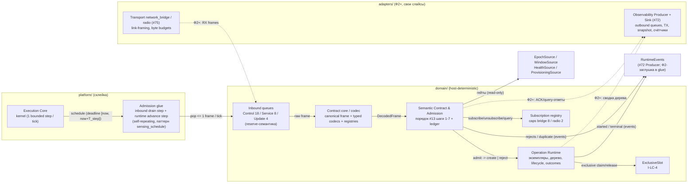
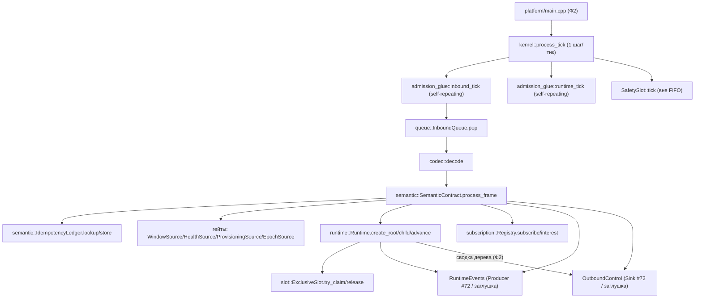
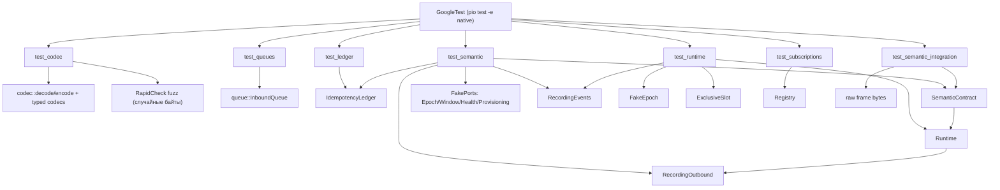

# Дизайн semantic framing, admission и Operation Runtime V3

Статус: **design-артефакт для тикета [«Реализовать semantic framing, admission и Operation Runtime»](https://github.com/Driadix/ShuttleControllerV3/issues/74)** (Фаза 2, один vertical PR по правилу карты [«Реализовать и выпустить firmware-платформу контроллера V3»](https://github.com/Driadix/ShuttleControllerV3/issues/58)).

Этот документ задаёт повторяемый shape of code по методу владельца (место в архитектуре → модели данных → трансформации → зависимости/контракты → shape of code → light-визуализации → типы/сигнатуры → program layout → call stack → тесты с call graph), применяя структуру эталона `docs/execution-foundation-design-v3.md` (#85).

Дизайн наследует утверждённые решения и **не пересматривает** их: #13 (общий semantic contract: envelope, admission, idempotency, lifecycle, stop propagation, visibility), #47 (canonical binary framing, identity widths, layered registries, handshake-роли, obligation-набор §18), #49 (subscription-модель, событийные реестры, snapshot), #43 (границы: Semantic Contract & Admission, Operation Runtime; queue-class и overload policy), #46 (admission-матрица §8, I-LC-1..6, restart-таблица), #48 (ёмкости очередей, authorityId budget, T_step), #51 (R1-R8, include-дисциплина), #10/#54 (cooperative bounded steps). Численные бюджеты — из `docs/quality-attributes-and-budgets-v3.md`; термины — канонические из `CONTEXT.md`.

## §0 Решения владельца (2026-08-14, HITL-брифинг #74)

1. **Idempotency ledger**: глубина **8** записей на **resolved** `authorityId`, политика исчерпания — **FIFO-eviction**; запись 12 Б `{requestId u32, fingerprint u32, outcome u32}`; 16 principals (#48 §6) × 8 × 12 = **1536 Б** RAM. Повтор после вытеснения документированно не распознаётся — как обещает #13 («Если запись вытеснена из bounded ledger, protocol больше не обещает распознать повтор»). Пересмотр: > 8 pending per principal на L4.
2. **Потолок Operation Runtime**: **8** активных экземпляров, глубина дерева владения ≤ **8**; запись ~32 Б → **256 Б** RAM. `InstancesFull` — типизированный отказ (bounded storage, acceptance #74). Пересмотр: фактическая глубина деревьев композиции на первом составном capability-слайсе Фазы 3.
3. **Границы**: codec (contract core, #47 §2) — **domain-side чистый модуль** `domain/codec.*` (canonical frame + typed codecs + registries), общий для обоих профилей, fuzz-testable; **в #74** — inbound-очереди (Control 18 / Service 8 / Update 4, reserve-семантика #43 §6) + Semantic Contract & Admission + Operation Runtime + subscriptions + query/subscription control plane; **в #72** — outbound-очереди/TX, snapshot-документ и счётчики (Observability Producer + Sink). «Сводка дерева операций» в snapshot (#49 §2.6) — read-only снапшот Runtime.
4. **Порядок admission — строго #13** (шаги 1–7): envelope/epoch/authority/права типа → schema параметров → preconditions + safety permit → composition/delegation → **idempotency/conflict (шаг 5)** → доступность/эксклюзивность ресурсов → создание экземпляра. Ledger-lookup **не выносится** перед нормативные проверки; классификация same-vs-conflict выполняется по каноническому fingerprint на шаге 5, и **replay возвращает stored result без повторной резервации** (шаги 6–7 пропускаются), даже если динамические гейты (health/окно/слот) с тех пор изменились.

---

## 1. Место в архитектуре



| Элемент | Компонент (#43 §2) | Владение | Примечание |
| --- | --- | --- | --- |
| Inbound queues | Semantic Contract & Admission (policy) | domain; enforcement — механическая в адаптерах (#43 §6) | производственная форма slice::QueueClasses: frame-based, reserve-слоты stop/handshake |
| Contract core / codec | Contract core (#47 §2) | domain (чистый модуль, no-alloc) | canonical binary framing + typed codecs + registries; общий для профилей, «не transport dialect» |
| Semantic Contract & Admission | Semantic Contract & Admission | domain | pipeline #13 шаги 1-7, ledger, гейты #46 §8, authority-роли |
| Operation Runtime | Operation Runtime | domain | экземпляры/дерево/lifecycle/outcomes; bounded step execution |
| ExclusiveSlot | (координация I-LC-4) | domain | один эксклюзивный слот; claim/release — только через admission; Runtime владеет занятием для своих экземпляров, Manual Session (#77) и Update (#76) — тот же модуль |
| Subscription registry | Semantic Contract & Admission (control plane) | domain | bounded-соглашения #49 §9; delivery/byte-caps — Sink (#72) |
| RuntimeEvents | domain-порт (исходящий) | реализует Observability Producer (#72) / заглушка в glue | счётчики ведёт Producer (#43 §4) |
| Гейты Epoch/Window/Health/Provisioning | порты (входящие) | реализуют: execution core (epoch/окно), Safety Authority #71 (health), Config & Profile (#76, заглушка) | read-only снапшоты, single-writer (#46 I-LC-1) |
| Transport / Producer+Sink | адаптеры | #75 / #72 (вне scope #74) | интерфейсы-порты резервируются здесь |

**Граница модуля (#74)**: contract core (framing/кодеки/реестры), inbound очереди, Semantic Contract & Admission (pipeline + ledger + роли), Operation Runtime (экземпляры/дерево/lifecycle/outcomes/slot), subscription registry, порты гейтов и событий, платформенная обвязка (inbound drain + runtime advance шаги). НЕ входят: транспортные адаптеры (#75 — link-framing, handshake-машина, principal-resolution), Observability Producer/Sink и outbound-очереди (#72), snapshot-документ (#72), concrete operation types и algorithms (Фаза 3), Manual Session (#77), provisioning/update (#76).

**ISR-граница (инвариант)**: новых ISR в #74 нет; единственный ISR платформы — TIM2 clock (#70). Все проверки pipeline, runtime-шаги и эмиссия событий — foreground (R2, #43 §3.2). Кодеки и очереди — чистые функции, без блокировок (never-block, #43 §6).

## 2. Модели данных

Все типы — fixed-width (`stdint`, R3), без динамической аллокации (R1), bounded (R4); typed outcomes (R5).

### 2.1 Canonical frame (contract core, #47 §4.1)

```text
| sync0 | sync1 | header (8 Б) | payload (<= 116 Б) | frameChecksum (2 Б) |
```

- `sync0 = 0xE3`, `sync1 = 0x10` — фиксированные байты versioned framing (предлагаемые значения schema table #47 §4.1; не обязаны совпадать с V1 `0xBB 0xCC`).
- `header` (little-endian, 8 Б):

| Поле | Ширина | Семантика |
| --- | --- | --- |
| `protocolMajor` | u8 | = 1 (текущий); major mismatch — hard fail handshake (#47 §5.1) |
| `msgFamily` | u8 | registry §2.2 |
| `msgType` | u8 | per-family registry (расширяемый) |
| `queueClass` | u8 | explicit (registry §2.2) — не выводится из family (#47 §8) |
| `flags` | u8 | bit0 `RESERVE` (stop/handshake — reserve-слот очереди); остальные reserved |
| `frameSeq` | u8 | per-link rolling (transport plane, #47 §4.3); не заменяет `requestId` |
| `payloadLen` | u16 LE | ≤ 116 (MTU 128 − 12 overhead, #48 §6) |

- `payload` — little-endian typed record по `(msgFamily, msgType, protocolMajor)`; декодирование строго bounds-checked (wire length никогда не доверяется, R1/R4).
- `frameChecksum` — CRC-16/CCITT-FALSE над header+payload; защита от **случайной** порчи, не authenticity (#47 §6).
- Overhead 12 Б; полезный payload ≤ 116 Б.

Fixed identity widths (#47 §4.2): `controllerEpoch` u32, `requestId` u32, `operationId` u32, `authorityId` u16, `bridgePrincipalHandle` u16 (transport #75), `sessionId` u16, `sessionSeq` u16, `frameSeq` u8. Strings/UUID на hot path не используются.

### 2.2 Registries (layered, #47 §16)

```cpp
namespace v3::codec {

enum class Family : std::uint8_t {          // #47 §7 taxonomy
    Handshake = 1, Control = 2, Service = 3, Update = 4,
    Session = 5, Observability = 6, Outcome = 7,
};

enum class QueueClass : std::uint8_t {      // explicit queueClass (#47 §8)
    Control = 0, Service = 1, Update = 2,
    Telemetry = 3, Events = 4, Logs = 5, Traces = 6,
};

enum class TransportError : std::uint8_t {  // parse/frame level (#47 §16.1)
    None = 0, BadSync = 1, BadCrc = 2, Truncated = 3,
    PayloadTooLong = 4, UnsupportedMajor = 5, UnknownFamily = 6, EncodeCapacity = 7,
};

enum class RejectCode : std::uint8_t {      // AdmissionRejectionCode, стабильный (#47 §16.2, аддитивно)
    EpochMismatch = 0, HandshakeRequired = 1, Unauthorized = 2, RoleEscalation = 3,
    UnsupportedVersion = 4, UnknownCapabilityRequired = 5, InvalidEnvelope = 6,
    InvalidParameters = 7, Conflict = 8, ResourceConflict = 9, WrongWindow = 10,
    HealthGate = 11, ProvisioningGate = 12, ProfileDenied = 13, ProfileMismatch = 14,
    ProfileNotQualified = 15, SequenceStale = 16, BusyRejected = 17,
    UnknownOperationType = 18,   // аддитивное расширение (#47 §16.2 «plus type-precondition codes»)
    InstancesFull = 19,          // bounded storage runtime (#74 §0.2)
    CompositionInvalid = 20,     // parent/child ребро не разрешено типом или parent не активен (#13 шаг 4/6)
};

enum class OutcomeCode : std::uint16_t {    // OperationOutcomeCode (#13, #47 §16.3): общие семейства
    Succeeded = 0, Cancelled = 1, FailedGeneric = 2,
    // per-type коды добавляются контрактами операций (Фаза 3), аддитивно
};

enum class MsgControl : std::uint8_t {      // Control family, msgType
    OperationRequest = 0, AdmissionAckPositive = 1, AdmissionAckNegative = 2,
    StopIntent = 3, Query = 4, Subscribe = 5, Unsubscribe = 6, SubscriptionAck = 7,
};

enum class MsgHandshake : std::uint8_t {    // Handshake family (codecs; машина - #75)
    Hello = 0, HelloAck = 1, HandshakeReject = 2,
};

} // namespace v3::codec
```

EventId-диапазоны для эмиссии — из #49 §5: 0x04xx admission (reject), 0x05xx queue/overload, 0x06xx операции (started/terminal, session), 0x08xx boot/reset/epoch.

### 2.3 Typed сообщения (payload codecs в scope #74)

```cpp
#pragma pack(push, 1)
namespace v3::codec {

struct OperationRequest {                  // Control / OperationRequest (#47 §9, #13 envelope)
    std::uint32_t request_id;              // уникален в (controllerEpoch, authorityId)
    std::uint32_t controller_epoch;        // fencing (#13); отсутствует/не тот -> EpochMismatch до создания
    std::uint16_t authority_id;            // echo; НЕ resolver principal (#47 §5.1/§18 #12)
    std::uint8_t  role;                    // ControlClient | ServiceClient | SafetyAuthority (канон. CONTEXT.md)
    std::uint16_t operation_type;          // registry типа (Фаза 3 наполняет)
    std::uint32_t parent_operation_id;     // 0 = root; обязателен для child (#13)
    std::uint8_t  params_len;              // <= 64 (bounded; тип валидирует содержимое - Фаза 3)
    std::uint8_t  params[64];
};

struct AdmissionAckPositive {              // Control / AdmissionAckPositive (минимум #13/#47 §9)
    std::uint32_t request_id;
    std::uint32_t controller_epoch;
    std::uint32_t operation_id;            // controller-authored; никогда client-supplied
    std::uint16_t operation_type;
    std::uint32_t parent_operation_id;     // 0 для root
};

struct AdmissionAckNegative {              // Control / AdmissionAckNegative: НИКОГДА без operationId (#47 §18 #5)
    std::uint32_t request_id;
    std::uint32_t controller_epoch;
    std::uint8_t  reject_code;             // RejectCode
};

struct StopIntent { std::uint32_t operation_id; };                 // control intent, идемпотентен (#13)
struct Query { std::uint8_t sections_mask; };                     // read-only, слот не занимает (#46 §8)
struct Subscribe {
    std::uint8_t  class_mask;              // telemetry|events|logs|traces bits
    std::uint8_t  filter;                  // opaque (extension point, #49 §9)
    std::uint16_t min_interval_ms;         // 0 = profile default
    std::uint16_t max_bytes_per_tick;      // доля линк-бюджета (#49 §9)
};
struct Unsubscribe { std::uint8_t sub_id; };
struct SubscriptionAck { std::uint8_t sub_id; bool accepted; std::uint8_t reject_code; };

} // namespace v3::codec
#pragma pack(pop)
```

Параметры операции — непрозрачный bounded blob ≤ 64 Б (расширяемое поле `parameters`, #13); содержимое и обязательность — контракт типа (Фаза 3). Fingerprint идемпотентности — CRC32 над каноническими полями `(role, operation_type, parent_operation_id, params)`.

### 2.4 Idempotency ledger (#13, §0.1)

```cpp
namespace v3::semantic {

// Bounded in-memory ledger, per RESOLVED authorityId (#47 §5.1: «idempotency ledger keyed
// per resolved authorityId»; §18 #10: два handle -> отдельные ledgers). Persistence через
// reboot не требуется (#13). Исчерпание - FIFO-eviction (решение владельца §0.1).
struct LedgerEntry {
    std::uint32_t request_id;   // ключ (вместе с epoch+authorityId)
    std::uint32_t fingerprint;  // CRC32 канонических полей (role, type, parent, params)
    std::uint32_t outcome;      // Accepted: operationId | Rejected: RejectCode
    std::uint8_t  kind;         // 0=accepted, 1=rejected
};

class IdempotencyLedger {
  public:
    static constexpr std::uint32_t DepthPerPrincipal = 8;   // §0.1
    static constexpr std::uint32_t MaxPrincipals    = 16;   // authorityId budget (#48 §6)
    static constexpr std::uint32_t MaxEntries       = MaxPrincipals * DepthPerPrincipal;

    enum class Lookup : std::uint8_t { Miss, SameResult, Conflict };

    // fp = fingerprint запроса. SameResult -> out содержит stored result (replay без
    // повторной резервации, #13 «возвращает тот же admission result»); Conflict ->
    // тот же ключ, другой payload (#13). Miss -> полный admission продолжается.
    Lookup lookup(std::uint32_t epoch, std::uint16_t authority_id,
                  std::uint32_t request_id, std::uint32_t fp, LedgerEntry& out);
    // Store только после фиксации результата admission (шаг 7); rejected тоже хранится -
    // иначе replay отклонённого запроса после изменения гейтов вернул бы иной результат.
    void store(std::uint32_t epoch, std::uint16_t authority_id, const LedgerEntry& e);

    std::uint32_t used(std::uint16_t authority_id) const;
    std::uint32_t evicted_count() const;   // наблюдаемость (событие 0x05xx + счётчик)

  private:
    LedgerEntry m_rings[MaxPrincipals][DepthPerPrincipal];
    std::uint8_t  m_head[MaxPrincipals];   // FIFO per principal
    std::uint8_t  m_count[MaxPrincipals];
};

} // namespace v3::semantic
```

RAM: 16 × 8 × 12 = **1536 Б** (§0.1). Wrap-safe: запись сравнивается по `request_id` (u32) и `epoch`; при совпадении epoch-окна сравнение точное, без модулярной арифметики (значения непрозрачны, только равенство).

### 2.5 Operation Runtime: экземпляр, outcome, дерево

```cpp
namespace v3::runtime {

enum class OpState : std::uint8_t {        // #13 lifecycle (единственный)
    Accepted = 0, Running = 1, Stopping = 2,
    Succeeded = 3, Cancelled = 4, Failed = 5,
};

struct Outcome { std::uint16_t code; std::uint32_t context; };  // typed + bounded diagnostic context (#13)

// Driver: bounded шаг алгоритма операции (Фаза 3 наполняет; #74 - контракт шага).
// Вызывается в runtime::advance (<= 1 экземпляр за вызов, каждый <= T_step, #48 §4).
enum class DriverEventKind : std::uint8_t {
    Continue,      // нужен ещё шаг: runtime перепланирует (deadline now + 1 tick)
    Yield,         // ждёт события/таймера: паркуется до wake
    Spawn,         // запрос субоперации (тип обязан разрешать child-роль, #13)
    Complete, Fail, Cancel,   // терминальные (Cancel разрешён только из Stopping)
};
struct DriverEvent {
    DriverEventKind kind;
    std::uint16_t spawn_type;      // Spawn: operation_type субоперации
    std::uint8_t  spawn_params_len;
    std::uint8_t  spawn_params[64];
    Outcome outcome;               // Complete/Fail/Cancel
};
using DriverFn = DriverEvent (*)(void* ctx, const OperationEnv& env);

struct OperationEnv {              // read-only доступ шага (bounded, без чужих записей, #43 §4)
    std::uint64_t now;             // monotonic ms
    std::uint32_t op_id;
    std::uint32_t parent_op_id;    // 0 = root
    std::uint16_t authority_id;
    bool          child_terminal;  // последняя субоперация завершилась: child_outcome валиден
    Outcome       child_outcome;
};

struct Instance {                  // ~32 Б; 8 экземпляров (§0.2) => 256 Б
    std::uint32_t op_id;           // controller-authored, уникален в epoch, 0 = invalid
    std::uint32_t parent_op_id;    // 0 = root
    std::uint16_t type_id;
    std::uint16_t authority_id;
    OpState       state;
    DriverFn      fn;
    void*         ctx;
    Outcome       outcome;         // фиксируется на терминале; неизменяем повторной доставкой (#13)
};

class Runtime {
  public:
    static constexpr std::uint32_t MaxActiveInstances = 8;  // §0.2
    static constexpr std::uint32_t MaxTreeDepth       = 8;

    enum class CreateResult : std::uint8_t { Accepted, InstancesFull, TreeCycle, ParentMissing, EdgeDenied };
    enum class StopResult  : std::uint8_t { Accepted, Unknown };

    void init(EpochSource* epoch, RuntimeEvents* events, ExclusiveSlot* slot);
    // Создание по принятому запросу (вызывает Semantic Contract после всех гейтов #13).
    // root: parent_op_id == 0 (слот claim для эксклюзив-класса - через slot).
    CreateResult create_root(const CreateRequest& r);
    CreateResult create_child(const CreateRequest& r);     // Spawn из driver; ребро проверяется
    // Bounded advance: <= 1 due-экземпляр за вызов (dispatch contract #70 §2.1);
    // вызывается glue-шагом каждый тик. Каждый driver <= T_step; overrun наблюдаем.
    void advance(std::uint64_t now);
    // Stop-интент (control plane): идемпотентен; root -> Stopping + каскад на descendants (#13).
    StopResult stop(std::uint32_t op_id);
    // Latched fault (Safety Authority): активные экземпляры -> Stopping/Failed (#46 §10, #13).
    void fault_cascade();
    bool slot_held() const;
    // Read-only снапшот для #72 (сводка дерева в query snapshot, #49 §2.6).
    const Instance* snapshot(std::uint32_t& count) const;

  private:
    Instance m_instances[MaxActiveInstances];
    std::uint32_t m_next_op_id = 0;  // monotonic в epoch; 0 никогда не выдаётся; wrap-safe
    std::uint32_t m_epoch = 0;
    ...
};

} // namespace v3::runtime
```

Lifecycle-переходы (#13): `Accepted -> Running -> Succeeded`; `Running -> Stopping -> Cancelled`; `Running -> Failed`; `Stopping -> Failed` (если safe stop не завершился). `Rejected` — результат admission запроса, не состояние экземпляра. Переходы проверяются на границе bounded шага (I-LC-2).

### 2.6 ExclusiveSlot (I-LC-4, #46 §8)

```cpp
namespace v3::slot {

enum class Activity : std::uint8_t { Idle = 0, Motion = 1, ManualSession = 2, Service = 3, Update = 4 };

class ExclusiveSlot {
  public:
    bool try_claim(Activity a);   // Idle -> a; занят -> false (admission отвечает ResourceConflict)
    void release(Activity a);     // только владелец; mismatch -> no-op (инвариант single-writer)
    Activity current() const;
  private:
    Activity m_current = Activity::Idle;
};

} // namespace v3::slot
```

Занятие: Runtime — для эксклюзивных root (motion/service-класс); Manual Session (#77) и Update (#76) используют тот же модуль. Query/subscription/read-only слот не занимают (#46 §8). Safety intents не гейтятся (#46 §8: «не гейтятся»).

### 2.7 Subscription registry (#49 §9)

```cpp
namespace v3::subscription {

struct Subscription {                 // bounded-соглашение (класс(ы), filter, minInterval, maxBytesPerTick)
    std::uint8_t  sub_id;
    std::uint16_t authority_id;       // per-principal
    std::uint8_t  class_mask;         // telemetry|events|logs|traces bits
    std::uint8_t  filter;
    std::uint16_t min_interval_ms;
    std::uint16_t max_bytes_per_tick;
    bool          active;
};

class Registry {
  public:
    static constexpr std::uint8_t BridgeCap = 8;   // #49 §9: bridge <= 8
    static constexpr std::uint8_t RadioCap  = 2;   // #49 §9: radio <= 2 (профильная таблица; #75)

    enum class Result : std::uint8_t { Ok, CapsExceeded, UnknownSub, EpochReset };

    Result subscribe(std::uint16_t authority_id, const Subscribe& s, std::uint8_t& sub_id);
    Result unsubscribe(std::uint16_t authority_id, std::uint8_t sub_id);
    void   epoch_reset();                       // подписки умирают с epoch/сессией (#49 §9)
    // Интерес: поток класса существует при >= 1 активной подписке или profile default.
    // Дефолты (#49 §9): bridge - telemetry 300 ms + events всегда; radio - events всегда,
    // telemetry только по подписке. Effective profile - конфигурация (здесь: таблица дефолтов).
    bool interest(QueueClass cls) const;
    // Рождение (birth, #49 §2.6): на (re)subscribe контроллер пушит полный snapshot.
    bool birth_pending(std::uint16_t authority_id) const;
    // Drop медленного потребителя: per-subscription счётчик через событие (0x05xx) - счётчик у Producer.
    void note_drop(std::uint8_t sub_id);

  private:
    Subscription m_subs[BridgeCap];             // 8 слотов; radio-профиль лимитирует выборку
    std::uint8_t m_next_sub_id = 1;             // 0 = invalid
    bool m_birth[BridgeCap];
};

} // namespace v3::subscription
```

RAM: 8 × ~12 Б ≈ 96 Б.

### 2.8 Inbound queue classes (production, #48 §6, #43 §6)

```cpp
namespace v3::queue {

// Frame-based bounded inbound очереди (production-форма slice::QueueClasses).
// Overload: Control/Service - reject на admission (кроме reserve); Update - pause,
// reject только новых транзакций при насыщении. Stop/handshake (flags.RESERVE)
// попадают в reserve-слоты и НЕ отклоняются (#43 §6, #48 §6: 16 + 2 резерв).
struct Frame { std::uint8_t data[128]; std::uint16_t len; };   // MTU 128 (#48 §6)

enum class Class : std::uint8_t { Control = 0, Service = 1, Update = 2 };

class InboundQueue {
  public:
    static constexpr std::uint32_t ControlCapacity = 18;   // 16 рабочих + 2 резервных
    static constexpr std::uint32_t ServiceCapacity = 8;
    static constexpr std::uint32_t UpdateCapacity  = 4;    // 2 резерв при in-progress (#43 §6)

    // reserve=true (stop/handshake) -> никогда не отклоняется (резервный слот).
    // false + полна -> false + счётчик + событие (0x05xx) - counter у Producer.
    bool push(Class cls, const Frame& f, bool reserve);
    bool pop(Class cls, Frame& out);
    bool is_full(Class cls) const;
    std::uint32_t rejected(Class cls) const;   // переполнение наблюдаемо (obs #7)

  private:
    StaticQueue<Frame, ControlCapacity> m_control;
    StaticQueue<Frame, ServiceCapacity> m_service;
    StaticQueue<Frame, UpdateCapacity>  m_update;
};

} // namespace v3::queue
```

RAM: (18 + 8 + 4) × 130 Б ≈ **3.9 КБ** (в бюджете #48 §6 ~14 КБ суммарно с outbound #72).

### 2.9 Порты гейтов (read-only снапшоты, single-writer #46 I-LC-1)

```cpp
// domain/ports.h - добавляются в #74 (production-форма)
struct EpochSource { virtual std::uint32_t epoch() const = 0; };                 // execution core: выдаётся при выходе Boot (#46 §9)
enum class PlatformWindow : std::uint8_t { Boot = 0, Serving = 1, Update = 2, Recovery = 3 };
struct WindowSource { virtual PlatformWindow window() const = 0; };              // execution core (I-LC-1)
struct HealthSource { virtual safety::SafetyHealth health() const = 0; };        // Safety Authority #71 (read-only)
enum class ProvisioningStatus : std::uint8_t { Unprovisioned = 0, Provisioning = 1, Provisioned = 2 };
struct ProvisioningSource { virtual ProvisioningStatus status() const = 0; };    // Config & Profile (#76; заглушка до него)
```

Эти порты реализуются вне #74 (кроме HealthSource — уже реализован #71); glue инжектирует реализации.

## 3. Трансформации

### 3.1 Поток тика (foreground; inbound drain + runtime advance как self-repeating шаги)

```text
loop() -> kernel::run() -> process_tick()                  # 1 bounded step / tick (#70 §2.1)
  ├─ ring.run_next(now)
  │  └─ StepFn: admission_glue::inbound_tick(ctx)          # self-repeating (паттерн sensing_schedule)
  │     ├─ queue.pop(Control, frame)                       # <= 1 кадр за тик (bounded drain)
  │     ├─ codec::decode(frame)                            # BadCrc/BadSync/Truncated -> drop + TransportError-событие
  │     ├─ semantic.process_frame(decoded)                 # admission pipeline §3.2 (или query/subscribe/stop)
  │     │  └─ ответы -> outbound-порт (Ф2: Sink #72; glue-заглушка)
  │     └─ re-arm (fresh now + 1, retry при reject - паттерн #63)
  │  └─ StepFn: admission_glue::runtime_tick(ctx)          # self-repeating
  │     └─ runtime.advance(now)                            # <= 1 due-экземпляр; <= T_step
  ├─ safety->tick(now)                                     # обязательная граница ВНЕ FIFO (#70 §2.5)
  └─ watchdog.reload()
```

Два шага (inbound + runtime) чередуются планировщиком (1 шаг/тик): worst-case латентность admission ≤ 2 тика (20 ms); stop-intents в reserve-слотах очереди не теряются (не отклоняются), латентность обработки ≤ 1–2 тика. Control-бэклог (18 кадров) дренируется ≤ 1 кадр/тик — bounded, не блокирует safety (граница вне FIFO).

### 3.2 Admission pipeline (строго порядок #13 шаги 1–7)

```text
process_frame(DecodedFrame):
  1. envelope: family/major/тип известны, payload валиден      -> InvalidEnvelope / UnsupportedVersion
  2. epoch: request.controller_epoch == epoch_source.epoch()   -> EpochMismatch
  3. authority/права типа: resolvedAuthorityId (transport, #75) -> grant; role запроса in grant
                                                               -> Unauthorized / RoleEscalation
  4. schema параметров: params_len <= 64, тип известен         -> UnknownOperationType / InvalidParameters
  5. preconditions + safety permit (контракт типа; #74: registry-заглушка, детерминированно)
  6. composition/delegation (СТАТИЧЕСКИ): parentOperationId структурно валиден,
     ребро type graph разрешено (child-роль)                   -> CompositionInvalid
  ---------------------------------------------------------------
  # шаг 5 НОРМАТИВНОГО порядка (#13): idempotency/conflict
  7. fingerprint = crc32(role, operation_type, parent_operation_id, params)
     ledger.lookup(epoch, authorityId, request_id, fp):
       SameResult -> replay: вернуть stored result (ACK pos/neg как был), БЕЗ шагов 8-10,
                     без повторной резервации ресурсов (решение §0.4)
       Conflict   -> AdmissionAckNegative(Conflict), НЕ создавать экземпляр
       Miss       -> продолжить
  ---------------------------------------------------------------
  # шаг 6: доступность и эксклюзивность ресурсов (#46 §8 матрица)
  8. window gate (Serving для exclusive-классов; query - Serving/Update/Recovery) -> WrongWindow
  9. health gate (Ready/Degraded для motion; Fault блокирует exclusive)             -> HealthGate
 10. provisioning gate (Provisioned для exclusive; Unprovisioned -> только Service) -> ProvisioningGate
 11. эксклюзивный слот (root: slot.try_claim; child: parent активен + делегированные
     ресурсы доступны)                                                              -> ResourceConflict
 12. preconditions типа + safety permit (динамическая часть)                        -> тип-специфичный код
  ---------------------------------------------------------------
  # шаг 7: создание экземпляра и фиксация начального lifecycle
 13. runtime.create_root/child -> Accepted | InstancesFull | TreeCycle | ...
     (InstancesFull -> AdmissionAckNegative(InstancesFull); bounded storage)
 14. ledger.store(epoch, authorityId, {request_id, fp, outcome})   # Accepted -> operationId
 15. AdmissionAckPositive {request_id, epoch, operation_id, type, parent}  # или Negative (без operationId, #47 §18 #5)
     events.operation_started(op_id, type_id)                     # 0x06xx
```

Порядок 4–6 (schema/preconditions/composition) детерминирован для данного payload — поэтому replay того же запроса проходит шаги 1–6 идентично и попадает в lookup на шаге 7 (нормативный шаг 5). Динамические гейты (window/health/provisioning/slot) — строго ПОСЛЕ lookup; это и даёт «тот же admission result» при изменившихся гейтах без раннего bypass.

Резервирование ресурсов root — только после положительного ACK; отрицательный ACK не оставляет частичной резервации (#13). Повторная доставка терминального экземпляра: lookup возвращает SameResult со stored operationId (outcome неизменяем, #13).

### 3.3 Runtime advance (bounded step)

```text
advance(now):
  idx = следующий экземпляр в состоянии Accepted|Running|Stopping (FIFO по времени входа)
  if none: return
  t0 = ticks_us()
  ev = instance.fn(instance.ctx, env)          # <= T_step (overrun -> событие, #70)
  switch ev.kind:
    Continue -> state = Running; (перепланируется: следующий advance подхватит; deadline now+1)
    Yield    -> парк (ждёт wake: событие/таймер; advance пропускает)
    Spawn    -> create_child (ребро + делегация; InstancesFull -> driver получает отказ
                через env.child_outcome с кодом отказа - Фаза 3 уточнит контракт отказа)
    Complete -> state = Succeeded; outcome = ev.outcome; release(slot/делегированные);
                events.operation_terminal; parent.env.child_terminal = true (если есть parent)
    Fail     -> state = Failed; outcome; release; events; notify parent
    Cancel   -> (только из Stopping) state = Cancelled; outcome; release; events; notify parent
  dt_ms = (ticks_us() - t0)/1000; dt_ms > T_step -> events.overrun (0x05xx-класс)
```

Гарантия bounded: один экземпляр за вызов; каждый driver ≤ T_step (#48 §4). Backlog экземпляров (до 8) дренируется ≤ 1 за тик — bounded, safety-граница вне FIFO не задерживается (#70 §2.5).

### 3.4 Stop propagation и fault cascade (#13)

```text
stop(op_id):
  экземпляр не найден -> StopResult::Unknown (идемпотентен: повторный stop - no-op)
  state == Running -> Stopping; driver получит Cancel на следующем advance (env-сигнал)
  state == Accepted -> Stopping (не начат)
  каскад: все активные descendants -> Stopping (рекурсивно, bounded по глубине <= 8)
  parent остаётся Stopping, пока descendants не терминальны и делегированные ресурсы
  не освобождены (#13 «parent остаётся Stopping, пока descendants безопасно не завершены»)
  Stopping -> Cancelled: все descendants терминальны и stop завершён
  Stopping -> Failed: driver не смог завершить safe stop (сигнал из driver, #13)

fault_cascade() (SA latched fault -> INV-FAULT-ADMISSION, #46 §10):
  все активные экземпляры -> Stopping (motion-класс -> stop-профиль по #45 через воронку;
  runtime не исполняет safety-политику - только переводит lifecycle по правилу #13/#46)
```

Safety Authority остаётся единственной arbitration-воронкой (#43 §3.1); Runtime не исполняет safety-политику — только переводит lifecycle по правилу #13/#46 (safety precedence не нарушает identity и traceability, #13).

### 3.5 Subscription lifecycle (#49 §9)

```text
subscribe(authorityId, s):
  слотов нет (>= 8 на bridge / >= 2 на radio) -> CapsExceeded -> SubscriptionAck(rejected)
  dup-активная подписка того же principal с тем же class_mask -> обновление параметров (idempotent)
  birth_pending(authorityId) = true            # контроллер пушит полный snapshot (birth, #49 §2.6)
  events.subscription_changed(active=true)

unsubscribe(authorityId, sub_id): sub_id не принадлежит principal -> UnknownSub
epoch_reset(): все подписки умирают (lifetime = сессия/epoch, #49 §9; #46 I-LC-6)
interest(cls): any(active sub with class bit) || profile default (bridge: telemetry+events; radio: events)
```

Доставка (per-tick byte caps, drop медленного потребителя, gap re-sync клиентом) — #72 Sink; registry поставляет только состояние/интерес.

### 3.6 Ledger eviction

```text
store(epoch, authorityId, entry):
  ring[authorityId] полон (depth 8) -> FIFO: вытеснить head, evicted_count++, событие 0x05xx
  (protocol больше не обещает распознать повтор вытесненного - #13; клиент сверяется query)
  push tail
```

## 4. Зависимости и контракты

### 4.1 Dependency-матрица (внутрь, #43/#51)

| Модуль | Зависит от | НЕ зависит от |
| --- | --- | --- |
| `domain/codec.*` | — (чистый: stdint только) | Arduino Core, адаптеров, domain |
| `domain/queues.h` | `domain/static_queue.h` | Arduino, codec (байтовый контейнер) |
| `domain/semantic.*` | `domain/codec.h`, `domain/ports.h` (Epoch/Window/Health/Provisioning, RuntimeEvents, Outbound), `domain/runtime.h`, `domain/subscriptions.h`, `domain/queue` | Arduino, адаптеров |
| `domain/runtime.*` | `domain/ports.h` (EpochSource, RuntimeEvents), `domain/slot.h` | codec (экземпляр не знает wire), Arduino |
| `domain/subscriptions.*` | `domain/codec.h` (QueueClass), `domain/ports.h` (RuntimeEvents) | Arduino, транспорт |
| `domain/slot.h` | — | — |
| `platform/admission_glue.*` | `platform/execution_core.h`, `domain/*`, `domain/ports.h` | Arduino (host-buildable, паттерн sensing_schedule) |

Enforcement: include-lint (#51 §5.2) запрещает Arduino/RTOS-заголовки в `domain/`; native-сборка домена без framework (`build_src_filter +<domain/*> +<platform/*> -<platform/main.cpp>`, platformio.ini).

### 4.2 Порты (domain/ports.h, production-форма)

```cpp
// EpochSource / WindowSource / HealthSource / ProvisioningSource - §2.9 (гейты, read-only)
struct RuntimeEvents {   // исходящий порт событий; реализует Observability Producer (#72), glue-заглушка до него
    virtual void admission_rejected(std::uint8_t reject_code) = 0;          // 0x04xx + счётчик (#49 §5)
    virtual void request_duplicate(std::uint32_t request_id, bool conflict) = 0;
    virtual void transport_error(codec::TransportError e) = 0;              // BadCrc/BadSync/... 0x05xx
    virtual void queue_rejected(codec::QueueClass cls) = 0;                 // inbound overload 0x05xx
    virtual void operation_started(std::uint32_t op_id, std::uint16_t type_id) = 0;   // 0x06xx
    virtual void operation_terminal(std::uint32_t op_id, std::uint16_t type_id,
                                    std::uint16_t outcome_code) = 0;                  // 0x06xx
    virtual void subscription_changed(std::uint16_t authority_id, bool active) = 0;
};
struct OutboundControl {   // исходящий порт ответов (ACK/query/sub); реализует Sink (#72), glue-заглушка
    virtual bool enqueue(codec::QueueClass cls, const std::uint8_t* data, std::uint32_t len) = 0;  // never-block, bounded
};
```

Счётчики (включая per-drop/per-reject) ведёт Producer (#43 §4) — порт только эмитит.

### 4.3 Инварианты (наследуются, не пересматриваются)

| Инвариант | Источник | Проверка |
| --- | --- | --- |
| Admission порядок #13 шаги 1–7; idempotency — шаг 5, replay без re-reservation | #13, §0.4 | host-тесты T11/T12/T13 (порядок + replay при изменившихся гейтах) |
| Negative ACK никогда не несёт `operationId` | #47 §18 #5 | T10 (codec) + T22 (pipeline) |
| Единственный эксклюзивный слот (I-LC-4) | #46 §8 | T26, T29 (slot claim/release, ResourceConflict) |
| Одно дерево владения без циклов; глубина ≤ 8 | #13, §0.2 | T27 (cycle), T28 (depth) |
| Terminal outcome неизменяем повторной доставкой | #13 | T30 |
| Bounded storage: ledger 16×8, экземпляры 8, subs 8 | #48 §6, §0.1/§0.2 | T20 (eviction), T28 (InstancesFull), T35 (caps) |
| Каждый шаг ≤ T_step (10 ms); overrun наблюдаем | #48 §4 | T31 (runtime overrun) |
| Кадр ≤ MTU 128; payload ≤ 116; malformed → reject | #48 §6, #47 §4 | T1–T9 (codec + fuzz) |
| Никакой динамической аллокации | #51 R1 | include-lint, clang-tidy, review |
| Всё foreground; ISR — только TIM2 clock | #43 §3.2, R2 | review-checklist (новых ISR нет) |
| Mutating запрещён до handshake; epoch fencing | #13, #47 §5.1 | T14 (epoch), handshake-машина — #75 (роль проверяется по grant) |

## 5. Shape of code

### 5.1 Program layout

```text
domain/
  codec.h/.cpp            # contract core: frame encode/decode, typed codecs, registries (чистый, no-alloc)
  queues.h                # production inbound queue classes (Frame-based, reserve-семантика)
  slot.h/.cpp             # ExclusiveSlot (I-LC-4)
  ledger.h/.cpp           # IdempotencyLedger (per-principal rings)
  semantic.h/.cpp         # Semantic Contract & Admission: process_frame, pipeline, гейты, роли
  runtime.h/.cpp          # Operation Runtime: экземпляры, дерево, lifecycle, outcomes, advance
  subscriptions.h/.cpp    # subscription registry + интерес
  ports.h                 # + EpochSource/WindowSource/HealthSource/ProvisioningSource,
                          #   RuntimeEvents, OutboundControl
platform/
  admission_glue.h/.cpp   # inbound drain step + runtime advance step (self-repeating, host-buildable)
  main.cpp                # wiring: адаптеры/заглушки -> kernel::init + glue (Ф2)
tests/
  test_codec/             # frame, codecs, malformed, fuzz
  test_queues/            # reserve-семантика, overload, счётчики
  test_ledger/            # per-principal, eviction, conflict
  test_semantic/          # pipeline порядок, гейты, replay, роли
  test_runtime/           # дерево, lifecycle, stop, fault cascade, budget
  test_subscriptions/     # caps, интерес, epoch reset, birth
  test_semantic_integration/  # E2E raw-байты -> ACK, bounded storage под flood
```

### 5.2 Public API (production-форма)

```cpp
namespace v3::codec {      // contract core (чистые функции)
    constexpr std::uint16_t Mtu = 128;
    constexpr std::uint16_t MaxPayload = 116;   // MTU - (sync 2 + header 8 + crc 2)
    struct DecodedFrame { Header h; const std::uint8_t* payload; std::uint16_t len; };
    DecodeResult decode(const std::uint8_t* buf, std::uint16_t len, DecodedFrame& out);
    std::uint16_t encode(std::uint8_t* buf, std::uint16_t cap, const Header& h,
                         const std::uint8_t* payload, std::uint16_t len);   // 0 = capacity error
    std::uint16_t crc16(const std::uint8_t* data, std::uint16_t len);
    // typed codecs (bounds-checked; все возвращают CodecResult, R5):
    CodecResult decode_operation_request(const std::uint8_t* p, std::uint16_t len, OperationRequest& out);
    CodecResult decode_stop_intent(...); decode_query(...); decode_subscribe(...); decode_unsubscribe(...);
    std::uint16_t encode_ack_pos(std::uint8_t* buf, std::uint16_t cap, const AdmissionAckPositive& a);
    std::uint16_t encode_ack_neg(std::uint8_t* buf, std::uint16_t cap, const AdmissionAckNegative& a);
    std::uint16_t encode_sub_ack(...);
}

namespace v3::queue { class InboundQueue { push/pop/is_full/rejected }; }

namespace v3::semantic {
    class IdempotencyLedger { lookup/store/used/evicted_count };
    class SemanticContract {
      public:
        void init(EpochSource*, WindowSource*, HealthSource*, ProvisioningSource*,
                  RuntimeEvents*, OutboundControl*, runtime::Runtime*, subscription::Registry*);
        // Один кадр control-класса: pipeline §3.2; bounded <= T_step; ответы - через outbound.
        void process_frame(const codec::DecodedFrame& f);
    };
}

namespace v3::runtime { class Runtime { create_root/create_child/advance/stop/fault_cascade/slot_held/snapshot }; }
namespace v3::slot { class ExclusiveSlot { try_claim/release/current }; }
namespace v3::subscription { class Registry { subscribe/unsubscribe/epoch_reset/interest/birth_pending/note_drop }; }
```

Изменения против slice: `slice::QueueClasses` (byte-синтетика) → production `v3::queue::InboundQueue` (Frame-based, reserve-семантика); новые модули codec/semantic/runtime/subscriptions/slot; `slice::ObservabilityPort` (эмиссия байт) → `v3::OutboundControl` (ответы control-класса) + `v3::RuntimeEvents` (события); старые синтетические счётчики очередей сохраняются только как наблюдаемость rejected().

### 5.3 Типичный call stack (target, Serving, Фаза 2 после #72/#75)

```text
loop() -> kernel::run() -> process_tick()
  └─ ring.run_next(now)
     └─ admission_glue::inbound_tick
        ├─ queue.pop(Control, frame)              # transport #75 положил кадр
        ├─ codec::decode(frame)                  # sync/header/crc -> DecodedFrame
        ├─ semantic.process_frame(frame)         # pipeline §3.2
        │  ├─ (гейты) window_source->window(); health_source->health(); ...
        │  ├─ ledger.lookup(epoch, authorityId, requestId, fp)
        │  ├─ runtime.create_root(req)           # slot.try_claim(Motion)
        │  └─ outbound->enqueue(Control, ack_pos) # Sink #72 -> UART
        └─ re-arm (fresh now + 1)
     └─ admission_glue::runtime_tick
        └─ runtime.advance(now)
           └─ instance.fn(ctx, env)              # driver операции (Фаза 3)
              └─ (read-only снапшоты Sensing/Actuator - Фаза 3)
  ├─ safety->tick(now)                            # Safety Authority (вне FIFO, #70)
  └─ watchdog.reload()
```

## 6. Light-визуализации (псевдокод)

```text
# codec::decode - чистый, bounds-checked, no-alloc
decode(buf, len) -> DecodedFrame | error:
  if len < 12: return Truncated
  if buf[0] != Sync0 or buf[1] != Sync1: return BadSync
  header = parse_header(buf + 2)                    # LE-поля, без cast на wire-память
  if header.payload_len > MaxPayload: return PayloadTooLong
  if 12 + header.payload_len > len: return Truncated
  if crc16(buf + 2, 10 + header.payload_len) != rd16(buf + 12 + header.payload_len): return BadCrc
  if header.protocol_major != Major1: return UnsupportedMajor
  if header.msg_family not in registry: return UnknownFamily
  return DecodedFrame{header, buf + 10, payload_len}
```

```text
# semantic.process_frame - один кадр, bounded (T_step)
process_frame(f):
  msg = dispatch(f.header.family, f.header.msg_type, f.payload)   # codec; ошибка -> InvalidEnvelope + event
  case msg:
    OperationRequest -> ack = admit(msg); outbound->enqueue(Control, encode(ack))
    StopIntent       -> runtime.stop(msg.operation_id)            # идемпотентно; no ack обязателен (#13)
    Query            -> if gates_query_ok(): outbound->enqueue(Control, snapshot_request)  # документ - #72
    Subscribe        -> registry.subscribe(authority_id, msg) -> encode_sub_ack
    Unsubscribe      -> registry.unsubscribe(...) -> encode_sub_ack
    (другие families: Service/Update/Session payload - Фазы #76/#77; header-level ok, payload - reject)

admit(req) -> AckPos | AckNeg:                      # порядок строго #13 (§3.2)
  if req.controller_epoch != epoch_source->epoch(): return Neg(EpochMismatch)
  grant = principal_grant(resolved_authority_id)    # transport #75 предоставляет; здесь - роль из кадра
  if not grant.contains(req.role):                  return Neg(RoleEscalation)    # или Unauthorized
  type = type_registry(req.operation_type)          # Фаза 3; сейчас: известные id (пусто) -> UnknownOperationType
  if type == null:                                  return Neg(UnknownOperationType)
  if req.params_len > ParamsMax or not type.schema_ok(req.params): return Neg(InvalidParameters)
  if req.parent_operation_id != 0 and not type.child_allowed:      return Neg(CompositionInvalid)
  fp = crc32(req.role, req.operation_type, req.parent_operation_id, req.params)
  switch ledger.lookup(epoch, authority_id, req.request_id, fp):
    SameResult -> return replay_stored(entry)       # БЕЗ повторной резервации (§0.4)
    Conflict   -> return Neg(Conflict)
    Miss       -> break
  # шаг 6: гейты (#46 §8)
  if type.exclusive and window_source->window() != Serving: return Neg(WrongWindow)
  if type.exclusive and health_source->health() == Fault:    return Neg(HealthGate)
  if type.exclusive and provisioning_source->status() != Provisioned: return Neg(ProvisioningGate)
  if type.exclusive and req.parent_operation_id == 0:
      if not slot->try_claim(class_activity(type)):           return Neg(ResourceConflict)
  if req.parent_operation_id != 0:
      if not runtime.parent_active_and_delegates(req.parent_operation_id, type):
                                                              return Neg(ResourceConflict)
  # шаг 7: создать + ledger + ACK
  result = runtime.create_root/child(req)
  if result != Accepted:
      if slot claimed: slot->release(...)            # откат резервации (частичной не остаётся, #13)
      return Neg(result == InstancesFull ? InstancesFull : ResourceConflict)
  ledger.store(epoch, authority_id, {req.request_id, fp, op_id})
  events->operation_started(op_id, type_id)
  return AckPos{req.request_id, epoch, op_id, type_id, parent}
```

```text
# runtime.advance - один экземпляр за вызов, bounded
advance(now):
  i = next_active_index()               # Accepted|Running|Stopping, FIFO
  if i == none: return
  t0 = ticks_us()
  ev = instances[i].fn(instances[i].ctx, make_env(i))   # env: now, op_id, child_terminal/outcome
  dt = (ticks_us() - t0) / 1000
  if dt > T_step: events->overrun(dt)                   # наблюдаемое нарушение бюджета
  apply(ev, i)                                          # §3.3: state/outcome/slot/release/events/notify parent
```

```text
# queue.push - reserve-семантика (#43 §6, #48 §6)
push(cls, frame, reserve):
  q = queue(cls)
  if q.push(frame): return true
  if reserve: return push_reserve_slot(cls, frame)      # stop/handshake никогда не отклоняются
  rejected(cls)++; events->queue_rejected(cls); return false   # счётчик у Producer
```

## 7. Тесты с call graph

### 7.1 Production call graph



### 7.2 Test call graph (host, deterministic)



### 7.3 Тест-кейсы (L2 host; firmware build — target compile)

| # | Suite | Проверяемый контракт | Метод/oracle | Среда |
| --- | --- | --- | --- | --- |
| T1 | test_codec | Frame round-trip: encode → decode даёт те же header/payload; sync/header LE-поля | известные байты, assert | host |
| T2 | test_codec | BadCrc → decode error; порча 1 бита payload детектится (CRC-класс, #47 §4.1) | мутация кадра | host |
| T3 | test_codec | Truncated (< 12 Б; payload_len > имеющихся байт) → error, нет чтения за границей | короткие буферы | host |
| T4 | test_codec | PayloadTooLong (payload > 116) → error; MTU-граница 128/116 | граничные len | host |
| T5 | test_codec | UnsupportedMajor / UnknownFamily / unknown msgType → error (версионная матрица, #47 §18 #1) | версии | host |
| T6 | test_codec | typed codecs: OperationRequest round-trip; params_len > 64 → error; truncated → error | границы полей | host |
| T7 | test_codec | Negative ACK encode: поле operationId отсутствует (структура без него, #47 §18 #5) | размер структуры | host |
| T8 | test_codec | `encode` с малым cap → 0 (EncodeCapacity), без переполнения буфера | cap = len-1 | host |
| T9 | test_codec | **Fuzz**: произвольные байты → decode не падает, не принимает мусор без CRC-валидности; round-trip инвариант | RapidCheck property | host |
| T10 | test_queues | Control 18: 16 обычных push ок; 17-й обычный → false + счётчик + событие queue_rejected | заполнение | host |
| T11 | test_queues | Reserve: при полной Control stop/handshake (RESERVE) НЕ отклоняется (#43 §6, #48 §6) | полная очередь + reserve push | host |
| T12 | test_queues | Service 8 reject на admission; Update 4: 2 резерв при in-progress, новые транзакции reject | насыщение | host |
| T13 | test_queues | FIFO-порядок pop; rejected() наблюдаем | порядок | host |
| T14 | test_ledger | Ключ = (epoch, authorityId, requestId): изоляция per-principal (#47 §18 #10) | два principal, пересекающиеся requestId | host |
| T15 | test_ledger | SameResult: тот же ключ + тот же fingerprint → stored result (opId/rejectCode) | lookup | host |
| T16 | test_ledger | Conflict: тот же ключ + другой fingerprint (payload/type/parent) → Conflict (#13) | разные fp | host |
| T17 | test_ledger | FIFO-eviction: depth 8, 9-й store вытесняет head, evicted_count растёт; вытесненный → Miss | overflow | host |
| T18 | test_ledger | Store rejected-результат: replay отклонённого возвращает тот же код | store/replay | host |
| T19 | test_semantic | Порядок #13: InvalidEnvelope → EpochMismatch → RoleEscalation → UnknownOperationType → InvalidParameters → CompositionInvalid — первая ошибка побеждает | невалидные запросы по шагам | host |
| T20 | test_semantic | Idempotency на шаге 5 (не раньше): запрос с плохой схемой параметров НЕ доходит до ledger (нет store); валидный — store после создания | порядок вызовов RecordingEvents/Ledger | host |
| T21 | test_semantic | **Replay при изменившихся гейтах**: accepted → health→Fault → тот же requestId+payload → тот же ACK (opId), НЕТ повторного claim слота/создания (§0.4) | FakePorts переключение health | host |
| T22 | test_semantic | Replay rejected при изменившихся гейтах (health восстановился) → тот же rejectCode, НЕ создаётся экземпляр | ledger store rejected | host |
| T23 | test_semantic | Negative ACK не содержит operationId; положительный — содержит все поля (#47 §9/#13) | encode-assert | host |
| T24 | test_semantic | Гейты #46 §8: WrongWindow (Serving required), HealthGate (Fault), ProvisioningGate (Unprovisioned), ResourceConflict (слот занят) | FakePorts по матрице | host |
| T25 | test_semantic | Откат резервации: create → InstancesFull → слот освобождён, частичной резервации нет (#13) | slot state после | host |
| T26 | test_semantic | Роли: role вне grant → RoleEscalation; неавторизованный → Unauthorized (#47 §18 #13) | grant-таблица | host |
| T27 | test_runtime | operationId: уникален в epoch, 0 никогда не выдаётся, wrap через 2^32 не дублирует | alloc подряд | host |
| T28 | test_runtime | Дерево: root/child; цикл (child → предок) → TreeCycle; глубина > 8 → отказ; InstancesFull при 8 активных | create-последовательности | host |
| T29 | test_runtime | Lifecycle: Accepted→Running→Succeeded; Running→Failed; terminal outcome неизменяем | driver-сигналы | host |
| T30 | test_runtime | Stop: root → Stopping + каскад на descendants; parent ждёт descendants (Stopping); все терминальны → Cancelled; повторный stop идемпотентен (#13) | stop(root), assert состояний | host |
| T31 | test_runtime | Stopping→Failed: driver не завершает safe stop → Failed (#13) | driver возвращает Fail из Stopping | host |
| T32 | test_runtime | Fault cascade: latched fault → активные → Stopping; slot освобождён после терминала (#46 §10) | fault_cascade() | host |
| T33 | test_runtime | Budget: driver, продвигающий время > T_step внутри вызова → overrun-событие (#48 §4) | FakeEpoch advance | host |
| T34 | test_runtime | Субоперация: Complete child → parent.env.child_terminal + outcome; делегированные ресурсы освобождаются на терминале (#13) | spawn/complete | host |
| T35 | test_subscriptions | Caps: 9-я подписка на bridge → CapsExceeded (#49 §9) | заполнение | host |
| T36 | test_subscriptions | Интерес: telemetry-interest = подписка ∨ profile default (bridge: telemetry+events; radio: events); logs/traces — только по подписке | классы × профили | host |
| T37 | test_subscriptions | birth: на (re)subscribe → birth_pending; unsubscribe → снят; epoch_reset → все умерли (#49 §9) | lifecycle | host |
| T38 | test_subscriptions | Per-principal: подписка principal A не видна B; UnknownSub при чужом sub_id | изоляция | host |
| T39 | test_subscriptions | note_drop → событие 0x05xx (медленный потребитель наблюдаем, #49 §9) | событие | host |
| T40 | test_semantic_integration | **E2E**: raw-байты OperationRequest → codec → queue → semantic → runtime → outbound ACK-positive; повтор raw-байтов → ACK-replay (тот же opId), НЕ новый экземпляр | полный конвейер | host |
| T41 | test_semantic_integration | **E2E malformed**: BadCrc/Truncated/неверный epoch/чужая роль — на каждом слое отказ без создания экземпляра и без outbound ACK-positive | инъекции по слоям | host |
| T42 | test_semantic_integration | **Bounded storage под flood**: N запросов (N > 8 экземпляров, N > ledger depth) → InstancesFull/eviction, RAM-структуры не растут (no-alloc), счётчики наблюдаемы | flood-генератор | host |
| T43 | test_semantic_integration | Query/subscribe/stop через полный конвейер: subscribe → birth_pending; stop → runtime.stop; query → snapshot-запрос в outbound | конвейер | host |
| T44 | test_semantic_integration | Отсутствие transport-диалектов: один кодек обслуживает оба профиля (одинаковые байты одинаково декодируются независимо от ingress; acceptance #74) | профильная таблица | host |

Свойства (RapidCheck, #52 property): для любого потока произвольных байтов decode не падает и не принимает не-CRC-валидные кадры (T9); для любой последовательности запросов (в пределах budgets) bounded storage держится — ledger ≤ 16×8, экземпляры ≤ 8, подписки ≤ 8, никакого роста аллокаций (T42).

## 8. Vertical slice граница (#74)

Один vertical PR: contract core (codec + registries) + production inbound очереди + Semantic Contract & Admission (pipeline #13, ledger, роли) + Operation Runtime (экземпляры/дерево/lifecycle/outcomes/slot) + subscription registry + порты (Epoch/Window/Health/Provisioning, RuntimeEvents, OutboundControl) + платформенная обвязка (inbound drain + runtime advance шаги, host-buildable) + host-тесты T1–T44.

Наблюдаемый контракт: host contract/property/fuzz/integration тесты (acceptance #74: нормативные инварианты, malformed-отказ, duplicate-поведение, bounded storage, отсутствие transport-диалектов) + firmware build (target compile, RAM/Flash-отчёт). L4 wire-лега — после #75 (транспорт) и #72 (sink): сценарии «admission по каналу» — тикет #93 (T16 L4 smoke) и gate #69 (admission host-проверена уже здесь, #69 требует end-to-end каналы).

НЕ входят: транспортные адаптеры и handshake-машина/principal-resolution (#75), Observability Producer/Sink и outbound-очереди (#72), snapshot-документ (#72), concrete operation types и их алгоритмы (Фаза 3), Manual Session (#77), lifecycle/provisioning/update (#76), CAN/I2C/UART-адаптеры.

## 9. Трассировка obligations

| Obligation | Закрытие в #74 |
| --- | --- |
| #13 admission шаги 1–7, «тот же admission result» на replay, откат резервации | §3.2, T19–T25 |
| #13 idempotency (ключ, conflict, eviction, «вытеснен → не обещает») | §2.4/§3.6, T14–T18 |
| #13 lifecycle, stop propagation, terminal outcome неизменяем | §2.5/§3.4, T29–T31 |
| #47 §18 #1 schema/parse/версии (frame parse, checksum fail, version matrix) | T1–T9 |
| #47 §18 #5 negative ACK без operationId | T7, T23 |
| #47 §18 #6 queue overload reject + counters | T10–T13 |
| #47 §18 #10 multi-principal ledgers (per resolved authorityId) | T14 |
| #47 §18 #12 authority binding (echo, не resolver) | T26 (+#75 handshake) |
| #47 §18 #13 claimed-role escalation → RoleEscalation/Unauthorized | T26 |
| #47 §16.2 стабильные reject-коды; #16.4 событийные реестры | §2.2, T19 |
| #46 §8 admission-матрица (окно/health/provisioning/слот), I-LC-4 | §3.2, T24–T25 |
| #46 I-LC-6 runtime-сущности умирают с epoch (подписки) | T37 |
| #49 §9 caps/birth/интерес/медленный потребитель | §2.7/§3.5, T35–T39 |
| #43 §6 queue-class policy, reserve, drop/reject → событие + счётчик | T10–T13 |
| #48 §6 ёмкости очередей, authorityId 16, MTU 128 | §2.8, T10–T13 |
| #48 §4 каждый шаг ≤ T_step | T33, review |
| #51 R1 (no alloc), R3 (fixed-width), R4 (bounded), R5 (typed outcomes), R6 (чистые контейнеры) | code-инварианты + review + include-lint |

## 10. Assumptions / Unknowns / Confidence

- **Fact**: порядок admission #13 и его следствие (replay без re-reservation) зафиксированы решением владельца (§0.4).
- **Fact**: ёмкости ledger (8×16) и экземпляров (8) — решения владельца (§0.1/§0.2); #13 и #48 их не задавали.
- **Fact**: subscription caps 8/2, дефолты интереса, birth-паттерн — #49 §9 (не пересматриваются).
- **Fact**: inbound очереди 18/8/4 с reserve — #48 §6/#43 §6 (числа наследуются).
- **Assumption**: CRC32-fingerprint достаточен для same-vs-conflict классификации: коллизия требует нарушения клиентом requestId-уникальности (#13), поведение вне протокола; направление ошибки безопасно (для валидных клиентов конфликтов нет).
- **Assumption**: `params <= 64 Б` достаточен для всех operation types Фазы 3 (MTU 128 − 12 overhead − 18 фикс = 98 доступно; 64 — запас). Пересмотр на первом capability-слайсе.
- **Assumption**: два self-repeating шага (inbound + runtime) не нарушают T_step и латентности; фактический CPU-cost — L4-измерение (#93/#69), не проектируется аналитически.
- **Assumption**: `UnknownOperationType`, `InstancesFull`, `CompositionInvalid` — допустимые аддитивные расширения RejectCode-реестра (#47 §16.2 «Minimum set (extensible)»).
- **Unknown**: handshake-машина и principal-resolution (bridgePrincipalHandle → authorityId) — #75; #74 резервирует grant-модель и роли (RoleEscalation-проверку тестирует с фейковым grant).
- **Unknown**: точный контракт driver/субопераций наполнится на Фаза 3 capability-слайсах; #74 фиксирует шаг/дерево/outcomes-каркас.
- **Unknown**: snapshot-документ и его фрагменты — #72; «сводка дерева операций» — read-only runtime.snapshot() (контракт здесь).

## 11. Условия пересмотра

- > 8 pending retries per principal на L4 → пересмотр глубины ledger (§0.1).
- Фактическая глубина деревьев композиции > 6 при первом составном capability-слайсе → пересмотр MaxActiveInstances (§0.2).
- Wire-контракт-тесты (T1–T9) выявят конфликт framing с #47 schema-таблицами при наполнении item 6 → пересмотр значений sync/header (Semantic-класс, rebaseline).
- Параметры операции > 64 Б у первого типа Фазы 3 → пересмотр лимита params (bounded, не снимать ограничение).
- Измеренный CPU-cost inbound+runtime шагов > бюджета на L4 (#93) → пересмотр схемы шагов (например, объединение/приоритезация).
- Новый транспортный профиль (после network_bridge/radio) → проверка «отсутствие transport-диалектов» (кодек не меняется; профиль — только link-слой #75).

## 12. Ссылки

- Тикет #74 (этот дизайн + реализация), #58 (карта), #85/#70 (шаблон shape of code, dispatch contract), #63 (паттерн self-repeating шага), #71 (Safety Authority: HealthSource, fault-cascade), #68 (gate 1→2, закрыт), #69 (gate 2→3, admission host-проверена), #72 (Observability Producer/Sink), #75 (транспорт network_bridge), #93 (T16 L4 smoke).
- `docs/semantic-contract-v3.md` (#13), `docs/external-semantic-transport-contracts-v3.md` (#47), `docs/observability-architecture-v3.md` (#49), `docs/software-architecture-boundaries-v3.md` (#43), `docs/lifecycle-axes-v3.md` (#46), `docs/quality-attributes-and-budgets-v3.md` (#48), `docs/engineering-and-release-baseline-v3.md` (#51), `docs/implementation-plan-v3.md` (§3 модульная карта), `docs/execution-foundation-design-v3.md` (#85, эталон).
- `CONTEXT.md` — канонические термины (Контроллер, Операция, Controller Epoch, Идентичность запроса, Подписка, Эксклюзивная управляющая активность).
- Slice-код: `domain/queues.h`, `domain/static_queue.h`, `domain/ports.h`, `platform/sensing_schedule.h` (паттерн re-arm), `platform/execution_core.h` (эволюция).
