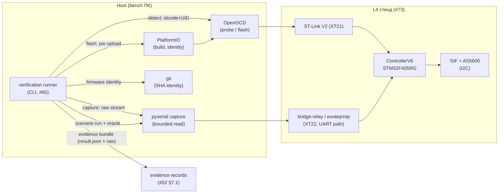
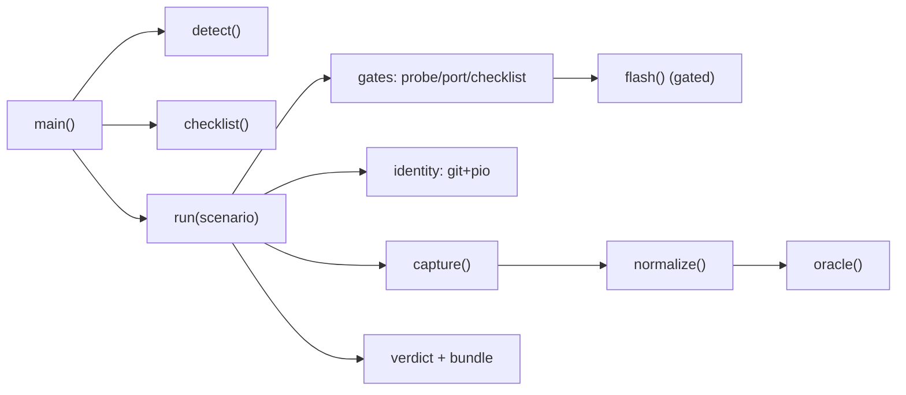
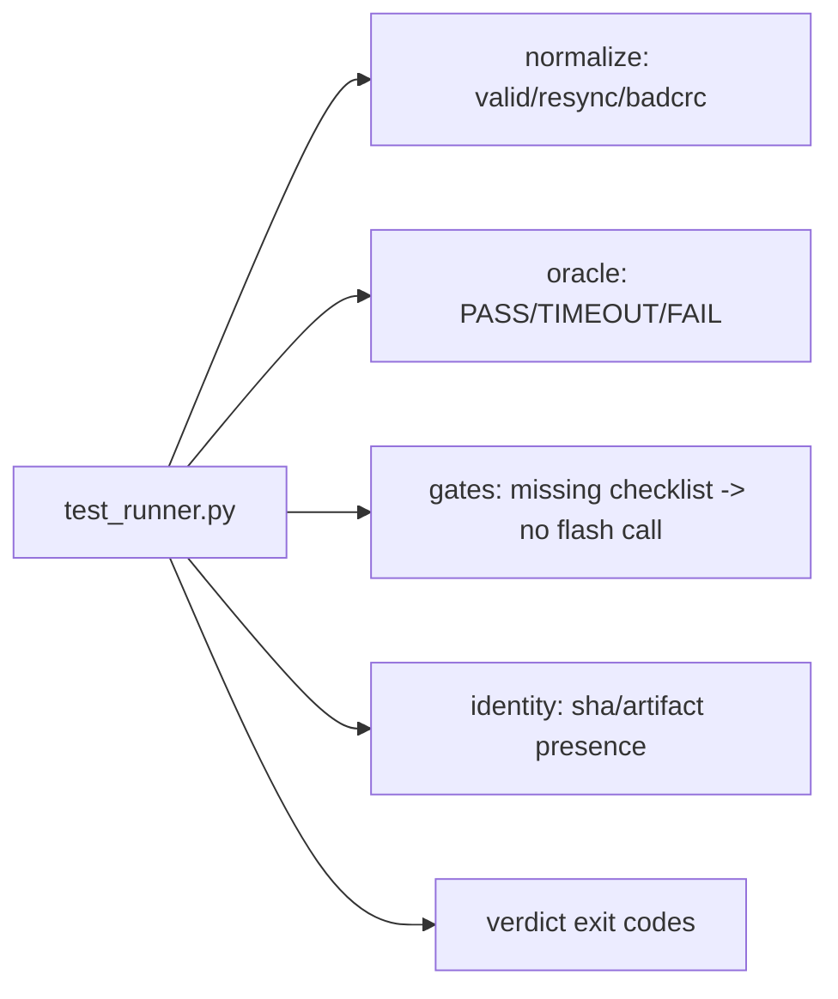

# Дизайн воспроизводимого L4 operator loop (production verification runner)

Статус: **design-артефакт для тикета [«Спроектировать воспроизводимый L4 operator loop»](https://github.com/Driadix/ShuttleControllerV3/issues/60)**. Вход в реализацию тикета [«Реализовать production verification runner»](https://github.com/Driadix/ShuttleControllerV3/issues/65) (вертикальный PR) и в L4-evidence gate 1→2 (тикет #68, T16 из #70). Прототип-ассет: `bench/operator-loop-proto/` (throwaway CLI + scenario/result форматы, проверены на офф-бенче и refusal-путях).

Этот документ задаёт контракт production runner'а **без реализации product behavior**: runner исполняет operator loop (обнаружение платы/порта → flash → сценарий → raw output → нормализация → evidence), а не бизнес-логику прошивки. Форматы scenario/result, evidence-контракт и split владелец/агент наследуют проверенный прототип и фиксируют production-форму для #65.

Дизайн наследует утверждённые решения и **не пересматривает** их: #52 (verification pyramid, §6.3 L4-сценарии, §7.1 evidence records), #73/`docs/l4-sensor-bench-v3.md` (стенд: ControllerV6, ST-Link V2, COM9 relay-дисплей / COM29 Prolific, frozen toolchain), #51 (engineering baseline: структура репо, dependency rules, evidence/provenance), #43/#48 (measurement obligations, бюджеты), #70 (host-часть merged; T16 L4 smoke ждёт runner). Термины — канонические из `CONTEXT.md`.

## 0. Решения владельца (приняты 2026-08-13, HITL-брифинг тикета #60)

1. **Модель вердикта — единая**: `PASS / TIMEOUT / FAIL / INCOMPLETE`; полнота evidence и oracle в одном результате; `INCOMPLETE` — hard stop до физических операций (exit 3). Двухосевая альтернатива отклонена (избыточна для потребителей).
2. **Board identity — idcode + part + 96-bit UID**: DBGMCU_IDCODE (0xE0042000) + UID (0x1FFF7A10) через OpenOCD; проверено на стенде (`0x100f6413` → STM32F405RG, UID `002900363033470336363131`).
3. **Safety-checklist — внутри runner'а**: подпись владельца per-run (интерактивно или пред-подписанный файл; авто-аттестация `--yes` — прототипный хук, в production НЕ входит), запись в evidence, жёсткий gate перед любым физическим взаимодействием (probe включительно, §3.1); без подписи — отказ без side effects (инвариант, найден в прототипе).
4. **Наблюдаемость T16 — после observability/UART-слайса (#72/#75)**: Phase-1 kernel не эмитит событий на UART (KernelEvents stub no-op); L4 smoke доказывает живость kernel'а heartbeat'ом в production-потоке, а не временным диагностическим кодом. Gate 1→2 (#68) и закрытие #70 (T16) сдвигаются за #72/#75.
5. **Живой representative flow — выполнен** (attestation физических проверок владельца, 2026-08-13): flash (идемпотентен, тот же kernel #70) + capture; результат — `bench/operator-loop-proto/evidence/`.

---

## 1. Место в архитектуре

Runner — **host-инструмент стенда** (bench tooling), не firmware-модуль: исполняет operator loop вокруг физического L4-стенда и производит evidence для verification pyramid (#52).



| Элемент | Роль | Владение | Примечание |
| --- | --- | --- | --- |
| Verification runner | host CLI: detect/checklist/flash/run/evidence | тикет #65 | единственный entry point operator loop'а |
| OpenOCD (ST-Link) | probe (idcode/UID), flash | пакет PIO (frozen, #51 §3) | `tool-openocd@3.1200.0` |
| pyserial | bounded UART capture | dev-зависимость host | COM9 (relay) / COM29 (конвертер) |
| PlatformIO | build + upload, toolchain identity | frozen (6.1.19, #51 §3) | upload_protocol=stlink |
| Scenario/result schemas | контракт данных между runner и evidence | этот документ, §2 | schemaVersion 1 |

**Граница модуля (#65)**: runner + схематизация scenario/result + evidence bundle. НЕ входят: product behavior прошивки, CAN/timing measurement (тикет #62, L5-расширение), embedded FW_GIT_SHA read-back (firmware-изменение, отдельный слайс, #51 §10 — release-артефакты), observability firmware (#72/#75).

**ISR/железная граница**: runner не имеет доступа в ISR и не трогает аппаратные регистры напрямую — только через OpenOCD-команды (probe/flash) и UART-порт. Физические операции (flash) — строго после checklist-подписи владельца (жёсткий gate, §3).

## 2. Модели данных

Все форматы — JSON (stdlib, schema-валидируемые), fixed-width/типизированные поля, без динамических структур вне контроля runner'а. Версионирование: `schemaVersion` целое; аддитивные изменения — обратно совместимы; ломающие — новый major версии, классифицируются как Semantic (issue 8 §9).

### 2.1 Scenario (вход)

```json
{
  "schemaVersion": 1,
  "id": "flash-boot-smoke",
  "title": "Flash verify: ST-Link flash + probe alive",
  "type": "flash-verify",
  "phase": "L4",
  "flash": { "required": true, "env": "firmware" },
  "capture": {
    "port": "auto",
    "baud": 230400,
    "parity": "E",
    "durationS": 15,
    "maxBytes": 2000000
  },
  "oracle": {
    "minFrames": 0,
    "maxCrcBadRatio": 1.0,
    "requirePatterns": [],
    "forbidPatterns": []
  }
}
```

| Поле | Семантика | Обязательность |
| --- | --- | --- |
| `id` | уникальный slug сценария; имя файла-артефактов | да |
| `type` | `behavior` (PASS утверждает поведение: oracle обязан быть невакуумным) / `flash-verify` (PASS утверждает только flash + probe-alive + полноту evidence, НЕ поведение) | да |
| `phase` | L4 / L5 (будущее) | да |
| `flash.required` | false → шаг flash пропускается (например, uart-probe) | да |
| `flash.env` | PlatformIO env для build+upload (`firmware`) | при required |
| `capture.port` | `auto` → порт из конфигурации стенда (COM9); явный — приоритет | да |
| `capture.baud/parity` | 230400 8E1 (network_bridge display profile, bench-контракт) | да |
| `capture.durationS` | bounded окно захвата; по истечении — raw сохраняется, oracle оценивается | да |
| `oracle.minFrames` | минимум принятых кадров (валидных + битых, суммарный счётчик); недостигнут → TIMEOUT (ничего не пришло); смесь битых кадров при достигнутом минимуме → FAIL по `maxCrcBadRatio` | да |
| `oracle.maxCrcBadRatio` | доля битых кадров; превышение → FAIL | да |
| `oracle.requirePatterns` | regex на декодированные MSG_LOG строки; все обязаны встретиться, иначе TIMEOUT | нет |
| `oracle.forbidPatterns` | regex; любое совпадение → FAIL | нет |

**Правило невакуумности**: `behavior`-сценарий обязан иметь наблюдаемый
позитив — `minFrames >= 1` или непустой `requirePatterns`; вакуумный oracle
(`minFrames == 0` + пустые patterns) для `behavior` отклоняется
schema-валидацией (runner не имеет веток, превращающих молчание в pass —
scope #65). `flash-verify` допускает `minFrames: 0`: его PASS утверждает
только «flash выполнен + плата жива по probe + evidence полон» и явно НЕ
утверждает поведение прошивки (Phase-1 kernel молчит на UART — §10).

Расширение (L5/CAN, #62): секция `measurement` (источники измерений, бюджеты, workload metadata) добавляется аддитивно, schemaVersion 2; обязательные acceptance #52 §6.3 (C1/T_fs/lease/watchdog/power-cut/CAN flood) выражаются как L5-сценарии с measurement-секцией, а не как UART-только.

### 2.2 Result (выход)

```json
{
  "schemaVersion": 1,
  "runner": "verification-runner",
  "scenario": { "id": "flash-boot-smoke", "schemaVersion": 1 },
  "startedAt": "2026-08-13T10:15:42+00:00",
  "finishedAt": "2026-08-13T10:16:01+00:00",
  "board": { "probe": "PASS", "part": "STM32F405RG",
             "idcode": "0x100f6413", "uid": "002900363033470336363131" },
  "uart": { "port": "COM9", "open": true, "bytes": 0 },
  "firmware": { "gitSha": "080c114...", "gitDescribe": "080c114",
                "artifact": "firmware.bin", "artifactSha256": "959e234e..." },
  "toolchain": { "platformio": "6.1.19", "platform": "ststm32@17.4.0",
                 "core": "framework-arduinoststm32@4.20701.0" },
  "checklist": { "signed": true, "owner": "Driadix", "at": "...",
                 "items": [{ "text": "...", "confirmed": true }] },
  "flash": { "ok": true, "env": "firmware", "durationS": 4.2 },
  "capture": { "rawPath": ".../raw-flash-boot-smoke.bin", "rawBytes": 0,
               "durationS": 15 },
  "normalized": { "bytes": 0, "framesValid": 0, "framesBad": 0,
                  "msgCounts": {}, "logLines": [] },
  "verdict": "PASS",
  "reasons": [],
  "evidence": { "complete": true, "missing": [], "resultPath": "..." }
}
```

Примечание: `flash-boot-smoke` — `type: flash-verify` (`minFrames: 0`): вердикт PASS на молчащем UART утверждает только «flash + probe-alive + evidence полон», НЕ поведение прошивки. Phase-1 kernel не эмитит событий на UART (§10); поведенческая проверка живости kernel'а — после observability/UART-слайса (#72/#75), сценарий `type: behavior` и heartbeat-паттерном.

**Вердикты** (контракт с #52 §7.1: automated checks = evidence, не approval):

| Вердикт | Условие | Exit |
| --- | --- | --- |
| `PASS` | evidence complete + oracle удовлетворён | 0 |
| `TIMEOUT` | evidence complete, oracle не удовлетворён за окно (raw сохранён) | 2 |
| `FAIL` | evidence complete, oracle нарушен (bad CRC ratio, forbidden pattern) | 1 |
| `INCOMPLETE` | evidence не может быть полным — **отказ** | 3 |

`INCOMPLETE` — hard stop ДО физических операций (§3): отсутствие board identity, uart port, checklist-подписи, git SHA, artifact sha256, flash fail. Найденная в прототипе ошибка (отказ записывался, но flash исполнялся) зафиксирована как инвариант контракта: **отказ блокирует side effects**.

### 2.3 Identity records

- **Board identity**: `{part, idcode, uid}` из DBGMCU_IDCODE (0xE0042000) + UID (0x1FFF7A10, 96-bit) через OpenOCD `mdw`. idcode `0x100f6413` → DEV_ID 0x413 → STM32F405RG (проверено на стенде, 2026-08-13). UID уникален per-device.
- **Firmware identity**: `{gitSha, gitDescribe, artifact, artifactSha256}` — git SHA рабочего дерева на момент build + sha256 артефакта `.pio/build/firmware/firmware.bin`. Release-путь (#51 §10): embedded `FW_GIT_SHA`/`FW_VERSION_STR` через build flags — read-back из прошивки добавляется, когда firmware предоставит механизм (не в scope #65).
- **Toolchain identity**: `{platformio, platform, core}` из `pio --version` + `pio pkg list` сверка с пинами #51 §3 (скрипт `tools/check_toolchain.py` — отдельный CI-контракт, runner лишь фиксирует фактические версии).

### 2.4 Evidence bundle (артефакты прогона)

```
out/<scenario>-<timestamp>/
  raw-<scenario>.bin       # сырой UART-захват (первичный артефакт)
  result-<scenario>.json   # нормализованный результат + identity + verdict
  checklist.json           # подпись владельца (если flash)
```

Полнота = `missing == []`. `evidence.resultPath` вычисляется детерминированно из out-dir ДО записи файла (самоописывающий путь bundle). Потребители: evidence records (#52 §7.1: CI-artifact / measurement report), gate-тикеты (#68), nightly L4.

## 3. Трансформации

### 3.1 Операторный цикл (жёсткие gate'ы)

```
run <scenario>:
  # 0. Checklist владельца — ПЕРВЫЙ gate (если scenario.flash.required):
  #    никакое физическое взаимодействие (probe включительно) не исполняется
  #    до прохождения gate'ов (инвариант §4.2.2; найдено в прототипе:
  #    отказ обязан блокировать физические операции, а не только вердикт)
  if flash.required:
    cl = load(checklist.json)          # подпись владельца per-run
    if not cl or not cl.signed: missing += checklist
  # 1. Board identity — gated: probe только при пустом missing
  if missing: board = SKIPPED; missing += boardIdentity
  else: board = probe()                # OpenOCD: DBGMCU_IDCODE + UID
        if probe FAIL: missing += boardIdentity
  # 2. UART port (пассивная host-проверка; обязательное evidence)
  uart = port_check()                  # open/close, baud 230400 8E1
  if port closed: missing += uartPort
  # 3. FLASH — строго после gate: missing пуст (hard stop, инвариант)
  if flash.required and not missing:
    flash()                            # pio run -e firmware -t upload (ST-Link)
  elif flash.required:
    record flash: {ok: false, skipped: true, reason: missing}  # отказ без side effects
  # 4. Identity firmware + toolchain (обязательное evidence)
  firmware = git identity + artifact sha256
  toolchain = pio versions
  if no gitSha: missing += gitSha
  if no artifactSha256: missing += artifactSha256
  # 5. Capture (bounded) + normalize — только при пустом missing
  #    (refusal-путь захват не выполняет: вердикт уже INCOMPLETE)
  if not missing:
    raw = capture(port, durationS)     # bounded read, maxBytes guard
    save raw-<scenario>.bin
    normalized = decode_frames(raw)    # CRC16-CCITT, resync, MSG_LOG text
  # 6. Полнота + вердикт
  if missing: verdict = INCOMPLETE (exit 3)     # отказ
  else: verdict = oracle(normalized)            # PASS/TIMEOUT/FAIL
  write result-<scenario>.json
```

Invariant (найден в прототипе #60): **никакое физическое взаимодействие с
стендом (probe включительно) не исполняется, пока evidence-gate'ы не
пройдены** — отказ предшествует side effect'у, а не сопровождает его.
Standalone `detect` (без сценария) — read-only диагностика (транзиентный
halt, без мутаций), вне прогонов gate'ом не обязывается.

### 3.2 Normalize (декодирование кадров)

Формат кадра стенда: `0xBB 0xCC | msgID | targetID | seq | length | payload | CRC16-CCITT (init 0xFFFF, poly 0x1021, LSB-first)`; max frame 128 B (bench-контракт #73, mirror `bench/bridge-relay/tools/capture.py`). Ленивый парсер с resync на мусоре; длина кадра bounded (length > 120 → resync); CRC-невалидный кадр считается в `framesBad`, валидный — в `framesValid` + разбор MSG_LOG (0x10) в строки для regex-oracle.

### 3.3 Oracle

```
frames = framesValid + framesBad
if frames < minFrames:                        -> TIMEOUT
if framesBad/frames > maxCrcBadRatio:         -> FAIL
if any(forbidPatterns in logLines):           -> FAIL
if not all(requirePatterns in logLines):      -> TIMEOUT
-> PASS
```

Правило невакуумности (schema-валидация, §2.1): `behavior`-сценарий с
`minFrames == 0` и пустыми `requirePatterns` — ошибка схемы, прогон не
начинается. `flash-verify` — исключение, PASS без утверждения поведения.

## 4. Зависимости и контракты

### 4.1 Dependency matrix

| Компонент | Зависит от | НЕ зависит от |
| --- | --- | --- |
| runner CLI | pyserial, PlatformIO (frozen), git, OpenOCD (frozen) | firmware domain, Arduino Core, RTOS |
| сценарии/схемы | JSON (stdlib) | — |
| evidence bundle | файловая система out-dir | CI-инфраструктура |

Enforcement: runner — bench tooling в `bench/`, не входит в domain include-lint (#51 §5.2); версии pyserial фиксируются в requirements (политика пинов #51 §3); PlatformIO/OpenOCD — frozen пакеты (#51 §3).

### 4.2 Evidence-контракт (инварианты)

1. **Полнота**: `missing == []` — board identity, uart port, firmware SHA, artifact sha256, checklist (при flash), raw-артефакт записан.
2. **Отказ при неполном наборе**: `INCOMPLETE`, exit 3; на refusal-пути не исполняются операции с side effects — probe и flash (жёсткие gate'ы §3.1), а также пассивный UART-захват (вердикт уже INCOMPLETE, захват не нужен).
3. **Идентичность**: каждый прогон связывает board (idcode+UID), firmware (gitSha+sha256), toolchain (версии) с raw-артефактом и нормализованным результатом.
4. **Никаких путей фейка**: simulation-хуки прототипа (`--fixture`, `--simulate-board`) и авто-аттестация (`--yes`) в production контракт НЕ входят; evidence только с живых probe/capture; подпись checklist — интерактивно или пред-подписанным файлом владельца. Сценарий не может превратить failed product behavior в pass (scope #65).
5. **Правило невакуумности**: `behavior`-сценарий обязан иметь наблюдаемый позитив (§2.1, §3.3); молчание не является PASS'ом поведения.

### 4.3 Split владелец/агент

| Шаг | Исполнитель | Автоматизируемо | Примечание |
| --- | --- | --- | --- |
| Физическое подключение (ST-Link XT21, UART XT22, датчики) | владелец | нет | процедура #73, «Процедура подключения» |
| Energizing + gate (напряжения 3.3V/5V, нагрев, запах) | владелец | нет | gate #73; аварийная остановка — правило стенда |
| Checklist-подпись per-run | владелец | нет | runner записывает sign-off в evidence; без подписи — отказ |
| Detection (idcode/UID/порт) | агент (runner) | да | в прогоне — после checklist-gate (§3.1); standalone `detect` — read-only диагностика (транзиентный halt, без мутаций) |
| Flash (ST-Link) | агент | да | строго после подписи checklist |
| Capture/normalize/verdict/evidence | агент | да | bounded, детерминированно |

### 4.4 Границы с тикетами

- **#52**: runner — механизм исполнения L4/L5-сценариев и источник evidence records (§7.1); вердикт runner'а = CI-artifact (automated checks), не approval.
- **#68 (gate 1→2)**: L4-evidence gate (C1/T_fs, freshness sub-budgets, combined load, watchdog, bounded steps на production baseline и L4 — критерии `docs/implementation-plan-v3.md` §5) исполняется через runner.
- **#70 (T16)**: host-часть закрыта (PR #88); T16 L4 smoke — первый сценарий runner'а после approval контракта.
- **#65**: реализует этот контракт одним вертикальным PR; сценарии/схемы/тесты — в его scope.
- **#62 (CAN/timing)**: расширение сценариев секцией `measurement` (L5-фаза); не блокирует v1 формата.

## 5. Shape of code (production, #65)

Программа в `bench/verification-runner/` (bench tooling; рядом с `bench/bridge-relay/` — конвенция карты):

```
bench/verification-runner/
  runner.py            # CLI: detect / checklist / flash / run / normalize / evidence
  scenarios/           # versioned scenario JSON (v1: uart-probe, flash-boot-smoke, ...)
  schemas/             # scenario-v1.json, result-v1.json (JSON Schema, валидация)
  tools/               # probe.py (OpenOCD), capture.py (pyserial), identity.py
  tests/               # host-тесты normalize/oracle/gates/identity (unittest)
  requirements.txt     # pyserial==<pin>  (политика пинов #51 §3)
  README.md            # одна документированная команда на сценарий
```

Public API (CLI):

```
verification-runner detect [--port COM9]             # board + uart identity
verification-runner checklist --owner NAME [--out FILE]   # sign-off (HITL)
verification-runner run <scenario.json> [--port P] [--checklist F] [--out-dir D]
verification-runner normalize <raw.bin>              # raw -> machine-readable
verification-runner evidence <result.json>           # проверка полноты bundle
```

Изменения против прототипа: убраны simulation-хуки; добавлены JSON Schema-валидация, versioned схемы, `evidence` subcommand (повторная проверка полноты), requirements-pin, тесты. Прототип остаётся ассетом тикета (throwaway branch/файлы), не переиспользуется как код.

## 6. Light-визуализации

```
run(scenario):
    gates = [(checklist if flash), probe_board, check_port]   # порядок §3.1:
                                                              # checklist ПЕРВЫМ
    missing = [g for g in gates if not g.pass]
    if scenario.flash and not missing: flash()          # hard gate
    elif scenario.flash: record_skip(missing)           # INCOMPLETE path
    bind_identity(firmware, toolchain)                  # sha + artifact
    raw = capture(scenario.capture)                     # bounded window
    norm = normalize(raw)
    verdict = INCOMPLETE if missing else oracle(norm)
    write_bundle(scenario, raw, norm, verdict)
```

## 7. Тесты с call graph

### 7.1 Production call graph



### 7.2 Test call graph



### 7.3 Кейсы T1..TN (host, CI job; no project-wide suite)

| Кейс | Контракт | Ожидание |
| --- | --- | --- |
| T1 normalize valid | 22 валидных кадра (fixture) | framesValid=22, framesBad=0, logLines разобраны |
| T2 normalize resync | мусор между кадрами | resync, валидные посчитаны |
| T3 normalize badcrc | повреждённые кадры | framesBad учтены, ratio точен |
| T4 oracle PASS | behavior: minFrames достигнут, ratio в норме | PASS |
| T5 oracle TIMEOUT | behavior: minFrames не достигнут за окно | TIMEOUT, raw сохранён |
| T6 oracle FAIL | ratio > maxCrcBadRatio / forbidPattern | FAIL |
| T7 gate checklist | flash.required без подписи | INCOMPLETE, probe/flash НЕ вызваны (mock) |
| T8 identity | gitSha/artifactSha256 отсутствуют | missing += gitSha/artifactSha256 |
| T9 verdict exit | PASS/FAIL/TIMEOUT/INCOMPLETE | 0/1/2/3 |
| T10 bundle | result содержит rawPath, normalized, verdict | evidence.complete=true |
| T11 vacuous oracle | behavior: minFrames=0 + пустые patterns | schema error (exit 4), прогон не начинается |
| T12 flash-verify | minFrames=0 + flash ok + probe alive | PASS без утверждения поведения |

Property-описание: (i) oracle-решения монотонны по `frames` для pattern-free oracles (без `forbidPatterns`/`requirePatterns`): больше принятых кадров при том же `maxCrcBadRatio` не ухудшает вердикт; с паттернами монотонность не гарантируется (валидный кадр с forbidden-строкой ухудшает). (ii) полнота детерминирована при фиксированном порядке gate'ов §3.1: для одного и того же прогона missing-множество воспроизводимо; порядок gate'ов (checklist → probe → port) фиксирован и не переупорядочивается.

## 8. Vertical slice граница (#65)

**Наблюдаемый контракт**: representative сценарий на начальном сенсорном стенде запускается одной документированной командой и создаёт проверяемый, повторяемый evidence bundle; ошибки подключения, flash, timeout, malformed output и identity mismatch дают явный non-pass (scope #65, Acceptance).

**Входит в PR #65**: CLI, versioned scenario schema v1, board/port discovery, ST-Link flash (gated), bounded capture, raw-артефакты, normalized result, identity binding, refusal paths, host-тесты T1-T12, README (одна команда).

**Gate**: T16 L4 smoke исполняем через runner; сам T16 — после observability/UART-слайса (#72/#75, решение §0.4); результат runner'а — вход gate 1→2 (#68).

**НЕ входит**: product behavior, CAN/timing measurement (L5/#62), embedded FW_GIT_SHA read-back, observability firmware.

## 9. Трассировка obligations

| Obligation/требование | Закрытие через runner |
| --- | --- |
| #52 §6.3 обязательные L5 acceptance (release gate: C1, T_fs, lease, watchdog, power-cut, CAN flood) | L5-сценарии runner'а (measurement-секция, #62) |
| #52 §7.1 evidence records | runner-результат = CI-artifact/measurement report источник |
| #52 §2 L4 nightly (bounded steps, high-water, журналы, verified-boot smoke) | nightly-сценарии runner'а (после L5-расширения measurement, #62; v1 — UART-capture-only) |
| #70 T16 L4 smoke + observed maxima | первый L4-сценарий после approval |
| #68 gate 1→2 | L4-evidence через runner |
| #43/#48 measurement obligations (bench-класс) | measurement-секция сценариев (после #62, schemaVersion 2) |
| #73 bench-контракт (порты, baud, кадры, gate) | фиксируется в scenario/oracle defaults |
| #49 observability evidence (сырые логи как трассы) | raw-артефакт bundle (первичный источник) |
| #51 §10 FW_GIT_SHA embedding | release-путь, read-back — отдельный слайс |

## 10. Assumptions / Unknowns / Confidence

- **Fact**: прототип проверен на офф-бенче (PASS/TIMEOUT/FAIL/INCOMPLETE с корректными exit-кодами); живой probe даёт idcode `0x100f6413` + UID (2026-08-13); отказ-gate (flash skipped при неполном evidence) исправлен и перепроверен.
- **Fact**: плата стенда в текущем состоянии исполняет production kernel #70 (pc `0x0800296e` — замер живого probe OpenOCD halt, session тикета #60, 2026-08-13; образ 0x356C = 13676 B — вывод `pio run -e firmware`, сверяемо `firmware.map`; UART молчит — Ф1 no-op события, evidence `bench/operator-loop-proto/evidence/run-uart-probe`). Восстановление bring-up прошивки — решение владельца (исходник в V1-репо).
- **Assumption**: стенд остаётся как в #73 (COM9 relay-дисплей; COM29 Prolific — альтернатива, не проверена).
- **Assumption**: 230400 8E1 — единственный UART-контракт network_bridge на этом стенде.
- **Decision**: наблюдаемость T16 — после observability/UART-слайса (#72/#75), heartbeat в production-потоке (§0.4); gate 1→2 сдвигается.
- **Unknown**: поведение UID-read на других экземплярах платы (валидировано на одном).
- **Confidence**: высокая для flow-механики и форматов (проверено прототипом); средняя для production-hardening (JSON Schema, тесты, pins) — закрывается ревью #65.

## 11. Условия пересмотра

- Переход к L5/HIL: measurement-секция, CAN/timing-источники (#62) — schemaVersion 2.
- Изменение bench-топологии (порты, бод, кадровый формат) — rebaseline bench-контракта (#73).
- Embedded FW_GIT_SHA read-back (release-артефакты, #51 §10) — расширение identity-контракта.
- Обновление pyserial/OpenOCD/PlatformIO — политика пинов #51 §3 (Semantic-класс).
- Появление второго экземпляра платы с расходящимся UID/идентичностью — калибровка identity-контракта.

## 12. Ссылки

- Тикет #60 (этот), #65 (реализация runner'а), #68 (gate 1→2), #70 (T16 L4 smoke), #73 (начальный L4 стенд, bench record), #62 (CAN/timing оснастка), #52 (verification pyramid, §6.3/§7.1), #51 (engineering baseline, §3 pins, §5 структура, §10 версионирование), #43/#48 (границы, measurement obligations).
- `docs/l4-sensor-bench-v3.md` (стенд, gate, процедура, эталонные команды), `docs/verification-strategy-v3.md` (§6.3, §7.1), `docs/engineering-and-release-baseline-v3.md` (§3-5), `docs/implementation-plan-v3.md` (§5 rollout criteria).
- Прототип-ассет: `bench/operator-loop-proto/` (README, proto_runner.py, scenarios/, gen_fixture.py, fixtures/).
- Референс декодирования кадров: `bench/bridge-relay/tools/capture.py`.
