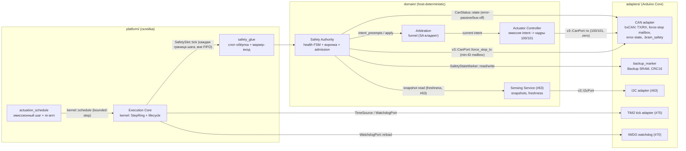
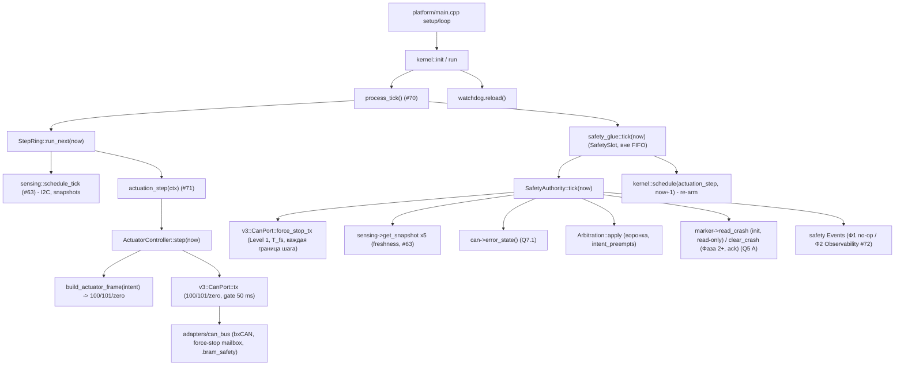
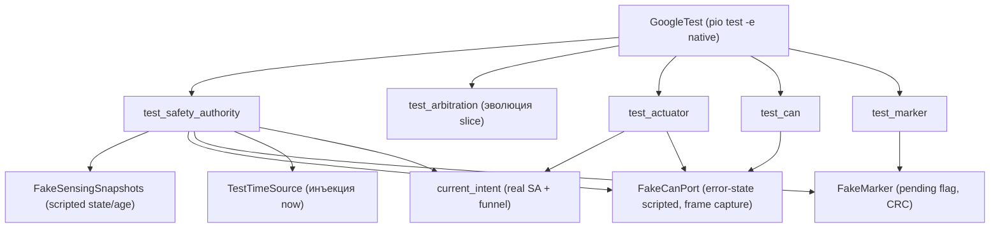

# Дизайн Safety Authority и C1 actuation path V3

Статус: **design-артефакт для тикета [«Реализовать Safety Authority и C1 actuation path»](https://github.com/Driadix/ShuttleControllerV3/issues/71)** (Фаза 1, один vertical PR). Вход в реализацию - модуль Safety Authority (#43 §2), реализация обязательной safety-границы SafetySlot (#70 §2.5).

Документ наследует утверждённые решения и **не пересматривает** их: #10 (cooperative scheduler с bounded steps), #43 (границы, single-writer, единственная arbitration-воронка, force-stop канал, watchdog-формула), #45 (safety-модель: health-ось, инварианты, precedence, stop-профили, Q5 A маркер), #48 (бюджеты C1-C6: T_step, T_eso, T_deg, T_fresh, каденции, CAN бюджеты), #51 (coding profile R1-R8, структура domain/adapters/platform), #63 (sensing-слайс: snapshots, freshness-классификация, типизированные fault), #70 (kernel: bounded steps, SafetySlot-механизм, dispatch contract). Численные бюджеты - из `docs/quality-attributes-and-budgets-v3.md`; термины - канонические из `CONTEXT.md`; wire-реестр fault/warning-кодов - собственность #47 (здесь - только доменные условия детекции).

**Ключевое архитектурное правило (наследует #70):** вся safety-политика исполняется строго в foreground внутри `SafetySlot::tick` - на каждой границе bounded шага, ВНЕ FIFO-очереди (T_check_jitter/T_arb <= 1 шаг при любом бэклоге, INV-SENSING-FRESH). Из ISR не вызывается ничего (R2, #43 §3.2). Safety Authority - единственная arbitration-воронка: все actuator intents (activity/safety) проходят через неё, наружу выходит единственный текущий intent (#43 §3.1).

## 0. Решения владельца (HITL-брифинг тикета #71)

> Решения приняты владельцем 2026-08-14 (брифинг: комментарий тикета #71). Дизайн зафиксирован на вариантах A по всем шести решениям.
>
> 1. **D1 (объём CAN-эмиссии)** - в слайс входит Actuator-эмиссионный каркас (доменный `ActuatorController`: потребляет `funnel.current()`, эмитит кадры 100/101/zero по gate 50 ms; без ramp/lifter-политики - drive algorithms остаются capability-слайсам). **Принято.**
> 2. **D2 (L4-наблюдаемость)** - `.bram_safety` RAM read-back (паттерн #63, schema v2) + две леги: `safety-acquire-loopback` (frame-level верификация) и `safety-acquire-bus` (normal mode без пира: TX без ACK -> ErrorPassive -> stop + fault). Внешний analyzer - #62 (Фаза 2). **Принято.**
> 3. **D3 (crash-маркер)** - маленький `backup_marker` адаптер в слайсе (порт `SafetyStateMarker`, Backup SRAM RTC BKP, CRC16) + L4-лега `safety-acquire-marker` (runner пишет маркер до boot -> SA стартует в Fault). Отклонение владения #43 (Backup-SRAM - Persistence adapter) - только для crash-маркера; journal/persistence остаются за #76; интерфейс - порт, #76 наследует/перехватывает без смены контракта. **Принято.**
> 4. **D4 (admission-дефолт)** - V1-derived строгий дефолт: любой directional ToF Faulted -> SA Degraded (Sensing-класс, motion-класс blocked) -> T_deg 60 s -> FAULT_DEGRADED_TIMEOUT -> Fault. На стенде (#73: CH_F NACK навсегда) - штатная траектория Degraded ~1 s -> Fault ~60 s. Конкретные capability-ограничения - item 4 (вне слайса), механизм не меняется. **Принято.**
> 5. **D5 (CAN error-state)** - ErrorPassive -> stop-intent FORCE-STOP + fault CanFailsafe (строгий Q4-маппинг); BusOff -> bounded re-integration (128 x 11 recessive-бит, RM0090 §32.7) + fault, pending force-stop re-translation после восстановления. **Принято.**
> 6. **D6 (непрерывность stop-эмиссии, amended)** - пока stop/force-stop intent текущий - трансляция непрерывна («всегда транслируем», #43 §4 INV-FORCE-STOP-CHANNEL), тишина - только при отсутствии intent. **Разделение путей (фикс review, T_fs)**: force-stop кадр эмитится Safety Authority прямо внутри `SafetySlot::tick` на КАЖДОЙ границе шага (Level 1, вне воронки и вне FIFO-очередей, #45 §4) - mailbox-операция в том же слоте, T_fs = T_isr + T_step + T_mailbox <= 10 ms (#48 C4); companion-нулевой кадр и нормальные кадры 100/101 эмитит `actuation_step` по gate 50 ms. В `actuation_step` force-stop НЕ эмитится (FIFO-задержка планирования до бэклога очереди ломала бы T_fs). **Принято.**


## 1. Место в архитектуре



| Элемент | Компонент (#43 §2) | Владение | Примечание |
| --- | --- | --- | --- |
| Safety Authority | domain | health FSM (Initializing -> Ready <-> Degraded -> Fault), safety precedence, freshness admission (INV-SENSING-FRESH), единственная arbitration-воронка, генерация safety-intents (stop/force-stop), реакция на CAN error-state (INV-CAN-FAILSAFE), авторизация safety-операций (эвакуация/low-battery - интерфейс, потребители - Фаза 3), мониторинг manual lease (потребитель expiry; производитель - #77), reconciliation reset-cause + crash-маркер (INV-STARTUP-GATE, Q5 A) | единственная политика безопасности; механизм вызова - SafetySlot (#70) |
| Arbitration (funnel) | domain | тотальный порядок SAFETY_STOP > SAFETY_MOTION > ACTIVITY_INTENT; stop-intents никогда не отклоняются; замена intent - только на границе bounded шага (#45 §4) | эволюция `slice::Arbitration` (#54); владелец экземпляра - Safety Authority |
| Actuator Controller (эмиссионный каркас) | domain | потребляет `funnel.current()` (read-only), производит кадры 100/101 и нулевой кадр по stop-профилям (gate 50 ms, #48 §5); без ramp/lifter-политики (drive algorithms - вне слайса) | единственный производитель 100/101 (#43 §4); политика - в воронке, не здесь |
| CAN adapter | adapters (HAL) | bxCAN 500 kbit/s extended (PB8/PB9, #73), bounded TX (<= 16 кадров/тик, #48 §7), bounded RX drain (<= 64/тик), force-stop на выделенном mailbox с минимальным extended ID (INV-FORCE-STOP-CHANNEL), классификация error-state (active/error-passive/bus-off, Q7.1), loopback-режим (L4-лега), запись кадров в `.bram_safety` | реализует v3::CanPort; без policy |
| backup_marker | adapters (HAL) | Backup SRAM-маркер crash-класса (CRC16, Q5 A): запись при latch, чтение на стартапе | владелец механики - Persistence adapter (#43 §4); реализация в слайсе - решение владельца D3 (§0) |
| safety_glue / actuation_schedule | platform | слот-обёртка (SA + re-arm эмиссии), эмиссионный bounded шаг (gate-проверка внутри, deadline в окне [now, now+T_step]) | домен framework-free; планирование - обязанность composition root (#63 §3.1 паттерн) |

**Граница модуля (#71)**: Safety Authority + воронка (Arbitration/Intent production-форма) + Actuator-эмиссионный каркас + CAN adapter (включая force-stop mailbox и error-state) + backup-маркер + `.bram_safety` наблюдаемость + L4-сценарии. **НЕ входят**: Operation Runtime / Manual Session (производители activity intents и lease - #74/#77), ramp/lifter-алгоритмы привода (capability-слайсы), bumper-адаптер (HZ-02: свой слайс, интерфейс резервируется), Observability Producer (#72), stall-детекция по позиции (Q7.3: требует commanded motion + одометрию - с capability-слайсами), obstacle-классификация против метаданных точек останова (Q7.4: требует операции, item 4), CAN peer/analyzer (#62, физически отсутствует), persistence journal (#76).

**ISR-граница (инвариант дизайна)**: в scope #71 новых ISR нет. Единственный ISR платформы - TIM2 clock (#70). Bumper-события (HZ-02) в Фазе 1 не подключены: порт `BumperEvents` (bounded ring, #43 §3.2 «ISR пишет только в свой ring») резервируется в контракте, производитель - будущий GPIO-адаптер; в этом слайсе производитель отсутствует, поэтому force-stop путь исполняется только по внутренним триггерам (CAN error-state) - механизм идентичен (Level 1, вне воронки).

## 2. Модели данных

Все типы - fixed-width (`stdint`, R3), без динамической аллокации (R1), bounded (R4). Один поток исполнения - locks не нужны (#43 §4).

### 2.1 Intent и stop-профили (production-форма, эволюция `slice::Intent`)

```cpp
// domain/safety_intent.h (production v3::safety; эволюция slice::intent.h #54)
namespace v3::safety {

enum class IntentSource : std::uint8_t {
    Activity = 0, // Operation Runtime / Manual Session (auto + manual - один класс, #45 §4)
    Safety = 1,   // Safety Authority
};

enum class IntentKind : std::uint8_t {
    VelocitySetpoint = 0, // commanded speed (нормальная работа)
    Stop = 1,             // stop с профилем (CONTROLLED / IMMEDIATE)
    ForceStop = 2,        // force-stop: min extended ID кадр, вне очередей (#43 §4)
    Lift = 3,             // лифтер вверх/вниз (зарезервирован; лифтер-контракты - #47/Фаза 3)
};

enum class StopProfile : std::uint8_t {
    Controlled = 0, // ramp, bounded rate (ramp-алгоритм - вне слайса; Фаза 1: нулевой кадр)
    Immediate = 1,  // нулевой кадр в следующую эмиссию
    ForceStop = 2,  // extended min-ID кадр + нулевой кадр (#45 §4)
};

// Единственный текущий intent из воронки; Actuator Controller исполняет только его
// и не имеет собственной policy (#43 §3.1). fixed-width, без аллокаций.
struct Intent {
    IntentKind kind = IntentKind::VelocitySetpoint;
    IntentSource source = IntentSource::Activity;
    StopProfile stop_profile = StopProfile::Controlled;
    std::int16_t velocity = 0;   // масштабированный setpoint (доменные единицы; контракт кадра - §4.3)
    std::uint32_t seq = 0;       // монотонный номер intent (trace IDs, .bram_safety)
};

// Тотальный порядок воронки (SAFETY_STOP > SAFETY_MOTION > ACTIVITY_INTENT, #45 §4).
// Stop-intents никогда не отклоняются: любой stop/force-stop заменяет текущий intent.
bool intent_preempts(const Intent& candidate, const Intent& current);

}
```

Семантика замены: замена активного intent - только на границе bounded шага (#45 §4) - воронка мутирует только внутри `SafetySlot::tick` (single-writer, foreground). Повторный `arbitrate` одного производителя в одном тике - без эффекта (идемпотентность в пределах шага не требуется: производителей activity в Фазе 1 нет).

### 2.2 Health-ось Safety Authority (Q2, #45 §2)

```cpp
// domain/safety_authority.h
namespace v3::safety {

enum class SafetyHealth : std::uint8_t {
    Initializing = 0, // стартап, движение запрещено (INV-STARTUP-GATE); grace-окно 1 s (#48 §9)
    Ready = 1,        // движение разрешено; health-gates пройдены
    Degraded = 2,     // движение ограничено по capability-классам (item 4; Фаза 1: motion-класс
                      //   заблокирован); потолок <= 1.0 м/с (F5, #45); T_deg = 60 s (#48 Q2)
    Fault = 3,        // latched fault; движение запрещено для operation/manual intents; воронка
                      //   допускает только авторизованные safety/stop/recovery-пути (INV-FAULT-ADMISSION)
};

// Degraded-классы (Q2 carve-outs, #48 §2.2): T_deg отсчитывается ТОЛЬКО для motion-capable
// классов - перечень #48: HZ-05/06/16 (Sensing/Overtemp). Информационный Degraded
// (HZ-17 BmsStale) и транзиентный CanBus-класс (HZ-03) в отсчёт НЕ входят.
enum class DegradedClass : std::uint8_t {
    None = 0,
    Sensing = 1,      // HZ-05/06: деградация сенсорики / I2C-шины (motion-capable, T_deg идёт)
    CanBus = 2,       // HZ-03: CAN error-state (Q7.1 mitigation); транзиентен - error-passive
                      //   латчит CanFailsafe в том же тике; НЕ в перечне #48 §2.2, T_deg не идёт
    Overtemp = 3,     // HZ-16: ATEMP (Фаза 2+, интерфейс резервируется; motion-capable, T_deg идёт)
    BmsStale = 4,     // HZ-17: информационный, T_deg НЕ идёт (F9, #48 §2.2 carve-out)
};

// Только motion-capable классы отсчитывают T_deg (#48 §2.2: HZ-05/06/16). Чистая функция,
// host-тестируема (T4) без инъекции наблюдений.
inline bool is_motion_capable(DegradedClass cls)
{
    return cls == DegradedClass::Sensing || cls == DegradedClass::Overtemp;
}

// Latched fault классы (доменные; wire-маппинг - реестр #47, аддитивно).
enum class SafetyFault : std::uint8_t {
    None = 0,
    DegradedTimeout = 1,   // FAULT_DEGRADED_TIMEOUT (#48 Q2, #47)
    DirectionalToF = 2,    // directional ToF fault (HZ-01; V1 FAULT_TOF_* class);
                           // резерв, Фаза 2+: latch при directional-fault ВО ВРЕМЯ движения;
                           // в Фазе 1 motion отсутствует - направленный fault даёт
                           // Degraded -> DegradedTimeout (D4), этот код не латчится
    CanFailsafe = 3,       // INV-CAN-FAILSAFE: CAN error-state (Q7.1 mitigation)
    CrashMarker = 4,       // pending explicit-reset маркер на стартапе (Q5 A)
};

}
```

**Переходы (Q5 A, #45 §2)**: `Ready/Degraded -> Fault` - любой latched fault; `Fault -> Degraded/Ready` - только после qualified stationary recovery (снятие условия + streak для auto-clear класса; явный acknowledgment + реквалификация для crash-класса); power-cycle не считается acknowledgment (стартап с маркером -> Fault); auto-clear eligible: sensing/bus fault (HZ-01/05/06) - квалификация = stationary + отсутствие motion intent + streak (механика - Sensing, решение - Safety). Анти-осцилляция: latched Fault никогда не рестартует сам. **Реализация перехода - §3.2 (Fault-ветка)**: auto-clear ТОЛЬКО для DegradedTimeout (HZ-01/05/06) - снятие условия + stationary -> Degraded (ре-квалификация, T_deg-таймер рестартует), далее Degraded -> Ready по норме (T27); CrashMarker (Q5 A) и CanFailsafe (HZ-03: «явный reset после проверки шины», #45) НЕ auto-clear - только явный reset-error acknowledgment (Service, Фаза 2+), снятие условия и power-cycle НЕ снимают (T28/T31). В Фазе 1 триггеров crash-класса нет (bumper/stall - будущие слайсы), поэтому write_crash не вызывается (T9).

### 2.3 Crash-маркер (Q5 A; решение владельца D3)

```cpp
// domain/ports.h - порт persisted-маркера (Backup SRAM, CRC16, Q5 A)
struct SafetyStateMarker {
    struct State {
        bool crash_pending = false;   // true = pending explicit-reset маркер
        std::uint32_t crash_count = 0; // crash-счётчик (delta-сверка на стартапе, #45 §5)
    };
    virtual void write_crash(std::uint32_t crash_count) = 0; // при latch crash-класса (Фаза 2+:
                                                             // bumper/stall; в Фазе 1 не вызывается)
    virtual State read_crash() = 0;    // стартап: read-only; маркер НЕ снимается чтением
                                       // (Q5 A: power-cycle != acknowledgment)
    virtual void clear_crash() = 0;    // ТОЛЬКО явный reset-error acknowledgment после
                                       // реквалификации (Service-класс, Фаза 2+); в Фазе 1
                                       // не вызывается ничем
};
```

Контракт маркера (Q5 A): маркер - ОДНО 32-bit слово Backup SRAM: биты [15:0] = payload (bit 15 = crash_pending, биты [14:0] = crash_count), биты [31:16] = CRC16(payload). Запись при latch - один выровненный 32-bit store (атомарен на Cortex-M4): payload+CRC не могут быть записаны «наполовину», CRC-fail после init-штампа недостижим в нормальной работе. `power-cycle != acknowledgment` - стартап с валидным маркером переводит SA в `Fault` (CrashMarker) с motion inhibited, и маркер остаётся (read-only на стартапе): повторный reset с маркером снова даёт Fault (анти-осцилляция, L3: два boot подряд -> оба Fault). **CRC-fail трактуется как «краха не было» (permissive, решение владельца)**: первый boot BKP-домен содержит мусор - fail-safe-трактовка (CRC-fail = pending) блокировала бы устройство в Fault до Service; на init регион немедленно штампуется валидным пустым маркером (crash_pending=false), мусор не читается повторно; детекцию краха дополняют reset-cause reconciliation и breadcrumbs (#45 §5). Снимается маркер только явным reset-error (Service-класс, будущий) после реквалификации. В Фазе 1 latch crash-класса невозможен (bumper/stall не подключены) - маркер-путь проверяется на host (порт-контракт, T8/T24/T25/T28) и L4-легой `safety-acquire-marker` (runner пишет маркер через OpenOCD до boot; снятие для возврата стенда - внешней записью runner'а, не firmware).

### 2.4 CanPort (production-форма, эволюция `slice::CanPort`)

```cpp
// domain/ports.h - CAN adapter (bounded TX/RX, force-stop mailbox, error-state)
namespace v3 {

enum class CanErrorState : std::uint8_t {
    Active = 0,      // нормальная работа (error counters < 128)
    ErrorPassive = 1,// >= 128 ошибок: шина де-факто недоступна для команд (Q7.1 mitigation)
    BusOff = 2,      // >= 256 ошибок: контроллер отсоединён от шины (RM0090 §32)
};

struct CanFrame {
    std::uint32_t id = 0;      // extended ID
    std::uint8_t data[8] = {};
    std::uint8_t len = 0;
};

struct CanPort {
    // Bounded TX: <= 16 кадров/тик (#48 §7); false при исчерпании бюджета тика.
    // Никогда не блокирует дольше bounded-интервала (ABRQ abort pending TX, RM0090 §32.7).
    virtual bool tx(const CanFrame& frame) = 0;
    // Bounded RX drain: до `budget` кадров; возвращает число. RX-переполнение - drop + событие
    // (#43 §4: политика RX-переполнения - drop + событие, счётчики у Observability #72).
    virtual std::uint32_t rx_drain(CanFrame* out, std::uint32_t budget) = 0;
    // Force-stop: выделенный TX mailbox, минимальный extended ID на шине (INV-FORCE-STOP-CHANNEL,
    // #43 §4); вне очередей control-класса. Повторяемая трансляция - обязанность вызывающего
    // (SA на каждой safety-границе, пока force-stop текущий - «всегда транслируем», #43 §4).
    virtual void force_stop_tx() = 0;
    // Текущий error-state (Q7.1 mitigation: error counters, bus-off recovery).
    virtual CanErrorState error_state() const = 0;
};

}
```

Отличия от `slice::CanPort`: убран `inject_rx` из интерфейса (test-хук - не production API, решение #85; host-fakes инъецируют напрямую, target RX-инъекция не нужна в Фазе 1); добавлен `error_state()` (Q7.1). Контракт force-stop кадра - §4.3.

### 2.5 Safety-диагностика (`.bram_safety`, L4-наблюдаемость, паттерн #63 §5.1)

Pinned-секция `.bram_safety` (0x20012000, stripped из flash, заполняется адаптерами и доменом; механизм - как `.bram_sensing`, #63). **Структура и write-функции - доменные** (`domain/diag_safety.h`, framework-free, только доменные типы: SafetyHealth, Intent, CanErrorState, SafetyDiag::FrameRecord - include-lint чист, §4.1); pinned-инстанс объявляется в platform (linker-секция `.bram_safety`), домен получает указатель `SafetyDiag*` в `init` (§5.2) и пишет в структуру напрямую (foreground). **Single-writer по полям**: SA владеет health/воронкой/safety-счётчиками (stops_issued, force_stops_issued, activity_intents_rejected) и frame-записями force-stop; ActuatorController - frame-записями 100/101/zero и can_tx_dropped; CAN-адаптер - can_state/can_tx_count/can_rx_dropped/can_bus_off_recoveries. Runner читает секцию на readback-шаге (schema v2). Состав:

```cpp
// domain/diag_safety.h - диагностическое зеркало (L4 evidence, schema v2); framework-free,
// только доменные типы; pinned-инстанс объявляется в platform (linker-секция .bram_safety)
struct SafetyDiag {
    std::uint32_t magic;             // 'SAF1'
    std::uint32_t version;           // структуры
    std::uint64_t uptime_ms;         // monotonic
    // Health
    SafetyHealth health;             // текущее состояние SA
    DegradedClass degraded_class;    // активный Degraded-класс (None вне Degraded)
    SafetyFault fault;               // latched fault (None вне Fault)
    std::uint64_t state_entry_ms;    // monotonic момент входа в текущее состояние
    std::uint64_t degraded_motion_ms; // накопленное время в motion-capable Degraded
                                      //   (T_deg-отсчёт, #48 §2.2; пауза на информационных
                                      //   классах BmsStale/CanBus-транзиент)
    // Воронка
    Intent current_intent;           // текущий intent из воронки (seq, kind, source, profile)
    std::uint32_t activity_intents_rejected; // admission-отказы activity intents (INV-FAULT-ADMISSION)
    std::uint32_t stops_issued;      // сгенерированные safety stop-intents
    std::uint32_t force_stops_issued;// force-stop эмиссии
    // CAN (workload metadata)
    std::uint32_t can_tx_count;      // кадров TX всего
    std::uint32_t can_tx_dropped;    // бюджет-отказы TX (per-tick)
    std::uint32_t can_rx_dropped;    // RX-переполнения
    CanErrorState can_state;         // error-state на последней границе
    std::uint32_t can_bus_off_recoveries; // успешные re-integration (bus-off recovery)
    // Ring последних кадров (raw timestamps, bounded)
    struct FrameRecord {
        std::uint64_t tx_ms;         // monotonic момент TX
        std::uint32_t id;
        std::uint8_t  data[8];
        std::uint8_t  len;
        std::uint8_t  kind;          // 0=100/101, 1=zero, 2=force-stop
    } frames[16];
    std::uint32_t frame_head;        // кольцо, head = последний
};
```

Raw timestamps + workload metadata - требование acceptance тикета («измерения содержат raw timestamps и workload metadata»). Overrun-события ядра (длительность safety-слота) уже наблюдаемы через `KernelEvents` (#70) и записываются runner-сценарием из ядерной диагностики.

## 3. Трансформации

### 3.1 Safety-граница (SafetySlot::tick, foreground, вне FIFO)

```text
safety_glue::tick(now)              # platform; вызывается kernel'ом на КАЖДОЙ границе шага
                                    # (механизм #70 §2.5; интервал между tick <= шаг + слот + тик)
  sa->tick(now)                     # Safety Authority: health + admission + arbitration + реакции,
                                    #   включая force-stop эмиссию (Level 1, T_fs, §3.5)
  # re-arm эмиссионного шага при активном intent (§3.4):
  if sa->intent_active() and not actuation_armed:
      kernel::schedule(actuation_step, ctx, now + 1)   # вооружение; deadline в окне [now, now+10]
# Замер длительности слота НЕ дублируется: kernel process_tick (#70 §2.5) уже измеряет
# safety->tick (t0 = ticks_us() ... dt > T_step -> step_overrun + watchdog.report_overrun).
```

Слот bounded: чтение 5 снапшотов Sensing (memcpy ~ 5 x 40 B), FSM-переходы, сравнение age, классификация CAN state, при force-stop-условии - одна mailbox-операция `force_stop_tx()` - O(1), микросекунды. Бюджет слота <= T_step проверяется замером kernel'а (#70, T-slot T10) и L4 (длительности слотов в workload metadata). Force-stop НЕ ждёт `actuation_step` (FIFO-шаг с задержкой планирования): эмиссия внутри слота держит T_fs <= 10 ms (C4, #48 §2; численное измерение - proving #3/#13).

### 3.2 Health FSM (SA, Q2/Q5 A, #45 §2)

```text
SafetyAuthority::tick(now):
  # 1. Прочитать наблюдения (snapshots Sensing + CAN state; маркер прочитан на init - read-only)
  directional_fresh = for id in {TofChannelReverse, TofChannelForward}:
      snap = sensing->get_snapshot(id)
      snap.has_sample && snap.age_ms < T_fresh       # admission считает возраст + наличие образца,
                                                     # НЕ состояние сенсора (M4); Faulted-состояние
                                                     # отдельно даёт degraded-класс (D4)
  any_sensor_faulted = for id in {4 ToF, As5600}: snap.state == Faulted (NoAck/Stale/BusStuck)
  can_state = can->error_state()

  # 2. Degraded-класс (#48 §2.2: T_deg отсчитывают только motion-capable, is_motion_capable())
  if any_sensor_faulted or not directional_fresh:
      degraded_class = Sensing          # HZ-05/06 (motion-capable)
  elif can_state != Active:
      degraded_class = CanBus           # HZ-03: транзиентен - шаг 4 латчит CanFailsafe в том же
                                        #   тике; T_deg НЕ отсчитывается (не в перечне #48 §2.2)
  else:
      degraded_class = None

  # 3. FSM-переходы
  switch health:
    Initializing:
      if marker.crash_pending: health = Fault; fault = CrashMarker; emit событие
      elif degraded_class != None: enter Degraded (m_degraded_motion_ms = 0); emit Degraded-событие
      elif ready_conditions(now):   # grace >= 1 s (#48 §9) + requalification (сенсоры здоровы
                                    #   по streak, Sensing-классификация) + reset-cause reconciled
        health = Ready; emit Ready-событие
    Ready:
      if degraded_class != None: enter Degraded (m_degraded_motion_ms = 0); emit Degraded-событие
    Degraded:
      if degraded_class == None:
          health = Ready; emit  # квалифицированное снятие условия (streak, stationary)
      else:
          if is_motion_capable(degraded_class):       # только HZ-05/06/16 (#48 §2.2, F1)
              m_degraded_motion_ms += now - m_last_tick_ms
              if m_degraded_motion_ms >= T_deg (60 s):
                  health = Fault; fault = DegradedTimeout; emit FAULT_DEGRADED_TIMEOUT
                  emit_stop(StopProfile::Controlled)   # Fault в покое -> CONTROLLED (#45 §4)
          # информационные классы (BmsStale, CanBus-транзиент): аккумулятор паузится
    Fault:
      if fault == SafetyFault::CrashMarker or fault == SafetyFault::CanFailsafe:
          pass                                      # CrashMarker (Q5 A) и CanFailsafe (HZ-03, #45:
                                                    #   «явный reset после проверки шины») - НЕ
                                                    #   auto-clear; только явный reset-error
                                                    #   acknowledgment (Service, Фаза 2+); снятие
                                                    #   условия и power-cycle НЕ снимают (T28/T31)
      elif degraded_class == None and not motion_active():
          health = Degraded                         # auto-clear класс ТОЛЬКО DegradedTimeout
                                                    #   (HZ-01/05/06, #45 §5): снятие условия +
                                                    #   stationary -> ре-квалификация; далее
                                                    #   Degraded -> Ready по норме (T27)
          m_degraded_motion_ms = 0                  # T_deg-таймер рестартует
          emit recovery-событие
      # анти-осцилляция: latched Fault никогда не рестартует сам; повторный reset
      # с маркером -> снова Fault (L3: два boot подряд -> оба Fault)
  m_last_tick_ms = now    # для motion-capable аккумулятора (T_deg, #48 §2.2)

  # 4. CAN error-state реакции (Q7.1 mitigation, INV-CAN-FAILSAFE; решение D5):
  if can_state == ErrorPassive:
      if health != Fault: latch_fault(CanFailsafe)  # guard: уже латченный CrashMarker не
                                                    #   затирается (Q5 A, §6 консистентен)
      emit_stop(StopProfile::ForceStop)             # строгий Q4-маппинг (D5); force-stop -
                                                    #   best-effort на дефектной шине; реальная
                                                    #   безопасность - per-device commissioning
                                                    #   fail-safe приводов (Q7.1 A)
  if can_state == BusOff:
      can->recover_bus_off()        # bounded re-integration (128 x 11 recessive-бит, RM0090 §32.7);
                                    # при успехе - повторная трансляция pending force-stop (§3.5)
      if health != Fault: latch_fault(CanFailsafe)  # fault остаётся до явного reset (HZ-03, #45)

  # 5. Level 1 force-stop эмиссия (T_fs, #45 §4, INV-FORCE-STOP-CHANNEL): пока текущий
  #    intent - ForceStop (или pending force-stop после re-integration), force-stop кадр
  #    эмитится НА КАЖДОЙ границе шага прямо из слота (вне FIFO-очередей, вне воронки):
  if current_intent.kind == IntentKind::ForceStop
     or current_intent.stop_profile == StopProfile::ForceStop:
      can->force_stop_tx()          # mailbox-операция в том же слоте; T_fs = T_isr + T_step
                                    #   + T_mailbox <= 10 ms (C4, #48 §2; измерение - proving #3/#13)
      diag.force_stops_issued++; record_frame(force_stop, now)
```

Admission (INV-FAULT-ADMISSION, INV-SENSING-FRESH): на каждой границе шага воронка отклоняет activity intents, если `health != Ready` (motion запрещён) или направленная сенсорика не свежа. В Фазе 1 производителей activity intents нет - admission-путь проверяется host-тестами (инъекция через воронку) и счётчиком `activity_intents_rejected` в `.bram_safety`.

`ready_conditions`: grace >= 1 s + направленная сенсорика свежа/здорова + reset-cause reconciled (маркер отсутствует; watchdog/HardFault-restart -> requalification, #45 §5) + `Ready <= 5 s` (#48 Q7).

### 3.3 Воронка (arbitration, #43 §3.1, #45 §4)

```text
SafetyAuthority::arbitrate(candidate: Intent) -> const Intent&:   # единственная граница
  if health == Fault and candidate.source == Activity:
      diag.activity_intents_rejected++; return current   # INV-FAULT-ADMISSION: только
                                                         # safety/stop/recovery
  if candidate.source == Activity and health != Ready:
      diag.activity_intents_rejected++; return current   # INV-SENSING-FRESH / Degraded-ограничение
  return funnel.apply(candidate)        # intent_preempts: SAFETY_STOP > SAFETY_MOTION > ACTIVITY_INTENT;
                                        # stop никогда не отклоняется (#45 §4)
```

Производители (будущие): Operation Runtime (#74) и Manual Session (#77) вызывают `arbitrate` на границе своего bounded шага; SA вызывает `arbitrate` со своими safety-intents внутри `tick` (stop на fault, force-stop на error-passive). Порядок замены: только внутри tick (single-writer на границе шага).

### 3.4 Эмиссионный шаг (Actuator Controller, bounded, foreground)

```text
actuation_step(ctx):               # platform/actuation_schedule.cpp; armed только при активном intent
  now = monotonic::now_ms()
  intent = sa->current_intent()    # read-only из воронки; Actuator не имеет policy (#43 §3.1)
  # Force-stop кадр здесь НЕ эмитится: это Level 1 путь SA -> mailbox прямо из SafetySlot::tick
  # (каждая граница шага, T_fs, §3.2/§3.5) - FIFO-задержка этого шага ломала бы T_fs (C4).
  # Здесь - только companion-нулевой кадр и нормальные кадры по gate:
  if now >= next_tx_gate_ms:       # gate 50 ms (#48 §5 control TX); период отслеживается внутри
      next_tx_gate_ms = now + ControlTxGateMs
      if intent.kind == VelocitySetpoint or intent.kind == Lift:
          frame = build_actuator_frame(intent)      # 100/101 (контракт §4.3)
          if not can->tx(frame): diag.can_tx_dropped++
          record_frame(frame, kind=0)
      else:  # Stop / ForceStop intent: нулевой кадр (#45 §4 «нулевой кадр в следующую эмиссию»)
          zero = zero_frame(); can->tx(zero); record_frame(zero, kind=1)
  # перевооружение от СВЕЖЕГО now (паттерн #63 §6: длинный шаг не старит дедлайн):
  now2 = monotonic::now_ms()
  deadline = uint32(now2) + EmissionStepMs (10 ms)
  if sa->intent_active():
      if kernel::schedule(actuation_step, ctx, deadline) != Ok:
          kernel::schedule(actuation_step, ctx, uint32(now2) + 1)
  else:
      actuation_armed = false   # disarm: idle = тишина на шине (fail-safe приводов, Q7.1 A)
```

Семантика тишины: при отсутствии активного intent эмиссионный шаг не вооружён - на шине тишина (кроме непрерывного force-stop из safety-слота, если он активен). Stop-профили: IMMEDIATE и FORCE-STOP - нулевой кадр-компаньон каждый gate, пока intent текущий; CONTROLLED (ramp) - алгоритм привода, вне слайса: Фаза 1 эмитит нулевой кадр; ramp-последовательность - с capability-слайсами. Непрерывность («всегда транслируем»): force-stop - каждая граница шага из SA-слота (§3.2), нулевой кадр - каждый gate 50 ms.

### 3.5 Force-stop путь (Level 1, вне воронки, #45 §4)

```text
Триггеры (Фаза 1): CAN error-state (D5) -> SA -> can->force_stop_tx() на mailbox с минимальным
extended ID (INV-FORCE-STOP-CHANNEL). Bumper (HZ-02) и потеря шины с пиром - триггеры будущих
слайсов (порт BumperEvents, §4.2); путь один и тот же: событие -> следующая safety-граница
(<= T_step) -> SA -> force_stop_tx() В ТОМ ЖЕ слоте (Level 1, вне воронки и вне FIFO-очередей).
Force-stop не стоит в очереди control-класса: выделенный mailbox, аппаратный арбитраж
lowest-ID-wins (RM0090 §32.7 подтверждает #43); эмиссия повторяется на каждой границе шага,
пока force-stop intent текущий («всегда транслируем»). T_fs = T_isr + T_step + T_mailbox
(бюджет <= 10 ms, #48 §2: T_isr - вход события, T_step - до следующей границы, T_mailbox -
mailbox-операция в слоте; численное измерение - proving #3/#13, не этот слайс).
```

## 4. Зависимости и контракты

### 4.1 Dependency-матрица (внутрь, #43/#51)

| Модуль | Зависит от | НЕ зависит от |
| --- | --- | --- |
| `domain/safety_authority.h/.cpp` | `domain/ports.h` (CanPort, SafetyStateMarker, BumperEvents-порт), `domain/sensing.h` (snapshots), `domain/safety_intent.h` (Intent, intent_preempts), `domain/diag_safety.h` (mirror) | Arduino Core, platform/ (kernel/monotonic - now передаёт glue), адаптеров, Observability (#72: события - типизированные, sink - будущий) |
| `domain/safety_intent.h`, `domain/arbitration.h` | ничего (чистые типы/алгоритм) | Arduino Core |
| `domain/actuator.h/.cpp` | `domain/safety_intent.h` (Intent), `domain/ports.h` (CanPort), `domain/diag_safety.h` (frame records) | Arduino Core, kernel |
| `adapters/can_bus.*` | Arduino Core / HAL (bxCAN), реализует v3::CanPort, пишет `.bram_safety` | domain (кроме порта) |
| `adapters/backup_marker.*` | HAL (RTC BKP), реализует v3::SafetyStateMarker | domain |
| `platform/safety_glue.cpp`, `platform/actuation_schedule.cpp` | kernel::schedule, monotonic, SA, CanPort | — |

Enforcement: include-lint (#51 §5.2) - никаких Arduino/RTOS-заголовков в `domain/`; native-сборка домена без framework (build_src_filter уже разделяет). «Отсутствие обхода arbitration» (acceptance): единственный путь кадров 100/101 на CAN - `domain/actuator.h` -> `v3::CanPort::tx`; include-lint + nm-проверка символов запрещают прямые вызовы `CanPort::tx/force_stop_tx` из других модулей (кроме actuator и SA/адаптера) - тест T-bypass (T13).

### 4.2 Порты (domain/ports.h, production-форма, добавления к #70/#63)

```cpp
// Новые порты в namespace v3 (домен framework-free, #43):
//  - CanPort (см. §2.4): tx / rx_drain / force_stop_tx / error_state
//  - CanErrorState (§2.4); CanFrame (§2.4)
//  - SafetyStateMarker (§2.3): write_crash / read_crash (read-only на стартапе) / clear_crash
//    (только явный reset-error ack, Фаза 2+)
//  - BumperEvents (резерв, Фаза 2+): bounded ring bumper-событий (#43 §3.2);
//    производитель - будущий GPIO-адаптер; потребитель - SA (latch + crash counter + force-stop,
//    HZ-02). В Фазе 1 производитель отсутствует - порт декларируется в контракте, без реализации.
//  - LeaseEvents (резерв, #77): expiry-событие manual lease (#43 §3.1); потребитель - SA
//    (INV-LEASE-STOP: expiry -> stop-intent CONTROLLED bounded). Производитель - Manual Session (#77).
```

### 4.3 Контракты кадров CAN (адаптерный контракт, #43 §4 «содержимое фиксируется в контракте адаптера»)

| Кадр | Extended ID | DLC | Данные (provisional, контракт адаптера) | Статус |
| --- | --- | --- | --- | --- |
| Traction velocity | 0x100 (100) | 8 | байт 0: знак/направление; байты 1-2: |velocity| в доменных единицах; остальное - резерв 0 | **provisional** - точный V1 wire-формат не зафиксирован (evidence index: «точный контракт IDs 100/101/2405 требует схемы/drive documentation»); rebaseline при появлении drive-доков |
| Lifter | 0x101 (101) | 8 | байт 0: up/down; байты 1-2: скорость | **provisional** - то же |
| Нулевой кадр (stop) | 0x100 | 8 | все нули (velocity 0) | производная от velocity-контракта |
| Force-stop | **0x00000001** (минимальный extended ID, ниже 100/101/2405 и статусных) | 8 | `0xFF x 8` (максимальный stop-индикатор) | контракт адаптера (новый, V1 не имел); поддержка приводом min-ID force-stop - открыта (F4, #45 §7.1(б)) - проверяется per-device commissioning (#50/#52); неподдержка -> rebaseline decision (acceptance #71), не фиктивный pass |

Frame-build (домен) отделён от raw TX (адаптер): `build_actuator_frame(Intent)` - чистая функция в `domain/actuator.h` (host-тестируема); адаптер делает только mailbox-операции. Force-stop кадр - собственность адаптера (мин-ID + payload), вызывается через `force_stop_tx()`.

### 4.4 Инварианты (наследуются, не пересматриваются)

| Инвариант | Источник | Проверка |
| --- | --- | --- |
| Safety-слот <= T_step (10 ms); overrun наблюдаем | #48 §4 | KernelEvents::step_overrun (#70) + замер слота (§3.1) + L4 |
| T_check_jitter/T_arb <= 1 шаг при любом бэклоге | #48 §4, #45 §6 | SafetySlot вне FIFO (механизм #70) + T17-стиль тест (#70) |
| Stop-intents никогда не отклоняются | #45 §4 | host-тест воронки |
| Замена intent только на границе bounded шага | #45 §4 | воронка мутирует только в tick; host-тест |
| INV-FAULT-ADMISSION: Fault => activity intents отклонены | #45 Q2 | host-тест admission + счётчик в `.bram_safety` |
| INV-SENSING-FRESH: motion требует свежую направленную сенсорику | #45 Q3 | host-тест admission по возрасту snapshot |
| T_deg = 60 s непрерывного motion-capable Degraded => Fault | #48 Q2 | host-тест FSM (таймер от monotonic, NTP-immune) |
| INV-CAN-FAILSAFE: CAN error-state => stop-intent + fault | #45 Q7.1 | host + L4-лега `safety-acquire-bus` |
| INV-FORCE-STOP-CHANNEL: force-stop вне очередей, всегда транслируем (min ID + выделенный mailbox) | #43 §4 | host (mailbox-вызовы) + L4-лега (frame records) |
| INV-STARTUP-GATE: Ready после grace + requalification + reset-cause reconciliation; Ready <= 5 s | #48 Q7, #45 Q5 A | host + L4 (timestamps state_entry) |
| Crash-маркер: power-cycle != acknowledgment; стартап с маркером -> Fault | #45 Q5 A | host (порт-контракт) + L4-лега `safety-acquire-marker` |
| CAN TX <= 16 кадров/тик, RX drain <= 64/тик | #48 §7 | host-тест бюджета + workload metadata |
| Никакой динамической аллокации | #51 R1 | include-lint, review |
| ISR не вызывает safety/CAN/policy | #43 §3.2, R2 | review-checklist + nm-проверка (в scope новых ISR нет) |
| Нарушение бюджета слота -> overrun, не молчание | #70 §2.5 | T-slot + KernelEvents |

## 5. Shape of code

### 5.1 Program layout

```text
domain/
  ports.h                  # + v3::CanPort, CanErrorState, CanFrame, SafetyStateMarker,
                           #   BumperEvents (резерв), LeaseEvents (резерв)
  diag_safety.h            # + SafetyDiag: `.bram_safety` структура + write-функции
                           #   (framework-free; pinned-инстанс - platform, linker-секция)
  safety_intent.h          # + v3::safety: IntentSource, IntentKind, StopProfile, Intent, intent_preempts
                           #   (production-форма slice::intent.h)
  arbitration.h            # + v3::safety::Arbitration (production-форма slice::Arbitration)
  safety_authority.h/.cpp  # + SafetyAuthority: health FSM, admission, воронка-владелец,
                           #   CAN-реакции, маркер-вход, типизированные события
  actuator.h/.cpp          # + ActuatorController (эмиссионный каркас): current intent ->
                           #   кадры 100/101/zero; build_actuator_frame (чистая функция)
adapters/
  can_bus.h/.cpp           # + v3::CanPort на bxCAN (500k extended PB8/PB9, #73): bounded TX/RX,
                           #   force-stop mailbox (ID 0x1), error-state, loopback-режим,
                           #   `.bram_safety` frame records
  backup_marker.h/.cpp     # + v3::SafetyStateMarker на Backup SRAM (RTC BKP, CRC16)
platform/
  main.cpp                 # + wiring: SA в SafetySlot, CAN adapter, backup_marker, re-arm логика
  safety_glue.h/.cpp       # + слот-обёртка: sa->tick + re-arm эмиссии (замер слота - kernel #70)
  actuation_schedule.h/.cpp# + эмиссионный bounded шаг (gate внутри, перевооружение от свежего now)
tests/
  test_safety_authority/   # + health FSM, T_deg, admission, маркер-вход, CAN-реакции
  test_arbitration/        # эволюция: production-форма, stop никогда не отклоняется, замена на границе
  test_actuator/           # + build_actuator_frame, gate 50 ms, zero-кадр по gate, disarm
  test_can/                # + бюджет TX (16/тик), force-stop mailbox, error-state переходы (fake)
  test_marker/             # + CRC16, write/read_clear, повреждённый маркер
  common/                  # + FakeCanPort, FakeSensingSnapshots, FakeMarker
bench/
  verification-runner/     # + сценарии safety-acquire-loopback / safety-acquire-bus /
                           #   safety-acquire-marker (schema v2, readback .bram_safety)
```

### 5.2 Public API (production-форма, без test-хуков)

```cpp
namespace v3::safety {

// Safety Authority: единая safety-политика (#43 §2). framework-free: now приходит из glue,
// наблюдения - через порты/интерфейсы. Владелец единственного экземпляра воронки.
class SafetyAuthority {
  public:
    struct Config {
        std::uint32_t grace_ms = 1000;         // startup grace (#48 §9)
        std::uint32_t t_deg_ms = 60'000;       // непрерывный motion-capable Degraded => Fault (#48 Q2)
        std::uint32_t t_fresh_directional_ms = 300; // T_fresh ToF (#45 O3, pre-allocated #43)
        bool reset_cause_reconciled = true;    // reconciliation на стартапе (glue передаёт)
    };

    // Стартап (foreground, после kernel::init): сброс FSM, чтение маркера (Q5 A, read-only),
    // установка портов. diag - указатель на pinned `.bram_safety` зеркало (§2.5),
    // домен пишет health/воронку/счётчики напрямую (single-writer, foreground).
    // Не вызывает Arduino.
    void init(const Config& cfg, const sensing::SensingService* sensing,
              v3::CanPort* can, v3::SafetyStateMarker* marker, SafetyDiag* diag);

    // Обязательная safety-граница: вызывается kernel'ом через SafetySlot::tick на КАЖДОЙ
    // границе шага, вне FIFO (механизм #70 §2.5). Bounded (<= T_step), foreground-only.
    void tick(std::uint64_t now);

    // Единственная arbitration-воронка (#43 §3.1). Вызывается производителями activity
    // intents (Operation Runtime #74, Manual Session #77) на границе их bounded шага и
    // Safety Authority со своими safety-intents. Stop-intents никогда не отклоняются (#45 §4).
    const Intent& arbitrate(const Intent& candidate);

    // Текущий intent из воронки (read-only для Actuator Controller).
    const Intent& current_intent() const;
    bool intent_active() const;                // есть активный (не-idle) intent -> вооружать эмиссию

    SafetyHealth health() const;
    SafetyFault fault() const;
    DegradedClass degraded_class() const;

    // Типизированные события (sink - KernelEvents-заглушка Ф1 / Observability #72 Ф2;
    // эмиссия у SA, счётчики у Producer - #43 §4). Аддитивный контракт к #70.
    struct Events {
        virtual void health_changed(SafetyHealth from, SafetyHealth to,
                                    DegradedClass cls, SafetyFault fault) = 0;
        virtual void stop_issued(StopProfile profile, std::uint32_t seq) = 0;
        virtual void can_failsafe(CanErrorState state) = 0;
        virtual void crash_marker_pending(std::uint32_t crash_count) = 0;
    };
    void set_events(Events* events);           // Ф1: no-op sink (как KernelEventsStub, main.cpp)
};

// Эмиссионный каркас Actuator Controller (#43 §4: единственный производитель 100/101).
// Без ramp/lifter-политики (drive algorithms - capability-слайсы). Bounded step.
class ActuatorController {
  public:
    struct Config { std::uint32_t tx_gate_ms = 50; };  // control TX каденция (#48 §5)

    void init(const Config& cfg, const SafetyAuthority& sa, v3::CanPort* can,
              SafetyDiag* diag);   // diag - `.bram_safety` зеркало (frame records, §2.5)
    // Bounded шаг (composition root): эмитит текущий intent из воронки по gate 50 ms;
    // stop-intents - нулевой кадр-компаньон каждый gate; force-stop НЕ здесь (Level 1,
    // SA-слот, §3.2/§3.5). Не блокирует дольше T_step.
    void step(std::uint64_t now);
    bool active() const;                       // intent активен (для re-arm логики glue)
};

// Чистая функция frame-build (host-тестируема): Intent -> кадр 100/101/zero (контракт §4.3).
CanFrame build_actuator_frame(const Intent& intent);

}
```

Изменения против slice: `namespace slice::Arbitration/Intent/SafetyHealth` -> `v3::safety` (production-форма, решение #85 гибрид: структуры эволюционируют, API пишется заново); `slice::SafetyHealth` (T_fresh/T_deg только, без воронки и admission) заменяется полным SafetyAuthority; `slice::CanPort::inject_rx` убран из production-интерфейса (test-хук - не API); `register_force_stop_handler` (slice kernel) уже удалён в #70 - канал force-stop через воронку/SA.

### 5.3 Типичный call stack (target, Serving)

```text
TIM2_IRQHandler (ISR)                        # adapters/tim2 (#70): ++64-bit tick, seqlock - и только это
loop() -> kernel::run()
  └─ process_tick()
     ├─ ring.run_next(now)                   # один bounded шаг за тик (dispatch contract #70 §2.1)
     │  └─ sensing::schedule_tick(ctx)       # (#63): I2C-чтения, snapshots, freshness
     │  └─ actuation_step(ctx)               # (#71): gate-проверка, эмиссия intent -> CAN (§3.4)
     ├─ (если overrun) events->step_overrun(dt_ms); watchdog.report_overrun(dt_ms)
     ├─ safety_glue::tick(now)               # SafetySlot, ВНЕ FIFO (#70 §2.5)
     │  └─ SafetyAuthority::tick(now)        # health FSM + admission + arbitration + CAN-реакции
     │     ├─ sensing->get_snapshot(id) x5   # freshness/health (read-only)
     │     ├─ can->error_state()             # Q7.1
     │     ├─ (stop) emit_stop -> arbitrate(Stop/ForceStop) -> funnel.apply
     │     ├─ (force-stop intent) can->force_stop_tx()   # Level 1, тот же слот (T_fs, §3.5)
     │     ├─ (init: read-only) marker->read_crash()     # Q5 A: маркер НЕ снимается чтением;
     │     │                                             #   clear_crash - только явный ack (Фаза 2+)
     │     └─ (Fault/Ready...) events->health_changed(...)
     ├─ (re-arm) kernel::schedule(actuation_step, now+1)   # при активном intent
     └─ watchdog.reload()                    # безусловно каждый тик (INV-WATCHDOG-ARMED)
```

## 6. Light-визуализации (псевдокод)

```cpp
// SafetyAuthority::tick - bounded safety-граница (вызывается на каждой границе шага)
void SafetyAuthority::tick(std::uint64_t now)
{
    // 1. Наблюдения (read-only, O(1))
    const bool any_sensor_faulted = any_faulted_sensor();        // 4 ToF + AS5600 (snapshots, #63)
    const bool directional_fresh = directional_sensing_fresh(now); // CH_R + CH_F age < T_fresh
    const CanErrorState can_state = m_can ? m_can->error_state() : CanErrorState::Active;

    // 2. Degraded-класс (motion-capable идёт в T_deg; #48 §2.2)
    DegradedClass cls = DegradedClass::None;
    if (any_sensor_faulted || !directional_fresh) { cls = DegradedClass::Sensing; }
    else if (can_state != CanErrorState::Active)   { cls = DegradedClass::CanBus; }

    // 3. FSM (Q2/Q5 A, #45 §2)
    switch (m_health)
    {
        case SafetyHealth::Initializing:
            if (m_marker_pending) { enter_fault(SafetyFault::CrashMarker); break; } // Q5 A
            if (cls != DegradedClass::None) { enter_degraded(cls); break; }          // F1: timer=0
            if (ready_conditions(now))      { enter_ready(); break; }
            break;
        case SafetyHealth::Ready:
            if (cls != DegradedClass::None) { enter_degraded(cls); }
            break;
        case SafetyHealth::Degraded:
            if (cls == DegradedClass::None) {
                m_health = SafetyHealth::Ready; changed();          // снятие условия (streak)
            }
            else if (is_motion_capable(cls)) {                     // F1: только HZ-05/06/16 (#48 §2.2)
                m_degraded_motion_ms += now - m_last_tick_ms;      // аккумулятор; информационные
                if (m_degraded_motion_ms >= m_cfg.t_deg_ms) {      //   классы - пауза
                    enter_fault(SafetyFault::DegradedTimeout);     // FAULT_DEGRADED_TIMEOUT
                    emit_stop(StopProfile::Controlled);            // Fault в покое -> CONTROLLED
                }
            }
            break;
        case SafetyHealth::Fault:
            // F2: recovery (Q5 A, #45 §2, §5)
            if (m_fault != SafetyFault::CrashMarker
                && m_fault != SafetyFault::CanFailsafe      // HZ-03: явный reset после проверки
                && cls == DegradedClass::None && !motion_active()) {   //   шины (#45), НЕ auto-clear
                m_health = SafetyHealth::Degraded;         // auto-clear: только DegradedTimeout
                m_degraded_motion_ms = 0;                  //   (HZ-01/05/06) - условие снято +
                changed();                                 //   stationary -> ре-квалификация
            }
            // CrashMarker/CanFailsafe: только явный reset-error ack (Service, Фаза 2+);
            // анти-осцилляция; повторный reset с маркером -> снова Fault
            break;
    }
    m_last_tick_ms = now;   // для motion-capable аккумулятора (T_deg, #48 §2.2)

    // 4. CAN fail-safe (Q7.1 mitigation; D5)
    if (can_state == CanErrorState::ErrorPassive) {
        if (m_health != SafetyHealth::Fault) { enter_fault(SafetyFault::CanFailsafe); }
        emit_stop(StopProfile::ForceStop);     // строгий Q4-маппинг: потеря шины -> FORCE-STOP
    }
    if (can_state == CanErrorState::BusOff) {
        m_can->recover_bus_off();              // bounded re-integration (RM0090); pending force-stop
        if (m_health != SafetyHealth::Fault) { enter_fault(SafetyFault::CanFailsafe); }
    }

    // 5. Level 1 force-stop эмиссия (T_fs, §3.5): пока force-stop intent текущий -
    //    каждая граница шага, прямо из слота, вне FIFO (INV-FORCE-STOP-CHANNEL)
    if (m_funnel.current().kind == IntentKind::ForceStop
        || m_funnel.current().stop_profile == StopProfile::ForceStop) {
        m_can->force_stop_tx();                // min-ID mailbox (0x1), выделенный, вне очередей
        record_frame(kForceStop, now);
    }
}

// Воронка (единственная граница intents; #43 §3.1, #45 §4)
const Intent& SafetyAuthority::arbitrate(const Intent& candidate)
{
    if (candidate.source == IntentSource::Activity) {
        // INV-FAULT-ADMISSION / INV-SENSING-FRESH / Degraded-ограничение (item 4, Фаза 1: block)
        if (m_health != SafetyHealth::Ready) { ++m_diag->activity_intents_rejected; return m_funnel.current(); }
    }
    m_funnel.apply(candidate);                 // SAFETY_STOP > SAFETY_MOTION > ACTIVITY_INTENT;
    return m_funnel.current();                 // stop никогда не отклоняется
}

// Эмиссионный шаг ActuatorController::step (bounded; gate 50 ms внутри, §3.4).
// Force-stop здесь НЕ эмитится (Level 1 путь SA -> mailbox из SafetySlot::tick, §3.2/§3.5).
void ActuatorController::step(std::uint64_t now)
{
    const Intent& it = m_sa.current_intent();  // read-only из воронки; policy - в SA
    const bool stopping = (it.kind == IntentKind::Stop || it.kind == IntentKind::ForceStop);
    if (now >= m_next_gate_ms) {
        m_next_gate_ms = now + m_cfg.tx_gate_ms;               // 50 ms (#48 §5)
        const CanFrame f = stopping ? zero_frame()
                          : build_actuator_frame(it);          // 100/101 или нулевой кадр-компаньон
        if (!m_can->tx(f)) { ++m_diag->can_tx_dropped; }       // bounded per-tick budget
        record_frame(f, stopping ? kZero : kActuator, now);
    }
}
```

## 7. Тесты с call graph

### 7.1 Production call graph



### 7.2 Test call graph (host, deterministic)



### 7.3 Тест-кейсы (host; L4 - target-леги #71 acceptance)

| # | Suite | Проверяемый контракт | Метод/oracle | Среда |
| --- | --- | --- | --- | --- |
| T1 | test_safety_authority | Стартап: Initializing -> Ready после grace (1 s) при здоровых сенсорах; Ready <= 5 s; движение до Ready запрещено (admission) | FakeSensingSnapshots healthy, advance time, assert переход + admission-отказ | host |
| T2 | test_safety_authority | Degraded-вход: directional ToF Faulted (NACK x3, #63 классификация) -> Degraded (Sensing-класс) + событие health_changed | scripted Faulted CH_F, assert состояние/класс/событие | host |
| T3 | test_safety_authority | T_deg: непрерывный Degraded (Sensing) 60 s -> Fault + FAULT_DEGRADED_TIMEOUT + stop-intent CONTROLLED (Fault в покое, #45 §4) | time advance до 59 999/60 000, assert | host |
| T4 | test_safety_authority | Carve-out #48 §2.2: is_motion_capable - Sensing/Overtemp (HZ-05/06/16) -> true; CanBus (HZ-03)/BmsStale (HZ-17) -> false (не идут в отсчёт T_deg) | property-тест is_motion_capable по всем классам; FSM-level пауза на информационном классе - Фаза 2 (нет BMS-порта в Фазе 1, seam не нужен - gate на чистой функции) | host |
| T5 | test_safety_authority | Qualified recovery: Degraded-условие снято (snapshots Healthy + streak) -> Ready; счётчик T_deg сброшен | scripted recovery, assert переход | host |
| T6 | test_safety_authority | INV-SENSING-FRESH: motion admission требует возраст directional snapshot < T_fresh (300 ms); stale -> отказ activity intent | scripted age, arbitrate(activity), assert отказ + счётчик | host |
| T7 | test_safety_authority | INV-FAULT-ADMISSION: в Fault activity intents отклоняются; safety stop/force-stop проходят; recovery-пути допускаются | arbitrate в Fault, assert | host |
| T8 | test_safety_authority | Маркер-вход (Q5 A): pending crash-маркер на init -> Fault (CrashMarker) + motion inhibited; power-cycle не считается acknowledgment | FakeMarker pending, init, assert | host |
| T9 | test_safety_authority | Crash-маркер запись: в Фазе 1 crash-класс триггеров нет (bumper/stall - будущие слайсы) - SA не вызывает write_crash; контракт записи тестируется в test_marker (T25) и L3 (внешняя запись через runner) | assert отсутствие вызова + test_marker | host |
| T10 | test_safety_authority | Слот bounded: полный tick (снапшоты + FSM + CAN) <= T_step; превышение -> step_overrun через kernel | замер через TestTimeSource.advance_us, kernel host | host |
| T11 | test_arbitration | Stop-intents никогда не отклоняются: Stop/ForceStop заменяют любой текущий intent (включая Safety->Activity) | последовательность arbitrate, assert current | host |
| T12 | test_arbitration | Тотальный порядок: SAFETY_STOP > SAFETY_MOTION > ACTIVITY_INTENT; равный ранг не перебивает (кроме stop) | intent_preempts property-проверка по всем комбинациям | host |
| T13 | test_arbitration | Отсутствие обхода arbitration (acceptance): единственный путь кадров - actuator -> CanPort::tx; прямые вызовы tx/force_stop_tx вне actuator/SA/адаптера запрещены | include-lint + nm-проверка символов (как T15 #70) | host |
| T14 | test_arbitration | Замена intent только на границе шага: воронка не мутирует вне tick | arbitrate вне tick (изоляция), assert неизменность | host |
| T15 | test_actuator | Gate 50 ms: velocity-intent эмитится раз в 50 ms, не чаще (control TX каденция #48 §5) | FakeCanPort frame count vs time advance | host |
| T16 | test_actuator | Stop-эмиссия непрерывна (D6): stop-intent текущий -> нулевой кадр каждый gate; force-stop кадр НЕ эмитится из actuator (Level 1 путь - SA-слот) | scripted stop intent, assert frame sequence (zero per gate) | host |
| T17 | test_actuator | Disarm: intent неактивен -> шаг не вооружается (тишина на шине; fail-safe приводов, Q7.1 A) | re-arm логика glue, assert schedule-отсутствие | host |
| T18 | test_actuator | build_actuator_frame: Intent -> кадр 100/101/zero по контракту §4.3 (знак, |velocity|, резерв) | чистые assert по layout | host |
| T19 | test_can | Бюджет TX: > 16 кадров/тик -> tx=false + can_tx_dropped | FakeCanPort лимит, assert | host |
| T20 | test_safety_authority | Force-stop из слота (T_fs, C4): force-stop intent текущий -> force_stop_tx() вызван в КАЖДОМ tick на границе шага, ID 0x1, выделенный mailbox; НЕ через actuation_step/FIFO | FakeCanPort capture, assert вызовы на каждой границе + id/mailbox | host |
| T21 | test_can | Error-state переходы: Active -> ErrorPassive (>= 128) -> BusOff (>= 256); recover_bus_off -> bounded re-integration | scripted error counters, assert состояния + вызовы | host |
| T22 | test_safety_authority | INV-CAN-FAILSAFE: ErrorPassive -> stop-intent FORCE-STOP + fault CanFailsafe (D5) | FakeCanPort ErrorPassive, assert | host |
| T23 | test_safety_authority | BusOff -> recover_bus_off вызван + fault; повторная трансляция pending force-stop после re-integration | scripted BusOff, assert | host |
| T24 | test_marker | CRC16: повреждённый маркер (бит-флип) -> read_crash = {crash_pending: false} (permissive, решение владельца: первый boot BKP-мусор; однословный атомарный store делает CRC-fail после init-штампа недостижимым) + регион штампуется пустым на init | flip byte, assert permissive + stamp | host |
| T25 | test_marker | write/read round-trip БЕЗ снятия: повторный read_crash сохраняет маркер; clear_crash() (только ack-путь) снимает; повторный read после clear = чисто | assert persistence через read, затем clear, assert | host |
| T26 | test_safety_authority | NTP-скачок не ломает T_deg/grace (monotonic, #43): backward jump -> clamp, таймеры считают от monotonic | TestTimeSource backward, assert без ложного перехода | host |
| T27 | test_safety_authority | Auto-clear recovery (F2): Fault(DegradedTimeout, HZ-01/05/06) -> условие снято (snapshots Healthy + streak) + stationary -> Degraded (ре-квалификация, T_deg-таймер рестартует) -> Ready | scripted recovery, advance, assert переходы + сброс таймера | host |
| T28 | test_safety_authority | CrashMarker не снимается (Q5 A): ни снятием условия, ни повторным init (power-cycle); маркер остаётся, motion inhibited; clear_crash в Фазе 1 не вызывается | FakeMarker persistent, re-init, assert Fault | host |
| T29 | test_can | RX-drain бюджет и overflow (#13): > 64 кадров за тик -> rx_drain отдаёт <= budget, переполнение -> drop + событие/счётчик | FakeCanPort overflow, assert | host |
| T30 | test_actuator | T_eso stop-пути (N1, #48 §2): от trigger (safety-граница) до эмиссии нулевого кадра <= T_arb (10 ms) + T_emit (50 ms gate) = 60 ms <= 70 ms | kernel host + gate timing, assert | host |
| T31 | test_safety_authority | CanFailsafe НЕ auto-clear (HZ-03, #45): восстановление шины (error state -> Active) НЕ снимает fault; требуется явный reset-error (Фаза 2+); CrashMarker не затирается ErrorPassive (guard, Q5 A) | FakeCanPort Active после latch, assert Fault сохраняется; ErrorPassive в тике с CrashMarker, assert fault = CrashMarker | host |
| L1 | L4 | Лега `safety-acquire-bus` (normal mode, без пира): стартап -> Degraded (CH_F NACK, стенд #73) -> 60 s -> FAULT_DEGRADED_TIMEOUT -> stop-эмиссия -> TX без ACK -> ErrorPassive -> force-stop + fault; raw timestamps + workload metadata в `.bram_safety` | runner readback, schema v2 | L4 |
| L2 | L4 | Лега `safety-acquire-loopback` (bxCAN loopback): frame-level верификация кадров (100/101 content, нулевой кадр, force-stop ID 0x1) с raw timestamps | runner readback | L4 |
| L3 | L4 | Лега `safety-acquire-marker` (D3, F3): runner пишет маркер в Backup SRAM до boot; boot #1 -> Fault (CrashMarker), motion inhibited; boot #2 (повторный reset БЕЗ перезаписи маркера) -> Fault снова - маркер не снимается чтением, power-cycle != acknowledgment (Q5 A); возврат стенда - внешняя запись runner'а | runner + OpenOCD mem-write | L4 |
| L4 | L4 | Startup Ready/Degraded <= 5 s (INV-STARTUP-GATE, #48 Q7): timestamps state_entry | леги L1/L2 | L4 |

Свойства (RapidCheck, #52 property): для любого порядка intents (activity/safety, stop/velocity) - stop-intents никогда не отклоняются; воронка всегда возвращает intent максимального ранга; в Fault ни один activity intent не проходит (INV-FAULT-ADMISSION); T_deg перехода нет при снятом условии.

## 8. Vertical slice граница (#71)

Один vertical PR: Safety Authority + воронка (production-форма Intent/Arbitration) + Actuator-эмиссионный каркас + CAN adapter (bxCAN, force-stop mailbox, error-state, loopback) + backup-маркер (D3) + `.bram_safety` наблюдаемость + host-тесты T1-T31 + L4-леги L1-L4 (L4 - производная проверка startup <= 5 s поверх L1/L2). Наблюдаемый контракт (Acceptance тикета): host fault/precedence/admission тесты; L4 CAN/timestamp сценарии подтверждают C1 path (freshness-детекция на safety-границе -> arbitration -> CAN-эмиссия safe-output, raw timestamps + workload metadata), latch/recovery семантику (Degraded -> T_deg -> Fault; recovery; маркер-вход) и отсутствие обхода arbitration (T13 + структура). Неподдержка min-ID force-stop приводом - rebaseline decision (acceptance #71), не фиктивный pass: force-stop frame-контракт (§4.3) публикуется как адаптерный контракт, проверка поддержки - per-device commissioning (#50/#52) при появлении приводов.

**Зависимость от стенда**: L4-леги требуют живых датчиков (есть: 0x09/0x0C + AS5600, #73) и CAN-пин (PB8/PB9 на плате есть; пир/анализатор - #62, физически отсутствует - леги используют loopback и no-peer error-путь). При недоступности стенда - evidence по host + прототип (деградация документируется, #52 §12).

## 9. Трассировка obligations

| Obligation (#43 §8 / #48 §11 / #45) | Закрытие в #71 |
| --- | --- |
| #1 event->safe-output сквозно (freshness + arbitration + CAN emission) | SafetySlot-граница (#70 механизм) + SA admission + Actuator-эмиссия; T6, T11-T16, L1-L2 |
| #2 T_check_jitter/T_arb <= 1 шаг, freshness-суб-бюджеты | механизм #70 (вне FIFO); слот-бюджет T10; T26 (NTP-immune) |
| #13 CAN dual-class TX (mailbox priority + минимальный ID), RX overflow | force-stop mailbox + bounded TX/RX; T19-T21, T29 (RX overflow), L2 |
| INV-SENSING-FRESH | admission по направленной сенсорике (T6) + механизм границы (#70) |
| INV-FAULT-ADMISSION | T7 + счётчик rejected в `.bram_safety` |
| INV-FORCE-STOP-CHANNEL (всегда транслируем, min ID + mailbox) | T16, T20 + L1/L2 (frame records) |
| INV-STARTUP-GATE (grace + requalification + reconciliation; Ready <= 5 s) | T1, T8, L4 |
| INV-CAN-FAILSAFE (Q7.1 mitigation: error counters, stop при error passive, bus-off recovery) | T21-T23 + L1 |
| Q5 A crash-маркер (power-cycle != acknowledgment; read-only на стартапе) | T8, T9, T24, T25, T28 + L3 |
| Fault -> Degraded/Ready recovery (Q5 A, #45 §2/§5; auto-clear ТОЛЬКО DegradedTimeout HZ-01/05/06) | T27, T28, T31; CrashMarker/CanFailsafe (явный reset) - Фаза 2+ |
| T_eso stop-пути (T_arb <= 10 + T_emit <= 50 = 60 ms <= 70 ms, #48 §2) | T30 |
| T_deg = 60 s (Q2), carve-outs (#48 §2.2: motion-capable HZ-05/06/16) | T3, T4 |
| #5 watchdog под combined load | механизм #70 (reload каждый тик); SA-слот <= T_step (T10) |
| #52 §6.3 обязательные L5 | не в этом слайсе; деградация на L4 при недоступности стенда (#52 §12) |

## 10. Assumptions / Unknowns / Confidence

- **Fact**: kernel #70 предоставляет SafetySlot-механизм (tick на каждой границе шага, вне FIFO), KernelEvents-наблюдаемость и watchdog reload (merged PR #88).
- **Fact**: Sensing #63 предоставляет timestamped snapshots с per-sensor health-классификацией (Faulted/Stale/NoAck/BusStuck), fresh-возраст и streak-квалификацию (merged PR #94, L1 PASS 2026-08-14).
- **Fact**: стенд #73: 0x09 (CH_R) и 0x0C (PAL_F) отвечают, 0x0A (CH_F)/0x0B (PAL_R) физически не подключены (NACK - штатное состояние), AS5600 здоров; CAN-пин PB8/PB9 на плате, CAN-оборудования нет (#62, не блокирует).
- **Fact**: CAN-кадры 100/101 - extended, 500 kbit/s (evidence index); точный wire-формат не зафиксирован (open item, требует схемы/drive documentation) - контракт §4.3 provisional, rebaseline при появлении drive-доков.
- **Fact**: force-stop (мин-ID + выделенный mailbox) подтверждён аппаратным арбитражем lowest-ID-wins (RM0090 §32.7, #45 §7.1); содержимое кадра - контракт адаптера (#43 §4), V1 не имел force-stop кадра.
- **Fact**: stop при error-passive - firmware-смягчение Q7.1 (решение A); bus-off recovery - re-integration 128 x 11 recessive-бит (RM0090 §32.7).
- **Fact**: recovery-семантика Fault (F2) реализована: auto-clear ТОЛЬКО DegradedTimeout (HZ-01/05/06, #45 §5) - снятие условия + stationary -> Degraded (T27); CanFailsafe (HZ-03, «явный reset после проверки шины») и CrashMarker (Q5 A) НЕ auto-clear - только явный reset-error acknowledgment (Service, Фаза 2+), снятие условия и power-cycle не снимают (T28, T31, L3).
- **Fact**: маркер на стартапе читается read-only (read_crash); clear_crash - только явный ack (Фаза 2+), в Фазе 1 не вызывается; повторный boot с маркером -> снова Fault (Q5 A, F3).
- **Fact/Decision (NIT, маркер-запись)**: выровненный 32-bit store атомарен на Cortex-M4; маркер - одно 32-bit слово (payload + CRC16), запись при latch атомарна. CRC-fail трактуется permissive («краха не было») + регион штампуется пустым маркером на init: первый boot BKP-мусор не блокирует устройство ложным Fault; остаточный риск порчи BKP-домена в работающем состоянии - вне модели.
- **Решение владельца (D1, §0)**: Actuator-эмиссионный каркас входит в слайс («bounded CAN actuation path до наблюдаемого safe-output»); ramp/lifter-алгоритмы - capability-слайсы.
- **Решение владельца (D2, §0)**: L4-наблюдаемость - `.bram_safety` read-back (паттерн #63) + loopback/no-peer CAN-леги; внешний analyzer - #62 (Фаза 2).
- **Решение владельца (D3, §0)**: backup-маркер реализуется в слайсе малым BKP-адаптером (отклонение от владения #43 «Backup-SRAM - Persistence adapter»; journal/persistence остаются за #76; интерфейс - порт, #76 наследует/перехватывает без смены контракта).
- **Решение владельца (D4, §0)**: V1-derived дефолт - любой directional ToF Faulted => Degraded (motion-класс blocked) => T_deg => Fault; конкретные capability-ограничения (потолки скорости, классы) - item 4 (вне слайса).
- **Решение владельца (D5, §0)**: error-passive -> stop-intent FORCE-STOP (строгий Q4-маппинг «потеря CAN-шины -> FORCE-STOP»); bus-off -> bounded re-integration + pending force-stop re-translation. CanBus-класс транзиентен (error-passive латчит CanFailsafe в том же тике); T_deg отсчитывает только motion-capable классы #48 §2.2 (Sensing/Overtemp), CanBus/BmsStale - нет (F1).
- **Решение владельца (D6, §0, amended)**: stop/force-stop трансляция непрерывна, пока intent текущий («всегда транслируем», #43 §4); force-stop кадр - из SafetySlot::tick на КАЖДОЙ границе шага (Level 1, T_fs <= 10 ms, C4); companion-нулевой кадр и 100/101 - из actuation_step по gate 50 ms; тишина - только при отсутствии intent.
- **Unknown**: поддержка min-ID force-stop кадра приводом (F4, #45 §7.1(б)) - per-device commissioning при появлении приводов; неподдержка -> rebaseline decision.
- **Unknown**: точная длительность safety-слота на target (FSM + снапшоты + CAN) - L4 workload metadata; аналитически - микросекунды, бюджет <= T_step с запасом.
- **Unknown**: поведение bxCAN при TX без пира на этой плате (error counter growth rate, прерывания) - лега L1 измеряет.
- **Confidence**: высокая по health FSM/admission/воронке (V1-keep, host-тестируемо); средняя по L4 CAN-легам (зависит от поведения bxCAN без пира и стенда); контракт 100/101 - provisional (open V1-факт).

## 11. Условия пересмотра

- Drive-документация фиксирует wire-формат 100/101 или force-stop кадра - rebaseline контракта §4.3 (аддитивно/замена), impact на build_actuator_frame и адаптер.
- Появление CAN-оборудования (#62) - внешний analyzer подтверждает bus-level эмиссию; loopback-леги становятся supplementary.
- Появление операций/manual session (Фаза 2/3) - активация activity intents, obstacle-классификация (Q7.4), stall-детекция (Q7.3), lease (INV-LEASE-STOP) - интерфейсы уже в контракте.
- Item 4 (Capability contracts) фиксирует Degraded-ограничения - замена Фаза-1 «block» на класс-специфичные ограничения.
- Измеренный safety-слот > T_step на L4 - пересмотр состава tick (вынос, разбиение).
- Bumper-адаптер (HZ-02) - активация BumperEvents-порта, force-stop триггер по реальным событиям.

## 12. Ссылки

- Тикет #71 (этот), #58 (карта), #85 (design-шаблон), #70 (kernel, SafetySlot, PR #88), #63 (sensing, PR #94), #68 (gate 1->2), #72 (Observability - потребитель событий), #62 (CAN-оснастка), #73 (стенд), #77 (Manual Session - lease), #74 (Operation Runtime - activity intents).
- `docs/quality-attributes-and-budgets-v3.md` (#48: T_step, T_deg, T_eso, каденции, CAN бюджеты, Q1-Q9), `docs/software-architecture-boundaries-v3.md` (#43: воронка, force-stop канал, владение), `docs/safety-model-v3.md` (#45: health-ось, инварианты, Q4-маппинг, Q5 A, Q7.1), `docs/execution-foundation-design-v3.md` (#85: шаблон, SafetySlot §2.5), `docs/sensing-slice-design-v3.md` (#63: snapshots, freshness, L4-паттерн), `docs/external-semantic-transport-contracts-v3.md` (#47: force-stop вне client protocol, wire-реестр), `docs/verification-strategy-v3.md` (#52), `docs/engineering-and-release-baseline-v3.md` (#51: R1-R8), `docs/implementation-plan-v3.md` (Фаза 1).
- V1 evidence: `docs/research/v1-system-evidence-index.md` (CAN 100/101/2405, bumper ISR, directional freshness, fault latch).
- Slice-код: `domain/arbitration.h`, `domain/intent.h`, `domain/safety_health.h` (эволюция), `domain/ports.h` (slice::CanPort -> v3::CanPort), `tests/test_arbitration/`, `tests/test_safety_health/` (эволюция).

