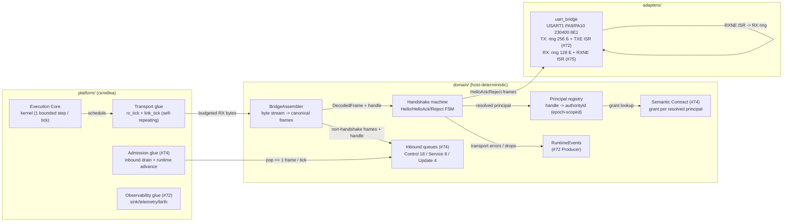

# Дизайн транспортного профиля network_bridge V3

Статус: **design-артефакт для тикета [«Реализовать транспортный профиль network_bridge»](https://github.com/Driadix/ShuttleControllerV3/issues/75)** (Фаза 2, один vertical PR по правилу карты [«Реализовать и выпустить firmware-платформу контроллера V3»](https://github.com/Driadix/ShuttleControllerV3/issues/58)).

Прототип-ассет: `bench/transport-proto/` (throwaway host-модель: assembler + RX-budget pump + handshake FSM; 16 демо-кейсов PASS + 21 unittest). Дизайн фиксирует его ответы D1-D4 как production-контракт.

Дизайн наследует утверждённые решения и **не пересматривает** их: #47 (`docs/external-semantic-transport-contracts-v3.md`: слойность contract core / profiles, mandatory handshake, bridgePrincipalHandle-модель, effective profile из ingress, layered registries), #43 (границы/never-block), #48 (MTU 128, очереди, UART 230 B/тик, authority 16), #49 (подписки, приоритеты TX, per-class caps), #13 (admission), #51 (R1-R8, dependency rules), #72 (`docs/observability-design-v3.md`: UART TX USART1 230400 8E1, ring 256 Б, TXE ISR, RX зарезервирован за #75), #74 (`docs/operation-runtime-design-v3.md`: codec - общий contract core, semantic - grant-модель, transport #75 - principal-resolution). Численные бюджеты - из `docs/quality-attributes-and-budgets-v3.md`; термины - канонические из `CONTEXT.md`.

## §0 Решения владельца (HITL-брифинг, 2026-09-02)

> Раздел заполняется решениями владельца по брифингу §10.4 до реализации;
> ниже - кандидаты, вынесенные на брифинг.

1. **RX/TX split линк-бюджета 230 Б/тик** (#48 §7 «UART bridge RX+TX»): кандидат - **115/115 RX/TX** фиксированный split (половина), с ревизией по L4-измерению. Альтернатива: RX 60 / TX 170 (асимметрия в пользу TX-observability, RX-очередь Control 18×128 Б разряжается 5 тиками - 50 мс на полный буфер при flood).
2. **Hello payload layout (u8 protoMajor, u8 expectedProfileId, u16 bridgePrincipalHandle, u8 requestedRoles)**: минимальный, без endpointInstanceHint (не участвует в principal-resolution, #47 §5.1 п.8; добавляется аддитивно при появлении надобности).
3. **HelloAck payload layout (u32 controllerEpoch, u16 authorityId, u8 grantedRoles, u8 effectiveProfileId, u16 capabilities=0)**: advertise-минимум #47 §5.1 без избыточных полей; capabilities - аддитивный резерв.
4. **Слоты principal-registry**: 16 principals (#48 §6), handle - полный u16-диапазон (2048 значений не резервируются; исчерпание неиспользованных хендлов в epoch - практическая невозможность на 16 principals, contract ограничен authority-бюджетом).

---

## 1. Место в архитектуре



| Элемент | Компонент (#43 §2) | Владение | Примечание |
| --- | --- | --- | --- |
| BridgeAssembler | Transport (adapters-интерфейс, domain-логика) | domain | чистый модуль: байты -> DecodedFrame, resync/gap/счётчики; no-alloc, bounds-checked |
| Handshake machine | Transport | domain | Hello FSM: версия/профиль/handle/principal/грант; эмитит HelloAck/HandshakeReject каноническими кадрами |
| Principal registry | Transport (principal-resolution #47 §5.1) | domain | handle -> authorityId + roles; epoch-scoped, no-reassign; 16 слотов |
| Transport glue (rx_tick / link_tick) | platform (склейка) | platform | self-repeating steps: RX-budget pump -> assembler -> очереди; gap-timer |
| uart_bridge RX | Transport HAL | adapters | RXNE ISR: регистр DR -> RX-кольцо, только перемещение байта (R2); ring 128 Б, overflow -> счётчик |
| Inbound queues | Semantic (#74, не пересматриваются) | domain | assembler кладёт кадры по queue_class + reserve-семантике |

**Граница модуля (#75)**: assembler + handshake-машина + principal-registry + transport glue (rx_tick / link_tick) + RX-часть uart_bridge (RXNE ISR + RX-кольцо) + host-тесты. НЕ входят: outbound TX-планирование и очереди классов (Sink #72 - без изменений), semantic admission (#74 - получает resolved principal через grant-lookup), radio-профиль (#66 - закрыт, E22-обвязка вне v1.0.0 scope карты), production bridge/display software (Out of scope карты #58), SetWallClock и Service-пейлоады (#76), Manual Session (#77), payload-кодеки Service/Update/Session (появляются в своих слайсах; ingress-кадры этих family маршрутизируются по queue_class, payload-слои reject InvalidEnvelope).

**ISR-граница (инвариант)**: RXNE ISR в adapters/uart_bridge выполняет ровно одну операцию - перемещение байта из USART1->DR в RX-кольцо (полное кольцо -> байт дропается + счётчик ISR-side; сам счётчик - обычная инкрементируемая переменная, не портовый вызов). Никакой политики, парсинга, эмиссии событий из ISR (R2, #43 §3.2). Весь парсинг/хендшейк/маршрутизация - foreground (rx_tick, bounded <= T_step). TX-путь #72 не меняется (TXE ISR ring->TDR).

## 2. Модели данных

Все типы - fixed-width (`stdint`, R3), без аллокации (R1), bounded (R4), typed outcomes (R5).

### 2.1 Wire-контракты (payload-кодеки #75, аддитивные к codec #74)

```cpp
// Hello (client -> controller; Handshake family, msgType 0; reserve-класс).
#pragma pack(push, 1)
struct Hello
{
    std::uint8_t protocol_major = 1;      // hard-fail при != 1 (#47 §5.3)
    std::uint8_t expected_profile = 0;    // network_bridge=0 | radio=1; неавторитетно
    std::uint16_t bridge_principal_handle = 0; // u16, epoch-scoped (#47 §4.2)
    std::uint8_t requested_roles = 0;     // заявка; grant = requested AND controller
};
// HelloAck (controller -> client; msgType 1).
struct HelloAck
{
    std::uint32_t controller_epoch = 0;   // fencing (#13)
    std::uint16_t authority_id = 0;       // назначен контроллером
    std::uint8_t granted_roles = 0;       // requested AND grant
    std::uint8_t effective_profile = 0;   // контроллер-derived из ingress; здесь всегда network_bridge
    std::uint16_t capabilities = 0;       // резерв, аддитивно (#47 §5.3)
};
// HandshakeReject (controller -> client; msgType 2).
struct HandshakeReject
{
    std::uint8_t reject_code = 0;         // RejectCode (#47 §16.2)
};
#pragma pack(pop)
```

Размеры: Hello 5 Б, HelloAck 10 Б, HandshakeReject 1 Б - все < MaxPayload 116; кодеки - codec-стиль (LE, bounds-checked, CodecResult).

### 2.2 BridgeAssembler (состояние)

```cpp
class BridgeAssembler
{
    static constexpr std::uint16_t FrameBuf = codec::Mtu; // 128 Б: ровно один максимальный кадр
    static constexpr std::uint16_t GapTimeoutMs = 250;    // V1 parser reset (research C02)

    // буфер + fill; парсинг инкрементальный, resync-on-bad-sync
    // счётчики: frames_ok, resyncs, dropped_bytes, bad_crc, truncated_flushes
};
```

- Буфер кадра - **128 Б ровно** (один максимальный кадр; мусор сканируется/сбрасывается до накопления: буфер никогда не растёт сверх MTU - R4).
- partial-кадр ждёт байты; gap-таймер 250 мс без байтов -> truncated_flush (счётчик, буфер чист).
- oversized `payload_len` в «заголовке» -> мусорная sync-пара, сброс 1 байта, пересканирование (wire-длине не доверяем).
- События: transport_error(BadCrc) и.т.д. -> RuntimeEvents (Producer #72), не из ISR.

### 2.3 Principal registry (состояние)

```cpp
struct PrincipalEntry
{
    std::uint16_t handle = 0;             // bridgePrincipalHandle
    std::uint16_t authority_id = 0;       // 1..16, 0 = слот свободен
    std::uint8_t roles = 0;               // грант (AND controller grant)
};
class PrincipalRegistry
{
    static constexpr std::uint8_t Capacity = 16;  // authorityId budget (#48 §6)
    // epoch-скоп: смена epoch -> clear; handle не переназначается в пределах epoch
};
```

- RAM: 16 × 5 Б = 80 Б + epoch u32 + счётчики ~ 100 Б.
- re-hello известного handle в том же epoch -> тот же authority_id (re-bind ролей разрешён - grant пересчитывается).
- исчерпание 16 слотов -> BusyRejected (#47 §5.1 п.5).

### 2.4 RX-путь uart_bridge (состояние)

```cpp
// RX-кольцо: 128 Б (ISR производит, foreground потребляет).
// RXNE ISR: DR -> ring[head]; head = (head+1) & 127; полное кольцо -> drop + счётчик isr_drops.
// Foreground rx_tick: <= RxBudgetBytes (115) Б/тик ring -> assembler.feed().
```

- 128 Б = один максимальный кадр (bounded, R4); при исчерпании RX-бюджета остаток ждёт следующего тика.
- ORE (overrun) обрабатывается в ISR: чтение DR + сброс SR.ORE, байт сохраняется, счётчик.

## 3. Трансформации

### 3.1 Поток RX (foreground, каждый тик; bounded <= T_step)

```text
rx_tick(ctx):                                  # self-repeating, паттерн sensing_schedule
  budget = RxBudgetBytes (115)
  while budget > 0 and ring не пуст:
    chunk = min(budget, доступно, FrameBuf - assembler.fill)
    assembler.feed(ring_pop(chunk)); budget -= chunk
  frames = assembler.drain()                   # 0..N кадров (обычно 0..1)
  for f in frames:
    route(f):                                  # маршрутизация по family
      Handshake/Hello -> handshake.on_hello(payload, ingress_handle=derived)
      else -> principal = registry.resolve(ingress_handle)
             if principal == 0: emit HandshakeReject(HandshakeRequired); continue
             if f.family == Update and mutating: reject ProfileDenied?  # network_bridge: разрешено; guard остаётся в semantic
             queues.push(class(f.queue_class), frame, reserve=flags&FlagReserve)
  re-arm (fresh now + 1)
```

- Маршрутизация - механическая (по header.queue_class + reserve-флагу); semantic admission - в #74, transport не решает.
- Оба reserve-слота Control (stop/handshake) - обязательный маршрут: handshake-кадры и stop-intents никогда не отклоняются полным буфером (#43 §6).

### 3.2 Handshake FSM (Hello -> HelloAck | HandshakeReject)

```text
on_hello(payload, ingress_handle):
  decode Hello (codec; ошибка -> InvalidEnvelope + event)
  if protocol_major != codec::ProtocolMajor:  -> reject(UnsupportedVersion)
  if expected_profile != network_bridge:      -> reject(ProfileMismatch)      # anti-spoof #47 §5.1
  if ingress_handle != payload.handle:        -> reject(Unauthorized)         # cross-principal spoof
  if payload.handle mapped in-epoch:          -> HelloAck(same authority, grant refresh)
  else if registry full:                      -> reject(BusyRejected)
  else: allocate authority_id; HelloAck(epoch, authority_id, grant)
```

- HelloAck/Reject кодируются каноническими кадрами (codec #74) и идут через OutboundControl -> Sink (приоритет 1, #49 §10) - TX-путь #72 без изменений.
- HelloAck эмитится В ОТВЕТ на Hello; unsolicited HelloAck не существует (не нужен keepalive на этапе Фазы 2; условия пересмотра - §11).

### 3.3 Gap/reconnect (link_tick, каждый тик)

```text
link_tick(ctx):
  if assembler.partial и (now - last_rx_byte_ms) > 250: assembler.gap_timeout()
  re-arm
```

- Reconnect в пределах epoch: handle -> principal map живёт; клиент пере-Hello получает тот же authority_id (#47 §5.1 п.5).
- Смена epoch (reboot): map очищена; первый старый-principal кадр -> HandshakeRequired; re-Hello выделяет заново.

### 3.4 Бюджеты (per-tick, #48 §7)

| Путь | Бюджет | Основание |
| --- | --- | --- |
| RX ring -> assembler | <= 115 Б/тик | split 230/2 (см. §0.1) |
| TX (Sink drain, #72, не меняется) | <= 115 Б/тик суммарно с RX | #48 §7 |
| Assembler.parse за тик | <= N кадров из <= 115 Б: <= ~9 кадров 12 Б | bounded mechanically |
| HandshakeReject/HelloAck | в приоритете 1 TX | #49 §10 |

## 4. Зависимости и контракты

### 4.1 Dependency-матрица

| Модуль | Зависит от | НЕ зависит от |
| --- | --- | --- |
| BridgeAssembler | codec (#74), ports (RuntimeEvents) | queues, semantic, handshake, adapters, Arduino |
| Handshake machine | codec, PrincipalRegistry, OutboundControl, EpochSource, RuntimeEvents | runtime, semantic admission, queues |
| PrincipalRegistry | codec (RejectCode) | - |
| Transport glue | assembler, handshake, registry, queues, kernel (schedule), monotonic | Sink/Producer (только через порты) |
| uart_bridge RX | STM32 USART1 registers | domain logic |

Host-buildable: assembler/handshake/registry/glue - чистые, native-сборка включает их (build_src_filter уже покрывает domain/ platform/).

### 4.2 Порты (эволюция domain/ports.h)

```cpp
// RX-продюсер (adapter -> domain): доступные байты + чтение chunk.
struct UartRxSource
{
    virtual std::uint32_t rx_bytes_available() const = 0;
    virtual std::uint32_t rx_read(std::uint8_t* out, std::uint32_t cap) = 0; // <= cap байт
};
```

- Grant-подача в SemanticContract (#74): `process_frame(const DecodedFrame&, const Grant&)` - resolved principal передаётся transport-глUEем; существующий `init(..., Grant)` остаётся для host-тестов, glue вызывает process_frame с грантом из registry.
- Ingress-handle производная: bridge - single ingress, handle из Hello payload (transport знает только его; никакого bridgeEndpointId - один endpoint на стенде и в контракте v1).

### 4.3 Инварианты

| Инвариант | Источник | Проверка |
| --- | --- | --- |
| Mutating до handshake запрещён | #47 §5.1 | T3, T5 |
| principal resolved из ingress+handle, payload authority_id - echo | #47 §5.1 п.6 | T6 |
| handle не переназначается в epoch | #47 §5.1 п.5 | T7 |
| epoch change очищает map | #47 §5.1 п.5 | T8 |
| > 16 principals -> BusyRejected | #48 §6 | T9 |
| RX bounded: ring 128 Б, <= 115 Б/тик, overflow -> drop + счётчик | #48 §7, #43 §6 | T10-T12 |
| Never-block: все пути foreground, ISR - только байт | #43 §6, R2 | T12, review |
| Кадры codec - без transport-диалекта | #74 acceptance | T2 (те же байты) |
| stop/handshake никогда не отклоняются полным буфером | #43 §6 | T13 |
| partial frame + 250 мс gap -> flush | research C02 | T14 |

## 5. Shape of code

### 5.1 Program layout

```text
domain/transport.h / transport.cpp      - BridgeAssembler, Handshake, PrincipalRegistry
domain/ports.h                          - + UartRxSource
platform/transport_glue.h / .cpp        - rx_tick / link_tick (self-repeating)
adapters/uart_bridge.h / .cpp           - + RX-ring, RXNE-часть ISR, rx_read
platform/main.cpp                       - wiring: transport glue, registry -> semantic grant-lookup
tests/test_transport/                   - host-тесты T1-T15
bench/transport-proto/                  - throwaway прототип (уже в репо)
```

### 5.2 Public API (production-форма)

```cpp
namespace v3::transport
{
class BridgeAssembler
{
  public:
    struct Stats { /* frames_ok, resyncs, dropped_bytes, bad_crc, truncated_flushes */ };
    void feed(const std::uint8_t* data, std::uint16_t len);  // foreground, bounded
    void gap_timeout();                                       // link_tick вызывает
    std::uint8_t drain(FrameOut (&out)[4]);                   // <= 4 кадра/вызов (115 Б / 12 Б)
    const Stats& stats() const;
};

class PrincipalRegistry
{
  public:
    static constexpr std::uint8_t Capacity = 16;
    enum class Result : std::uint8_t { Ok, Busy, Mismatch };
    Result resolve_or_create(std::uint16_t handle, std::uint8_t requested_roles,
                             std::uint16_t& authority_id, std::uint8_t& granted_roles);
    bool resolve(std::uint16_t handle, Grant& out) const;     // 0 = no principal
    void epoch_reset();
};

class Handshake
{
  public:
    void init(PrincipalRegistry*, EpochSource*, OutboundControl*, RuntimeEvents*);
    void on_hello(const codec::DecodedFrame& f, std::uint16_t ingress_handle);
};
} // namespace v3::transport
```

- `FrameOut` - reuse `queue::Frame` (128 Б data + len).
- max 4 кадра за drain - budget-derived (115 Б min-кадр 12 Б); больший поток кадров раскладывается на тики.

### 5.3 Изменения против существующего кода

- `adapters/uart_bridge.cpp`: init включает RX (USART_CR1_RE + RXNEIE); ISR-диспетч обрабатывает TXE и RXNE; добавляется RX-кольцо + rx_read.
- `platform/main.cpp`: wiring transport-глUEя (rx_tick/link_tick schedule) + semantic получает grant через registry-lookup (адаптер SemanticGrantSource).
- `domain/semantic.h`: process_frame перегрузка с Grant-параметром (см. §4.2).
- `platform/admission_glue.cpp`: без изменений (pop -> process_frame уже есть).

## 6. Light-визуализации

Псевдокод assembler: см. bench/transport-proto/transport_logic.py (модель 1:1; функция `_extract_one` - реальный алгоритм).

## 7. Тесты с call graph

### 7.1 Production call graph

```text
kernel::process_tick
  -> transport_glue::rx_tick
     -> uart_bridge.rx_read (<= 115 Б)
     -> assembler.feed / drain
     -> handshake.on_hello (Hello) -> outbound->enqueue(HelloAck/Reject)
     -> queues.push (class, reserve)
  -> admission_glue::inbound_tick (pop -> semantic.process_frame(frame, grant))
  -> obsglue::sink_tick (TX drain - #72, не меняется)
```

### 7.2 Test call graph

host: fakes (FakeUartRx, RecordingOutbound, FakeEpoch) -> assembler/handshake/registry -> assert counters/frames/queues.

### 7.3 Тест-кейсы

| # | Suite | Контракт | Метод | Среда |
| --- | --- | --- | --- | --- |
| T1 | test_transport | Канонический кадр собирается из частей (split-anywhere) | feed-циклы по 1 байту | host |
| T2 | test_transport | Байты из прототипа = байты из codec #74 (нет диалекта) | byte-equal | host |
| T3 | test_transport | Hello полный маршрут -> HelloAck с authorityId/epoch/grant | полный конвейер | host |
| T4 | test_transport | protoMajor != 1 -> UnsupportedVersion | инъекция | host |
| T5 | test_transport | Контроль-кадр pre-handshake -> HandshakeRequired | маршрутизация | host |
| T6 | test_transport | spoof: ingress_handle != hello handle -> Unauthorized | инъекция | host |
| T7 | test_transport | re-hello -> тот же authority_id (в epoch) | FSM | host |
| T8 | test_transport | epoch change -> map очищена, re-hello выделяет заново | FSM | host |
| T9 | test_transport | 17 principals -> BusyRejected | flood | host |
| T10 | test_transport | RX budget: > 115 Б/тик не потребляется сверх | pump | host |
| T11 | test_transport | ring overflow -> drop + счётчик, не блок | flood | host |
| T12 | test_transport | resync: мусор между кадрами не теряет кадры | stream | host |
| T13 | test_transport | reserve-слоты: stop/handshake при полном Control-буфере | queue full | host |
| T14 | test_transport | partial + 250 мс gap -> truncated_flush | таймер | host |
| T15 | test_transport_integration | E2E: RX-байты -> assembler -> queue -> semantic -> ACK (полный конвейер с grant) | конвейер | host |

### 7.4 L4-сценарии (runner #65, тикет #75 acceptance)

- `transport-handshake`: flash firmware -> COM-порт: host-пир шлёт Hello -> ждёт HelloAck (validate authority/epoch) -> шлёт OperationRequest (valid epoch/authority) -> ждёт ACK-negative UnknownOperationType (реестр пуст) -> смена профиля на радио-expected -> ProfileMismatch. Verdict: minFrames, requirePatterns.
- `transport-flood`: пир льёт мусор + валидные кадры -> контроллер отвечает только на валидные (Crc-bad ratio + счётчики).
- Сценарии имеют формат scenario-v2 (capture + oracle) - расширяется `stimulus`-секцией (addiv: host-пир-скрипт в runner-цикле). Runner-расширение входит в PR #75 (инструментальный, не production).

## 8. Vertical slice граница

Один vertical PR: domain/transport (assembler + handshake + registry) + ports UartRxSource + adapters/uart_bridge RX + platform/transport_glue + main.cpp wiring + host-тесты T1-T15 + runner scenario `transport-handshake` + bench/transport-proto (уже закоммичен).

Наблюдаемый контракт: host contract/integration тесты + L4 UART runner (handshake, request, flood, gap). Gate: #69 (observability/communication) получает network_bridge-канал end-to-end.

НЕ входят: radio-профиль, production bridge, SetWallClock, Manual Session, Service/Update payload-кодеки (маршрутизация есть, payload - свои слайсы), principal eviction policy (не требуется: epoch-reset достаточно), keepalive/heartbeat (условия пересмотра §11).

## 9. Трассировка obligations

| Obligation | Закрытие |
| --- | --- |
| #47 §5.1 handshake до mutating; principal resolution ingress+handle; no-reassign; BusyRejected | §3.2, T3-T9 |
| #47 §18 #2 handshake после reboot (epoch refresh) | T8 |
| #47 §18 #12 authority binding (echo не resolver) | §3.2, T6 |
| #47 §18 #10 multi-principal ledgers | T9 (per-authority grants; ledger - #74, уже per-authority) |
| #48 §7 UART budget RX+TX | §3.4, T10-T11 |
| #48 §6 authority 16 | T9 |
| #43 §6 never-block, reserve-слоты, drop+counter | §2.4, T11-T13 |
| #43 §3.2 R2 ISR-граница | §1, review |
| #74 «transport не создаёт диалект» | T2 |
| #72 §0.5 «RX-путь за #75» | §2.4, uart_bridge RX |
| #52 verification (contract host + L4 behavior) | §7.3, §7.4 |

## 10. Assumptions / Unknowns / Confidence

### 10.4 Открытые вопросы владельца (HITL-брифинг)

1. **RX/TX split 230 Б/тик**: 115/115 (рекомендация: симметрия, простота, RX-бэклог 18 кадров Control разряжается 5 тиками при worst-case flood) vs 60/170 (приоритет TX-observability, RX-латентность хуже). Прототип допускает обе (константа).
2. **Hello layout без endpointInstanceHint**: минимум 5 Б; hint - аддитивное поле при надобности логов. Рекомендация: не добавлять.
3. **Grant-подача в semantic**: через transport-глUE (registry-lookup per frame) vs отдельный порт SemanticGrantSource. Рекомендация: перегрузка process_frame(frame, grant) - минимальное вторжение в #74.

### 10.1 Facts

- Прототип D1-D4 отвечает на все четыре design-вопроса (16 кейсов PASS, 21 unittest).
- #72 TX-путь production-готов (L4 PASS); RX «зарезервирован за #75» - включение в этом PR.
- Очереди #74 принимаю кадры через push(cls, frame, reserve) - сигнатура готова.

### 10.2 Assumptions

- RX 115 Б/тик достаточно для handshake + control-трафикаControl (18 кадров = 2304 Б бэклог = 20 тиков = 200 мс worst-case drain при flood - приемлемо для control-plane, не для safety (safety - CAN, вне UART).
- RX-кольцо 128 Б (один кадр) достаточно: при 115 Б/тик потребления и 23 Б/мс производства (230400 8E1 ~ 23 КБ/с) кольцо наполняется 128 Б за ~6 мс; переполнение -> drop + счётчик (видно в evidence, не silently).
- ISR RXNE на 23 КБ/с = прерывание каждые ~43 мкс - нагрузка допустима (приоритет 2, как TXE).

### 10.3 Unknowns

- Фактическая латентность RX-бэклога под L4-нагрузкой (замер - сценарий transport-flood, obligation §11).
- Поведение bridge-relay (T-Display S3) как host-пира в transport-handshake: существующий relay только запрашивает; сценарий потребует скрипта-пира на стороне хоста (pyserial, runner stimulus).

## 11. Условия пересмотра

- L4-измерение покажет RX-бэклог > 500 мс при flood -> пересмотр split (§0.1) или увеличение RX-бюджета.
- Потребуется keepalive/link-health пуш (gateway/liveness) -> добавление EpochAnnounce-периодики (аддитивно, capabilities-gated).
- Появление второго bridge endpoint (TCP-мост с несколькими UART) -> введение bridgeEndpointId в handle-ключ (#47 §5.1 - уже зарезервировано контрактом).
- Больше 16 principals на практике -> пересмотр authority-бюджета (Semantic change, #48).

## 12. Ссылки

- Тикет #75 (этот дизайн), #58 (карта), #72 (observability/UART TX), #74 (codec/semantic/runtime), #65 (verification runner), #69 (gate Фазы 2), #93 (T16 L4 smoke), #47/#48/#49/#43/#13/#51 (нормативы), #66 (radio - закрыт, вне v1.0.0 scope).
- Прототип: `bench/transport-proto/` (README + транспорт-модель + тесты).
- `docs/external-semantic-transport-contracts-v3.md` (#47) - нормативный каркас handshake/handle-модели.
- `docs/observability-design-v3.md` (#72) - TX-путь и RX-резерв.
- `CONTEXT.md` - Транспортный профиль network_bridge, Controller Epoch, Подписка.
