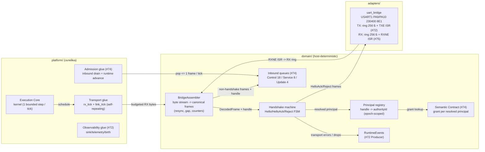

# Дизайн транспортного профиля network_bridge V3

Статус: **design-артефакт для тикета [«Реализовать транспортный профиль network_bridge»](https://github.com/Driadix/ShuttleControllerV3/issues/75)** (Фаза 2, один vertical PR по правилу карты [«Реализовать и выпустить firmware-платформу контроллера V3»](https://github.com/Driadix/ShuttleControllerV3/issues/58)).

Прототип-ассет: `bench/transport-proto/` (throwaway host-модель: assembler + RX-budget pump + handshake FSM; 16 демо-кейсов PASS + 21 unittest). Дизайн фиксирует его ответы D1-D4 как production-контракт.

Дизайн наследует утверждённые решения и **не пересматривает** их: #47 (`docs/external-semantic-transport-contracts-v3.md`: слойность contract core / profiles, mandatory handshake, bridgePrincipalHandle-модель, effective profile из ingress, layered registries), #43 (границы/never-block), #48 (MTU 128, очереди, UART 230 B/тик, authority 16), #49 (подписки, приоритеты TX, per-class caps), #13 (admission), #51 (R1-R8, dependency rules), #72 (`docs/observability-design-v3.md`: UART TX USART1 230400 8E1, ring 256 Б, TXE ISR, RX зарезервирован за #75), #74 (`docs/operation-runtime-design-v3.md`: codec - общий contract core, semantic - grant-модель, transport #75 - principal-resolution). Численные бюджеты - из `docs/quality-attributes-and-budgets-v3.md`; термины - канонические из `CONTEXT.md`.

## §0 Решения владельца (HITL-брифинг, 2026-09-02)

Решения подтверждены владельцем (брифинг §10.4, все три рекомендации приняты).

1. **RX/TX split линк-бюджета 230 Б/тик** (#48 §7 «UART bridge RX+TX»): владелец утвердил **симметричный принцип split с TX >= MTU**; конкретные числа зафиксированы ревью: **RX 192 Б/вызов rx_tick, TX (LinkBudgetBytes) 192 Б/вызов sink_tick** (both >= MTU 128; combined <= 230 Б на любом 10-мс окне; см. §3.4). Исходный кандидат 115/115 отвергнут ревью: 115 < MTU 128 давало head-of-line stall TX-очереди Sink #72 (кадры 116-128 Б не влезали ни в один вызов) и не покрывал update-throughput. Первичный вариант 60/170 отвергнут ранее: асимметрия хуже верифицируется.
2. **Hello payload layout (u8 protoMajor, u8 expectedProfileId, u16 bridgePrincipalHandle, u8 requestedRoles)**: минимальный, **без endpointInstanceHint** (не участвует в principal-resolution, #47 §5.1 п.8; добавляется аддитивно при появлении надобности).
3. **Grant-подача в SemanticContract**: **перегрузка process_frame(frame, grant)** - transport-глUE делает registry.resolve(handle) per frame и передаёт грант; process_frame(frame) остаётся для host-тестов #74. Отвергнут SemanticGrantSource-порт: лишний порт + моки во всех тестах #74.
4. **HelloAck payload layout (u32 controllerEpoch, u16 authorityId, u8 grantedRoles, u8 effectiveProfileId, u16 capabilities=0)**: advertise-минимум #47 §5.1 без избыточных полей; capabilities - аддитивный резерв.
5. **Слоты principal-registry**: 16 principals (#48 §6), handle - полный u16-диапазон (исчерпание неиспользованных хендлов в epoch практически невозможно на 16 principals; contract ограничен authority-бюджетом).

---

## 1. Место в архитектуре



| Элемент | Компонент (#43 §2) | Владение | Примечание |
| --- | --- | --- | --- |
| BridgeAssembler | Transport (adapters-интерфейс, domain-логика) | domain | чистый модуль: байты -> DecodedFrame, resync/gap/счётчики; no-alloc, bounds-checked |
| Handshake machine | Transport | domain | Hello FSM: версия/профиль/handle/principal/грант; эмитит HelloAck/HandshakeReject каноническими кадрами |
| Principal registry | Transport (principal-resolution #47 §5.1) | domain | handle -> authorityId + roles; epoch-scoped, no-reassign; 16 слотов |
| Transport glue (rx_tick / link_tick) | platform (склейка) | platform | self-repeating steps: RX-budget pump -> assembler -> очереди; gap-timer |
| uart_bridge RX | Transport HAL | adapters | RXNE ISR: регистр DR -&gt; RX-кольцо, только перемещение байта (R2); ring 256 Б, overflow -&gt; счётчик |
| Inbound queues | Semantic (#74, не пересматриваются) | domain | assembler кладёт кадры по queue_class + reserve-семантике |

**Граница модуля (#75)**: assembler + handshake-машина + principal-registry + transport glue (rx_tick / link_tick) + RX-часть uart_bridge (RXNE ISR + RX-кольцо) + host-тесты. НЕ входят: outbound TX-планирование и очереди классов (Sink #72 - без изменений), semantic admission (#74 - получает resolved principal через grant-lookup), radio-профиль (#66 - закрыт, E22-обвязка вне v1.0.0 scope карты), production bridge/display software (Out of scope карты #58), SetWallClock и Service-пейлоады (#76), Manual Session (#77), payload-кодеки Service/Update/Session (появляются в своих слайсах; ingress-кадры этих family маршрутизируются по queue_class, payload-слои reject InvalidEnvelope).

**ISR-граница (инвариант)**: RXNE ISR в adapters/uart_bridge выполняет ровно одну операцию - перемещение байта из USART1->DR в RX-кольцо (полное кольцо -> байт дропается + счётчик ISR-side; сам счётчик - обычная инкрементируемая переменная, не портовый вызов). Никакой политики, парсинга, эмиссии событий из ISR (R2, #43 §3.2). Весь парсинг/хендшейк/маршрутизация - foreground (rx_tick, bounded <= T_step). TX-путь #72 не меняется (TXE ISR ring->TDR).

## 2. Модели данных

Все типы - fixed-width (`stdint`, R3), без аллокации (R1), bounded (R4), typed outcomes (R5).

### 2.1 Wire-контракты (payload-кодеки #75, аддитивные к codec #74)

```cpp
// Hello (client -> controller; Handshake family, msgType 0; reserve-класс).
#pragma pack(push, 1)
struct Hello
{
    std::uint8_t protocol_major = 1;      // hard-fail при != 1 (#47 §5.3)
    std::uint8_t expected_profile = 0;    // network_bridge=0 | radio=1; неавторитетно
    std::uint16_t bridge_principal_handle = 0; // u16, epoch-scoped (#47 §4.2)
    std::uint8_t requested_roles = 0;     // заявка; grant = requested AND controller
};
// HelloAck (controller -> client; msgType 1).
struct HelloAck
{
    std::uint32_t controller_epoch = 0;   // fencing (#13)
    std::uint16_t authority_id = 0;       // назначен контроллером
    std::uint8_t granted_roles = 0;       // requested AND grant
    std::uint8_t effective_profile = 0;   // контроллер-derived из ingress; здесь всегда network_bridge
    std::uint16_t capabilities = 0;       // резерв, аддитивно (#47 §5.3)
};
// HandshakeReject (controller -> client; msgType 2).
struct HandshakeReject
{
    std::uint8_t reject_code = 0;         // RejectCode (#47 §16.2)
};
#pragma pack(pop)
```

### 2.1b Wire-механизм bridgePrincipalHandle (инвариант #47 §5.1 п.2/п.6)

**Проблема**: канонический Header #74 (8 Б: major/family/type/queue_class/flags/frame_seq/payload_len) не содержит handle; #47 §5.1 п.2 требует bridge-asserted handle на КАЖДОМ principal-scoped кадре, п.6 - resolver map(handle) на каждом кадре.

**Решение (аддитивное к codec #74, не диалект - payload-семантику интерпретирует транспорт, framing не меняется)**:

```cpp
// codec.h: новый флаг (биты 0x02 свободны; FlagReserve 0x01 занят #74).
constexpr std::uint8_t FlagPrincipalHandle = 0x02;

// Principal-scoped кадры (Control/Service/Update/Session, исключая Hello):
// header.flags |= FlagPrincipalHandle;
// payload[0..1] = bridgePrincipalHandle (LE u16);
// payload[2..] = собственный payload сообщения.
// Кадры БЕЗ флага на bridge-ингрессе (кроме Hello) -> HandshakeRequired/InvalidEnvelope
// (см. §3.2а): #47 §5.1 п.7(e) - principal-scoped frame без handle -> reject.
```

- Hello (Handshake family) - handle в собственном payload (§2.1), флаг не ставится.
- Observability/Outcome (контроллер -> клиент) - флаг не требуется (исходящие, не principal-scoped ingress).
- Доставка: assembler после codec::decode кадра проверяет `flags & FlagPrincipalHandle`, извлекает handle из payload[0..1], срезает 2 байта из payload view и прикладывает `(DecodedFrame, handle)` к маршрутизации. MTU не меняется: 2 Б от MaxPayload 116 -> effective 114 для principal-scoped payload.
- Спуфинг: bridge обязан ставить handle (obligation #47 §5.1 п.7(c)); контроллер требует флаг на каждом principal-scoped ingress-кадре - отсутствие флага = reject (по контракту #47 п.7(e) «missing handle on bridge principal-scoped frame -> reject»).
- **Альтернатива отвергнута**: link-wrapper вокруг canonical frame (E22-стиль) - это отдельный framing для bridge, конфликтующий с T2 «байты идентичны codec»; флаг+payload-преамбула сохраняет единую codec-фразу.
- **Альтернатива отвергнута**: single-principal-per-link де-скоуп - срезает мульти-принсипал #47 §5.1 п.5-6 и T9/registry на корню, не требуется (механизм выше реализуем).

### 2.2 BridgeAssembler (состояние)

```cpp
class BridgeAssembler
{
    static constexpr std::uint16_t FrameBuf = codec::Mtu; // 128 Б: ровно один максимальный кадр
    static constexpr std::uint16_t GapTimeoutMs = 250;    // V1 parser reset (research C02)

    // буфер + fill; парсинг инкрементальный, resync-on-bad-sync
    // счётчики: frames_ok, resyncs, dropped_bytes, bad_crc, truncated_flushes
};
```

- Буфер кадра - **128 Б ровно** (один максимальный кадр; мусор сканируется/сбрасывается до накопления: буфер никогда не растёт сверх MTU - R4).
- partial-кадр ждёт байты; gap-таймер 250 мс без байтов -> truncated_flush (счётчик, буфер чист).
- oversized `payload_len` в «заголовке» -> мусорная sync-пара, сброс 1 байта, пересканирование (wire-длине не доверяем).
- События: transport_error(BadCrc) и.т.д. -> RuntimeEvents (Producer #72), не из ISR.

### 2.3 Principal registry (состояние)

```cpp
struct PrincipalEntry
{
    std::uint16_t handle = 0;             // bridgePrincipalHandle
    std::uint16_t authority_id = 0;       // 1..16, 0 = слот свободен
    std::uint8_t roles = 0;               // грант (AND controller grant)
};
class PrincipalRegistry
{
    static constexpr std::uint8_t Capacity = 16;  // authorityId budget (#48 §6)
    // epoch-скоп: смена epoch -> clear; handle не переназначается в пределах epoch
};
```

- RAM: 16 × 5 Б = 80 Б + epoch u32 + счётчики ~ 100 Б.
- re-hello известного handle в том же epoch -> тот же authority_id (re-bind ролей разрешён - grant пересчитывается).
- исчерпание 16 слотов -> BusyRejected (#47 §5.1 п.5).

### 2.4 RX-путь uart_bridge (состояние)

```cpp
// RX-кольцо: 256 Б (ISR производит, foreground потребляет; power-of-2 mask).
// RXNE ISR: DR -> ring[head]; head = (head+1) & 255; полное кольцо -> drop + счётчик isr_drops.
// volatile u32 last_rx_ms: штамп последнего принятого байта (тот же ISR-класс,
// что счётчики - инкремент/запись переменной, не портовый вызов; R2).
// Foreground rx_tick: <= RxBudgetBytes (192) Б/вызов ring -> assembler.feed().
```

- **256 Б** (не 128): при устойчивой подаче в темпе линии (23.04 КБ/с = 23 Б/мс) и inter-invocation gap rx_tick до ~9 мс (диспетч: один due-шаг на kernel-тик 1 мс, self-repeating шагов после #75 - 8-9) в кольцо приходит до ~207 Б за gap; 256 Б покрывает максимум с запасом, не создавая ложных переполнений при легитимном update-потоке. Переполнение = только реальный flood/жам (drop + счётчик, наблюдаем).
- ORE (overrun, RM0090 §32.5): чтение DR (байт - в кольцо) + сброс SR.ORE; байт, вызвавший overrun, теряется аппаратно - отдельный счётчик ore_events; rx_tick экспортирует дельты isr_drops/ore_events в RuntimeEvents (defer-on-backpressure не создаёт; см. §3.1а).
- Бюджет RX и его согласование с TX - §3.4.

## 3. Трансформации

### 3.1 Поток RX (foreground, каждый тик; bounded <= T_step)

```text
rx_tick(ctx):                                  # self-repeating, паттерн sensing_schedule
  budget = RxBudgetBytes (192)
  while budget > 0 and ring не пуст:
    chunk = min(budget, доступно, FrameBuf - assembler.fill)
    assembler.feed(ring_pop(chunk)); budget -= chunk
  # ISR-счётчики -> наблюдаемость (дельта за вызов):
  export isr_drops/ore_events -> events->transport_error(...)  # §3.1а
  frames = assembler.drain()                   # 0..4 кадра (<= 192 Б / 12 Б min; см. §5.2)
  for f in frames:
    dr = codec::decode(f)                      # frame-level registry/bounds проверка (#74)
    if not dr.ok: events->transport_error(dr.error); continue
    route(dr):                                 # маршрутизация по family
      family == Handshake:                     # ВСЯ family - в handshake-машину
        msgType == Hello -> handshake.on_hello(dr, handle=decode(dr).handle)
        else -> handshake.on_unknown(dr)       # -> HandshakeReject(InvalidEnvelope); НЕ в очереди
      else (Control/Service/Update/Session):
        if not (dr.flags & FlagPrincipalHandle): -> HandshakeReject(HandshakeRequired)  # §2.1b
        handle = rd16(payload); payload += 2
        principal = registry.resolve(handle)
        if principal == 0: -> HandshakeReject(HandshakeRequired); continue
        ok = queues.push(class(dr.queue_class), frame, reserve=flags&FlagReserve)
        if not ok: events->queue_rejected(dr.queue_class)          # #43 §6: событие+счётчик
  re-arm (fresh now + 1)
```

- **Вся Handshake-family маршрутизируется в handshake-машину** (non-Hello handshake-кадры -> HandshakeReject(InvalidEnvelope), прототип-паритет): они НИКОГДА не попадают в queue-ветку и не могут занять reserve-слоты мусором (review-файндинг M3).
- Извлечённый кадр проходит `codec::decode` (#74): unknown family/msgType/oversized -> transport_error, кадр не маршрутизируется (review-файндинг N5).
- Push-failure в очередь -> `queue_rejected(cls)` событие (RuntimeEvents #74; review-файндинг M5).
- Маршрутизация - механическая (по header.queue_class + reserve-флагу); semantic admission - в #74, transport не решает. Update-family на network_bridge разрешён (mutating Update только на network_bridge - hard rule #47 §3.2; profile-гвард остаётся в semantic #76).
- Оба reserve-слота Control (stop) - обязательный маршрут: stop-intents никогда не отклоняются полным буфером (#43 §6).

### 3.1а Экспорт ISR-счётчиков (observability)

rx_tick в начале каждого вызова читает дельты isr_drops / ore_events (ISR-side переменные), и при ненулевой дельте эмитит transport_error-класс событие через RuntimeEvents (0x05xx, Producer #72). Из ISR - только инкремент переменных (R2). Это закрывает #43 §6 «каждый drop => счётчик + событие» для RX-переполнений (review-файндинг M4).

### 3.2 Handshake FSM (Hello -> HelloAck | HandshakeReject)

```text
on_hello(payload, ingress_handle):
  decode Hello (codec; ошибка -> InvalidEnvelope + event)
  if protocol_major != codec::ProtocolMajor:  -> reject(UnsupportedVersion)
  if expected_profile != network_bridge:      -> reject(ProfileMismatch)      # anti-spoof #47 §5.1
  if ingress_handle != payload.handle:        -> reject(Unauthorized)         # cross-principal spoof
  if payload.handle mapped in-epoch:          -> HelloAck(same authority, grant refresh)
  else if registry full:                      -> reject(BusyRejected)
  else: allocate authority_id; HelloAck(epoch, authority_id, grant)
```

- HelloAck/Reject кодируются каноническими кадрами (codec #74) и идут через OutboundControl -> Sink (приоритет 1, #49 §10) - TX-путь #72 без изменений.
- HelloAck эмитится В ОТВЕТ на Hello; unsolicited HelloAck не существует (не нужен keepalive на этапе Фазы 2; условия пересмотра - §11).

### 3.3 Gap/reconnect (link_tick, каждый тик)

```text
link_tick(ctx):
  if assembler.partial и (now - last_rx_byte_ms) > 250: assembler.gap_timeout()
  re-arm
```

- Reconnect в пределах epoch: handle -> principal map живёт; клиент пере-Hello получает тот же authority_id (#47 §5.1 п.5).
- Смена epoch (reboot): map очищена; первый старый-principal кадр -> HandshakeRequired; re-Hello выделяет заново.

### 3.4 Бюджеты (per-tick, #48 §7; единая модель - T_step 10 мс, диспетч один шаг/тик)

Линк 230400 8E1 = 23.04 КБ/с = 230 Б/10 мс (T_step). Каденция шагов: kernel-тик 1 мс, один due-шаг за тик; rx_tick стартует каждые ~8-9 мс при 8-9 self-repeating шагах после #75. Бюджеты фиксируются на **вызов шага** и согласованы с T_step:

| Путь | Бюджет | Основание |
| --- | --- | --- |
| RX ring -> assembler | **192 Б/вызов** rx_tick (~9 мс каденция => ~21.3 КБ/с средняя) | <= 207 Б max-gap притока (§2.4); укладывается в 230 Б/T_step |
| TX (Sink drain, #72) | **LinkBudgetBytes: 230 -> 192 Б/вызов** (sum с RX по T_step <= 230: RX 192/9 мс + TX 192/10 мс = 21.3 + 19.2 = 40.5 КБ/с < 46.1 gross; фактически линии до 23.04 КБ/с каждая в пределе, combined не превышает линию 230 Б/T_step на любом 10-мс окне) | #48 §7 «230 Б/тик RX+TX»; split пересмотрен с 115/115 (см. §0.1) |
| Sink head-of-line | **192 Б >= MTU 128**: любой одиночный кадр влезает в бюджет вызова - DEFER-правило #72 (observability.cpp drain: `need > budget -> break`) не залипает | review-файндинг B2: 115 < 128 давало перманентный stall головы |
| Assembler.parse за вызов | <= 4 кадров (192 Б / 12 Б min-кадра = 16; cap 4 - стек-бюджет 4×130 Б, баланс бэклога) | §5.2 drain(FrameOut[4]) |
| HandshakeReject/HelloAck | в приоритете 1 TX | #49 §10 |

- **Update-throughput**: RX 192 Б/вызов при каденции ~9 мс даёт среднюю ~21.3 КБ/с gross ingress - покрывает #48 §7 «update >= 12.8 КБ/с net (>= 1 MTU/тик)» с учёством ACK-корреляции; L4-сценарий transport-flood обязан замерить фактический throughput и занести в §11-триггеры.
- **PerClassCapBytes 128 >= min(192, MTU)**: класс-кап #72 не блокирует кадр (128 >= любой кадр), конфликтов с DEFER нет.
- `domain/observability.h`: `LinkBudgetBytes 230 -> 192` входит в change-list §5.3 (не «TX не меняется» - ревизия константы одна).

## 4. Зависимости и контракты

### 4.1 Dependency-матрица

| Модуль | Зависит от | НЕ зависит от |
| --- | --- | --- |
| BridgeAssembler | codec (#74), ports (RuntimeEvents) | queues, semantic, handshake, adapters, Arduino |
| Handshake machine | codec, PrincipalRegistry, OutboundControl, EpochSource, RuntimeEvents | runtime, semantic admission, queues |
| PrincipalRegistry | codec (RejectCode) | semantic, runtime, subscriptions |
| Transport glue | assembler, handshake, registry, queues, kernel (schedule), monotonic, OutboundControl, RuntimeEvents | Sink/Producer-реализации (только порты) |
| uart_bridge RX | STM32 USART1 registers | domain logic |

Host-buildable: assembler/handshake/registry/glue - чистые, native-сборка включает их (build_src_filter уже покрывает domain/ platform/).

### 4.2 Порты (эволюция domain/ports.h)

```cpp
// RX-продюсер (adapter -> domain): доступные байты + чтение chunk.
struct UartRxSource
{
    virtual std::uint32_t rx_bytes_available() const = 0;
    virtual std::uint32_t rx_read(std::uint8_t* out, std::uint32_t cap) = 0; // <= cap байт
    // ISR-side счётчики (R2-класс: чтение переменных, не портовые вызовы).
    virtual std::uint32_t rx_isr_drops() const = 0;
    virtual std::uint32_t rx_ore_events() const = 0;
};
```

- Grant-подача в SemanticContract (#74): `process_frame(const DecodedFrame&, const Grant&)` - transport-глUE резолвит grant из PrincipalRegistry на pop и вызывает перегрузку; process_frame(frame) остаётся для host-тестов #74 (решение §0.3).
- Ingress-handle производная: bridge - single ingress; handle каждого principal-scoped кадра извлекается из wire-преамбулы (§2.1b), Hello - из собственного payload. bridgeEndpointId отсутствует (один endpoint на стенде и в контракте v1; вводится аддитивно при мульти-endpoint, §11).
- `queue::Frame` расширяется полем `authority_id` (u16, resolved при push): single-writer O(1), не меняет queue-политик #74; admission_glue передаёт его в Grant при process_frame (см. §5.3).

### 4.3 Инварианты

| Инвариант | Источник | Проверка |
| --- | --- | --- |
| Mutating до handshake запрещён | #47 §5.1 | T3, T5 |
| Handle на каждом principal-scoped кадре (FlagPrincipalHandle + payload-преамбула) | #47 §5.1 п.2 | T6, T16 |
| principal resolved из ingress+handle, payload authority_id - echo | #47 §5.1 п.6 | T6 |
| handle не переназначается в epoch; re-hello -> тот же authority | #47 §5.1 п.5 | T7, T17 |
| epoch change очищает map | #47 §5.1 п.5 | T8 |
| Два handle -> два authorityId + отдельные гранты | #47 §18 #14(a) | T9a |
| > 16 principals -> BusyRejected | #48 §6 | T9 |
| RX bounded: ring 256 Б, <= 192 Б/вызов, overflow -> drop + счётчик + событие | #48 §7, #43 §6 | T10-T12 |
| Never-block: все пути foreground, ISR - только байт/счётчик | #43 §6, R2 | T12, review |
| Кадры codec - без transport-диалекта | #74 acceptance | T2 (те же байты) |
| stop никогда не отклоняется полным буфером | #43 §6 | T13 |
| partial frame + 250 мс gap -> flush | research C02 | T14 |
| Non-Hello Handshake-кадры -> InvalidEnvelope (не в очередях) | #47 §5.1, прототип | T18 |
| Короткий/мусорный Hello -> InvalidEnvelope | #47 §16.2 | T19 |
| frameSeq - pass-through, без transport-валидации в v1 | #47 §4.3 (решение #75) | T2 |

## 5. Shape of code

### 5.1 Program layout

```text
domain/transport.h / transport.cpp      - BridgeAssembler, Handshake, PrincipalRegistry
domain/ports.h                          - + UartRxSource
platform/transport_glue.h / .cpp        - rx_tick / link_tick (self-repeating)
adapters/uart_bridge.h / .cpp           - + RX-ring, RXNE-часть ISR, rx_read
### 5.2 Public API (production-форма)

```cpp
namespace v3::transport
{
class BridgeAssembler
{
  public:
    struct Stats { /* frames_ok, resyncs, dropped_bytes, bad_crc, truncated_flushes */ };
    void feed(const std::uint8_t* data, std::uint16_t len);  // foreground, bounded
    void gap_timeout();                                       // link_tick вызывает
    // <= 4 кадра/вызов (192 Б / 12 Б min-кадра = 16; cap 4 - стек и бэклог-баланс, §3.4)
    std::uint8_t drain(FrameOut (&out)[4]);
    const Stats& stats() const;
};

class PrincipalRegistry
{
  public:
    static constexpr std::uint8_t Capacity = 16;
    enum class Result : std::uint8_t { Ok, Busy, Mismatch };
    // resolve: out-параметры вместо semantic::Grant - dependency-матрица §4.1
    // (registry НЕ зависит от semantic).
    Result resolve_or_create(std::uint16_t handle, std::uint8_t requested_roles,
                             std::uint16_t& authority_id, std::uint8_t& granted_roles);
    bool resolve(std::uint16_t handle, std::uint16_t& authority_id,
                 std::uint8_t& granted_roles) const;  // false = no principal
    void epoch_reset();
};

class Handshake
{
  public:
    void init(PrincipalRegistry*, EpochSource*, OutboundControl*, RuntimeEvents*);
    void on_frame(const codec::DecodedFrame& f, std::uint16_t ingress_handle);
    // on_frame: msgType==Hello -> FSM §3.2; иначе -> HandshakeReject(InvalidEnvelope)
    // (non-Hello handshake-кадры не попадают в очереди; инвариант T18).
};
} // namespace v3::transport
```

- `FrameOut` - reuse `queue::Frame` (128 Б data + len + authority_id u16, §4.2).
- max 4 кадра за drain: осознанный cap ниже budget-максимума 16 (стек 4×130 Б, бэклог раскладывается на следующие вызовы; §3.4).

### 5.3 Изменения против существующего кода

- `domain/codec.h`: + `FlagPrincipalHandle = 0x02` (§2.1b; биты свободны, аддитивно).
- `domain/observability.h`: `LinkBudgetBytes 230 -> 192` (§3.4; TX-бюджет Sink).
- `domain/semantic.h/.cpp`: перегрузка `process_frame(const DecodedFrame&, const Grant&)` (решение §0.3).
- `domain/queues.h`: `queue::Frame` + поле `authority_id` (u16, resolved при push; §4.2).
- `platform/admission_glue.h/.cpp`: SemanticContext + указатель PrincipalRegistry; inbound_tick строит Grant из `frame.authority_id` (через registry-lookup roles) и вызывает process_frame(frame, grant) (review-файндинги M4/M5: «без изменений» было неверным).
- `adapters/uart_bridge.h/.cpp`: init включает RX (USART_CR1_RE + RXNEIE); ISR-диспетч обрабатывает TXE и RXNE; RX-кольцо 256 Б + rx_read + счётчики isr_drops/ore_events + volatile last_rx_ms.
- `platform/transport_glue.h/.cpp`: новые self-repeating шаги rx_tick/link_tick.
- `platform/main.cpp`: wiring transport-глUEя (schedule rx_tick/link_tick) + registry в SemanticContext.

## 6. Light-визуализации

Псевдокод assembler: см. bench/transport-proto/transport_logic.py (модель 1:1; функция `_extract_one` - реальный алгоритм).

## 7. Тесты с call graph

### 7.1 Production call graph

```text
kernel::process_tick
  -> transport_glue::rx_tick
     -> uart_bridge.rx_read (<= 192 Б)
     -> ISR-счётчики -> events->transport_error (§3.1а)
     -> assembler.feed / drain
     -> codec::decode (frame-level registry/bounds)
     -> handshake.on_frame (Handshake family) -> outbound->enqueue(HelloAck/Reject)
     -> registry.resolve(handle) -> queues.push (class, reserve, authority_id)
        push=false -> events->queue_rejected
  -> admission_glue::inbound_tick (pop -> grant из frame.authority_id -> semantic.process_frame(frame, grant))
  -> obsglue::sink_tick (TX drain - #72; LinkBudgetBytes 192)
  -> transport_glue::link_tick (gap-таймер: partial && now-last_rx_ms > 250 -> gap_timeout)
```

- Drain Service/Update классов - **#76/#77**; до них очереди заполняются и отклоняют с counters (by-design interim, наблюдаемо; review-файндинг N7).

### 7.2 Test call graph

host: fakes (FakeUartRx, RecordingOutbound, FakeEpoch) -> assembler/handshake/registry -> assert counters/frames/queues.

### 7.3 Тест-кейсы

| # | Suite | Контракт | Метод | Среда |
| --- | --- | --- | --- | --- |
| T1 | test_transport | Канонический кадр собирается из частей (split-anywhere) | feed-циклы по 1 байту | host |
| T2 | test_transport | Байты из прототипа = байты из codec #74 (нет диалекта) | byte-equal | host |
| T3 | test_transport | Результат Hello полным маршрутом: HelloAck с authorityId/epoch/grant | полный конвейер | host |
| T4 | test_transport | protoMajor != 1 -&gt; UnsupportedVersion | инъекция | host |
| T5 | test_transport | Контроль-кадр pre-handshake (без handle-флага) -&gt; HandshakeRequired | маршрутизация | host |
| T6 | test_transport | spoof: handle-преамбула != hello handle -&gt; Unauthorized | инъекция | host |
| T7 | test_transport | re-hello -&gt; тот же authority_id (в epoch) | FSM | host |
| T8 | test_transport | epoch change -&gt; map очищена, re-hello выделяет заново | FSM | host |
| T9 | test_transport | 17 principals -&gt; BusyRejected | flood | host |
| T9a | test_transport | Два handle -&gt; два authorityId + отдельные гранты (#47 §18 #14a) | FSM | host |
| T10 | test_transport | RX budget: &gt; 192 Б/вызов не потребляется сверх | pump | host |
| T11 | test_transport | ring overflow -&gt; drop + счётчик + событие, не блок | flood | host |
| T12 | test_transport | resync: мусор между кадрами не теряет кадры | stream | host |
| T13 | test_transport | reserve-слоты: stop при полном Control-буфере проходит | queue full | host |
| T14 | test_transport | partial + 250 мс gap -&gt; truncated_flush | таймер | host |
| T15 | test_transport_integration | E2E: RX-байты -&gt; assembler -&gt; queue -&gt; semantic -&gt; ACK (полный конвейер с grant) | конвейер | host |
| T16 | test_transport | Principal-scoped кадр без FlagPrincipalHandle -&gt; reject (§2.1b) | инъекция | host |
| T17 | test_transport | re-hello с ДРУГИМ requestedRoles -&gt; grant refresh, тот же authority | FSM | host |
| T18 | test_transport | Non-Hello Handshake-кадр -&gt; InvalidEnvelope, НЕ в очередях (reserve не занят) | маршрутизация | host |
| T19 | test_transport | Короткий Hello (&lt; 5 Б) -&gt; InvalidEnvelope | инъекция | host |
| T20 | test_transport | expectedProfileId = radio -&gt; ProfileMismatch | инъекция | host |
| T21 | test_transport | Unknown family/msgType кадр -&gt; transport_error, не в очередях | codec::decode | host |

### 7.4 L4-сценарии (runner #65, тикет #75 acceptance)

- `transport-handshake`: flash firmware -> COM-порт: host-пир шлёт Hello -> ждёт HelloAck (validate authority/epoch) -> шлёт OperationRequest (valid epoch/authority) -> ждёт ACK-negative UnknownOperationType (реестр пуст) -> смена профиля на радио-expected -> ProfileMismatch. Verdict: minFrames, requirePatterns.
- `transport-flood`: пир льёт мусор + валидные кадры -> контроллер отвечает только на валидные (Crc-bad ratio + счётчики).
- Сценарии имеют формат scenario-v2 (capture + oracle) - расширяется `stimulus`-секцией (addiv: host-пир-скрипт в runner-цикле). Runner-расширение входит в PR #75 (инструментальный, не production).

## 8. Vertical slice граница

Один vertical PR: domain/transport (assembler + handshake + registry) + codec FlagPrincipalHandle + queues.h authority_id + ports UartRxSource + adapters/uart_bridge RX + platform/transport_glue + admission_glue grant-путь + observability.h LinkBudgetBytes + main.cpp wiring + host-тесты T1-T21 + runner scenario `transport-handshake` + bench/transport-proto (уже закоммичен).

Наблюдаемый контракт: host contract/integration тесты + L4 UART runner (handshake, request, flood, gap). Gate: #69 (observability/communication) получает network_bridge-канал end-to-end.

НЕ входят: radio-профиль, production bridge, SetWallClock, Manual Session, Service/Update payload-кодеки (маршрутизация есть, payload - свои слайсы), principal eviction policy (не требуется: epoch-reset достаточно), keepalive/heartbeat (условия пересмотра §11).

## 9. Трассировка obligations

| Obligation | Закрытие |
| --- | --- |
| #47 §5.1 п.2 handle на каждом principal-scoped кадре | §2.1b, T6/T16 |
| #47 §5.1 handshake до mutating; no-reassign; BusyRejected | §3.2, T3-T9 |
| #47 §5.1 п.7(e) principal-scoped без handle -> reject | §3.1, T16 |
| #47 §18 #2 handshake после reboot (epoch refresh) | T8 |
| #47 §18 #12 authority binding (echo не resolver) | §3.2, T6 |
| #47 §18 #10 multi-principal ledgers | T9/T9a (per-authority grants; ledger #74 уже per-authority) |
| #47 §18 #14(a),(b) два handle -> два authority; re-hello -> тот же | T9a, T7 |
| #47 §4.3 frameSeq dual-plane: pass-through (решение) | §4.3, T2 |
| #48 §7 UART budget RX+TX (230 Б/тик, update >= 12.8 КБ/с) | §3.4, T10-T11 |
| #48 §6 authority 16 | T9 |
| #43 §6 never-block, reserve-слоты, drop+counter+event | §2.4/§3.1а, T11-T13 |
| #43 §3.2 R2 ISR-граница | §1/§2.4, review |
| #74 «transport не создаёт диалект» | §2.1b (флаг+преамбула - payload-семантика, framing общий), T2 |
| #72 §0.5 «RX-путь за #75» | §2.4, uart_bridge RX |
| #52 verification (contract host + L4 behavior) | §7.3, §7.4 |

## 10. Assumptions / Unknowns / Confidence

### 10.1 Facts

- Прототип D1-D4 отвечает на все четыре design-вопроса (16 кейсов PASS, 21 unittest).
- #72 TX-путь production-готов (L4 PASS); RX «зарезервирован за #75» - включение в этом PR.
- Очереди #74 принимают кадры через push(cls, frame, reserve) - сигнатура готова.
- Sink #72 DEFER-правило (`need > budget -> break`, observability.cpp drain) подтверждено чтением кода - TX-бюджет обязан быть >= MTU (review B2).

### 10.2 Assumptions

- RX 192 Б/вызов при каденции rx_tick ~9 мс покрывает handshake + control + update-поток (21.3 КБ/с gross > 12.8 КБ/с net #48); фактический throughput - L4-обязательство (§7.4 transport-flood).
- RX-кольцо 256 Б покрывает max inter-invocation gap (~207 Б при 23 Б/мс): переполнение - только реальный flood, не легитимный поток.
- ISR RXNE на 23 КБ/с = прерывание каждые ~43 мкс - нагрузка допустима (приоритет 2, как TXE).
- Control-бэклог worst-case: 18 кадров = 2304 Б при flood разряжается ~12 вызовами rx_tick (~110 мс) - приемлемо для control-plane (safety - CAN, вне UART).

### 10.3 Unknowns

- Фактическая латентность RX-бэклога и throughput под L4-нагрузкой (замер - сценарий transport-flood, obligation §11).
- Поведение bridge-relay (T-Display S3) как host-пира в transport-handshake: существующий relay только запрашивает; сценарий потребует скрипта-пира на стороне хоста (pyserial, runner stimulus).

### 10.4 Решения владельца (закрыты брифингом 2026-09-02)

Все три вопроса брифинга закрыты (см. §0); открытых вопросов нет. RX/TX-split уточнён ревью до 192/192 (принцип владельца «split с TX >= MTU» сохранён, §0.1).

## 11. Условия пересмотра

- L4-измерение покажет RX-бэклог > 500 мс при flood -> пересмотр split (§0.1) или увеличение RX-бюджета.
- **Измеренный update-throughput < 12.8 КБ/с net на L4 (transport-flood) -> пересмотр RX-бюджета/каденции rx_tick** (review B3).
- Потребуется keepalive/link-health пуш (gateway/liveness) -> добавление EpochAnnounce-периодики (аддитивно, capabilities-gated).
- Появление второго bridge endpoint (TCP-мост с несколькими UART) -> введение bridgeEndpointId в handle-ключ (#47 §5.1 - уже зарезервировано контрактом).
- Больше 16 principals на практике -> пересмотр authority-бюджета (Semantic change, #48).

## 12. Ссылки

- Тикет #75 (этот дизайн), #58 (карта), #72 (observability/UART TX), #74 (codec/semantic/runtime), #65 (verification runner), #69 (gate Фазы 2), #93 (T16 L4 smoke), #47/#48/#49/#43/#13/#51 (нормативы), #66 (radio - закрыт, вне v1.0.0 scope).
- Прототип: `bench/transport-proto/` (README + транспорт-модель + тесты).
- `docs/external-semantic-transport-contracts-v3.md` (#47) - нормативный каркас handshake/handle-модели.
- `docs/observability-design-v3.md` (#72) - TX-путь и RX-резерв.
- `CONTEXT.md` - Транспортный профиль network_bridge, Controller Epoch, Подписка.
