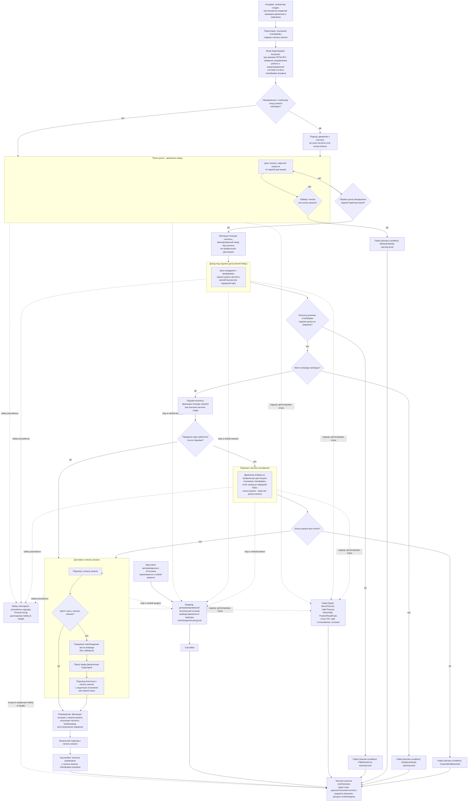

# Алгоритмическая документация операции UnloadPallet (V3)

Статус: подготовлено по issue [«Алгоритмическая документация: UnloadPallet»](https://github.com/Driadix/ShuttleControllerV3/issues/33) карты [«Спроектировать спецификацию и план прошивки контроллера V3»](https://github.com/Driadix/ShuttleControllerV3/issues/1). Окончательное утверждение ревизий выполняется на gate `G1 Behavioral Contract`.

Формат документа задан [«Формат алгоритмической документации операций V3»](./algorithmic-documentation-format-v3.md): 12-раздельный каркас, трёхслойное разделение содержание/evidence/структура, narrative на русском языке без формул и чисел, идентификаторы на английском. Общая рамка admission, ownership, надзора, прерываний и публикации outcomes задана [«Глобальной алгоритмической документацией работы шаттла V3»](./global-algorithmic-documentation-v3.md); lifecycle, identity, admission и idempotency заданы [«Общим semantic contract операций V3»](./semantic-contract-v3.md).

Evidence: [Capability Evidence Slices каталога операций V3](./research/v3-capability-evidence-slices.md), раздел «UnloadPallet (CMD_UNLOAD = 0x21)» группы «LoadPallet / UnloadPallet», разделы «Общие entry points и dispatch skeleton» и «Сквозные замечания»; канонический snapshot V1 - `Driadix/ShuttleController@708d090`. Далее ссылки вида «bundle, …» указывают на этот документ.

## 1. Identity и назначение

`UnloadPallet` - root operation type каталога V3 (решение [«Определить каталог и базовые инварианты операций V3»](https://github.com/Driadix/ShuttleControllerV3/issues/9)). Допустимая роль экземпляра - root; child-роль контракт типа не предусматривает. Доменная последовательность выгрузки `unload_Pallete` является общей подоперацией, разделяемой с `LongUnload`, `CompactPallets` и `Demo` (bundle, UnloadPallet - Entry points и call sites); границы композиции - раздел 10.

Доменная цель - извлечь самую глубокую паллету канала: подойти к паллете у заднего конца канала, поднять её, перевезти к началу канала и разместить (опустить) в точке размещения у начала канала. Операция завершается `Succeeded` только когда паллета размещена у начала канала (инвариант `Succeeded` ⇔ доменная цель достигнута).

V1 реализовывал тип одиночной командой `CMD_UNLOAD` (bundle, UnloadPallet - Entry points и call sites); V3 описывает его как единый тип без параметров, асимметрии и дефекты V1 зафиксированы в разделе 11.

Отношение к другим документам: admission-скелет, stop propagation, fault semantics, link-loss рамка и публикация outcomes не повторяются здесь, а применяются по глобальному документу и semantic contract; документ фиксирует только доменный алгоритм `UnloadPallet` и его тип-специфичные paths, условия и исходы.

## 2. Admission и условия входа

Запрос поступает от `Control Client` в пределах выданных полномочий; `Safety Authority` и `Service Client` этот тип не запрашивают. Envelope, epoch fencing, idempotency и конфликтная семантика - по semantic contract.

Параметры: контракт типа параметров не определяет (V1 - команда без аргумента; bundle, UnloadPallet - Admission/preconditions).

Системные preconditions (по глобальному документу): provisioning gate, fault-state gate, наличие в канале (для `UnloadPallet` внеканальное исполнение не разрешено - команда не входит в exempt-список), эксклюзивность (одна активная Exclusive Control Activity). Отрицательный результат - `Rejected` со стабильным rejection code, экземпляр не создаётся.

Условия, проверяемые только in-situ после принятия (дают runtime outcome, а не `Rejected`):

- наличие свободного направления к глубокому концу канала для фазы подхода - gate normal path, а не admission: при занятом направлении фаза подхода пропускается, поиск паллеты начинается с текущего положения;
- отсутствие свободного места впереди в фазе доставки - runtime domain-condition `NoSpaceAhead` (раздел 5);
- длина паллеты относительно платформы и достижимость паллеты у глубокого конца канала на admission не проверяются и проявляются runtime-исходами `PalletSizeError`, `ObstacleAhead`, `ChannelEndReached` (раздел 5).

V1 исполнял `CMD_UNLOAD` также внутри ручной сессии (bundle, UnloadPallet - Entry points и call sites, MANUAL-путь). В V3 ручное управление реализуется эксклюзивным lease `Manual Control Session` с hold-to-run intents (решение [«Определить system context и таксономию возможностей V3»](https://github.com/Driadix/ShuttleControllerV3/issues/2)); дискретный шаг выгрузки в ручной сессии не входит в контракт типа `UnloadPallet` и в baseline не переносится. Повторная проверка принятия после уже отправленного положительного ACK, существовавшая в V1, исключена: admission атомарен (решение [«Специфицировать общий semantic contract операций V3»](https://github.com/Driadix/ShuttleControllerV3/issues/13)).

## 3. Normal path

1. **Принятие.** Admission пройден, экземпляр в `Accepted`, положительный ACK выдан. Root получает эксклюзивное владение приводом движения и лифтером; sensing предоставляется как сервис платформы.
2. **Подготовка.** Платформа опускается; шаттл подводится к началу канала движением вперёд (bundle, UnloadPallet - Entry points и call sites, авто-путь).
3. **Вход подоперации выгрузки.** При включённом режиме FIFO/LIFO выполняется инверсия направления: операция работает в инвертированной системе отсчёта, в которой глубокий конец и начало канала меняются местами (раздел 11, disposition preserve). Платформа опущена, sensing обновлён. Если шаттл стоит у начала канала, фиксируется поправка стартового положения.
4. **Подход.** Если направление к глубокому концу канала свободно - движение к паллете: шаттл едет назад до зоны паллеты либо до конца канала. При занятом направлении подход пропускается, поиск начинается из текущего положения.
5. **Поиск первой доски.** Движение назад в цикле поиска с пересчётом скорости по задней дистанции. При срабатывании задней пары датчиков (первая доска паллеты) фиксируется позиция паллеты и выполняется фиксированный заезд под паллету на профильную дистанцию.
6. **Доезд под заднюю доску (board-delay).** После заезда выполняется цикл шагов ожидания с проверками прерывания; длина паллеты оценивается по приращению позиции; ранний выход - при срабатывании передней пары датчиков, означающем, что паллета полностью на платформе.
7. **Проверка длины.** Если за проезд длины платформы паллета так и не оказалась полностью на платформе - паллета длиннее платформы: исход `PalletSizeError` (раздел 5). V1 сообщал об этом warning-кодом и завершал подоперацию с возвратом к началу канала (раздел 11).
8. **Завершение поиска.** Если доски не обнаружены в отведённом времени поиска либо задняя дистанция упала до конца канала - исход `ObstacleAhead` (раздел 5). V1 сообщал warning-кодом и завершал подоперацию без смены статуса (раздел 11).
9. **Фиксация длины паллеты.** Позиция и оценка длины фиксируются, проверяется прерывание.
10. **Проверка места впереди.** Если в направлении выдачи у начала канала нет свободного места - исход `NoSpaceAhead` (раздел 5). V1 сообщал это состояние warning-кодом «паллета не найдена» - семантическое несоответствие, зафиксировано в разделе 11.
11. **Подъём.** Паллета поднимается лифтером. Если за шаттлом в глубине канала находится ещё одна паллета в пределах зоны захвата, фиксируется позиция захвата - она станет базой bookkeeping последней паллеты.
12. **Перехват паллеты (recapture).** Если после подъёма передняя пара датчиков не сработала (паллета смещена относительно платформы), выполняется перехват: движение вперёд на профильную дистанцию перехвата, опускание платформы, откат назад до срабатывания передней пары. Если при откате достигнут конец канала, длина канала пересчитывается от фактической позиции и фиксируется факт конца канала - исход `ChannelEndReached` (раздел 5). Затем платформа снова поднимается.
13. **Доставка к началу канала.** Шаттл с поднятой паллетой подъезжает к началу канала. Если он ещё не у начала канала: ожидается освобождение места впереди (цикл ожидания без таймаута - blocking unknown U09, разделы 5 и 8), затем выполняется пауза перед финальным подъездом, затем подъезд вплотную к началу канала с профилем скорости и защитным остановом при появлении препятствия впереди. Если шаттл уже стоит у начала канала, блок доставки пропускается.
14. **Размещение.** Фиксируется позиция размещения у начала канала; паллета опускается (если операция исполняется не как часть long-операции и платформа поднята); обновляется bookkeeping последней паллеты (позиция и признак наличия - только если позиция захвата была зафиксирована) и счётчик выгрузок; восстанавливается инверсия направления, если режим FIFO/LIFO был включён.
15. **Завершение.** Шаттл подъезжает к началу канала, выполняется останов, публикуется terminal outcome `Succeeded`, snapshot обновлён, ресурсы освобождены, платформа готова к новому запросу.

Инвариант соблюдается: `Succeeded` публикуется только при размещённой у начала канала паллете. V1 ordering-факт: dispatch выполнял финальный подъезд к началу канала даже после abort внутри подоперации (в отличие от `LongUnload`, где guard есть); в V3 движение после остановки/отказа не выполняется - финальный подъезд является частью normal path (раздел 11, disposition change).

## 4. Ожидания и повторения

Все ожидания находятся внутри `Running` и имеют явные условия входа и выхода. Повторений condition-driven типа long-операций операция не содержит: это одиночная выгрузка одной паллеты.

- **Цикл поиска досок** - condition-driven цикл движения назад: вход - первая доска не обнаружена; выход - обнаружена первая доска (переход к фиксированному заезду), истёк таймаут поиска, задняя дистанция достигла конца канала либо принят stop / детектирован отказ. Скорость пересчитывается в pace-режиме на каждом тике цикла.
- **Цикл доезда под заднюю доску (board-delay)** - цикл шагов ожидания: вход - первая доска пройдена; выход - сработала передняя пара датчиков (паллета полностью на платформе), шаги исчерпаны либо принят stop. На каждом шаге проверяются прерывание и надзор.
- **Цикл отката при перехвате** - condition-driven цикл движения назад: вход - после подъёма передняя пара не сработала; выход - передняя пара сработала, достигнут конец канала либо принят stop.
- **Ожидание освобождения места впереди** - ожидание внешнего события канальной логистики: вход - место впереди занято; выход - место освободилось либо принят stop. Таймаута ожидание не имеет (blocking unknown U09, раздел 8); отказ датчика в этом ожидании не детектируется таймаутом по построению.
- **Пауза перед финальным подъездом** - ожидание по истечении паузы: вход - место впереди освободилось; выход - пауза истекла либо принят stop.

Warn-and-continue поведения отсутствуют: все warning-ветви V1 завершают подоперацию (return) и не продолжают `Running`; в V3 они классифицированы как domain-condition исходы (раздел 5), а не как продолжающиеся ожидания.

## 5. Прерывания

Рамка stop/fault/safety precedence - глобальный документ, раздел 5; здесь зафиксированы тип-специфичные paths.

### Stop

Stop принимается в любой момент после принятия экземпляра и переводит его в `Stopping`: детерминированный безопасный останов привода движения и лифтера, освобождение ресурсов, исход `Cancelled`. Все циклы движения и ожидания проверяют прерывание в голове; abort-ветви останавливают привод и выставляют останов, на большинстве путей восстанавливается инверсия направления (два пути V1 без восстановления зафиксированы в разделе 11 как дефект). Нормативный безопасный останов охватывает все actuator-ы экземпляра: в V1 abort-пути лифтера не выдавали останов лифтерного привода (bundle, LoadPallet - Stop/fault/abort); дефект не переносится (глобальный документ, раздел 11).

V1 ordering-факт: после abort внутри подоперации (включая stop без error) dispatch `CMD_UNLOAD` перезаписывал статус и выполнял финальный подъезд к началу канала; guard, как в `LongUnload`, отсутствует (bundle, UnloadPallet - Entry points и call sites, факт ordering). В V3 движение после stop не выполняется: прерванный экземпляр завершается `Cancelled` без продолжения доменного шага (semantic contract, раздел «Cancellation и stop propagation»); изменение предложено в разделе 11.

### Fault

Fault - детектированный внутренний отказ; экземпляр завершается `Failed` с кодом класса `fault` и диагностическим контекстом. Тип-специфичные детектируемые условия (fault выставляется надзором, а не выбирается алгоритмом):

- `MoveTimeout` - отсутствие приращения позиции в течение отведённого окна в фиксированных перемещениях (shared primitive `moove_Distance_R/F`); V1 дополнительно принудительно опускал платформу в этом fault-пути - как в документе `MoveDistance`, это safe reaction, disposition change (предложение) до подтверждения `Safety & Health`.
- `LifterTimeout` - ход лифтера не завершён за отведённое время: концевики являются единственным источником завершения хода, timeout детектирует как механический отказ, так и отказ концевика (shared primitive лифтера).
- `MotorStall` - отсутствие движения при commanded приводе в течение отведённого окна (stall-надзор общего примитива).
- `PositionReadFault` - отказ чтения позиционного sensing при старте и в движении. V1 в ряде путей завершался тихим возвратом или стопом без декларации исхода операции (bundle, UnloadPallet - Stop/fault/abort); в V3 детектированный отказ даёт явный `Failed` класса `fault` (предложение change - решение владельца на gate контракта UnloadPallet; паттерн документа `MoveDistance`).
- Отказ или потеря freshness направленного sensing: на старте движения gate latch-ит fault, во время движения - принудительный останов; при тихом отказе старта циклы поиска не получают движения и доходят до таймаута поиска либо stop (bundle, LoadPallet - Stop/fault/abort; раздел 11, disposition change - явная проверка результата старта).
- Столкновение, stall привода, питание ниже порога - сквозные paths надзора (глобальный документ, раздел 5).

Fault удерживается (latched semantics) до явного recovery.

### Domain-condition

Domain-condition - наблюдаемое состояние мира, делающее цель недостижимой; исход `Failed` с кодом класса `domain-condition`; severity warning level назначается по коду (для путей, происходящих из V1 warning-кодов, - warning level по умолчанию):

- `PalletSizeError` - паллета длиннее платформы: задняя доска не обнаружена за проезд длины платформы. V1: warning `WARN_PALLET_SIZE_ERROR`, возврат к началу канала, статус останова без error (bundle, UnloadPallet - Шаги и переходы, п. 7). Наблюдаемые свидетельства - длина паллеты против длины платформы.
- `ObstacleAhead` - паллета не обнаружена до истечения таймаута поиска либо задняя дистанция достигла конца канала: цель недостижима из текущего положения. V1: warning `WARN_OBSTACLE_AHEAD`, возврат без смены статуса (bundle, UnloadPallet - Шаги и переходы, п. 8). Наблюдаемые свидетельства - задняя дистанция и истекший таймаут поиска.
- `NoSpaceAhead` - в направлении выдачи у начала канала нет свободного места для размещения. V1 сообщал это состояние warning-кодом `WARN_PALLET_NOT_FOUND` - семантическое несоответствие кода и причины (bundle, UnloadPallet - Шаги и переходы, п. 10; Unknowns); в V3 именовано по наблюдению, связь с V1-кодом - раздел 11.
- `ChannelEndReached` - конец канала достигнут при откате в фазе перехвата: доставка паллеты к началу канала недостижима. V1 пересчитывал длину канала от фактической позиции, фиксировал факт конца канала и выходил через статус останова без размещения (bundle, UnloadPallet - Шаги и переходы, п. 12).

Неисправность сенсора при положительных признаках отказа является fault-путём, а не domain-condition.

### Safety interruption

Точки safety-прерывания операции: permit-проверка freshness направленного sensing перед стартами движения; надзор во время движения и ходов лифтера (потеря freshness, столкновение, stall, питание, перегрузка лифтера по правилам `Safety & Health`). Граница с fault-путями - по глобальному документу: детектированный надзором отказ завершает экземпляр fault-исходом (выше); safety interruption наступает, когда Safety Authority применяет precedence к operation intents и при необходимости инициирует авторизованные safety operations. Точный исход прерванного экземпляра делегирован `Safety & Health` и здесь не выдумывается.

### Link-loss

`UnloadPallet` - автономная операция; назначенная link-loss policy - `continue`: после потери инициатора экземпляр продолжает исполнение до собственного terminal outcome (V1 baseline: автономное исполнение не зависит от наличия связи; глобальный документ, раздел 5).

## 6. Recovery и состояние после прерывания

Возобновление всегда явное - новый запрос; generic pause/resume операции не свойственен.

- **После `Cancelled` (stop):** шаттл остановлен в фактическом положении; привод и лифтер остановлены; ресурсы освобождены; snapshot отражает фактическое состояние (позиция, паллета на платформе либо снятая, платформа поднята/опущена). Инверсия направления на abort-путях восстановлена, кроме двух зафиксированных путей V1 (раздел 11, change-предложение). Продолжение - новым запросом с учётом фактического состояния: повторная выгрузка, уплотнение либо иная канальная операция.
- **После `Failed` (fault):** fault удерживается (latched semantics); платформа допускает только override/service-действия; recovery через `ClearFault` с baseline-условиями снятия (квалифицированное восстановление sensing/шины и физическая неподвижность) по глобальному документу. Прерванная операция не возобновляется; V1-нюанс принудительного опускания платформы в fault-пути `MoveTimeout` зафиксирован в разделе 5 как предложение до `Safety & Health`.
- **После `Failed` (domain-condition):** физическое состояние сохраняется: шаттл у начала либо в глубине канала, паллета на платформе или снятая; snapshot несёт код и диагностический контекст (длина паллеты, дистанции, статус инверсии). Продолжение - явным новым запросом с учётом фактического состояния (например, повтор выгрузки после ручного вмешательства либо уплотнение).
- **После safety interruption:** состояние и исход по правилам `Safety & Health`.

## 7. Terminal outcomes и наблюдаемые результаты

Принятый экземпляр завершается одним из terminal states; `Rejected` относится только к запросу.

| Исход | Класс | Наблюдаемое условие |
| --- | --- | --- |
| `Succeeded` | - | самая глубокая паллета размещена у начала канала: поднята, перевезена, опущена; шаттл у начала канала, платформа опущена |
| `Cancelled` | stop | принят stop, детерминированный безопасный останов привода движения и лифтера завершён; финальный подъезд к началу канала не выполняется (change, раздел 11) |
| `Failed` | `fault` | `MoveTimeout`, `LifterTimeout`, `MotorStall`, `PositionReadFault`, отказ/freshness направленного sensing, stall, столкновение, питание ниже порога |
| `Failed` | `domain-condition` | `PalletSizeError`, `ObstacleAhead`, `NoSpaceAhead`, `ChannelEndReached` |

Outcome содержит стабильный typed code и минимальный диагностический контекст: позиция, оценка длины паллеты, дистанции до концов канала, свидетельства пар датчиков, статус инверсии на момент исхода. Таксономия typed codes и назначение severity фиксируются `External Semantic & Transport Contracts` и `Observability & Diagnostics`; имена условий выше - observation-based имена, принятые этим документом.

Внешняя видимость - по semantic contract: положительный ACK при принятии, terminal outcome при завершении, query snapshot как authoritative read-модель. Observable events: принятие, старт подхода, подъём паллеты, размещение, terminal outcome. Наблюдаемые счётчики: счётчик выгрузок и счётчики ходов лифтера; bookkeeping последней паллеты обновляется только при зафиксированной позиции захвата (bundle, UnloadPallet - Observable outcomes). V1-каденции телеметрии и mapping `STATE_UNLOAD` зафиксированы в evidence как baseline budgets `Observability & Diagnostics`.

## 8. Timing conditions

Унаследованные timing-условия V1 для `UnloadPallet`. Количественные значения остаются в evidence; новые количественные значения документ не вводит. Anchor-формат: полный путь V1 + раздел bundle.

| Условие | Класс | Anchor | Disposition |
| --- | --- | --- | --- |
| `PickupDriveDistance` - дистанция фиксированного заезда после первой доски (профильная: увеличенная для 1200, уменьшенная для 800 у конца канала) | configured | `Cntrl_V2/Cntrl_V2.ino:L5382-L5386` (bundle, UnloadPallet - Timing conditions) | preserve |
| `NearChannelEndProximity` - условие близости конца канала для 800-варианта заезда | configured | `Cntrl_V2/Cntrl_V2.ino:L5385` (bundle, UnloadPallet - Timing conditions) | preserve |
| `BoardDelaySteps` - число шагов доезда под заднюю доску (базовое, поправки по дистанции и профилю) | configured | `Cntrl_V2/Cntrl_V2.ino:L5392-L5402` (bundle, UnloadPallet - Timing conditions) | preserve; change (предложение): clamp от uint8_t-заворота при невалидном maxSpeed (раздел 11) |
| `BoardDelayStepInterval` - шаг ожидания в цикле доезда | configured | `Cntrl_V2/Cntrl_V2.ino:L5406` (bundle, UnloadPallet - Timing conditions) | preserve |
| `PalletSearchTimeout` - таймаут поиска паллеты назад (формула от maxSpeed) | configured | `Cntrl_V2/Cntrl_V2.ino:L5453` (bundle, UnloadPallet - Timing conditions) | change (предложение): защита делителя от нулевого maxSpeed (раздел 11) |
| `SearchPaceInterval` - период пересчёта скорости в цикле поиска | configured | `Cntrl_V2/Cntrl_V2.ino:L5444` (bundle, UnloadPallet - Timing conditions) | preserve |
| `RecaptureDriveDistance` - профильная дистанция перехвата и параметры скорости перехвата | configured | `Cntrl_V2/Cntrl_V2.ino:L5493-L5498` (bundle, UnloadPallet - Timing conditions) | preserve |
| `DeliverySpaceGate` - порог «место впереди отсутствует» в фазе доставки | configured | `Cntrl_V2/Cntrl_V2.ino:L5477` (bundle, UnloadPallet - Timing conditions) | preserve значение; change (предложение): код исхода `NoSpaceAhead` вместо V1-кода (раздел 11) |
| `CapturePositionProximity` - порог близости паллеты сзади для фиксации позиции захвата | configured | `Cntrl_V2/Cntrl_V2.ino:L5488` (bundle, UnloadPallet - Timing conditions) | preserve |
| `DeliverySpaceWait` - условие освобождения места впереди; ожидание без таймаута | configured | `Cntrl_V2/Cntrl_V2.ino:L5561` (bundle, UnloadPallet - Timing conditions) | unknown U09: семантика ожиданий доставки, владелец - владелец, стадия закрытия - gate контрактов unload-группы |
| `DeliveryPause` - пауза перед финальным подъездом | configured | `Cntrl_V2/Cntrl_V2.ino:L5575` (bundle, UnloadPallet - Timing conditions; значение - `Cntrl_V2/Cntrl_V2.ino:L585`, clamp - `Cntrl_V2/Cntrl_V2.ino:L7653-L7656`, bundle, UnloadPallet - Timing conditions) | preserve как tuning-политику |
| `PlacementCreepProfile` - профиль подъезда вплотную к началу канала с защитным остановом при препятствии | configured | `Cntrl_V2/Cntrl_V2.ino:L5589-L5617` (bundle, UnloadPallet - Timing conditions) | preserve |
| `PlacementPositionOffset` - фиксация позиции размещения у начала канала | configured | `Cntrl_V2/Cntrl_V2.ino:L5627` (bundle, UnloadPallet - Timing conditions) | preserve |
| `ChannelEndThreshold` - порог конца канала (включая зону подхода и стартовую поправку) | configured | `Cntrl_V2/Cntrl_V2.ino:L5341`, `Cntrl_V2/Cntrl_V2.ino:L5359`, `Cntrl_V2/Cntrl_V2.ino:L5518` (bundle, UnloadPallet - Timing conditions) | preserve |
| `StopApproachFormula` - формула доводки в позиционировании (else-ветвь, контекст уплотнения) | configured | `Cntrl_V2/Cntrl_V2.ino:L4395-L4400` (bundle, UnloadPallet - Timing conditions) | preserve как tuning-политику |
| `ExtendedStopPattern` - расширенный стоп при выезде с грузом (повторные нулевые кадры) | configured | `Cntrl_V2/Cntrl_V2.ino:L2305-L2316` (bundle, UnloadPallet - Timing conditions) | preserve; unknown U10: назначение, стадия закрытия - gate hardware-in-the-loop |
| `LifterTravelTimeout` - максимум времени хода лифтера до fault | configured | `Cntrl_V2/Cntrl_V2.ino:L1646` (bundle, LoadPallet - Timing conditions; общий примитив лифтера) | preserve концепцию |
| `PalletSensorDebounce` - антидребезг паллетных датчиков | configured | `Cntrl_V2/Cntrl_V2.ino:L3442-L3462` (bundle, LoadPallet - Timing conditions) | preserve |
| `SpeedCommandInterval` - минимальный интервал между записями скорости приводу | configured | `Cntrl_V2/Cntrl_V2.ino:L2090` (bundle, LoadPallet - Timing conditions) | preserve |
| `MoveNoProgressWindow` - окно отсутствия прогресса до fault `MoveTimeout` в фиксированных перемещениях | configured | `Cntrl_V2/Cntrl_V2.ino:L4982-L4989`, `Cntrl_V2/Cntrl_V2.ino:L5182-L5189` (bundle, LoadPallet - Timing conditions; shared primitive) | preserve |
| `MotorStallWindow` - окно отсутствия движения до fault `MotorStall` | configured | `Cntrl_V2/Cntrl_V2.ino:L4078-L4085` (bundle, LoadPallet - Timing conditions; shared primitive) | preserve |
| `InverseFrameRebase` - пересчёт позиции при выходе из инверсии (режим FIFO/LIFO) | configured | `Cntrl_V2/Cntrl_V2.ino:L4037-L4048` (bundle, UnloadPallet - Взаимодействие с inverse/FIFO/LIFO) | change (предложение): симметрия пересчёта при входе/выходе (раздел 11) |

Unknowns настоящей операции:

- **U09** (семантика ожиданий доставки: `DeliverySpaceWait` без таймаута, пороги фазы доставки, пауза; ситуация «нет места впереди» сообщается кодом «паллета не найдена»): владелец - владелец; стадия закрытия - gate контрактов unload-группы; условие пересмотра - изменение интеграции с конвейером/погрузчиком. До решения владельца документ фиксирует поведение V1 как есть и не выдумывает таймаут.
- **U07** (фактические runtime-значения конфигурации на эксплуатируемых устройствах, включая распределение профилей): владелец - владелец + полевые данные; стадия закрытия - до декомпозиции профильных требований; условие пересмотра - появление production-дампов конфигурации.
- **U10** (назначение расширенного стоп-паттерна при выезде с грузом): владелец - HIL-испытание; стадия закрытия - gate hardware-in-the-loop; менять только с проверкой на железе.
- **U01** (физические единицы контракта приводов, включая единицы скорости и тока): владелец - владелец и документация приводов; настоящий документ U01 не блокирует: количественные значения остаются в evidence; стадия закрытия - контракты actuation для `MoveDistance`/`LiftTo`.

## 9. Профильные варианты

Профильные различия 800/1000/1200 затрагивают только дистанции и шаги доезда; структура алгоритма для всех профилей одинакова (bundle, UnloadPallet - Профильные варианты):

- 800: уменьшенная дистанция заезда после первой доски, применяемая только у конца канала (условие близости конца канала); дистанция перехвата - базовая; специальных требований к парам датчиков нет - обе пары проверяются симметрично всем профилям.
- 1000: дистанция перехвата - средняя; поправка доводки в позиционировании.
- 1200: увеличенная дистанция заезда после первой доски; уменьшенное число шагов доезда под заднюю доску; наибольшая дистанция перехвата; поправка доводки в позиционировании.
- Порог длины паллеты определяется длиной шаттла для всех профилей; профильные поправки к нему в V1 закомментированы (мёртвый код, раздел 11).

Валидация профиля как набора механических параметров - `Configuration & Calibration` (unknown U07, раздел 8).

## 10. Composition boundaries

По V1 baseline root-операция несоставная: dispatch `CMD_UNLOAD` исполняет подвод и подоперацию выгрузки напрямую (bundle, UnloadPallet - Entry points и call sites). При этом последовательность `unload_Pallete` является общей подоперацией, разделяемой с `LongUnload`, `CompactPallets` и `Demo` (вызовы из `pallete_Compacting_R`, `long_Unload`, demo-цикла; bundle, UnloadPallet - Entry points и call sites, косвенные вызовы). В V3 такая последовательность является кандидатом в suboperation (child) составных операций по разрешённым рёбрам статического type graph с делегированием ресурсов; точный состав рёбер фиксирует type graph и документы составных операций, настоящий документ предписывает его только как shared-природу. Внутри root-экземпляра доменный алгоритм исполняется одним экземпляром без child-экземпляров.

- **Primitives** (не имеют собственной operation identity и lifecycle): движение - старт направления, выдача скорости, управляемый и экстренный останов, подвод движением вперёд, фиксированные перемещения, подходы к паллете и к началу канала, доводка в позиционировании; лифтер - подъём и опускание платформы; детекция паллет - опрос пар датчиков с антидребезгом; sensing - обслуживание дистанций до концов канала и паллет, позиционная интеграция; stall-надзор общего примитива.
- **Ресурсы:** root эксклюзивно владеет приводом движения и лифтером до завершения; sensing предоставляется как сервис платформы. Делегирование в root-экземпляре не применяется.
- **Внутреннее действие смены системы отсчёта** (`fifoLifo_Inverse` при режиме FIFO/LIFO) не является ни suboperation, ни primitive с внешней identity: это часть доменного алгоритма, изменяющая mapping направлений и сенсоров на время работы (bundle, UnloadPallet - Взаимодействие с inverse/FIFO/LIFO).
- Фаза доставки исполняется только в контексте выгрузочных типов (`UnloadPallet`, `LongUnload`, `LongUnloadQuantity`); в контексте уплотнения подоперация завершается иным позиционированием (else-ветвь; bundle, UnloadPallet - Шаги и переходы, п. 13) - вне контракта настоящего root-типа.

## 11. V1 dispositions и evidence

Evidence anchors - bundle, разделы «UnloadPallet (CMD_UNLOAD = 0x21)», «LoadPallet (CMD_LOAD = 0x20)» (общие примитивы), «Общие entry points и dispatch skeleton», «Сквозные замечания»; канонический snapshot V1 `Driadix/ShuttleController@708d090`. Предложения без решения владельца помечены «предложение change - решение владельца на gate контракта UnloadPallet».

| Поведение V1 | Evidence | Disposition | Основание |
| --- | --- | --- | --- |
| Dispatch-последовательность: опускание, подвод к началу канала, подоперация выгрузки, финальный подъезд, останов | `Cntrl_V2/Cntrl_V2.ino:L3273-L3283` (bundle, UnloadPallet - Entry points и call sites) | preserve последовательность normal path | baseline; раздел 3 |
| Финальный подъезд после abort без guard (в отличие от `LongUnload`: `Cntrl_V2/Cntrl_V2.ino:L3367-L3368`) | `Cntrl_V2/Cntrl_V2.ino:L3279-L3280` (bundle, UnloadPallet - Entry points и call sites, факт ordering) | предложение change - решение владельца на gate контракта UnloadPallet: после stop/отказа движение не выполняется | ordering-факт (bundle, «Явно зафиксированные аномалии» п. 5); semantic contract - child не продолжает доменный шаг после отзыва delegation |
| Утечка инверсии на трёх выходах: abort в цикле доезда, warning-путь длины паллеты, warning-путь «нет места впереди» | `Cntrl_V2/Cntrl_V2.ino:L5410-L5415`, `Cntrl_V2/Cntrl_V2.ino:L5432-L5441`, `Cntrl_V2/Cntrl_V2.ino:L5477-L5485` (bundle, UnloadPallet - Stop/fault/abort; «Взаимодействие с inverse/FIFO/LIFO»; третий путь подтверждён по первоисточнику) | предложение change - решение владельца на gate контракта UnloadPallet: восстановление инверсии на всех выходах | зафиксированный дефект «неудержанная инверсия на abort-путях unload» (глобальный документ, раздел 11; bundle, «Дельты относительно системного индекса» п. 4) |
| Режим FIFO/LIFO: инверсия направления на входе и всех выходах подоперации; физическая работа против противоположного конца канала | `Cntrl_V2/Cntrl_V2.ino:L5332-L5333`, `Cntrl_V2/Cntrl_V2.ino:L5353-L5354`, `Cntrl_V2/Cntrl_V2.ino:L5371-L5372`, `Cntrl_V2/Cntrl_V2.ino:L5459-L5460`, `Cntrl_V2/Cntrl_V2.ino:L5471-L5472`, `Cntrl_V2/Cntrl_V2.ino:L5510-L5511`, `Cntrl_V2/Cntrl_V2.ino:L5568-L5569`, `Cntrl_V2/Cntrl_V2.ino:L5584-L5585`, `Cntrl_V2/Cntrl_V2.ino:L5598-L5599`, `Cntrl_V2/Cntrl_V2.ino:L5637-L5638`, `Cntrl_V2/Cntrl_V2.ino:L5657-L5658` (bundle, UnloadPallet - Взаимодействие с inverse/FIFO/LIFO) | preserve как настроенное поведение | baseline; режим управляется конфигурацией |
| Асимметрия `fifoLifo_Inverse`: пересчёт позиции только при выходе из инверсии | `Cntrl_V2/Cntrl_V2.ino:L4037-L4048` (bundle, UnloadPallet - Взаимодействие с inverse/FIFO/LIFO) | предложение change - решение владельца на gate контракта UnloadPallet: симметричный пересчёт позиции | факт (bundle, «Явно зафиксированные аномалии» п. 9); целевая семантика - за продуктом |
| Отсутствие FIFO/LIFO-обработки в `LoadPallet` - асимметрия LOAD/UNLOAD | `Cntrl_V2/Cntrl_V2.ino:L5331-L5333` vs `Cntrl_V2/Cntrl_V2.ino:L5662-L5663` (bundle, UnloadPallet - Взаимодействие с inverse/FIFO/LIFO; LoadPallet - Entry points) | предложение change - решение владельца на gate контракта UnloadPallet: унификация FIFO/LIFO-семантики погрузки/выгрузки | факт (bundle, «Взаимодействие с inverse/FIFO/LIFO») |
| «Нет места впереди» сообщается warning-кодом «паллета не найдена» | `Cntrl_V2/Cntrl_V2.ino:L5476-L5485` (bundle, UnloadPallet - Шаги и переходы, п. 10) | предложение change - решение владельца на gate контракта UnloadPallet: отдельный код `NoSpaceAhead` | семантическое несоответствие кода и причины (bundle, Unknowns; «Явно зафиксированные аномалии» п. 7); классификация paths формата (issue [«Зафиксировать формат и acceptance criteria алгоритмической документации V3»](https://github.com/Driadix/ShuttleControllerV3/issues/15)) |
| Ожидание освобождения места впереди без таймаута | `Cntrl_V2/Cntrl_V2.ino:L5561-L5574` (bundle, UnloadPallet - Шаги и переходы, п. 13; Timing conditions) | unknown U09: семантика ожиданий доставки; владелец - владелец, стадия закрытия - gate контрактов unload-группы | блокирующий unknown (bundle, unknowns; раздел 8 настоящего документа) |
| Пауза перед финальным подъездом; фактическая длительность ≤ конфигурируемой из-за глобального счётчика времени | `Cntrl_V2/Cntrl_V2.ino:L5575-L5588`, `Cntrl_V2/Cntrl_V2.ino:L585` (bundle, UnloadPallet - Шаги и переходы, п. 13; Unknowns) | preserve как tuning-политику; факт о длительности зафиксирован | трёхслойное разделение формата; значения - evidence |
| Расширенный стоп-паттерн при выезде с грузом: повторные нулевые кадры без прямого yield | `Cntrl_V2/Cntrl_V2.ino:L2305-L2316` (bundle, UnloadPallet - Stop/fault/abort; Timing conditions) | preserve; unknown U10 - назначение, закрытие на железе (HIL) | unknown U10 (bundle, unknowns; раздел 8); менять только с проверкой на железе |
| Деление на ноль в формуле таймаута поиска при невалидном maxSpeed | `Cntrl_V2/Cntrl_V2.ino:L5453`, запись конфигурации без валидации `Cntrl_V2/Cntrl_V2.ino:L2955-L2961` (bundle, UnloadPallet - Timing conditions; «Явно зафиксированные аномалии» п. 1) | предложение change - решение владельца на gate контракта UnloadPallet: защита делителя/валидация конфигурации | зафиксированный дефект не переносится как нормативное поведение (глобальный документ, раздел 11) |
| uint8_t-заворот числа шагов доезда при невалидном maxSpeed | `Cntrl_V2/Cntrl_V2.ino:L5392-L5402` (bundle, UnloadPallet - Timing conditions; «Явно зафиксированные аномалии» п. 2) | предложение change - решение владельца на gate контракта UnloadPallet: clamp | зафиксированный дефект не переносится как нормативное поведение (глобальный документ, раздел 11) |
| Таймаут поиска: warning `WARN_OBSTACLE_AHEAD`, возврат без смены статуса | `Cntrl_V2/Cntrl_V2.ino:L5444-L5464` (bundle, UnloadPallet - Шаги и переходы, п. 8) | change: domain-condition `ObstacleAhead` с явным исходом `Failed` | инвариант `Succeeded` ⇔ цель достигнута и классификация paths формата (issue 15); цель недостижима |
| Длина паллеты: warning `WARN_PALLET_SIZE_ERROR`, подъезд к началу канала, статус останова без error | `Cntrl_V2/Cntrl_V2.ino:L5427-L5441` (bundle, UnloadPallet - Шаги и переходы, п. 7) | change: domain-condition `PalletSizeError` с явным исходом `Failed`, warning-level severity | инвариант и классификация paths формата (issue 15) |
| Перехват паллеты: движение вперёд, опускание, откат до передней пары | `Cntrl_V2/Cntrl_V2.ino:L5490-L5554` (bundle, UnloadPallet - Шаги и переходы, п. 12) | preserve | baseline; профильные дистанции - tuning |
| Конец канала при откате: пересчёт длины канала, факт конца канала, выход через статус останова без размещения | `Cntrl_V2/Cntrl_V2.ino:L5518-L5525` (bundle, UnloadPallet - Шаги и переходы, п. 12) | change: domain-condition `ChannelEndReached`; семантика пересчёта координат preserve | инвариант и классификация paths формата (issue 15); пере-привязка координат у конца канала - паттерн документа `MoveDistance` |
| Доставка и размещение: подъезд к началу канала, ожидание места, пауза, подъезд вплотную, фиксация позиции размещения | `Cntrl_V2/Cntrl_V2.ino:L5555-L5629` (bundle, UnloadPallet - Шаги и переходы, п. 13) | preserve | baseline; разделы 3-4 |
| Bookkeeping последней паллеты: позиция и признак по факту захвата | `Cntrl_V2/Cntrl_V2.ino:L5644-L5651` (bundle, UnloadPallet - Шаги и переходы, п. 14) | preserve; формулы позиции - tuning | baseline |
| Счётчики выгрузок и ходов лифтера; телеметрия `STATE_UNLOAD` | `Cntrl_V2/Cntrl_V2.ino:L5656`, `Cntrl_V2/Cntrl_V2.ino:L8235-L8236` (bundle, UnloadPallet - Observable outcomes) | preserve как наблюдаемые результаты | baseline budgets `Observability & Diagnostics` |
| Warning-таймаут 5000 мс | `Cntrl_V2/Cntrl_V2.ino:L551-L554` (bundle, LoadPallet - Observable outcomes) | preserve | baseline budgets |
| Abort-пути лифтера без останова лифтерного привода | `Cntrl_V2/Cntrl_V2.ino:L2388-L2411`, `Cntrl_V2/Cntrl_V2.ino:L2477-L2500` (bundle, LoadPallet - Stop/fault/abort) | change: безопасный останов охватывает лифтер | зафиксированный дефект не переносится (глобальный документ, раздел 11); semantic contract |
| Тихий отказ старта движения: результат `motor_Start_*` не проверяется, циклы поиска доходят до таймаута | `Cntrl_V2/Cntrl_V2.ino:L2239-L2258`, `Cntrl_V2/Cntrl_V2.ino:L5358-L5362` (bundle, LoadPallet - Stop/fault/abort; «Явно зафиксированные аномалии» п. 4) | предложение change - решение владельца на gate контракта UnloadPallet: явная проверка результата старта | факт (bundle, «Явно зафиксированные аномалии» п. 4) |
| Мёртвый код: закомментированные профильные поправки порога длины паллеты | `Cntrl_V2/Cntrl_V2.ino:L5429-L5431` (bundle, UnloadPallet - Профильные варианты; «Явно зафиксированные аномалии» п. 6) | exclude (предложение) | мёртвый код не переносится как нормативное поведение |
| Ручной путь `CMD_UNLOAD` внутри ручной сессии | `Cntrl_V2/Cntrl_V2.ino:L1996-L2000` (bundle, UnloadPallet - Entry points и call sites) | change: не входит в контракт типа; ручное управление - lease `Manual Control Session` | решение issue [«Определить system context и таксономию возможностей V3»](https://github.com/Driadix/ShuttleControllerV3/issues/2) |
| Повторная проверка принятия после положительного ACK | `Cntrl_V2/Cntrl_V2.ino:L2871` vs `Cntrl_V2/Cntrl_V2.ino:L6977`, `Cntrl_V2/Cntrl_V2.ino:L7008` (bundle, «Явно зафиксированные аномалии» п. 8) | change: атомарный admission без post-ACK re-check | решение issue [«Специфицировать общий semantic contract операций V3»](https://github.com/Driadix/ShuttleControllerV3/issues/13) |

## 12. Диаграмма

Обязательная Mermaid-блок-схема алгоритма `UnloadPallet`. Источник diagram-as-code: [diagrams/src/unload-pallet-flow.mmd](../diagrams/src/unload-pallet-flow.mmd).

Narrative и диаграмма согласованы: каждое ветвление и ожидание narrative (подготовка и вход подоперации с инверсией, подход, цикл поиска досок с таймаутом, обнаружение первой доски, доезд под заднюю доску с ранним выходом, проверка длины паллеты, проверка места впереди, подъём, перехват с проверкой конца канала, доставка с ожиданием места, паузой и подъездом вплотную, размещение, финальный подъезд, stop, fault-пути надзора, domain-condition пути, safety precedence, публикация outcome) присутствует на диаграмме, и каждая ветвь диаграммы описана в разделах 2-7.

## Ревью

- Ревьюер: независимая сессия (субагент), сверка по первоисточнику V1 и evidence bundle
- Вердикт: APPROVED
- Дата: 2026-08-06
- Результат: readiness checklist 10/10, blocking findings отсутствуют
