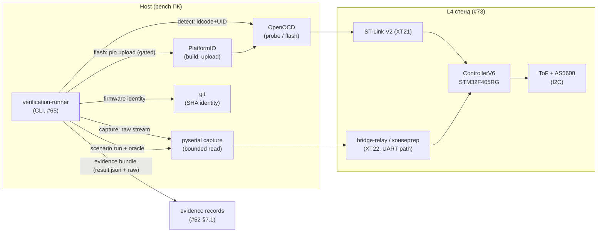
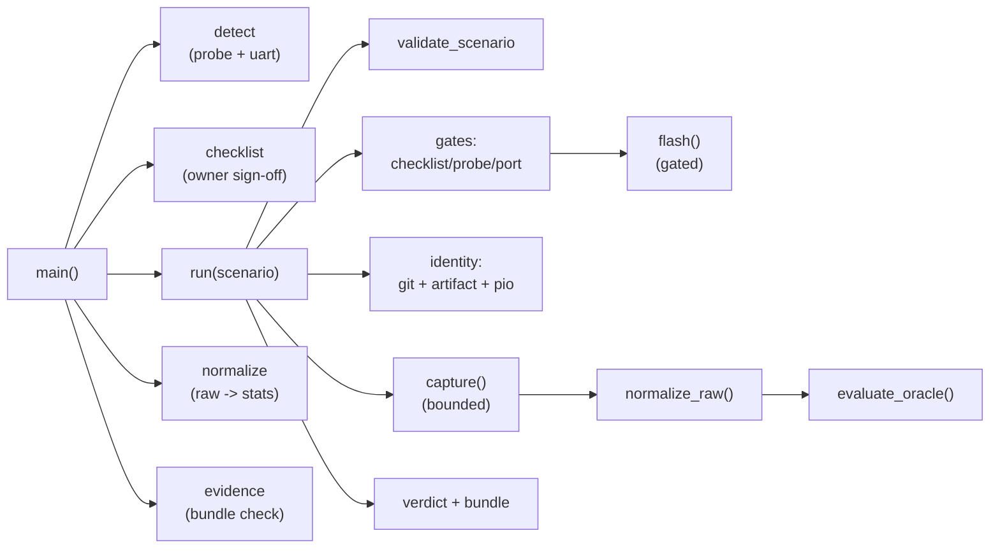
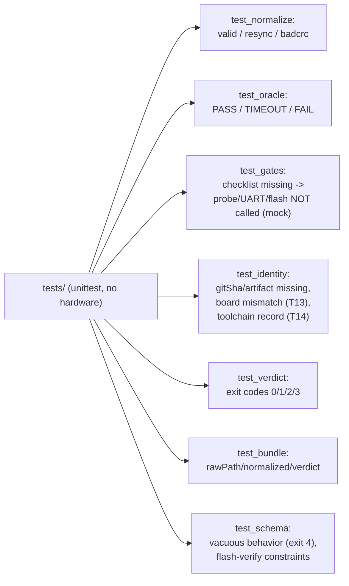

# Дизайн production verification runner (вертикальный слайс тикета #65)

Статус: **design-артефакт для тикета [«Реализовать production verification runner»](https://github.com/Driadix/ShuttleControllerV3/issues/65)**. Реализует утверждённый контракт [«Дизайн воспроизводимого L4 operator loop»](https://github.com/Driadix/ShuttleControllerV3/issues/60) (`docs/operator-loop-design-v3.md`) одним вертикальным PR: CLI, versioned scenario schema, board/port discovery, ST-Link flash, bounded execution, UART и измерительный capture, raw artifacts, normalized result, firmware/toolchain/bench identity и отказ при неполном evidence. Форматы и flow наследуют проверенный прототип `bench/operator-loop-proto/` (throwaway-ассет #60) без его simulation-хуков.

Дизайн наследует утверждённые решения и **не пересматривает** их: #60 (контракт runner'а: вердикты, identity, checklist-gate, невакуумность, границы), #52 (verification pyramid: L4/L5-исполнение, evidence records §7.1), #73/`docs/l4-sensor-bench-v3.md` (стенд: ControllerV6, ST-Link V2, COM9 relay-дисплей, frozen toolchain), #51 (engineering baseline: структура репо §5, пины §3, версионирование §10), #43/#48 (measurement obligations, бюджеты), #70 (host-часть merged; T16 L4 smoke ждёт runner после observability). Термины  -  канонические из `CONTEXT.md`.

## 0. Решения владельца (HITL-брифинг тикета #65)

Решения приняты владельцем 2026-08-13 в брифинге тикета #65 (см. resolution-комментарий):

1. **Валидация схем  -  stdlib-only, без jsonschema-зависимости.** Схемы `schemas/scenario-v1.json` / `schemas/result-v1.json` остаются нормативными контрактными документами; исполняемая валидация  -  явные проверки в `runner.validate_scenario()` с точными сообщениями об ошибках (наследуют проверенный набор прототипа `load_scenario`). Основание: схема v1 мала и статична, ноль новых зависимостей в bench tooling, проверки unit-тестируемы (T11/T12), сообщения оператору читаемее, чем у generic-валидатора; дрейф «схема-документ ↔ проверки» закрывается тестами, валидирующими сценарии из `scenarios/` против схемы. Альтернатива B (pin `jsonschema==4.x`, исполнение схем) отклонена: добавляет зависимость и поверхность установки ради ~30 строк проверок.
2. **`--no-flash` (dry-demo хук прототипа) в production НЕ входит.** Управление flash-шагом  -  только `scenario.flash.required` (сценарий `uart-probe`  -  `required: false` покрывает прогоны без flash). Основание: контракт #60 §4.2.4 «никаких путей фейка»; `--no-flash`  -  механизм демонстрации без железа, в production не нужен, его наличие создаёт легальный путь «скрыть» flash-шаг из evidence.
3. **Тесты  -  stdlib `unittest`, запуск документированной локальной командой; CI-job runner'а откладывается.** Прототип-контракт #60 §7.3 упоминал «CI job», но по baseline #51 §1 production-каркас CI материализуется после достижения Destination; `.github/workflows/` в репо отсутствует. Решение: host-тесты T1-T12 исполняются локально через `.venv-pio312` одной документированной командой (README); добавление CI-job для runner'а  -  с production-каркасом (Semantic-класс по #51 §3).
4. **Пути в JSON-артефактах  -  POSIX-стиль (`Path.as_posix()`)** для `rawPath`/`resultPath`. Основание: evidence-потребители (#52 §7.1, gate-тикеты) могут читать bundle с любой ОС; прототип в live-evidence записал `rawPath` с обратными слэшами Windows, а `resultPath` в POSIX  -  несогласованность, фиксируется в production. Локальная файловая система не затрагивается (только строки в JSON).
5. **Bench-identity контракт** (по результатам независимого review прототипа, закрывает Acceptance «identity mismatch → non-pass»): сценарий обязан декларировать ожидаемую identity платы  -  `identity.board.{part,uid}`; runner сравнивает результат probe с ожиданием; mismatch → `INCOMPLETE` с `boardIdentityMismatch`, в result выводятся и наблюдаемое (`board`), и ожидаемое (`boardExpected`); flash/capture не исполняются.
6. **Checklist-gate обязателен для КАЖДОГО `run`**, а не только при `flash.required`: probe выполняет `init; halt`  -  физическое взаимодействие со стендом, а #60 §0.3 требует жёсткий gate «перед любым физическим взаимодействием (probe включительно)»; условие «(если flash.required)» из §3.1 прототипа  -  дефект throwaway-runner'а, в production не наследуется. Gate закрывает и UART port check (открытие физического порта  -  взаимодействие): при непустом `missing` записывается skip-запись + `uartPort`. Standalone `detect` остаётся read-only и не гейтится (#60 §4.3).

---

## 1. Место в архитектуре

Runner  -  **host-инструмент стенда** (bench tooling, `bench/`), не firmware-модуль: исполняет operator loop вокруг физического L4-стенда и производит evidence для verification pyramid (#52). Единственный entry point операторского цикла; продукт поведения прошивки не реализует и не содержит веток, превращающих failed product behavior в pass.



| Элемент | Роль | Владение | Примечание |
| --- | --- | --- | --- |
| verification-runner | host CLI: detect/checklist/run/normalize/evidence | тикет #65 (этот PR) | единственный entry point operator loop'а |
| OpenOCD (ST-Link) | probe (idcode/UID), flash | пакет PIO (frozen, #51 §3) | `tool-openocd@3.1200.0` |
| pyserial | bounded UART capture + port check | dev-зависимость host (pin `pyserial==3.5`) | COM9 (relay) / COM29 (конвертер) |
| PlatformIO | build + upload, toolchain identity | frozen (6.1.19, #51 §3) | `upload_protocol=stlink` |
| Scenario/result schemas | контракт данных runner ↔ evidence | этот документ, §2 | `schemaVersion` 1 |

**Граница модуля (#65)**: runner + versioned scenario/result схемы + evidence bundle + host-тесты T1-T12 + README (одна команда на сценарий). НЕ входят: product behavior прошивки, CAN/timing measurement (тикет #62, L5-расширение, schemaVersion 2), embedded `FW_GIT_SHA` read-back (firmware-изменение, отдельный слайс, #51 §10), observability firmware (#72/#75), CI-workflow (решение §0.3).

**ISR/железная граница**: runner  -  host-процесс, доступа в ISR не имеет, аппаратные регистры не трогает  -  только OpenOCD-команды (probe/flash) и UART-порт. Физические операции (probe, flash, energizing)  -  строго после checklist-подписи владельца (жёсткий gate, §3.1; решение #60 §0.3).

## 2. Модели данных

Все форматы  -  JSON, типизированные fixed-width поля, версионируются целым `schemaVersion`. Аддитивные изменения  -  обратно совместимы; ломающие  -  новый major, Semantic-класс (issue 8 §9). Схемы-документы: `schemas/scenario-v1.json`, `schemas/result-v1.json` (контракт; исполняемая валидация  -  §0.1).

### 2.1 Scenario (вход, v1)

```json
{
  "schemaVersion": 1,
  "id": "flash-boot-smoke",
  "title": "Flash verify: ST-Link flash + probe alive",
  "type": "flash-verify",
  "phase": "L4",
  "identity": {
    "board": { "part": "STM32F405RG", "uid": "002900363033470336363131" }
  },
  "flash": { "required": true, "env": "firmware" },
  "capture": {
    "port": "auto",
    "baud": 230400,
    "parity": "E",
    "durationS": 15,
    "maxBytes": 2000000
  },
  "oracle": {
    "minFrames": 0,
    "maxCrcBadRatio": 1.0,
    "requirePatterns": [],
    "forbidPatterns": []
  }
}
```

| Поле | Семантика | Обязательность |
| --- | --- | --- |
| `id` | уникальный slug сценария (`^[a-z0-9-]+$`); имя файла-артефактов | да |
| `type` | `behavior` (PASS утверждает поведение: oracle невакуумен) / `flash-verify` (PASS утверждает только flash + probe-alive + полноту evidence) | да |
| `phase` | L4 / L5 (будущее) | да |
| `identity.board` | ожидаемая identity платы `{part, uid}`; сравнивается с probe (решение §0.5)  -  mismatch → non-pass | да |
| `flash.required` | false → flash-шаг пропускается (uart-probe) | да |
| `flash.env` | PlatformIO env для build+upload (`firmware`) | при required |
| `capture.port` | `auto` → порт из конфигурации стенда (COM9); явный  -  приоритет | да |
| `capture.baud/parity` | 230400 8E1 (network_bridge display profile, bench-контракт #73) | да |
| `capture.durationS` | bounded окно захвата; raw сохраняется, oracle оценивается | да |
| `capture.maxBytes` | guard объёма захвата | да |
| `oracle.minFrames` | минимум принятых кадров (valid+bad, суммарно); недостигнут → TIMEOUT | да |
| `oracle.maxCrcBadRatio` | доля битых кадров; превышение → FAIL | да |
| `oracle.requirePatterns` | regex на MSG_LOG-строки; все обязаны встретиться, иначе TIMEOUT | нет |
| `oracle.forbidPatterns` | regex; любое совпадение → FAIL | нет |

**Правило невакуумности** (контракт #60 §2.1, T11): `behavior` обязан иметь наблюдаемый позитив (`minFrames >= 1` или непустой `requirePatterns`); вакуумный oracle отклоняется schema-валидацией  -  прогон не начинается (exit 4). `flash-verify` обязан иметь `minFrames == 0` и пустые pattern-списки (T12)  -  PASS утверждает только «flash выполнен + плата жива по probe + evidence полон», не поведение (Phase-1 kernel молчит на UART, #60 §0.4).

### 2.2 Result (выход, v1)

```json
{
  "schemaVersion": 1,
  "runner": "verification-runner",
  "scenario": { "id": "flash-boot-smoke", "schemaVersion": 1 },
  "startedAt": "2026-08-13T10:25:31+00:00",
  "finishedAt": "2026-08-13T10:25:54+00:00",
  "board": { "probe": "PASS", "part": "STM32F405RG",
             "idcode": "0x100f6413", "uid": "002900363033470336363131" },
  "boardExpected": { "part": "STM32F405RG", "uid": "002900363033470336363131" },
  "uart": { "port": "COM9", "open": true, "bytes": 0 },
  "firmware": { "gitSha": "080c114edca72910d61b1836921fdddb98dd2bca",
                "gitDescribe": "080c114",
                "artifact": "firmware.bin",
                "artifactSha256": "959e234ea70cef3950d6723a6225928a42128852537d081d7dc0fd76acd46e88" },
  "toolchain": { "platformio": "6.1.19", "platform": "ststm32@17.4.0",
                 "core": "framework-arduinoststm32@4.20701.0" },
  "checklist": { "schemaVersion": 1, "signed": true, "owner": "Driadix", "at": "...",
                 "items": [{ "text": "...", "confirmed": true }] },
  "flash": { "ok": true, "env": "firmware", "durationS": 6.4 },
  "capture": { "rawPath": "out/.../raw-flash-boot-smoke.bin", "rawBytes": 0,
               "durationS": 15 },
  "normalized": { "bytes": 0, "framesValid": 0, "framesBad": 0,
                  "msgCounts": {}, "logLines": [] },
  "verdict": "PASS",
  "reasons": [],
  "evidence": { "complete": true, "missing": [], "resultPath": "out/.../result-flash-boot-smoke.json" }
}
```

Поля фиксированы контрактом #60 §2.2 (полный набор в схеме `schemas/result-v1.json`). Пути в JSON  -  POSIX-стиль (решение §0.4). `flash-boot-smoke`  -  `type: flash-verify`: PASS на молчащем UART утверждает только «flash + probe-alive + evidence полон».

**Вердикты** (контракт #60 §2.2; automated checks = evidence, не approval, #52 §7.1):

| Вердикт | Условие | Exit |
| --- | --- | --- |
| `PASS` | evidence complete + oracle удовлетворён | 0 |
| `TIMEOUT` | evidence complete, oracle не удовлетворён за окно (raw сохранён) | 2 |
| `FAIL` | evidence complete, oracle нарушен (bad CRC ratio, forbidden pattern) | 1 |
| `INCOMPLETE` | evidence не может быть полным  -  отказ | 3 |

`INCOMPLETE`  -  hard stop ДО физических операций (§3.1): отсутствие checklist-подписи, board identity (включая mismatch, решение §0.5), uart port, git SHA, artifact sha256, flash fail. Инвариант (найден в прототипе #60): **отказ блокирует side effects**  -  probe, UART port check, flash и capture не исполняются при непустом `missing`.

### 2.3 Identity records

- **Board**: `{part, idcode, uid}`  -  DBGMCU_IDCODE (0xE0042000) + UID (0x1FFF7A10, 96-bit) через OpenOCD `mdw`; данные без префикса `0x` (OpenOCD 12, gotcha #60). idcode `0x100f6413` → DEV_ID 0x413 → STM32F405RG (проверено на стенде 2026-08-13). UID уникален per-device. Ожидаемая identity декларируется сценарием (`identity.board`, решение §0.5): observed (result.board) сравнивается с expected (result.boardExpected); mismatch → `INCOMPLETE` + `boardIdentityMismatch`.
- **Firmware**: `{gitSha, gitDescribe, artifact, artifactSha256}`  -  git SHA рабочего дерева на момент build + sha256 артефакта `.pio/build/firmware/firmware.bin` (fallback: `.hex`, `.elf`). Embedded read-back (`FW_GIT_SHA`, #51 §10)  -  отдельный слайс, не в scope.
- **Toolchain**: `{platformio, platform, core}` из `pio --version` + `pio pkg list`  -  запись фактических версий: `platformio`  -  версия Core из `pio --version`; `platform`/`core`  -  версии frozen-пакетов `ststm32` / `framework-arduinoststm32` из блока `Platform ststm32` вывода `pio pkg list` (тот же пакет может стоять под другим platform с другой версией  -  native env; парсится только ststm32-блок). Сверка с пинами #51 §3  -  отдельный CI-контракт (`tools/check_toolchain.py`), runner фиксирует фактические версии (#60 §2.3; не гейтится).

### 2.4 Evidence bundle

```text
out/<scenario>-<timestamp>/
  raw-<scenario>.bin       # сырой UART-захват (первичный артефакт)
  result-<scenario>.json   # нормализованный результат + identity + verdict
  checklist.json           # подпись владельца (обязателен для КАЖДОГО run; интерактивная генерация)
```

Полнота = `missing == []`. `evidence.resultPath` вычисляется детерминированно ДО записи файла (самоописывающий путь). `out/`  -  в `.gitignore`. Подкоманда `evidence <result.json>` повторно проверяет полноту bundle (result валиден, `missing == []`, `rawPath` существует)  -  независимая проверка evidence после прогона. Потребители: evidence records (#52 §7.1), gate-тикеты (#68), nightly L4.

## 3. Трансформации

### 3.1 Операторный цикл (жёсткие gate'ы, порядок  -  инвариант)

```text
run <scenario>:
  # 0. Schema-валидация ДО любых операций (exit 4, прогон не начинается)
  validate_scenario(scenario)              # T11/T12: поведенческая невакуумность
  # 1. Checklist владельца  -  ПЕРВЫЙ и ОБЯЗАТЕЛЬНЫЙ gate для КАЖДОГО run
  #    (решение §0.6, #60 §0.3): никакое физическое взаимодействие со стендом
  #    (probe, открытие UART порта включительно) до прохождения
  need_flash = scenario.flash.required
  cl = load(checklist.json | интерактивный sign-off)
  if validate_checklist(cl) != None: missing += reason  # полная проверка формы:
                                 # {schemaVersion, signed, owner, at, items[].confirmed}
                                 # (подделка {"signed": true} не проходит)
  # 2. Board identity  -  gated: probe только при пустом missing
  if missing: board = SKIPPED; missing += boardIdentity
  else: board = stlink_probe()             # OpenOCD idcode + UID
        if probe FAIL: missing += boardIdentity
        elif board != scenario.identity.board:  # mismatch -> explicit non-pass (§0.5)
          record observed (board) + expected (boardExpected)
          missing += boardIdentityMismatch
  # 3. UART port check  -  gated (открытие порта = физическое взаимодействие)
  if missing: uart = SKIPPED; missing += uartPort
  else: uart = uart_check(port)            # open/close, baud 230400 8E1
        if not uart.open: missing += uartPort
  # 4. FLASH  -  строго после gate (hard stop, инвариант §4.2)
  if need_flash:
    if missing: record flash skipped + reason; NO flash()
    else: flash()                          # pio run -e firmware [-t upload]
  # 5. Identity firmware + toolchain (обязательное evidence; artifact создаётся
  #    build'ом на шаге 4, поэтому собирается после)
  firmware = git_identity() + artifact_sha256()
  toolchain = toolchain_identity()         # запись {platformio, platform, core}
  if not gitSha: missing += gitSha
  if not artifactSha256: missing += artifactSha256
  # 6. Capture + normalize  -  только при пустом missing (refusal: захвата нет)
  if not missing:
    raw = capture(port, durationS, maxBytes)   # bounded read
    save raw-<scenario>.bin
    norm = normalize_raw(raw)
  # 7. Полнота + вердикт
  verdict = INCOMPLETE if missing else oracle(norm)
  write result-<scenario>.json (POSIX paths)
```

Инвариант (найден в прототипе #60, зафиксирован контрактом §3.1, решения §0.5/§0.6): **никакое физическое взаимодействие со стендом (probe, UART port check включительно) не исполняется, пока evidence-gate'ы не пройдены**  -  отказ предшествует side effect'у; identity mismatch платы  -  явный non-pass. Standalone `detect`  -  read-only диагностика (транзиентный halt, без мутаций), вне прогонов gate'ом не обязывается.

### 3.2 Normalize (декодирование кадров)

Кадр стенда (bench-контракт #73, референс `bench/bridge-relay/tools/capture.py`): `0xBB 0xCC | msgID | targetID | seq | length | payload | CRC16-CCITT (init 0xFFFF, poly 0x1021, LSB-first)`; max payload 120 B (frame 128 B). Ленивый парсер с resync: не-синхронизированный байт пропускается; `length > 120` → пропуск 2 байт (resync); неполный хвост  -  останавливается. CRC-валидный кадр → `framesValid` + разбор MSG_LOG (0x10) в строки для regex-oracle; невалидный → `framesBad`. Выход: `{bytes, framesValid, framesBad, msgCounts, logLines}`.

### 3.3 Oracle

```text
frames = framesValid + framesBad
if frames < minFrames:                           -> TIMEOUT
if frames > 0 and framesBad/frames > maxCrcBadRatio: -> FAIL
if any(forbidPatterns matches any logLine):      -> FAIL
if not all(requirePatterns matches some logLine):-> TIMEOUT
-> PASS
```

`frames == 0` (silent kernel, flash-verify): ratio не вычисляется (guard `frames > 0`)  -  без guard ZeroDivisionError/NaN-семантика (дефект-класс из #60 §3.3). Reasons: пустой список на PASS; текстовые причины на TIMEOUT/FAIL; на INCOMPLETE  -  по одной строке на каждый missing-элемент.

## 4. Зависимости и контракты

### 4.1 Dependency matrix

| Компонент | Зависит от | НЕ зависит от |
| --- | --- | --- |
| runner CLI | pyserial (pin 3.5), PlatformIO (frozen), git, OpenOCD (frozen) | firmware domain, Arduino Core, RTOS, jsonschema (§0.1) |
| сценарии/схемы | JSON (stdlib) |  -  |
| evidence bundle | файловая система out-dir | CI-инфраструктура |

Enforcement: runner  -  bench tooling в `bench/`, вне domain include-lint (#51 §5.2); зависимости пинятся в `requirements.txt` (политика пинов #51 §3 применена к bench tooling); PlatformIO/OpenOCD  -  frozen пакеты #51 §3. Прогон физического сценария возможен только на стенде; host-тесты не требуют железа (моки, §7).

### 4.2 Evidence-контракт (инварианты, наследуют #60 §4.2)

1. **Полнота**: `missing == []`  -  checklist (для каждого run, решение §0.6), board identity, uart port, firmware SHA, artifact sha256, raw-артефакт записан.
2. **Отказ при неполном наборе**: `INCOMPLETE`, exit 3; на refusal-пути не исполняются операции с side effects  -  probe, UART port check, flash и capture (жёсткие gate'ы §3.1).
3. **Идентичность**: каждый прогон связывает board (idcode+UID, compare с ожиданием  -  mismatch → non-pass, решение §0.5), firmware (gitSha+sha256), toolchain (запись версий) с raw-артефактом и нормализованным результатом.
4. **Никаких путей фейка**: simulation-хуки прототипа (`--fixture`, `--simulate-board`), авто-аттестация (`--yes`) и dry-demo `--no-flash` (решение §0.2) в production НЕ входят; evidence только с живых probe/capture; подпись checklist  -  интерактивно или пред-подписанным файлом владельца. Сценарий не может превратить failed product behavior в pass.
5. **Невакуумность**: `behavior`-сценарий обязан иметь наблюдаемый позитив (§2.1, §3.3); молчание не является PASS'ом поведения.

### 4.3 Split владелец/агент (наследует #60 §4.3)

| Шаг | Исполнитель | Автоматизируемо | Примечание |
| --- | --- | --- | --- |
| Физическое подключение (ST-Link XT21, UART XT22, датчики) | владелец | нет | процедура #73 |
| Energizing + gate (напряжения 3.3V/5V, нагрев, запах) | владелец | нет | gate #73; аварийная остановка  -  правило стенда |
| Checklist-подпись per-run (все типы сценариев, §0.6) | владелец | нет | runner записывает sign-off в evidence; без подписи  -  отказ |
| Detection (idcode/UID/порт) | агент (runner) | да | в прогоне  -  после checklist-gate (§3.1); standalone `detect`  -  read-only |
| Flash (ST-Link) | агент | да | строго после подписи checklist |
| Capture/normalize/verdict/evidence | агент | да | bounded, детерминированно |

### 4.4 Границы с тикетами

- **#52**: runner  -  механизм исполнения L4/L5-сценариев и источник evidence records (§7.1); вердикт runner'а = CI-artifact (automated checks), не approval.
- **#68 (gate 1→2)**: L4-evidence gate исполняется через runner (критерии `docs/implementation-plan-v3.md` §5).
- **#70 (T16)**: host-часть закрыта (PR #88); T16 L4 smoke  -  первый `behavior`-сценарий runner'а после observability/UART-слайса (#72/#75, решение #60 §0.4).
- **#62 (CAN/timing)**: расширение сценариев секцией `measurement` (L5-фаза, schemaVersion 2); v1 не блокируется.
- **#72/#75**: наблюдаемость firmware  -  вне границы; runner готов к приёму heartbeat-паттернов через `requirePatterns`.

## 5. Shape of code (production, #65)

Программа в `bench/verification-runner/` (bench tooling; рядом с `bench/bridge-relay/`  -  конвенция карты):

```text
bench/verification-runner/
  runner.py            # CLI (detect/checklist/run/normalize/evidence), run_loop,
                       # normalize_raw, evaluate_oracle, validate_scenario, константы кадра
  scenarios/           # versioned scenario JSON (v1: uart-probe, flash-boot-smoke)
  schemas/             # scenario-v1.json, result-v1.json (нормативные контракты, §0.1)
  tools/
    probe.py           # stlink_probe (OpenOCD idcode+UID), uart_check (pyserial),
                       # kill_openocd (Windows taskkill перед probe/upload)
    flash.py           # flash_firmware (pio build + upload); импортирует kill_openocd из probe
    capture.py         # capture (bounded serial read), run_capture
    identity.py        # git_identity, artifact_sha256, toolchain_identity, utcnow
  tests/               # host-тесты (unittest): test_normalize, test_oracle, test_gates,
                       # test_identity, test_verdict, test_bundle, test_schema
  requirements.txt     # pyserial==3.5
  README.md            # одна документированная команда на сценарий
```

Уточнение против #60 §5: flash вынесен в `tools/flash.py` (PlatformIO-обёртка с side effects)  -  отдельный внешний инструмент от OpenOCD-probe; `kill_openocd` размещён в `tools/probe.py` (OpenOCD-модуль), `flash.py` импортирует его (в #60 §5 kill_openocd указан в flash.py  -  расхождение зафиксировано, причина: kill относится к OpenOCD-процессам, а не к PlatformIO); структура CLI и состав подкоманд не изменены.

### Public API (production-форма, без test-хуков)

```text
runner.py detect [--port COM9] [--no-uart]                  # board + uart identity (read-only)
runner.py checklist --owner NAME [--out FILE]               # sign-off (HITL); 0 если signed, иначе 3
runner.py run <scenario.json> [--port P] [--checklist F] [--out-dir D] [--owner NAME]
runner.py normalize <raw.bin>                               # raw -> machine-readable
runner.py evidence <result.json>                            # проверка полноты bundle
```

Exit-коды: 0 PASS, 1 FAIL, 2 TIMEOUT, 3 INCOMPLETE, 4 schema error (run не начат). `detect`: 0 ok / 3 fail. `checklist`: 0 signed / 3 unsigned. `evidence`: 0 complete / 3 incomplete (единая семантика INCOMPLETE = hard stop).

### Функции и сигнатуры (импортируемые, unit-тестируемые)

```python
# runner.py
def validate_scenario(sc: dict) -> dict            # SchemaError при нарушении (T11/T12)
def crc16(data: bytes) -> int
def decode_frames(raw: bytes) -> Iterator[tuple[int, bytes, bool]]  # (msg_id, payload, crc_ok)
def decode_log(payload: bytes) -> str
def normalize_raw(raw: bytes) -> dict              # {bytes, framesValid, framesBad, msgCounts, logLines}
def evaluate_oracle(scenario: dict, norm: dict) -> tuple[str, list[str]]  # (verdict, reasons)
def run_loop(scenario: dict, port: str, out_dir: Path,
             checklist_path: str | None = None, owner: str | None = None) -> dict
def check_evidence(result: dict, out_dir: Path) -> list[str]   # missing-список для `evidence`
def validate_checklist(cl: dict) -> str | None  # причина отказа формы или None (T7c/T7d/T7e)
def main(argv: list[str] | None = None) -> int

# tools/probe.py
def stlink_probe(timeout_s: int = 40) -> dict       # {probe, part, idcode, uid}; RuntimeError при провале
def uart_check(port: str, baud: int = 230400, parity: str = "E") -> dict  # {port, open, bytes|error}

# tools/flash.py
def kill_openocd() -> None                          # Windows: taskkill открытых инстансов
def flash_firmware(env: str = "firmware", timeout_s: int = 600) -> dict  # {ok, env, durationS}

# tools/capture.py
def capture(port: str, duration_s: float, baud: int, parity: str, max_bytes: int) -> bytes

# tools/identity.py
def git_identity() -> dict                          # {gitSha, gitDescribe}
def artifact_sha256() -> dict                       # {artifact, artifactSha256}
def toolchain_identity() -> dict                    # {platformio, platform, core} из pio --version + pkg list (запись)
def utcnow() -> str
```

**Тестируемость (patch-швы)**: `runner.py` импортирует модули (`from tools import probe, flash, capture, identity`), вызывает через модульные ссылки (`flash.flash_firmware(...)`)  -  тесты патчат `tools.probe.stlink_probe`, `tools.flash.flash_firmware` и т.д. без хук-параметров в production-API. Типизированные outcomes вместо исключений там, где отказ является ожидаемым результатом прогона (board probe → запись `{probe: FAIL}` в result); исключения  -  только для инфраструктурных сбоев вне контракта прогона.

**Изменения против прототипа**: убраны `--fixture`, `--simulate-board`, `--yes`, `--no-flash`; добавлены JSON Schema-документы, исполняемая валидация полного набора полей, `evidence` subcommand, requirements-pin, тесты T1-T12, POSIX-пути в JSON. Прототип остаётся throwaway-ассетом #60, в production не переиспользуется.

## 6. Light-визуализации

```text
run(scenario):
    validate_scenario(scenario)                     # exit 4: прогон не начинается
    gates = [(checklist if flash.required), probe_board, check_port]
    missing = [g for g in gates if not g.pass]      # порядок §3.1: checklist ПЕРВЫМ
    if scenario.flash and not missing: flash()      # hard gate
    elif scenario.flash: record_skip(missing)       # INCOMPLETE path, no side effects
    bind_identity(firmware, toolchain)              # gitSha + artifact sha256 + pio
    if not missing:                                 # refusal: no capture
        raw = capture(scenario.capture)             # bounded window, maxBytes guard
        norm = normalize_raw(raw)
    verdict = INCOMPLETE if missing else oracle(norm)
    write_bundle(scenario, raw, norm, verdict)      # POSIX paths, evidence.resultPath pre-write
```

```text
normalize_raw(raw):                     # ленивый парсер, resync на мусоре
    i = 0
    while i + HDR_LEN + 2 <= len(raw):
        if raw[i:i+2] != SYNC: i += 1; continue
        length = raw[i+5]
        if length > MAX_PAYLOAD: i += 2; continue   # resync
        if i + HDR_LEN + length + 2 > len(raw): break   # неполный хвост
        crc_ok = crc16(raw[i : i+HDR_LEN+length]) == stored
        count frame; if crc_ok and msgID == MSG_LOG: append decoded line
        i += HDR_LEN + length + 2
```

```text
oracle(scenario, norm):
    total = valid + bad
    if total < minFrames: return TIMEOUT
    if total > 0 and bad/total > maxCrcBadRatio: return FAIL
    if any(forbid in logLines): return FAIL
    if not all(require in logLines): return TIMEOUT
    return PASS
```

## 7. Тесты с call graph

### 7.1 Production call graph



### 7.2 Test call graph



### 7.3 Кейсы T1..TN (host, `.venv-pio312`, команда из README)

| Кейс | Контракт | Ожидание |
| --- | --- | --- |
| T1 normalize valid | 22 валидных кадра (сборка в тесте: 10×SENSORS+AS5600 + 2×LOG) | framesValid=22, framesBad=0, logLines разобраны (2 строки) |
| T2 normalize resync | мусор между кадрами + неполный хвост | resync, валидные посчитаны, без исключений |
| T3 normalize badcrc | повреждённые кадры (плохой CRC) | framesBad учтены, msgCounts точен |
| T4 oracle PASS | behavior: minFrames достигнут, ratio в норме | PASS, reasons=[] |
| T5 oracle TIMEOUT | behavior: minFrames не достигнут за окно | TIMEOUT, причина «frames N < minFrames M» |
| T6 oracle FAIL | ratio > maxCrcBadRatio; forbidPattern | FAIL, причины точны |
| T7 gate checklist | любой тип сценария без подписи (§0.6) | INCOMPLETE, probe/UART/flash/capture НЕ вызваны (mock assert_not_called) |
| T7b gate checklist | пред-подписанный файл без `signed: true` | INCOMPLETE + checklistSignoff, probe/UART не вызваны |
| T7c forged checklist | файл `{"signed": true}` без остальной формы | INCOMPLETE (checklistSchemaVersion), probe/UART/flash/capture не вызваны |
| T7d malformed checklist | нечитаемый JSON файла | refusal (checklistSignoff), исключение не прорывается из run_loop |
| T7e unconfirmed items | `signed: true`, но item `confirmed: false` | INCOMPLETE + checklistItemUnconfirmed |
| T8 identity | gitSha/artifactSha256 отсутствуют (мок) | missing += gitSha/artifactSha256, verdict INCOMPLETE |
| T9 verdict exit | PASS/FAIL/TIMEOUT/INCOMPLETE (моки) | main() → 0/1/2/3 |
| T10 bundle | result содержит rawPath, normalized, verdict | evidence.complete=true, missing=[], rawPath существует; `evidence` re-check → [] |
| T11 vacuous oracle | behavior: minFrames=0 + пустые patterns | SchemaError, exit 4, прогон не начинается |
| T12 flash-verify | minFrames=0 + flash ok + probe alive (моки) | PASS без утверждения поведения; нарушения (minFrames!=0 или patterns) → SchemaError |
| T13 bench identity | probe-UID/part ≠ `identity.board` (моки) | INCOMPLETE + boardIdentityMismatch; flash/capture не вызваны; board + boardExpected в result |
| T14 toolchain record | `pio --version` + `pio pkg list` (мок stdout) | запись {platformio, platform, core}; версии берутся из ststm32-блока, не native; unresolvable → None |
| T15 schema drift guard | сценарий-документ scenario-v1.json (stdlib-парсинг required-списков) | каждое schema-required поле при отсутствии → SchemaError (валидатор не слабее схемы) |
| T16 unreadable scenario | `run <missing.json>` | чистый отказ, exit 4, run_loop не вызван (без traceback) |
| T17 id slug | `id` с `/`, `\`, пробелами | SchemaError (`^[a-z0-9-]+$`), артефакты не могут выйти из bundle |

Тест-данные: сборка байтов кадров в тестах (helper `frame(msg_id, payload, corrupt=False)` повторяет `gen_fixture.py` прототипа)  -  бинарные fixture-ассеты в production не хранятся.

Property-описание (наследует #60 §7.3): (i) для pattern-free oracles вердикт не ухудшается при большем числе кадров при той же доле битых; добавление битых кадров меняет долю и может перевернуть PASS→FAIL по `maxCrcBadRatio`  -  это смена входных данных, не нарушение монотонности; с паттернами монотонность не гарантируется. (ii) полнота детерминирована при фиксированном порядке gate'ов §3.1: для одного прогона missing-множество воспроизводимо; порядок (checklist → probe → port → flash → identity) фиксирован и не переупорядочивается.

## 8. Vertical slice граница (#65)

**Наблюдаемый контракт** (Acceptance тикета): representative сценарий на начальном сенсорном стенде запускается одной документированной командой и создаёт проверяемый, повторяемый evidence bundle; ошибки подключения, flash, timeout, malformed output и identity mismatch дают явный non-pass.

**Входит в PR #65**: CLI (detect/checklist/run/normalize/evidence), versioned scenario/result схемы v1, board/port discovery, ST-Link flash (gated), bounded capture, raw-артефакты, normalized result, identity binding (board compare + firmware + toolchain record), refusal paths (INCOMPLETE, exit 3, без side effects), schema-валидация (exit 4), host-тесты T1-T14, README (одна команда), сценарии v1 (`uart-probe`, `flash-boot-smoke`), `out/` в `.gitignore` (уже есть), requirements-pin.

**Gate**: T16 L4 smoke исполним через runner после observability/UART-слайса (#72/#75, решение #60 §0.4); результат runner'а  -  вход gate 1→2 (#68). Приёмка этого PR на стенде  -  `flash-boot-smoke` live-run с attestation владельца (checklist-подпись), evidence в `out/` (не в git).

**НЕ входит**: product behavior, CAN/timing measurement (L5/#62, schemaVersion 2), embedded FW_GIT_SHA read-back, observability firmware (#72/#75), CI-workflow (решение §0.3).

## 9. Трассировка obligations

| Obligation/требование | Закрытие через runner (#65) |
| --- | --- |
| #60 контракт operator loop (§0-§7) | реализуется этим PR: вердикты, identity (board compare + toolchain record), checklist-gate (все типы run), невакуумность, границы  -  тесты T1-T14 |
| #52 §7.1 evidence records | runner-результат = CI-artifact/measurement report источник (evidence bundle, `evidence` subcommand) |
| #52 §2 L4 nightly (bounded steps, журналы, verified-boot smoke) | nightly-сценарии runner'а (v1  -  UART-capture-only; measurement-расширение #62) |
| #70 T16 L4 smoke + observed maxima | первый `behavior`-сценарий после #72/#75 (heartbeat-паттерн через `requirePatterns`) |
| #68 gate 1→2 | L4-evidence через runner (gate-критерии `docs/implementation-plan-v3.md` §5) |
| #73 bench-контракт (порты, baud 230400 8E1, кадровый формат, gate) | фиксируется в scenario defaults и кадровом декодере (§2.1, §3.2) |
| #49 observability evidence (сырые логи как трассы) | raw-артефакт bundle (первичный источник) |
| #51 §3 pins | pyserial pin в requirements.txt; PlatformIO/OpenOCD  -  frozen пакеты |
| #51 §5 структура репо | runner  -  bench tooling в `bench/`, вне domain include-lint |
| #51 §10 FW_GIT_SHA embedding | release-путь, read-back  -  отдельный слайс (не в scope) |

## 10. Assumptions / Unknowns / Confidence

- **Fact**: прототип #60 проверен на офф-бенче (PASS/TIMEOUT/FAIL/INCOMPLETE с корректными exit-кодами) и на стенде 2026-08-13 (flash-boot-smoke PASS, uart-probe TIMEOUT, evidence `bench/operator-loop-proto/evidence/`); живой probe даёт idcode `0x100f6413` + UID; отказ-gate (flash skipped при неполном evidence) исправлен и перепроверен.
- **Fact**: плата стенда исполняет production kernel #70; UART молчит (Ф1 no-op события)  -  поведенческие сценарии ждут #72/#75 (#60 §0.4).
- **Fact**: `.venv-pio312`  -  рабочий venv (Py 3.11, pyserial 3.5); `pio run -e firmware` кэширован ~2.3 s.
- **Assumption**: стенд остаётся как в #73 (COM9 relay-дисплей; COM29 Prolific  -  альтернатива, не проверена); 230400 8E1  -  единственный UART-контракт network_bridge на этом стенде.
- **Assumption**: `pyserial==3.5` pin достаточен для воспроизводимости bench tooling (политика #51 §3 применена по аналогии с firmware-пинами).
- **Unknown**: поведение UID-read на других экземплярах платы (валидировано на одном); фактическая частота malformed/битых кадров на длинных прогонах (oracle-пороги v1  -  из #60).
- **Confidence**: высокая для flow-механики и форматов (проверено прототипом + live evidence); средняя для production-hardening (полная валидация, тесты, pins)  -  закрывается независимым review этого PR.

## 11. Условия пересмотра

- Переход к L5/HIL: measurement-секция, CAN/timing-источники (#62)  -  schemaVersion 2, аддитивно.
- Изменение bench-топологии (порты, бод, кадровый формат)  -  rebaseline bench-контракта (#73).
- Embedded FW_GIT_SHA read-back (release-артефакты, #51 §10)  -  расширение identity-контракта.
- Обновление pyserial/OpenOCD/PlatformIO  -  политика пинов #51 §3 (Semantic-класс).
- Появление второго экземпляра платы с расходящимся UID/идентичностью  -  калибровка identity-контракта.
- Дрейф «schema-документ ↔ исполняемая валидация» (новые сценарии проходят, а схема не обновлена)  -  тест-валидация сценариев против схем (§0.1) даёт сигнал к пересмотру.

## 12. Ссылки

- Тикет #65 (этот), #60 (контракт operator loop, дизайн `docs/operator-loop-design-v3.md`), #68 (gate 1→2), #70 (T16 L4 smoke), #73 (начальный L4 стенд, bench record), #62 (CAN/timing оснастка), #52 (verification pyramid, §6.3/§7.1), #51 (engineering baseline, §3 pins, §5 структура, §10 версионирование), #43/#48 (границы, measurement obligations).
- `docs/l4-sensor-bench-v3.md` (стенд, gate, процедура, эталонные команды), `docs/verification-strategy-v3.md` (§6.3, §7.1), `docs/engineering-and-release-baseline-v3.md` (§3-5), `docs/implementation-plan-v3.md` (§5 rollout criteria).
- Референс декодирования кадров: `bench/bridge-relay/tools/capture.py`; throwaway-прототип: `bench/operator-loop-proto/` (proto_runner.py, gen_fixture.py, scenarios/, fixtures/, evidence/).
